```r
library(TDA)
library(tdaTS) #our package
library(tibble)
library(plotly) #3D plotting
library(fields) #image.plot function
library(evd) #gumbel
```


# Objective

We already explored the shape of the persistence diagram and of the barcodes. A recent [paper](https://www.nature.com/articles/s41598-023-37842-2) proposed a universal distribution of noise for the radio death/birth. We simulate different types of data to reveal the Gumbel shape of the this distribution and hope to be able to discriminate between this shape and the true signal.

# Simple tests 


```r
myplots <- function(data, complex = "alpha", breaks = 100, normalization = 1/2)
{
  if(complex == "alpha")
  {
      DiagAlphaCmplx <- alphaComplexDiag(X = data,
                                     library = c("GUDHI", "Dionysus"),
                                     location = TRUE)
  }
  if(complex == "rips")
  {
      DiagAlphaCmplx <- ripsDiag(X = data,
                                maxdimension = 1,
                                maxscale = 0.5,
                                dist = "euclidean",
                                library = c("GUDHI", "Dionysus"),
                                location = TRUE)
  }
  
  opar <- par(no.readonly = TRUE)
  par(mfrow = c(1,2), mar=c(1,2,1,0), mgp=c(1.5,0.5,0))
 
  plot(DiagAlphaCmplx$diagram, barcode = TRUE)
  plot(data, col = 1,xaxt="n", yaxt="n",xlab="", ylab="", asp = 1)
  one <- which(DiagAlphaCmplx[["diagram"]][, 1] == 1)
  for (i in seq(along = one))
  {
  for (j in seq_len(dim(DiagAlphaCmplx[["cycleLocation"]][[one[i]]])[1])){lines(DiagAlphaCmplx[["cycleLocation"]][[one[i]]][j, , ] + rnorm(n = 4,sd = 0.0),cex = 1, col = i + 1)}
  }
  par(opar)
  
  diagALPHA <- DiagAlphaCmplx$diagram
  sel <- diagALPHA[,1] == 1
  res <- diagALPHA[sel,3]/diagALPHA[sel,2]
  
  
gumbel <- normalization*(log(log(res)) - mean(log(log(res)))) + digamma(1)
hist(gumbel, breaks = breaks, probability = TRUE,xlim = c(min(gumbel), max(gumbel)+0.5))

x2 <- seq(min(gumbel), max(gumbel)+0.5, length = 1000)
fun <- exp(x2 - exp(x2))
lines(x2, fun, col = 2, lwd = 2)
  
  return(list(diagram = DiagAlphaCmplx$diagram, maxValue = max(gumbel)))
}
```


## Square with a hole


```r
data <- data2D_pointSquareHole(5000, 0.075)
pl <- myplots(data); pl$maxValue
```

<!-- -->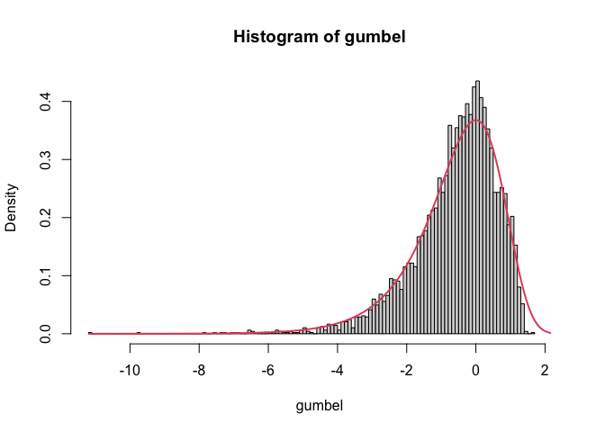<!-- -->

```
## [1] 1.698904
```

```r
data <- data2D_pointSquareHole(5000, 0.15)
pl <- myplots(data); pl$maxValue
```

<!-- -->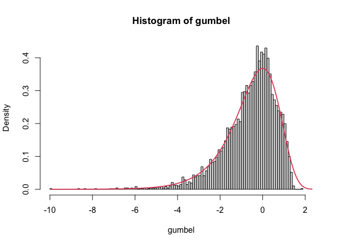<!-- -->

```
## [1] 1.819073
```

```r
data <- data2D_pointSquareHole(5000, 0.3)
pl <- myplots(data); pl$maxValue
```

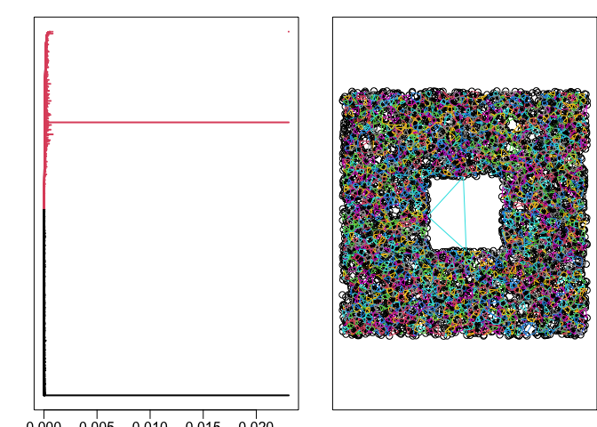<!-- --><!-- -->

```
## [1] 1.950714
```


## Different sampling with a hole


```r
data <- data2D_pointSquareHole(50, 0.3)
pl <- myplots(data); pl$maxValue
```

<!-- -->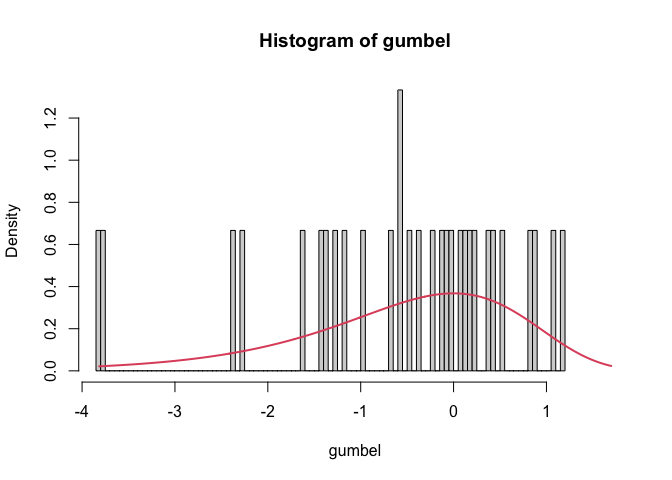<!-- -->

```
## [1] 1.472017
```

```r
data <- data2D_pointSquareHole(500, 0.3)
pl <- myplots(data); pl$maxValue
```

<!-- -->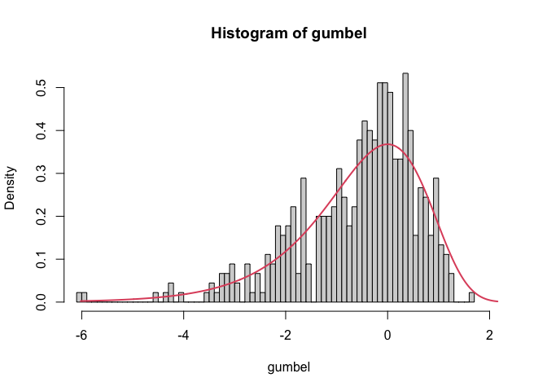<!-- -->

```
## [1] 1.620853
```

```r
data <- data2D_pointSquareHole(5000, 0.3)
pl <- myplots(data); pl$maxValue
```

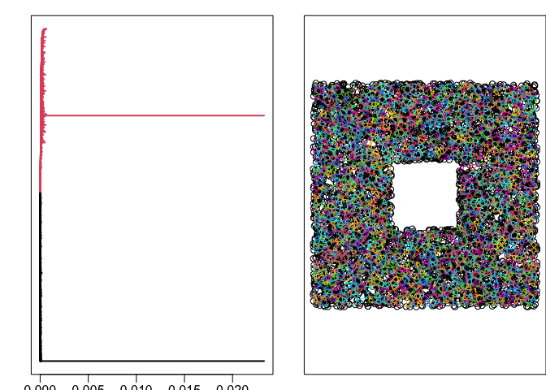<!-- -->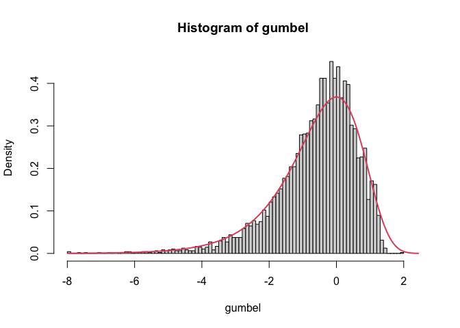<!-- -->

```
## [1] 1.955107
```


## Different sampling when no hole


```r
data <- data2D_pointSquareHole(100, 0)
pl <- myplots(data); pl$maxValue
```

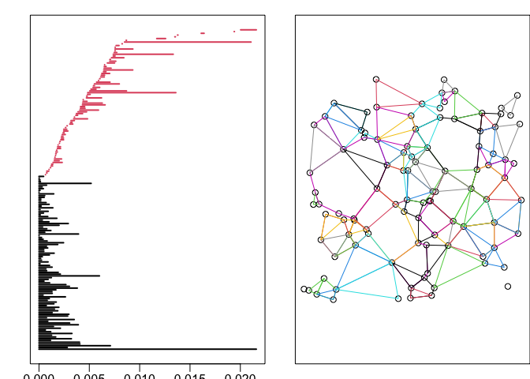<!-- -->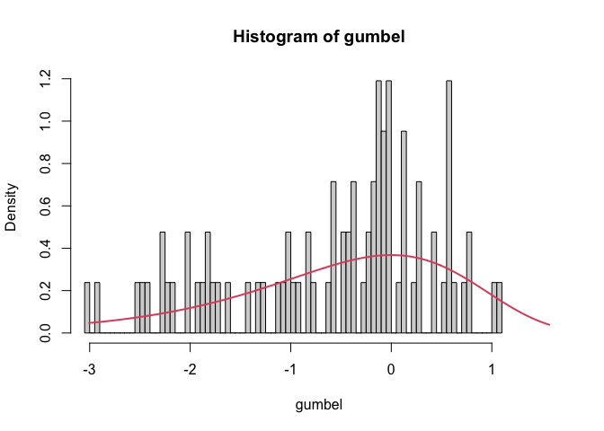<!-- -->

```
## [1] 1.204325
```

```r
data <- data2D_pointSquareHole(300, 0)
pl <- myplots(data); pl$maxValue
```

<!-- -->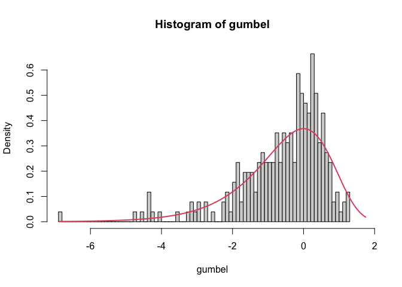<!-- -->

```
## [1] 1.333185
```

```r
data <- data2D_pointSquareHole(1000, 0)
pl <- myplots(data); pl$maxValue
```

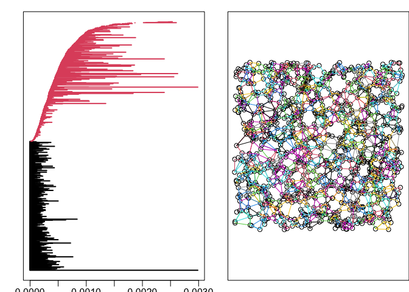<!-- --><!-- -->

```
## [1] 1.455352
```


## Circle with additional Gaussian noise


```r
data<- data2D_pointCircleGap(100, 0)
data$x <- data$x + rnorm(n= 100, mean = 0, sd = 0.1)
data$y <- data$y + rnorm(n = 100, mean = 0, sd = 0.1)
pl <- myplots(data); pl$maxValue
```

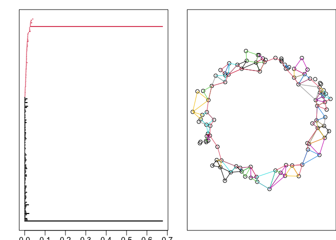<!-- --><!-- -->

```
## [1] 1.828586
```

```r
data <- data2D_pointCircleGap(100, 0.1)
data$x <- data$x + rnorm(n= 100, mean = 0, sd = 0.1)
data$y <- data$y + rnorm(n = 100, mean = 0, sd = 0.1)
pl <- myplots(data); pl$maxValue
```

<!-- -->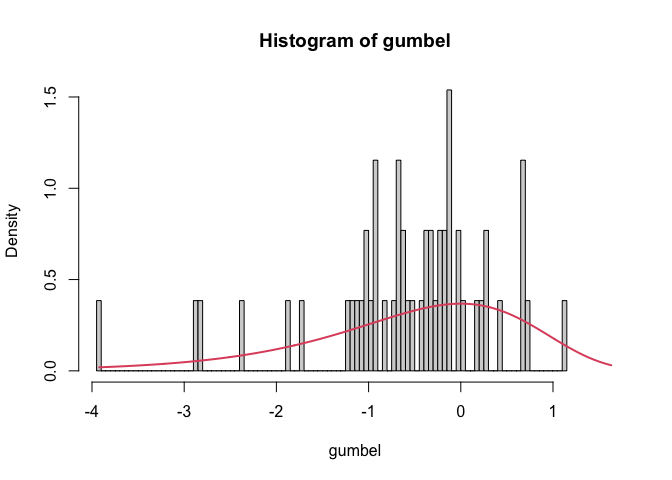<!-- -->

```
## [1] 1.747761
```

```r
data <- data2D_pointCircleGap(100, 0.2)
data$x <- data$x + rnorm(n= 100, mean = 0, sd = 0.1)
data$y <- data$y + rnorm(n = 100, mean = 0, sd = 0.1)
pl <- myplots(data); pl$maxValue
```

<!-- -->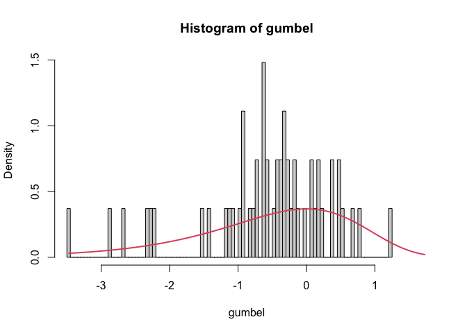<!-- -->

```
## [1] 1.003623
```

```r
data <- data2D_pointCircleGap(100, 0.3)
data$x <- data$x + rnorm(n= 100, mean = 0, sd = 0.1)
data$y <- data$y + rnorm(n = 100, mean = 0, sd = 0.1)
pl <- myplots(data); pl$maxValue
```

<!-- -->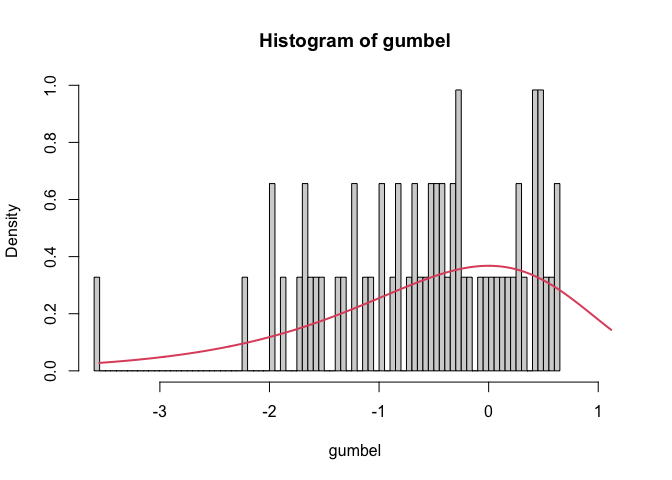<!-- -->

```
## [1] 1.271927
```

# Comparing different noise 

Gaussian versus Uniform noise 500 data points


```r
data<- data2D_pointSquareHole(500, 0)
pl <- myplots(data); pl$maxValue
```

<!-- --><!-- -->

```
## [1] 1.302771
```

```r
data<- data.frame(matrix(0, nrow = 500, ncol = 2))
colnames(data) <- c("x", "y")
data$x <- data$x + rnorm(n= 500, mean = 0, sd = 10)
data$y <- data$y + rnorm(n = 500, mean = 0, sd = 10)
pl <- myplots(data); pl$maxValue
```

<!-- --><!-- -->

```
## [1] 1.306389
```

Gaussian versus Uniform noise 10000 data points


```r
data<- data2D_pointSquareHole(10000, 0)
pl <- myplots(data); pl$maxValue
```

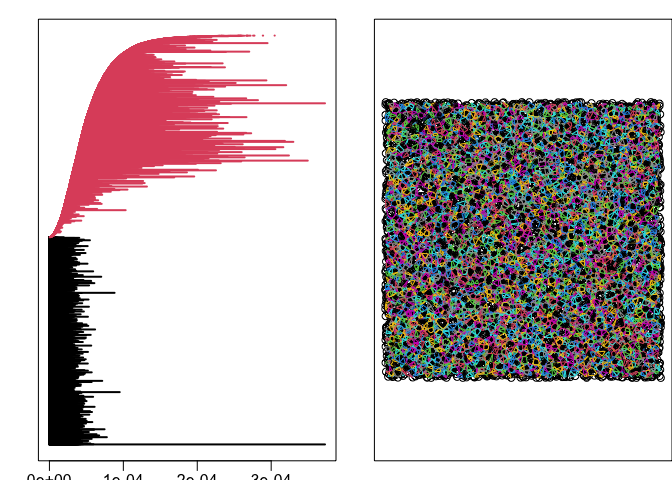<!-- -->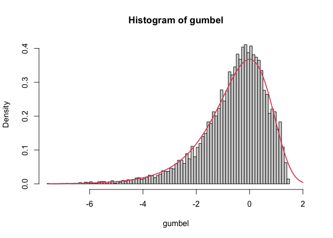<!-- -->

```
## [1] 1.503046
```

```r
data<- data.frame(matrix(0, nrow = 10000, ncol = 2))
colnames(data) <- c("x", "y")
data$x <- data$x + rnorm(n= 10000, mean = 0, sd = 10)
data$y <- data$y + rnorm(n = 10000, mean = 0, sd = 10)
pl <- myplots(data); pl$maxValue
```

<!-- --><!-- -->

```
## [1] 1.466386
```

The Square with a hole? 


```r
pl <- myplots(data); pl$maxValue
```

<!-- --><!-- -->

```
## [1] 1.466386
```


The circle closed + small noise


```r
data <- data2D_pointCircleGap(10000, 0)
data$x <- data$x + rnorm(n= 10000, mean = 0, sd = 0.01)
data$y <- data$y + rnorm(n = 10000, mean = 0, sd = 0.01)
pl <- myplots(data); pl$maxValue
```

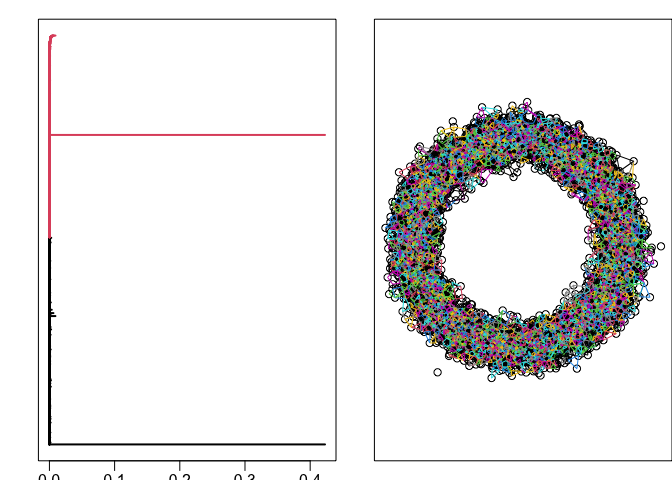<!-- -->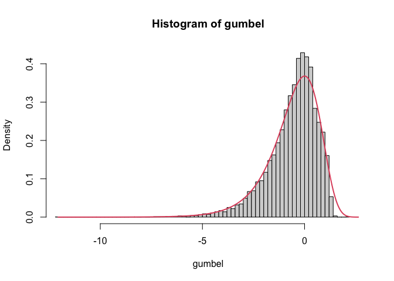<!-- -->

```
## [1] 2.308892
```


# No Gumbel...


```r
data <- data2D_pointSquareHole(30000, 0)

DiagAlphaCmplx <- alphaComplexDiag(X = data,
                                   library = c("GUDHI"),
                                   location = TRUE)
diagALPHA <- DiagAlphaCmplx$diagram
dim(diagALPHA)
```

```
## [1] 59844     3
```

```r
sel <- diagALPHA[,1] == 1
sum(sel)
```

```
## [1] 29844
```

```r
res <- diagALPHA[sel,3]/diagALPHA[sel,2]
normalization <- 0.5
gumbel <- normalization*(log(log(res)) - mean(log(log(res)))) + digamma(1)
max(gumbel)
```

```
## [1] 1.48753
```

```r
hist(gumbel, breaks = 200, probability = TRUE,xlim = c(min(gumbel), max(gumbel)+1))

x2 <- seq(min(gumbel), max(gumbel)+1, length = 1000)
fun <- exp(x2 - exp(x2))
lines(x2, fun, col = 2, lwd = 2)
```

<!-- -->


# TDAstats package


```r
library(TDAstats)

pvalue <- rep(0,100)
gap <- 0.3
nb <- 300

for(i in 1:100)
{
  data <- data2D_pointSquareHole(nb, gap)
  diagALPHA <- calculate_homology(data, dim = 1)
  sel <- diagALPHA[,1] == 1
  res <- diagALPHA[sel,3]/diagALPHA[sel,2]
  gumbel <- log(log(res)) - mean(log(log(res))) + digamma(1)
  
  pvalue[i] <- exp(-exp(max(gumbel))) 
}

hist(pvalue, breaks = 20, xlim=c(0,1))
abline(v = 0.05)
```

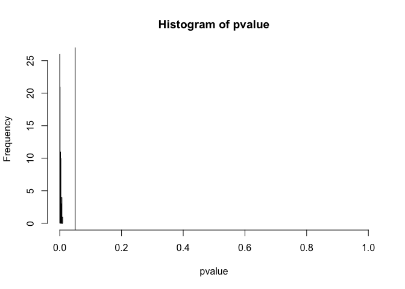<!-- -->

```r
sum(pvalue < 0.005) #how many time we "see" the hole
```

```
## [1] 99
```


```r
library(TDAstats)

pvalue <- rep(0,100)
gap <- 0
nb <- 300

for(i in 1:100)
{
  data <- data2D_pointSquareHole(nb, gap)
  diagALPHA <- calculate_homology(data, dim = 1)
  sel <- diagALPHA[,1] == 1
  res <- diagALPHA[sel,3]/diagALPHA[sel,2]
  gumbel <- log(log(res)) - mean(log(log(res))) + digamma(1)
  
  pvalue[i] <- exp(-exp(max(gumbel))) 
}

hist(pvalue, breaks = 20, xlim=c(0,1))
abline(v = 0.05)
```

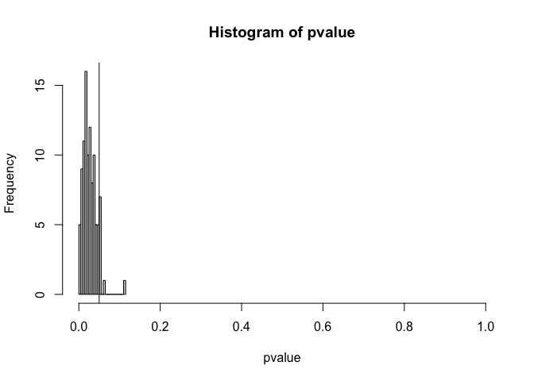<!-- -->

```r
sum(pvalue < 0.005) #how many time we "see" the hole
```

```
## [1] 6
```


```r
pvalues <- rep(0,600)
index <- (floor(0:599/100)+1)

for(i in 1:600)
{
  j <- index[i]
  data <- data2D_pointCircleGap(j*100, 0.1)
  data$x <- data$x + rnorm(n= j*100, mean = 0, sd = 0.05)
  data$y <- data$y + rnorm(n = j*100, mean = 0, sd = 0.05)
  #plot(data)
  diagALPHA <- calculate_homology(data, dim = 1)
  sel <- diagALPHA[,1] == 1
  res <- diagALPHA[sel,3]/diagALPHA[sel,2]
  gumbel <- log(log(res)) - mean(log(log(res))) + digamma(1)
  pvalues[i] <- exp(-exp(max(gumbel)))
}

plot(pvalues, type = 'l')
```

<!-- -->

```r
plot(log(pvalues), type = 'l')
```

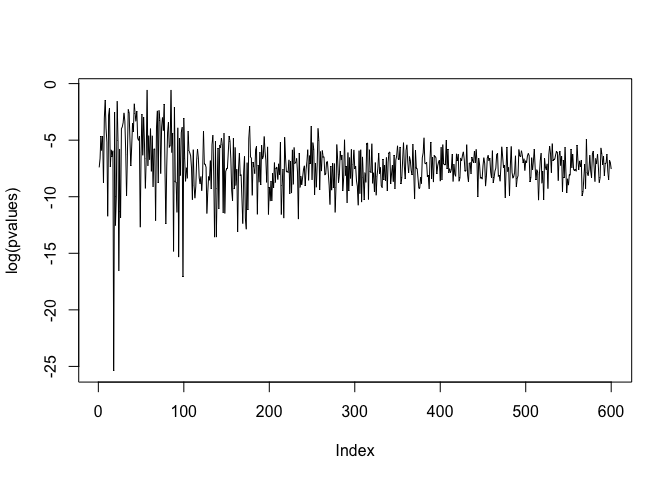<!-- -->


