```r
library(TDA)
library(tdaTS) #our package
library(tibble)
library(plotly) #3D plotting
library(fields) #image.plot function
```


# Objective


We propose to compare the persistence diagram or the barcodes of data generated with the same topology.

We need to find a distance between barcodes close to zero even when the barcodes look different (after some kind a rescaling...)

# Detecting a hole (H1)


```r
myplots <- function(data, complex = "alpha")
{
  if(complex == "alpha")
  {
      DiagAlphaCmplx <- alphaComplexDiag(X = data,
                                     library = c("GUDHI", "Dionysus"),
                                     location = TRUE)
  }
  if(complex == "rips")
  {
      DiagAlphaCmplx <- ripsDiag(X = data,
                                maxdimension = 1,
                                maxscale = 1,
                                dist = "euclidean",
                                library = c("GUDHI", "Dionysus"),
                                location = TRUE)
  }

  plot(DiagAlphaCmplx$diagram, barcode = TRUE)
  plot(data, col = 1,xaxt="n", yaxt="n",xlab="", ylab="", asp = 1)
  one <- which(DiagAlphaCmplx[["diagram"]][, 1] == 1)
  for (i in seq(along = one))
  {
  for (j in seq_len(dim(DiagAlphaCmplx[["cycleLocation"]][[one[i]]])[1]))
    {lines(DiagAlphaCmplx[["cycleLocation"]][[one[i]]][j, , ] + rnorm(n = 4,sd = 0.0),cex = 1, col = i + 1)}
  }
  return(DiagAlphaCmplx$diagram)
}
```


## Square and Square with a hole


## Different hole size


```r
data <- data2D_pointSquareHole(5000, 0.075)
pl <- myplots(data)
```

<!-- --><!-- -->

```r
data <- data2D_pointSquareHole(5000, 0.15)
pl <- myplots(data)
```

<!-- --><!-- -->

```r
data <- data2D_pointSquareHole(5000, 0.3)
pl <- myplots(data)
```

<!-- --><!-- -->

**CONCLUSION 1: We need a distance between barcodes, which doesn't take into account the death time of the hole (the most persistent elements).**


## Different sampling with a hole


```r
data <- data2D_pointSquareHole(50, 0.3)
pl <- myplots(data)
```

<!-- -->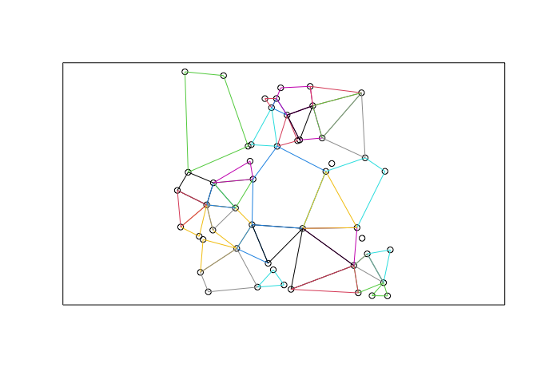<!-- -->

```r
data <- data2D_pointSquareHole(500, 0.3)
pl <- myplots(data)
```

<!-- --><!-- -->

```r
data <- data2D_pointSquareHole(5000, 0.3)
pl <- myplots(data)
```

<!-- -->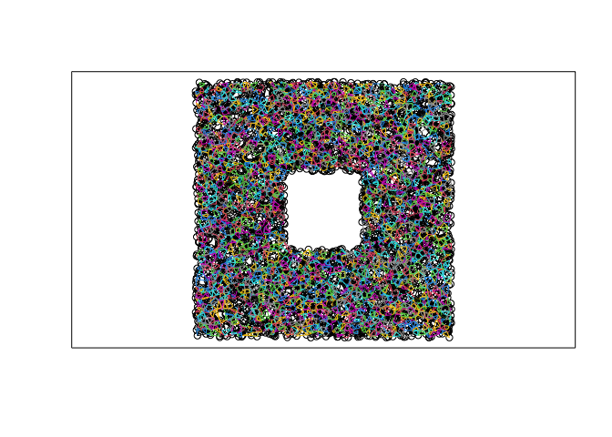<!-- -->


We need a **distance** between barcodes, which doesn't detect differences bertween the 3 barcodes.

**CONCLUSION 2: less point = less information. The distance has to take the number of points into account**

`data2D_pointSquareHole(50, 0.3)` contains a hole but we barely can see it.


## Different sampling when no hole


```r
data <- data2D_pointSquareHole(100, 0)
pl <- myplots(data)
```

<!-- --><!-- -->

```r
data <- data2D_pointSquareHole(300, 0)
pl <- myplots(data)
```

<!-- -->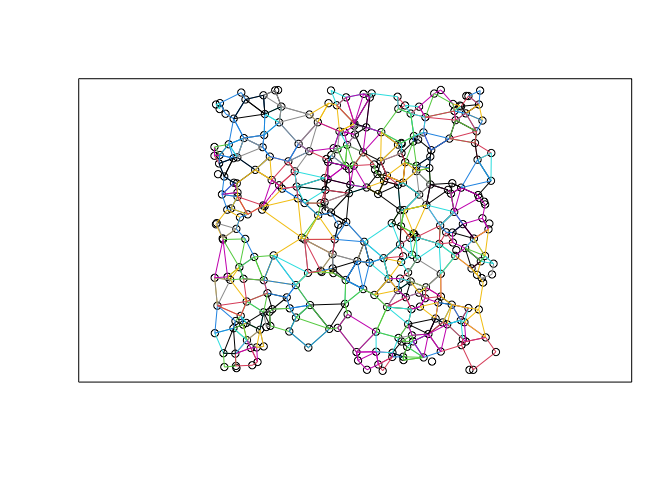<!-- -->

```r
data <- data2D_pointSquareHole(1000, 0)
pl <- myplots(data)
```

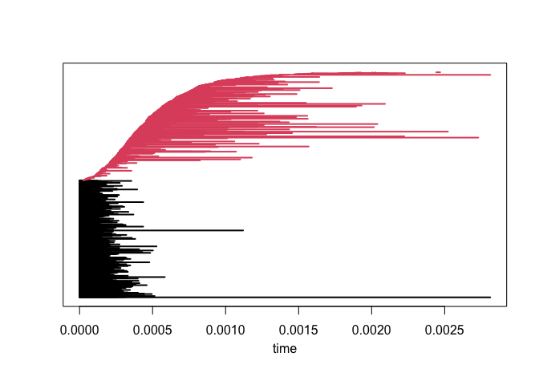<!-- --><!-- -->

**CONCLUSION 3: we see a kind of limit distribution for H1 elements...**


# Closing or not closing (a circle)


```r
data <- data2D_pointEllipseMissingArc(100, 0, 0)
pl <- myplots(data)
```

<!-- --><!-- -->

```r
data <- data2D_pointEllipseMissingArc(100, 0.05, 0)
pl <- myplots(data)
```

<!-- -->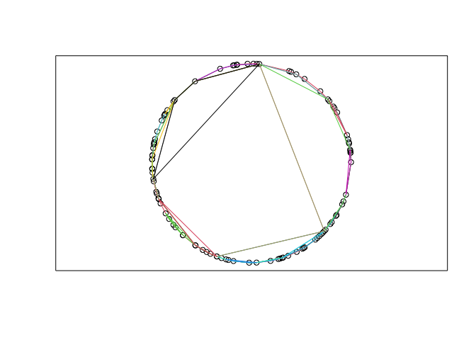<!-- -->

```r
data <- data2D_pointEllipseMissingArc(100, 0.1, 0)
pl <- myplots(data)
```

<!-- --><!-- -->

```r
data <- data2D_pointEllipseMissingArc(100, 0.3, 0)
pl <- myplots(data)
```

<!-- -->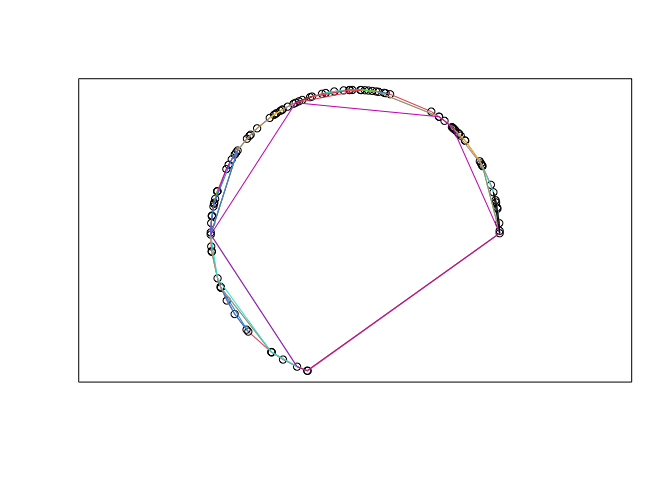<!-- -->


The same with additional Gaussian noise.


```r
data<- data2D_pointEllipseMissingArc(100, 0)
pl <- myplots(data)
```

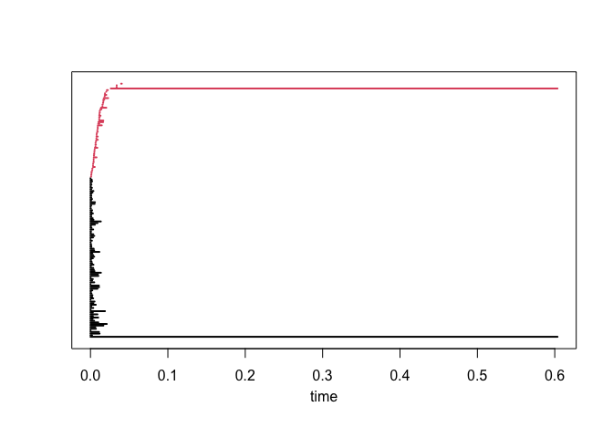<!-- --><!-- -->

```r
data <- data2D_pointEllipseMissingArc(100, 0.1)
pl <- myplots(data)
```

<!-- --><!-- -->

```r
data <- data2D_pointEllipseMissingArc(100, 0.2)
pl <- myplots(data)
```

<!-- --><!-- -->

```r
data <- data2D_pointEllipseMissingArc(100, 0.3)
pl <- myplots(data)
```

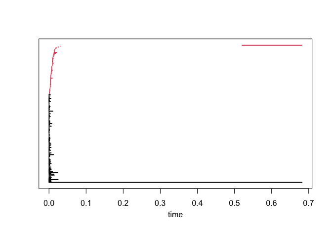<!-- --><!-- -->

If no gap, the H1 main element appears at the same time a the last fusion in H0 elements.

The bigger the gap, the bigger the delay in H1.

**CONCLUSION 4: we need a distance that is not sensitive to the gap length between fusion of all H0 and appearence of H1. It has to be only sensitive to the presence/absence of a gap.**

# Comparing different complexes


```r
data <- data2D_pointSquareHole(100,0)
pl <- myplots(data, complex = "alpha")
```

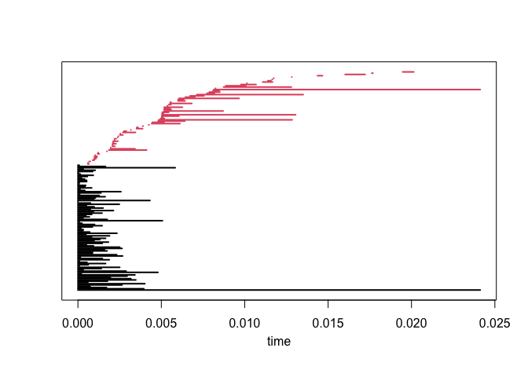<!-- --><!-- -->

```r
pl <- myplots(data, complex = "rips")
```

<!-- -->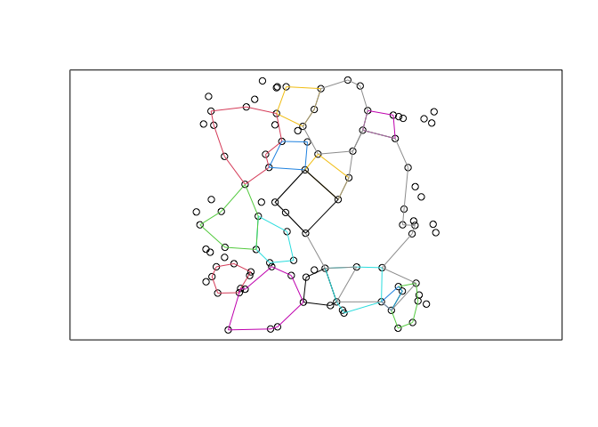<!-- -->


# Comparing different noise 

Gaussian versus Uniform noise


```r
data<- data2D_pointSquareHole(500, 0)
pl <- myplots(data, complex = "alpha")
```

<!-- --><!-- -->

```r
data<- data.frame(matrix(0, nrow = 500, ncol = 2))
colnames(data) <- c("x", "y")
data$x <- data$x + rnorm(n= 500, mean = 0, sd = 10)
data$y <- data$y + rnorm(n = 500, mean = 0, sd = 10)
pl <- myplots(data, complex = "alpha")
```

<!-- -->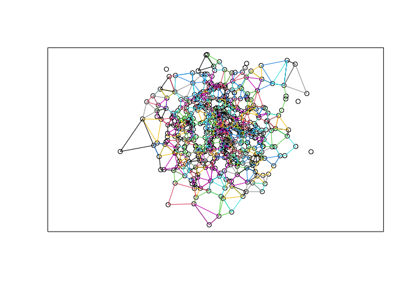<!-- -->

Alpha diagrams (Rips doesn't work...)


```r
data<- data2D_pointSquareHole(10000, 0)
diag1 <- myplots(data)
```

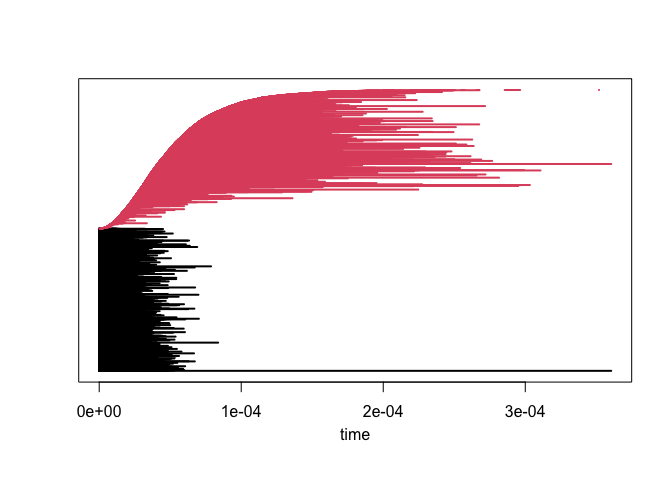<!-- -->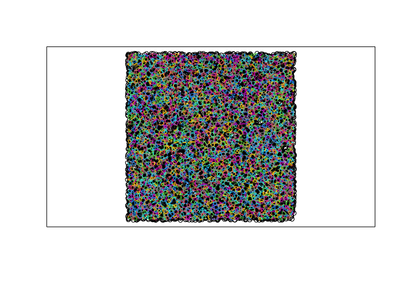<!-- -->

```r
data<- data.frame(matrix(0, nrow = 10000, ncol = 2))
colnames(data) <- c("x", "y")
data$x <- data$x + rnorm(n= 10000, mean = 0, sd = 10)
data$y <- data$y + rnorm(n = 10000, mean = 0, sd = 10)
diag2 <- myplots(data)
```

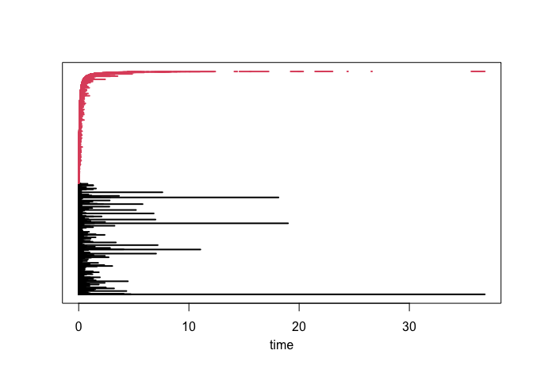<!-- -->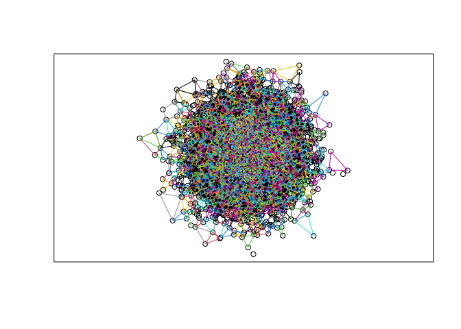<!-- -->


```r
sel <- diag1[,1] == 1
res1 <- diag1[sel,3]/diag1[sel,2]
sel <- diag2[,1] == 1
res2 <- diag2[sel,3]/diag2[sel,2]
```

Gumbel distribution? 


```r
hist(log(log(res1)) - mean(log(log(res1))), breaks = 200)
```

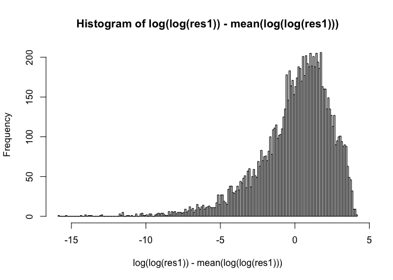<!-- -->

```r
hist(log(log(res2))- mean(log(log(res1))), breaks = 200)
```

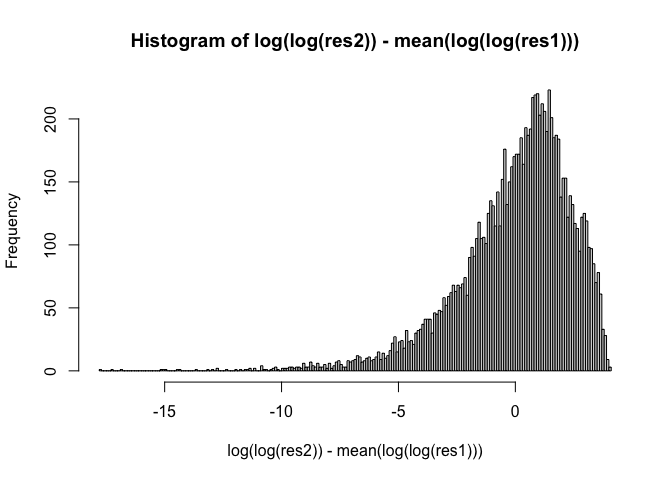<!-- -->


Max values

```r
max(res1)
```

```
## [1] 9.794888
```

```r
max(res2)
```

```
## [1] 8.606598
```

The Square with a hole? 


```r
data <- data2D_pointSquareHole(10000, 0.3)
diag3 <- myplots(data)
```

<!-- --><!-- -->

```r
sel <- diag3[,1] == 1
res3 <- diag3[sel,3]/diag3[sel,2]
hist(log(log(res3)) - mean(log(log(res3))), breaks = 200)
```

<!-- -->

Max value

```r
max(res3)
```

```
## [1] 646.2998
```


The circle closed + small noise


```r
data <- data2D_pointEllipseMissingArc(10000, 0, 0.01)
diag3 <- myplots(data)
```

<!-- -->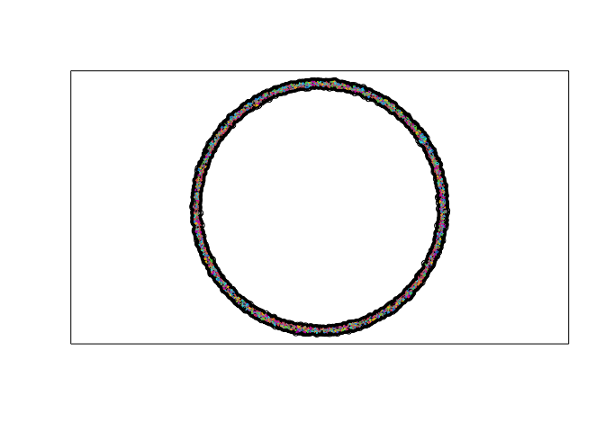<!-- -->

```r
sel <- diag3[,1] == 1
res3 <- diag3[sel,3]/diag3[sel,2]
hist(log(log(res3)) - mean(log(log(res3))), breaks = 200)
```

<!-- -->

Max value

```r
max(res3)
```

```
## [1] 28056.44
```


The circle not closed + small noise


```r
data <- data2D_pointEllipseMissingArc(10000, 0.03, 0.01)
diag3 <- myplots(data)
```

<!-- --><!-- -->

```r
sel <- diag3[,1] == 1
res3 <- diag3[sel,3]/diag3[sel,2]
hist(log(log(res3)) - mean(log(log(res3))), breaks = 200)
```

<!-- -->

Max value

```r
max(res3)
```

```
## [1] 163.1695
```


# Conclusions

We need a distance between barcodes, which doesn't take into account the death time of the hole (the most persistent elements)

The distance should be focused on what's happening just after H0 fusions: presence or absence of a gap between main fusions and appearence og H1 elements.

less point = less information. The distance has to take the quantiy of information into account


