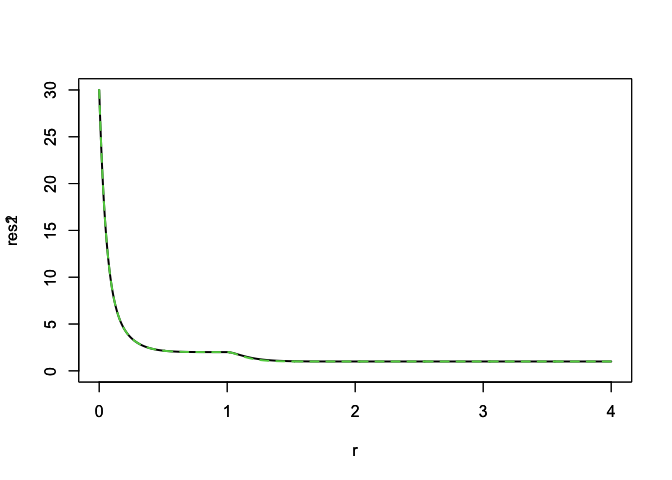
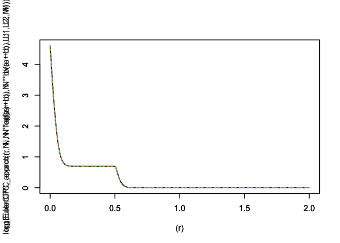
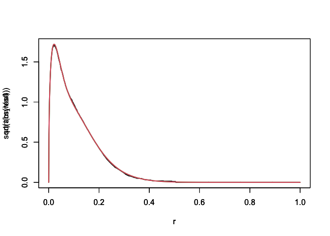

```r
library(TDA)
library(tdaTS) #our package
library(tibble)
```


# Expectation for the Euler Curve

We generate data with a Uniform distribution over 2 segments.


```r
data <- dataUniform(1000)
```


```r
N1 <- 20
N2 <- 10
N <- N1 + N2
L1 <- 2
L2 <- 3
M <- 2

r <- seq(0,M + min(c(L1,L2)),length.out = 1000)
res1 <- EulerCPC_exact(r, N = N, N1 = N1, N2 = N2, L1 = L1, L2 = L2, M = M)
res2 <- EulerCPC_approx(r, N = N, N1 = N1, N2 = N2, L1 = L1, L2 = L2, M = M)
theMax <- max(res1,res2)
plot(r,res1, type = 'l', col = 1, lwd = 2, ylim = c(0,theMax)) #### the true result (using the beta function)
par(new = TRUE)
plot(r,res2, type = 'l', col = 3, lwd = 2, ylim = c(0,theMax), lty = 2) #### the approximation in 0
```

<!-- -->

```r
maxRelativeError  <- max((abs(res2 - res1)/res1)[-1])
maxError <- max(abs(res2 - res1))
maxRelativeError
```

```
## [1] 0.063924
```

```r
maxError
```

```
## [1] 0.08194943
```


```r
L1 <- 2
L2 <- 1
M <- 1
N <- 100
a <- 2
b <- 2
maxX <- M + min(c(L1,L2))
y <- rep(0, 1000)
w <- rep(0, 1000)

nb <- 1000
for(i in 1:nb)
{
  data <- dataUniform(L1 = L1, L2 = L2, M = M, a = a, b = b, N = N)
  res <- sort(diff(sort(data)))
  r <- seq(0,maxX, length.out = 1000)
  yNEW <- rep(N, 1000)

  for(i in 1:1000){yNEW[i] <- yNEW[i] - sum(res <= 2*r[i])}
  y <- y + yNEW
  w <- w + yNEW^2
}

z <- y/nb

plot((r),log(z), type = 'l', lwd = 2, col = 1, ylim = log(c(1,length(data))))
par(new = TRUE)
plot((r),log(EulerCPC_exact(r,N,N*a/(a+b) ,N*b/(a+b) ,L1,L2,M)), type = 'l', ylim = log(c(1,length(data))), col = 2, lwd = 2, lty = 2)
par(new = TRUE)
plot(r, log(EulerCPC_approx(r,N,N*a/(a+b) ,N*b/(a+b) ,L1,L2,M)), type = 'l', ylim = log(c(1,length(data))), col = 3, lwd = 2, lty = 3)
```

<!-- -->

# Variance of the Euler Curve


```r
L <- 2
N <- 20
y <- rep(0, 1000)
w <- rep(0, 1000)

nb <- 10000
r <- seq(0,L/2, length.out = 1000)
for(i in 1:nb)
{
  data <- runif(N,0,L)
  res <- sort(diff(sort(data)))
  yNEW <- rep(N, 1000)
  for(i in 1:1000){yNEW[i] <- yNEW[i] - sum(res <= 2*r[i])}
  y <- y + yNEW
  w <- w + yNEW^2
}

myVar <- w/nb - (y/nb)^2
plot(r,  y/nb, type = 'l', lwd = 2)
```

<!-- -->

```r
### sqrt(VAR)/ N
res3 <- EulerCPC_VAR_exact(r,N,L)
res4 <- EulerCPC_VAR_approx(r,N,L)

yylim <-  c(0, max(sqrt(myVar),sqrt(abs(res3))))
plot(r,  sqrt(myVar), type = 'l', lwd = 2, col = 1, ylim =yylim)
par(new = TRUE)
plot(r, sqrt(abs(res3)), type = 'l', lwd = 2, col = 3, ylim = yylim)
par(new = TRUE)
plot(r, sqrt(abs(res4)), type = 'l', lwd = 2, col = 2, ylim = yylim)
```

<!-- -->


```r
max(myVar)
```

```
## [1] 2.917104
```

```r
max(res4)
```

```
## [1] 2.958066
```

```r
3*N/20
```

```
## [1] 3
```

```r
N/10
```

```
## [1] 2
```

```r
s <- 1/((10/L)*(N-1))
u <- (1-pmin(2*s/L,1))^N*(1 -(1-pmin(2*s/L,1))^N)
v <- (N-2)*((1-pmin(4*s/L,1))^N - (1-pmin(2*s/L,1))^(2*N))
(N-1)*(u+v)
```

```
## [1] 2.426463
```

```r
exp(-1/5)*(1-exp(-1/5))*(N-1)
```

```
## [1] 2.819803
```

```r
exp(-1/5 * (N)/(N-1))*(1-exp(-1/5* (N)/(N-1)))*(N-1)
```

```
## [1] 2.922241
```

```r
max(res4)
```

```
## [1] 2.958066
```


