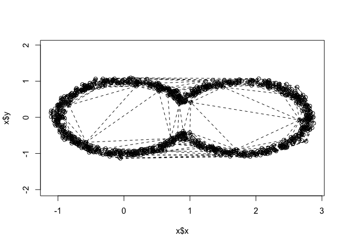

```r
library(TDA)
library(tdaTS) #our package
library(tibble)
library(interp) #delaunay triangulation
```

```
## Warning: package 'interp' was built under R version 4.2.3
```


# Delaunay triangulations


```r
n <- 1000
x <- runif(n)
y <- runif(n)
data <- data2D_pointTwoCirclesMerged(1000,overlap = 0.2)
res <- tri.mesh(x = data)
plot(res)
```

<!-- -->
