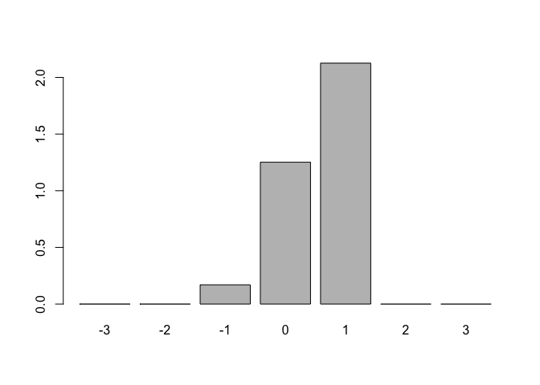
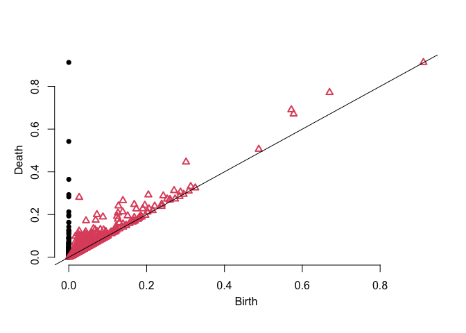
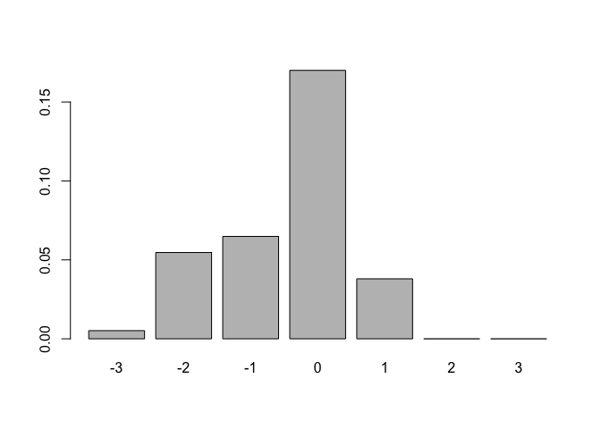

```r
library(TDA)
library(tdaTS) #our package
library(tibble)
library(plotly) #3D plotting
library(fields) #image.plot function
```


# Objective

We compute the Euler characateristic generated by the alpha complex filtration $K(r)$ (radius $r$). The goal would be to estimate the probability of the events $\{\chi(K, Q)=k\}$ for the random sample points $Q=(Q_1,...Q_N)$ drawn from a density $f$.


**In all examples, seen the H1 elements = having a persistence of the value 0 = log(0+1) in the log representation of the Euler curve**.


```r
myplots <- function(data)
{
  DiagAlphaCmplx <- alphaComplexDiag(X = data,
                                 library = c("GUDHI", "Dionysus"),
                                 location = TRUE)
  plot(data, col = 1,xaxt="n", yaxt="n",xlab="", ylab="", asp = 1)
  one <- which(DiagAlphaCmplx[["diagram"]][, 1] == 1)
  for (i in seq(along = one))
  {
  for (j in seq_len(dim(DiagAlphaCmplx[["cycleLocation"]][[one[i]]])[1]))
    {lines(DiagAlphaCmplx[["cycleLocation"]][[one[i]]][j, , ] + rnorm(n = 4,sd = 0.0),cex = 1, col = i + 1)}
  }
  plot(DiagAlphaCmplx$diagram, barcode = FALSE)
  return(DiagAlphaCmplx$diagram)
}

##########

EulerCurve <- function(data)
{
  filtre <- alphaComplexFiltration(X = data)
  r <- unique(filtre$values)
  
  new_counts <- function(filtre, i)
  {
    ret <- c(0,0,0)
    liste <- filtre$cmplx[filtre$values == r[i]]
    for(i in 1:length(liste))
      ret[length(liste[[i]])] <- ret[length(liste[[i]])] + 1
    return(ret)
  }
  

  res <- matrix(0,length(r) + 1,3)
  for(j in 1:(length(r)))
  {
    res[j+1,] <-  res[j,] + new_counts(filtre, j)
  }
  x <- r
  y <- res[-1,1]-res[-1,2]+res[-1,3]
  return(list(x=x, y=y))
}

####
plotCurve <- function(xy)
{
  x <- xy$x
  y <- xy$y
  opar <- par(no.readonly = TRUE)
  par(mfrow = c(1,2), mar=c(1,2,1,0), mgp=c(1.5,0.5,0))

  plot(log(x), log(y+1), type = 'l')
  sel <- y < 3
  x2 <- x[sel]
  y2 <- y[sel]
  plot(log(x2),y2, type = 'l')
  par(opar)
}

####

plotPersistenceValues <- function(xy)
{
  m <- length(xy$y)
  while(xy$y[m] == 1){m <- m - 1}
  m <- m + 1
  y <- xy$y[1:m]
  z <- diff(xy$x[1:(m+1)])
  x <- xy$x[1:m]
  barplot(sapply(-3:3, function(u) sum(z[y == u]*x[y == u])), names.arg = -3:3)
}

#### the 10*x gives more weight to later structures
```


# Circle tests

If no closed circle: stabilization at log(2), chi = 1.


```r
nb <- 1000
data <- data2D_pointEllipseMissingArc(nb, gap = 0.3, sdNoise = 0.5, a = 3, b= 3)

pl <- myplots(data)
```

<!-- --><!-- -->

```r
res <- EulerCurve(data)
plotCurve(res)
```

```
## Warning in log(y + 1): NaNs produced
```

<!-- -->

```r
plotPersistenceValues(res)
```

<!-- -->


```r
nb <- 1000
data <- data2D_pointEllipseMissingArc(nb, gap = 0.2, sdNoise = 0.5, a = 3, b= 3)

pl <- myplots(data)
```

<!-- --><!-- -->

```r
res <- EulerCurve(data)
plotCurve(res)
```

```
## Warning in log(y + 1): NaNs produced
```

<!-- -->

```r
plotPersistenceValues(res)
```

<!-- -->


```r
nb <- 1000
data <- data2D_pointEllipseMissingArc(nb, gap = 0.15, sdNoise = 0.5, a = 3, b= 3)

pl <- myplots(data)
```

<!-- --><!-- -->

```r
res <- EulerCurve(data)
plotCurve(res)
```

```
## Warning in log(y + 1): NaNs produced
```

<!-- -->

```r
plotPersistenceValues(res)
```

<!-- -->


```r
nb <- 1000
data <- data2D_pointEllipseMissingArc(nb, gap = 0, sdNoise = 0.5, a = 3, b= 3)

pl <- myplots(data)
```

<!-- --><!-- -->

```r
res <- EulerCurve(data)
plotCurve(res)
```

```
## Warning in log(y + 1): NaNs produced
```

<!-- -->

```r
plotPersistenceValues(res)
```

<!-- -->


With a higher variance:


```r
nb <- 1000
data <- data2D_pointEllipseMissingArc(nb, gap = 0, sdNoise = 1, a = 3, b= 3)

pl <- myplots(data)
```

<!-- --><!-- -->

```r
res <- EulerCurve(data)
plotCurve(res)
```

```
## Warning in log(y + 1): NaNs produced
```

<!-- -->

```r
plotPersistenceValues(res)
```

<!-- -->

We need to sample / use superlevel set? 


```r
nb <- 1000
data <- data2D_pointEllipseMissingArc(nb, gap = 0, sdNoise = 0.1, a = 1, b= 5)

pl <- myplots(data)
```

<!-- --><!-- -->

```r
res <- EulerCurve(data)
plotCurve(res)
```

```
## Warning in log(y + 1): NaNs produced
```

<!-- -->

```r
plotPersistenceValues(res)
```

<!-- -->


# Square tests


```r
nb <- 1000
data <- data2D_pointSquareHole(nb, Hole_Relative_length = 0.8)
pl <- myplots(data)
```

<!-- --><!-- -->

```r
res <- EulerCurve(data)
plotCurve(res)
```

```
## Warning in log(y + 1): NaNs produced
```

<!-- -->

```r
plotPersistenceValues(res)
```

<!-- -->


```r
nb <- 1000
data <- data2D_pointSquareHole(nb, Hole_Relative_length = 0.2)
pl <- myplots(data)
```

<!-- --><!-- -->

```r
res <- EulerCurve(data)
plotCurve(res)
```

```
## Warning in log(y + 1): NaNs produced
```

<!-- -->

```r
plotPersistenceValues(res)
```

<!-- -->


```r
nb <- 1000
data <- data2D_pointSquareHole(nb, Hole_Relative_length = 0.1)
pl <- myplots(data)
```

<!-- --><!-- -->

```r
res <- EulerCurve(data)
plotCurve(res)
```

```
## Warning in log(y + 1): NaNs produced
```

<!-- -->

```r
plotPersistenceValues(res)
```

<!-- -->


```r
nb <- 5000
data <- data2D_pointSquareHole(nb, Hole_Relative_length = 0.1)
pl <- myplots(data)
```

<!-- --><!-- -->

```r
res <- EulerCurve(data)
plotCurve(res)
```

```
## Warning in log(y + 1): NaNs produced
```

<!-- -->

```r
plotPersistenceValues(res)
```

<!-- -->

# Conclusion

What is seen by the persistence diagram seems to be also seen by the Euler persistence curve.


