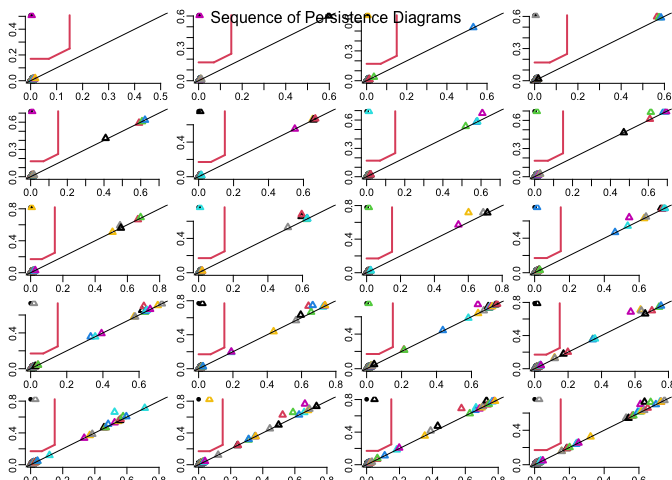
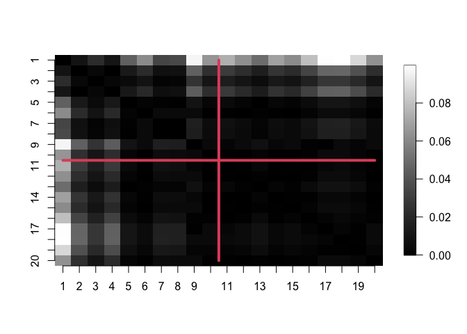

```r
library(tdaTS) #our package
library(plotly) #3D plotting
library(fields) #image.plot function
```


# data generators

The simple 3D plot function using function `plot_ly` function from the `plotly` package.


```r
myplot_3D <- function(data)
{
  minD <- min(data$x, data$y)
  maxD <- max(data$x, data$y)
  M <- max(minD, maxD)
  resScale <- rbind(data,c(0,minD,minD),c(0,minD,maxD),c(0, maxD,minD),c(0,maxD,maxD)) ### add 4 points in the corners for scaling x and y axes
  plot_ly(resScale, x = resScale$x, y = resScale$y, z = resScale$t,
          type="scatter3d", mode = "markers", color = resScale$t)
}
```

We propose, as a starting point, the following four data generators. You give an example for each of the generators. 


## Segment to circle (isometric)


We close a segment into a circle, maintaining the length of the curve (2 pi)


```r
data <- segment_to_circle(n = 1000, 
                          change = 0.5, 
                          time_sampling = "unif")

# an example with additional noise

data$x <- data$x + rnorm(n= 1000, mean = 0, sd = 0.2)
data$y <- data$y + rnorm(n = 1000, mean = 0, sd = 0.2)

######## plot the data
myplot_3D(data)
```

```{=html}
<div class="plotly html-widget html-fill-item-overflow-hidden html-fill-item" id="htmlwidget-f4c436c3d385a9392242" style="width:672px;height:480px;"></div>
<script type="application/json" data-for="htmlwidget-f4c436c3d385a9392242">{"x":{"visdat":{"140873c385c4":["function () ","plotlyVisDat"]},"cur_data":"140873c385c4","attrs":{"140873c385c4":{"x":[1.8353915858195962,1.8232208482927621,-1.6913505370108748,0.97959204819401746,-1.3014488157592805,0.99559567099495472,-2.8283520906418644,1.0972498282154042,-2.1261806032322119,-3.1924587489079066,0.53692821158995918,0.40262018583263798,3.2732854164102059,1.4805090008424431,0.75520129289245475,-2.2984338288123349,2.5631415633460284,-1.1317353379735675,0.19346294150158067,0.073642430716774898,-2.3500686938092117,-3.3561789871925725,0.49117512984055689,0.1921463876793767,-2.6305460677302248,1.4376307831172652,2.6197035716639383,0.070285284043481056,-0.26557898827257287,2.4392742404121437,0.10247657592532379,-0.96195970578501722,2.7278344605760636,2.1863127290734186,-1.225241273499001,-1.7703133540750913,-0.15583401672065195,1.6239923979520183,2.9180778100838132,1.3416445318982209,-2.6014327055361344,-2.2285410623944886,0.79493224309201638,-2.1906766649852472,-2.7317268449332324,-0.70173642200967135,-1.3759937785042982,0.50256531627570167,0.92377689643183958,2.0499599745933335,-2.7165245014167412,-2.5495710591320146,1.7455115425507703,-0.17004371196344037,-1.8196718301082291,2.5420638474742216,1.2354263111782995,1.7070643502403435,2.2491628316753962,1.0111254342666014,-2.0895622538296115,2.8328646738524075,-2.7858354231648423,-2.6051153989769116,2.0730815454554761,-0.78693062070729813,-1.3709328873796847,-2.1639935269029018,-2.5838370975357825,-0.65227531286663765,0.6996408977113806,2.6556080256999177,-0.025670883583313708,2.0935669095244687,-1.6072425066520477,2.5161644263551723,-2.677709163045598,1.7385405776588192,-0.021011945994929865,-1.3655375189480501,0.19042804409490033,2.6520830830284958,-2.7363523241895469,-2.2630090778678942,1.328973944026363,-1.6025712121106119,0.24882715751863316,-2.8882466051043303,-2.7094902958483549,-0.53281434741666223,-2.4958537801638876,-2.4374638901590733,-0.20490332585794932,-1.3132036575520889,-0.23229624633895712,-3.0140600142445217,-1.0612568775782725,-1.0336682137299231,-0.52069779402596084,1.7240104475876044,-2.472421151999721,0.21996659227235052,2.9842821478742794,-1.4450206111469124,-1.624491088007652,0.036905152001776659,1.3730648061735637,2.7184244172335394,-2.1769186362249022,1.9154504802920447,-3.0606018559581329,1.9098849838161163,2.4147402360765735,2.3675667304440049,1.6431710845098026,0.73672659426863085,0.79695035600451181,-1.7748815770914532,1.5373374562327029,2.1811581905397452,-1.6210949857237731,-2.6462388322990158,-2.6905496290541024,1.1529374618428405,-0.62430514509121127,-1.3592467118478022,2.8401555163757921,2.3444874475977553,-1.6842769788602718,-2.1215961509879837,-2.7253578707019059,-2.3807235531071256,-2.512874203987248,1.0980562251574106,-3.0880501457920757,2.6251304318933264,-0.07366301770181552,-2.455228219433498,-0.92787101742749056,-1.1454615516326065,-2.6120123306562451,-2.1176477458706566,-0.97848990960590176,-1.8017016390298481,-1.9360631948285998,0.51663248366147541,-1.6085274468876922,-0.5414337545825767,0.22491574956853194,2.7309996544063564,-2.551025489518187,2.7024625920945708,-1.908234766590668,1.15909279159191,0.86671899193592161,-0.14190004078869925,1.5029575004014724,-2.8796589418799501,-2.53379515494751,0.58106740799326573,2.4930544308464011,-1.4038737999024651,-0.47925852046081802,-1.8853528542398985,1.9900570052093294,-2.7371802171843012,-1.702127152890744,2.7806655828087452,1.8957437530537529,-2.4223604815531239,2.5278310694295261,0.85922661103896791,1.8326175240512177,-2.0575538277419421,2.5165903992502181,2.804391528299079,-1.4562010596847166,0.98763210213281938,2.0576644332819551,-0.24590419895515958,-2.0674748618594481,-2.0038360264991559,0.56228526435066928,1.3285029089364695,2.2310492790066068,2.5711034633895902,1.011500793144136,1.2038444153892205,-2.6027088200673818,0.73501814394646137,-1.0077886553783542,1.9042855096914622,-0.74084720865092923,2.7024862815210535,0.021959827970313033,-2.6978650089330913,-2.2309517122590719,2.7538444318645632,-1.6351770657267548,-2.9313126850124713,1.2755459337231774,-2.5006913928463264,0.52954762927305687,-0.90222432155189081,2.093414250172529,-2.8272709185183897,0.46078888703058274,2.3586118450149018,2.0267230997974264,2.085533579682862,-2.3596930186660092,2.3499567002396686,2.7149743008509151,-2.268532846187103,0.40515282924240392,2.3274463130781893,-1.63116727023973,-2.0937807150960275,-2.2614690897360381,-0.92637346895404227,0.94905878494943829,-2.0141059326857214,0.23438064263859204,2.7520068852615855,2.4757902208783733,-2.5926856108068748,2.0201334974555558,-1.1972134989144627,-1.8166066496626636,1.997842003010833,-0.9757148337474425,2.2019507191971366,-0.30088349072267512,-2.5231689125973027,-2.6364009026918183,-0.50424214302683423,-0.53125572724485048,-0.30081967975098511,1.9749848234096947,-1.6693774565159161,2.0642361941639935,-0.63891848056647982,1.33457456153744,-2.4763401365015372,-1.6953399229170407,2.2422961025128827,0.24047442952872489,-1.7800815712290077,2.4571319766429967,-0.99679288953044731,0.84543836688214169,-0.057598609084026392,-1.2116755167014119,-2.1011135125319527,0.27810199651308309,2.6855023189418845,-2.6967768663488236,-2.3411494095936494,-0.29189208701903702,0.28241530760109679,-2.3341214199234552,-1.0113022148881272,-0.58583895588646351,0.40404812514068589,-1.7460300880463124,2.2887068679113862,1.0547823707550426,1.2850480960186756,-0.37199742708897199,-0.1539718358091203,-2.2832188440918486,-0.90232702616201477,1.7943388799178184,-2.2233857578419416,1.120006971087631,-0.41195083694364087,0.62168680752563332,1.3079697643141548,1.0007193859159262,-2.2552152495523088,-0.16920820038864229,-2.4443282752083371,0.82886405202200153,-1.6140211363990176,-1.2224176315432391,1.9743182220464761,0.10019853533022199,-1.7564285555784662,-1.8907999447561648,2.4384314771808744,2.1111344603857463,-0.4997293659670311,-0.43776390992428027,-0.22579048418858658,-2.2308733917050145,0.70742239814687391,-2.06837240248006,1.7442034062895884,-1.6571966189821983,-0.61548058346960999,0.63127622415831075,-2.2016479135669402,-2.0834702588497356,0.94772835548723267,1.6116580121040553,-1.0465410225964824,-1.9240470483765191,1.6160729644858405,-0.59184795490252118,1.3562789914326978,1.3185445125556812,0.049575255361585746,2.1662881782203445,-1.6448608693921676,0.061916813416534905,1.6894613045233806,1.4598594949420078,-1.6402276826305457,-0.34513333559792392,-1.9211146259203711,0.38893952261743947,0.21206291335285626,1.7837858711343786,0.25333563705699214,1.5623252651297437,0.079890304903330406,1.6289187761958157,-2.2243742360577317,1.6316942984769078,-1.65882345828794,-0.24893142732763379,-1.8578465489005771,-1.5026845274930503,-2.0678919985876467,-1.6352977483516706,-1.7902131157653571,1.6806297505469694,-1.6833432864605042,1.181895526306207,-0.33918861282166396,-1.6195874819174589,1.8386751786012838,-1.4896206689072051,1.2843229335939634,-0.074917844390479146,1.8433232591070348,1.1067119023487249,1.6523135019348119,-1.6745240236091359,1.6170279343686835,0.53412843339749894,-0.80641947296176675,1.7508818854693093,1.8233766140883814,-1.7528509306410265,-1.5773977771824148,0.55835958520286888,2.0739295229674699,1.5811994678769958,-1.7098432744459648,0.12293581929813421,1.4319776951626171,-1.1662071929390883,-1.253198106978342,1.1419645449800493,1.7316951878059343,-0.080363236732668208,-0.72028249021946555,1.6979749565126234,1.8224299367318839,0.40577086216218355,1.5287527234610676,-1.347027315782334,-1.4568776758390667,1.3790902751692082,-0.14141828441494164,-1.7181547614891832,1.6309689144931134,-1.6374800060237189,1.6515324449557589,1.7153664835647757,1.2686631024171409,1.89013394234295,-1.0817198745310235,-1.143972795510646,1.7274844998053229,-0.92669295601744128,0.98878158028014451,0.41647279031560847,1.4288086015280554,-1.8126187768921429,0.54609345118105479,1.5523805540691928,1.2553057795299136,1.7268036473180386,1.6099310686721757,-0.93986040931784443,-0.36607248301757678,-1.1299350598979714,1.2691928411645446,-0.79426000986365186,-1.9386173044396469,1.2245977769765006,0.91204326406205349,1.2979417741089756,-1.9246971424140842,-1.2957837805516634,0.55298775626100116,-1.4764854599153396,1.3898290795609807,1.6753551970766754,1.269251608617699,-0.64614944001539187,-1.2400400202224091,-1.4662632299336857,0.40132434960737734,-1.5986893834771927,1.1947016374750528,-1.4969714523099507,-1.2773358509362773,1.7581138307201669,1.0661160725446273,1.5243392526694668,1.0353501879911133,-1.6101599044631323,-1.5485258727633322,0.9046292707149397,1.5731194470894481,-1.3710997936137901,1.1116099148615324,-1.2014799964589584,-1.2955213119804649,-1.0805659996811701,-1.4880791135811668,0.24286750654940795,0.84041328724759601,1.2779800830871624,-1.5246230554184959,-0.62452001359106557,-1.2108032583053419,-0.69631829192782213,-1.4943587705255461,-1.2860102955086141,-1.136980575525373,-1.3343250644077733,1.0687369995087537,-0.7267102782276682,0.31811050400512353,1.7389500937114786,-1.2417392853305598,1.3349268315738532,-1.1618288250103892,1.4344601420164238,1.1407810750335359,-1.3445836309077537,-0.27777747721562818,-0.87159743649727051,0.75021803019739974,1.0370987154638571,-1.0642353858154032,1.093379612707521,-1.2945962536489404,-1.4728781336103207,-0.81402022496868875,0.92453209456925578,-0.082371975612047788,-1.1390984100326911,-1.1867224047252622,1.0295625459937001,-0.048582029279000516,1.1316186086246938,1.1254521862351081,1.1464866229447719,0.77269677392197511,1.0714254747017122,0.9628483885044844,-1.1272971861591718,0.62011097214662858,0.68492713566972441,0.25606252504306976,0.95243769479829299,0.85869099061522913,1.0915477824912436,-0.32890779864770142,0.82644486321716759,1.2236533121350561,-0.19633567681635011,-0.16611477893131971,1.0360856165768484,1.1645697385362823,-1.3503998494512046,1.1037967897149104,-1.1154434883739628,-0.77797724247757172,0.23422490063842019,0.16007416767711719,0.81682852932158001,-1.0122708238237792,1.1299757047987176,0.27166563315424153,0.35791080433957823,0.73889984828029942,-0.68163269595727949,1.0175771916337275,-0.90865731185346699,0.26258312669780004,-1.1371829093763903,1.2151363049138268,0.17932366730267901,0.9497945179421976,1.0423832298974518,0.74206691167637462,1.3696697114120511,0.60016029670972815,-0.69577364210071591,-0.57353983699011468,-0.46467962041709027,-0.84753849851256169,-0.86383460414409874,-0.045338839863765468,-1.0885818694563076,0.96781238734792407,-0.55747943943565648,-0.86349263484196292,-0.87836947126234421,-1.0428110523493959,-0.22140383884116571,1.0256605836084409,-0.83993083864499807,0.69743894861336941,-0.92354070566229485,-1.0178284953889243,-0.81863430732871723,0.52194841411678683,0.69624306783931644,0.94571026636768074,1.1587828868738546,0.88441732404762985,-1.0393254944614287,0.088103989531798516,0.043586371764212317,-0.62453007687219164,0.36757856059279531,-0.53493924954619088,-0.49536940714866046,1.055223616551372,-0.86661090210796643,1.2174660059782543,0.3079004351091133,-0.7669982532974593,-1.0475694915467142,1.0719932524618037,-1.3521191461620061,-1.1491944380367012,0.16942153789251277,1.1603793617019476,0.34854851557658029,-0.051742251186685129,-0.61675591104759575,-0.010769525769826087,0.93697608613868333,-1.1572999176496526,0.90661570638376976,0.77965888707060005,-0.90069504137387646,-0.39285197271529071,-1.0102570712785002,0.2153404821125946,0.11671827125319939,-0.33131108442503809,-1.081066322402636,-0.078444798408454142,-0.7612052366853308,-0.050215460904987574,-0.042556570074973335,-0.49832053841843826,-0.19304151716926488,-0.88974036510685872,-1.0708604445204495,-0.68804545662918382,0.2649275431194581,0.97792427692393258,-1.0333824278346793,0.491163701407069,0.072508024133116022,-1.0289938412473156,0.2172602307544016,-0.6281845943496438,-0.32116822886902469,0.75680959066022335,-0.59647657779870122,-0.14228170641435683,-1.1468976595879474,1.4582642052705794,-0.79917240394731381,0.33524503977698472,0.91329693505897658,0.077332572117605095,1.2037552226791,0.93789929945395767,-1.0292289311668121,0.9268587363077947,-0.63408238005834117,-0.10143284059708341,-0.92680518493682262,0.45448460511528543,0.94438049987742556,1.1488120258573995,0.98121209330860459,0.33128260286161948,0.29312243635920454,0.74484395227502065,-0.97308745527908291,0.95291052909058649,0.1440168961465724,0.92231960299186522,-0.61991527910343291,0.49162801337243744,1.0550575396546655,0.10939924277138732,-1.0883529251206969,-0.47541119956200451,1.0722268182286669,-0.24231091694761769,1.0045831148102831,0.93847132269727795,0.20229928035105871,-0.76306427763852536,-0.67034231992508531,-0.66440887544210003,0.42518503270812336,0.6640923359145483,0.89083847049387888,0.95231047909885924,0.33949301807350984,-0.65750903850486364,0.39285436006286867,-0.56475185499849712,0.77326960818096324,-0.48086599341395597,-1.3067469589199039,-1.0300099375297878,-1.0540845000066414,0.15837761001418976,-0.2485181411807873,0.90208007467741758,0.80654648611999635,0.96906792920860252,-0.54060110456834465,0.66420520972918251,1.0685771365403876,0.98290674059564287,1.2185672264153182,0.165281036453062,-0.41136554060117436,-0.97867238196330009,1.1057495267565951,-0.19376872678366883,1.0354989136674368,-0.65142682899549031,-1.2979025449205543,0.55867585137861331,0.47941593097033725,-0.86187330928750394,-0.40094815538763301,-1.1268615574133702,0.3517201473585761,1.2068320815599995,-0.87862934017835659,-0.70807219589926318,0.61627893490052177,-0.82807554796152927,-1.1665830176152214,0.17854858833428849,0.27860645257776689,0.00093525734666886906,0.18396659830360593,-0.19433606332610742,0.99566004382135587,0.71249791428080922,0.17365010964497929,0.38342770481910993,0.59430879337851017,0.60605661640900887,0.55787470917509108,0.31811826653538294,-1.2579294968534753,0.87437328420825555,0.43982953558901783,-0.18150413351266131,-0.8252581258527969,1.0566992729200886,-0.50947126327417602,-0.26596478381452798,-1.3005330816471743,-0.72573244408257187,0.10756705416438761,-0.85280870113630147,0.28791676928842147,-0.10171041989370186,-0.57655253465550105,-0.0043151683055939749,-0.45846983116649442,0.37513663968102406,0.085938881476934792,0.80501416392685066,-0.67999752137808966,0.77776075662108535,-1.361335357744105,0.1247440430862003,0.41772355769054004,0.1724992662039497,-0.82910304021835002,-0.18798315917937852,-0.63719566306253994,0.38255422162655239,0.10818187853611738,0.32840960433229854,0.10070142306515409,-0.23846224382543041,-0.92410696015655747,-1.0482914430959864,0.79101934358944104,1.1840504800239535,-0.85924715512425898,0.35922386361204284,1.044151711695382,-0.37154112576652504,0.9232840244743129,-0.22948200744896888,0.037315051905894348,0.25099250985243304,-0.49293912736608791,0.29888499862042595,-0.6602474775802214,0.92356801779999209,-1.0938444515038743,-0.0031569801807542347,0.36592539188032919,-0.085304390942661096,0.86520505421330118,0.42358119493783764,0.50194628223233595,1.0945889946088074,0.070443369059880703,-0.96699039379873508,-0.56004468546414032,0.65397288218161398,0.29786119116452869,-0.36275951733033907,1.2403108966960981,0.58719016086682829,-0.71108044612345145,0.012172149218796906,0.86822116214397183,-0.909262921862801,0.50056984504433899,-0.72603335902982113,-0.2634280992971953,-0.2467125613203596,-0.56194531389073343,-0.12805949880212281,0.43118921276388433,0.34541772774778534,1.2126262422314218,-0.65141065109149698,-1.1453744603629394,0.79203502933137682,-1.0108801698825383,-1.2446307248457407,-0.91397950719389254,0.85510210405092668,-0.26157070570088586,-0.46984884035537888,-0.28565896494927895,-0.93054294003173843,-0.57618885954089116,-0.70705383261563959,-0.7719388059755492,0.77287145117021039,-0.71548687103239295,0.6593506143634067,-1.0677362326000424,-0.018342754201489786,0.8385214880308115,0.5474077182212822,1.0337959244400308,-0.12295445479257094,0.87821674359781565,-0.59952956885521258,0.060243781584227718,-1.2096735636228355,-0.97673092938059169,-0.087766258409960107,0.69818859352709683,-0.16240677708490486,1.0476421715460369,0.87888077410196974,-0.27996471083313534,-0.53298252613294994,0.51371726799626105,-0.77361205731584903,-0.0014449426566512241,0.83029765181474247,1.1976118773641735,-0.48835997644425078,-0.40063855043144725,-0.27994520085357538,-0.010078324546453965,0.43913342706162106,0.54381882206605026,0.6149740296119337,-0.47266170256952644,-0.42287323769949248,-0.73986506802611707,-0.37661857250586905,1.0108333812319681,-0.86046128102975183,0.17289120305444169,0.48321911448162413,0.84281793943783068,1.0745724118630378,-1.0391580945197396,-0.41397459106988188,-0.49554773652295325,0.77577642974415251,1.165165403654538,0.88268311326829296,0.9069783760993233,0.77834747373313873,0.52904303115101137,-0.89170594855690855,0.97538671226453444,0.70197379223808776,0.78613677155729988,0.64000203768686992,-1.2403861391762532,-0.89021783689415557,-0.43403501489247609,0.29942119310547155,0.74175577571237161,-0.99281172623926828,0.57996125487374639,-0.25685829948031436,-0.86443831748364253,0.52318951532846991,0.095438012791925514,0.29378942383639772,-0.21502907861893789,0.32399184747825632,-0.87972645455782983,-0.8403894944766287,0.26665899195953252,0.39863446207021885,1.3231066241654521,-0.34103798630608528,0.31462678983900383,-0.51542506853935255,-1.4293040527595295,-0.78715010392155849,0.094531546922703186,1.2602378817695634,-0.58520979827562325,0.21422567288173816,0.87086589582896834,0.95382729961791535,0.28961568014912464,-1.1160822360333151,0.62788299176328666,1.3300369171950888,-0.81655037682510723,-0.13697432124041481,-0.54894706779763425,0.96664750469716321,-1.01343342598363,-0.32804847076447124,-0.11437234428779362,0.69941307427867339,1.1987214648108524,0.81414917101961626,-0.058224858714454861,-1.1124214788271674,-0.042041501730153148,0.88655030778037691,0.80657540591411192,0.57157465794409945,0.04759895263167882,-0.75573640834767297,1.1919629934598746,0.92852080284090377,-0.32548755255749812,-0.9947238845788644,-0.32536338564046374,1.0613756794675884,1.0670015166954712,-0.24969391310956998,-0.18365423758678237,0.71858534269321384,0.06366183168821854,0.82263220429162165,-0.95495136343247733,-0.14195910069248149,-0.3146678948327597,-0.98649888091757898,-0.85293985868711397,0.57160478564456518,-0.75864311055565492,0.2218599734151705,0.32164828617654456,-0.99160164504583004,0.74077386569282078,-0.81857635129521777,-1.1110833470593611,1.215454839014408,-0.22597074318316118,-0.5027008219804896,-0.97695378776805242,0.26494202078411638,-0.12662169891763086,0.99548259385450333,-0.37244209468839973,-0.43217880016940213,-0.073398338966516263,0.98197448739739535,0.22169932815695409,-0.64908122102795807,0.61365533026573404,-0.75447412682089232,-0.34757220080832418,-1.1273222160834995,-0.66183684753290317,0.49902269889073736,0.60795648512797884,-0.50300834819890983,0.7081291416947324,0.79960021694651862,-0.037113105407070739,0.50429080001602244,0.50881411335376547,0.44685965298216934,0.80098544732972587,1.073453271118342,0.59207594821736653,-0.9180788242159369,-0.86305874392422788,0.13493725844985932,0.49365027760497093,0.6217726800978649,0.46949408330517611,-1.0548635784008908,0.54226614432617626,0.42606135744855222,-0.63382579062469246,-1.0540536571315748,-0.38615403819761163,-0.64888928127375245,0.53391896959519514,0.60578140334569053,-1.2668856894853953,0.55980973614609442,-0.14595699591058819,-0.92039707669959137,-0.63824876252311069,0.073962830301817745,0.7435564989706005,0.29798771291370596,0.14459616451950436,0.42417895024465146,-0.46415463804392898,1.1051908525472434,-0.83456324483407318,-0.64135169954159132,-0.12655782709065988,0.71817904772948526,-0.92187024532012218,-1.3297180842390866,1.0966884870571012,-0.72612797875145707,0.43685986381767788,0.89155349082368973,-0.73044484232000917,-1.105742943032243,0.7402704617445337,-0.0063934678765425815,-0.85175950576962844,-0.14727097834556085,0.83571717508884757,0.63866572263962862,0.58077476957210283,0.68384298121731812,0.51722761348797897,0.87578780401336154,0.47907888707549423,-0.79898307024769721,0.18578746675639524,0.20261032994383876,0.46991388922173216,0.64609864923928506,-0.31474610295657712,-0.05959047982145832,-3.3561789871925725,-3.3561789871925725,3.2732854164102059,3.2732854164102059],"y":[-0.12706883931060228,-0.098260519908178565,0.032175715836723053,0.21386928269484679,0.12269707718693246,-0.20758070774942883,0.067801177016378777,0.32163217630059621,-0.1604816732003892,-0.060208240710527244,-0.087087668074141894,0.015182843408612368,-0.011074657652637904,0.38060959679044443,-0.18967520450607397,0.046379092297806859,0.12610051816117612,0.022028103581951355,0.22949625356330444,0.053281384719222287,-0.38657359345761855,0.054744069205541014,-0.36398155668170867,-0.01212152331275175,-0.043529005265696169,-0.16715720486325886,0.3303506930429812,0.23371735215446535,0.39447512043876348,0.54061593771181216,-0.10871032119655699,0.15400557252127303,0.048331476041162766,-0.071326632236616311,-0.0006052504042989848,-0.10946589808110864,-0.097263236739462633,0.23568161840243257,0.22021311087646431,-0.028104726270365463,-0.10030547975866402,0.31600405127906289,0.043627285245715908,-0.16461339909298517,0.39560455631272851,-0.094266437157412106,0.046294219490897556,-0.07414271085058291,-0.020428405347184618,0.033949168709020622,0.43953143657963045,0.33913362149636028,0.50143191114773789,0.12084522989216488,0.11552147349106248,0.14104277887080929,-0.019827432972232856,0.056053576113648362,0.20698627701480579,-0.10351517400839702,0.48706389959528468,0.47634361126660951,0.426592081460058,0.18038249694340502,0.10195161680935683,-0.13061012743875411,-0.52603219990044359,0.27636702752119713,0.53878952213740172,0.33016631079826514,0.14851964309259738,0.50569764934029227,0.05202214018901441,0.32418851748341804,0.070589096183048983,0.26823819013440575,0.48159470425311246,-0.043875187030124274,0.26399966645324008,-0.08828543074196063,-0.18628556031170579,0.47319872144867142,0.3280765367224262,-0.012759689854006384,-0.085783921345580993,0.72930767348749614,0.21791099633090613,0.87135908042940136,0.38436033658925806,0.25271669258220192,0.60194653884273164,0.38914774343744662,-0.20824653272597887,-0.053108640735188534,0.2313897810358794,0.34999796714192349,0.31216989197306333,0.073560197894553786,0.08573279660982959,0.27630843541517319,0.43246815257198062,-0.00017867461447272463,0.5455366493248327,0.41716841560712015,0.064631461403717144,-0.11907223661970855,0.32351832499868977,0.47978752529045976,0.68246294839559085,0.70186411108245794,1.0946615605745702,0.40660407248482017,0.79423342527924445,0.51251579815553638,0.4222246541778899,0.00050521932907936218,0.0004019079051353347,0.38719269814197516,0.48507904399401991,-0.021211402938335566,0.43008914759528855,0.52348296420703988,0.6156158586850512,0.16770134416496163,-0.24219016235228358,0.25565883792292549,0.5323328418022869,0.46580339921586833,-0.051278986418730216,0.39720161292904033,0.52982144530153175,0.28588636673905643,0.82362722702166591,0.16856101509465632,0.75835184110102638,0.70999825651818782,-0.23350744903424314,0.93005810895544638,0.21725151553335745,0.2105266977740913,0.55675799713763263,1.0084537327673841,0.098457132570470007,0.80168761855508297,0.54349981219393495,0.24872423618414471,0.3410795165060605,0.10124272586767891,-0.20924703838200739,0.73865935676597483,0.74073385277985937,0.7521472294111945,0.41011520311122057,0.061240405158556499,0.2275557161570449,-0.081564761669313951,0.056747836672263879,1.0727221323756584,0.76892160022450773,-0.28617903828698432,0.83916505855346823,-0.019722191722553628,-0.20410078275487201,0.17974643507426175,0.34439724173015468,0.87769342214778567,0.53105884553011196,0.86157359523009236,0.62728958724496919,0.91123741806662961,0.48761937132077099,0.25194980480681506,0.69549527154848345,0.76318961348652858,0.68209150688363596,0.56347069569358443,0.17649884455150155,0.46627286159781189,0.53787847478905326,0.19499733271533359,0.87655001367313401,0.30388452675087302,-0.19888801559649441,0.31958680528824424,0.10010327983004069,0.8876085000266124,0.17800549692018641,0.055947291107038027,0.74787635043828327,-0.093145139370410079,-0.051639752698034669,0.39433749526226691,0.18297634944245772,1.0114247701287047,-0.0087609133888874955,1.0493517926457643,0.42703533128163806,0.84555741287906239,0.36361827418568771,1.2617551518910233,0.054708570333566797,1.0168907148485677,0.26455528975654324,0.11257110616053075,0.91400129190314738,1.0492514784482245,0.0084139066289121746,1.2121206906360598,0.580160193494759,0.64689512534919091,0.95061019090007792,1.0996822939855726,0.82841826542210673,0.46039281432345996,0.11420931269326558,1.1410109859875659,0.77530875876629368,0.46335621764270701,0.84132705619130876,0.0043981522378690741,0.51660933218572924,0.52354019165693877,0.075048333280958612,1.1969774890701934,1.2370432084903003,1.1555564128972535,0.43941196225250356,0.2741881278050699,0.67598624869301172,0.82397164550459268,0.064359946725019546,1.7221895166637835,0.32888322699313727,1.0128078904488178,1.3302774586721091,0.10188463592817468,-0.026267467220218041,-0.086875961068332064,0.84199351931551125,0.16704071358109329,0.74856954122585628,-0.0031125474357244706,0.28398834758877289,1.1335906491969732,0.93016525159345809,0.80740357930529871,-0.0076977553847314747,0.32757721826119818,1.6536617349436591,0.18756100927989425,0.1284867629018715,-0.00085558289055557603,0.3827870141387909,1.0601756192146923,0.11028024960542546,1.4453970588765668,1.1687924568563997,1.2811257503858715,-0.33584805416946073,0.14756025605545411,1.2161344616883658,0.19446328111725489,-0.1921165400867518,0.31126551652265283,0.68104157291424761,1.0603238005917737,0.10021651807525667,0.21279145739405447,0.022260998219885472,0.16348254291031938,1.2419044621057667,0.13856118225818392,0.59557977848301213,1.4999051719954504,0.115773777702884,-0.22498533182839209,-0.045346879294626843,0.494117374920019,0.44420178397764493,1.3744649641874238,-0.11777678986783749,1.5213496293905246,0.068043739561439942,0.69000774693049061,0.66245994425457111,1.4939170785352385,0.14341287481057396,0.87886783834034365,1.4585240561762931,1.4291531507056239,1.0906129953704098,-0.013032972903716983,-0.20980154769553941,-0.25479889261864586,1.5001307583361099,-0.237187049813948,1.4218448951928957,0.91728890305976674,0.75964937985424219,0.16739344104114087,0.11189000788268302,1.2417094149645473,1.1247392517907766,0.29280783748905664,0.85423298629492228,0.3402513399820154,2.0204885061305142,0.38709167439878572,-0.080460974307488525,0.40980114514445887,0.51807307525113466,-0.002969050351937915,1.2828034877327144,0.71062344109858788,-0.11656486316313297,1.4226816162243305,0.46051853359103029,1.0279892245664566,-0.248823604308609,1.1131502454436741,-0.15902112475761102,-0.083866213059361122,0.98069988485439841,-0.079424598333991264,0.76808039936773675,-0.32160701331833769,1.2195978231075388,1.148503352637724,1.1413960888837249,1.2253539808716352,0.39960903528192993,0.74292811071649978,0.95927688939127098,1.5460651034065824,0.68829913964519351,1.4324980032099264,1.080016911762361,1.866538535665748,0.43243229845336151,-0.34954464244283312,1.4530744323365816,1.0954553378282437,0.94868194811619366,0.62353181101331645,-0.25984058013730565,1.5827110647394147,0.39955754273554778,1.5109437869008153,0.36152119528154397,1.1646552946815403,-0.017643890707773845,0.78844317639965622,1.4855757883151306,0.97484800618320322,0.63155141072063037,0.58824936007524387,0.071121124576854683,1.3488944291046314,1.5475305072108678,1.1900234407966899,0.15833219613928429,0.18259932303948223,-0.076622413848060095,0.48160816067788287,0.41574346744235463,0.85599746770306073,-0.066216616730845848,0.30063637610347238,0.94088018430833065,1.4039325651608041,-0.036209196219061567,1.1966108130713478,1.3508322083589301,0.69471527961191537,1.4104667792068502,-0.043557614180457067,1.1593073059502654,1.3634470194998105,1.5955803367031962,0.93383969461660177,1.008033056712252,2.0096039708064088,1.5867122049677902,0.50163987059007542,0.52919771758977541,1.0015479218311554,0.53619471817935227,0.42766391071294385,0.15123913169412695,1.9166631056511574,0.83309367151880931,0.32498199820916723,1.5634749641603471,0.7946673558855577,1.5418571392796112,1.5893620368439141,0.35186123425929927,0.024055175877545618,0.35204928741435976,2.0749820438762949,-0.039511543152071116,1.6329060785277369,0.18807436971654704,0.34874587080602071,0.7573533798596277,1.1509570770475732,0.39826250596455492,0.00063375023338457792,1.2099434002468687,0.57583529986581361,1.2825772403810254,0.020450710488194856,-0.12242714405144296,1.5367453359846457,1.6769875180665084,0.17926382639324318,1.6889711963579199,0.26448967213278013,1.7451458531662389,0.17561784588944249,1.5577364842314527,1.8437538855929214,1.4225294668950768,1.0692105308048803,1.3152971888537146,1.0301906279860578,0.37712931560173385,0.69072064162372915,0.85947547803646973,0.6245474131397355,0.79466151914472838,0.83869886854103526,1.0297823815708336,1.3599534311391936,0.12378066044968086,0.2219324703734043,1.6111960740415794,1.6844990570917591,0.27645925402739946,0.75485845168184673,0.19907215695874697,0.7221801563534509,0.65869567147345465,2.0007559765914555,0.75855972792509307,0.3546399585625068,0.066799372971121498,0.20551971568100627,0.96361150818643193,1.8154410410147941,1.7279742564885339,1.8132598759082765,0.99548022658570479,0.76843416250736185,1.6763657910798375,0.15685690384855119,-0.058564153386635467,-0.2116481853794967,1.9185576676420231,1.5285783223875691,1.7677925241626269,1.3991089015338647,0.69712569074655217,0.75817736810334635,2.2422082558781922,0.16841111666625566,1.2862992987536022,0.32351595706837083,0.65057489588637007,0.092263026482007141,1.0987111539091217,0.15563076631669587,1.8816060685793987,-0.14523175375487776,0.70422802939914397,1.7657339301993411,1.7332952256712879,1.8822952553683188,0.35651882612784136,-0.25222249170772648,1.2969716257541517,2.1139459783033541,1.5261564784465671,-0.37693975231167492,1.868805292455336,1.5415013941115747,-0.30974846593899047,2.1169510055543821,1.2801781421843828,1.3676468474131003,1.3670869133724035,1.8271760173022806,0.88474018284561806,1.7570839559141751,-0.22378988587291648,-0.040874726096481795,1.8515583946095242,1.996594403165316,1.6390323702133527,0.38614961943015014,1.9035352127379088,0.68514502268679767,1.9351959216738372,1.5467223929762501,0.77669349814554001,-0.056324094664390631,0.55803627594924954,0.62401304866136353,2.1536571734414856,1.968294312819705,1.2221297475395034,1.8725775387349224,1.1324589839413683,1.843413339109369,1.7695846313983867,0.058014375214030092,-0.075260609033449249,1.9238281573026557,1.7559584817792522,2.0394668879473765,0.7417351056388628,0.93961849251603657,0.36781361900993909,0.75387014605584091,0.94076108864140573,0.36165730808665031,1.6456649596551609,2.1392669251648813,1.2907899926673569,0.64827067922950765,1.0245506544651009,0.63826438540454256,0.48223736506383497,1.9881443955275955,1.4020944634714565,1.3738701059403613,0.91210146890730659,1.4516261621997644,0.52752755686197828,-0.23597171740006628,0.19774082253044561,1.4094245177579894,0.11759452283401994,0.40306334263353749,0.040399418079737515,-0.030083725995171756,1.2747576517360992,0.46901627516930455,-0.20004571393696213,1.6098767852988578,0.49713594503224856,1.2299164660218842,0.88449578322311639,0.27711880913412595,0.078698673092785262,1.8238383987536,1.5438890333701094,1.5906361429314939,1.6803662371189965,-0.047002545856211622,1.1570671841456817,0.62525580972502148,0.32786719331988717,1.2883935789431817,0.35501960378628816,2.0670138735567325,1.1009308544217722,2.157858213418268,1.9258761626247682,0.63137331558068188,0.94580497152368548,2.0492762659594002,0.25255855094442792,0.17406905741910356,1.6934060490513612,1.8586589233886475,0.46060533995378533,0.67243067352971797,1.0073758163725748,0.20163184428498973,1.9013772687829451,0.19064218525471649,1.3298600356773731,0.077441104863967908,2.1143168130743955,1.1309420445931653,0.38363043320551915,0.39734475222101062,1.652149414242865,1.9035609621020564,0.88701545342596089,1.7434895734168658,0.74045657511645202,1.4217775956214629,0.93017070920455125,0.20020513188835506,1.2326224340406984,0.28849152325971206,1.1789358909550525,0.90099465428618419,1.4434419012917381,0.83452414912651141,2.1185680718367492,1.9048587789011977,1.8050325378870602,2.0990815227576114,1.6061917048944803,1.0066711774172061,1.5412428347019929,1.8076072321344772,2.0020651404078298,1.0378593583232074,1.701076963530783,1.0026135939605043,2.032197391735453,0.38392252567442564,1.6289644695573218,0.18808533991593063,1.8922919788506805,2.1377367448468512,1.6731077259250928,1.4261737816708226,0.8412941093533044,1.8318080042074367,1.3027625976059829,1.0288733171406887,0.21614343205365391,0.5073340699163591,0.15036394936508324,1.2842253914116706,0.11201463821628864,1.0178056810664426,0.12156322263476922,0.98651817978372036,-0.11428938798721267,0.60244327034331724,0.26537342573708789,2.139189163954466,1.8659985357173627,0.59410803045116922,1.0052494980037281,0.61983865193340959,1.428259797551251,1.5523238974768594,2.0250888540396152,0.44857933576847053,1.8551851958982248,0.66597841566330573,0.10500409987003309,1.5005546477857079,0.60051542113735268,1.0641904939482383,0.77926320415807981,-0.28531344215111482,2.0593370963707112,1.2097960218739743,0.46278646852560762,-0.34920333894919686,0.5591970199451558,0.28312966196665873,0.89912151074922564,0.45989065205592283,0.030138413553287766,1.0041106126836488,1.6491289644292808,1.1401280054855127,2.0237983929374881,0.63043579121451832,1.6203001911631447,0.49654890631150117,1.9398185450958856,-0.011794645336400733,0.89485926904737534,-0.08194802833080081,-0.1227158800937867,2.0328228605216285,2.0739588518186509,1.9261988794207043,0.26447472604408634,0.91064221122878886,1.8080039266665544,1.6487180034474234,1.9866157791810379,-0.015042479882395599,1.747758616315332,2.265283563982365,0.51180956942551981,0.60677237742716605,1.8124828487317606,0.037024192620783637,0.63135689596673905,0.3018074530254195,0.42599455554412857,0.055099406863516776,0.14271825704368507,0.24675707527501065,-0.14922002773828891,0.48477454717074464,1.2009389868450504,1.9269501229585,1.9857361600323262,-0.12882372500604808,1.7263920637405161,1.9169045194974079,0.015174908182811461,0.22092457930561282,0.74266105125796189,1.7236485212800339,0.78468086184276986,0.59655451565623419,1.6712706465583498,1.7968103320098003,1.1578576747311202,0.063933970121931624,1.0237268681530685,0.3198033749835576,2.0798522757737796,1.6944299857773011,1.7262561189383638,1.5744563502638236,0.6263872845343933,1.7824780487114658,1.322964136600828,0.60131872964501232,1.5277531519074976,0.66816364220792146,1.2972938135455894,0.045302408370212724,0.30141596071210924,1.8122133260523268,0.33475655057260645,0.42930444008505209,1.707143933660461,0.064478665979157218,0.73459496492683773,1.5303156828748257,0.30096719303982622,1.9327145692387577,0.11515292987461144,0.15557689369584859,0.37032794775138522,0.18127480325374901,0.049630907997561008,1.4056582797902193,2.1332580478617094,0.88173982248024529,0.28132463051531842,-0.073578248930819823,0.18722538710719397,1.8639481200825747,1.5134409769539499,1.8226487903232795,0.7804461500244666,-0.24069472305336007,1.2981672479179542,1.2563678341059437,1.9424606945965019,0.64043335099534437,0.090219658622533672,-0.21758127320395537,1.1571200292912929,2.0553444273575967,1.7046451613999434,0.10930118969534194,1.0244367873136053,0.93829204945603406,0.79803770777117256,1.2285873462628656,1.2748137593237086,0.77138718854611454,1.7631657013091242,0.040445535743616645,-0.092066747163128765,1.5100352087815943,-0.020656580477203909,1.4688641508945963,1.882690441657014,-0.09918531876593073,0.0031321254752615657,0.84314685126241806,1.2090536491142305,1.2504361078060202,1.0553410664646665,0.22068695513908976,1.7284393934564037,2.1367325548610498,0.54178408913371023,0.046927973917610249,1.0546577693650212,1.9371594919338908,0.085534071750408641,1.3305833515750209,1.4055760448170953,2.1691852499089972,-0.14241698229492061,0.30607231906990895,0.86634336959199165,1.4981096485715517,-0.4756490115937887,2.0230549951855012,-0.079206814242656368,1.474639275887403,0.0013657531208872403,0.2069350912913544,0.53547360883095585,0.012830056400106586,0.28896047226435656,1.8665885641089919,2.2913696902552037,-0.021900659424181859,0.03781239125240668,1.3710975282204063,1.4661397028923808,1.7148526908269308,1.1798836326697189,1.7289662044300673,0.085668281600607132,0.85925737526373469,0.08335500855731115,2.0220389890481214,0.51824210702072615,1.1212959112682237,0.82661599617595016,2.0455857315274093,0.4328591925215593,0.45141254877028025,1.302970640515811,1.379383959195001,0.61842702399751859,1.8601323419761961,0.12095837662576059,0.027648138083398666,1.1495122977194936,1.2845299536686783,1.8124954468104686,0.077131996708854303,1.1541342173642881,0.31031536768289064,1.7403473830401404,1.9576376864128413,1.6769533822212859,1.2056985151190271,2.0239486052476723,-0.17042724877775756,0.82110007343725866,0.11655000344723584,-0.041299696098746362,1.4276771643425628,2.1167856953834301,1.7544358811121206,1.3750315507857471,1.7620874259925023,1.9230128776009279,0.1113706976778545,1.1538085425793345,0.044392619357683294,0.11733082307276198,1.5607582400850206,1.315790781678468,0.94003783644665995,0.099041772616062923,1.0110769399921788,1.2202938272292765,1.840838915860147,1.2165413267340563,1.6704859985586129,0.11634675244670799,1.6185200734974727,0.9487583212229096,0.74105274976243529,1.4537515047728138,1.529966288989123,0.21391533854009831,0.98174921548114591,0.76964109640937417,-0.075343128450941266,2.4283539275571306,0.60796765238564709,1.3562082094014722,1.2286047795338322,0.27128460787222169,1.856526686070338,2.1975785173135836,1.2555138868717264,0.36294444243512036,2.0265182326092517,2.0999539127081976,1.074840490132299,0.74239263564527302,0.26804986370826828,0.15619925222883341,2.2294562181915154,2.1367065622821246,0.98394394425839149,0.59357942702038247,2.3677361753041075,1.9407963998760789,0.067107529507457742,2.0347581901091085,0.38267138698939296,0.50440123295722938,0.29619093661337503,2.0961747505202366,1.1313577294524126,1.7310496141622571,1.4934774478112214,-0.10677359318083007,0.30032871899721952,0.71089910132692791,1.8039398937080278,0.34847640981054306,0.30763514321053875,1.1012438402871967,0.4085074694019396,2.2912355866321423,1.7355316599618347,0.45478125037629269,0.10343749001517392,-0.07799283987401695,1.0491115901251522,-0.085133359707438239,0.31929592591520595,0.37739118444699832,1.0452846788558452,-0.13087037654667988,0.43745463016366859,2.184921226812901,1.4656109913014943,0.1231670724205368,0.77392353220216636,1.4816101403825099,1.7882005578915208,0.082193793960041867,1.824193182444066,0.55535153689882455,0.4553342244867542,-0.30130125235190397,1.8667146308435258,0.31679772240013099,0.26124077951409075,1.3678539091340534,0.93169991340590785,1.1259793587019509,0.55333057115208373,0.19622764292781736,-0.21970471328565941,0.13915122242814307,0.84535021996554094,1.3238505128351923,0.65527513428305983,0.42331969643458095,-0.27658142035296918,0.56526571492973354,0.7489734508480429,1.6604973515641448,0.6990746122800362,1.8436849658927552,1.822627259789803,0.95975129785996782,0.031006459233983152,1.7264640264633384,0.73524080491221278,1.4191440064285472,2.1660771160953423,0.26575747385241866,1.9586822558974488,1.9254396358094297,0.11113548151383745,-0.17875058247612668,0.96846156560363872,0.44648020651340314,1.4790475707436697,0.31155742577308188,1.9623041009504036,0.40468109856596168,1.0284261881422982,1.2120913259663317,1.2159441596043428,1.83481428578115,0.63922328204834078,1.6624752731418411,0.60706012682920785,1.3717344822637672,0.020417782610031437,0.64482164613302784,2.2649053109651489,1.7936924184786003,2.0733567870646334,1.8153262725907722,1.7023183844346528,1.0822335920395023,0.96815244990443139,1.9488170333823205,0.31354170192858433,0.049782930524055274,1.6668119099991303,0.53189628777713882,1.5468312914914404,1.647617479685763,1.9816270153010771,-3.3561789871925725,3.2732854164102059,-3.3561789871925725,3.2732854164102059],"z":[0.00014542974531650543,0.00061457278206944466,0.0012064510956406593,0.0014428154099732637,0.0019555296748876572,0.0024786901194602251,0.0035540999379009008,0.0041386445518583059,0.0044702137820422649,0.0067209517583250999,0.0067931399680674076,0.0085714405868202448,0.0089116825256496668,0.0095267854630947113,0.011226564645767212,0.012348957592621446,0.012988664675503969,0.013138192938640714,0.013658960582688451,0.013781942659988999,0.015099855605512857,0.015756853157654405,0.01652520545758307,0.017783266492187977,0.018281180178746581,0.020496554672718048,0.021701090270653367,0.022308815736323595,0.025761344702914357,0.026152269449084997,0.02642346266657114,0.029299461282789707,0.030996984103694558,0.031600894639268517,0.031937169609591365,0.032184148207306862,0.033702603541314602,0.03389522060751915,0.034670628840103745,0.038841311819851398,0.039362592389807105,0.04086185060441494,0.042408328037708998,0.042567073367536068,0.043240093858912587,0.044223755365237594,0.044622988905757666,0.045099165057763457,0.045506438706070185,0.048452088609337807,0.049017941579222679,0.050465770997107029,0.050982973072677851,0.053551874123513699,0.054774475051090121,0.054898143513128161,0.055403602076694369,0.055825755931437016,0.056238926248624921,0.060000893194228411,0.060818766709417105,0.061308175791054964,0.06162633397616446,0.06173794949427247,0.062915764283388853,0.062996116699650884,0.063550738850608468,0.064218061743304133,0.065199353964999318,0.065955036552622914,0.06660517118871212,0.066919658798724413,0.067493424750864506,0.068573511438444257,0.068826278671622276,0.068856975995004177,0.06917283614166081,0.070738290436565876,0.071616423316299915,0.071708977455273271,0.072767480742186308,0.073229494271799922,0.074442169396206737,0.07461277605034411,0.075427389470860362,0.076228401623666286,0.076261946000158787,0.076808983692899346,0.077772103948518634,0.080187735380604863,0.081350458553060889,0.082287568366155028,0.082898093620315194,0.083137417444959283,0.084272011881694198,0.084400505293160677,0.08499617176130414,0.087627677945420146,0.090002649696543813,0.090091483434662223,0.093812039587646723,0.094569617649540305,0.095098852878436446,0.095205967780202627,0.097261771326884627,0.098044669255614281,0.098341930890455842,0.099161366932094097,0.099895557388663292,0.099911730969324708,0.10040732938796282,0.10435259062796831,0.1048627095296979,0.10640837997198105,0.10658731195144355,0.10741782607510686,0.10814808052964509,0.10970020946115255,0.11014819191768765,0.11148197157308459,0.11214290419593453,0.11330772168003023,0.11351754213683307,0.11408549500629306,0.11419240897521377,0.11703429417684674,0.11762824282050133,0.11772789945825934,0.1180170550942421,0.11897480674088001,0.11979244695976377,0.12018839013762772,0.12328756274655461,0.1233246554620564,0.12423897138796747,0.12469473714008927,0.12488734070211649,0.12526313099078834,0.12573500163853168,0.12663609744049609,0.12703167111612856,0.12705881358124316,0.12740435684099793,0.12742248899303377,0.12969699548557401,0.12987778661772609,0.13063224172219634,0.133003203663975,0.13391269068233669,0.13453719858080149,0.13495380314998329,0.13526643393561244,0.13529920671135187,0.13564485101960599,0.13580084871500731,0.13607038860209286,0.13655979046598077,0.13765515084378421,0.1376630358863622,0.1383527044672519,0.13877760036848485,0.13997004739940166,0.14270863751880825,0.14279762492515147,0.14539306936785579,0.14551246166229248,0.14589934539981186,0.14638338540680707,0.1469284922350198,0.14709698013029993,0.14740412193350494,0.14797906554304063,0.14855808089487255,0.15128280152566731,0.15157036809250712,0.15249510412104428,0.1554049882106483,0.15553003293462098,0.15745036746375263,0.15916611952707171,0.15923427860252559,0.16005308646708727,0.16029978333972394,0.16039168881252408,0.16297624260187149,0.16300301044248044,0.16338578681461513,0.16356205381453037,0.16721532633528113,0.16749138082377613,0.16857621585950255,0.17194776679389179,0.17344545177184045,0.17450685170479119,0.17507660668343306,0.17615225352346897,0.17711715656332672,0.17728757485747337,0.178534742211923,0.17854170221835375,0.17886197241023183,0.18070314172655344,0.18164773983880877,0.18255375931039453,0.18412623926997185,0.18470228929072618,0.18620549514889717,0.18626533378846943,0.18683369993232191,0.18690960854291916,0.18749831686727703,0.19056164845824242,0.19231331930495799,0.19232276175171137,0.19331695791333914,0.19591760961338878,0.19645467074587941,0.19662325386889279,0.19708411581814289,0.19727529212832451,0.1974662400316447,0.19754078588448465,0.19813816994428635,0.19886311725713313,0.19900498888455331,0.19978283997625113,0.20016731112264097,0.2033257968723774,0.20351951057091355,0.20363138825632632,0.2038484993390739,0.20426023658365011,0.20432598423212767,0.20509300357662141,0.20654091448523104,0.2066241311840713,0.20712941000238061,0.20944570330902934,0.21035184152424335,0.21051521063782275,0.21111375698819757,0.21161752450279891,0.21262862323783338,0.21351601439528167,0.21570708113722503,0.21663526562042534,0.21667310688644648,0.21762714302167296,0.2177903838455677,0.21787943365052342,0.22006060159765184,0.22241473873145878,0.22336095222271979,0.22348043043166399,0.22401684825308621,0.22426052624359727,0.22443785960786045,0.2255287179723382,0.22713184426538646,0.22796897380612791,0.22806900064460933,0.22817855980247259,0.2282325376290828,0.2290025046095252,0.23057191958650947,0.23188986070454121,0.23449965030886233,0.23557929811067879,0.23638497130014002,0.23697118042036891,0.24020926211960614,0.24032292328774929,0.2420029598288238,0.24328353744931519,0.24334828252904117,0.24406464630737901,0.24473346909508109,0.24657894088886678,0.24677919573150575,0.24720146786421537,0.24806270748376846,0.24824904697015882,0.24834947846829891,0.24836560385301709,0.2491861458402127,0.25049356766976416,0.25221582618542016,0.25241338321939111,0.25509913242422044,0.25510057271458209,0.25581026310101151,0.25583216617815197,0.25711165135726333,0.257631232496351,0.26188495312817395,0.26290853298269212,0.26477776374667883,0.26699734129942954,0.2671479822602123,0.26740056253038347,0.26746627525426447,0.26941048004664481,0.26955006690695882,0.27125476067885756,0.27254065405577421,0.27704373397864401,0.2785490844398737,0.28184861177578568,0.28236781130544841,0.28400552924722433,0.28579901601187885,0.29186653345823288,0.29418939677998424,0.29439939721487463,0.2948869876563549,0.29563606600277126,0.29673938592895865,0.29773194412700832,0.2995089921168983,0.29965554480440915,0.30105210305191576,0.30313534126617014,0.30313727026805282,0.30436321487650275,0.30464306753128767,0.30487714009359479,0.30516588059253991,0.3055315709207207,0.30584592069499195,0.30589967826381326,0.30669969436712563,0.30677568446844816,0.30680233403109014,0.30690672085620463,0.30695540644228458,0.30698862974531949,0.30708146607503295,0.30748694739304483,0.30782783054746687,0.30813099234364927,0.30815197457559407,0.30842670355923474,0.31076699169352651,0.31196937640197575,0.31222032685764134,0.31356491521000862,0.31488441186957061,0.31662037596106529,0.32133065909147263,0.32186047919094563,0.32212298316881061,0.32240668940357864,0.32269613700918853,0.32303056353703141,0.32324736146256328,0.32409349945373833,0.32521677273325622,0.32658243179321289,0.32785159209743142,0.32821562862955034,0.32869647396728396,0.32885146653279662,0.32898783660493791,0.32911924715153873,0.32916026469320059,0.32930635032244027,0.32943507679738104,0.33058571862056851,0.33086365088820457,0.3314213256817311,0.33173441048711538,0.33310545142740011,0.33431884250603616,0.3343603212852031,0.33480565063655376,0.33580212038941681,0.33597155450843275,0.33819007081910968,0.33956785383634269,0.3399681078735739,0.34095101431012154,0.34467044263146818,0.34621687536127865,0.34681242587976158,0.35086033469997346,0.35180663224309683,0.35197911038994789,0.35277180559933186,0.35288800485432148,0.35366502567194402,0.35372398956678808,0.35382813983596861,0.35449576401151717,0.35524211614392698,0.3562882614787668,0.35646055615507066,0.35689609521068633,0.35816279915161431,0.35874642804265022,0.35932428552769125,0.3598406626842916,0.36112567316740751,0.36252703564241529,0.36491817538626492,0.3654785503167659,0.36646855738945305,0.36739976401440799,0.36741562560200691,0.36802179203368723,0.37022379413247108,0.37077865586616099,0.37238294072449207,0.37378166406415403,0.37485492182895541,0.37623169831931591,0.37625494110397995,0.37630154797807336,0.37640752294100821,0.37663267133757472,0.37729820935055614,0.37809763150289655,0.3793235111515969,0.38080911291763186,0.38281876873224974,0.38301370968110859,0.38490972178988159,0.38698846753686666,0.38737169117666781,0.3890480084810406,0.38934823707677424,0.39063233812339604,0.39086040621623397,0.39261266705580056,0.39525437005795538,0.39573999820277095,0.3977219678927213,0.40060488833114505,0.4031170723028481,0.40351711749099195,0.4042300044093281,0.40592407342046499,0.40646081417798996,0.41070784092880785,0.41079689282923937,0.41116440203040838,0.41240195906721056,0.41302698804065585,0.41416220087558031,0.41651538456790149,0.41690266318619251,0.41734015988186002,0.41878943727351725,0.41889190557412803,0.42001212364993989,0.42095421906560659,0.42194769135676324,0.42351399501785636,0.42383919446729124,0.4238483568187803,0.42550558829680085,0.42581393616273999,0.42667945381253958,0.42753099137917161,0.43010669108480215,0.43134535709396005,0.43516572052612901,0.43731053150258958,0.43767537921667099,0.43808181257918477,0.43822557176463306,0.4392267195507884,0.43933366984128952,0.44172387989237905,0.4432234182022512,0.44413388031534851,0.44768675859086215,0.44784791860729456,0.45197067921981215,0.45217013894580305,0.45269453525543213,0.45271017588675022,0.45650623715482652,0.45736723369918764,0.45768288662657142,0.45845280005596578,0.46085925656370819,0.46186729660257697,0.46251773764379323,0.46313818451017141,0.4631633572280407,0.46330109774135053,0.46401093271560967,0.46410393877886236,0.46566262142732739,0.46639758720993996,0.46656287694349885,0.46711635892279446,0.46847910690121353,0.47027918300591409,0.47140142461284995,0.47302418341860175,0.47307381825521588,0.47408912726677954,0.47419936489313841,0.47479754965752363,0.47584549826569855,0.4762218608520925,0.47826783219352365,0.47843487747013569,0.47971989749930799,0.47975856717675924,0.47992459777742624,0.48001643479801714,0.48074945528060198,0.48146262904629111,0.48196710622869432,0.48295938735827804,0.48300000978633761,0.48661198187619448,0.4871635208837688,0.48785616946406662,0.48836094490252435,0.48864134540781379,0.48880220693536103,0.4890435547567904,0.49194822763092816,0.49304976174607873,0.4959044128190726,0.4961302406154573,0.49738733936101198,0.49787465669214725,0.4984214324504137,0.49941044067963958,0.49994925362989306,0.50124565209262073,0.50143221789039671,0.50263457000255585,0.50344955315813422,0.50578613416291773,0.50951348035596311,0.51142171327956021,0.51173293008469045,0.51314862235449255,0.51557979849167168,0.51593196531757712,0.5162900285795331,0.51724277017638087,0.51899046287871897,0.52153929369524121,0.52414533821865916,0.52453042985871434,0.52471384452655911,0.52636664593592286,0.52956842095591128,0.52970271208323538,0.53017604583874345,0.53317197342403233,0.53399773989804089,0.53512729681096971,0.53667349927127361,0.53790071466937661,0.5388760007917881,0.53890309319831431,0.53919065347872674,0.54036063957028091,0.54203228396363556,0.54228175152093172,0.54278203845024109,0.543118437519297,0.5438481206074357,0.54492033505812287,0.54547313461080194,0.54644816950894892,0.54726075730286539,0.54900858248583972,0.55079657840542495,0.55140766152180731,0.55240014661103487,0.5536185756791383,0.55365908914245665,0.55447985092177987,0.5546114535536617,0.56006207247264683,0.56103758094832301,0.56109473761171103,0.56250524567440152,0.56319429818540812,0.5643922311719507,0.5657076311763376,0.56619853479787707,0.56756026111543179,0.56764617399312556,0.56824656273238361,0.56871534255333245,0.5692575650755316,0.57024156278930604,0.57041402510367334,0.57053615734912455,0.57057889061979949,0.57090273126959801,0.5719526968896389,0.57239173771813512,0.57444756990298629,0.57541842781938612,0.57594528724439442,0.57610916625708342,0.57696405914612114,0.57704128045588732,0.57942516985349357,0.58047421462833881,0.58109599747695029,0.58268649969249964,0.58426225860603154,0.58445648080669343,0.58806851180270314,0.58917080145329237,0.59179765940643847,0.59273119643330574,0.59333136724308133,0.59404873638413846,0.59621392050758004,0.6005718691740185,0.60409223986789584,0.60529938666149974,0.6057975422590971,0.60681182215921581,0.60785293695516884,0.60863445303402841,0.60954022500663996,0.61030691675841808,0.61222767503932118,0.61274298070929945,0.61583942198194563,0.61972436844371259,0.62059829849749804,0.62312953732907772,0.62325103092007339,0.62412377190776169,0.62467755284160376,0.62570466194301844,0.62581945117563009,0.62593474774621427,0.62601717887446284,0.62706311466172338,0.62724324059672654,0.6276600444689393,0.62823851150460541,0.63225403078831732,0.63250355678610504,0.63254535128362477,0.63298424798995256,0.6333795536775142,0.63360375701449811,0.63613116508349776,0.63674104632809758,0.63821252132765949,0.64004892902448773,0.64072229363955557,0.6417644692119211,0.64244891097769141,0.64451119094155729,0.64701366680674255,0.64840801316313446,0.64941952051594853,0.65022790711373091,0.65072270249947906,0.65115086594596505,0.65119969728402793,0.65319596277549863,0.65433996240608394,0.65500988042913377,0.6557787514757365,0.65678932890295982,0.65692953020334244,0.65877307043410838,0.65898841642774642,0.6606337777338922,0.66154093970544636,0.66203680005855858,0.6637378369923681,0.66663885535672307,0.66751729347743094,0.66762250754982233,0.66799069382250309,0.66854381887242198,0.67027913848869503,0.67097907746210694,0.6715296683833003,0.6718797511421144,0.67202531802468002,0.67219550255686045,0.6746038505807519,0.67551698954775929,0.67675724788568914,0.67719634994864464,0.67797914077527821,0.67926650959998369,0.67979358904995024,0.68160079955123365,0.68181873904541135,0.68200294836424291,0.68254428706131876,0.68290698179043829,0.68461785349063575,0.68690680270083249,0.68792473990470171,0.68943698797374964,0.69007294089533389,0.69053038395941257,0.69060735334642231,0.69368234323337674,0.69378443225286901,0.69518144335597754,0.69587741303257644,0.6962161511182785,0.69668050319887698,0.69928665878251195,0.6996894390322268,0.69978189980611205,0.70123682450503111,0.70132745220325887,0.70248395972885191,0.70254085026681423,0.70500002661719918,0.70526021555997431,0.70670889038592577,0.71138862730003893,0.71160776470787823,0.71234532818198204,0.71260768920183182,0.71339000528678298,0.71507682208903134,0.71626136777922511,0.71686994750052691,0.71735933725722134,0.72087510558776557,0.72139294352382421,0.7225636444054544,0.72402848559431732,0.72412648494355381,0.72479243157431483,0.72566529340110719,0.72674734285101295,0.72685417952015996,0.72779538668692112,0.72833695472218096,0.72946351766586304,0.72988178115338087,0.7315012882463634,0.73430701158940792,0.73456332739442587,0.7353252531029284,0.7364014636259526,0.73744637682102621,0.73892439436167479,0.7412993717007339,0.74241671524941921,0.74449727078899741,0.74542753212153912,0.74635334289632738,0.74773827008903027,0.74788263090886176,0.75045470776967704,0.75179405650123954,0.75358937634155154,0.75372978136874735,0.75549907446838915,0.75720139872282743,0.75755389407277107,0.75760583858937025,0.75832183985039592,0.76099872868508101,0.76142285065725446,0.76234331936575472,0.76345254550687969,0.76407985342666507,0.76433491474017501,0.76483407779596746,0.76559472479857504,0.76837321720086038,0.7724448423832655,0.77397134504280984,0.77476167026907206,0.77559231268242002,0.77957001910544932,0.78184507181867957,0.78216831316240132,0.78236374747939408,0.78273997269570827,0.78303569671697915,0.78465747111476958,0.78776469640433788,0.78820465551689267,0.78835492162033916,0.78946521109901369,0.7897844382096082,0.7914214008487761,0.79148488747887313,0.79298736434429884,0.79307446326129138,0.79436987824738026,0.79727248102426529,0.79773700027726591,0.79780183383263648,0.79801892954856157,0.79879097384400666,0.80058372532948852,0.80151657457463443,0.80173183092847466,0.8026994641404599,0.8029266728553921,0.80385665036737919,0.80433404399082065,0.80442842794582248,0.80486323195509613,0.80589019157923758,0.80596303124912083,0.80658164946362376,0.80709093133918941,0.80733132781460881,0.80850272672250867,0.80898697790689766,0.80954948556609452,0.8104739326518029,0.81211216957308352,0.81249577295966446,0.81304827588610351,0.81330582476221025,0.81452352995984256,0.81757001834921539,0.81832623272202909,0.81887631327845156,0.82026891014538705,0.82085477840155363,0.82177630998194218,0.82245565741322935,0.82284987578168511,0.82658252259716392,0.82671180530451238,0.83013864140957594,0.83135686884634197,0.8317146641202271,0.83538188133388758,0.83615683438256383,0.83631027769297361,0.83725192886777222,0.83748276927508414,0.83852412109263241,0.83853729744441807,0.83856247132644057,0.83925582049414515,0.84364199405536056,0.84385564969852567,0.84541217144578695,0.84558862540870905,0.85059577506035566,0.85195422265678644,0.85447482531890273,0.85657930700108409,0.86147724534384906,0.86225596582517028,0.86285255383700132,0.86316476319916546,0.86452283896505833,0.8646147302351892,0.86464139237068594,0.86536593525670469,0.86605062335729599,0.86795243271626532,0.86879551433958113,0.86893081618472934,0.86901771882548928,0.86907885619439185,0.86954686953686178,0.86998669384047389,0.87171904812566936,0.87221977044828236,0.87284165946766734,0.87367146532051265,0.87391013163141906,0.87391405366361141,0.87413615919649601,0.87670412147417665,0.87702760705724359,0.87801345391198993,0.88076091697439551,0.88131814799271524,0.88134102174080908,0.88189563527703285,0.88278535939753056,0.88463803334161639,0.88715107995085418,0.88975259684957564,0.89122724393382668,0.89144933014176786,0.8921659137122333,0.89298468898050487,0.89395511872135103,0.89721839409321547,0.8983706827275455,0.89949375414289534,0.9026127066463232,0.90297508565708995,0.90459447260946035,0.9053439381532371,0.90748215606436133,0.90828492259606719,0.90955657744780183,0.90999295702204108,0.91058274125680327,0.9108206529635936,0.91139109525829554,0.91236272943206131,0.91312892129644752,0.91369814518839121,0.91533087776042521,0.91608452098444104,0.91649211570620537,0.91745978291146457,0.91800885181874037,0.91975348046980798,0.91985767357982695,0.92230550572276115,0.92267228988930583,0.92434631544165313,0.92443950101733208,0.92468810314312577,0.92543395329266787,0.92546598240733147,0.92565186647698283,0.92838345025666058,0.92860049870796502,0.93006377946585417,0.93089485424570739,0.93108759447932243,0.93263238156214356,0.93294402142055333,0.93555196770466864,0.93627987708896399,0.938016522442922,0.93857338605448604,0.93908868008293211,0.93979059369303286,0.94131840136833489,0.94139249483123422,0.94162615691311657,0.94187105586752295,0.94265027297660708,0.94344932539388537,0.94542019488289952,0.94597320212051272,0.94702768162824214,0.94770710216835141,0.94781917217187583,0.94858626625500619,0.95011927653104067,0.95040720654651523,0.95290655293501914,0.95638640178367496,0.95670579141005874,0.95696647046133876,0.9571356913074851,0.95736620458774269,0.96046805265359581,0.96053783339448273,0.96108943410217762,0.96154609159566462,0.96199329174123704,0.96402320079505444,0.96629203483462334,0.96794041874818504,0.96970401215367019,0.97023153258487582,0.97086665290407836,0.97329724999144673,0.97385271196253598,0.9740385957993567,0.9753072455059737,0.97571532661095262,0.98047564807347953,0.98248164169490337,0.98269411083310843,0.98290125676430762,0.98393163294531405,0.98560526641085744,0.9857026559766382,0.98776636971160769,0.98869276512414217,0.98872175812721252,0.98951610736548901,0.98992564924992621,0.99113033944740891,0.99124015518464148,0.99168899259530008,0.99335739947855473,0.99365659593604505,0.9953199450392276,0.99805253371596336,0.99825503816828132,0.99986668513156474,0,0,0,0],"mode":"markers","color":[0.00014542974531650543,0.00061457278206944466,0.0012064510956406593,0.0014428154099732637,0.0019555296748876572,0.0024786901194602251,0.0035540999379009008,0.0041386445518583059,0.0044702137820422649,0.0067209517583250999,0.0067931399680674076,0.0085714405868202448,0.0089116825256496668,0.0095267854630947113,0.011226564645767212,0.012348957592621446,0.012988664675503969,0.013138192938640714,0.013658960582688451,0.013781942659988999,0.015099855605512857,0.015756853157654405,0.01652520545758307,0.017783266492187977,0.018281180178746581,0.020496554672718048,0.021701090270653367,0.022308815736323595,0.025761344702914357,0.026152269449084997,0.02642346266657114,0.029299461282789707,0.030996984103694558,0.031600894639268517,0.031937169609591365,0.032184148207306862,0.033702603541314602,0.03389522060751915,0.034670628840103745,0.038841311819851398,0.039362592389807105,0.04086185060441494,0.042408328037708998,0.042567073367536068,0.043240093858912587,0.044223755365237594,0.044622988905757666,0.045099165057763457,0.045506438706070185,0.048452088609337807,0.049017941579222679,0.050465770997107029,0.050982973072677851,0.053551874123513699,0.054774475051090121,0.054898143513128161,0.055403602076694369,0.055825755931437016,0.056238926248624921,0.060000893194228411,0.060818766709417105,0.061308175791054964,0.06162633397616446,0.06173794949427247,0.062915764283388853,0.062996116699650884,0.063550738850608468,0.064218061743304133,0.065199353964999318,0.065955036552622914,0.06660517118871212,0.066919658798724413,0.067493424750864506,0.068573511438444257,0.068826278671622276,0.068856975995004177,0.06917283614166081,0.070738290436565876,0.071616423316299915,0.071708977455273271,0.072767480742186308,0.073229494271799922,0.074442169396206737,0.07461277605034411,0.075427389470860362,0.076228401623666286,0.076261946000158787,0.076808983692899346,0.077772103948518634,0.080187735380604863,0.081350458553060889,0.082287568366155028,0.082898093620315194,0.083137417444959283,0.084272011881694198,0.084400505293160677,0.08499617176130414,0.087627677945420146,0.090002649696543813,0.090091483434662223,0.093812039587646723,0.094569617649540305,0.095098852878436446,0.095205967780202627,0.097261771326884627,0.098044669255614281,0.098341930890455842,0.099161366932094097,0.099895557388663292,0.099911730969324708,0.10040732938796282,0.10435259062796831,0.1048627095296979,0.10640837997198105,0.10658731195144355,0.10741782607510686,0.10814808052964509,0.10970020946115255,0.11014819191768765,0.11148197157308459,0.11214290419593453,0.11330772168003023,0.11351754213683307,0.11408549500629306,0.11419240897521377,0.11703429417684674,0.11762824282050133,0.11772789945825934,0.1180170550942421,0.11897480674088001,0.11979244695976377,0.12018839013762772,0.12328756274655461,0.1233246554620564,0.12423897138796747,0.12469473714008927,0.12488734070211649,0.12526313099078834,0.12573500163853168,0.12663609744049609,0.12703167111612856,0.12705881358124316,0.12740435684099793,0.12742248899303377,0.12969699548557401,0.12987778661772609,0.13063224172219634,0.133003203663975,0.13391269068233669,0.13453719858080149,0.13495380314998329,0.13526643393561244,0.13529920671135187,0.13564485101960599,0.13580084871500731,0.13607038860209286,0.13655979046598077,0.13765515084378421,0.1376630358863622,0.1383527044672519,0.13877760036848485,0.13997004739940166,0.14270863751880825,0.14279762492515147,0.14539306936785579,0.14551246166229248,0.14589934539981186,0.14638338540680707,0.1469284922350198,0.14709698013029993,0.14740412193350494,0.14797906554304063,0.14855808089487255,0.15128280152566731,0.15157036809250712,0.15249510412104428,0.1554049882106483,0.15553003293462098,0.15745036746375263,0.15916611952707171,0.15923427860252559,0.16005308646708727,0.16029978333972394,0.16039168881252408,0.16297624260187149,0.16300301044248044,0.16338578681461513,0.16356205381453037,0.16721532633528113,0.16749138082377613,0.16857621585950255,0.17194776679389179,0.17344545177184045,0.17450685170479119,0.17507660668343306,0.17615225352346897,0.17711715656332672,0.17728757485747337,0.178534742211923,0.17854170221835375,0.17886197241023183,0.18070314172655344,0.18164773983880877,0.18255375931039453,0.18412623926997185,0.18470228929072618,0.18620549514889717,0.18626533378846943,0.18683369993232191,0.18690960854291916,0.18749831686727703,0.19056164845824242,0.19231331930495799,0.19232276175171137,0.19331695791333914,0.19591760961338878,0.19645467074587941,0.19662325386889279,0.19708411581814289,0.19727529212832451,0.1974662400316447,0.19754078588448465,0.19813816994428635,0.19886311725713313,0.19900498888455331,0.19978283997625113,0.20016731112264097,0.2033257968723774,0.20351951057091355,0.20363138825632632,0.2038484993390739,0.20426023658365011,0.20432598423212767,0.20509300357662141,0.20654091448523104,0.2066241311840713,0.20712941000238061,0.20944570330902934,0.21035184152424335,0.21051521063782275,0.21111375698819757,0.21161752450279891,0.21262862323783338,0.21351601439528167,0.21570708113722503,0.21663526562042534,0.21667310688644648,0.21762714302167296,0.2177903838455677,0.21787943365052342,0.22006060159765184,0.22241473873145878,0.22336095222271979,0.22348043043166399,0.22401684825308621,0.22426052624359727,0.22443785960786045,0.2255287179723382,0.22713184426538646,0.22796897380612791,0.22806900064460933,0.22817855980247259,0.2282325376290828,0.2290025046095252,0.23057191958650947,0.23188986070454121,0.23449965030886233,0.23557929811067879,0.23638497130014002,0.23697118042036891,0.24020926211960614,0.24032292328774929,0.2420029598288238,0.24328353744931519,0.24334828252904117,0.24406464630737901,0.24473346909508109,0.24657894088886678,0.24677919573150575,0.24720146786421537,0.24806270748376846,0.24824904697015882,0.24834947846829891,0.24836560385301709,0.2491861458402127,0.25049356766976416,0.25221582618542016,0.25241338321939111,0.25509913242422044,0.25510057271458209,0.25581026310101151,0.25583216617815197,0.25711165135726333,0.257631232496351,0.26188495312817395,0.26290853298269212,0.26477776374667883,0.26699734129942954,0.2671479822602123,0.26740056253038347,0.26746627525426447,0.26941048004664481,0.26955006690695882,0.27125476067885756,0.27254065405577421,0.27704373397864401,0.2785490844398737,0.28184861177578568,0.28236781130544841,0.28400552924722433,0.28579901601187885,0.29186653345823288,0.29418939677998424,0.29439939721487463,0.2948869876563549,0.29563606600277126,0.29673938592895865,0.29773194412700832,0.2995089921168983,0.29965554480440915,0.30105210305191576,0.30313534126617014,0.30313727026805282,0.30436321487650275,0.30464306753128767,0.30487714009359479,0.30516588059253991,0.3055315709207207,0.30584592069499195,0.30589967826381326,0.30669969436712563,0.30677568446844816,0.30680233403109014,0.30690672085620463,0.30695540644228458,0.30698862974531949,0.30708146607503295,0.30748694739304483,0.30782783054746687,0.30813099234364927,0.30815197457559407,0.30842670355923474,0.31076699169352651,0.31196937640197575,0.31222032685764134,0.31356491521000862,0.31488441186957061,0.31662037596106529,0.32133065909147263,0.32186047919094563,0.32212298316881061,0.32240668940357864,0.32269613700918853,0.32303056353703141,0.32324736146256328,0.32409349945373833,0.32521677273325622,0.32658243179321289,0.32785159209743142,0.32821562862955034,0.32869647396728396,0.32885146653279662,0.32898783660493791,0.32911924715153873,0.32916026469320059,0.32930635032244027,0.32943507679738104,0.33058571862056851,0.33086365088820457,0.3314213256817311,0.33173441048711538,0.33310545142740011,0.33431884250603616,0.3343603212852031,0.33480565063655376,0.33580212038941681,0.33597155450843275,0.33819007081910968,0.33956785383634269,0.3399681078735739,0.34095101431012154,0.34467044263146818,0.34621687536127865,0.34681242587976158,0.35086033469997346,0.35180663224309683,0.35197911038994789,0.35277180559933186,0.35288800485432148,0.35366502567194402,0.35372398956678808,0.35382813983596861,0.35449576401151717,0.35524211614392698,0.3562882614787668,0.35646055615507066,0.35689609521068633,0.35816279915161431,0.35874642804265022,0.35932428552769125,0.3598406626842916,0.36112567316740751,0.36252703564241529,0.36491817538626492,0.3654785503167659,0.36646855738945305,0.36739976401440799,0.36741562560200691,0.36802179203368723,0.37022379413247108,0.37077865586616099,0.37238294072449207,0.37378166406415403,0.37485492182895541,0.37623169831931591,0.37625494110397995,0.37630154797807336,0.37640752294100821,0.37663267133757472,0.37729820935055614,0.37809763150289655,0.3793235111515969,0.38080911291763186,0.38281876873224974,0.38301370968110859,0.38490972178988159,0.38698846753686666,0.38737169117666781,0.3890480084810406,0.38934823707677424,0.39063233812339604,0.39086040621623397,0.39261266705580056,0.39525437005795538,0.39573999820277095,0.3977219678927213,0.40060488833114505,0.4031170723028481,0.40351711749099195,0.4042300044093281,0.40592407342046499,0.40646081417798996,0.41070784092880785,0.41079689282923937,0.41116440203040838,0.41240195906721056,0.41302698804065585,0.41416220087558031,0.41651538456790149,0.41690266318619251,0.41734015988186002,0.41878943727351725,0.41889190557412803,0.42001212364993989,0.42095421906560659,0.42194769135676324,0.42351399501785636,0.42383919446729124,0.4238483568187803,0.42550558829680085,0.42581393616273999,0.42667945381253958,0.42753099137917161,0.43010669108480215,0.43134535709396005,0.43516572052612901,0.43731053150258958,0.43767537921667099,0.43808181257918477,0.43822557176463306,0.4392267195507884,0.43933366984128952,0.44172387989237905,0.4432234182022512,0.44413388031534851,0.44768675859086215,0.44784791860729456,0.45197067921981215,0.45217013894580305,0.45269453525543213,0.45271017588675022,0.45650623715482652,0.45736723369918764,0.45768288662657142,0.45845280005596578,0.46085925656370819,0.46186729660257697,0.46251773764379323,0.46313818451017141,0.4631633572280407,0.46330109774135053,0.46401093271560967,0.46410393877886236,0.46566262142732739,0.46639758720993996,0.46656287694349885,0.46711635892279446,0.46847910690121353,0.47027918300591409,0.47140142461284995,0.47302418341860175,0.47307381825521588,0.47408912726677954,0.47419936489313841,0.47479754965752363,0.47584549826569855,0.4762218608520925,0.47826783219352365,0.47843487747013569,0.47971989749930799,0.47975856717675924,0.47992459777742624,0.48001643479801714,0.48074945528060198,0.48146262904629111,0.48196710622869432,0.48295938735827804,0.48300000978633761,0.48661198187619448,0.4871635208837688,0.48785616946406662,0.48836094490252435,0.48864134540781379,0.48880220693536103,0.4890435547567904,0.49194822763092816,0.49304976174607873,0.4959044128190726,0.4961302406154573,0.49738733936101198,0.49787465669214725,0.4984214324504137,0.49941044067963958,0.49994925362989306,0.50124565209262073,0.50143221789039671,0.50263457000255585,0.50344955315813422,0.50578613416291773,0.50951348035596311,0.51142171327956021,0.51173293008469045,0.51314862235449255,0.51557979849167168,0.51593196531757712,0.5162900285795331,0.51724277017638087,0.51899046287871897,0.52153929369524121,0.52414533821865916,0.52453042985871434,0.52471384452655911,0.52636664593592286,0.52956842095591128,0.52970271208323538,0.53017604583874345,0.53317197342403233,0.53399773989804089,0.53512729681096971,0.53667349927127361,0.53790071466937661,0.5388760007917881,0.53890309319831431,0.53919065347872674,0.54036063957028091,0.54203228396363556,0.54228175152093172,0.54278203845024109,0.543118437519297,0.5438481206074357,0.54492033505812287,0.54547313461080194,0.54644816950894892,0.54726075730286539,0.54900858248583972,0.55079657840542495,0.55140766152180731,0.55240014661103487,0.5536185756791383,0.55365908914245665,0.55447985092177987,0.5546114535536617,0.56006207247264683,0.56103758094832301,0.56109473761171103,0.56250524567440152,0.56319429818540812,0.5643922311719507,0.5657076311763376,0.56619853479787707,0.56756026111543179,0.56764617399312556,0.56824656273238361,0.56871534255333245,0.5692575650755316,0.57024156278930604,0.57041402510367334,0.57053615734912455,0.57057889061979949,0.57090273126959801,0.5719526968896389,0.57239173771813512,0.57444756990298629,0.57541842781938612,0.57594528724439442,0.57610916625708342,0.57696405914612114,0.57704128045588732,0.57942516985349357,0.58047421462833881,0.58109599747695029,0.58268649969249964,0.58426225860603154,0.58445648080669343,0.58806851180270314,0.58917080145329237,0.59179765940643847,0.59273119643330574,0.59333136724308133,0.59404873638413846,0.59621392050758004,0.6005718691740185,0.60409223986789584,0.60529938666149974,0.6057975422590971,0.60681182215921581,0.60785293695516884,0.60863445303402841,0.60954022500663996,0.61030691675841808,0.61222767503932118,0.61274298070929945,0.61583942198194563,0.61972436844371259,0.62059829849749804,0.62312953732907772,0.62325103092007339,0.62412377190776169,0.62467755284160376,0.62570466194301844,0.62581945117563009,0.62593474774621427,0.62601717887446284,0.62706311466172338,0.62724324059672654,0.6276600444689393,0.62823851150460541,0.63225403078831732,0.63250355678610504,0.63254535128362477,0.63298424798995256,0.6333795536775142,0.63360375701449811,0.63613116508349776,0.63674104632809758,0.63821252132765949,0.64004892902448773,0.64072229363955557,0.6417644692119211,0.64244891097769141,0.64451119094155729,0.64701366680674255,0.64840801316313446,0.64941952051594853,0.65022790711373091,0.65072270249947906,0.65115086594596505,0.65119969728402793,0.65319596277549863,0.65433996240608394,0.65500988042913377,0.6557787514757365,0.65678932890295982,0.65692953020334244,0.65877307043410838,0.65898841642774642,0.6606337777338922,0.66154093970544636,0.66203680005855858,0.6637378369923681,0.66663885535672307,0.66751729347743094,0.66762250754982233,0.66799069382250309,0.66854381887242198,0.67027913848869503,0.67097907746210694,0.6715296683833003,0.6718797511421144,0.67202531802468002,0.67219550255686045,0.6746038505807519,0.67551698954775929,0.67675724788568914,0.67719634994864464,0.67797914077527821,0.67926650959998369,0.67979358904995024,0.68160079955123365,0.68181873904541135,0.68200294836424291,0.68254428706131876,0.68290698179043829,0.68461785349063575,0.68690680270083249,0.68792473990470171,0.68943698797374964,0.69007294089533389,0.69053038395941257,0.69060735334642231,0.69368234323337674,0.69378443225286901,0.69518144335597754,0.69587741303257644,0.6962161511182785,0.69668050319887698,0.69928665878251195,0.6996894390322268,0.69978189980611205,0.70123682450503111,0.70132745220325887,0.70248395972885191,0.70254085026681423,0.70500002661719918,0.70526021555997431,0.70670889038592577,0.71138862730003893,0.71160776470787823,0.71234532818198204,0.71260768920183182,0.71339000528678298,0.71507682208903134,0.71626136777922511,0.71686994750052691,0.71735933725722134,0.72087510558776557,0.72139294352382421,0.7225636444054544,0.72402848559431732,0.72412648494355381,0.72479243157431483,0.72566529340110719,0.72674734285101295,0.72685417952015996,0.72779538668692112,0.72833695472218096,0.72946351766586304,0.72988178115338087,0.7315012882463634,0.73430701158940792,0.73456332739442587,0.7353252531029284,0.7364014636259526,0.73744637682102621,0.73892439436167479,0.7412993717007339,0.74241671524941921,0.74449727078899741,0.74542753212153912,0.74635334289632738,0.74773827008903027,0.74788263090886176,0.75045470776967704,0.75179405650123954,0.75358937634155154,0.75372978136874735,0.75549907446838915,0.75720139872282743,0.75755389407277107,0.75760583858937025,0.75832183985039592,0.76099872868508101,0.76142285065725446,0.76234331936575472,0.76345254550687969,0.76407985342666507,0.76433491474017501,0.76483407779596746,0.76559472479857504,0.76837321720086038,0.7724448423832655,0.77397134504280984,0.77476167026907206,0.77559231268242002,0.77957001910544932,0.78184507181867957,0.78216831316240132,0.78236374747939408,0.78273997269570827,0.78303569671697915,0.78465747111476958,0.78776469640433788,0.78820465551689267,0.78835492162033916,0.78946521109901369,0.7897844382096082,0.7914214008487761,0.79148488747887313,0.79298736434429884,0.79307446326129138,0.79436987824738026,0.79727248102426529,0.79773700027726591,0.79780183383263648,0.79801892954856157,0.79879097384400666,0.80058372532948852,0.80151657457463443,0.80173183092847466,0.8026994641404599,0.8029266728553921,0.80385665036737919,0.80433404399082065,0.80442842794582248,0.80486323195509613,0.80589019157923758,0.80596303124912083,0.80658164946362376,0.80709093133918941,0.80733132781460881,0.80850272672250867,0.80898697790689766,0.80954948556609452,0.8104739326518029,0.81211216957308352,0.81249577295966446,0.81304827588610351,0.81330582476221025,0.81452352995984256,0.81757001834921539,0.81832623272202909,0.81887631327845156,0.82026891014538705,0.82085477840155363,0.82177630998194218,0.82245565741322935,0.82284987578168511,0.82658252259716392,0.82671180530451238,0.83013864140957594,0.83135686884634197,0.8317146641202271,0.83538188133388758,0.83615683438256383,0.83631027769297361,0.83725192886777222,0.83748276927508414,0.83852412109263241,0.83853729744441807,0.83856247132644057,0.83925582049414515,0.84364199405536056,0.84385564969852567,0.84541217144578695,0.84558862540870905,0.85059577506035566,0.85195422265678644,0.85447482531890273,0.85657930700108409,0.86147724534384906,0.86225596582517028,0.86285255383700132,0.86316476319916546,0.86452283896505833,0.8646147302351892,0.86464139237068594,0.86536593525670469,0.86605062335729599,0.86795243271626532,0.86879551433958113,0.86893081618472934,0.86901771882548928,0.86907885619439185,0.86954686953686178,0.86998669384047389,0.87171904812566936,0.87221977044828236,0.87284165946766734,0.87367146532051265,0.87391013163141906,0.87391405366361141,0.87413615919649601,0.87670412147417665,0.87702760705724359,0.87801345391198993,0.88076091697439551,0.88131814799271524,0.88134102174080908,0.88189563527703285,0.88278535939753056,0.88463803334161639,0.88715107995085418,0.88975259684957564,0.89122724393382668,0.89144933014176786,0.8921659137122333,0.89298468898050487,0.89395511872135103,0.89721839409321547,0.8983706827275455,0.89949375414289534,0.9026127066463232,0.90297508565708995,0.90459447260946035,0.9053439381532371,0.90748215606436133,0.90828492259606719,0.90955657744780183,0.90999295702204108,0.91058274125680327,0.9108206529635936,0.91139109525829554,0.91236272943206131,0.91312892129644752,0.91369814518839121,0.91533087776042521,0.91608452098444104,0.91649211570620537,0.91745978291146457,0.91800885181874037,0.91975348046980798,0.91985767357982695,0.92230550572276115,0.92267228988930583,0.92434631544165313,0.92443950101733208,0.92468810314312577,0.92543395329266787,0.92546598240733147,0.92565186647698283,0.92838345025666058,0.92860049870796502,0.93006377946585417,0.93089485424570739,0.93108759447932243,0.93263238156214356,0.93294402142055333,0.93555196770466864,0.93627987708896399,0.938016522442922,0.93857338605448604,0.93908868008293211,0.93979059369303286,0.94131840136833489,0.94139249483123422,0.94162615691311657,0.94187105586752295,0.94265027297660708,0.94344932539388537,0.94542019488289952,0.94597320212051272,0.94702768162824214,0.94770710216835141,0.94781917217187583,0.94858626625500619,0.95011927653104067,0.95040720654651523,0.95290655293501914,0.95638640178367496,0.95670579141005874,0.95696647046133876,0.9571356913074851,0.95736620458774269,0.96046805265359581,0.96053783339448273,0.96108943410217762,0.96154609159566462,0.96199329174123704,0.96402320079505444,0.96629203483462334,0.96794041874818504,0.96970401215367019,0.97023153258487582,0.97086665290407836,0.97329724999144673,0.97385271196253598,0.9740385957993567,0.9753072455059737,0.97571532661095262,0.98047564807347953,0.98248164169490337,0.98269411083310843,0.98290125676430762,0.98393163294531405,0.98560526641085744,0.9857026559766382,0.98776636971160769,0.98869276512414217,0.98872175812721252,0.98951610736548901,0.98992564924992621,0.99113033944740891,0.99124015518464148,0.99168899259530008,0.99335739947855473,0.99365659593604505,0.9953199450392276,0.99805253371596336,0.99825503816828132,0.99986668513156474,0,0,0,0],"alpha_stroke":1,"sizes":[10,100],"spans":[1,20],"type":"scatter3d"}},"layout":{"margin":{"b":40,"l":60,"t":25,"r":10},"scene":{"xaxis":{"title":[]},"yaxis":{"title":[]},"zaxis":{"title":[]}},"hovermode":"closest","showlegend":false,"legend":{"yanchor":"top","y":0.5}},"source":"A","config":{"modeBarButtonsToAdd":["hoverclosest","hovercompare"],"showSendToCloud":false},"data":[{"x":[1.8353915858195962,1.8232208482927621,-1.6913505370108748,0.97959204819401746,-1.3014488157592805,0.99559567099495472,-2.8283520906418644,1.0972498282154042,-2.1261806032322119,-3.1924587489079066,0.53692821158995918,0.40262018583263798,3.2732854164102059,1.4805090008424431,0.75520129289245475,-2.2984338288123349,2.5631415633460284,-1.1317353379735675,0.19346294150158067,0.073642430716774898,-2.3500686938092117,-3.3561789871925725,0.49117512984055689,0.1921463876793767,-2.6305460677302248,1.4376307831172652,2.6197035716639383,0.070285284043481056,-0.26557898827257287,2.4392742404121437,0.10247657592532379,-0.96195970578501722,2.7278344605760636,2.1863127290734186,-1.225241273499001,-1.7703133540750913,-0.15583401672065195,1.6239923979520183,2.9180778100838132,1.3416445318982209,-2.6014327055361344,-2.2285410623944886,0.79493224309201638,-2.1906766649852472,-2.7317268449332324,-0.70173642200967135,-1.3759937785042982,0.50256531627570167,0.92377689643183958,2.0499599745933335,-2.7165245014167412,-2.5495710591320146,1.7455115425507703,-0.17004371196344037,-1.8196718301082291,2.5420638474742216,1.2354263111782995,1.7070643502403435,2.2491628316753962,1.0111254342666014,-2.0895622538296115,2.8328646738524075,-2.7858354231648423,-2.6051153989769116,2.0730815454554761,-0.78693062070729813,-1.3709328873796847,-2.1639935269029018,-2.5838370975357825,-0.65227531286663765,0.6996408977113806,2.6556080256999177,-0.025670883583313708,2.0935669095244687,-1.6072425066520477,2.5161644263551723,-2.677709163045598,1.7385405776588192,-0.021011945994929865,-1.3655375189480501,0.19042804409490033,2.6520830830284958,-2.7363523241895469,-2.2630090778678942,1.328973944026363,-1.6025712121106119,0.24882715751863316,-2.8882466051043303,-2.7094902958483549,-0.53281434741666223,-2.4958537801638876,-2.4374638901590733,-0.20490332585794932,-1.3132036575520889,-0.23229624633895712,-3.0140600142445217,-1.0612568775782725,-1.0336682137299231,-0.52069779402596084,1.7240104475876044,-2.472421151999721,0.21996659227235052,2.9842821478742794,-1.4450206111469124,-1.624491088007652,0.036905152001776659,1.3730648061735637,2.7184244172335394,-2.1769186362249022,1.9154504802920447,-3.0606018559581329,1.9098849838161163,2.4147402360765735,2.3675667304440049,1.6431710845098026,0.73672659426863085,0.79695035600451181,-1.7748815770914532,1.5373374562327029,2.1811581905397452,-1.6210949857237731,-2.6462388322990158,-2.6905496290541024,1.1529374618428405,-0.62430514509121127,-1.3592467118478022,2.8401555163757921,2.3444874475977553,-1.6842769788602718,-2.1215961509879837,-2.7253578707019059,-2.3807235531071256,-2.512874203987248,1.0980562251574106,-3.0880501457920757,2.6251304318933264,-0.07366301770181552,-2.455228219433498,-0.92787101742749056,-1.1454615516326065,-2.6120123306562451,-2.1176477458706566,-0.97848990960590176,-1.8017016390298481,-1.9360631948285998,0.51663248366147541,-1.6085274468876922,-0.5414337545825767,0.22491574956853194,2.7309996544063564,-2.551025489518187,2.7024625920945708,-1.908234766590668,1.15909279159191,0.86671899193592161,-0.14190004078869925,1.5029575004014724,-2.8796589418799501,-2.53379515494751,0.58106740799326573,2.4930544308464011,-1.4038737999024651,-0.47925852046081802,-1.8853528542398985,1.9900570052093294,-2.7371802171843012,-1.702127152890744,2.7806655828087452,1.8957437530537529,-2.4223604815531239,2.5278310694295261,0.85922661103896791,1.8326175240512177,-2.0575538277419421,2.5165903992502181,2.804391528299079,-1.4562010596847166,0.98763210213281938,2.0576644332819551,-0.24590419895515958,-2.0674748618594481,-2.0038360264991559,0.56228526435066928,1.3285029089364695,2.2310492790066068,2.5711034633895902,1.011500793144136,1.2038444153892205,-2.6027088200673818,0.73501814394646137,-1.0077886553783542,1.9042855096914622,-0.74084720865092923,2.7024862815210535,0.021959827970313033,-2.6978650089330913,-2.2309517122590719,2.7538444318645632,-1.6351770657267548,-2.9313126850124713,1.2755459337231774,-2.5006913928463264,0.52954762927305687,-0.90222432155189081,2.093414250172529,-2.8272709185183897,0.46078888703058274,2.3586118450149018,2.0267230997974264,2.085533579682862,-2.3596930186660092,2.3499567002396686,2.7149743008509151,-2.268532846187103,0.40515282924240392,2.3274463130781893,-1.63116727023973,-2.0937807150960275,-2.2614690897360381,-0.92637346895404227,0.94905878494943829,-2.0141059326857214,0.23438064263859204,2.7520068852615855,2.4757902208783733,-2.5926856108068748,2.0201334974555558,-1.1972134989144627,-1.8166066496626636,1.997842003010833,-0.9757148337474425,2.2019507191971366,-0.30088349072267512,-2.5231689125973027,-2.6364009026918183,-0.50424214302683423,-0.53125572724485048,-0.30081967975098511,1.9749848234096947,-1.6693774565159161,2.0642361941639935,-0.63891848056647982,1.33457456153744,-2.4763401365015372,-1.6953399229170407,2.2422961025128827,0.24047442952872489,-1.7800815712290077,2.4571319766429967,-0.99679288953044731,0.84543836688214169,-0.057598609084026392,-1.2116755167014119,-2.1011135125319527,0.27810199651308309,2.6855023189418845,-2.6967768663488236,-2.3411494095936494,-0.29189208701903702,0.28241530760109679,-2.3341214199234552,-1.0113022148881272,-0.58583895588646351,0.40404812514068589,-1.7460300880463124,2.2887068679113862,1.0547823707550426,1.2850480960186756,-0.37199742708897199,-0.1539718358091203,-2.2832188440918486,-0.90232702616201477,1.7943388799178184,-2.2233857578419416,1.120006971087631,-0.41195083694364087,0.62168680752563332,1.3079697643141548,1.0007193859159262,-2.2552152495523088,-0.16920820038864229,-2.4443282752083371,0.82886405202200153,-1.6140211363990176,-1.2224176315432391,1.9743182220464761,0.10019853533022199,-1.7564285555784662,-1.8907999447561648,2.4384314771808744,2.1111344603857463,-0.4997293659670311,-0.43776390992428027,-0.22579048418858658,-2.2308733917050145,0.70742239814687391,-2.06837240248006,1.7442034062895884,-1.6571966189821983,-0.61548058346960999,0.63127622415831075,-2.2016479135669402,-2.0834702588497356,0.94772835548723267,1.6116580121040553,-1.0465410225964824,-1.9240470483765191,1.6160729644858405,-0.59184795490252118,1.3562789914326978,1.3185445125556812,0.049575255361585746,2.1662881782203445,-1.6448608693921676,0.061916813416534905,1.6894613045233806,1.4598594949420078,-1.6402276826305457,-0.34513333559792392,-1.9211146259203711,0.38893952261743947,0.21206291335285626,1.7837858711343786,0.25333563705699214,1.5623252651297437,0.079890304903330406,1.6289187761958157,-2.2243742360577317,1.6316942984769078,-1.65882345828794,-0.24893142732763379,-1.8578465489005771,-1.5026845274930503,-2.0678919985876467,-1.6352977483516706,-1.7902131157653571,1.6806297505469694,-1.6833432864605042,1.181895526306207,-0.33918861282166396,-1.6195874819174589,1.8386751786012838,-1.4896206689072051,1.2843229335939634,-0.074917844390479146,1.8433232591070348,1.1067119023487249,1.6523135019348119,-1.6745240236091359,1.6170279343686835,0.53412843339749894,-0.80641947296176675,1.7508818854693093,1.8233766140883814,-1.7528509306410265,-1.5773977771824148,0.55835958520286888,2.0739295229674699,1.5811994678769958,-1.7098432744459648,0.12293581929813421,1.4319776951626171,-1.1662071929390883,-1.253198106978342,1.1419645449800493,1.7316951878059343,-0.080363236732668208,-0.72028249021946555,1.6979749565126234,1.8224299367318839,0.40577086216218355,1.5287527234610676,-1.347027315782334,-1.4568776758390667,1.3790902751692082,-0.14141828441494164,-1.7181547614891832,1.6309689144931134,-1.6374800060237189,1.6515324449557589,1.7153664835647757,1.2686631024171409,1.89013394234295,-1.0817198745310235,-1.143972795510646,1.7274844998053229,-0.92669295601744128,0.98878158028014451,0.41647279031560847,1.4288086015280554,-1.8126187768921429,0.54609345118105479,1.5523805540691928,1.2553057795299136,1.7268036473180386,1.6099310686721757,-0.93986040931784443,-0.36607248301757678,-1.1299350598979714,1.2691928411645446,-0.79426000986365186,-1.9386173044396469,1.2245977769765006,0.91204326406205349,1.2979417741089756,-1.9246971424140842,-1.2957837805516634,0.55298775626100116,-1.4764854599153396,1.3898290795609807,1.6753551970766754,1.269251608617699,-0.64614944001539187,-1.2400400202224091,-1.4662632299336857,0.40132434960737734,-1.5986893834771927,1.1947016374750528,-1.4969714523099507,-1.2773358509362773,1.7581138307201669,1.0661160725446273,1.5243392526694668,1.0353501879911133,-1.6101599044631323,-1.5485258727633322,0.9046292707149397,1.5731194470894481,-1.3710997936137901,1.1116099148615324,-1.2014799964589584,-1.2955213119804649,-1.0805659996811701,-1.4880791135811668,0.24286750654940795,0.84041328724759601,1.2779800830871624,-1.5246230554184959,-0.62452001359106557,-1.2108032583053419,-0.69631829192782213,-1.4943587705255461,-1.2860102955086141,-1.136980575525373,-1.3343250644077733,1.0687369995087537,-0.7267102782276682,0.31811050400512353,1.7389500937114786,-1.2417392853305598,1.3349268315738532,-1.1618288250103892,1.4344601420164238,1.1407810750335359,-1.3445836309077537,-0.27777747721562818,-0.87159743649727051,0.75021803019739974,1.0370987154638571,-1.0642353858154032,1.093379612707521,-1.2945962536489404,-1.4728781336103207,-0.81402022496868875,0.92453209456925578,-0.082371975612047788,-1.1390984100326911,-1.1867224047252622,1.0295625459937001,-0.048582029279000516,1.1316186086246938,1.1254521862351081,1.1464866229447719,0.77269677392197511,1.0714254747017122,0.9628483885044844,-1.1272971861591718,0.62011097214662858,0.68492713566972441,0.25606252504306976,0.95243769479829299,0.85869099061522913,1.0915477824912436,-0.32890779864770142,0.82644486321716759,1.2236533121350561,-0.19633567681635011,-0.16611477893131971,1.0360856165768484,1.1645697385362823,-1.3503998494512046,1.1037967897149104,-1.1154434883739628,-0.77797724247757172,0.23422490063842019,0.16007416767711719,0.81682852932158001,-1.0122708238237792,1.1299757047987176,0.27166563315424153,0.35791080433957823,0.73889984828029942,-0.68163269595727949,1.0175771916337275,-0.90865731185346699,0.26258312669780004,-1.1371829093763903,1.2151363049138268,0.17932366730267901,0.9497945179421976,1.0423832298974518,0.74206691167637462,1.3696697114120511,0.60016029670972815,-0.69577364210071591,-0.57353983699011468,-0.46467962041709027,-0.84753849851256169,-0.86383460414409874,-0.045338839863765468,-1.0885818694563076,0.96781238734792407,-0.55747943943565648,-0.86349263484196292,-0.87836947126234421,-1.0428110523493959,-0.22140383884116571,1.0256605836084409,-0.83993083864499807,0.69743894861336941,-0.92354070566229485,-1.0178284953889243,-0.81863430732871723,0.52194841411678683,0.69624306783931644,0.94571026636768074,1.1587828868738546,0.88441732404762985,-1.0393254944614287,0.088103989531798516,0.043586371764212317,-0.62453007687219164,0.36757856059279531,-0.53493924954619088,-0.49536940714866046,1.055223616551372,-0.86661090210796643,1.2174660059782543,0.3079004351091133,-0.7669982532974593,-1.0475694915467142,1.0719932524618037,-1.3521191461620061,-1.1491944380367012,0.16942153789251277,1.1603793617019476,0.34854851557658029,-0.051742251186685129,-0.61675591104759575,-0.010769525769826087,0.93697608613868333,-1.1572999176496526,0.90661570638376976,0.77965888707060005,-0.90069504137387646,-0.39285197271529071,-1.0102570712785002,0.2153404821125946,0.11671827125319939,-0.33131108442503809,-1.081066322402636,-0.078444798408454142,-0.7612052366853308,-0.050215460904987574,-0.042556570074973335,-0.49832053841843826,-0.19304151716926488,-0.88974036510685872,-1.0708604445204495,-0.68804545662918382,0.2649275431194581,0.97792427692393258,-1.0333824278346793,0.491163701407069,0.072508024133116022,-1.0289938412473156,0.2172602307544016,-0.6281845943496438,-0.32116822886902469,0.75680959066022335,-0.59647657779870122,-0.14228170641435683,-1.1468976595879474,1.4582642052705794,-0.79917240394731381,0.33524503977698472,0.91329693505897658,0.077332572117605095,1.2037552226791,0.93789929945395767,-1.0292289311668121,0.9268587363077947,-0.63408238005834117,-0.10143284059708341,-0.92680518493682262,0.45448460511528543,0.94438049987742556,1.1488120258573995,0.98121209330860459,0.33128260286161948,0.29312243635920454,0.74484395227502065,-0.97308745527908291,0.95291052909058649,0.1440168961465724,0.92231960299186522,-0.61991527910343291,0.49162801337243744,1.0550575396546655,0.10939924277138732,-1.0883529251206969,-0.47541119956200451,1.0722268182286669,-0.24231091694761769,1.0045831148102831,0.93847132269727795,0.20229928035105871,-0.76306427763852536,-0.67034231992508531,-0.66440887544210003,0.42518503270812336,0.6640923359145483,0.89083847049387888,0.95231047909885924,0.33949301807350984,-0.65750903850486364,0.39285436006286867,-0.56475185499849712,0.77326960818096324,-0.48086599341395597,-1.3067469589199039,-1.0300099375297878,-1.0540845000066414,0.15837761001418976,-0.2485181411807873,0.90208007467741758,0.80654648611999635,0.96906792920860252,-0.54060110456834465,0.66420520972918251,1.0685771365403876,0.98290674059564287,1.2185672264153182,0.165281036453062,-0.41136554060117436,-0.97867238196330009,1.1057495267565951,-0.19376872678366883,1.0354989136674368,-0.65142682899549031,-1.2979025449205543,0.55867585137861331,0.47941593097033725,-0.86187330928750394,-0.40094815538763301,-1.1268615574133702,0.3517201473585761,1.2068320815599995,-0.87862934017835659,-0.70807219589926318,0.61627893490052177,-0.82807554796152927,-1.1665830176152214,0.17854858833428849,0.27860645257776689,0.00093525734666886906,0.18396659830360593,-0.19433606332610742,0.99566004382135587,0.71249791428080922,0.17365010964497929,0.38342770481910993,0.59430879337851017,0.60605661640900887,0.55787470917509108,0.31811826653538294,-1.2579294968534753,0.87437328420825555,0.43982953558901783,-0.18150413351266131,-0.8252581258527969,1.0566992729200886,-0.50947126327417602,-0.26596478381452798,-1.3005330816471743,-0.72573244408257187,0.10756705416438761,-0.85280870113630147,0.28791676928842147,-0.10171041989370186,-0.57655253465550105,-0.0043151683055939749,-0.45846983116649442,0.37513663968102406,0.085938881476934792,0.80501416392685066,-0.67999752137808966,0.77776075662108535,-1.361335357744105,0.1247440430862003,0.41772355769054004,0.1724992662039497,-0.82910304021835002,-0.18798315917937852,-0.63719566306253994,0.38255422162655239,0.10818187853611738,0.32840960433229854,0.10070142306515409,-0.23846224382543041,-0.92410696015655747,-1.0482914430959864,0.79101934358944104,1.1840504800239535,-0.85924715512425898,0.35922386361204284,1.044151711695382,-0.37154112576652504,0.9232840244743129,-0.22948200744896888,0.037315051905894348,0.25099250985243304,-0.49293912736608791,0.29888499862042595,-0.6602474775802214,0.92356801779999209,-1.0938444515038743,-0.0031569801807542347,0.36592539188032919,-0.085304390942661096,0.86520505421330118,0.42358119493783764,0.50194628223233595,1.0945889946088074,0.070443369059880703,-0.96699039379873508,-0.56004468546414032,0.65397288218161398,0.29786119116452869,-0.36275951733033907,1.2403108966960981,0.58719016086682829,-0.71108044612345145,0.012172149218796906,0.86822116214397183,-0.909262921862801,0.50056984504433899,-0.72603335902982113,-0.2634280992971953,-0.2467125613203596,-0.56194531389073343,-0.12805949880212281,0.43118921276388433,0.34541772774778534,1.2126262422314218,-0.65141065109149698,-1.1453744603629394,0.79203502933137682,-1.0108801698825383,-1.2446307248457407,-0.91397950719389254,0.85510210405092668,-0.26157070570088586,-0.46984884035537888,-0.28565896494927895,-0.93054294003173843,-0.57618885954089116,-0.70705383261563959,-0.7719388059755492,0.77287145117021039,-0.71548687103239295,0.6593506143634067,-1.0677362326000424,-0.018342754201489786,0.8385214880308115,0.5474077182212822,1.0337959244400308,-0.12295445479257094,0.87821674359781565,-0.59952956885521258,0.060243781584227718,-1.2096735636228355,-0.97673092938059169,-0.087766258409960107,0.69818859352709683,-0.16240677708490486,1.0476421715460369,0.87888077410196974,-0.27996471083313534,-0.53298252613294994,0.51371726799626105,-0.77361205731584903,-0.0014449426566512241,0.83029765181474247,1.1976118773641735,-0.48835997644425078,-0.40063855043144725,-0.27994520085357538,-0.010078324546453965,0.43913342706162106,0.54381882206605026,0.6149740296119337,-0.47266170256952644,-0.42287323769949248,-0.73986506802611707,-0.37661857250586905,1.0108333812319681,-0.86046128102975183,0.17289120305444169,0.48321911448162413,0.84281793943783068,1.0745724118630378,-1.0391580945197396,-0.41397459106988188,-0.49554773652295325,0.77577642974415251,1.165165403654538,0.88268311326829296,0.9069783760993233,0.77834747373313873,0.52904303115101137,-0.89170594855690855,0.97538671226453444,0.70197379223808776,0.78613677155729988,0.64000203768686992,-1.2403861391762532,-0.89021783689415557,-0.43403501489247609,0.29942119310547155,0.74175577571237161,-0.99281172623926828,0.57996125487374639,-0.25685829948031436,-0.86443831748364253,0.52318951532846991,0.095438012791925514,0.29378942383639772,-0.21502907861893789,0.32399184747825632,-0.87972645455782983,-0.8403894944766287,0.26665899195953252,0.39863446207021885,1.3231066241654521,-0.34103798630608528,0.31462678983900383,-0.51542506853935255,-1.4293040527595295,-0.78715010392155849,0.094531546922703186,1.2602378817695634,-0.58520979827562325,0.21422567288173816,0.87086589582896834,0.95382729961791535,0.28961568014912464,-1.1160822360333151,0.62788299176328666,1.3300369171950888,-0.81655037682510723,-0.13697432124041481,-0.54894706779763425,0.96664750469716321,-1.01343342598363,-0.32804847076447124,-0.11437234428779362,0.69941307427867339,1.1987214648108524,0.81414917101961626,-0.058224858714454861,-1.1124214788271674,-0.042041501730153148,0.88655030778037691,0.80657540591411192,0.57157465794409945,0.04759895263167882,-0.75573640834767297,1.1919629934598746,0.92852080284090377,-0.32548755255749812,-0.9947238845788644,-0.32536338564046374,1.0613756794675884,1.0670015166954712,-0.24969391310956998,-0.18365423758678237,0.71858534269321384,0.06366183168821854,0.82263220429162165,-0.95495136343247733,-0.14195910069248149,-0.3146678948327597,-0.98649888091757898,-0.85293985868711397,0.57160478564456518,-0.75864311055565492,0.2218599734151705,0.32164828617654456,-0.99160164504583004,0.74077386569282078,-0.81857635129521777,-1.1110833470593611,1.215454839014408,-0.22597074318316118,-0.5027008219804896,-0.97695378776805242,0.26494202078411638,-0.12662169891763086,0.99548259385450333,-0.37244209468839973,-0.43217880016940213,-0.073398338966516263,0.98197448739739535,0.22169932815695409,-0.64908122102795807,0.61365533026573404,-0.75447412682089232,-0.34757220080832418,-1.1273222160834995,-0.66183684753290317,0.49902269889073736,0.60795648512797884,-0.50300834819890983,0.7081291416947324,0.79960021694651862,-0.037113105407070739,0.50429080001602244,0.50881411335376547,0.44685965298216934,0.80098544732972587,1.073453271118342,0.59207594821736653,-0.9180788242159369,-0.86305874392422788,0.13493725844985932,0.49365027760497093,0.6217726800978649,0.46949408330517611,-1.0548635784008908,0.54226614432617626,0.42606135744855222,-0.63382579062469246,-1.0540536571315748,-0.38615403819761163,-0.64888928127375245,0.53391896959519514,0.60578140334569053,-1.2668856894853953,0.55980973614609442,-0.14595699591058819,-0.92039707669959137,-0.63824876252311069,0.073962830301817745,0.7435564989706005,0.29798771291370596,0.14459616451950436,0.42417895024465146,-0.46415463804392898,1.1051908525472434,-0.83456324483407318,-0.64135169954159132,-0.12655782709065988,0.71817904772948526,-0.92187024532012218,-1.3297180842390866,1.0966884870571012,-0.72612797875145707,0.43685986381767788,0.89155349082368973,-0.73044484232000917,-1.105742943032243,0.7402704617445337,-0.0063934678765425815,-0.85175950576962844,-0.14727097834556085,0.83571717508884757,0.63866572263962862,0.58077476957210283,0.68384298121731812,0.51722761348797897,0.87578780401336154,0.47907888707549423,-0.79898307024769721,0.18578746675639524,0.20261032994383876,0.46991388922173216,0.64609864923928506,-0.31474610295657712,-0.05959047982145832,-3.3561789871925725,-3.3561789871925725,3.2732854164102059,3.2732854164102059],"y":[-0.12706883931060228,-0.098260519908178565,0.032175715836723053,0.21386928269484679,0.12269707718693246,-0.20758070774942883,0.067801177016378777,0.32163217630059621,-0.1604816732003892,-0.060208240710527244,-0.087087668074141894,0.015182843408612368,-0.011074657652637904,0.38060959679044443,-0.18967520450607397,0.046379092297806859,0.12610051816117612,0.022028103581951355,0.22949625356330444,0.053281384719222287,-0.38657359345761855,0.054744069205541014,-0.36398155668170867,-0.01212152331275175,-0.043529005265696169,-0.16715720486325886,0.3303506930429812,0.23371735215446535,0.39447512043876348,0.54061593771181216,-0.10871032119655699,0.15400557252127303,0.048331476041162766,-0.071326632236616311,-0.0006052504042989848,-0.10946589808110864,-0.097263236739462633,0.23568161840243257,0.22021311087646431,-0.028104726270365463,-0.10030547975866402,0.31600405127906289,0.043627285245715908,-0.16461339909298517,0.39560455631272851,-0.094266437157412106,0.046294219490897556,-0.07414271085058291,-0.020428405347184618,0.033949168709020622,0.43953143657963045,0.33913362149636028,0.50143191114773789,0.12084522989216488,0.11552147349106248,0.14104277887080929,-0.019827432972232856,0.056053576113648362,0.20698627701480579,-0.10351517400839702,0.48706389959528468,0.47634361126660951,0.426592081460058,0.18038249694340502,0.10195161680935683,-0.13061012743875411,-0.52603219990044359,0.27636702752119713,0.53878952213740172,0.33016631079826514,0.14851964309259738,0.50569764934029227,0.05202214018901441,0.32418851748341804,0.070589096183048983,0.26823819013440575,0.48159470425311246,-0.043875187030124274,0.26399966645324008,-0.08828543074196063,-0.18628556031170579,0.47319872144867142,0.3280765367224262,-0.012759689854006384,-0.085783921345580993,0.72930767348749614,0.21791099633090613,0.87135908042940136,0.38436033658925806,0.25271669258220192,0.60194653884273164,0.38914774343744662,-0.20824653272597887,-0.053108640735188534,0.2313897810358794,0.34999796714192349,0.31216989197306333,0.073560197894553786,0.08573279660982959,0.27630843541517319,0.43246815257198062,-0.00017867461447272463,0.5455366493248327,0.41716841560712015,0.064631461403717144,-0.11907223661970855,0.32351832499868977,0.47978752529045976,0.68246294839559085,0.70186411108245794,1.0946615605745702,0.40660407248482017,0.79423342527924445,0.51251579815553638,0.4222246541778899,0.00050521932907936218,0.0004019079051353347,0.38719269814197516,0.48507904399401991,-0.021211402938335566,0.43008914759528855,0.52348296420703988,0.6156158586850512,0.16770134416496163,-0.24219016235228358,0.25565883792292549,0.5323328418022869,0.46580339921586833,-0.051278986418730216,0.39720161292904033,0.52982144530153175,0.28588636673905643,0.82362722702166591,0.16856101509465632,0.75835184110102638,0.70999825651818782,-0.23350744903424314,0.93005810895544638,0.21725151553335745,0.2105266977740913,0.55675799713763263,1.0084537327673841,0.098457132570470007,0.80168761855508297,0.54349981219393495,0.24872423618414471,0.3410795165060605,0.10124272586767891,-0.20924703838200739,0.73865935676597483,0.74073385277985937,0.7521472294111945,0.41011520311122057,0.061240405158556499,0.2275557161570449,-0.081564761669313951,0.056747836672263879,1.0727221323756584,0.76892160022450773,-0.28617903828698432,0.83916505855346823,-0.019722191722553628,-0.20410078275487201,0.17974643507426175,0.34439724173015468,0.87769342214778567,0.53105884553011196,0.86157359523009236,0.62728958724496919,0.91123741806662961,0.48761937132077099,0.25194980480681506,0.69549527154848345,0.76318961348652858,0.68209150688363596,0.56347069569358443,0.17649884455150155,0.46627286159781189,0.53787847478905326,0.19499733271533359,0.87655001367313401,0.30388452675087302,-0.19888801559649441,0.31958680528824424,0.10010327983004069,0.8876085000266124,0.17800549692018641,0.055947291107038027,0.74787635043828327,-0.093145139370410079,-0.051639752698034669,0.39433749526226691,0.18297634944245772,1.0114247701287047,-0.0087609133888874955,1.0493517926457643,0.42703533128163806,0.84555741287906239,0.36361827418568771,1.2617551518910233,0.054708570333566797,1.0168907148485677,0.26455528975654324,0.11257110616053075,0.91400129190314738,1.0492514784482245,0.0084139066289121746,1.2121206906360598,0.580160193494759,0.64689512534919091,0.95061019090007792,1.0996822939855726,0.82841826542210673,0.46039281432345996,0.11420931269326558,1.1410109859875659,0.77530875876629368,0.46335621764270701,0.84132705619130876,0.0043981522378690741,0.51660933218572924,0.52354019165693877,0.075048333280958612,1.1969774890701934,1.2370432084903003,1.1555564128972535,0.43941196225250356,0.2741881278050699,0.67598624869301172,0.82397164550459268,0.064359946725019546,1.7221895166637835,0.32888322699313727,1.0128078904488178,1.3302774586721091,0.10188463592817468,-0.026267467220218041,-0.086875961068332064,0.84199351931551125,0.16704071358109329,0.74856954122585628,-0.0031125474357244706,0.28398834758877289,1.1335906491969732,0.93016525159345809,0.80740357930529871,-0.0076977553847314747,0.32757721826119818,1.6536617349436591,0.18756100927989425,0.1284867629018715,-0.00085558289055557603,0.3827870141387909,1.0601756192146923,0.11028024960542546,1.4453970588765668,1.1687924568563997,1.2811257503858715,-0.33584805416946073,0.14756025605545411,1.2161344616883658,0.19446328111725489,-0.1921165400867518,0.31126551652265283,0.68104157291424761,1.0603238005917737,0.10021651807525667,0.21279145739405447,0.022260998219885472,0.16348254291031938,1.2419044621057667,0.13856118225818392,0.59557977848301213,1.4999051719954504,0.115773777702884,-0.22498533182839209,-0.045346879294626843,0.494117374920019,0.44420178397764493,1.3744649641874238,-0.11777678986783749,1.5213496293905246,0.068043739561439942,0.69000774693049061,0.66245994425457111,1.4939170785352385,0.14341287481057396,0.87886783834034365,1.4585240561762931,1.4291531507056239,1.0906129953704098,-0.013032972903716983,-0.20980154769553941,-0.25479889261864586,1.5001307583361099,-0.237187049813948,1.4218448951928957,0.91728890305976674,0.75964937985424219,0.16739344104114087,0.11189000788268302,1.2417094149645473,1.1247392517907766,0.29280783748905664,0.85423298629492228,0.3402513399820154,2.0204885061305142,0.38709167439878572,-0.080460974307488525,0.40980114514445887,0.51807307525113466,-0.002969050351937915,1.2828034877327144,0.71062344109858788,-0.11656486316313297,1.4226816162243305,0.46051853359103029,1.0279892245664566,-0.248823604308609,1.1131502454436741,-0.15902112475761102,-0.083866213059361122,0.98069988485439841,-0.079424598333991264,0.76808039936773675,-0.32160701331833769,1.2195978231075388,1.148503352637724,1.1413960888837249,1.2253539808716352,0.39960903528192993,0.74292811071649978,0.95927688939127098,1.5460651034065824,0.68829913964519351,1.4324980032099264,1.080016911762361,1.866538535665748,0.43243229845336151,-0.34954464244283312,1.4530744323365816,1.0954553378282437,0.94868194811619366,0.62353181101331645,-0.25984058013730565,1.5827110647394147,0.39955754273554778,1.5109437869008153,0.36152119528154397,1.1646552946815403,-0.017643890707773845,0.78844317639965622,1.4855757883151306,0.97484800618320322,0.63155141072063037,0.58824936007524387,0.071121124576854683,1.3488944291046314,1.5475305072108678,1.1900234407966899,0.15833219613928429,0.18259932303948223,-0.076622413848060095,0.48160816067788287,0.41574346744235463,0.85599746770306073,-0.066216616730845848,0.30063637610347238,0.94088018430833065,1.4039325651608041,-0.036209196219061567,1.1966108130713478,1.3508322083589301,0.69471527961191537,1.4104667792068502,-0.043557614180457067,1.1593073059502654,1.3634470194998105,1.5955803367031962,0.93383969461660177,1.008033056712252,2.0096039708064088,1.5867122049677902,0.50163987059007542,0.52919771758977541,1.0015479218311554,0.53619471817935227,0.42766391071294385,0.15123913169412695,1.9166631056511574,0.83309367151880931,0.32498199820916723,1.5634749641603471,0.7946673558855577,1.5418571392796112,1.5893620368439141,0.35186123425929927,0.024055175877545618,0.35204928741435976,2.0749820438762949,-0.039511543152071116,1.6329060785277369,0.18807436971654704,0.34874587080602071,0.7573533798596277,1.1509570770475732,0.39826250596455492,0.00063375023338457792,1.2099434002468687,0.57583529986581361,1.2825772403810254,0.020450710488194856,-0.12242714405144296,1.5367453359846457,1.6769875180665084,0.17926382639324318,1.6889711963579199,0.26448967213278013,1.7451458531662389,0.17561784588944249,1.5577364842314527,1.8437538855929214,1.4225294668950768,1.0692105308048803,1.3152971888537146,1.0301906279860578,0.37712931560173385,0.69072064162372915,0.85947547803646973,0.6245474131397355,0.79466151914472838,0.83869886854103526,1.0297823815708336,1.3599534311391936,0.12378066044968086,0.2219324703734043,1.6111960740415794,1.6844990570917591,0.27645925402739946,0.75485845168184673,0.19907215695874697,0.7221801563534509,0.65869567147345465,2.0007559765914555,0.75855972792509307,0.3546399585625068,0.066799372971121498,0.20551971568100627,0.96361150818643193,1.8154410410147941,1.7279742564885339,1.8132598759082765,0.99548022658570479,0.76843416250736185,1.6763657910798375,0.15685690384855119,-0.058564153386635467,-0.2116481853794967,1.9185576676420231,1.5285783223875691,1.7677925241626269,1.3991089015338647,0.69712569074655217,0.75817736810334635,2.2422082558781922,0.16841111666625566,1.2862992987536022,0.32351595706837083,0.65057489588637007,0.092263026482007141,1.0987111539091217,0.15563076631669587,1.8816060685793987,-0.14523175375487776,0.70422802939914397,1.7657339301993411,1.7332952256712879,1.8822952553683188,0.35651882612784136,-0.25222249170772648,1.2969716257541517,2.1139459783033541,1.5261564784465671,-0.37693975231167492,1.868805292455336,1.5415013941115747,-0.30974846593899047,2.1169510055543821,1.2801781421843828,1.3676468474131003,1.3670869133724035,1.8271760173022806,0.88474018284561806,1.7570839559141751,-0.22378988587291648,-0.040874726096481795,1.8515583946095242,1.996594403165316,1.6390323702133527,0.38614961943015014,1.9035352127379088,0.68514502268679767,1.9351959216738372,1.5467223929762501,0.77669349814554001,-0.056324094664390631,0.55803627594924954,0.62401304866136353,2.1536571734414856,1.968294312819705,1.2221297475395034,1.8725775387349224,1.1324589839413683,1.843413339109369,1.7695846313983867,0.058014375214030092,-0.075260609033449249,1.9238281573026557,1.7559584817792522,2.0394668879473765,0.7417351056388628,0.93961849251603657,0.36781361900993909,0.75387014605584091,0.94076108864140573,0.36165730808665031,1.6456649596551609,2.1392669251648813,1.2907899926673569,0.64827067922950765,1.0245506544651009,0.63826438540454256,0.48223736506383497,1.9881443955275955,1.4020944634714565,1.3738701059403613,0.91210146890730659,1.4516261621997644,0.52752755686197828,-0.23597171740006628,0.19774082253044561,1.4094245177579894,0.11759452283401994,0.40306334263353749,0.040399418079737515,-0.030083725995171756,1.2747576517360992,0.46901627516930455,-0.20004571393696213,1.6098767852988578,0.49713594503224856,1.2299164660218842,0.88449578322311639,0.27711880913412595,0.078698673092785262,1.8238383987536,1.5438890333701094,1.5906361429314939,1.6803662371189965,-0.047002545856211622,1.1570671841456817,0.62525580972502148,0.32786719331988717,1.2883935789431817,0.35501960378628816,2.0670138735567325,1.1009308544217722,2.157858213418268,1.9258761626247682,0.63137331558068188,0.94580497152368548,2.0492762659594002,0.25255855094442792,0.17406905741910356,1.6934060490513612,1.8586589233886475,0.46060533995378533,0.67243067352971797,1.0073758163725748,0.20163184428498973,1.9013772687829451,0.19064218525471649,1.3298600356773731,0.077441104863967908,2.1143168130743955,1.1309420445931653,0.38363043320551915,0.39734475222101062,1.652149414242865,1.9035609621020564,0.88701545342596089,1.7434895734168658,0.74045657511645202,1.4217775956214629,0.93017070920455125,0.20020513188835506,1.2326224340406984,0.28849152325971206,1.1789358909550525,0.90099465428618419,1.4434419012917381,0.83452414912651141,2.1185680718367492,1.9048587789011977,1.8050325378870602,2.0990815227576114,1.6061917048944803,1.0066711774172061,1.5412428347019929,1.8076072321344772,2.0020651404078298,1.0378593583232074,1.701076963530783,1.0026135939605043,2.032197391735453,0.38392252567442564,1.6289644695573218,0.18808533991593063,1.8922919788506805,2.1377367448468512,1.6731077259250928,1.4261737816708226,0.8412941093533044,1.8318080042074367,1.3027625976059829,1.0288733171406887,0.21614343205365391,0.5073340699163591,0.15036394936508324,1.2842253914116706,0.11201463821628864,1.0178056810664426,0.12156322263476922,0.98651817978372036,-0.11428938798721267,0.60244327034331724,0.26537342573708789,2.139189163954466,1.8659985357173627,0.59410803045116922,1.0052494980037281,0.61983865193340959,1.428259797551251,1.5523238974768594,2.0250888540396152,0.44857933576847053,1.8551851958982248,0.66597841566330573,0.10500409987003309,1.5005546477857079,0.60051542113735268,1.0641904939482383,0.77926320415807981,-0.28531344215111482,2.0593370963707112,1.2097960218739743,0.46278646852560762,-0.34920333894919686,0.5591970199451558,0.28312966196665873,0.89912151074922564,0.45989065205592283,0.030138413553287766,1.0041106126836488,1.6491289644292808,1.1401280054855127,2.0237983929374881,0.63043579121451832,1.6203001911631447,0.49654890631150117,1.9398185450958856,-0.011794645336400733,0.89485926904737534,-0.08194802833080081,-0.1227158800937867,2.0328228605216285,2.0739588518186509,1.9261988794207043,0.26447472604408634,0.91064221122878886,1.8080039266665544,1.6487180034474234,1.9866157791810379,-0.015042479882395599,1.747758616315332,2.265283563982365,0.51180956942551981,0.60677237742716605,1.8124828487317606,0.037024192620783637,0.63135689596673905,0.3018074530254195,0.42599455554412857,0.055099406863516776,0.14271825704368507,0.24675707527501065,-0.14922002773828891,0.48477454717074464,1.2009389868450504,1.9269501229585,1.9857361600323262,-0.12882372500604808,1.7263920637405161,1.9169045194974079,0.015174908182811461,0.22092457930561282,0.74266105125796189,1.7236485212800339,0.78468086184276986,0.59655451565623419,1.6712706465583498,1.7968103320098003,1.1578576747311202,0.063933970121931624,1.0237268681530685,0.3198033749835576,2.0798522757737796,1.6944299857773011,1.7262561189383638,1.5744563502638236,0.6263872845343933,1.7824780487114658,1.322964136600828,0.60131872964501232,1.5277531519074976,0.66816364220792146,1.2972938135455894,0.045302408370212724,0.30141596071210924,1.8122133260523268,0.33475655057260645,0.42930444008505209,1.707143933660461,0.064478665979157218,0.73459496492683773,1.5303156828748257,0.30096719303982622,1.9327145692387577,0.11515292987461144,0.15557689369584859,0.37032794775138522,0.18127480325374901,0.049630907997561008,1.4056582797902193,2.1332580478617094,0.88173982248024529,0.28132463051531842,-0.073578248930819823,0.18722538710719397,1.8639481200825747,1.5134409769539499,1.8226487903232795,0.7804461500244666,-0.24069472305336007,1.2981672479179542,1.2563678341059437,1.9424606945965019,0.64043335099534437,0.090219658622533672,-0.21758127320395537,1.1571200292912929,2.0553444273575967,1.7046451613999434,0.10930118969534194,1.0244367873136053,0.93829204945603406,0.79803770777117256,1.2285873462628656,1.2748137593237086,0.77138718854611454,1.7631657013091242,0.040445535743616645,-0.092066747163128765,1.5100352087815943,-0.020656580477203909,1.4688641508945963,1.882690441657014,-0.09918531876593073,0.0031321254752615657,0.84314685126241806,1.2090536491142305,1.2504361078060202,1.0553410664646665,0.22068695513908976,1.7284393934564037,2.1367325548610498,0.54178408913371023,0.046927973917610249,1.0546577693650212,1.9371594919338908,0.085534071750408641,1.3305833515750209,1.4055760448170953,2.1691852499089972,-0.14241698229492061,0.30607231906990895,0.86634336959199165,1.4981096485715517,-0.4756490115937887,2.0230549951855012,-0.079206814242656368,1.474639275887403,0.0013657531208872403,0.2069350912913544,0.53547360883095585,0.012830056400106586,0.28896047226435656,1.8665885641089919,2.2913696902552037,-0.021900659424181859,0.03781239125240668,1.3710975282204063,1.4661397028923808,1.7148526908269308,1.1798836326697189,1.7289662044300673,0.085668281600607132,0.85925737526373469,0.08335500855731115,2.0220389890481214,0.51824210702072615,1.1212959112682237,0.82661599617595016,2.0455857315274093,0.4328591925215593,0.45141254877028025,1.302970640515811,1.379383959195001,0.61842702399751859,1.8601323419761961,0.12095837662576059,0.027648138083398666,1.1495122977194936,1.2845299536686783,1.8124954468104686,0.077131996708854303,1.1541342173642881,0.31031536768289064,1.7403473830401404,1.9576376864128413,1.6769533822212859,1.2056985151190271,2.0239486052476723,-0.17042724877775756,0.82110007343725866,0.11655000344723584,-0.041299696098746362,1.4276771643425628,2.1167856953834301,1.7544358811121206,1.3750315507857471,1.7620874259925023,1.9230128776009279,0.1113706976778545,1.1538085425793345,0.044392619357683294,0.11733082307276198,1.5607582400850206,1.315790781678468,0.94003783644665995,0.099041772616062923,1.0110769399921788,1.2202938272292765,1.840838915860147,1.2165413267340563,1.6704859985586129,0.11634675244670799,1.6185200734974727,0.9487583212229096,0.74105274976243529,1.4537515047728138,1.529966288989123,0.21391533854009831,0.98174921548114591,0.76964109640937417,-0.075343128450941266,2.4283539275571306,0.60796765238564709,1.3562082094014722,1.2286047795338322,0.27128460787222169,1.856526686070338,2.1975785173135836,1.2555138868717264,0.36294444243512036,2.0265182326092517,2.0999539127081976,1.074840490132299,0.74239263564527302,0.26804986370826828,0.15619925222883341,2.2294562181915154,2.1367065622821246,0.98394394425839149,0.59357942702038247,2.3677361753041075,1.9407963998760789,0.067107529507457742,2.0347581901091085,0.38267138698939296,0.50440123295722938,0.29619093661337503,2.0961747505202366,1.1313577294524126,1.7310496141622571,1.4934774478112214,-0.10677359318083007,0.30032871899721952,0.71089910132692791,1.8039398937080278,0.34847640981054306,0.30763514321053875,1.1012438402871967,0.4085074694019396,2.2912355866321423,1.7355316599618347,0.45478125037629269,0.10343749001517392,-0.07799283987401695,1.0491115901251522,-0.085133359707438239,0.31929592591520595,0.37739118444699832,1.0452846788558452,-0.13087037654667988,0.43745463016366859,2.184921226812901,1.4656109913014943,0.1231670724205368,0.77392353220216636,1.4816101403825099,1.7882005578915208,0.082193793960041867,1.824193182444066,0.55535153689882455,0.4553342244867542,-0.30130125235190397,1.8667146308435258,0.31679772240013099,0.26124077951409075,1.3678539091340534,0.93169991340590785,1.1259793587019509,0.55333057115208373,0.19622764292781736,-0.21970471328565941,0.13915122242814307,0.84535021996554094,1.3238505128351923,0.65527513428305983,0.42331969643458095,-0.27658142035296918,0.56526571492973354,0.7489734508480429,1.6604973515641448,0.6990746122800362,1.8436849658927552,1.822627259789803,0.95975129785996782,0.031006459233983152,1.7264640264633384,0.73524080491221278,1.4191440064285472,2.1660771160953423,0.26575747385241866,1.9586822558974488,1.9254396358094297,0.11113548151383745,-0.17875058247612668,0.96846156560363872,0.44648020651340314,1.4790475707436697,0.31155742577308188,1.9623041009504036,0.40468109856596168,1.0284261881422982,1.2120913259663317,1.2159441596043428,1.83481428578115,0.63922328204834078,1.6624752731418411,0.60706012682920785,1.3717344822637672,0.020417782610031437,0.64482164613302784,2.2649053109651489,1.7936924184786003,2.0733567870646334,1.8153262725907722,1.7023183844346528,1.0822335920395023,0.96815244990443139,1.9488170333823205,0.31354170192858433,0.049782930524055274,1.6668119099991303,0.53189628777713882,1.5468312914914404,1.647617479685763,1.9816270153010771,-3.3561789871925725,3.2732854164102059,-3.3561789871925725,3.2732854164102059],"z":[0.00014542974531650543,0.00061457278206944466,0.0012064510956406593,0.0014428154099732637,0.0019555296748876572,0.0024786901194602251,0.0035540999379009008,0.0041386445518583059,0.0044702137820422649,0.0067209517583250999,0.0067931399680674076,0.0085714405868202448,0.0089116825256496668,0.0095267854630947113,0.011226564645767212,0.012348957592621446,0.012988664675503969,0.013138192938640714,0.013658960582688451,0.013781942659988999,0.015099855605512857,0.015756853157654405,0.01652520545758307,0.017783266492187977,0.018281180178746581,0.020496554672718048,0.021701090270653367,0.022308815736323595,0.025761344702914357,0.026152269449084997,0.02642346266657114,0.029299461282789707,0.030996984103694558,0.031600894639268517,0.031937169609591365,0.032184148207306862,0.033702603541314602,0.03389522060751915,0.034670628840103745,0.038841311819851398,0.039362592389807105,0.04086185060441494,0.042408328037708998,0.042567073367536068,0.043240093858912587,0.044223755365237594,0.044622988905757666,0.045099165057763457,0.045506438706070185,0.048452088609337807,0.049017941579222679,0.050465770997107029,0.050982973072677851,0.053551874123513699,0.054774475051090121,0.054898143513128161,0.055403602076694369,0.055825755931437016,0.056238926248624921,0.060000893194228411,0.060818766709417105,0.061308175791054964,0.06162633397616446,0.06173794949427247,0.062915764283388853,0.062996116699650884,0.063550738850608468,0.064218061743304133,0.065199353964999318,0.065955036552622914,0.06660517118871212,0.066919658798724413,0.067493424750864506,0.068573511438444257,0.068826278671622276,0.068856975995004177,0.06917283614166081,0.070738290436565876,0.071616423316299915,0.071708977455273271,0.072767480742186308,0.073229494271799922,0.074442169396206737,0.07461277605034411,0.075427389470860362,0.076228401623666286,0.076261946000158787,0.076808983692899346,0.077772103948518634,0.080187735380604863,0.081350458553060889,0.082287568366155028,0.082898093620315194,0.083137417444959283,0.084272011881694198,0.084400505293160677,0.08499617176130414,0.087627677945420146,0.090002649696543813,0.090091483434662223,0.093812039587646723,0.094569617649540305,0.095098852878436446,0.095205967780202627,0.097261771326884627,0.098044669255614281,0.098341930890455842,0.099161366932094097,0.099895557388663292,0.099911730969324708,0.10040732938796282,0.10435259062796831,0.1048627095296979,0.10640837997198105,0.10658731195144355,0.10741782607510686,0.10814808052964509,0.10970020946115255,0.11014819191768765,0.11148197157308459,0.11214290419593453,0.11330772168003023,0.11351754213683307,0.11408549500629306,0.11419240897521377,0.11703429417684674,0.11762824282050133,0.11772789945825934,0.1180170550942421,0.11897480674088001,0.11979244695976377,0.12018839013762772,0.12328756274655461,0.1233246554620564,0.12423897138796747,0.12469473714008927,0.12488734070211649,0.12526313099078834,0.12573500163853168,0.12663609744049609,0.12703167111612856,0.12705881358124316,0.12740435684099793,0.12742248899303377,0.12969699548557401,0.12987778661772609,0.13063224172219634,0.133003203663975,0.13391269068233669,0.13453719858080149,0.13495380314998329,0.13526643393561244,0.13529920671135187,0.13564485101960599,0.13580084871500731,0.13607038860209286,0.13655979046598077,0.13765515084378421,0.1376630358863622,0.1383527044672519,0.13877760036848485,0.13997004739940166,0.14270863751880825,0.14279762492515147,0.14539306936785579,0.14551246166229248,0.14589934539981186,0.14638338540680707,0.1469284922350198,0.14709698013029993,0.14740412193350494,0.14797906554304063,0.14855808089487255,0.15128280152566731,0.15157036809250712,0.15249510412104428,0.1554049882106483,0.15553003293462098,0.15745036746375263,0.15916611952707171,0.15923427860252559,0.16005308646708727,0.16029978333972394,0.16039168881252408,0.16297624260187149,0.16300301044248044,0.16338578681461513,0.16356205381453037,0.16721532633528113,0.16749138082377613,0.16857621585950255,0.17194776679389179,0.17344545177184045,0.17450685170479119,0.17507660668343306,0.17615225352346897,0.17711715656332672,0.17728757485747337,0.178534742211923,0.17854170221835375,0.17886197241023183,0.18070314172655344,0.18164773983880877,0.18255375931039453,0.18412623926997185,0.18470228929072618,0.18620549514889717,0.18626533378846943,0.18683369993232191,0.18690960854291916,0.18749831686727703,0.19056164845824242,0.19231331930495799,0.19232276175171137,0.19331695791333914,0.19591760961338878,0.19645467074587941,0.19662325386889279,0.19708411581814289,0.19727529212832451,0.1974662400316447,0.19754078588448465,0.19813816994428635,0.19886311725713313,0.19900498888455331,0.19978283997625113,0.20016731112264097,0.2033257968723774,0.20351951057091355,0.20363138825632632,0.2038484993390739,0.20426023658365011,0.20432598423212767,0.20509300357662141,0.20654091448523104,0.2066241311840713,0.20712941000238061,0.20944570330902934,0.21035184152424335,0.21051521063782275,0.21111375698819757,0.21161752450279891,0.21262862323783338,0.21351601439528167,0.21570708113722503,0.21663526562042534,0.21667310688644648,0.21762714302167296,0.2177903838455677,0.21787943365052342,0.22006060159765184,0.22241473873145878,0.22336095222271979,0.22348043043166399,0.22401684825308621,0.22426052624359727,0.22443785960786045,0.2255287179723382,0.22713184426538646,0.22796897380612791,0.22806900064460933,0.22817855980247259,0.2282325376290828,0.2290025046095252,0.23057191958650947,0.23188986070454121,0.23449965030886233,0.23557929811067879,0.23638497130014002,0.23697118042036891,0.24020926211960614,0.24032292328774929,0.2420029598288238,0.24328353744931519,0.24334828252904117,0.24406464630737901,0.24473346909508109,0.24657894088886678,0.24677919573150575,0.24720146786421537,0.24806270748376846,0.24824904697015882,0.24834947846829891,0.24836560385301709,0.2491861458402127,0.25049356766976416,0.25221582618542016,0.25241338321939111,0.25509913242422044,0.25510057271458209,0.25581026310101151,0.25583216617815197,0.25711165135726333,0.257631232496351,0.26188495312817395,0.26290853298269212,0.26477776374667883,0.26699734129942954,0.2671479822602123,0.26740056253038347,0.26746627525426447,0.26941048004664481,0.26955006690695882,0.27125476067885756,0.27254065405577421,0.27704373397864401,0.2785490844398737,0.28184861177578568,0.28236781130544841,0.28400552924722433,0.28579901601187885,0.29186653345823288,0.29418939677998424,0.29439939721487463,0.2948869876563549,0.29563606600277126,0.29673938592895865,0.29773194412700832,0.2995089921168983,0.29965554480440915,0.30105210305191576,0.30313534126617014,0.30313727026805282,0.30436321487650275,0.30464306753128767,0.30487714009359479,0.30516588059253991,0.3055315709207207,0.30584592069499195,0.30589967826381326,0.30669969436712563,0.30677568446844816,0.30680233403109014,0.30690672085620463,0.30695540644228458,0.30698862974531949,0.30708146607503295,0.30748694739304483,0.30782783054746687,0.30813099234364927,0.30815197457559407,0.30842670355923474,0.31076699169352651,0.31196937640197575,0.31222032685764134,0.31356491521000862,0.31488441186957061,0.31662037596106529,0.32133065909147263,0.32186047919094563,0.32212298316881061,0.32240668940357864,0.32269613700918853,0.32303056353703141,0.32324736146256328,0.32409349945373833,0.32521677273325622,0.32658243179321289,0.32785159209743142,0.32821562862955034,0.32869647396728396,0.32885146653279662,0.32898783660493791,0.32911924715153873,0.32916026469320059,0.32930635032244027,0.32943507679738104,0.33058571862056851,0.33086365088820457,0.3314213256817311,0.33173441048711538,0.33310545142740011,0.33431884250603616,0.3343603212852031,0.33480565063655376,0.33580212038941681,0.33597155450843275,0.33819007081910968,0.33956785383634269,0.3399681078735739,0.34095101431012154,0.34467044263146818,0.34621687536127865,0.34681242587976158,0.35086033469997346,0.35180663224309683,0.35197911038994789,0.35277180559933186,0.35288800485432148,0.35366502567194402,0.35372398956678808,0.35382813983596861,0.35449576401151717,0.35524211614392698,0.3562882614787668,0.35646055615507066,0.35689609521068633,0.35816279915161431,0.35874642804265022,0.35932428552769125,0.3598406626842916,0.36112567316740751,0.36252703564241529,0.36491817538626492,0.3654785503167659,0.36646855738945305,0.36739976401440799,0.36741562560200691,0.36802179203368723,0.37022379413247108,0.37077865586616099,0.37238294072449207,0.37378166406415403,0.37485492182895541,0.37623169831931591,0.37625494110397995,0.37630154797807336,0.37640752294100821,0.37663267133757472,0.37729820935055614,0.37809763150289655,0.3793235111515969,0.38080911291763186,0.38281876873224974,0.38301370968110859,0.38490972178988159,0.38698846753686666,0.38737169117666781,0.3890480084810406,0.38934823707677424,0.39063233812339604,0.39086040621623397,0.39261266705580056,0.39525437005795538,0.39573999820277095,0.3977219678927213,0.40060488833114505,0.4031170723028481,0.40351711749099195,0.4042300044093281,0.40592407342046499,0.40646081417798996,0.41070784092880785,0.41079689282923937,0.41116440203040838,0.41240195906721056,0.41302698804065585,0.41416220087558031,0.41651538456790149,0.41690266318619251,0.41734015988186002,0.41878943727351725,0.41889190557412803,0.42001212364993989,0.42095421906560659,0.42194769135676324,0.42351399501785636,0.42383919446729124,0.4238483568187803,0.42550558829680085,0.42581393616273999,0.42667945381253958,0.42753099137917161,0.43010669108480215,0.43134535709396005,0.43516572052612901,0.43731053150258958,0.43767537921667099,0.43808181257918477,0.43822557176463306,0.4392267195507884,0.43933366984128952,0.44172387989237905,0.4432234182022512,0.44413388031534851,0.44768675859086215,0.44784791860729456,0.45197067921981215,0.45217013894580305,0.45269453525543213,0.45271017588675022,0.45650623715482652,0.45736723369918764,0.45768288662657142,0.45845280005596578,0.46085925656370819,0.46186729660257697,0.46251773764379323,0.46313818451017141,0.4631633572280407,0.46330109774135053,0.46401093271560967,0.46410393877886236,0.46566262142732739,0.46639758720993996,0.46656287694349885,0.46711635892279446,0.46847910690121353,0.47027918300591409,0.47140142461284995,0.47302418341860175,0.47307381825521588,0.47408912726677954,0.47419936489313841,0.47479754965752363,0.47584549826569855,0.4762218608520925,0.47826783219352365,0.47843487747013569,0.47971989749930799,0.47975856717675924,0.47992459777742624,0.48001643479801714,0.48074945528060198,0.48146262904629111,0.48196710622869432,0.48295938735827804,0.48300000978633761,0.48661198187619448,0.4871635208837688,0.48785616946406662,0.48836094490252435,0.48864134540781379,0.48880220693536103,0.4890435547567904,0.49194822763092816,0.49304976174607873,0.4959044128190726,0.4961302406154573,0.49738733936101198,0.49787465669214725,0.4984214324504137,0.49941044067963958,0.49994925362989306,0.50124565209262073,0.50143221789039671,0.50263457000255585,0.50344955315813422,0.50578613416291773,0.50951348035596311,0.51142171327956021,0.51173293008469045,0.51314862235449255,0.51557979849167168,0.51593196531757712,0.5162900285795331,0.51724277017638087,0.51899046287871897,0.52153929369524121,0.52414533821865916,0.52453042985871434,0.52471384452655911,0.52636664593592286,0.52956842095591128,0.52970271208323538,0.53017604583874345,0.53317197342403233,0.53399773989804089,0.53512729681096971,0.53667349927127361,0.53790071466937661,0.5388760007917881,0.53890309319831431,0.53919065347872674,0.54036063957028091,0.54203228396363556,0.54228175152093172,0.54278203845024109,0.543118437519297,0.5438481206074357,0.54492033505812287,0.54547313461080194,0.54644816950894892,0.54726075730286539,0.54900858248583972,0.55079657840542495,0.55140766152180731,0.55240014661103487,0.5536185756791383,0.55365908914245665,0.55447985092177987,0.5546114535536617,0.56006207247264683,0.56103758094832301,0.56109473761171103,0.56250524567440152,0.56319429818540812,0.5643922311719507,0.5657076311763376,0.56619853479787707,0.56756026111543179,0.56764617399312556,0.56824656273238361,0.56871534255333245,0.5692575650755316,0.57024156278930604,0.57041402510367334,0.57053615734912455,0.57057889061979949,0.57090273126959801,0.5719526968896389,0.57239173771813512,0.57444756990298629,0.57541842781938612,0.57594528724439442,0.57610916625708342,0.57696405914612114,0.57704128045588732,0.57942516985349357,0.58047421462833881,0.58109599747695029,0.58268649969249964,0.58426225860603154,0.58445648080669343,0.58806851180270314,0.58917080145329237,0.59179765940643847,0.59273119643330574,0.59333136724308133,0.59404873638413846,0.59621392050758004,0.6005718691740185,0.60409223986789584,0.60529938666149974,0.6057975422590971,0.60681182215921581,0.60785293695516884,0.60863445303402841,0.60954022500663996,0.61030691675841808,0.61222767503932118,0.61274298070929945,0.61583942198194563,0.61972436844371259,0.62059829849749804,0.62312953732907772,0.62325103092007339,0.62412377190776169,0.62467755284160376,0.62570466194301844,0.62581945117563009,0.62593474774621427,0.62601717887446284,0.62706311466172338,0.62724324059672654,0.6276600444689393,0.62823851150460541,0.63225403078831732,0.63250355678610504,0.63254535128362477,0.63298424798995256,0.6333795536775142,0.63360375701449811,0.63613116508349776,0.63674104632809758,0.63821252132765949,0.64004892902448773,0.64072229363955557,0.6417644692119211,0.64244891097769141,0.64451119094155729,0.64701366680674255,0.64840801316313446,0.64941952051594853,0.65022790711373091,0.65072270249947906,0.65115086594596505,0.65119969728402793,0.65319596277549863,0.65433996240608394,0.65500988042913377,0.6557787514757365,0.65678932890295982,0.65692953020334244,0.65877307043410838,0.65898841642774642,0.6606337777338922,0.66154093970544636,0.66203680005855858,0.6637378369923681,0.66663885535672307,0.66751729347743094,0.66762250754982233,0.66799069382250309,0.66854381887242198,0.67027913848869503,0.67097907746210694,0.6715296683833003,0.6718797511421144,0.67202531802468002,0.67219550255686045,0.6746038505807519,0.67551698954775929,0.67675724788568914,0.67719634994864464,0.67797914077527821,0.67926650959998369,0.67979358904995024,0.68160079955123365,0.68181873904541135,0.68200294836424291,0.68254428706131876,0.68290698179043829,0.68461785349063575,0.68690680270083249,0.68792473990470171,0.68943698797374964,0.69007294089533389,0.69053038395941257,0.69060735334642231,0.69368234323337674,0.69378443225286901,0.69518144335597754,0.69587741303257644,0.6962161511182785,0.69668050319887698,0.69928665878251195,0.6996894390322268,0.69978189980611205,0.70123682450503111,0.70132745220325887,0.70248395972885191,0.70254085026681423,0.70500002661719918,0.70526021555997431,0.70670889038592577,0.71138862730003893,0.71160776470787823,0.71234532818198204,0.71260768920183182,0.71339000528678298,0.71507682208903134,0.71626136777922511,0.71686994750052691,0.71735933725722134,0.72087510558776557,0.72139294352382421,0.7225636444054544,0.72402848559431732,0.72412648494355381,0.72479243157431483,0.72566529340110719,0.72674734285101295,0.72685417952015996,0.72779538668692112,0.72833695472218096,0.72946351766586304,0.72988178115338087,0.7315012882463634,0.73430701158940792,0.73456332739442587,0.7353252531029284,0.7364014636259526,0.73744637682102621,0.73892439436167479,0.7412993717007339,0.74241671524941921,0.74449727078899741,0.74542753212153912,0.74635334289632738,0.74773827008903027,0.74788263090886176,0.75045470776967704,0.75179405650123954,0.75358937634155154,0.75372978136874735,0.75549907446838915,0.75720139872282743,0.75755389407277107,0.75760583858937025,0.75832183985039592,0.76099872868508101,0.76142285065725446,0.76234331936575472,0.76345254550687969,0.76407985342666507,0.76433491474017501,0.76483407779596746,0.76559472479857504,0.76837321720086038,0.7724448423832655,0.77397134504280984,0.77476167026907206,0.77559231268242002,0.77957001910544932,0.78184507181867957,0.78216831316240132,0.78236374747939408,0.78273997269570827,0.78303569671697915,0.78465747111476958,0.78776469640433788,0.78820465551689267,0.78835492162033916,0.78946521109901369,0.7897844382096082,0.7914214008487761,0.79148488747887313,0.79298736434429884,0.79307446326129138,0.79436987824738026,0.79727248102426529,0.79773700027726591,0.79780183383263648,0.79801892954856157,0.79879097384400666,0.80058372532948852,0.80151657457463443,0.80173183092847466,0.8026994641404599,0.8029266728553921,0.80385665036737919,0.80433404399082065,0.80442842794582248,0.80486323195509613,0.80589019157923758,0.80596303124912083,0.80658164946362376,0.80709093133918941,0.80733132781460881,0.80850272672250867,0.80898697790689766,0.80954948556609452,0.8104739326518029,0.81211216957308352,0.81249577295966446,0.81304827588610351,0.81330582476221025,0.81452352995984256,0.81757001834921539,0.81832623272202909,0.81887631327845156,0.82026891014538705,0.82085477840155363,0.82177630998194218,0.82245565741322935,0.82284987578168511,0.82658252259716392,0.82671180530451238,0.83013864140957594,0.83135686884634197,0.8317146641202271,0.83538188133388758,0.83615683438256383,0.83631027769297361,0.83725192886777222,0.83748276927508414,0.83852412109263241,0.83853729744441807,0.83856247132644057,0.83925582049414515,0.84364199405536056,0.84385564969852567,0.84541217144578695,0.84558862540870905,0.85059577506035566,0.85195422265678644,0.85447482531890273,0.85657930700108409,0.86147724534384906,0.86225596582517028,0.86285255383700132,0.86316476319916546,0.86452283896505833,0.8646147302351892,0.86464139237068594,0.86536593525670469,0.86605062335729599,0.86795243271626532,0.86879551433958113,0.86893081618472934,0.86901771882548928,0.86907885619439185,0.86954686953686178,0.86998669384047389,0.87171904812566936,0.87221977044828236,0.87284165946766734,0.87367146532051265,0.87391013163141906,0.87391405366361141,0.87413615919649601,0.87670412147417665,0.87702760705724359,0.87801345391198993,0.88076091697439551,0.88131814799271524,0.88134102174080908,0.88189563527703285,0.88278535939753056,0.88463803334161639,0.88715107995085418,0.88975259684957564,0.89122724393382668,0.89144933014176786,0.8921659137122333,0.89298468898050487,0.89395511872135103,0.89721839409321547,0.8983706827275455,0.89949375414289534,0.9026127066463232,0.90297508565708995,0.90459447260946035,0.9053439381532371,0.90748215606436133,0.90828492259606719,0.90955657744780183,0.90999295702204108,0.91058274125680327,0.9108206529635936,0.91139109525829554,0.91236272943206131,0.91312892129644752,0.91369814518839121,0.91533087776042521,0.91608452098444104,0.91649211570620537,0.91745978291146457,0.91800885181874037,0.91975348046980798,0.91985767357982695,0.92230550572276115,0.92267228988930583,0.92434631544165313,0.92443950101733208,0.92468810314312577,0.92543395329266787,0.92546598240733147,0.92565186647698283,0.92838345025666058,0.92860049870796502,0.93006377946585417,0.93089485424570739,0.93108759447932243,0.93263238156214356,0.93294402142055333,0.93555196770466864,0.93627987708896399,0.938016522442922,0.93857338605448604,0.93908868008293211,0.93979059369303286,0.94131840136833489,0.94139249483123422,0.94162615691311657,0.94187105586752295,0.94265027297660708,0.94344932539388537,0.94542019488289952,0.94597320212051272,0.94702768162824214,0.94770710216835141,0.94781917217187583,0.94858626625500619,0.95011927653104067,0.95040720654651523,0.95290655293501914,0.95638640178367496,0.95670579141005874,0.95696647046133876,0.9571356913074851,0.95736620458774269,0.96046805265359581,0.96053783339448273,0.96108943410217762,0.96154609159566462,0.96199329174123704,0.96402320079505444,0.96629203483462334,0.96794041874818504,0.96970401215367019,0.97023153258487582,0.97086665290407836,0.97329724999144673,0.97385271196253598,0.9740385957993567,0.9753072455059737,0.97571532661095262,0.98047564807347953,0.98248164169490337,0.98269411083310843,0.98290125676430762,0.98393163294531405,0.98560526641085744,0.9857026559766382,0.98776636971160769,0.98869276512414217,0.98872175812721252,0.98951610736548901,0.98992564924992621,0.99113033944740891,0.99124015518464148,0.99168899259530008,0.99335739947855473,0.99365659593604505,0.9953199450392276,0.99805253371596336,0.99825503816828132,0.99986668513156474,0,0,0,0],"mode":"markers","type":"scatter3d","marker":{"colorbar":{"title":"","ticklen":2},"cmin":0,"cmax":0.99986668513156474,"colorscale":[["0","rgba(68,1,84,1)"],["0.0416666666666667","rgba(70,19,97,1)"],["0.0833333333333333","rgba(72,32,111,1)"],["0.125","rgba(71,45,122,1)"],["0.166666666666667","rgba(68,58,128,1)"],["0.208333333333333","rgba(64,70,135,1)"],["0.25","rgba(60,82,138,1)"],["0.291666666666667","rgba(56,93,140,1)"],["0.333333333333333","rgba(49,104,142,1)"],["0.375","rgba(46,114,142,1)"],["0.416666666666667","rgba(42,123,142,1)"],["0.458333333333333","rgba(38,133,141,1)"],["0.5","rgba(37,144,140,1)"],["0.541666666666667","rgba(33,154,138,1)"],["0.583333333333333","rgba(39,164,133,1)"],["0.625","rgba(47,174,127,1)"],["0.666666666666667","rgba(53,183,121,1)"],["0.708333333333333","rgba(79,191,110,1)"],["0.75","rgba(98,199,98,1)"],["0.791666666666667","rgba(119,207,85,1)"],["0.833333333333333","rgba(147,214,70,1)"],["0.875","rgba(172,220,52,1)"],["0.916666666666667","rgba(199,225,42,1)"],["0.958333333333333","rgba(226,228,40,1)"],["1","rgba(253,231,37,1)"]],"showscale":false,"color":[0.00014542974531650543,0.00061457278206944466,0.0012064510956406593,0.0014428154099732637,0.0019555296748876572,0.0024786901194602251,0.0035540999379009008,0.0041386445518583059,0.0044702137820422649,0.0067209517583250999,0.0067931399680674076,0.0085714405868202448,0.0089116825256496668,0.0095267854630947113,0.011226564645767212,0.012348957592621446,0.012988664675503969,0.013138192938640714,0.013658960582688451,0.013781942659988999,0.015099855605512857,0.015756853157654405,0.01652520545758307,0.017783266492187977,0.018281180178746581,0.020496554672718048,0.021701090270653367,0.022308815736323595,0.025761344702914357,0.026152269449084997,0.02642346266657114,0.029299461282789707,0.030996984103694558,0.031600894639268517,0.031937169609591365,0.032184148207306862,0.033702603541314602,0.03389522060751915,0.034670628840103745,0.038841311819851398,0.039362592389807105,0.04086185060441494,0.042408328037708998,0.042567073367536068,0.043240093858912587,0.044223755365237594,0.044622988905757666,0.045099165057763457,0.045506438706070185,0.048452088609337807,0.049017941579222679,0.050465770997107029,0.050982973072677851,0.053551874123513699,0.054774475051090121,0.054898143513128161,0.055403602076694369,0.055825755931437016,0.056238926248624921,0.060000893194228411,0.060818766709417105,0.061308175791054964,0.06162633397616446,0.06173794949427247,0.062915764283388853,0.062996116699650884,0.063550738850608468,0.064218061743304133,0.065199353964999318,0.065955036552622914,0.06660517118871212,0.066919658798724413,0.067493424750864506,0.068573511438444257,0.068826278671622276,0.068856975995004177,0.06917283614166081,0.070738290436565876,0.071616423316299915,0.071708977455273271,0.072767480742186308,0.073229494271799922,0.074442169396206737,0.07461277605034411,0.075427389470860362,0.076228401623666286,0.076261946000158787,0.076808983692899346,0.077772103948518634,0.080187735380604863,0.081350458553060889,0.082287568366155028,0.082898093620315194,0.083137417444959283,0.084272011881694198,0.084400505293160677,0.08499617176130414,0.087627677945420146,0.090002649696543813,0.090091483434662223,0.093812039587646723,0.094569617649540305,0.095098852878436446,0.095205967780202627,0.097261771326884627,0.098044669255614281,0.098341930890455842,0.099161366932094097,0.099895557388663292,0.099911730969324708,0.10040732938796282,0.10435259062796831,0.1048627095296979,0.10640837997198105,0.10658731195144355,0.10741782607510686,0.10814808052964509,0.10970020946115255,0.11014819191768765,0.11148197157308459,0.11214290419593453,0.11330772168003023,0.11351754213683307,0.11408549500629306,0.11419240897521377,0.11703429417684674,0.11762824282050133,0.11772789945825934,0.1180170550942421,0.11897480674088001,0.11979244695976377,0.12018839013762772,0.12328756274655461,0.1233246554620564,0.12423897138796747,0.12469473714008927,0.12488734070211649,0.12526313099078834,0.12573500163853168,0.12663609744049609,0.12703167111612856,0.12705881358124316,0.12740435684099793,0.12742248899303377,0.12969699548557401,0.12987778661772609,0.13063224172219634,0.133003203663975,0.13391269068233669,0.13453719858080149,0.13495380314998329,0.13526643393561244,0.13529920671135187,0.13564485101960599,0.13580084871500731,0.13607038860209286,0.13655979046598077,0.13765515084378421,0.1376630358863622,0.1383527044672519,0.13877760036848485,0.13997004739940166,0.14270863751880825,0.14279762492515147,0.14539306936785579,0.14551246166229248,0.14589934539981186,0.14638338540680707,0.1469284922350198,0.14709698013029993,0.14740412193350494,0.14797906554304063,0.14855808089487255,0.15128280152566731,0.15157036809250712,0.15249510412104428,0.1554049882106483,0.15553003293462098,0.15745036746375263,0.15916611952707171,0.15923427860252559,0.16005308646708727,0.16029978333972394,0.16039168881252408,0.16297624260187149,0.16300301044248044,0.16338578681461513,0.16356205381453037,0.16721532633528113,0.16749138082377613,0.16857621585950255,0.17194776679389179,0.17344545177184045,0.17450685170479119,0.17507660668343306,0.17615225352346897,0.17711715656332672,0.17728757485747337,0.178534742211923,0.17854170221835375,0.17886197241023183,0.18070314172655344,0.18164773983880877,0.18255375931039453,0.18412623926997185,0.18470228929072618,0.18620549514889717,0.18626533378846943,0.18683369993232191,0.18690960854291916,0.18749831686727703,0.19056164845824242,0.19231331930495799,0.19232276175171137,0.19331695791333914,0.19591760961338878,0.19645467074587941,0.19662325386889279,0.19708411581814289,0.19727529212832451,0.1974662400316447,0.19754078588448465,0.19813816994428635,0.19886311725713313,0.19900498888455331,0.19978283997625113,0.20016731112264097,0.2033257968723774,0.20351951057091355,0.20363138825632632,0.2038484993390739,0.20426023658365011,0.20432598423212767,0.20509300357662141,0.20654091448523104,0.2066241311840713,0.20712941000238061,0.20944570330902934,0.21035184152424335,0.21051521063782275,0.21111375698819757,0.21161752450279891,0.21262862323783338,0.21351601439528167,0.21570708113722503,0.21663526562042534,0.21667310688644648,0.21762714302167296,0.2177903838455677,0.21787943365052342,0.22006060159765184,0.22241473873145878,0.22336095222271979,0.22348043043166399,0.22401684825308621,0.22426052624359727,0.22443785960786045,0.2255287179723382,0.22713184426538646,0.22796897380612791,0.22806900064460933,0.22817855980247259,0.2282325376290828,0.2290025046095252,0.23057191958650947,0.23188986070454121,0.23449965030886233,0.23557929811067879,0.23638497130014002,0.23697118042036891,0.24020926211960614,0.24032292328774929,0.2420029598288238,0.24328353744931519,0.24334828252904117,0.24406464630737901,0.24473346909508109,0.24657894088886678,0.24677919573150575,0.24720146786421537,0.24806270748376846,0.24824904697015882,0.24834947846829891,0.24836560385301709,0.2491861458402127,0.25049356766976416,0.25221582618542016,0.25241338321939111,0.25509913242422044,0.25510057271458209,0.25581026310101151,0.25583216617815197,0.25711165135726333,0.257631232496351,0.26188495312817395,0.26290853298269212,0.26477776374667883,0.26699734129942954,0.2671479822602123,0.26740056253038347,0.26746627525426447,0.26941048004664481,0.26955006690695882,0.27125476067885756,0.27254065405577421,0.27704373397864401,0.2785490844398737,0.28184861177578568,0.28236781130544841,0.28400552924722433,0.28579901601187885,0.29186653345823288,0.29418939677998424,0.29439939721487463,0.2948869876563549,0.29563606600277126,0.29673938592895865,0.29773194412700832,0.2995089921168983,0.29965554480440915,0.30105210305191576,0.30313534126617014,0.30313727026805282,0.30436321487650275,0.30464306753128767,0.30487714009359479,0.30516588059253991,0.3055315709207207,0.30584592069499195,0.30589967826381326,0.30669969436712563,0.30677568446844816,0.30680233403109014,0.30690672085620463,0.30695540644228458,0.30698862974531949,0.30708146607503295,0.30748694739304483,0.30782783054746687,0.30813099234364927,0.30815197457559407,0.30842670355923474,0.31076699169352651,0.31196937640197575,0.31222032685764134,0.31356491521000862,0.31488441186957061,0.31662037596106529,0.32133065909147263,0.32186047919094563,0.32212298316881061,0.32240668940357864,0.32269613700918853,0.32303056353703141,0.32324736146256328,0.32409349945373833,0.32521677273325622,0.32658243179321289,0.32785159209743142,0.32821562862955034,0.32869647396728396,0.32885146653279662,0.32898783660493791,0.32911924715153873,0.32916026469320059,0.32930635032244027,0.32943507679738104,0.33058571862056851,0.33086365088820457,0.3314213256817311,0.33173441048711538,0.33310545142740011,0.33431884250603616,0.3343603212852031,0.33480565063655376,0.33580212038941681,0.33597155450843275,0.33819007081910968,0.33956785383634269,0.3399681078735739,0.34095101431012154,0.34467044263146818,0.34621687536127865,0.34681242587976158,0.35086033469997346,0.35180663224309683,0.35197911038994789,0.35277180559933186,0.35288800485432148,0.35366502567194402,0.35372398956678808,0.35382813983596861,0.35449576401151717,0.35524211614392698,0.3562882614787668,0.35646055615507066,0.35689609521068633,0.35816279915161431,0.35874642804265022,0.35932428552769125,0.3598406626842916,0.36112567316740751,0.36252703564241529,0.36491817538626492,0.3654785503167659,0.36646855738945305,0.36739976401440799,0.36741562560200691,0.36802179203368723,0.37022379413247108,0.37077865586616099,0.37238294072449207,0.37378166406415403,0.37485492182895541,0.37623169831931591,0.37625494110397995,0.37630154797807336,0.37640752294100821,0.37663267133757472,0.37729820935055614,0.37809763150289655,0.3793235111515969,0.38080911291763186,0.38281876873224974,0.38301370968110859,0.38490972178988159,0.38698846753686666,0.38737169117666781,0.3890480084810406,0.38934823707677424,0.39063233812339604,0.39086040621623397,0.39261266705580056,0.39525437005795538,0.39573999820277095,0.3977219678927213,0.40060488833114505,0.4031170723028481,0.40351711749099195,0.4042300044093281,0.40592407342046499,0.40646081417798996,0.41070784092880785,0.41079689282923937,0.41116440203040838,0.41240195906721056,0.41302698804065585,0.41416220087558031,0.41651538456790149,0.41690266318619251,0.41734015988186002,0.41878943727351725,0.41889190557412803,0.42001212364993989,0.42095421906560659,0.42194769135676324,0.42351399501785636,0.42383919446729124,0.4238483568187803,0.42550558829680085,0.42581393616273999,0.42667945381253958,0.42753099137917161,0.43010669108480215,0.43134535709396005,0.43516572052612901,0.43731053150258958,0.43767537921667099,0.43808181257918477,0.43822557176463306,0.4392267195507884,0.43933366984128952,0.44172387989237905,0.4432234182022512,0.44413388031534851,0.44768675859086215,0.44784791860729456,0.45197067921981215,0.45217013894580305,0.45269453525543213,0.45271017588675022,0.45650623715482652,0.45736723369918764,0.45768288662657142,0.45845280005596578,0.46085925656370819,0.46186729660257697,0.46251773764379323,0.46313818451017141,0.4631633572280407,0.46330109774135053,0.46401093271560967,0.46410393877886236,0.46566262142732739,0.46639758720993996,0.46656287694349885,0.46711635892279446,0.46847910690121353,0.47027918300591409,0.47140142461284995,0.47302418341860175,0.47307381825521588,0.47408912726677954,0.47419936489313841,0.47479754965752363,0.47584549826569855,0.4762218608520925,0.47826783219352365,0.47843487747013569,0.47971989749930799,0.47975856717675924,0.47992459777742624,0.48001643479801714,0.48074945528060198,0.48146262904629111,0.48196710622869432,0.48295938735827804,0.48300000978633761,0.48661198187619448,0.4871635208837688,0.48785616946406662,0.48836094490252435,0.48864134540781379,0.48880220693536103,0.4890435547567904,0.49194822763092816,0.49304976174607873,0.4959044128190726,0.4961302406154573,0.49738733936101198,0.49787465669214725,0.4984214324504137,0.49941044067963958,0.49994925362989306,0.50124565209262073,0.50143221789039671,0.50263457000255585,0.50344955315813422,0.50578613416291773,0.50951348035596311,0.51142171327956021,0.51173293008469045,0.51314862235449255,0.51557979849167168,0.51593196531757712,0.5162900285795331,0.51724277017638087,0.51899046287871897,0.52153929369524121,0.52414533821865916,0.52453042985871434,0.52471384452655911,0.52636664593592286,0.52956842095591128,0.52970271208323538,0.53017604583874345,0.53317197342403233,0.53399773989804089,0.53512729681096971,0.53667349927127361,0.53790071466937661,0.5388760007917881,0.53890309319831431,0.53919065347872674,0.54036063957028091,0.54203228396363556,0.54228175152093172,0.54278203845024109,0.543118437519297,0.5438481206074357,0.54492033505812287,0.54547313461080194,0.54644816950894892,0.54726075730286539,0.54900858248583972,0.55079657840542495,0.55140766152180731,0.55240014661103487,0.5536185756791383,0.55365908914245665,0.55447985092177987,0.5546114535536617,0.56006207247264683,0.56103758094832301,0.56109473761171103,0.56250524567440152,0.56319429818540812,0.5643922311719507,0.5657076311763376,0.56619853479787707,0.56756026111543179,0.56764617399312556,0.56824656273238361,0.56871534255333245,0.5692575650755316,0.57024156278930604,0.57041402510367334,0.57053615734912455,0.57057889061979949,0.57090273126959801,0.5719526968896389,0.57239173771813512,0.57444756990298629,0.57541842781938612,0.57594528724439442,0.57610916625708342,0.57696405914612114,0.57704128045588732,0.57942516985349357,0.58047421462833881,0.58109599747695029,0.58268649969249964,0.58426225860603154,0.58445648080669343,0.58806851180270314,0.58917080145329237,0.59179765940643847,0.59273119643330574,0.59333136724308133,0.59404873638413846,0.59621392050758004,0.6005718691740185,0.60409223986789584,0.60529938666149974,0.6057975422590971,0.60681182215921581,0.60785293695516884,0.60863445303402841,0.60954022500663996,0.61030691675841808,0.61222767503932118,0.61274298070929945,0.61583942198194563,0.61972436844371259,0.62059829849749804,0.62312953732907772,0.62325103092007339,0.62412377190776169,0.62467755284160376,0.62570466194301844,0.62581945117563009,0.62593474774621427,0.62601717887446284,0.62706311466172338,0.62724324059672654,0.6276600444689393,0.62823851150460541,0.63225403078831732,0.63250355678610504,0.63254535128362477,0.63298424798995256,0.6333795536775142,0.63360375701449811,0.63613116508349776,0.63674104632809758,0.63821252132765949,0.64004892902448773,0.64072229363955557,0.6417644692119211,0.64244891097769141,0.64451119094155729,0.64701366680674255,0.64840801316313446,0.64941952051594853,0.65022790711373091,0.65072270249947906,0.65115086594596505,0.65119969728402793,0.65319596277549863,0.65433996240608394,0.65500988042913377,0.6557787514757365,0.65678932890295982,0.65692953020334244,0.65877307043410838,0.65898841642774642,0.6606337777338922,0.66154093970544636,0.66203680005855858,0.6637378369923681,0.66663885535672307,0.66751729347743094,0.66762250754982233,0.66799069382250309,0.66854381887242198,0.67027913848869503,0.67097907746210694,0.6715296683833003,0.6718797511421144,0.67202531802468002,0.67219550255686045,0.6746038505807519,0.67551698954775929,0.67675724788568914,0.67719634994864464,0.67797914077527821,0.67926650959998369,0.67979358904995024,0.68160079955123365,0.68181873904541135,0.68200294836424291,0.68254428706131876,0.68290698179043829,0.68461785349063575,0.68690680270083249,0.68792473990470171,0.68943698797374964,0.69007294089533389,0.69053038395941257,0.69060735334642231,0.69368234323337674,0.69378443225286901,0.69518144335597754,0.69587741303257644,0.6962161511182785,0.69668050319887698,0.69928665878251195,0.6996894390322268,0.69978189980611205,0.70123682450503111,0.70132745220325887,0.70248395972885191,0.70254085026681423,0.70500002661719918,0.70526021555997431,0.70670889038592577,0.71138862730003893,0.71160776470787823,0.71234532818198204,0.71260768920183182,0.71339000528678298,0.71507682208903134,0.71626136777922511,0.71686994750052691,0.71735933725722134,0.72087510558776557,0.72139294352382421,0.7225636444054544,0.72402848559431732,0.72412648494355381,0.72479243157431483,0.72566529340110719,0.72674734285101295,0.72685417952015996,0.72779538668692112,0.72833695472218096,0.72946351766586304,0.72988178115338087,0.7315012882463634,0.73430701158940792,0.73456332739442587,0.7353252531029284,0.7364014636259526,0.73744637682102621,0.73892439436167479,0.7412993717007339,0.74241671524941921,0.74449727078899741,0.74542753212153912,0.74635334289632738,0.74773827008903027,0.74788263090886176,0.75045470776967704,0.75179405650123954,0.75358937634155154,0.75372978136874735,0.75549907446838915,0.75720139872282743,0.75755389407277107,0.75760583858937025,0.75832183985039592,0.76099872868508101,0.76142285065725446,0.76234331936575472,0.76345254550687969,0.76407985342666507,0.76433491474017501,0.76483407779596746,0.76559472479857504,0.76837321720086038,0.7724448423832655,0.77397134504280984,0.77476167026907206,0.77559231268242002,0.77957001910544932,0.78184507181867957,0.78216831316240132,0.78236374747939408,0.78273997269570827,0.78303569671697915,0.78465747111476958,0.78776469640433788,0.78820465551689267,0.78835492162033916,0.78946521109901369,0.7897844382096082,0.7914214008487761,0.79148488747887313,0.79298736434429884,0.79307446326129138,0.79436987824738026,0.79727248102426529,0.79773700027726591,0.79780183383263648,0.79801892954856157,0.79879097384400666,0.80058372532948852,0.80151657457463443,0.80173183092847466,0.8026994641404599,0.8029266728553921,0.80385665036737919,0.80433404399082065,0.80442842794582248,0.80486323195509613,0.80589019157923758,0.80596303124912083,0.80658164946362376,0.80709093133918941,0.80733132781460881,0.80850272672250867,0.80898697790689766,0.80954948556609452,0.8104739326518029,0.81211216957308352,0.81249577295966446,0.81304827588610351,0.81330582476221025,0.81452352995984256,0.81757001834921539,0.81832623272202909,0.81887631327845156,0.82026891014538705,0.82085477840155363,0.82177630998194218,0.82245565741322935,0.82284987578168511,0.82658252259716392,0.82671180530451238,0.83013864140957594,0.83135686884634197,0.8317146641202271,0.83538188133388758,0.83615683438256383,0.83631027769297361,0.83725192886777222,0.83748276927508414,0.83852412109263241,0.83853729744441807,0.83856247132644057,0.83925582049414515,0.84364199405536056,0.84385564969852567,0.84541217144578695,0.84558862540870905,0.85059577506035566,0.85195422265678644,0.85447482531890273,0.85657930700108409,0.86147724534384906,0.86225596582517028,0.86285255383700132,0.86316476319916546,0.86452283896505833,0.8646147302351892,0.86464139237068594,0.86536593525670469,0.86605062335729599,0.86795243271626532,0.86879551433958113,0.86893081618472934,0.86901771882548928,0.86907885619439185,0.86954686953686178,0.86998669384047389,0.87171904812566936,0.87221977044828236,0.87284165946766734,0.87367146532051265,0.87391013163141906,0.87391405366361141,0.87413615919649601,0.87670412147417665,0.87702760705724359,0.87801345391198993,0.88076091697439551,0.88131814799271524,0.88134102174080908,0.88189563527703285,0.88278535939753056,0.88463803334161639,0.88715107995085418,0.88975259684957564,0.89122724393382668,0.89144933014176786,0.8921659137122333,0.89298468898050487,0.89395511872135103,0.89721839409321547,0.8983706827275455,0.89949375414289534,0.9026127066463232,0.90297508565708995,0.90459447260946035,0.9053439381532371,0.90748215606436133,0.90828492259606719,0.90955657744780183,0.90999295702204108,0.91058274125680327,0.9108206529635936,0.91139109525829554,0.91236272943206131,0.91312892129644752,0.91369814518839121,0.91533087776042521,0.91608452098444104,0.91649211570620537,0.91745978291146457,0.91800885181874037,0.91975348046980798,0.91985767357982695,0.92230550572276115,0.92267228988930583,0.92434631544165313,0.92443950101733208,0.92468810314312577,0.92543395329266787,0.92546598240733147,0.92565186647698283,0.92838345025666058,0.92860049870796502,0.93006377946585417,0.93089485424570739,0.93108759447932243,0.93263238156214356,0.93294402142055333,0.93555196770466864,0.93627987708896399,0.938016522442922,0.93857338605448604,0.93908868008293211,0.93979059369303286,0.94131840136833489,0.94139249483123422,0.94162615691311657,0.94187105586752295,0.94265027297660708,0.94344932539388537,0.94542019488289952,0.94597320212051272,0.94702768162824214,0.94770710216835141,0.94781917217187583,0.94858626625500619,0.95011927653104067,0.95040720654651523,0.95290655293501914,0.95638640178367496,0.95670579141005874,0.95696647046133876,0.9571356913074851,0.95736620458774269,0.96046805265359581,0.96053783339448273,0.96108943410217762,0.96154609159566462,0.96199329174123704,0.96402320079505444,0.96629203483462334,0.96794041874818504,0.96970401215367019,0.97023153258487582,0.97086665290407836,0.97329724999144673,0.97385271196253598,0.9740385957993567,0.9753072455059737,0.97571532661095262,0.98047564807347953,0.98248164169490337,0.98269411083310843,0.98290125676430762,0.98393163294531405,0.98560526641085744,0.9857026559766382,0.98776636971160769,0.98869276512414217,0.98872175812721252,0.98951610736548901,0.98992564924992621,0.99113033944740891,0.99124015518464148,0.99168899259530008,0.99335739947855473,0.99365659593604505,0.9953199450392276,0.99805253371596336,0.99825503816828132,0.99986668513156474,0,0,0,0],"line":{"colorbar":{"title":"","ticklen":2},"cmin":0,"cmax":0.99986668513156474,"colorscale":[["0","rgba(68,1,84,1)"],["0.0416666666666667","rgba(70,19,97,1)"],["0.0833333333333333","rgba(72,32,111,1)"],["0.125","rgba(71,45,122,1)"],["0.166666666666667","rgba(68,58,128,1)"],["0.208333333333333","rgba(64,70,135,1)"],["0.25","rgba(60,82,138,1)"],["0.291666666666667","rgba(56,93,140,1)"],["0.333333333333333","rgba(49,104,142,1)"],["0.375","rgba(46,114,142,1)"],["0.416666666666667","rgba(42,123,142,1)"],["0.458333333333333","rgba(38,133,141,1)"],["0.5","rgba(37,144,140,1)"],["0.541666666666667","rgba(33,154,138,1)"],["0.583333333333333","rgba(39,164,133,1)"],["0.625","rgba(47,174,127,1)"],["0.666666666666667","rgba(53,183,121,1)"],["0.708333333333333","rgba(79,191,110,1)"],["0.75","rgba(98,199,98,1)"],["0.791666666666667","rgba(119,207,85,1)"],["0.833333333333333","rgba(147,214,70,1)"],["0.875","rgba(172,220,52,1)"],["0.916666666666667","rgba(199,225,42,1)"],["0.958333333333333","rgba(226,228,40,1)"],["1","rgba(253,231,37,1)"]],"showscale":false,"color":[0.00014542974531650543,0.00061457278206944466,0.0012064510956406593,0.0014428154099732637,0.0019555296748876572,0.0024786901194602251,0.0035540999379009008,0.0041386445518583059,0.0044702137820422649,0.0067209517583250999,0.0067931399680674076,0.0085714405868202448,0.0089116825256496668,0.0095267854630947113,0.011226564645767212,0.012348957592621446,0.012988664675503969,0.013138192938640714,0.013658960582688451,0.013781942659988999,0.015099855605512857,0.015756853157654405,0.01652520545758307,0.017783266492187977,0.018281180178746581,0.020496554672718048,0.021701090270653367,0.022308815736323595,0.025761344702914357,0.026152269449084997,0.02642346266657114,0.029299461282789707,0.030996984103694558,0.031600894639268517,0.031937169609591365,0.032184148207306862,0.033702603541314602,0.03389522060751915,0.034670628840103745,0.038841311819851398,0.039362592389807105,0.04086185060441494,0.042408328037708998,0.042567073367536068,0.043240093858912587,0.044223755365237594,0.044622988905757666,0.045099165057763457,0.045506438706070185,0.048452088609337807,0.049017941579222679,0.050465770997107029,0.050982973072677851,0.053551874123513699,0.054774475051090121,0.054898143513128161,0.055403602076694369,0.055825755931437016,0.056238926248624921,0.060000893194228411,0.060818766709417105,0.061308175791054964,0.06162633397616446,0.06173794949427247,0.062915764283388853,0.062996116699650884,0.063550738850608468,0.064218061743304133,0.065199353964999318,0.065955036552622914,0.06660517118871212,0.066919658798724413,0.067493424750864506,0.068573511438444257,0.068826278671622276,0.068856975995004177,0.06917283614166081,0.070738290436565876,0.071616423316299915,0.071708977455273271,0.072767480742186308,0.073229494271799922,0.074442169396206737,0.07461277605034411,0.075427389470860362,0.076228401623666286,0.076261946000158787,0.076808983692899346,0.077772103948518634,0.080187735380604863,0.081350458553060889,0.082287568366155028,0.082898093620315194,0.083137417444959283,0.084272011881694198,0.084400505293160677,0.08499617176130414,0.087627677945420146,0.090002649696543813,0.090091483434662223,0.093812039587646723,0.094569617649540305,0.095098852878436446,0.095205967780202627,0.097261771326884627,0.098044669255614281,0.098341930890455842,0.099161366932094097,0.099895557388663292,0.099911730969324708,0.10040732938796282,0.10435259062796831,0.1048627095296979,0.10640837997198105,0.10658731195144355,0.10741782607510686,0.10814808052964509,0.10970020946115255,0.11014819191768765,0.11148197157308459,0.11214290419593453,0.11330772168003023,0.11351754213683307,0.11408549500629306,0.11419240897521377,0.11703429417684674,0.11762824282050133,0.11772789945825934,0.1180170550942421,0.11897480674088001,0.11979244695976377,0.12018839013762772,0.12328756274655461,0.1233246554620564,0.12423897138796747,0.12469473714008927,0.12488734070211649,0.12526313099078834,0.12573500163853168,0.12663609744049609,0.12703167111612856,0.12705881358124316,0.12740435684099793,0.12742248899303377,0.12969699548557401,0.12987778661772609,0.13063224172219634,0.133003203663975,0.13391269068233669,0.13453719858080149,0.13495380314998329,0.13526643393561244,0.13529920671135187,0.13564485101960599,0.13580084871500731,0.13607038860209286,0.13655979046598077,0.13765515084378421,0.1376630358863622,0.1383527044672519,0.13877760036848485,0.13997004739940166,0.14270863751880825,0.14279762492515147,0.14539306936785579,0.14551246166229248,0.14589934539981186,0.14638338540680707,0.1469284922350198,0.14709698013029993,0.14740412193350494,0.14797906554304063,0.14855808089487255,0.15128280152566731,0.15157036809250712,0.15249510412104428,0.1554049882106483,0.15553003293462098,0.15745036746375263,0.15916611952707171,0.15923427860252559,0.16005308646708727,0.16029978333972394,0.16039168881252408,0.16297624260187149,0.16300301044248044,0.16338578681461513,0.16356205381453037,0.16721532633528113,0.16749138082377613,0.16857621585950255,0.17194776679389179,0.17344545177184045,0.17450685170479119,0.17507660668343306,0.17615225352346897,0.17711715656332672,0.17728757485747337,0.178534742211923,0.17854170221835375,0.17886197241023183,0.18070314172655344,0.18164773983880877,0.18255375931039453,0.18412623926997185,0.18470228929072618,0.18620549514889717,0.18626533378846943,0.18683369993232191,0.18690960854291916,0.18749831686727703,0.19056164845824242,0.19231331930495799,0.19232276175171137,0.19331695791333914,0.19591760961338878,0.19645467074587941,0.19662325386889279,0.19708411581814289,0.19727529212832451,0.1974662400316447,0.19754078588448465,0.19813816994428635,0.19886311725713313,0.19900498888455331,0.19978283997625113,0.20016731112264097,0.2033257968723774,0.20351951057091355,0.20363138825632632,0.2038484993390739,0.20426023658365011,0.20432598423212767,0.20509300357662141,0.20654091448523104,0.2066241311840713,0.20712941000238061,0.20944570330902934,0.21035184152424335,0.21051521063782275,0.21111375698819757,0.21161752450279891,0.21262862323783338,0.21351601439528167,0.21570708113722503,0.21663526562042534,0.21667310688644648,0.21762714302167296,0.2177903838455677,0.21787943365052342,0.22006060159765184,0.22241473873145878,0.22336095222271979,0.22348043043166399,0.22401684825308621,0.22426052624359727,0.22443785960786045,0.2255287179723382,0.22713184426538646,0.22796897380612791,0.22806900064460933,0.22817855980247259,0.2282325376290828,0.2290025046095252,0.23057191958650947,0.23188986070454121,0.23449965030886233,0.23557929811067879,0.23638497130014002,0.23697118042036891,0.24020926211960614,0.24032292328774929,0.2420029598288238,0.24328353744931519,0.24334828252904117,0.24406464630737901,0.24473346909508109,0.24657894088886678,0.24677919573150575,0.24720146786421537,0.24806270748376846,0.24824904697015882,0.24834947846829891,0.24836560385301709,0.2491861458402127,0.25049356766976416,0.25221582618542016,0.25241338321939111,0.25509913242422044,0.25510057271458209,0.25581026310101151,0.25583216617815197,0.25711165135726333,0.257631232496351,0.26188495312817395,0.26290853298269212,0.26477776374667883,0.26699734129942954,0.2671479822602123,0.26740056253038347,0.26746627525426447,0.26941048004664481,0.26955006690695882,0.27125476067885756,0.27254065405577421,0.27704373397864401,0.2785490844398737,0.28184861177578568,0.28236781130544841,0.28400552924722433,0.28579901601187885,0.29186653345823288,0.29418939677998424,0.29439939721487463,0.2948869876563549,0.29563606600277126,0.29673938592895865,0.29773194412700832,0.2995089921168983,0.29965554480440915,0.30105210305191576,0.30313534126617014,0.30313727026805282,0.30436321487650275,0.30464306753128767,0.30487714009359479,0.30516588059253991,0.3055315709207207,0.30584592069499195,0.30589967826381326,0.30669969436712563,0.30677568446844816,0.30680233403109014,0.30690672085620463,0.30695540644228458,0.30698862974531949,0.30708146607503295,0.30748694739304483,0.30782783054746687,0.30813099234364927,0.30815197457559407,0.30842670355923474,0.31076699169352651,0.31196937640197575,0.31222032685764134,0.31356491521000862,0.31488441186957061,0.31662037596106529,0.32133065909147263,0.32186047919094563,0.32212298316881061,0.32240668940357864,0.32269613700918853,0.32303056353703141,0.32324736146256328,0.32409349945373833,0.32521677273325622,0.32658243179321289,0.32785159209743142,0.32821562862955034,0.32869647396728396,0.32885146653279662,0.32898783660493791,0.32911924715153873,0.32916026469320059,0.32930635032244027,0.32943507679738104,0.33058571862056851,0.33086365088820457,0.3314213256817311,0.33173441048711538,0.33310545142740011,0.33431884250603616,0.3343603212852031,0.33480565063655376,0.33580212038941681,0.33597155450843275,0.33819007081910968,0.33956785383634269,0.3399681078735739,0.34095101431012154,0.34467044263146818,0.34621687536127865,0.34681242587976158,0.35086033469997346,0.35180663224309683,0.35197911038994789,0.35277180559933186,0.35288800485432148,0.35366502567194402,0.35372398956678808,0.35382813983596861,0.35449576401151717,0.35524211614392698,0.3562882614787668,0.35646055615507066,0.35689609521068633,0.35816279915161431,0.35874642804265022,0.35932428552769125,0.3598406626842916,0.36112567316740751,0.36252703564241529,0.36491817538626492,0.3654785503167659,0.36646855738945305,0.36739976401440799,0.36741562560200691,0.36802179203368723,0.37022379413247108,0.37077865586616099,0.37238294072449207,0.37378166406415403,0.37485492182895541,0.37623169831931591,0.37625494110397995,0.37630154797807336,0.37640752294100821,0.37663267133757472,0.37729820935055614,0.37809763150289655,0.3793235111515969,0.38080911291763186,0.38281876873224974,0.38301370968110859,0.38490972178988159,0.38698846753686666,0.38737169117666781,0.3890480084810406,0.38934823707677424,0.39063233812339604,0.39086040621623397,0.39261266705580056,0.39525437005795538,0.39573999820277095,0.3977219678927213,0.40060488833114505,0.4031170723028481,0.40351711749099195,0.4042300044093281,0.40592407342046499,0.40646081417798996,0.41070784092880785,0.41079689282923937,0.41116440203040838,0.41240195906721056,0.41302698804065585,0.41416220087558031,0.41651538456790149,0.41690266318619251,0.41734015988186002,0.41878943727351725,0.41889190557412803,0.42001212364993989,0.42095421906560659,0.42194769135676324,0.42351399501785636,0.42383919446729124,0.4238483568187803,0.42550558829680085,0.42581393616273999,0.42667945381253958,0.42753099137917161,0.43010669108480215,0.43134535709396005,0.43516572052612901,0.43731053150258958,0.43767537921667099,0.43808181257918477,0.43822557176463306,0.4392267195507884,0.43933366984128952,0.44172387989237905,0.4432234182022512,0.44413388031534851,0.44768675859086215,0.44784791860729456,0.45197067921981215,0.45217013894580305,0.45269453525543213,0.45271017588675022,0.45650623715482652,0.45736723369918764,0.45768288662657142,0.45845280005596578,0.46085925656370819,0.46186729660257697,0.46251773764379323,0.46313818451017141,0.4631633572280407,0.46330109774135053,0.46401093271560967,0.46410393877886236,0.46566262142732739,0.46639758720993996,0.46656287694349885,0.46711635892279446,0.46847910690121353,0.47027918300591409,0.47140142461284995,0.47302418341860175,0.47307381825521588,0.47408912726677954,0.47419936489313841,0.47479754965752363,0.47584549826569855,0.4762218608520925,0.47826783219352365,0.47843487747013569,0.47971989749930799,0.47975856717675924,0.47992459777742624,0.48001643479801714,0.48074945528060198,0.48146262904629111,0.48196710622869432,0.48295938735827804,0.48300000978633761,0.48661198187619448,0.4871635208837688,0.48785616946406662,0.48836094490252435,0.48864134540781379,0.48880220693536103,0.4890435547567904,0.49194822763092816,0.49304976174607873,0.4959044128190726,0.4961302406154573,0.49738733936101198,0.49787465669214725,0.4984214324504137,0.49941044067963958,0.49994925362989306,0.50124565209262073,0.50143221789039671,0.50263457000255585,0.50344955315813422,0.50578613416291773,0.50951348035596311,0.51142171327956021,0.51173293008469045,0.51314862235449255,0.51557979849167168,0.51593196531757712,0.5162900285795331,0.51724277017638087,0.51899046287871897,0.52153929369524121,0.52414533821865916,0.52453042985871434,0.52471384452655911,0.52636664593592286,0.52956842095591128,0.52970271208323538,0.53017604583874345,0.53317197342403233,0.53399773989804089,0.53512729681096971,0.53667349927127361,0.53790071466937661,0.5388760007917881,0.53890309319831431,0.53919065347872674,0.54036063957028091,0.54203228396363556,0.54228175152093172,0.54278203845024109,0.543118437519297,0.5438481206074357,0.54492033505812287,0.54547313461080194,0.54644816950894892,0.54726075730286539,0.54900858248583972,0.55079657840542495,0.55140766152180731,0.55240014661103487,0.5536185756791383,0.55365908914245665,0.55447985092177987,0.5546114535536617,0.56006207247264683,0.56103758094832301,0.56109473761171103,0.56250524567440152,0.56319429818540812,0.5643922311719507,0.5657076311763376,0.56619853479787707,0.56756026111543179,0.56764617399312556,0.56824656273238361,0.56871534255333245,0.5692575650755316,0.57024156278930604,0.57041402510367334,0.57053615734912455,0.57057889061979949,0.57090273126959801,0.5719526968896389,0.57239173771813512,0.57444756990298629,0.57541842781938612,0.57594528724439442,0.57610916625708342,0.57696405914612114,0.57704128045588732,0.57942516985349357,0.58047421462833881,0.58109599747695029,0.58268649969249964,0.58426225860603154,0.58445648080669343,0.58806851180270314,0.58917080145329237,0.59179765940643847,0.59273119643330574,0.59333136724308133,0.59404873638413846,0.59621392050758004,0.6005718691740185,0.60409223986789584,0.60529938666149974,0.6057975422590971,0.60681182215921581,0.60785293695516884,0.60863445303402841,0.60954022500663996,0.61030691675841808,0.61222767503932118,0.61274298070929945,0.61583942198194563,0.61972436844371259,0.62059829849749804,0.62312953732907772,0.62325103092007339,0.62412377190776169,0.62467755284160376,0.62570466194301844,0.62581945117563009,0.62593474774621427,0.62601717887446284,0.62706311466172338,0.62724324059672654,0.6276600444689393,0.62823851150460541,0.63225403078831732,0.63250355678610504,0.63254535128362477,0.63298424798995256,0.6333795536775142,0.63360375701449811,0.63613116508349776,0.63674104632809758,0.63821252132765949,0.64004892902448773,0.64072229363955557,0.6417644692119211,0.64244891097769141,0.64451119094155729,0.64701366680674255,0.64840801316313446,0.64941952051594853,0.65022790711373091,0.65072270249947906,0.65115086594596505,0.65119969728402793,0.65319596277549863,0.65433996240608394,0.65500988042913377,0.6557787514757365,0.65678932890295982,0.65692953020334244,0.65877307043410838,0.65898841642774642,0.6606337777338922,0.66154093970544636,0.66203680005855858,0.6637378369923681,0.66663885535672307,0.66751729347743094,0.66762250754982233,0.66799069382250309,0.66854381887242198,0.67027913848869503,0.67097907746210694,0.6715296683833003,0.6718797511421144,0.67202531802468002,0.67219550255686045,0.6746038505807519,0.67551698954775929,0.67675724788568914,0.67719634994864464,0.67797914077527821,0.67926650959998369,0.67979358904995024,0.68160079955123365,0.68181873904541135,0.68200294836424291,0.68254428706131876,0.68290698179043829,0.68461785349063575,0.68690680270083249,0.68792473990470171,0.68943698797374964,0.69007294089533389,0.69053038395941257,0.69060735334642231,0.69368234323337674,0.69378443225286901,0.69518144335597754,0.69587741303257644,0.6962161511182785,0.69668050319887698,0.69928665878251195,0.6996894390322268,0.69978189980611205,0.70123682450503111,0.70132745220325887,0.70248395972885191,0.70254085026681423,0.70500002661719918,0.70526021555997431,0.70670889038592577,0.71138862730003893,0.71160776470787823,0.71234532818198204,0.71260768920183182,0.71339000528678298,0.71507682208903134,0.71626136777922511,0.71686994750052691,0.71735933725722134,0.72087510558776557,0.72139294352382421,0.7225636444054544,0.72402848559431732,0.72412648494355381,0.72479243157431483,0.72566529340110719,0.72674734285101295,0.72685417952015996,0.72779538668692112,0.72833695472218096,0.72946351766586304,0.72988178115338087,0.7315012882463634,0.73430701158940792,0.73456332739442587,0.7353252531029284,0.7364014636259526,0.73744637682102621,0.73892439436167479,0.7412993717007339,0.74241671524941921,0.74449727078899741,0.74542753212153912,0.74635334289632738,0.74773827008903027,0.74788263090886176,0.75045470776967704,0.75179405650123954,0.75358937634155154,0.75372978136874735,0.75549907446838915,0.75720139872282743,0.75755389407277107,0.75760583858937025,0.75832183985039592,0.76099872868508101,0.76142285065725446,0.76234331936575472,0.76345254550687969,0.76407985342666507,0.76433491474017501,0.76483407779596746,0.76559472479857504,0.76837321720086038,0.7724448423832655,0.77397134504280984,0.77476167026907206,0.77559231268242002,0.77957001910544932,0.78184507181867957,0.78216831316240132,0.78236374747939408,0.78273997269570827,0.78303569671697915,0.78465747111476958,0.78776469640433788,0.78820465551689267,0.78835492162033916,0.78946521109901369,0.7897844382096082,0.7914214008487761,0.79148488747887313,0.79298736434429884,0.79307446326129138,0.79436987824738026,0.79727248102426529,0.79773700027726591,0.79780183383263648,0.79801892954856157,0.79879097384400666,0.80058372532948852,0.80151657457463443,0.80173183092847466,0.8026994641404599,0.8029266728553921,0.80385665036737919,0.80433404399082065,0.80442842794582248,0.80486323195509613,0.80589019157923758,0.80596303124912083,0.80658164946362376,0.80709093133918941,0.80733132781460881,0.80850272672250867,0.80898697790689766,0.80954948556609452,0.8104739326518029,0.81211216957308352,0.81249577295966446,0.81304827588610351,0.81330582476221025,0.81452352995984256,0.81757001834921539,0.81832623272202909,0.81887631327845156,0.82026891014538705,0.82085477840155363,0.82177630998194218,0.82245565741322935,0.82284987578168511,0.82658252259716392,0.82671180530451238,0.83013864140957594,0.83135686884634197,0.8317146641202271,0.83538188133388758,0.83615683438256383,0.83631027769297361,0.83725192886777222,0.83748276927508414,0.83852412109263241,0.83853729744441807,0.83856247132644057,0.83925582049414515,0.84364199405536056,0.84385564969852567,0.84541217144578695,0.84558862540870905,0.85059577506035566,0.85195422265678644,0.85447482531890273,0.85657930700108409,0.86147724534384906,0.86225596582517028,0.86285255383700132,0.86316476319916546,0.86452283896505833,0.8646147302351892,0.86464139237068594,0.86536593525670469,0.86605062335729599,0.86795243271626532,0.86879551433958113,0.86893081618472934,0.86901771882548928,0.86907885619439185,0.86954686953686178,0.86998669384047389,0.87171904812566936,0.87221977044828236,0.87284165946766734,0.87367146532051265,0.87391013163141906,0.87391405366361141,0.87413615919649601,0.87670412147417665,0.87702760705724359,0.87801345391198993,0.88076091697439551,0.88131814799271524,0.88134102174080908,0.88189563527703285,0.88278535939753056,0.88463803334161639,0.88715107995085418,0.88975259684957564,0.89122724393382668,0.89144933014176786,0.8921659137122333,0.89298468898050487,0.89395511872135103,0.89721839409321547,0.8983706827275455,0.89949375414289534,0.9026127066463232,0.90297508565708995,0.90459447260946035,0.9053439381532371,0.90748215606436133,0.90828492259606719,0.90955657744780183,0.90999295702204108,0.91058274125680327,0.9108206529635936,0.91139109525829554,0.91236272943206131,0.91312892129644752,0.91369814518839121,0.91533087776042521,0.91608452098444104,0.91649211570620537,0.91745978291146457,0.91800885181874037,0.91975348046980798,0.91985767357982695,0.92230550572276115,0.92267228988930583,0.92434631544165313,0.92443950101733208,0.92468810314312577,0.92543395329266787,0.92546598240733147,0.92565186647698283,0.92838345025666058,0.92860049870796502,0.93006377946585417,0.93089485424570739,0.93108759447932243,0.93263238156214356,0.93294402142055333,0.93555196770466864,0.93627987708896399,0.938016522442922,0.93857338605448604,0.93908868008293211,0.93979059369303286,0.94131840136833489,0.94139249483123422,0.94162615691311657,0.94187105586752295,0.94265027297660708,0.94344932539388537,0.94542019488289952,0.94597320212051272,0.94702768162824214,0.94770710216835141,0.94781917217187583,0.94858626625500619,0.95011927653104067,0.95040720654651523,0.95290655293501914,0.95638640178367496,0.95670579141005874,0.95696647046133876,0.9571356913074851,0.95736620458774269,0.96046805265359581,0.96053783339448273,0.96108943410217762,0.96154609159566462,0.96199329174123704,0.96402320079505444,0.96629203483462334,0.96794041874818504,0.96970401215367019,0.97023153258487582,0.97086665290407836,0.97329724999144673,0.97385271196253598,0.9740385957993567,0.9753072455059737,0.97571532661095262,0.98047564807347953,0.98248164169490337,0.98269411083310843,0.98290125676430762,0.98393163294531405,0.98560526641085744,0.9857026559766382,0.98776636971160769,0.98869276512414217,0.98872175812721252,0.98951610736548901,0.98992564924992621,0.99113033944740891,0.99124015518464148,0.99168899259530008,0.99335739947855473,0.99365659593604505,0.9953199450392276,0.99805253371596336,0.99825503816828132,0.99986668513156474,0,0,0,0]}},"frame":null},{"x":[-3.3561789871925725,3.2732854164102059],"y":[-3.3561789871925725,3.2732854164102059],"type":"scatter3d","mode":"markers","opacity":0,"hoverinfo":"none","showlegend":false,"marker":{"colorbar":{"title":"","ticklen":2,"len":0.5,"lenmode":"fraction","y":1,"yanchor":"top"},"cmin":0,"cmax":0.99986668513156474,"colorscale":[["0","rgba(68,1,84,1)"],["0.0416666666666667","rgba(70,19,97,1)"],["0.0833333333333333","rgba(72,32,111,1)"],["0.125","rgba(71,45,122,1)"],["0.166666666666667","rgba(68,58,128,1)"],["0.208333333333333","rgba(64,70,135,1)"],["0.25","rgba(60,82,138,1)"],["0.291666666666667","rgba(56,93,140,1)"],["0.333333333333333","rgba(49,104,142,1)"],["0.375","rgba(46,114,142,1)"],["0.416666666666667","rgba(42,123,142,1)"],["0.458333333333333","rgba(38,133,141,1)"],["0.5","rgba(37,144,140,1)"],["0.541666666666667","rgba(33,154,138,1)"],["0.583333333333333","rgba(39,164,133,1)"],["0.625","rgba(47,174,127,1)"],["0.666666666666667","rgba(53,183,121,1)"],["0.708333333333333","rgba(79,191,110,1)"],["0.75","rgba(98,199,98,1)"],["0.791666666666667","rgba(119,207,85,1)"],["0.833333333333333","rgba(147,214,70,1)"],["0.875","rgba(172,220,52,1)"],["0.916666666666667","rgba(199,225,42,1)"],["0.958333333333333","rgba(226,228,40,1)"],["1","rgba(253,231,37,1)"]],"showscale":true,"color":[0,0.99986668513156474],"line":{"color":"rgba(255,127,14,1)"}},"z":[0,0.99986668513156474],"frame":null}],"highlight":{"on":"plotly_click","persistent":false,"dynamic":false,"selectize":false,"opacityDim":0.20000000000000001,"selected":{"opacity":1},"debounce":0},"shinyEvents":["plotly_hover","plotly_click","plotly_selected","plotly_relayout","plotly_brushed","plotly_brushing","plotly_clickannotation","plotly_doubleclick","plotly_deselect","plotly_afterplot","plotly_sunburstclick"],"base_url":"https://plot.ly"},"evals":[],"jsHooks":[]}</script>
```


## Circle extinction


The circle is smashed into a segment equal to the diameter of the initial circle. 


```r
data <- circle_extinction(n = 1000,
                          change = 0.5,
                          time_sampling = "unif")
myplot_3D(data)
```

```{=html}
<div class="plotly html-widget html-fill-item-overflow-hidden html-fill-item" id="htmlwidget-d51127d5a022edc0641e" style="width:672px;height:480px;"></div>
<script type="application/json" data-for="htmlwidget-d51127d5a022edc0641e">{"x":{"visdat":{"1408769b612db":["function () ","plotlyVisDat"]},"cur_data":"1408769b612db","attrs":{"1408769b612db":{"x":[-0.58330034224422656,0.46521505116403827,-0.64461658538931943,-0.79975481585238195,0.61569353863545828,-0.18794964357424049,-0.99933027330276969,0.94598792173324175,-0.88954418674069979,-0.40932361359331171,-0.17720097818292793,0.23388956611371528,0.95976213180206238,0.48290478448062124,-0.81136610583112712,0.011029887538285389,-0.14423662988621919,0.99759370521422219,0.11161487205686399,-0.19639808946905044,0.20726511151042196,0.10369836888391096,0.96912893078403217,0.61621396924675642,0.61908138398094315,0.40374263418812789,-0.79989890665464269,0.87768595759985957,-0.31655842138335683,0.96646190228258111,-0.60827614191530033,-0.76683535995562302,-0.99882025809917829,0.98620248206468963,-0.1914334578099042,0.11381174166249874,-0.7426068780308297,-0.062252859799898766,0.8480749139098569,0.44030193402193774,0.067989625715848587,0.98027110600675382,0.82677676110162079,-0.1421440628796504,-0.35370051258868584,0.72783511450673311,0.62867025743125149,0.2415035318467828,-0.47529886660977588,0.93042239779684877,0.21895127640987616,0.48193451872890347,0.9856650068074525,-0.99987211618585869,-0.98363381737096489,-0.093341118455116057,0.85631465758200442,0.84976107719572513,-0.82209475102516671,-0.94167937981246219,0.92661718371079227,0.65669217540546354,-0.9143773216788843,-0.99922928052218973,-0.73217818236651411,0.82229445222372188,-0.92107035154915673,0.98626817697668956,0.45091464108851281,-0.20021927112808391,-0.26666817111760538,-0.89852240448935605,0.97997364319427183,0.30913845417425506,0.20490879185802038,-0.40159534268505481,0.85336173056428377,-0.20411527744575306,-0.044818496899956171,-0.2132206142873587,-0.20595774116048168,0.061731101729252461,0.10479165427063035,-0.66231793979735287,0.58992991170835096,0.68910048078600861,0.90186069151673254,0.63920127490542866,0.99616092486886665,0.97918519587647612,0.9828873899216316,0.92942714579461572,-0.84026862920274259,0.63320074605672416,0.80120000050777074,0.017711919126518216,0.99758784584329485,0.8796433479146859,0.99336545255303699,0.0098293887066754002,-0.64748154167219807,-0.61934516034774223,0.99994755782199773,-0.70521924833080574,0.9483245799422908,0.99962534804395886,-0.79747770002960128,-0.62431587108407094,0.76821923534027492,-0.67486986550560957,0.81002741689215274,0.9999929236839612,0.23269912468199219,-0.64551243904809885,0.88750132284147709,-0.98120280543024008,-0.68492264647788759,0.13541345277077305,-0.98923776752632075,-0.40873776990339994,-0.43501576659067787,-0.97162296454161001,-0.83788851232749428,0.56030912324972482,0.73189454982189572,0.61838938125106013,-0.98575468881075801,-0.99517780442706871,-0.82085336470964909,-0.65541556565055903,-0.72833506085903643,-0.92259900122446337,-0.83248603359570728,0.65940771154808386,0.12256017327087015,-0.79213777826916931,-0.1049466643427852,-0.47544109903801601,0.09868858876947692,-0.8820682107992045,0.91866048899205599,0.72705770180899476,-0.98776225418711183,0.8501307757816472,0.044269565885766457,0.6337737508617588,0.96288512685320904,-0.26456047791100745,0.83105582361697772,-0.9986460419685449,-0.91069489870795639,0.6624877033936869,-0.80493347094475365,0.93905485763587648,-0.89651017563976843,-0.9057495661849797,0.96462307224431454,0.86233153132586615,0.93538077473489978,0.99099348565062373,-0.35597985123750231,0.70491952777475575,0.7997686609181357,0.97257884650087267,0.62413497230339754,0.73647021628620135,0.919835029434666,0.98655053083273425,0.02727975955771543,0.22951656170808532,-0.032826686494112849,0.66552370848833997,0.12821103466995604,0.5323769861203006,0.40059749775817094,0.99546399358107052,0.41067408434942126,-0.99569396429090606,-0.87267318380132664,0.93843155885427965,-0.090103836843462251,0.24573227366225545,-0.97667997176006405,-0.43539466119948561,0.13523392973635986,0.50930198263640425,-0.095734003099032669,-0.270691996705958,0.13817427820158434,-0.42409065814531405,-0.97427205101875736,0.99632422154265343,0.98148909289394881,-0.59717825399695779,0.64547708687934413,-0.95765110528953556,0.12549878388335814,0.77408374979182881,-0.25302666031133653,0.30498555537659655,0.74240031787725536,-0.93179858436015972,-0.60743497101707677,-0.41737203661334188,-0.64536699467570746,0.998999420834768,0.99978704869071999,-0.88787674868998101,0.97965226492203994,0.94038623024396062,0.21784875067407397,-0.55360894253524862,0.39221280186421253,-0.8849881692635807,-0.98619141214595529,0.91887044154552455,0.86526913213735113,-0.61953161921875344,-0.80156320900333,0.46894107954463871,0.12493015555052205,-0.66616468276098417,-0.91958065249917054,-0.99138871881872848,0.45060872641978938,0.90664881181545709,-0.65944030132055942,-0.89183235530334171,0.7810665700846815,0.48428522521476891,0.29387000352393466,-0.99958159682618497,-0.99764004555414498,0.88760712619740834,0.80186486039410476,0.80564097109945465,-0.86422159047298719,-0.99018570354249824,-0.54300257798758989,-0.48842710602967543,-0.49810835743128934,-0.23101917571064914,-0.8930645773876873,-0.24417992342691386,-0.95160900133636173,0.92537812738680658,-0.98025958519489298,-0.81199140134981529,-0.94871911383261109,0.58600829458368953,-0.50063680663958499,0.28389314876323807,0.25880056397900525,-0.5855974522488443,0.95971211506002285,-0.79093246539492457,-0.36211246206684361,0.89391051365074325,0.23529348839441455,-0.80809411506233964,-0.9915295849446446,0.33177760838402787,0.42159491892539463,0.067103328285947006,-0.98849503124891835,0.99990797272537413,-0.37318776132050541,0.97161865559797844,0.74460568636798707,-0.51451144887455003,-0.70683034982876958,-0.21651327501433743,0.88965177301095122,0.11026083429353076,-0.87938550970677354,0.66374159092392593,0.3440920856200364,0.88763492647700803,0.61342388405936332,-0.95681064945919403,0.82210392296122003,0.99557054331797501,-0.37862951677647977,0.84781695463544904,-0.39874398202105238,-0.032769904636096983,0.88249983829278422,0.99997139027488346,-0.50149789104828413,0.53698715643302697,-0.43418990180890754,0.7065248353868876,-0.2915650532121748,-0.50270912949121294,0.88673470216228223,-0.48480860992676345,0.31799890938655923,-0.39206363112908599,-0.26479461095816681,0.99529327532259571,-0.78571414886413571,-0.94326389468438121,-0.15463690670130112,-0.22414565711749865,0.57911162611666145,-0.220855846155465,-0.38628925028839722,0.83879453395124393,0.94775892274100593,-0.6600098012764013,0.84128045318019395,-0.55113730889889356,0.96531775484189808,0.18419159135187482,-0.73482093084778133,0.78245586312318205,-0.19495740099861364,-0.70454566446732914,-0.67750371545197885,-0.42463914268756425,0.99856951343711275,-0.36286223703572357,0.20475394616699957,0.5173989422887092,0.888479365644955,0.98635740504068792,-0.87935338254976747,-0.14952390979237073,0.84990301108498323,-0.78669693893780368,0.85661936420516394,0.86732967849800868,0.9893475038392846,-0.92267089174210992,0.85978326497312452,0.90334907766557526,0.81975504460070947,-0.92736375449413055,-0.57606962897004788,-0.59120306608740458,-0.82146371238928351,-0.22540735728801531,0.71602082917338117,-0.30206004709673068,-0.64456260150228273,-0.42719333536096765,0.6869047653327417,-0.050897994091311322,0.52391767561298375,0.41147683165332949,0.60114534772271389,0.80587049791015686,0.96063179268064547,-0.8625902339305509,-0.96970244014376805,-0.050992260460281137,-0.32865144117752632,0.43634591784101201,-0.91195352852497846,0.61081390279248216,-0.70342191121505415,-0.72440252671296079,0.83094134291699473,-0.09281462764299353,0.60254822715486045,0.08049851540455856,0.90062121800776462,-0.89593848376362606,-0.289489510568886,-0.026977368693535484,-0.12364391788670415,-0.56173129636367214,-0.9977943349912668,0.0062899474300792532,0.64884129288697778,0.21027536722353768,-0.76543787245885342,-0.71353992347978501,0.99735551925978327,-0.97788583920436689,-0.90561942493985259,0.86032816538980628,-0.99456829785897394,0.45948796008845305,0.84960657094760361,0.025353664591350539,-0.97667054752122429,-0.52335198353878021,-0.74973883963524879,0.88065668005776687,0.85705983663998064,-0.35752176313213185,0.098397538406175433,-0.78445683671831801,-0.60590030266782768,-0.43678577938648827,0.4913865579227103,0.84161336789531238,-0.68754357977526281,-0.91785285267619454,0.95017500820967826,-0.32792782051695457,0.98567231037683734,-0.59404505404634822,-0.9525423491086813,-0.1553616661328244,-0.98171548130118058,-0.08932160700305973,-0.87659009840981827,-0.99892134176148695,-0.6508075522181771,0.32404320147540039,0.35469448278257648,-0.60525241800146401,-0.98827519183855894,-0.31157717008020874,-0.35005098339718804,-0.5165843890172368,0.96384131386181748,0.97499055400554357,0.010694385609480351,0.87855173984744794,-0.95986143350303776,-0.55157722763683015,0.7584409570989159,-0.83224414016511894,-0.8470389440096795,0.88211452023699333,0.9888325096436017,0.61862604876436178,-0.8373481599676853,0.94813537348802479,-0.91422468681416558,0.12613518889468653,0.40292856459523213,0.7918736605459038,0.67129170647381442,-0.72754567287417393,-0.60180478108530766,0.69102199645726747,0.99540166061532143,-0.80076004625407626,-0.56120290364706771,0.98453411463977836,-0.57895510988375898,0.87122599035527903,0.43235750432483783,-0.64956017925748311,0.82179660198803417,0.98857908658356053,0.041549482853324153,0.90399019506081757,-0.82936857615120074,0.8669538621231363,-0.31963576376025105,0.9286211218047844,0.21571558924909942,0.0097502208371727603,-0.99997876514474093,0.10775377591232795,-0.43220271281874578,-0.58946465108993318,-0.13633561248917744,0.15639208663706564,-0.86609489524248917,0.99448825256513484,-0.020698834439565304,-0.20580682281403362,0.87502371019373693,-0.9522634122232907,-0.99974725642806617,-0.090195606471431572,-0.92159657557495533,0.70454686044102144,-0.51432411786476351,-0.94301887517417082,-0.99097073350705922,-0.84360344276012889,0.21350338779280617,0.63938388266034318,-0.69194430676817686,0.98528855938655702,-0.77143547399547263,0.99238838176889643,0.34843571934668932,0.63288408935610529,-0.57092478929524404,-0.98105548096125694,0.94313270081392131,0.79684038025048887,0.92742635754631308,0.24984955679998716,-0.99827516162422125,0.83775338804663135,-0.09533849340759383,-0.84623671364859332,0.90040411143521282,0.99933557387138794,0.76836641678675655,0.99781598580252995,0.1554211137404666,0.86299509417509346,-0.98585587098536054,0.64139135321054042,-0.35914704751060855,-0.90750389526092645,0.52899179306492916,0.065893831724899876,-0.99940060797368535,0.94955708529739669,0.99934855786516652,-0.99975415355233388,-0.9508856295724869,0.6843717211025242,-0.55293403491790172,-0.53628422960205469,0.62204665701312334,0.010918064425543168,-0.024420487666297185,0.3576009838396722,0.19302530802090742,0.23734418433455154,-0.55873008031171267,0.70491918431940803,0.91233292883856631,-0.60555953803620732,-0.068208174543465186,0.78946628599856727,0.61950834764805607,-0.99997470813078027,-0.39726120539611032,0.88520061494598201,0.47817978125771682,-0.9850182574227998,-0.66280887031447311,-0.79963115567995602,0.99555367786408333,0.99087944533522221,-0.32825495742459765,0.43121095120364872,0.86595805000755399,0.5658079347631686,0.89509438060646396,-0.72074144782310678,-0.98826153862677069,0.3427975675132216,-0.4977937816975036,0.9141810287801605,0.99685174454080561,0.51301520694946967,-0.46492203574734881,0.67959162463549938,0.11610649205365445,0.95417957018409294,-0.10391042422502333,-0.26195873338730874,-0.41772354017618385,0.3451605209128662,-0.40322431515569385,-0.45545105557753873,0.86356130371521189,0.9599110456451887,-0.69180939623645077,0.97125085457478533,0.16216666055064866,0.57866190509081761,0.79592186307543655,0.51988029581604844,0.49129239276765269,-0.7985431383948568,-0.0082207477542095824,0.98555169667807707,0.96933902857646159,-0.99635320988190368,0.99407362412961564,0.70450646719084298,0.94004762456269397,0.51109265804227633,-0.51577077544490102,-0.8726085139182933,-0.73493085449834106,0.93038066587558199,0.6486660817933747,0.54756863602878092,0.90089461168559537,-0.64062679246955956,-0.99739226334872033,-0.62113620660877178,0.54768199850610466,-0.98934754366304156,-0.050974799863494381,0.95926006215697435,0.99711036812696741,-0.88694215575290869,0.71974284668991628,-0.91749357339979609,0.89130788346822332,-0.66740053271415412,0.25480607020011981,0.85782071073501631,-0.51622213370527614,-0.44060493286812208,-0.66634114272277167,-0.99384072119364886,-0.8808988263885984,0.17581521307423462,-0.033818185621702815,0.92791931336743794,0.96141203162170097,0.74496123239725365,-0.30149716565794726,0.76080747875758092,-0.23907257542764562,0.8403259843676818,0.11022779357733702,-0.31063941319879051,0.93822316530296235,-0.075202627042141937,-0.99994022334141619,-0.58793173164192347,0.53306714137804589,0.9573250597433639,0.098913014609023672,0.28424556911187104,0.6018678922840629,-0.8586272277366328,0.36977670364988524,0.98008940529384092,0.51153427662307482,-0.75091786081125478,-0.10432780038529979,-0.97028056878633773,0.43083173590053087,0.81244154110002575,-0.23576009396363456,0.030936270719982884,0.52812731557680459,0.74214610810435866,0.51547000181102787,-0.70077573651870306,0.91737952456420868,-0.86749647963904153,-0.98825754448364256,-0.95866529438422465,-0.078343691054737527,-0.076168756107007199,-0.99235952676961903,0.70865966570419459,-0.61760745199696543,-0.92744367134082539,0.80212452126319767,-0.93877941187340841,0.67940147456540889,-0.805098619071835,-0.20121013193472109,-0.56266728576300074,0.99796866358848957,0.056160446867981967,-0.97653629894506933,-0.23117570223673867,0.72409139452571991,0.61927623490124162,0.70234674405775854,-0.63667025199424587,-0.95485052266365733,-0.77437630234311028,0.82977595303784835,-0.86935926424524612,-0.23858303648473295,0.4354653196203867,0.91068605454391915,0.19325666858752372,-0.81214495627363836,-0.88520688693760552,-0.73749957818193423,0.64071690746041743,0.97811969474015092,0.074906616303581794,-0.97594331150438307,-0.86038965697879932,-0.98703378547597276,-0.99984051158701592,-0.67886488620044949,-0.56267052203324786,0.95545959565624017,0.47650216494833814,0.21938873339409443,-0.35478140372755179,-0.12289937970539569,0.99130769385549555,-0.9998960317509995,-0.9653461639780313,0.90097964626399618,-0.99897092919428154,0.43737753715318822,0.23437006133652352,0.20907188209236977,0.48999693544327833,0.99302000812060576,-0.66445161900773331,-0.72604221708192862,0.82491752596269463,0.26322031528683354,0.76486223247319074,0.9008534709983963,-0.39646281889402574,0.34138888647192756,-0.50090046141959443,0.91933175245231979,0.74876367536324406,0.85062251509802,-0.20422790796217388,0.45982198540621966,-0.95615313238483968,-0.036752567291610923,-0.20751433964755753,-0.4145050682798308,0.99636665127694279,0.82903259154038156,-0.79128564963411041,0.075570354423221339,0.23642085631521773,-0.73658763549521789,-0.26597337339717447,-0.97470695523856754,-0.023744015557421623,0.43640071209144726,0.17768336950674055,-0.15025008374066859,0.99929819116501306,-0.99225452436345407,0.63052030490501554,0.88197452732374315,-0.066985508694445195,0.97033121141150769,0.75124007355211819,-0.81562542688720496,0.078561597796610913,-0.9531631589628593,-0.99597341188828103,0.71819519754852124,-0.095899277433076913,-0.90055112492351574,-0.49267793625804601,-0.86038840294957997,-0.59818230611291046,-0.014014695760431115,-0.055068283826112924,0.99902527552299891,-0.47583209886034872,-0.11077884541316915,-0.97002679982752105,0.20621399951368152,-0.86357286052457638,0.3113111353429272,0.9799609311891686,-0.41190043111859159,-0.96501141425543924,-0.99855825742286708,0.98672844540564297,0.24518068023199943,-0.95799354534164782,-0.70699130661131671,0.93468128837047626,-0.15754099873768443,0.03189286565381573,0.92845955677366443,-0.92116307660659191,-0.99488835364024797,0.46902606733079077,-0.070667064467198198,-0.29726470377900449,-0.29099368066924569,0.53955287570458454,0.32018787666734788,-0.96766066540191753,0.99607756469552999,0.77596585004925178,0.9933669734884879,-0.99962681524029773,-0.98073790546634532,-0.89778051330105957,0.83651828122523264,-0.86450397705844739,0.67084882812435254,0.87162001978861603,-0.55605336237929759,0.85334834505934576,0.50238417317659767,-0.37289161355833039,0.99974691436789043,-0.65560500041888381,-0.92207484383103799,0.23270880512395281,0.8104854020505754,0.14603546453455271,-0.19226479923689466,-0.64526523764193522,-0.52949037481350214,0.72195743958890668,-0.71332026698841822,0.84228037184767524,-0.2612400936041554,-0.91146926435751974,-0.98088515411413901,-0.36149682000590894,-0.5563691727542498,-0.5994577882293749,-0.9828619874461626,0.062376166052796139,-0.81295591029488512,0.88847105006702709,-0.95825680951509662,0.083135384452729708,-0.93423554835822076,0.72125735223032217,-0.79810708866010827,-0.012071171388079926,0.82285204504357057,-0.36715126848146223,-0.69711852685263898,0.10502349120065697,0.97001288344449554,0.067741838716318656,0.63867464048628375,-0.24468667062653643,0.40272345376458463,-0.99959696852406488,0.40318791910926244,0.57074366048081548,0.84868999110522714,0.99780552206721074,-0.95038181730858018,-0.99899526490735224,0.2420792697799441,0.39376235191674958,-0.20351700457194732,-0.99386436607619555,0.90563873242849513,-0.36748114145932875,0.99599626276563746,0.83845928277246629,-0.99671364005950069,-0.28619653566621328,-0.99583323448795524,0.98293456360414422,-0.81473963989653198,-0.025015295131895772,0.52581675976773212,0.76208836581375139,-0.82489860063235232,-0.18066138861126141,-0.71499273231678495,-0.73244857994757084,-0.99940834360157804,0.82901516146159426,-0.48942063873510844,0.11363963556483274,-0.84134351078063718,-0.55842545836674284,-0.78668255297416534,0.18421733379892416,-0.98713107103638553,0.81317036462964776,-0.78258890214749022,0.61973082178957606,0.27141220089967355,-0.68594226122459878,-0.97394881636572594,-0.70984302370399821,0.27978864700784434,0.65316830344601184,0.53093685989655315,0.67273676026118712,0.92769805728998833,0.69905766619235699,0.13719603348191722,0.57932575801978192,-0.42450421274185901,0.59981896694353154,0.16814475684811506,0.66894023806058844,-0.91740935647152666,0.62383017990392087,0.64497454335076099,0.75379884320584001,-0.16145190005783266,-0.69143162691113613,0.10326519919040532,0.85407976224428217,0.69561328684576762,-0.97689561340314157,0.7126119580871102,-0.67778213686762012,0.91171430199217529,-0.82124050152693084,-0.91473923816602598,0.26176044034284668,-0.63280928558349314,0.94066101692229931,-0.98164384530471693,-0.29600762462450614,0.61080555140984649,0.15131983474934488,0.23579989797095513,-0.29603918240165178,0.14524168176862159,0.96744585147596629,0.60092457987508674,0.69968524248376884,0.28522532663765482,-0.4786427632516625,0.95099891319379637,0.27201453581077656,0.8374141870447861,-0.91961048910069743,-0.73573007862762596,0.99011874659284105,-0.87356765407552139,-0.82597107430716032,-0.75969579290501232,0.33234724970556173,-0.002248163797041305,-0.73141639306370854,-0.67253081989502017,-0.7267065712743368,0.74181394305034232,-0.87768744389231623,0.82580370922699464,0.037171937590069287,-0.56830481631654406,-0.078406152184134284,-0.43066403862897445,0.81890699392764355,-0.34546737898834967,0.6650948219245344,-0.64224075048621165,0.18639831203469145,0.66967519058868907,0.99045373837128747,-0.11029219552597885,-0.9504674884667943,0.39229855495946131,0.99932452623216095,-0.84868568839984015,0.2794765514109166,0.99619468260735522,-0.60462815122998848,-0.65424263145011496,-0.69896050906392992,-0.56564535650585912,-0.42445859951697335,0.99661339894206291,-0.32360660220844861,0.24738764605835983,-0.11108849898336653,-0.46451438932290429,0.94550262886971848,0.70332733707603412,-0.98411851336231349,0.62351165485962179,0.87215253281557825,-0.96829313189901089,-0.6933230224258472,-0.25244312719082207,0.90839545302729285,-0.80314295162868621,0.89853288098509676,0.94661250860595958,0.74988765155203618,-0.75056414437623442,0.015104438062722061,0.43309314373007424,-0.092316999615304388,0.83075482640804477,-0.025498296027129903,-0.99011873592518551,-0.95261804561101548,-0.99712209595714796,-0.16516635198645141,0.54602721605259441,0.88623327095409765,-0.99997486848024197,-0.24547620001758788,-0.98942257978273562,0.83196306748807269,0.3726220090500682,0.49412630123697415,-0.94734836621731944,0.74100882500029119,0.22922669103942089,0.55836772988960515,-0.2490785544728675,0.96123451500118917,0.94540936752854587,-0.8248263631301338,0.69580537981212509,0.34222137653131129,0.86170686548596787,-0.99660656633529932,-0.99997876514474093,-0.99997876514474093,0.9999929236839612,0.9999929236839612],"y":[0.8118259809875058,-0.88371895709955639,0.76151240127866593,-0.59486000326195132,-0.77980351168248963,-0.96497548860865257,0.035812266570506575,-0.31703533577255538,0.44654539510324159,-0.89087079340036879,-0.9604005071238414,0.94788730316351189,-0.27239405620356028,0.84617431467907522,0.56373407235399819,0.96383683418974542,-0.95058396623552788,-0.066586992013397517,0.9518645714140952,-0.93737655687799759,0.93454851976209896,0.9435450822657685,0.23388300384329672,0.74445138077503037,0.74153984734646605,0.86164047597064819,-0.56496461479941884,-0.45089889735306449,-0.88797278393677848,0.24026192439431188,-0.74151873840861682,-0.59960678810739076,-0.045342029086938337,0.15456194452812494,0.91595477149995319,0.92637250498196178,0.62219397656099618,-0.91245298314917456,-0.48321805174784732,0.81733540418758432,0.90803876528836214,0.17912872082944933,-0.50902974891441233,0.89512545065117721,-0.84199427993716747,0.61078553920778311,-0.69228198035923139,0.86280264736816137,-0.78141099929755065,-0.32466435934206112,0.86328654350912692,-0.77421611993871309,0.14896877274274858,-0.014108591276446196,-0.1589152368150161,0.87623377789856549,0.45173890143995088,0.45787555982538997,-0.4934855048524584,-0.29118941156889938,-0.32339377286050658,0.64819779235693487,0.34791712151253301,-0.033692791541603359,0.58187095350447482,0.48591160853644333,0.33122074112715177,-0.14020311897973997,-0.75563785293076724,-0.82671486094488311,-0.81318877160157621,0.36952258575421049,-0.16654762796177902,0.79058971348076001,0.81268046201607835,-0.75851387620305555,0.43160283857512316,-0.80857757300725885,-0.82403609120499188,-0.80548061439909457,-0.8050449329132795,0.81906018711156625,-0.81384508598356053,0.61028415482124021,0.6575279872311558,-0.57984269181253267,-0.34511679666799466,-0.61342650181155423,-0.069715543830188464,-0.16154070819340072,-0.14656679208709603,0.29358753595430226,0.42980528217682928,0.61281572589048161,-0.47332091553156402,-0.78650326344394994,0.054573673390156646,-0.37251680932866432,-0.090038139045978349,-0.78136102179667621,0.59114238306338962,-0.60863965151866617,-0.0079366538963144551,0.54909109474544693,0.24516217767235848,-0.02107825108242458,0.46204681296976391,0.58910725047296553,-0.48259177458728841,-0.55465405677183555,-0.44071379066537425,-0.0028155187349257109,0.72325811616726199,0.56753244350842402,0.34193456360732388,0.14307462936936327,0.53911655340415299,0.72834988308795423,0.10715597936291914,0.66554750004623697,0.65487469968666145,0.17183405631865667,-0.39633438071976546,-0.59836457062036186,0.49199964980313254,0.56624933656762622,0.12068082688495646,-0.06969619766140836,-0.40520154209497589,0.5293937591513167,-0.47805537877002202,0.26813100870292389,0.38462217811979343,-0.5179298271769478,-0.68298566886186496,-0.41977073748723404,-0.68381959655329549,0.60423245110548862,0.67817210710483922,-0.31866181477932459,0.26481416746406816,-0.45972583514490073,0.10387409312630019,-0.35063446162513168,0.66505510235362342,0.51479007525487364,-0.17832309357428491,-0.63554317061532173,-0.3611572659492529,0.033778597664852451,0.26686782566077932,-0.4824951905731793,-0.37902861522836107,-0.21881803130448693,0.28189879894586295,0.26894696962589015,0.16721555925522397,0.31984409267754565,-0.22335942930350317,-0.08456125276970472,-0.58966919237552362,0.44682527030563668,-0.37437208066199179,-0.14449064626817157,-0.48489535737420231,0.41966852559513668,-0.24329679573485805,-0.10124346941548244,-0.61876508950433129,-0.60082947861762215,-0.61490777712915501,0.45757470054733879,0.60749308149977388,-0.51339168373259136,0.55496655114296145,0.057570831449882939,-0.54889189406548089,0.055802409792248292,-0.29362785459086188,0.20732696184062924,0.59701217009371288,-0.58032869210115723,0.12828372402126426,0.53462643662417186,0.5861282460081001,-0.50873971357343317,-0.58803175296655696,-0.56638078238046896,0.57934933077837736,0.52695413379965161,-0.13078765814844409,0.049422959473249886,-0.11041873235068481,-0.46185722159957737,0.43845296552214819,-0.16528144681388734,0.56801768307609757,-0.36063414636503177,-0.55073391166941843,0.54213638368712647,-0.38097765143377377,0.20613974514627517,-0.4467252114189017,0.51060051650797855,-0.42707425511149616,-0.024865499460502375,0.01145075534863859,0.25508145114780278,0.11080985832111746,-0.18745567791512174,-0.53012514479329131,-0.44944892160110234,-0.49503836097356485,-0.24919034955534833,0.088481201167973131,0.20978948281803117,0.26531240876390327,-0.41536257479823369,-0.31351163526739523,0.46256904523221587,0.51960854664736622,-0.38983204090159207,-0.20473029442756463,0.068116844930688258,0.46388645745738855,0.21886327492449129,0.3898303474402075,-0.23436445973410977,-0.32290344212570155,-0.45162638076502559,-0.48917399286401952,-0.01479475630872973,0.034958538674839487,-0.23183568644387392,0.29908199467137464,-0.29454246180132876,-0.2486108757283316,0.068969584087161695,-0.41301483940214323,-0.42891283160371418,0.42595524935016432,0.47740253693939749,0.22025267062202858,0.47132711801455318,-0.14890325051526393,-0.18255310606629183,-0.094924931884148869,-0.27872749631248428,0.14957522396753314,-0.38194970508840248,-0.40653898326014759,0.44893765116161749,0.45198429598348572,0.37858115190759406,0.13073229650627927,0.28072720441926069,-0.42697993660666556,-0.20530306000030124,0.44368456438345943,-0.26875792195959852,-0.058480621888370873,0.42421995703554555,0.40151782902919997,-0.44166477387727793,-0.066829680021448304,0.0059561434550458201,0.40655165832529733,0.10285797122047821,0.28996915188619288,-0.37176161671728508,-0.30488873199464572,-0.41799016819558549,-0.19495548108825306,0.42172710663144758,-0.20165344131786489,-0.31644964348300231,0.39571594854862835,-0.19375699992319162,-0.33030730018842352,0.12042476262022611,-0.23467993081254448,0.0385139840163456,0.37863161472677642,0.21682405890129439,-0.37219653052989093,-0.39899247635713198,0.18738741362521558,-0.0029983519892607638,-0.34251826107157635,0.331928243908648,0.35071544895650736,-0.27490350733183921,0.36842084780601264,-0.33260278427757189,0.17769125443669381,0.33556415107732507,-0.36228983414578897,-0.35064335874850339,-0.36744173610129049,-0.036711833694968096,0.23397913815498841,-0.12467341193455404,-0.37035989056985769,-0.36435842263483409,0.30427600343316863,0.36242410816558818,-0.33893946472844999,0.19493959503120445,0.11344099928188685,0.26581934854392125,0.19040877191906655,-0.29097135653658879,-0.090416962187183272,0.33990877440695766,0.23348122951688999,-0.2139691492968224,0.33344345117064339,0.24083690976992614,0.24641451057761565,0.30171383335809487,0.017808490626704487,0.30954459648266136,0.32391945084238566,-0.27818648788367217,0.14910244587769056,-0.053480275870989379,0.15436206417924034,0.3178872588061219,0.16844542252180678,-0.19364973176275233,-0.16020456584305381,0.15435350044945592,0.045020118362878572,-0.11906918129698824,-0.15608426564498137,-0.12995422303426626,0.17345554941484695,-0.11236358696105198,-0.24446036339421051,0.23885205378921376,-0.16784716898535793,0.28635540586834901,0.20272904022738517,-0.27660364956668132,0.22127008840008858,0.26046600680879944,0.20400772477656018,-0.27800213587296507,-0.23614292507055659,-0.25180766118687636,0.21950572034897914,-0.16048370821464494,0.074536101923446854,-0.13433922348872196,0.064449542256773601,-0.26183282995403684,-0.24643883366336547,-0.23425021164762541,-0.10560958918328299,0.20304326898495378,-0.17805707646870142,0.17079648729509658,-0.13738704537208241,-0.24389306545252756,0.19442604167596703,-0.24072407443305799,-0.10451793872587162,-0.10472275990757941,-0.22467292572020178,0.23261279768807308,-0.22919325129408297,0.19077947676451512,0.015221267696922081,-0.22876047657635182,-0.17328451386112662,0.22048388205986597,-0.14422627068137023,0.15390798542727843,-0.015777130186564455,0.044735809750615793,-0.090346303064311406,-0.10634160003878824,0.02136562956578791,-0.18087956792361251,-0.10263494765827649,-0.19429160434452827,0.041627520060119286,0.16507103063528678,-0.12757885884295492,0.09013635559301772,-0.097582209350753429,-0.17670828907995431,-0.18785262394338853,0.11292214510585645,0.14061619028645742,0.15859889975683369,0.15347059095098903,0.094786620295273502,-0.12585352631693938,-0.068707906200027757,0.052232104879609283,0.15675894313951982,-0.02769340573732846,0.12987680923286071,0.049129096698526324,-0.15925242547178742,0.029718491651560319,0.15544244352308767,0.074219419273034562,0.0071579552614929034,-0.11384099450039326,0.13998214617311575,0.13815911666269781,0.11654103805620958,-0.021983475525427804,0.13459603462976019,-0.1322885928364555,-0.11863166176774416,0.036476805437320174,0.029940493732074261,-0.13427843278895621,-0.062385518424259212,-0.036618556953229082,0.1088206310953521,-0.08336839392742311,0.069775961066873463,0.066534631610374942,-0.057595185442708731,-0.017480827476388714,-0.090973460086706773,-0.06286710476291725,-0.03545857456913383,-0.042473456030535671,-0.10380594072743488,0.095701210077831528,0.062233913559537793,-0.075469702540496106,-0.069320918250743727,-0.079873428395766971,0.071422794110972673,-0.0091428233216831276,-0.056571535171339372,-0.076381978879986295,0.01573728110282057,0.072682307805589166,0.042841392687081079,0.076572301956266228,-0.064092728464835907,-0.0442392249587686,-0.01169631478530583,-0.07716598254293551,-0.031606973896369274,-0.040802538062335893,-0.035526427518504017,0.06726014909961979,-0.026309250650454162,0.068821836727353647,0.068352046104422998,-0.00043204216336629152,0.063428875260126291,-0.055160184476912434,0.044712414831238688,0.054134003452754272,0.053820566280235252,0.025483710368083435,-0.00494953290909782,0.04625400931521486,-0.044425725412442128,0.020715149117565786,-0.012584660992012322,0.00089528049626597377,-0.03885783006871614,0.014417477915131644,0.025960296297894408,0.028167073752427621,-0.010819333394638496,-0.0043259542237489993,0.016874572045846224,-0.030301464610442162,0.021963076747702717,0.020466884112947878,-0.0041315187264353587,0.014615118117784296,0.0024813974361845834,0.018829812535196208,0.015270267253205525,-0.016123732613342951,0.0037517599010985178,0.0057903080327138942,-0.0092670088654377286,-0.005215768796146286,-0.011983344683300829,-0.000507706306108827,-0.0029703829996013554,0.0039749240758599289,0.0015853061480420585,0.00073669239410197875,0,0,0,0,0,0,0,0,0,0,0,0,0,0,0,0,0,0,0,0,0,0,0,0,0,0,0,0,0,0,0,0,0,0,0,0,0,0,0,0,0,0,0,0,0,0,0,0,0,0,0,0,0,0,0,0,0,0,0,0,0,0,0,0,0,0,0,0,0,0,0,0,0,0,0,0,0,0,0,0,0,0,0,0,0,0,0,0,0,0,0,0,0,0,0,0,0,0,0,0,0,0,0,0,0,0,0,0,0,0,0,0,0,0,0,0,0,0,0,0,0,0,0,0,0,0,0,0,0,0,0,0,0,0,0,0,0,0,0,0,0,0,0,0,0,0,0,0,0,0,0,0,0,0,0,0,0,0,0,0,0,0,0,0,0,0,0,0,0,0,0,0,0,0,0,0,0,0,0,0,0,0,0,0,0,0,0,0,0,0,0,0,0,0,0,0,0,0,0,0,0,0,0,0,0,0,0,0,0,0,0,0,0,0,0,0,0,0,0,0,0,0,0,0,0,0,0,0,0,0,0,0,0,0,0,0,0,0,0,0,0,0,0,0,0,0,0,0,0,0,0,0,0,0,0,0,0,0,0,0,0,0,0,0,0,0,0,0,0,0,0,0,0,0,0,0,0,0,0,0,0,0,0,0,0,0,0,0,0,0,0,0,0,0,0,0,0,0,0,0,0,0,0,0,0,0,0,0,0,0,0,0,0,0,0,0,0,0,0,0,0,0,0,0,0,0,0,0,0,0,0,0,0,0,0,0,0,0,0,0,0,0,0,0,0,0,0,0,0,0,0,0,0,0,0,0,0,0,0,0,0,0,0,0,0,0,0,0,0,0,0,0,0,0,0,0,0,0,0,0,0,0,0,0,0,0,0,0,0,0,0,0,0,0,0,0,0,0,0,0,0,0,0,0,0,0,0,0,0,0,0,0,0,0,0,0,0,0,0,0,0,0,0,0,0,0,0,0,0,0,0,0,0,0,0,0,0,0,0,0,0,0,0,0,0,0,0,0,0,0,0,0,0,0,0,0,0,0,0,0,0,0,0,0,0,0,0,0,0,0,0,0,0,0,0,0,0,0,0,0,0,0,0,0,0,0,0,0,0,0,0,0,0,0,0,0,0,0,0,0,0,0,0,-0.99997876514474093,0.9999929236839612,-0.99997876514474093,0.9999929236839612],"z":[0.00026504788547754288,0.00083525758236646652,0.0019578791689127684,0.0045531617943197489,0.005191839300096035,0.0087576617952436209,0.010659979190677404,0.011052578687667847,0.011276970151811838,0.011792376870289445,0.012078231433406472,0.012535631889477372,0.014992484357208014,0.016843362944200635,0.017795448657125235,0.018052265513688326,0.019685476087033749,0.019789772341027856,0.021075170952826738,0.022002355428412557,0.022353557869791985,0.025670248316600919,0.025697127217426896,0.027379740262404084,0.027878194814547896,0.029092646203935146,0.029301878996193409,0.029565094038844109,0.031942839734256268,0.032218573149293661,0.032887151464819908,0.03290291246958077,0.033135789912194014,0.033168305875733495,0.033392994897440076,0.033784434432163835,0.035487263929098845,0.042886896291747689,0.044027529424056411,0.044837325345724821,0.044927592622116208,0.046871337806805968,0.047553375829011202,0.04784609517082572,0.049908363493159413,0.05466015194542706,0.054901038762181997,0.055439663818106055,0.055927868699654937,0.05706120771355927,0.057622796390205622,0.058200338622555137,0.0585174853913486,0.058892183471471071,0.059007609728723764,0.059961987659335136,0.062653691507875919,0.06572141102515161,0.066624310566112399,0.067340985173359513,0.069962077541276813,0.070251083467155695,0.070327428402379155,0.070831804536283016,0.072852937737479806,0.073059347691014409,0.074699581600725651,0.075532309478148818,0.076705284882336855,0.078099555103108287,0.078128991415724158,0.079062085365876555,0.081806020112708211,0.084345139097422361,0.084850746905431151,0.085881407605484128,0.08604747336357832,0.087016616249457002,0.087567520095035434,0.087780321482568979,0.088658741675317287,0.089687365107238293,0.090824618237093091,0.092721899738535285,0.092838963260874152,0.099924069363623857,0.10058418847620487,0.10117359808646142,0.1018116557970643,0.10205540922470391,0.10216917167417705,0.10219101770780981,0.10362520348280668,0.10411786916665733,0.10450905770994723,0.10668666986748576,0.10690482007339597,0.10839962097816169,0.10853097983635962,0.10930061456747353,0.11215259274467826,0.11239010537974536,0.11251242412254214,0.11276488704606891,0.11367678013630211,0.1149507702793926,0.11709785228595138,0.12293371325358748,0.12308521918021142,0.12418591580353677,0.12421572371385992,0.12579413852654397,0.12816357612609863,0.12845654715783894,0.12898141331970692,0.12930080038495362,0.13004057737998664,0.13243952463380992,0.13382230908609927,0.13537712348625064,0.13635157071985304,0.13676825165748596,0.13695097505114973,0.13879244611598551,0.13898831931874156,0.13973176246508956,0.14123545866459608,0.14472399442456663,0.14526888867840171,0.14953272114507854,0.15116709307767451,0.1524643125012517,0.15289691020734608,0.15553351817652583,0.15591312362812459,0.15611860109493136,0.15619164099916816,0.15658759302459657,0.15925053227692842,0.16180521529167891,0.16483290470205247,0.16520414780825377,0.16699993703514338,0.16705909254960716,0.16714612627401948,0.16724125458858907,0.16966380528174341,0.17048758966848254,0.17532865842804313,0.17533081211149693,0.17697776644490659,0.17793838074430823,0.18061094777658582,0.18173526856116951,0.18184641865082085,0.18270584940910339,0.1828629276715219,0.18416329566389322,0.18420139234513044,0.1842610789462924,0.18449801416136324,0.18501813244074583,0.18818350252695382,0.18936549709178507,0.18969340063631535,0.18980993679724634,0.18991402839310467,0.19030467933043838,0.19050227198749781,0.19134565768763423,0.19238032260909677,0.19346933369524777,0.19372574985027313,0.19675888493657112,0.19715468212962151,0.1974384558852762,0.19900054601021111,0.19902032217942178,0.19933953788131475,0.19993076357059181,0.20027474546805024,0.20065712416544557,0.20124935870990157,0.20306439162231982,0.20421874104067683,0.20442314585670829,0.20462746336124837,0.20582695468328893,0.20751984464004636,0.20906435092911124,0.20984458085149527,0.21152475569397211,0.21172759751789272,0.2120980576146394,0.21297155250795186,0.21298445225693285,0.2137278257869184,0.2151763450819999,0.21537101967260242,0.21537123317830265,0.21566987736150622,0.21604199078865349,0.2188177143689245,0.21905994601547718,0.22045454895123839,0.22200618754141033,0.22255806345492601,0.22278659767471254,0.22394481347873807,0.22441776446066797,0.22841463750228286,0.23015041905455291,0.23092071013525128,0.2324064439162612,0.2328619014006108,0.234147141687572,0.23537963652051985,0.23542831302620471,0.23782708798535168,0.23813766939565539,0.23814422776922584,0.23865004256367683,0.23946344829164445,0.23991660727187991,0.24018412875011563,0.24061335064470768,0.24072048463858664,0.24095706804655492,0.24144879728555679,0.24190128780901432,0.24411447974853218,0.24425286939367652,0.24542670324444771,0.24833367927931249,0.24972445704042912,0.25140072591602802,0.25292659387923777,0.25325337331742048,0.25407908880151808,0.2542341728694737,0.25438358751125634,0.25466214562766254,0.25523592345416546,0.25698021869175136,0.25773231801576912,0.25919353496283293,0.2599448102992028,0.26122827571816742,0.26342040556482971,0.26431733719073236,0.2651848359964788,0.26589931780472398,0.26603691163472831,0.2664814880117774,0.26736796391196549,0.27061152108944952,0.27096654172055423,0.27099259477108717,0.27174943871796131,0.27187303849495947,0.27486850274726748,0.2751542238984257,0.27860344550572336,0.27866873936727643,0.27908031805418432,0.28048112546093762,0.28089512255974114,0.28258974920026958,0.28279613493941724,0.28322520921938121,0.2844953250605613,0.28592703538015485,0.28653244068846107,0.28784285788424313,0.28822828084230423,0.28845873288810253,0.28927424876019359,0.28964505135081708,0.29087958764284849,0.29287950997240841,0.29390085092745721,0.29517654934898019,0.29545551142655313,0.29556047404184937,0.29707129159942269,0.30039655929431319,0.30078422953374684,0.30180901987478137,0.30204892181791365,0.30326457205228508,0.30533573962748051,0.30577358184382319,0.3074222665745765,0.3076229861471802,0.30780937313102186,0.30816580425016582,0.30893722013570368,0.30942013463936746,0.30947843310423195,0.31058545946143568,0.31087696738541126,0.31226372416131198,0.31256547407247126,0.3130643330514431,0.31338445073924959,0.3141998837236315,0.31626861426047981,0.32097504218108952,0.32218582276254892,0.323083610041067,0.3238909081555903,0.32564340997487307,0.32683906378224492,0.32708713575266302,0.32788250036537647,0.3281940973829478,0.33001658343710005,0.33031496335752308,0.33248944417573512,0.33337405161000788,0.33346880599856377,0.333907286869362,0.33453463879413903,0.33745934232138097,0.33754950668662786,0.33756244136020541,0.33791277697309852,0.33924922812730074,0.34016615455038846,0.34315780433826149,0.34474764205515385,0.34494381421245635,0.34536933735944331,0.345600675791502,0.34717372176237404,0.348505042726174,0.34856712142936885,0.34984594630077481,0.3504647808149457,0.3519247870426625,0.35283297416754067,0.35304022952914238,0.35479504126124084,0.35492139402776957,0.35529419686645269,0.3559624848421663,0.35964331403374672,0.360818532994017,0.36138087254948914,0.36185973510146141,0.36266123526729643,0.36447735060937703,0.36585767148062587,0.36722834245301783,0.36808757507242262,0.36891304724849761,0.36953332717530429,0.36982902861200273,0.37129995063878596,0.37177956150844693,0.3747439831495285,0.37612262391485274,0.37653045007027686,0.37752479151822627,0.37819176074117422,0.37924608355388045,0.37975522363558412,0.38211626489646733,0.38263824605382979,0.38365125539712608,0.38451723475009203,0.38470027502626181,0.38534957659430802,0.38561749900691211,0.3861354305408895,0.38723692460916936,0.38793778233230114,0.39016215782612562,0.39145742449909449,0.39304786338470876,0.39348249253816903,0.3956904683727771,0.39736552396789193,0.39817449520342052,0.40270037669688463,0.40282295970246196,0.40307604568079114,0.40314058517105877,0.40360258799046278,0.40487028821371496,0.40529987215995789,0.40539277251809835,0.40561565849930048,0.40896068653091788,0.41162223974242806,0.41184694692492485,0.41189386695623398,0.41224769130349159,0.41334110079333186,0.4134488517884165,0.41621869499795139,0.41703266557306051,0.41790730739012361,0.41927419207058847,0.41930336342193186,0.41939505445770919,0.42193895694799721,0.42196686705574393,0.42288695671595633,0.42292399448342621,0.42502990853972733,0.42601697170175612,0.42611671751365066,0.42679892131127417,0.428009491879493,0.42917644651606679,0.42938813683576882,0.4307249269913882,0.43155727628618479,0.43264118861407042,0.43285694392398,0.43469498050399125,0.43472037999890745,0.4347694986499846,0.43604184989817441,0.43707179976627231,0.43741225590929389,0.43886315752752125,0.4413517452776432,0.44210568210110068,0.44249994703568518,0.44422416458837688,0.44759050291031599,0.44767914619296789,0.44771748059429228,0.44904581014998257,0.4490890521556139,0.44947891286574304,0.44999429932795465,0.45059528131969273,0.45227623963728547,0.45277718966826797,0.45385768683627248,0.4550858661532402,0.45542928297072649,0.45636285236105323,0.45754014141857624,0.4578509337734431,0.46117874421179295,0.46119415014982224,0.46138366148807108,0.46303737768903375,0.46348451543599367,0.46435869368724525,0.46450803428888321,0.46454559802077711,0.46475938498042524,0.46582235232926905,0.46685188845731318,0.46809982717968524,0.46941582206636667,0.47232437646016479,0.47267788369208574,0.47275446192361414,0.4745101525913924,0.47639664029702544,0.47686803946271539,0.47730121621862054,0.47860359190963209,0.47938816621899605,0.48008861299604177,0.48049156996421516,0.48142791446298361,0.48170927702449262,0.48357788659632206,0.48374202358536422,0.48386781290173531,0.48428713344037533,0.48449168191291392,0.48571762978099287,0.4858252932317555,0.4879123936407268,0.4885156808886677,0.48992509790696204,0.48995564063079655,0.49013862758874893,0.490180459106341,0.49031688855029643,0.49129058187827468,0.4923310459125787,0.49302715552039444,0.49381207558326423,0.49567604949697852,0.49728011200204492,0.49800344347022474,0.49851230764761567,0.49915333325043321,0.5001642347779125,0.50072618946433067,0.50085289031267166,0.5041459952481091,0.50564024597406387,0.50659856083802879,0.50711229303851724,0.50931141874752939,0.51066927332431078,0.51114158658310771,0.51623779791407287,0.51768895238637924,0.51789747504517436,0.51828519836999476,0.51994485035538673,0.52138953586108983,0.52181542315520346,0.52198923332616687,0.52550597349181771,0.52823486039415002,0.52840511640533805,0.5298725578468293,0.52999529545195401,0.5308829820714891,0.53142254776321352,0.53188098454847932,0.5319054271094501,0.53193314140662551,0.53204334736801684,0.53289244067855179,0.53500220831483603,0.53806063602678478,0.53837090218439698,0.53893874119967222,0.53902826015837491,0.53937391866929829,0.53993239928968251,0.54131068498827517,0.54363105306401849,0.5437623686157167,0.54450265690684319,0.54452539258636534,0.54509095824323595,0.54572473699226975,0.54665413429029286,0.54688634094782174,0.54841422196477652,0.54865781590342522,0.54879416897892952,0.54932899097912014,0.54990811576135457,0.55062517058104277,0.5534061084035784,0.55378196737729013,0.55405367305502295,0.55550944618880749,0.55596820823848248,0.55635320069268346,0.55757843889296055,0.55789346247911453,0.55818510847166181,0.55836042622104287,0.56080372026190162,0.56357399234548211,0.56420308002270758,0.56524983583949506,0.56668655248358846,0.56675569619983435,0.56705924007110298,0.56973792589269578,0.5707237683236599,0.57371263648383319,0.5738492738455534,0.57499096635729074,0.57699888222850859,0.57700731139630079,0.577708879718557,0.57953070080839097,0.58134475443512201,0.58221458294428885,0.58347687497735023,0.58608565106987953,0.5885115503333509,0.58888239227235317,0.59009859967045486,0.59043021872639656,0.59109402843751013,0.59142715949565172,0.59233574103564024,0.59356665425002575,0.59494471969082952,0.59522971091791987,0.59580736164934933,0.59588094055652618,0.59810079680755734,0.59906034613959491,0.59948344016447663,0.60112230852246284,0.60202057915739715,0.6031514098867774,0.60379069903865457,0.60494604730047286,0.6052200726699084,0.6067686346359551,0.60872071422636509,0.60946774412877858,0.61139201000332832,0.61217663530260324,0.61306175799109042,0.61308424267917871,0.6180834393016994,0.61827641748823225,0.61982726445421576,0.62013489939272404,0.62224649824202061,0.62325169239193201,0.62330915755592287,0.62440704135224223,0.62541477126069367,0.62551038851961493,0.62620329367928207,0.62891863333061337,0.63105212477967143,0.63123545050621033,0.63313565426506102,0.6332856728695333,0.63352357735857368,0.63404598413035274,0.63421818008646369,0.63516610255464911,0.63567272457294166,0.63578963070176542,0.63609624095261097,0.63627057056874037,0.63723859703168273,0.63729796861298382,0.63847564510069788,0.63923268020153046,0.64007116621360183,0.64008122868835926,0.64024070091545582,0.64085917850024998,0.64534321776591241,0.64574738522060215,0.64578673709183931,0.64668102585710585,0.64720201143063605,0.64731822581961751,0.65022625774145126,0.65049652988091111,0.65112104103900492,0.65120420115999877,0.65230510570108891,0.65256604109890759,0.65394857665523887,0.65412389417178929,0.65505267004482448,0.65659657446667552,0.65774069190956652,0.65870345523580909,0.66000133752822876,0.66093953512609005,0.66098355525173247,0.66201638663187623,0.66239840537309647,0.66352540976367891,0.66381306131370366,0.66381596564315259,0.66499626543372869,0.66550590936094522,0.66558625153265893,0.66673541674390435,0.66802686499431729,0.66804754408076406,0.66829057177528739,0.66852301079779863,0.66909447335638106,0.66919974330812693,0.66984460991807282,0.669950220733881,0.67028073756955564,0.67050912766717374,0.67238866444677114,0.67362331529147923,0.67502649361267686,0.6753254453651607,0.67645725701004267,0.67646042071282864,0.67690130067057908,0.68078360706567764,0.6821405072696507,0.6821489215362817,0.6826677315402776,0.68486320110969245,0.68544646166265011,0.68565946375019848,0.68572811549529433,0.68981859879568219,0.69078548764809966,0.69320666720159352,0.69601154536940157,0.6970181823708117,0.6970992183778435,0.69774753088131547,0.69865999976173043,0.69918819330632687,0.7015080195851624,0.70301973284222186,0.70413208520039916,0.70477828592993319,0.70594068826176226,0.70628203265368938,0.70706372149288654,0.70708465366624296,0.70721518713980913,0.70838979166001081,0.70860387966968119,0.7093188667204231,0.71126668131910264,0.71304993843659759,0.71406777389347553,0.71500520640984178,0.71585063682869077,0.71697132661938667,0.72086992813274264,0.72231740620918572,0.72393617941997945,0.72418425977230072,0.72458622651174664,0.72469443059526384,0.72585933958180249,0.73054585629142821,0.73121035867370665,0.73143108561635017,0.73177666100673378,0.73348931898362935,0.7351822096388787,0.73608849057927728,0.73640906647779047,0.73714311420917511,0.7374333820771426,0.73835899936966598,0.73835930996574461,0.7394143792334944,0.73988876258954406,0.74023117870092392,0.74034448945894837,0.74085444933734834,0.74224109901115298,0.74326152540743351,0.74335997388698161,0.74463433306664228,0.74650607095099986,0.7489894216414541,0.7506630124989897,0.75082972040399909,0.75227082497440279,0.75234888540580869,0.75280818878673017,0.75421220855787396,0.75475708488374949,0.75812939601019025,0.76359991356730461,0.76579898316413164,0.76878422847948968,0.76924565527588129,0.77088322886265814,0.77284841611981392,0.77508824551478028,0.77555144741199911,0.77653592266142368,0.77715649711899459,0.77732806885614991,0.77788899932056665,0.77877128100953996,0.78050231211818755,0.78190455073490739,0.78215246833860874,0.78250614320859313,0.78308826708234847,0.78404253604821861,0.7844208802562207,0.78449148498475552,0.78474850812926888,0.78730949340388179,0.78824325697496533,0.78863258636556566,0.78886370523832738,0.7890928047709167,0.79173412406817079,0.79544050619006157,0.79599592299200594,0.79734468134120107,0.79768110625445843,0.79836927214637399,0.79860926256515086,0.79993272386491299,0.80028708279132843,0.80052343010902405,0.8005425869487226,0.800951121840626,0.80134733323939145,0.8031915535684675,0.80463115312159061,0.80712635884992778,0.80755742383189499,0.80855963029898703,0.81005196389742196,0.81030205870047212,0.81120569445192814,0.81191833363845944,0.8172277461271733,0.81859314441680908,0.81947816838510334,0.82020370592363179,0.82035795971751213,0.82213660911656916,0.82557333703152835,0.82715877378359437,0.82775518647395074,0.82831299817189574,0.82845763093791902,0.8286227008793503,0.82986176479607821,0.8304522221442312,0.8323277507442981,0.83374781510792673,0.83498482219874859,0.83731365343555808,0.83815049543045461,0.83875273144803941,0.83925215667113662,0.83982811588793993,0.84176492877304554,0.84358213539235294,0.84427042142488062,0.84469333337619901,0.84516473766416311,0.84602519846521318,0.84605406341142952,0.84734606323763728,0.84922985755838454,0.85004012053832412,0.85036909487098455,0.85075702099129558,0.8517871405929327,0.85307735064998269,0.85343729495070875,0.85378621448762715,0.85392985050566494,0.85428947792388499,0.85430377488955855,0.85435091308318079,0.85623198794201016,0.85787301487289369,0.8582112870644778,0.85839765565469861,0.86084889806807041,0.86124367243610322,0.86165242618881166,0.86407608794979751,0.86499578529037535,0.86653097718954086,0.866906933253631,0.86735239997506142,0.86994136124849319,0.87200886802747846,0.87373428209684789,0.87474056729115546,0.87506209150888026,0.87573168473318219,0.87629904225468636,0.87630295450799167,0.88018054072745144,0.88027373584918678,0.88124040933325887,0.88443701481446624,0.88742927089333534,0.88924336293712258,0.88959586527198553,0.89090883126482368,0.89246465219184756,0.89255976187996566,0.89417897909879684,0.89430007361806929,0.89472596626728773,0.89523720485158265,0.89541753265075386,0.89614491164684296,0.89640376903116703,0.89657416404224932,0.89696563011966646,0.89724825322628021,0.89739595330320299,0.8974313591606915,0.89822482783347368,0.89956396818161011,0.9017183599062264,0.90310692810453475,0.90623248973861337,0.90736658941023052,0.90946134622208774,0.90949287777766585,0.91073313937522471,0.91134573053568602,0.9127857550047338,0.9145845256280154,0.91554003744386137,0.91557545214891434,0.91559848072938621,0.91590150725096464,0.91749390284530818,0.92074285424314439,0.92121708346530795,0.92160314391367137,0.92221989342942834,0.92445524036884308,0.92613660148344934,0.92633076314814389,0.92665532045066357,0.92906074225902557,0.92941114748828113,0.93058762024156749,0.930693871807307,0.93135729362256825,0.9314709547907114,0.93347339448519051,0.93499889387749135,0.93633532803505659,0.93716854345984757,0.93878698954358697,0.93983369972556829,0.94005072186701,0.94024637853726745,0.94127786508761346,0.94140124181285501,0.94384210836142302,0.94412531703710556,0.94575729663483799,0.94593687052838504,0.94764897832646966,0.94933362328447402,0.95033410424366593,0.95182568184100091,0.95189338456839323,0.95216073119081557,0.95256114844232798,0.95299748471006751,0.95690698293037713,0.9572556596249342,0.95767062995582819,0.95866412273608148,0.96498469007201493,0.96609828621149063,0.9665814305189997,0.96738928090780973,0.96839774097315967,0.97035102057270706,0.97037955117411911,0.97153146099299192,0.97232412942685187,0.97486231848597527,0.9755439676810056,0.97577410750091076,0.97614063089713454,0.97636338626034558,0.97703810990788043,0.97723635216243565,0.97867044690065086,0.97871118225157261,0.97907382459379733,0.97935118898749352,0.98093199427239597,0.9809878864325583,0.98194789025001228,0.98310767882503569,0.98353203199803829,0.984133759746328,0.98458589008077979,0.9861506714951247,0.98678409750573337,0.98841445543803275,0.98847205122001469,0.98895764676854014,0.98897836846299469,0.98907588724978268,0.99009484960697591,0.99020997225306928,0.99127855687402189,0.99160177726298571,0.99400064302608371,0.99449923820793629,0.99476754036732018,0.99615279794670641,0.99662502855062485,0.99663526634685695,0.9966824206057936,0.99709273898042738,0.99762266664765775,0.99780777981504798,0.99817862850613892,0.99970583501271904,0.99995951913297176,0,0,0,0],"mode":"markers","color":[0.00026504788547754288,0.00083525758236646652,0.0019578791689127684,0.0045531617943197489,0.005191839300096035,0.0087576617952436209,0.010659979190677404,0.011052578687667847,0.011276970151811838,0.011792376870289445,0.012078231433406472,0.012535631889477372,0.014992484357208014,0.016843362944200635,0.017795448657125235,0.018052265513688326,0.019685476087033749,0.019789772341027856,0.021075170952826738,0.022002355428412557,0.022353557869791985,0.025670248316600919,0.025697127217426896,0.027379740262404084,0.027878194814547896,0.029092646203935146,0.029301878996193409,0.029565094038844109,0.031942839734256268,0.032218573149293661,0.032887151464819908,0.03290291246958077,0.033135789912194014,0.033168305875733495,0.033392994897440076,0.033784434432163835,0.035487263929098845,0.042886896291747689,0.044027529424056411,0.044837325345724821,0.044927592622116208,0.046871337806805968,0.047553375829011202,0.04784609517082572,0.049908363493159413,0.05466015194542706,0.054901038762181997,0.055439663818106055,0.055927868699654937,0.05706120771355927,0.057622796390205622,0.058200338622555137,0.0585174853913486,0.058892183471471071,0.059007609728723764,0.059961987659335136,0.062653691507875919,0.06572141102515161,0.066624310566112399,0.067340985173359513,0.069962077541276813,0.070251083467155695,0.070327428402379155,0.070831804536283016,0.072852937737479806,0.073059347691014409,0.074699581600725651,0.075532309478148818,0.076705284882336855,0.078099555103108287,0.078128991415724158,0.079062085365876555,0.081806020112708211,0.084345139097422361,0.084850746905431151,0.085881407605484128,0.08604747336357832,0.087016616249457002,0.087567520095035434,0.087780321482568979,0.088658741675317287,0.089687365107238293,0.090824618237093091,0.092721899738535285,0.092838963260874152,0.099924069363623857,0.10058418847620487,0.10117359808646142,0.1018116557970643,0.10205540922470391,0.10216917167417705,0.10219101770780981,0.10362520348280668,0.10411786916665733,0.10450905770994723,0.10668666986748576,0.10690482007339597,0.10839962097816169,0.10853097983635962,0.10930061456747353,0.11215259274467826,0.11239010537974536,0.11251242412254214,0.11276488704606891,0.11367678013630211,0.1149507702793926,0.11709785228595138,0.12293371325358748,0.12308521918021142,0.12418591580353677,0.12421572371385992,0.12579413852654397,0.12816357612609863,0.12845654715783894,0.12898141331970692,0.12930080038495362,0.13004057737998664,0.13243952463380992,0.13382230908609927,0.13537712348625064,0.13635157071985304,0.13676825165748596,0.13695097505114973,0.13879244611598551,0.13898831931874156,0.13973176246508956,0.14123545866459608,0.14472399442456663,0.14526888867840171,0.14953272114507854,0.15116709307767451,0.1524643125012517,0.15289691020734608,0.15553351817652583,0.15591312362812459,0.15611860109493136,0.15619164099916816,0.15658759302459657,0.15925053227692842,0.16180521529167891,0.16483290470205247,0.16520414780825377,0.16699993703514338,0.16705909254960716,0.16714612627401948,0.16724125458858907,0.16966380528174341,0.17048758966848254,0.17532865842804313,0.17533081211149693,0.17697776644490659,0.17793838074430823,0.18061094777658582,0.18173526856116951,0.18184641865082085,0.18270584940910339,0.1828629276715219,0.18416329566389322,0.18420139234513044,0.1842610789462924,0.18449801416136324,0.18501813244074583,0.18818350252695382,0.18936549709178507,0.18969340063631535,0.18980993679724634,0.18991402839310467,0.19030467933043838,0.19050227198749781,0.19134565768763423,0.19238032260909677,0.19346933369524777,0.19372574985027313,0.19675888493657112,0.19715468212962151,0.1974384558852762,0.19900054601021111,0.19902032217942178,0.19933953788131475,0.19993076357059181,0.20027474546805024,0.20065712416544557,0.20124935870990157,0.20306439162231982,0.20421874104067683,0.20442314585670829,0.20462746336124837,0.20582695468328893,0.20751984464004636,0.20906435092911124,0.20984458085149527,0.21152475569397211,0.21172759751789272,0.2120980576146394,0.21297155250795186,0.21298445225693285,0.2137278257869184,0.2151763450819999,0.21537101967260242,0.21537123317830265,0.21566987736150622,0.21604199078865349,0.2188177143689245,0.21905994601547718,0.22045454895123839,0.22200618754141033,0.22255806345492601,0.22278659767471254,0.22394481347873807,0.22441776446066797,0.22841463750228286,0.23015041905455291,0.23092071013525128,0.2324064439162612,0.2328619014006108,0.234147141687572,0.23537963652051985,0.23542831302620471,0.23782708798535168,0.23813766939565539,0.23814422776922584,0.23865004256367683,0.23946344829164445,0.23991660727187991,0.24018412875011563,0.24061335064470768,0.24072048463858664,0.24095706804655492,0.24144879728555679,0.24190128780901432,0.24411447974853218,0.24425286939367652,0.24542670324444771,0.24833367927931249,0.24972445704042912,0.25140072591602802,0.25292659387923777,0.25325337331742048,0.25407908880151808,0.2542341728694737,0.25438358751125634,0.25466214562766254,0.25523592345416546,0.25698021869175136,0.25773231801576912,0.25919353496283293,0.2599448102992028,0.26122827571816742,0.26342040556482971,0.26431733719073236,0.2651848359964788,0.26589931780472398,0.26603691163472831,0.2664814880117774,0.26736796391196549,0.27061152108944952,0.27096654172055423,0.27099259477108717,0.27174943871796131,0.27187303849495947,0.27486850274726748,0.2751542238984257,0.27860344550572336,0.27866873936727643,0.27908031805418432,0.28048112546093762,0.28089512255974114,0.28258974920026958,0.28279613493941724,0.28322520921938121,0.2844953250605613,0.28592703538015485,0.28653244068846107,0.28784285788424313,0.28822828084230423,0.28845873288810253,0.28927424876019359,0.28964505135081708,0.29087958764284849,0.29287950997240841,0.29390085092745721,0.29517654934898019,0.29545551142655313,0.29556047404184937,0.29707129159942269,0.30039655929431319,0.30078422953374684,0.30180901987478137,0.30204892181791365,0.30326457205228508,0.30533573962748051,0.30577358184382319,0.3074222665745765,0.3076229861471802,0.30780937313102186,0.30816580425016582,0.30893722013570368,0.30942013463936746,0.30947843310423195,0.31058545946143568,0.31087696738541126,0.31226372416131198,0.31256547407247126,0.3130643330514431,0.31338445073924959,0.3141998837236315,0.31626861426047981,0.32097504218108952,0.32218582276254892,0.323083610041067,0.3238909081555903,0.32564340997487307,0.32683906378224492,0.32708713575266302,0.32788250036537647,0.3281940973829478,0.33001658343710005,0.33031496335752308,0.33248944417573512,0.33337405161000788,0.33346880599856377,0.333907286869362,0.33453463879413903,0.33745934232138097,0.33754950668662786,0.33756244136020541,0.33791277697309852,0.33924922812730074,0.34016615455038846,0.34315780433826149,0.34474764205515385,0.34494381421245635,0.34536933735944331,0.345600675791502,0.34717372176237404,0.348505042726174,0.34856712142936885,0.34984594630077481,0.3504647808149457,0.3519247870426625,0.35283297416754067,0.35304022952914238,0.35479504126124084,0.35492139402776957,0.35529419686645269,0.3559624848421663,0.35964331403374672,0.360818532994017,0.36138087254948914,0.36185973510146141,0.36266123526729643,0.36447735060937703,0.36585767148062587,0.36722834245301783,0.36808757507242262,0.36891304724849761,0.36953332717530429,0.36982902861200273,0.37129995063878596,0.37177956150844693,0.3747439831495285,0.37612262391485274,0.37653045007027686,0.37752479151822627,0.37819176074117422,0.37924608355388045,0.37975522363558412,0.38211626489646733,0.38263824605382979,0.38365125539712608,0.38451723475009203,0.38470027502626181,0.38534957659430802,0.38561749900691211,0.3861354305408895,0.38723692460916936,0.38793778233230114,0.39016215782612562,0.39145742449909449,0.39304786338470876,0.39348249253816903,0.3956904683727771,0.39736552396789193,0.39817449520342052,0.40270037669688463,0.40282295970246196,0.40307604568079114,0.40314058517105877,0.40360258799046278,0.40487028821371496,0.40529987215995789,0.40539277251809835,0.40561565849930048,0.40896068653091788,0.41162223974242806,0.41184694692492485,0.41189386695623398,0.41224769130349159,0.41334110079333186,0.4134488517884165,0.41621869499795139,0.41703266557306051,0.41790730739012361,0.41927419207058847,0.41930336342193186,0.41939505445770919,0.42193895694799721,0.42196686705574393,0.42288695671595633,0.42292399448342621,0.42502990853972733,0.42601697170175612,0.42611671751365066,0.42679892131127417,0.428009491879493,0.42917644651606679,0.42938813683576882,0.4307249269913882,0.43155727628618479,0.43264118861407042,0.43285694392398,0.43469498050399125,0.43472037999890745,0.4347694986499846,0.43604184989817441,0.43707179976627231,0.43741225590929389,0.43886315752752125,0.4413517452776432,0.44210568210110068,0.44249994703568518,0.44422416458837688,0.44759050291031599,0.44767914619296789,0.44771748059429228,0.44904581014998257,0.4490890521556139,0.44947891286574304,0.44999429932795465,0.45059528131969273,0.45227623963728547,0.45277718966826797,0.45385768683627248,0.4550858661532402,0.45542928297072649,0.45636285236105323,0.45754014141857624,0.4578509337734431,0.46117874421179295,0.46119415014982224,0.46138366148807108,0.46303737768903375,0.46348451543599367,0.46435869368724525,0.46450803428888321,0.46454559802077711,0.46475938498042524,0.46582235232926905,0.46685188845731318,0.46809982717968524,0.46941582206636667,0.47232437646016479,0.47267788369208574,0.47275446192361414,0.4745101525913924,0.47639664029702544,0.47686803946271539,0.47730121621862054,0.47860359190963209,0.47938816621899605,0.48008861299604177,0.48049156996421516,0.48142791446298361,0.48170927702449262,0.48357788659632206,0.48374202358536422,0.48386781290173531,0.48428713344037533,0.48449168191291392,0.48571762978099287,0.4858252932317555,0.4879123936407268,0.4885156808886677,0.48992509790696204,0.48995564063079655,0.49013862758874893,0.490180459106341,0.49031688855029643,0.49129058187827468,0.4923310459125787,0.49302715552039444,0.49381207558326423,0.49567604949697852,0.49728011200204492,0.49800344347022474,0.49851230764761567,0.49915333325043321,0.5001642347779125,0.50072618946433067,0.50085289031267166,0.5041459952481091,0.50564024597406387,0.50659856083802879,0.50711229303851724,0.50931141874752939,0.51066927332431078,0.51114158658310771,0.51623779791407287,0.51768895238637924,0.51789747504517436,0.51828519836999476,0.51994485035538673,0.52138953586108983,0.52181542315520346,0.52198923332616687,0.52550597349181771,0.52823486039415002,0.52840511640533805,0.5298725578468293,0.52999529545195401,0.5308829820714891,0.53142254776321352,0.53188098454847932,0.5319054271094501,0.53193314140662551,0.53204334736801684,0.53289244067855179,0.53500220831483603,0.53806063602678478,0.53837090218439698,0.53893874119967222,0.53902826015837491,0.53937391866929829,0.53993239928968251,0.54131068498827517,0.54363105306401849,0.5437623686157167,0.54450265690684319,0.54452539258636534,0.54509095824323595,0.54572473699226975,0.54665413429029286,0.54688634094782174,0.54841422196477652,0.54865781590342522,0.54879416897892952,0.54932899097912014,0.54990811576135457,0.55062517058104277,0.5534061084035784,0.55378196737729013,0.55405367305502295,0.55550944618880749,0.55596820823848248,0.55635320069268346,0.55757843889296055,0.55789346247911453,0.55818510847166181,0.55836042622104287,0.56080372026190162,0.56357399234548211,0.56420308002270758,0.56524983583949506,0.56668655248358846,0.56675569619983435,0.56705924007110298,0.56973792589269578,0.5707237683236599,0.57371263648383319,0.5738492738455534,0.57499096635729074,0.57699888222850859,0.57700731139630079,0.577708879718557,0.57953070080839097,0.58134475443512201,0.58221458294428885,0.58347687497735023,0.58608565106987953,0.5885115503333509,0.58888239227235317,0.59009859967045486,0.59043021872639656,0.59109402843751013,0.59142715949565172,0.59233574103564024,0.59356665425002575,0.59494471969082952,0.59522971091791987,0.59580736164934933,0.59588094055652618,0.59810079680755734,0.59906034613959491,0.59948344016447663,0.60112230852246284,0.60202057915739715,0.6031514098867774,0.60379069903865457,0.60494604730047286,0.6052200726699084,0.6067686346359551,0.60872071422636509,0.60946774412877858,0.61139201000332832,0.61217663530260324,0.61306175799109042,0.61308424267917871,0.6180834393016994,0.61827641748823225,0.61982726445421576,0.62013489939272404,0.62224649824202061,0.62325169239193201,0.62330915755592287,0.62440704135224223,0.62541477126069367,0.62551038851961493,0.62620329367928207,0.62891863333061337,0.63105212477967143,0.63123545050621033,0.63313565426506102,0.6332856728695333,0.63352357735857368,0.63404598413035274,0.63421818008646369,0.63516610255464911,0.63567272457294166,0.63578963070176542,0.63609624095261097,0.63627057056874037,0.63723859703168273,0.63729796861298382,0.63847564510069788,0.63923268020153046,0.64007116621360183,0.64008122868835926,0.64024070091545582,0.64085917850024998,0.64534321776591241,0.64574738522060215,0.64578673709183931,0.64668102585710585,0.64720201143063605,0.64731822581961751,0.65022625774145126,0.65049652988091111,0.65112104103900492,0.65120420115999877,0.65230510570108891,0.65256604109890759,0.65394857665523887,0.65412389417178929,0.65505267004482448,0.65659657446667552,0.65774069190956652,0.65870345523580909,0.66000133752822876,0.66093953512609005,0.66098355525173247,0.66201638663187623,0.66239840537309647,0.66352540976367891,0.66381306131370366,0.66381596564315259,0.66499626543372869,0.66550590936094522,0.66558625153265893,0.66673541674390435,0.66802686499431729,0.66804754408076406,0.66829057177528739,0.66852301079779863,0.66909447335638106,0.66919974330812693,0.66984460991807282,0.669950220733881,0.67028073756955564,0.67050912766717374,0.67238866444677114,0.67362331529147923,0.67502649361267686,0.6753254453651607,0.67645725701004267,0.67646042071282864,0.67690130067057908,0.68078360706567764,0.6821405072696507,0.6821489215362817,0.6826677315402776,0.68486320110969245,0.68544646166265011,0.68565946375019848,0.68572811549529433,0.68981859879568219,0.69078548764809966,0.69320666720159352,0.69601154536940157,0.6970181823708117,0.6970992183778435,0.69774753088131547,0.69865999976173043,0.69918819330632687,0.7015080195851624,0.70301973284222186,0.70413208520039916,0.70477828592993319,0.70594068826176226,0.70628203265368938,0.70706372149288654,0.70708465366624296,0.70721518713980913,0.70838979166001081,0.70860387966968119,0.7093188667204231,0.71126668131910264,0.71304993843659759,0.71406777389347553,0.71500520640984178,0.71585063682869077,0.71697132661938667,0.72086992813274264,0.72231740620918572,0.72393617941997945,0.72418425977230072,0.72458622651174664,0.72469443059526384,0.72585933958180249,0.73054585629142821,0.73121035867370665,0.73143108561635017,0.73177666100673378,0.73348931898362935,0.7351822096388787,0.73608849057927728,0.73640906647779047,0.73714311420917511,0.7374333820771426,0.73835899936966598,0.73835930996574461,0.7394143792334944,0.73988876258954406,0.74023117870092392,0.74034448945894837,0.74085444933734834,0.74224109901115298,0.74326152540743351,0.74335997388698161,0.74463433306664228,0.74650607095099986,0.7489894216414541,0.7506630124989897,0.75082972040399909,0.75227082497440279,0.75234888540580869,0.75280818878673017,0.75421220855787396,0.75475708488374949,0.75812939601019025,0.76359991356730461,0.76579898316413164,0.76878422847948968,0.76924565527588129,0.77088322886265814,0.77284841611981392,0.77508824551478028,0.77555144741199911,0.77653592266142368,0.77715649711899459,0.77732806885614991,0.77788899932056665,0.77877128100953996,0.78050231211818755,0.78190455073490739,0.78215246833860874,0.78250614320859313,0.78308826708234847,0.78404253604821861,0.7844208802562207,0.78449148498475552,0.78474850812926888,0.78730949340388179,0.78824325697496533,0.78863258636556566,0.78886370523832738,0.7890928047709167,0.79173412406817079,0.79544050619006157,0.79599592299200594,0.79734468134120107,0.79768110625445843,0.79836927214637399,0.79860926256515086,0.79993272386491299,0.80028708279132843,0.80052343010902405,0.8005425869487226,0.800951121840626,0.80134733323939145,0.8031915535684675,0.80463115312159061,0.80712635884992778,0.80755742383189499,0.80855963029898703,0.81005196389742196,0.81030205870047212,0.81120569445192814,0.81191833363845944,0.8172277461271733,0.81859314441680908,0.81947816838510334,0.82020370592363179,0.82035795971751213,0.82213660911656916,0.82557333703152835,0.82715877378359437,0.82775518647395074,0.82831299817189574,0.82845763093791902,0.8286227008793503,0.82986176479607821,0.8304522221442312,0.8323277507442981,0.83374781510792673,0.83498482219874859,0.83731365343555808,0.83815049543045461,0.83875273144803941,0.83925215667113662,0.83982811588793993,0.84176492877304554,0.84358213539235294,0.84427042142488062,0.84469333337619901,0.84516473766416311,0.84602519846521318,0.84605406341142952,0.84734606323763728,0.84922985755838454,0.85004012053832412,0.85036909487098455,0.85075702099129558,0.8517871405929327,0.85307735064998269,0.85343729495070875,0.85378621448762715,0.85392985050566494,0.85428947792388499,0.85430377488955855,0.85435091308318079,0.85623198794201016,0.85787301487289369,0.8582112870644778,0.85839765565469861,0.86084889806807041,0.86124367243610322,0.86165242618881166,0.86407608794979751,0.86499578529037535,0.86653097718954086,0.866906933253631,0.86735239997506142,0.86994136124849319,0.87200886802747846,0.87373428209684789,0.87474056729115546,0.87506209150888026,0.87573168473318219,0.87629904225468636,0.87630295450799167,0.88018054072745144,0.88027373584918678,0.88124040933325887,0.88443701481446624,0.88742927089333534,0.88924336293712258,0.88959586527198553,0.89090883126482368,0.89246465219184756,0.89255976187996566,0.89417897909879684,0.89430007361806929,0.89472596626728773,0.89523720485158265,0.89541753265075386,0.89614491164684296,0.89640376903116703,0.89657416404224932,0.89696563011966646,0.89724825322628021,0.89739595330320299,0.8974313591606915,0.89822482783347368,0.89956396818161011,0.9017183599062264,0.90310692810453475,0.90623248973861337,0.90736658941023052,0.90946134622208774,0.90949287777766585,0.91073313937522471,0.91134573053568602,0.9127857550047338,0.9145845256280154,0.91554003744386137,0.91557545214891434,0.91559848072938621,0.91590150725096464,0.91749390284530818,0.92074285424314439,0.92121708346530795,0.92160314391367137,0.92221989342942834,0.92445524036884308,0.92613660148344934,0.92633076314814389,0.92665532045066357,0.92906074225902557,0.92941114748828113,0.93058762024156749,0.930693871807307,0.93135729362256825,0.9314709547907114,0.93347339448519051,0.93499889387749135,0.93633532803505659,0.93716854345984757,0.93878698954358697,0.93983369972556829,0.94005072186701,0.94024637853726745,0.94127786508761346,0.94140124181285501,0.94384210836142302,0.94412531703710556,0.94575729663483799,0.94593687052838504,0.94764897832646966,0.94933362328447402,0.95033410424366593,0.95182568184100091,0.95189338456839323,0.95216073119081557,0.95256114844232798,0.95299748471006751,0.95690698293037713,0.9572556596249342,0.95767062995582819,0.95866412273608148,0.96498469007201493,0.96609828621149063,0.9665814305189997,0.96738928090780973,0.96839774097315967,0.97035102057270706,0.97037955117411911,0.97153146099299192,0.97232412942685187,0.97486231848597527,0.9755439676810056,0.97577410750091076,0.97614063089713454,0.97636338626034558,0.97703810990788043,0.97723635216243565,0.97867044690065086,0.97871118225157261,0.97907382459379733,0.97935118898749352,0.98093199427239597,0.9809878864325583,0.98194789025001228,0.98310767882503569,0.98353203199803829,0.984133759746328,0.98458589008077979,0.9861506714951247,0.98678409750573337,0.98841445543803275,0.98847205122001469,0.98895764676854014,0.98897836846299469,0.98907588724978268,0.99009484960697591,0.99020997225306928,0.99127855687402189,0.99160177726298571,0.99400064302608371,0.99449923820793629,0.99476754036732018,0.99615279794670641,0.99662502855062485,0.99663526634685695,0.9966824206057936,0.99709273898042738,0.99762266664765775,0.99780777981504798,0.99817862850613892,0.99970583501271904,0.99995951913297176,0,0,0,0],"alpha_stroke":1,"sizes":[10,100],"spans":[1,20],"type":"scatter3d"}},"layout":{"margin":{"b":40,"l":60,"t":25,"r":10},"scene":{"xaxis":{"title":[]},"yaxis":{"title":[]},"zaxis":{"title":[]}},"hovermode":"closest","showlegend":false,"legend":{"yanchor":"top","y":0.5}},"source":"A","config":{"modeBarButtonsToAdd":["hoverclosest","hovercompare"],"showSendToCloud":false},"data":[{"x":[-0.58330034224422656,0.46521505116403827,-0.64461658538931943,-0.79975481585238195,0.61569353863545828,-0.18794964357424049,-0.99933027330276969,0.94598792173324175,-0.88954418674069979,-0.40932361359331171,-0.17720097818292793,0.23388956611371528,0.95976213180206238,0.48290478448062124,-0.81136610583112712,0.011029887538285389,-0.14423662988621919,0.99759370521422219,0.11161487205686399,-0.19639808946905044,0.20726511151042196,0.10369836888391096,0.96912893078403217,0.61621396924675642,0.61908138398094315,0.40374263418812789,-0.79989890665464269,0.87768595759985957,-0.31655842138335683,0.96646190228258111,-0.60827614191530033,-0.76683535995562302,-0.99882025809917829,0.98620248206468963,-0.1914334578099042,0.11381174166249874,-0.7426068780308297,-0.062252859799898766,0.8480749139098569,0.44030193402193774,0.067989625715848587,0.98027110600675382,0.82677676110162079,-0.1421440628796504,-0.35370051258868584,0.72783511450673311,0.62867025743125149,0.2415035318467828,-0.47529886660977588,0.93042239779684877,0.21895127640987616,0.48193451872890347,0.9856650068074525,-0.99987211618585869,-0.98363381737096489,-0.093341118455116057,0.85631465758200442,0.84976107719572513,-0.82209475102516671,-0.94167937981246219,0.92661718371079227,0.65669217540546354,-0.9143773216788843,-0.99922928052218973,-0.73217818236651411,0.82229445222372188,-0.92107035154915673,0.98626817697668956,0.45091464108851281,-0.20021927112808391,-0.26666817111760538,-0.89852240448935605,0.97997364319427183,0.30913845417425506,0.20490879185802038,-0.40159534268505481,0.85336173056428377,-0.20411527744575306,-0.044818496899956171,-0.2132206142873587,-0.20595774116048168,0.061731101729252461,0.10479165427063035,-0.66231793979735287,0.58992991170835096,0.68910048078600861,0.90186069151673254,0.63920127490542866,0.99616092486886665,0.97918519587647612,0.9828873899216316,0.92942714579461572,-0.84026862920274259,0.63320074605672416,0.80120000050777074,0.017711919126518216,0.99758784584329485,0.8796433479146859,0.99336545255303699,0.0098293887066754002,-0.64748154167219807,-0.61934516034774223,0.99994755782199773,-0.70521924833080574,0.9483245799422908,0.99962534804395886,-0.79747770002960128,-0.62431587108407094,0.76821923534027492,-0.67486986550560957,0.81002741689215274,0.9999929236839612,0.23269912468199219,-0.64551243904809885,0.88750132284147709,-0.98120280543024008,-0.68492264647788759,0.13541345277077305,-0.98923776752632075,-0.40873776990339994,-0.43501576659067787,-0.97162296454161001,-0.83788851232749428,0.56030912324972482,0.73189454982189572,0.61838938125106013,-0.98575468881075801,-0.99517780442706871,-0.82085336470964909,-0.65541556565055903,-0.72833506085903643,-0.92259900122446337,-0.83248603359570728,0.65940771154808386,0.12256017327087015,-0.79213777826916931,-0.1049466643427852,-0.47544109903801601,0.09868858876947692,-0.8820682107992045,0.91866048899205599,0.72705770180899476,-0.98776225418711183,0.8501307757816472,0.044269565885766457,0.6337737508617588,0.96288512685320904,-0.26456047791100745,0.83105582361697772,-0.9986460419685449,-0.91069489870795639,0.6624877033936869,-0.80493347094475365,0.93905485763587648,-0.89651017563976843,-0.9057495661849797,0.96462307224431454,0.86233153132586615,0.93538077473489978,0.99099348565062373,-0.35597985123750231,0.70491952777475575,0.7997686609181357,0.97257884650087267,0.62413497230339754,0.73647021628620135,0.919835029434666,0.98655053083273425,0.02727975955771543,0.22951656170808532,-0.032826686494112849,0.66552370848833997,0.12821103466995604,0.5323769861203006,0.40059749775817094,0.99546399358107052,0.41067408434942126,-0.99569396429090606,-0.87267318380132664,0.93843155885427965,-0.090103836843462251,0.24573227366225545,-0.97667997176006405,-0.43539466119948561,0.13523392973635986,0.50930198263640425,-0.095734003099032669,-0.270691996705958,0.13817427820158434,-0.42409065814531405,-0.97427205101875736,0.99632422154265343,0.98148909289394881,-0.59717825399695779,0.64547708687934413,-0.95765110528953556,0.12549878388335814,0.77408374979182881,-0.25302666031133653,0.30498555537659655,0.74240031787725536,-0.93179858436015972,-0.60743497101707677,-0.41737203661334188,-0.64536699467570746,0.998999420834768,0.99978704869071999,-0.88787674868998101,0.97965226492203994,0.94038623024396062,0.21784875067407397,-0.55360894253524862,0.39221280186421253,-0.8849881692635807,-0.98619141214595529,0.91887044154552455,0.86526913213735113,-0.61953161921875344,-0.80156320900333,0.46894107954463871,0.12493015555052205,-0.66616468276098417,-0.91958065249917054,-0.99138871881872848,0.45060872641978938,0.90664881181545709,-0.65944030132055942,-0.89183235530334171,0.7810665700846815,0.48428522521476891,0.29387000352393466,-0.99958159682618497,-0.99764004555414498,0.88760712619740834,0.80186486039410476,0.80564097109945465,-0.86422159047298719,-0.99018570354249824,-0.54300257798758989,-0.48842710602967543,-0.49810835743128934,-0.23101917571064914,-0.8930645773876873,-0.24417992342691386,-0.95160900133636173,0.92537812738680658,-0.98025958519489298,-0.81199140134981529,-0.94871911383261109,0.58600829458368953,-0.50063680663958499,0.28389314876323807,0.25880056397900525,-0.5855974522488443,0.95971211506002285,-0.79093246539492457,-0.36211246206684361,0.89391051365074325,0.23529348839441455,-0.80809411506233964,-0.9915295849446446,0.33177760838402787,0.42159491892539463,0.067103328285947006,-0.98849503124891835,0.99990797272537413,-0.37318776132050541,0.97161865559797844,0.74460568636798707,-0.51451144887455003,-0.70683034982876958,-0.21651327501433743,0.88965177301095122,0.11026083429353076,-0.87938550970677354,0.66374159092392593,0.3440920856200364,0.88763492647700803,0.61342388405936332,-0.95681064945919403,0.82210392296122003,0.99557054331797501,-0.37862951677647977,0.84781695463544904,-0.39874398202105238,-0.032769904636096983,0.88249983829278422,0.99997139027488346,-0.50149789104828413,0.53698715643302697,-0.43418990180890754,0.7065248353868876,-0.2915650532121748,-0.50270912949121294,0.88673470216228223,-0.48480860992676345,0.31799890938655923,-0.39206363112908599,-0.26479461095816681,0.99529327532259571,-0.78571414886413571,-0.94326389468438121,-0.15463690670130112,-0.22414565711749865,0.57911162611666145,-0.220855846155465,-0.38628925028839722,0.83879453395124393,0.94775892274100593,-0.6600098012764013,0.84128045318019395,-0.55113730889889356,0.96531775484189808,0.18419159135187482,-0.73482093084778133,0.78245586312318205,-0.19495740099861364,-0.70454566446732914,-0.67750371545197885,-0.42463914268756425,0.99856951343711275,-0.36286223703572357,0.20475394616699957,0.5173989422887092,0.888479365644955,0.98635740504068792,-0.87935338254976747,-0.14952390979237073,0.84990301108498323,-0.78669693893780368,0.85661936420516394,0.86732967849800868,0.9893475038392846,-0.92267089174210992,0.85978326497312452,0.90334907766557526,0.81975504460070947,-0.92736375449413055,-0.57606962897004788,-0.59120306608740458,-0.82146371238928351,-0.22540735728801531,0.71602082917338117,-0.30206004709673068,-0.64456260150228273,-0.42719333536096765,0.6869047653327417,-0.050897994091311322,0.52391767561298375,0.41147683165332949,0.60114534772271389,0.80587049791015686,0.96063179268064547,-0.8625902339305509,-0.96970244014376805,-0.050992260460281137,-0.32865144117752632,0.43634591784101201,-0.91195352852497846,0.61081390279248216,-0.70342191121505415,-0.72440252671296079,0.83094134291699473,-0.09281462764299353,0.60254822715486045,0.08049851540455856,0.90062121800776462,-0.89593848376362606,-0.289489510568886,-0.026977368693535484,-0.12364391788670415,-0.56173129636367214,-0.9977943349912668,0.0062899474300792532,0.64884129288697778,0.21027536722353768,-0.76543787245885342,-0.71353992347978501,0.99735551925978327,-0.97788583920436689,-0.90561942493985259,0.86032816538980628,-0.99456829785897394,0.45948796008845305,0.84960657094760361,0.025353664591350539,-0.97667054752122429,-0.52335198353878021,-0.74973883963524879,0.88065668005776687,0.85705983663998064,-0.35752176313213185,0.098397538406175433,-0.78445683671831801,-0.60590030266782768,-0.43678577938648827,0.4913865579227103,0.84161336789531238,-0.68754357977526281,-0.91785285267619454,0.95017500820967826,-0.32792782051695457,0.98567231037683734,-0.59404505404634822,-0.9525423491086813,-0.1553616661328244,-0.98171548130118058,-0.08932160700305973,-0.87659009840981827,-0.99892134176148695,-0.6508075522181771,0.32404320147540039,0.35469448278257648,-0.60525241800146401,-0.98827519183855894,-0.31157717008020874,-0.35005098339718804,-0.5165843890172368,0.96384131386181748,0.97499055400554357,0.010694385609480351,0.87855173984744794,-0.95986143350303776,-0.55157722763683015,0.7584409570989159,-0.83224414016511894,-0.8470389440096795,0.88211452023699333,0.9888325096436017,0.61862604876436178,-0.8373481599676853,0.94813537348802479,-0.91422468681416558,0.12613518889468653,0.40292856459523213,0.7918736605459038,0.67129170647381442,-0.72754567287417393,-0.60180478108530766,0.69102199645726747,0.99540166061532143,-0.80076004625407626,-0.56120290364706771,0.98453411463977836,-0.57895510988375898,0.87122599035527903,0.43235750432483783,-0.64956017925748311,0.82179660198803417,0.98857908658356053,0.041549482853324153,0.90399019506081757,-0.82936857615120074,0.8669538621231363,-0.31963576376025105,0.9286211218047844,0.21571558924909942,0.0097502208371727603,-0.99997876514474093,0.10775377591232795,-0.43220271281874578,-0.58946465108993318,-0.13633561248917744,0.15639208663706564,-0.86609489524248917,0.99448825256513484,-0.020698834439565304,-0.20580682281403362,0.87502371019373693,-0.9522634122232907,-0.99974725642806617,-0.090195606471431572,-0.92159657557495533,0.70454686044102144,-0.51432411786476351,-0.94301887517417082,-0.99097073350705922,-0.84360344276012889,0.21350338779280617,0.63938388266034318,-0.69194430676817686,0.98528855938655702,-0.77143547399547263,0.99238838176889643,0.34843571934668932,0.63288408935610529,-0.57092478929524404,-0.98105548096125694,0.94313270081392131,0.79684038025048887,0.92742635754631308,0.24984955679998716,-0.99827516162422125,0.83775338804663135,-0.09533849340759383,-0.84623671364859332,0.90040411143521282,0.99933557387138794,0.76836641678675655,0.99781598580252995,0.1554211137404666,0.86299509417509346,-0.98585587098536054,0.64139135321054042,-0.35914704751060855,-0.90750389526092645,0.52899179306492916,0.065893831724899876,-0.99940060797368535,0.94955708529739669,0.99934855786516652,-0.99975415355233388,-0.9508856295724869,0.6843717211025242,-0.55293403491790172,-0.53628422960205469,0.62204665701312334,0.010918064425543168,-0.024420487666297185,0.3576009838396722,0.19302530802090742,0.23734418433455154,-0.55873008031171267,0.70491918431940803,0.91233292883856631,-0.60555953803620732,-0.068208174543465186,0.78946628599856727,0.61950834764805607,-0.99997470813078027,-0.39726120539611032,0.88520061494598201,0.47817978125771682,-0.9850182574227998,-0.66280887031447311,-0.79963115567995602,0.99555367786408333,0.99087944533522221,-0.32825495742459765,0.43121095120364872,0.86595805000755399,0.5658079347631686,0.89509438060646396,-0.72074144782310678,-0.98826153862677069,0.3427975675132216,-0.4977937816975036,0.9141810287801605,0.99685174454080561,0.51301520694946967,-0.46492203574734881,0.67959162463549938,0.11610649205365445,0.95417957018409294,-0.10391042422502333,-0.26195873338730874,-0.41772354017618385,0.3451605209128662,-0.40322431515569385,-0.45545105557753873,0.86356130371521189,0.9599110456451887,-0.69180939623645077,0.97125085457478533,0.16216666055064866,0.57866190509081761,0.79592186307543655,0.51988029581604844,0.49129239276765269,-0.7985431383948568,-0.0082207477542095824,0.98555169667807707,0.96933902857646159,-0.99635320988190368,0.99407362412961564,0.70450646719084298,0.94004762456269397,0.51109265804227633,-0.51577077544490102,-0.8726085139182933,-0.73493085449834106,0.93038066587558199,0.6486660817933747,0.54756863602878092,0.90089461168559537,-0.64062679246955956,-0.99739226334872033,-0.62113620660877178,0.54768199850610466,-0.98934754366304156,-0.050974799863494381,0.95926006215697435,0.99711036812696741,-0.88694215575290869,0.71974284668991628,-0.91749357339979609,0.89130788346822332,-0.66740053271415412,0.25480607020011981,0.85782071073501631,-0.51622213370527614,-0.44060493286812208,-0.66634114272277167,-0.99384072119364886,-0.8808988263885984,0.17581521307423462,-0.033818185621702815,0.92791931336743794,0.96141203162170097,0.74496123239725365,-0.30149716565794726,0.76080747875758092,-0.23907257542764562,0.8403259843676818,0.11022779357733702,-0.31063941319879051,0.93822316530296235,-0.075202627042141937,-0.99994022334141619,-0.58793173164192347,0.53306714137804589,0.9573250597433639,0.098913014609023672,0.28424556911187104,0.6018678922840629,-0.8586272277366328,0.36977670364988524,0.98008940529384092,0.51153427662307482,-0.75091786081125478,-0.10432780038529979,-0.97028056878633773,0.43083173590053087,0.81244154110002575,-0.23576009396363456,0.030936270719982884,0.52812731557680459,0.74214610810435866,0.51547000181102787,-0.70077573651870306,0.91737952456420868,-0.86749647963904153,-0.98825754448364256,-0.95866529438422465,-0.078343691054737527,-0.076168756107007199,-0.99235952676961903,0.70865966570419459,-0.61760745199696543,-0.92744367134082539,0.80212452126319767,-0.93877941187340841,0.67940147456540889,-0.805098619071835,-0.20121013193472109,-0.56266728576300074,0.99796866358848957,0.056160446867981967,-0.97653629894506933,-0.23117570223673867,0.72409139452571991,0.61927623490124162,0.70234674405775854,-0.63667025199424587,-0.95485052266365733,-0.77437630234311028,0.82977595303784835,-0.86935926424524612,-0.23858303648473295,0.4354653196203867,0.91068605454391915,0.19325666858752372,-0.81214495627363836,-0.88520688693760552,-0.73749957818193423,0.64071690746041743,0.97811969474015092,0.074906616303581794,-0.97594331150438307,-0.86038965697879932,-0.98703378547597276,-0.99984051158701592,-0.67886488620044949,-0.56267052203324786,0.95545959565624017,0.47650216494833814,0.21938873339409443,-0.35478140372755179,-0.12289937970539569,0.99130769385549555,-0.9998960317509995,-0.9653461639780313,0.90097964626399618,-0.99897092919428154,0.43737753715318822,0.23437006133652352,0.20907188209236977,0.48999693544327833,0.99302000812060576,-0.66445161900773331,-0.72604221708192862,0.82491752596269463,0.26322031528683354,0.76486223247319074,0.9008534709983963,-0.39646281889402574,0.34138888647192756,-0.50090046141959443,0.91933175245231979,0.74876367536324406,0.85062251509802,-0.20422790796217388,0.45982198540621966,-0.95615313238483968,-0.036752567291610923,-0.20751433964755753,-0.4145050682798308,0.99636665127694279,0.82903259154038156,-0.79128564963411041,0.075570354423221339,0.23642085631521773,-0.73658763549521789,-0.26597337339717447,-0.97470695523856754,-0.023744015557421623,0.43640071209144726,0.17768336950674055,-0.15025008374066859,0.99929819116501306,-0.99225452436345407,0.63052030490501554,0.88197452732374315,-0.066985508694445195,0.97033121141150769,0.75124007355211819,-0.81562542688720496,0.078561597796610913,-0.9531631589628593,-0.99597341188828103,0.71819519754852124,-0.095899277433076913,-0.90055112492351574,-0.49267793625804601,-0.86038840294957997,-0.59818230611291046,-0.014014695760431115,-0.055068283826112924,0.99902527552299891,-0.47583209886034872,-0.11077884541316915,-0.97002679982752105,0.20621399951368152,-0.86357286052457638,0.3113111353429272,0.9799609311891686,-0.41190043111859159,-0.96501141425543924,-0.99855825742286708,0.98672844540564297,0.24518068023199943,-0.95799354534164782,-0.70699130661131671,0.93468128837047626,-0.15754099873768443,0.03189286565381573,0.92845955677366443,-0.92116307660659191,-0.99488835364024797,0.46902606733079077,-0.070667064467198198,-0.29726470377900449,-0.29099368066924569,0.53955287570458454,0.32018787666734788,-0.96766066540191753,0.99607756469552999,0.77596585004925178,0.9933669734884879,-0.99962681524029773,-0.98073790546634532,-0.89778051330105957,0.83651828122523264,-0.86450397705844739,0.67084882812435254,0.87162001978861603,-0.55605336237929759,0.85334834505934576,0.50238417317659767,-0.37289161355833039,0.99974691436789043,-0.65560500041888381,-0.92207484383103799,0.23270880512395281,0.8104854020505754,0.14603546453455271,-0.19226479923689466,-0.64526523764193522,-0.52949037481350214,0.72195743958890668,-0.71332026698841822,0.84228037184767524,-0.2612400936041554,-0.91146926435751974,-0.98088515411413901,-0.36149682000590894,-0.5563691727542498,-0.5994577882293749,-0.9828619874461626,0.062376166052796139,-0.81295591029488512,0.88847105006702709,-0.95825680951509662,0.083135384452729708,-0.93423554835822076,0.72125735223032217,-0.79810708866010827,-0.012071171388079926,0.82285204504357057,-0.36715126848146223,-0.69711852685263898,0.10502349120065697,0.97001288344449554,0.067741838716318656,0.63867464048628375,-0.24468667062653643,0.40272345376458463,-0.99959696852406488,0.40318791910926244,0.57074366048081548,0.84868999110522714,0.99780552206721074,-0.95038181730858018,-0.99899526490735224,0.2420792697799441,0.39376235191674958,-0.20351700457194732,-0.99386436607619555,0.90563873242849513,-0.36748114145932875,0.99599626276563746,0.83845928277246629,-0.99671364005950069,-0.28619653566621328,-0.99583323448795524,0.98293456360414422,-0.81473963989653198,-0.025015295131895772,0.52581675976773212,0.76208836581375139,-0.82489860063235232,-0.18066138861126141,-0.71499273231678495,-0.73244857994757084,-0.99940834360157804,0.82901516146159426,-0.48942063873510844,0.11363963556483274,-0.84134351078063718,-0.55842545836674284,-0.78668255297416534,0.18421733379892416,-0.98713107103638553,0.81317036462964776,-0.78258890214749022,0.61973082178957606,0.27141220089967355,-0.68594226122459878,-0.97394881636572594,-0.70984302370399821,0.27978864700784434,0.65316830344601184,0.53093685989655315,0.67273676026118712,0.92769805728998833,0.69905766619235699,0.13719603348191722,0.57932575801978192,-0.42450421274185901,0.59981896694353154,0.16814475684811506,0.66894023806058844,-0.91740935647152666,0.62383017990392087,0.64497454335076099,0.75379884320584001,-0.16145190005783266,-0.69143162691113613,0.10326519919040532,0.85407976224428217,0.69561328684576762,-0.97689561340314157,0.7126119580871102,-0.67778213686762012,0.91171430199217529,-0.82124050152693084,-0.91473923816602598,0.26176044034284668,-0.63280928558349314,0.94066101692229931,-0.98164384530471693,-0.29600762462450614,0.61080555140984649,0.15131983474934488,0.23579989797095513,-0.29603918240165178,0.14524168176862159,0.96744585147596629,0.60092457987508674,0.69968524248376884,0.28522532663765482,-0.4786427632516625,0.95099891319379637,0.27201453581077656,0.8374141870447861,-0.91961048910069743,-0.73573007862762596,0.99011874659284105,-0.87356765407552139,-0.82597107430716032,-0.75969579290501232,0.33234724970556173,-0.002248163797041305,-0.73141639306370854,-0.67253081989502017,-0.7267065712743368,0.74181394305034232,-0.87768744389231623,0.82580370922699464,0.037171937590069287,-0.56830481631654406,-0.078406152184134284,-0.43066403862897445,0.81890699392764355,-0.34546737898834967,0.6650948219245344,-0.64224075048621165,0.18639831203469145,0.66967519058868907,0.99045373837128747,-0.11029219552597885,-0.9504674884667943,0.39229855495946131,0.99932452623216095,-0.84868568839984015,0.2794765514109166,0.99619468260735522,-0.60462815122998848,-0.65424263145011496,-0.69896050906392992,-0.56564535650585912,-0.42445859951697335,0.99661339894206291,-0.32360660220844861,0.24738764605835983,-0.11108849898336653,-0.46451438932290429,0.94550262886971848,0.70332733707603412,-0.98411851336231349,0.62351165485962179,0.87215253281557825,-0.96829313189901089,-0.6933230224258472,-0.25244312719082207,0.90839545302729285,-0.80314295162868621,0.89853288098509676,0.94661250860595958,0.74988765155203618,-0.75056414437623442,0.015104438062722061,0.43309314373007424,-0.092316999615304388,0.83075482640804477,-0.025498296027129903,-0.99011873592518551,-0.95261804561101548,-0.99712209595714796,-0.16516635198645141,0.54602721605259441,0.88623327095409765,-0.99997486848024197,-0.24547620001758788,-0.98942257978273562,0.83196306748807269,0.3726220090500682,0.49412630123697415,-0.94734836621731944,0.74100882500029119,0.22922669103942089,0.55836772988960515,-0.2490785544728675,0.96123451500118917,0.94540936752854587,-0.8248263631301338,0.69580537981212509,0.34222137653131129,0.86170686548596787,-0.99660656633529932,-0.99997876514474093,-0.99997876514474093,0.9999929236839612,0.9999929236839612],"y":[0.8118259809875058,-0.88371895709955639,0.76151240127866593,-0.59486000326195132,-0.77980351168248963,-0.96497548860865257,0.035812266570506575,-0.31703533577255538,0.44654539510324159,-0.89087079340036879,-0.9604005071238414,0.94788730316351189,-0.27239405620356028,0.84617431467907522,0.56373407235399819,0.96383683418974542,-0.95058396623552788,-0.066586992013397517,0.9518645714140952,-0.93737655687799759,0.93454851976209896,0.9435450822657685,0.23388300384329672,0.74445138077503037,0.74153984734646605,0.86164047597064819,-0.56496461479941884,-0.45089889735306449,-0.88797278393677848,0.24026192439431188,-0.74151873840861682,-0.59960678810739076,-0.045342029086938337,0.15456194452812494,0.91595477149995319,0.92637250498196178,0.62219397656099618,-0.91245298314917456,-0.48321805174784732,0.81733540418758432,0.90803876528836214,0.17912872082944933,-0.50902974891441233,0.89512545065117721,-0.84199427993716747,0.61078553920778311,-0.69228198035923139,0.86280264736816137,-0.78141099929755065,-0.32466435934206112,0.86328654350912692,-0.77421611993871309,0.14896877274274858,-0.014108591276446196,-0.1589152368150161,0.87623377789856549,0.45173890143995088,0.45787555982538997,-0.4934855048524584,-0.29118941156889938,-0.32339377286050658,0.64819779235693487,0.34791712151253301,-0.033692791541603359,0.58187095350447482,0.48591160853644333,0.33122074112715177,-0.14020311897973997,-0.75563785293076724,-0.82671486094488311,-0.81318877160157621,0.36952258575421049,-0.16654762796177902,0.79058971348076001,0.81268046201607835,-0.75851387620305555,0.43160283857512316,-0.80857757300725885,-0.82403609120499188,-0.80548061439909457,-0.8050449329132795,0.81906018711156625,-0.81384508598356053,0.61028415482124021,0.6575279872311558,-0.57984269181253267,-0.34511679666799466,-0.61342650181155423,-0.069715543830188464,-0.16154070819340072,-0.14656679208709603,0.29358753595430226,0.42980528217682928,0.61281572589048161,-0.47332091553156402,-0.78650326344394994,0.054573673390156646,-0.37251680932866432,-0.090038139045978349,-0.78136102179667621,0.59114238306338962,-0.60863965151866617,-0.0079366538963144551,0.54909109474544693,0.24516217767235848,-0.02107825108242458,0.46204681296976391,0.58910725047296553,-0.48259177458728841,-0.55465405677183555,-0.44071379066537425,-0.0028155187349257109,0.72325811616726199,0.56753244350842402,0.34193456360732388,0.14307462936936327,0.53911655340415299,0.72834988308795423,0.10715597936291914,0.66554750004623697,0.65487469968666145,0.17183405631865667,-0.39633438071976546,-0.59836457062036186,0.49199964980313254,0.56624933656762622,0.12068082688495646,-0.06969619766140836,-0.40520154209497589,0.5293937591513167,-0.47805537877002202,0.26813100870292389,0.38462217811979343,-0.5179298271769478,-0.68298566886186496,-0.41977073748723404,-0.68381959655329549,0.60423245110548862,0.67817210710483922,-0.31866181477932459,0.26481416746406816,-0.45972583514490073,0.10387409312630019,-0.35063446162513168,0.66505510235362342,0.51479007525487364,-0.17832309357428491,-0.63554317061532173,-0.3611572659492529,0.033778597664852451,0.26686782566077932,-0.4824951905731793,-0.37902861522836107,-0.21881803130448693,0.28189879894586295,0.26894696962589015,0.16721555925522397,0.31984409267754565,-0.22335942930350317,-0.08456125276970472,-0.58966919237552362,0.44682527030563668,-0.37437208066199179,-0.14449064626817157,-0.48489535737420231,0.41966852559513668,-0.24329679573485805,-0.10124346941548244,-0.61876508950433129,-0.60082947861762215,-0.61490777712915501,0.45757470054733879,0.60749308149977388,-0.51339168373259136,0.55496655114296145,0.057570831449882939,-0.54889189406548089,0.055802409792248292,-0.29362785459086188,0.20732696184062924,0.59701217009371288,-0.58032869210115723,0.12828372402126426,0.53462643662417186,0.5861282460081001,-0.50873971357343317,-0.58803175296655696,-0.56638078238046896,0.57934933077837736,0.52695413379965161,-0.13078765814844409,0.049422959473249886,-0.11041873235068481,-0.46185722159957737,0.43845296552214819,-0.16528144681388734,0.56801768307609757,-0.36063414636503177,-0.55073391166941843,0.54213638368712647,-0.38097765143377377,0.20613974514627517,-0.4467252114189017,0.51060051650797855,-0.42707425511149616,-0.024865499460502375,0.01145075534863859,0.25508145114780278,0.11080985832111746,-0.18745567791512174,-0.53012514479329131,-0.44944892160110234,-0.49503836097356485,-0.24919034955534833,0.088481201167973131,0.20978948281803117,0.26531240876390327,-0.41536257479823369,-0.31351163526739523,0.46256904523221587,0.51960854664736622,-0.38983204090159207,-0.20473029442756463,0.068116844930688258,0.46388645745738855,0.21886327492449129,0.3898303474402075,-0.23436445973410977,-0.32290344212570155,-0.45162638076502559,-0.48917399286401952,-0.01479475630872973,0.034958538674839487,-0.23183568644387392,0.29908199467137464,-0.29454246180132876,-0.2486108757283316,0.068969584087161695,-0.41301483940214323,-0.42891283160371418,0.42595524935016432,0.47740253693939749,0.22025267062202858,0.47132711801455318,-0.14890325051526393,-0.18255310606629183,-0.094924931884148869,-0.27872749631248428,0.14957522396753314,-0.38194970508840248,-0.40653898326014759,0.44893765116161749,0.45198429598348572,0.37858115190759406,0.13073229650627927,0.28072720441926069,-0.42697993660666556,-0.20530306000030124,0.44368456438345943,-0.26875792195959852,-0.058480621888370873,0.42421995703554555,0.40151782902919997,-0.44166477387727793,-0.066829680021448304,0.0059561434550458201,0.40655165832529733,0.10285797122047821,0.28996915188619288,-0.37176161671728508,-0.30488873199464572,-0.41799016819558549,-0.19495548108825306,0.42172710663144758,-0.20165344131786489,-0.31644964348300231,0.39571594854862835,-0.19375699992319162,-0.33030730018842352,0.12042476262022611,-0.23467993081254448,0.0385139840163456,0.37863161472677642,0.21682405890129439,-0.37219653052989093,-0.39899247635713198,0.18738741362521558,-0.0029983519892607638,-0.34251826107157635,0.331928243908648,0.35071544895650736,-0.27490350733183921,0.36842084780601264,-0.33260278427757189,0.17769125443669381,0.33556415107732507,-0.36228983414578897,-0.35064335874850339,-0.36744173610129049,-0.036711833694968096,0.23397913815498841,-0.12467341193455404,-0.37035989056985769,-0.36435842263483409,0.30427600343316863,0.36242410816558818,-0.33893946472844999,0.19493959503120445,0.11344099928188685,0.26581934854392125,0.19040877191906655,-0.29097135653658879,-0.090416962187183272,0.33990877440695766,0.23348122951688999,-0.2139691492968224,0.33344345117064339,0.24083690976992614,0.24641451057761565,0.30171383335809487,0.017808490626704487,0.30954459648266136,0.32391945084238566,-0.27818648788367217,0.14910244587769056,-0.053480275870989379,0.15436206417924034,0.3178872588061219,0.16844542252180678,-0.19364973176275233,-0.16020456584305381,0.15435350044945592,0.045020118362878572,-0.11906918129698824,-0.15608426564498137,-0.12995422303426626,0.17345554941484695,-0.11236358696105198,-0.24446036339421051,0.23885205378921376,-0.16784716898535793,0.28635540586834901,0.20272904022738517,-0.27660364956668132,0.22127008840008858,0.26046600680879944,0.20400772477656018,-0.27800213587296507,-0.23614292507055659,-0.25180766118687636,0.21950572034897914,-0.16048370821464494,0.074536101923446854,-0.13433922348872196,0.064449542256773601,-0.26183282995403684,-0.24643883366336547,-0.23425021164762541,-0.10560958918328299,0.20304326898495378,-0.17805707646870142,0.17079648729509658,-0.13738704537208241,-0.24389306545252756,0.19442604167596703,-0.24072407443305799,-0.10451793872587162,-0.10472275990757941,-0.22467292572020178,0.23261279768807308,-0.22919325129408297,0.19077947676451512,0.015221267696922081,-0.22876047657635182,-0.17328451386112662,0.22048388205986597,-0.14422627068137023,0.15390798542727843,-0.015777130186564455,0.044735809750615793,-0.090346303064311406,-0.10634160003878824,0.02136562956578791,-0.18087956792361251,-0.10263494765827649,-0.19429160434452827,0.041627520060119286,0.16507103063528678,-0.12757885884295492,0.09013635559301772,-0.097582209350753429,-0.17670828907995431,-0.18785262394338853,0.11292214510585645,0.14061619028645742,0.15859889975683369,0.15347059095098903,0.094786620295273502,-0.12585352631693938,-0.068707906200027757,0.052232104879609283,0.15675894313951982,-0.02769340573732846,0.12987680923286071,0.049129096698526324,-0.15925242547178742,0.029718491651560319,0.15544244352308767,0.074219419273034562,0.0071579552614929034,-0.11384099450039326,0.13998214617311575,0.13815911666269781,0.11654103805620958,-0.021983475525427804,0.13459603462976019,-0.1322885928364555,-0.11863166176774416,0.036476805437320174,0.029940493732074261,-0.13427843278895621,-0.062385518424259212,-0.036618556953229082,0.1088206310953521,-0.08336839392742311,0.069775961066873463,0.066534631610374942,-0.057595185442708731,-0.017480827476388714,-0.090973460086706773,-0.06286710476291725,-0.03545857456913383,-0.042473456030535671,-0.10380594072743488,0.095701210077831528,0.062233913559537793,-0.075469702540496106,-0.069320918250743727,-0.079873428395766971,0.071422794110972673,-0.0091428233216831276,-0.056571535171339372,-0.076381978879986295,0.01573728110282057,0.072682307805589166,0.042841392687081079,0.076572301956266228,-0.064092728464835907,-0.0442392249587686,-0.01169631478530583,-0.07716598254293551,-0.031606973896369274,-0.040802538062335893,-0.035526427518504017,0.06726014909961979,-0.026309250650454162,0.068821836727353647,0.068352046104422998,-0.00043204216336629152,0.063428875260126291,-0.055160184476912434,0.044712414831238688,0.054134003452754272,0.053820566280235252,0.025483710368083435,-0.00494953290909782,0.04625400931521486,-0.044425725412442128,0.020715149117565786,-0.012584660992012322,0.00089528049626597377,-0.03885783006871614,0.014417477915131644,0.025960296297894408,0.028167073752427621,-0.010819333394638496,-0.0043259542237489993,0.016874572045846224,-0.030301464610442162,0.021963076747702717,0.020466884112947878,-0.0041315187264353587,0.014615118117784296,0.0024813974361845834,0.018829812535196208,0.015270267253205525,-0.016123732613342951,0.0037517599010985178,0.0057903080327138942,-0.0092670088654377286,-0.005215768796146286,-0.011983344683300829,-0.000507706306108827,-0.0029703829996013554,0.0039749240758599289,0.0015853061480420585,0.00073669239410197875,0,0,0,0,0,0,0,0,0,0,0,0,0,0,0,0,0,0,0,0,0,0,0,0,0,0,0,0,0,0,0,0,0,0,0,0,0,0,0,0,0,0,0,0,0,0,0,0,0,0,0,0,0,0,0,0,0,0,0,0,0,0,0,0,0,0,0,0,0,0,0,0,0,0,0,0,0,0,0,0,0,0,0,0,0,0,0,0,0,0,0,0,0,0,0,0,0,0,0,0,0,0,0,0,0,0,0,0,0,0,0,0,0,0,0,0,0,0,0,0,0,0,0,0,0,0,0,0,0,0,0,0,0,0,0,0,0,0,0,0,0,0,0,0,0,0,0,0,0,0,0,0,0,0,0,0,0,0,0,0,0,0,0,0,0,0,0,0,0,0,0,0,0,0,0,0,0,0,0,0,0,0,0,0,0,0,0,0,0,0,0,0,0,0,0,0,0,0,0,0,0,0,0,0,0,0,0,0,0,0,0,0,0,0,0,0,0,0,0,0,0,0,0,0,0,0,0,0,0,0,0,0,0,0,0,0,0,0,0,0,0,0,0,0,0,0,0,0,0,0,0,0,0,0,0,0,0,0,0,0,0,0,0,0,0,0,0,0,0,0,0,0,0,0,0,0,0,0,0,0,0,0,0,0,0,0,0,0,0,0,0,0,0,0,0,0,0,0,0,0,0,0,0,0,0,0,0,0,0,0,0,0,0,0,0,0,0,0,0,0,0,0,0,0,0,0,0,0,0,0,0,0,0,0,0,0,0,0,0,0,0,0,0,0,0,0,0,0,0,0,0,0,0,0,0,0,0,0,0,0,0,0,0,0,0,0,0,0,0,0,0,0,0,0,0,0,0,0,0,0,0,0,0,0,0,0,0,0,0,0,0,0,0,0,0,0,0,0,0,0,0,0,0,0,0,0,0,0,0,0,0,0,0,0,0,0,0,0,0,0,0,0,0,0,0,0,0,0,0,0,0,0,0,0,0,0,0,0,0,0,0,0,0,0,0,0,0,0,0,0,0,0,0,0,0,0,0,0,0,0,0,0,0,0,0,0,0,0,0,0,0,0,0,0,0,0,0,0,0,0,0,0,0,0,0,0,0,0,0,0,0,0,0,0,0,0,0,0,0,0,0,0,0,-0.99997876514474093,0.9999929236839612,-0.99997876514474093,0.9999929236839612],"z":[0.00026504788547754288,0.00083525758236646652,0.0019578791689127684,0.0045531617943197489,0.005191839300096035,0.0087576617952436209,0.010659979190677404,0.011052578687667847,0.011276970151811838,0.011792376870289445,0.012078231433406472,0.012535631889477372,0.014992484357208014,0.016843362944200635,0.017795448657125235,0.018052265513688326,0.019685476087033749,0.019789772341027856,0.021075170952826738,0.022002355428412557,0.022353557869791985,0.025670248316600919,0.025697127217426896,0.027379740262404084,0.027878194814547896,0.029092646203935146,0.029301878996193409,0.029565094038844109,0.031942839734256268,0.032218573149293661,0.032887151464819908,0.03290291246958077,0.033135789912194014,0.033168305875733495,0.033392994897440076,0.033784434432163835,0.035487263929098845,0.042886896291747689,0.044027529424056411,0.044837325345724821,0.044927592622116208,0.046871337806805968,0.047553375829011202,0.04784609517082572,0.049908363493159413,0.05466015194542706,0.054901038762181997,0.055439663818106055,0.055927868699654937,0.05706120771355927,0.057622796390205622,0.058200338622555137,0.0585174853913486,0.058892183471471071,0.059007609728723764,0.059961987659335136,0.062653691507875919,0.06572141102515161,0.066624310566112399,0.067340985173359513,0.069962077541276813,0.070251083467155695,0.070327428402379155,0.070831804536283016,0.072852937737479806,0.073059347691014409,0.074699581600725651,0.075532309478148818,0.076705284882336855,0.078099555103108287,0.078128991415724158,0.079062085365876555,0.081806020112708211,0.084345139097422361,0.084850746905431151,0.085881407605484128,0.08604747336357832,0.087016616249457002,0.087567520095035434,0.087780321482568979,0.088658741675317287,0.089687365107238293,0.090824618237093091,0.092721899738535285,0.092838963260874152,0.099924069363623857,0.10058418847620487,0.10117359808646142,0.1018116557970643,0.10205540922470391,0.10216917167417705,0.10219101770780981,0.10362520348280668,0.10411786916665733,0.10450905770994723,0.10668666986748576,0.10690482007339597,0.10839962097816169,0.10853097983635962,0.10930061456747353,0.11215259274467826,0.11239010537974536,0.11251242412254214,0.11276488704606891,0.11367678013630211,0.1149507702793926,0.11709785228595138,0.12293371325358748,0.12308521918021142,0.12418591580353677,0.12421572371385992,0.12579413852654397,0.12816357612609863,0.12845654715783894,0.12898141331970692,0.12930080038495362,0.13004057737998664,0.13243952463380992,0.13382230908609927,0.13537712348625064,0.13635157071985304,0.13676825165748596,0.13695097505114973,0.13879244611598551,0.13898831931874156,0.13973176246508956,0.14123545866459608,0.14472399442456663,0.14526888867840171,0.14953272114507854,0.15116709307767451,0.1524643125012517,0.15289691020734608,0.15553351817652583,0.15591312362812459,0.15611860109493136,0.15619164099916816,0.15658759302459657,0.15925053227692842,0.16180521529167891,0.16483290470205247,0.16520414780825377,0.16699993703514338,0.16705909254960716,0.16714612627401948,0.16724125458858907,0.16966380528174341,0.17048758966848254,0.17532865842804313,0.17533081211149693,0.17697776644490659,0.17793838074430823,0.18061094777658582,0.18173526856116951,0.18184641865082085,0.18270584940910339,0.1828629276715219,0.18416329566389322,0.18420139234513044,0.1842610789462924,0.18449801416136324,0.18501813244074583,0.18818350252695382,0.18936549709178507,0.18969340063631535,0.18980993679724634,0.18991402839310467,0.19030467933043838,0.19050227198749781,0.19134565768763423,0.19238032260909677,0.19346933369524777,0.19372574985027313,0.19675888493657112,0.19715468212962151,0.1974384558852762,0.19900054601021111,0.19902032217942178,0.19933953788131475,0.19993076357059181,0.20027474546805024,0.20065712416544557,0.20124935870990157,0.20306439162231982,0.20421874104067683,0.20442314585670829,0.20462746336124837,0.20582695468328893,0.20751984464004636,0.20906435092911124,0.20984458085149527,0.21152475569397211,0.21172759751789272,0.2120980576146394,0.21297155250795186,0.21298445225693285,0.2137278257869184,0.2151763450819999,0.21537101967260242,0.21537123317830265,0.21566987736150622,0.21604199078865349,0.2188177143689245,0.21905994601547718,0.22045454895123839,0.22200618754141033,0.22255806345492601,0.22278659767471254,0.22394481347873807,0.22441776446066797,0.22841463750228286,0.23015041905455291,0.23092071013525128,0.2324064439162612,0.2328619014006108,0.234147141687572,0.23537963652051985,0.23542831302620471,0.23782708798535168,0.23813766939565539,0.23814422776922584,0.23865004256367683,0.23946344829164445,0.23991660727187991,0.24018412875011563,0.24061335064470768,0.24072048463858664,0.24095706804655492,0.24144879728555679,0.24190128780901432,0.24411447974853218,0.24425286939367652,0.24542670324444771,0.24833367927931249,0.24972445704042912,0.25140072591602802,0.25292659387923777,0.25325337331742048,0.25407908880151808,0.2542341728694737,0.25438358751125634,0.25466214562766254,0.25523592345416546,0.25698021869175136,0.25773231801576912,0.25919353496283293,0.2599448102992028,0.26122827571816742,0.26342040556482971,0.26431733719073236,0.2651848359964788,0.26589931780472398,0.26603691163472831,0.2664814880117774,0.26736796391196549,0.27061152108944952,0.27096654172055423,0.27099259477108717,0.27174943871796131,0.27187303849495947,0.27486850274726748,0.2751542238984257,0.27860344550572336,0.27866873936727643,0.27908031805418432,0.28048112546093762,0.28089512255974114,0.28258974920026958,0.28279613493941724,0.28322520921938121,0.2844953250605613,0.28592703538015485,0.28653244068846107,0.28784285788424313,0.28822828084230423,0.28845873288810253,0.28927424876019359,0.28964505135081708,0.29087958764284849,0.29287950997240841,0.29390085092745721,0.29517654934898019,0.29545551142655313,0.29556047404184937,0.29707129159942269,0.30039655929431319,0.30078422953374684,0.30180901987478137,0.30204892181791365,0.30326457205228508,0.30533573962748051,0.30577358184382319,0.3074222665745765,0.3076229861471802,0.30780937313102186,0.30816580425016582,0.30893722013570368,0.30942013463936746,0.30947843310423195,0.31058545946143568,0.31087696738541126,0.31226372416131198,0.31256547407247126,0.3130643330514431,0.31338445073924959,0.3141998837236315,0.31626861426047981,0.32097504218108952,0.32218582276254892,0.323083610041067,0.3238909081555903,0.32564340997487307,0.32683906378224492,0.32708713575266302,0.32788250036537647,0.3281940973829478,0.33001658343710005,0.33031496335752308,0.33248944417573512,0.33337405161000788,0.33346880599856377,0.333907286869362,0.33453463879413903,0.33745934232138097,0.33754950668662786,0.33756244136020541,0.33791277697309852,0.33924922812730074,0.34016615455038846,0.34315780433826149,0.34474764205515385,0.34494381421245635,0.34536933735944331,0.345600675791502,0.34717372176237404,0.348505042726174,0.34856712142936885,0.34984594630077481,0.3504647808149457,0.3519247870426625,0.35283297416754067,0.35304022952914238,0.35479504126124084,0.35492139402776957,0.35529419686645269,0.3559624848421663,0.35964331403374672,0.360818532994017,0.36138087254948914,0.36185973510146141,0.36266123526729643,0.36447735060937703,0.36585767148062587,0.36722834245301783,0.36808757507242262,0.36891304724849761,0.36953332717530429,0.36982902861200273,0.37129995063878596,0.37177956150844693,0.3747439831495285,0.37612262391485274,0.37653045007027686,0.37752479151822627,0.37819176074117422,0.37924608355388045,0.37975522363558412,0.38211626489646733,0.38263824605382979,0.38365125539712608,0.38451723475009203,0.38470027502626181,0.38534957659430802,0.38561749900691211,0.3861354305408895,0.38723692460916936,0.38793778233230114,0.39016215782612562,0.39145742449909449,0.39304786338470876,0.39348249253816903,0.3956904683727771,0.39736552396789193,0.39817449520342052,0.40270037669688463,0.40282295970246196,0.40307604568079114,0.40314058517105877,0.40360258799046278,0.40487028821371496,0.40529987215995789,0.40539277251809835,0.40561565849930048,0.40896068653091788,0.41162223974242806,0.41184694692492485,0.41189386695623398,0.41224769130349159,0.41334110079333186,0.4134488517884165,0.41621869499795139,0.41703266557306051,0.41790730739012361,0.41927419207058847,0.41930336342193186,0.41939505445770919,0.42193895694799721,0.42196686705574393,0.42288695671595633,0.42292399448342621,0.42502990853972733,0.42601697170175612,0.42611671751365066,0.42679892131127417,0.428009491879493,0.42917644651606679,0.42938813683576882,0.4307249269913882,0.43155727628618479,0.43264118861407042,0.43285694392398,0.43469498050399125,0.43472037999890745,0.4347694986499846,0.43604184989817441,0.43707179976627231,0.43741225590929389,0.43886315752752125,0.4413517452776432,0.44210568210110068,0.44249994703568518,0.44422416458837688,0.44759050291031599,0.44767914619296789,0.44771748059429228,0.44904581014998257,0.4490890521556139,0.44947891286574304,0.44999429932795465,0.45059528131969273,0.45227623963728547,0.45277718966826797,0.45385768683627248,0.4550858661532402,0.45542928297072649,0.45636285236105323,0.45754014141857624,0.4578509337734431,0.46117874421179295,0.46119415014982224,0.46138366148807108,0.46303737768903375,0.46348451543599367,0.46435869368724525,0.46450803428888321,0.46454559802077711,0.46475938498042524,0.46582235232926905,0.46685188845731318,0.46809982717968524,0.46941582206636667,0.47232437646016479,0.47267788369208574,0.47275446192361414,0.4745101525913924,0.47639664029702544,0.47686803946271539,0.47730121621862054,0.47860359190963209,0.47938816621899605,0.48008861299604177,0.48049156996421516,0.48142791446298361,0.48170927702449262,0.48357788659632206,0.48374202358536422,0.48386781290173531,0.48428713344037533,0.48449168191291392,0.48571762978099287,0.4858252932317555,0.4879123936407268,0.4885156808886677,0.48992509790696204,0.48995564063079655,0.49013862758874893,0.490180459106341,0.49031688855029643,0.49129058187827468,0.4923310459125787,0.49302715552039444,0.49381207558326423,0.49567604949697852,0.49728011200204492,0.49800344347022474,0.49851230764761567,0.49915333325043321,0.5001642347779125,0.50072618946433067,0.50085289031267166,0.5041459952481091,0.50564024597406387,0.50659856083802879,0.50711229303851724,0.50931141874752939,0.51066927332431078,0.51114158658310771,0.51623779791407287,0.51768895238637924,0.51789747504517436,0.51828519836999476,0.51994485035538673,0.52138953586108983,0.52181542315520346,0.52198923332616687,0.52550597349181771,0.52823486039415002,0.52840511640533805,0.5298725578468293,0.52999529545195401,0.5308829820714891,0.53142254776321352,0.53188098454847932,0.5319054271094501,0.53193314140662551,0.53204334736801684,0.53289244067855179,0.53500220831483603,0.53806063602678478,0.53837090218439698,0.53893874119967222,0.53902826015837491,0.53937391866929829,0.53993239928968251,0.54131068498827517,0.54363105306401849,0.5437623686157167,0.54450265690684319,0.54452539258636534,0.54509095824323595,0.54572473699226975,0.54665413429029286,0.54688634094782174,0.54841422196477652,0.54865781590342522,0.54879416897892952,0.54932899097912014,0.54990811576135457,0.55062517058104277,0.5534061084035784,0.55378196737729013,0.55405367305502295,0.55550944618880749,0.55596820823848248,0.55635320069268346,0.55757843889296055,0.55789346247911453,0.55818510847166181,0.55836042622104287,0.56080372026190162,0.56357399234548211,0.56420308002270758,0.56524983583949506,0.56668655248358846,0.56675569619983435,0.56705924007110298,0.56973792589269578,0.5707237683236599,0.57371263648383319,0.5738492738455534,0.57499096635729074,0.57699888222850859,0.57700731139630079,0.577708879718557,0.57953070080839097,0.58134475443512201,0.58221458294428885,0.58347687497735023,0.58608565106987953,0.5885115503333509,0.58888239227235317,0.59009859967045486,0.59043021872639656,0.59109402843751013,0.59142715949565172,0.59233574103564024,0.59356665425002575,0.59494471969082952,0.59522971091791987,0.59580736164934933,0.59588094055652618,0.59810079680755734,0.59906034613959491,0.59948344016447663,0.60112230852246284,0.60202057915739715,0.6031514098867774,0.60379069903865457,0.60494604730047286,0.6052200726699084,0.6067686346359551,0.60872071422636509,0.60946774412877858,0.61139201000332832,0.61217663530260324,0.61306175799109042,0.61308424267917871,0.6180834393016994,0.61827641748823225,0.61982726445421576,0.62013489939272404,0.62224649824202061,0.62325169239193201,0.62330915755592287,0.62440704135224223,0.62541477126069367,0.62551038851961493,0.62620329367928207,0.62891863333061337,0.63105212477967143,0.63123545050621033,0.63313565426506102,0.6332856728695333,0.63352357735857368,0.63404598413035274,0.63421818008646369,0.63516610255464911,0.63567272457294166,0.63578963070176542,0.63609624095261097,0.63627057056874037,0.63723859703168273,0.63729796861298382,0.63847564510069788,0.63923268020153046,0.64007116621360183,0.64008122868835926,0.64024070091545582,0.64085917850024998,0.64534321776591241,0.64574738522060215,0.64578673709183931,0.64668102585710585,0.64720201143063605,0.64731822581961751,0.65022625774145126,0.65049652988091111,0.65112104103900492,0.65120420115999877,0.65230510570108891,0.65256604109890759,0.65394857665523887,0.65412389417178929,0.65505267004482448,0.65659657446667552,0.65774069190956652,0.65870345523580909,0.66000133752822876,0.66093953512609005,0.66098355525173247,0.66201638663187623,0.66239840537309647,0.66352540976367891,0.66381306131370366,0.66381596564315259,0.66499626543372869,0.66550590936094522,0.66558625153265893,0.66673541674390435,0.66802686499431729,0.66804754408076406,0.66829057177528739,0.66852301079779863,0.66909447335638106,0.66919974330812693,0.66984460991807282,0.669950220733881,0.67028073756955564,0.67050912766717374,0.67238866444677114,0.67362331529147923,0.67502649361267686,0.6753254453651607,0.67645725701004267,0.67646042071282864,0.67690130067057908,0.68078360706567764,0.6821405072696507,0.6821489215362817,0.6826677315402776,0.68486320110969245,0.68544646166265011,0.68565946375019848,0.68572811549529433,0.68981859879568219,0.69078548764809966,0.69320666720159352,0.69601154536940157,0.6970181823708117,0.6970992183778435,0.69774753088131547,0.69865999976173043,0.69918819330632687,0.7015080195851624,0.70301973284222186,0.70413208520039916,0.70477828592993319,0.70594068826176226,0.70628203265368938,0.70706372149288654,0.70708465366624296,0.70721518713980913,0.70838979166001081,0.70860387966968119,0.7093188667204231,0.71126668131910264,0.71304993843659759,0.71406777389347553,0.71500520640984178,0.71585063682869077,0.71697132661938667,0.72086992813274264,0.72231740620918572,0.72393617941997945,0.72418425977230072,0.72458622651174664,0.72469443059526384,0.72585933958180249,0.73054585629142821,0.73121035867370665,0.73143108561635017,0.73177666100673378,0.73348931898362935,0.7351822096388787,0.73608849057927728,0.73640906647779047,0.73714311420917511,0.7374333820771426,0.73835899936966598,0.73835930996574461,0.7394143792334944,0.73988876258954406,0.74023117870092392,0.74034448945894837,0.74085444933734834,0.74224109901115298,0.74326152540743351,0.74335997388698161,0.74463433306664228,0.74650607095099986,0.7489894216414541,0.7506630124989897,0.75082972040399909,0.75227082497440279,0.75234888540580869,0.75280818878673017,0.75421220855787396,0.75475708488374949,0.75812939601019025,0.76359991356730461,0.76579898316413164,0.76878422847948968,0.76924565527588129,0.77088322886265814,0.77284841611981392,0.77508824551478028,0.77555144741199911,0.77653592266142368,0.77715649711899459,0.77732806885614991,0.77788899932056665,0.77877128100953996,0.78050231211818755,0.78190455073490739,0.78215246833860874,0.78250614320859313,0.78308826708234847,0.78404253604821861,0.7844208802562207,0.78449148498475552,0.78474850812926888,0.78730949340388179,0.78824325697496533,0.78863258636556566,0.78886370523832738,0.7890928047709167,0.79173412406817079,0.79544050619006157,0.79599592299200594,0.79734468134120107,0.79768110625445843,0.79836927214637399,0.79860926256515086,0.79993272386491299,0.80028708279132843,0.80052343010902405,0.8005425869487226,0.800951121840626,0.80134733323939145,0.8031915535684675,0.80463115312159061,0.80712635884992778,0.80755742383189499,0.80855963029898703,0.81005196389742196,0.81030205870047212,0.81120569445192814,0.81191833363845944,0.8172277461271733,0.81859314441680908,0.81947816838510334,0.82020370592363179,0.82035795971751213,0.82213660911656916,0.82557333703152835,0.82715877378359437,0.82775518647395074,0.82831299817189574,0.82845763093791902,0.8286227008793503,0.82986176479607821,0.8304522221442312,0.8323277507442981,0.83374781510792673,0.83498482219874859,0.83731365343555808,0.83815049543045461,0.83875273144803941,0.83925215667113662,0.83982811588793993,0.84176492877304554,0.84358213539235294,0.84427042142488062,0.84469333337619901,0.84516473766416311,0.84602519846521318,0.84605406341142952,0.84734606323763728,0.84922985755838454,0.85004012053832412,0.85036909487098455,0.85075702099129558,0.8517871405929327,0.85307735064998269,0.85343729495070875,0.85378621448762715,0.85392985050566494,0.85428947792388499,0.85430377488955855,0.85435091308318079,0.85623198794201016,0.85787301487289369,0.8582112870644778,0.85839765565469861,0.86084889806807041,0.86124367243610322,0.86165242618881166,0.86407608794979751,0.86499578529037535,0.86653097718954086,0.866906933253631,0.86735239997506142,0.86994136124849319,0.87200886802747846,0.87373428209684789,0.87474056729115546,0.87506209150888026,0.87573168473318219,0.87629904225468636,0.87630295450799167,0.88018054072745144,0.88027373584918678,0.88124040933325887,0.88443701481446624,0.88742927089333534,0.88924336293712258,0.88959586527198553,0.89090883126482368,0.89246465219184756,0.89255976187996566,0.89417897909879684,0.89430007361806929,0.89472596626728773,0.89523720485158265,0.89541753265075386,0.89614491164684296,0.89640376903116703,0.89657416404224932,0.89696563011966646,0.89724825322628021,0.89739595330320299,0.8974313591606915,0.89822482783347368,0.89956396818161011,0.9017183599062264,0.90310692810453475,0.90623248973861337,0.90736658941023052,0.90946134622208774,0.90949287777766585,0.91073313937522471,0.91134573053568602,0.9127857550047338,0.9145845256280154,0.91554003744386137,0.91557545214891434,0.91559848072938621,0.91590150725096464,0.91749390284530818,0.92074285424314439,0.92121708346530795,0.92160314391367137,0.92221989342942834,0.92445524036884308,0.92613660148344934,0.92633076314814389,0.92665532045066357,0.92906074225902557,0.92941114748828113,0.93058762024156749,0.930693871807307,0.93135729362256825,0.9314709547907114,0.93347339448519051,0.93499889387749135,0.93633532803505659,0.93716854345984757,0.93878698954358697,0.93983369972556829,0.94005072186701,0.94024637853726745,0.94127786508761346,0.94140124181285501,0.94384210836142302,0.94412531703710556,0.94575729663483799,0.94593687052838504,0.94764897832646966,0.94933362328447402,0.95033410424366593,0.95182568184100091,0.95189338456839323,0.95216073119081557,0.95256114844232798,0.95299748471006751,0.95690698293037713,0.9572556596249342,0.95767062995582819,0.95866412273608148,0.96498469007201493,0.96609828621149063,0.9665814305189997,0.96738928090780973,0.96839774097315967,0.97035102057270706,0.97037955117411911,0.97153146099299192,0.97232412942685187,0.97486231848597527,0.9755439676810056,0.97577410750091076,0.97614063089713454,0.97636338626034558,0.97703810990788043,0.97723635216243565,0.97867044690065086,0.97871118225157261,0.97907382459379733,0.97935118898749352,0.98093199427239597,0.9809878864325583,0.98194789025001228,0.98310767882503569,0.98353203199803829,0.984133759746328,0.98458589008077979,0.9861506714951247,0.98678409750573337,0.98841445543803275,0.98847205122001469,0.98895764676854014,0.98897836846299469,0.98907588724978268,0.99009484960697591,0.99020997225306928,0.99127855687402189,0.99160177726298571,0.99400064302608371,0.99449923820793629,0.99476754036732018,0.99615279794670641,0.99662502855062485,0.99663526634685695,0.9966824206057936,0.99709273898042738,0.99762266664765775,0.99780777981504798,0.99817862850613892,0.99970583501271904,0.99995951913297176,0,0,0,0],"mode":"markers","type":"scatter3d","marker":{"colorbar":{"title":"","ticklen":2},"cmin":0,"cmax":0.99995951913297176,"colorscale":[["0","rgba(68,1,84,1)"],["0.0416666666666667","rgba(70,19,97,1)"],["0.0833333333333333","rgba(72,32,111,1)"],["0.125","rgba(71,45,122,1)"],["0.166666666666667","rgba(68,58,128,1)"],["0.208333333333333","rgba(64,70,135,1)"],["0.25","rgba(60,82,138,1)"],["0.291666666666667","rgba(56,93,140,1)"],["0.333333333333333","rgba(49,104,142,1)"],["0.375","rgba(46,114,142,1)"],["0.416666666666667","rgba(42,123,142,1)"],["0.458333333333333","rgba(38,133,141,1)"],["0.5","rgba(37,144,140,1)"],["0.541666666666667","rgba(33,154,138,1)"],["0.583333333333333","rgba(39,164,133,1)"],["0.625","rgba(47,174,127,1)"],["0.666666666666667","rgba(53,183,121,1)"],["0.708333333333333","rgba(79,191,110,1)"],["0.75","rgba(98,199,98,1)"],["0.791666666666667","rgba(119,207,85,1)"],["0.833333333333333","rgba(147,214,70,1)"],["0.875","rgba(172,220,52,1)"],["0.916666666666667","rgba(199,225,42,1)"],["0.958333333333333","rgba(226,228,40,1)"],["1","rgba(253,231,37,1)"]],"showscale":false,"color":[0.00026504788547754288,0.00083525758236646652,0.0019578791689127684,0.0045531617943197489,0.005191839300096035,0.0087576617952436209,0.010659979190677404,0.011052578687667847,0.011276970151811838,0.011792376870289445,0.012078231433406472,0.012535631889477372,0.014992484357208014,0.016843362944200635,0.017795448657125235,0.018052265513688326,0.019685476087033749,0.019789772341027856,0.021075170952826738,0.022002355428412557,0.022353557869791985,0.025670248316600919,0.025697127217426896,0.027379740262404084,0.027878194814547896,0.029092646203935146,0.029301878996193409,0.029565094038844109,0.031942839734256268,0.032218573149293661,0.032887151464819908,0.03290291246958077,0.033135789912194014,0.033168305875733495,0.033392994897440076,0.033784434432163835,0.035487263929098845,0.042886896291747689,0.044027529424056411,0.044837325345724821,0.044927592622116208,0.046871337806805968,0.047553375829011202,0.04784609517082572,0.049908363493159413,0.05466015194542706,0.054901038762181997,0.055439663818106055,0.055927868699654937,0.05706120771355927,0.057622796390205622,0.058200338622555137,0.0585174853913486,0.058892183471471071,0.059007609728723764,0.059961987659335136,0.062653691507875919,0.06572141102515161,0.066624310566112399,0.067340985173359513,0.069962077541276813,0.070251083467155695,0.070327428402379155,0.070831804536283016,0.072852937737479806,0.073059347691014409,0.074699581600725651,0.075532309478148818,0.076705284882336855,0.078099555103108287,0.078128991415724158,0.079062085365876555,0.081806020112708211,0.084345139097422361,0.084850746905431151,0.085881407605484128,0.08604747336357832,0.087016616249457002,0.087567520095035434,0.087780321482568979,0.088658741675317287,0.089687365107238293,0.090824618237093091,0.092721899738535285,0.092838963260874152,0.099924069363623857,0.10058418847620487,0.10117359808646142,0.1018116557970643,0.10205540922470391,0.10216917167417705,0.10219101770780981,0.10362520348280668,0.10411786916665733,0.10450905770994723,0.10668666986748576,0.10690482007339597,0.10839962097816169,0.10853097983635962,0.10930061456747353,0.11215259274467826,0.11239010537974536,0.11251242412254214,0.11276488704606891,0.11367678013630211,0.1149507702793926,0.11709785228595138,0.12293371325358748,0.12308521918021142,0.12418591580353677,0.12421572371385992,0.12579413852654397,0.12816357612609863,0.12845654715783894,0.12898141331970692,0.12930080038495362,0.13004057737998664,0.13243952463380992,0.13382230908609927,0.13537712348625064,0.13635157071985304,0.13676825165748596,0.13695097505114973,0.13879244611598551,0.13898831931874156,0.13973176246508956,0.14123545866459608,0.14472399442456663,0.14526888867840171,0.14953272114507854,0.15116709307767451,0.1524643125012517,0.15289691020734608,0.15553351817652583,0.15591312362812459,0.15611860109493136,0.15619164099916816,0.15658759302459657,0.15925053227692842,0.16180521529167891,0.16483290470205247,0.16520414780825377,0.16699993703514338,0.16705909254960716,0.16714612627401948,0.16724125458858907,0.16966380528174341,0.17048758966848254,0.17532865842804313,0.17533081211149693,0.17697776644490659,0.17793838074430823,0.18061094777658582,0.18173526856116951,0.18184641865082085,0.18270584940910339,0.1828629276715219,0.18416329566389322,0.18420139234513044,0.1842610789462924,0.18449801416136324,0.18501813244074583,0.18818350252695382,0.18936549709178507,0.18969340063631535,0.18980993679724634,0.18991402839310467,0.19030467933043838,0.19050227198749781,0.19134565768763423,0.19238032260909677,0.19346933369524777,0.19372574985027313,0.19675888493657112,0.19715468212962151,0.1974384558852762,0.19900054601021111,0.19902032217942178,0.19933953788131475,0.19993076357059181,0.20027474546805024,0.20065712416544557,0.20124935870990157,0.20306439162231982,0.20421874104067683,0.20442314585670829,0.20462746336124837,0.20582695468328893,0.20751984464004636,0.20906435092911124,0.20984458085149527,0.21152475569397211,0.21172759751789272,0.2120980576146394,0.21297155250795186,0.21298445225693285,0.2137278257869184,0.2151763450819999,0.21537101967260242,0.21537123317830265,0.21566987736150622,0.21604199078865349,0.2188177143689245,0.21905994601547718,0.22045454895123839,0.22200618754141033,0.22255806345492601,0.22278659767471254,0.22394481347873807,0.22441776446066797,0.22841463750228286,0.23015041905455291,0.23092071013525128,0.2324064439162612,0.2328619014006108,0.234147141687572,0.23537963652051985,0.23542831302620471,0.23782708798535168,0.23813766939565539,0.23814422776922584,0.23865004256367683,0.23946344829164445,0.23991660727187991,0.24018412875011563,0.24061335064470768,0.24072048463858664,0.24095706804655492,0.24144879728555679,0.24190128780901432,0.24411447974853218,0.24425286939367652,0.24542670324444771,0.24833367927931249,0.24972445704042912,0.25140072591602802,0.25292659387923777,0.25325337331742048,0.25407908880151808,0.2542341728694737,0.25438358751125634,0.25466214562766254,0.25523592345416546,0.25698021869175136,0.25773231801576912,0.25919353496283293,0.2599448102992028,0.26122827571816742,0.26342040556482971,0.26431733719073236,0.2651848359964788,0.26589931780472398,0.26603691163472831,0.2664814880117774,0.26736796391196549,0.27061152108944952,0.27096654172055423,0.27099259477108717,0.27174943871796131,0.27187303849495947,0.27486850274726748,0.2751542238984257,0.27860344550572336,0.27866873936727643,0.27908031805418432,0.28048112546093762,0.28089512255974114,0.28258974920026958,0.28279613493941724,0.28322520921938121,0.2844953250605613,0.28592703538015485,0.28653244068846107,0.28784285788424313,0.28822828084230423,0.28845873288810253,0.28927424876019359,0.28964505135081708,0.29087958764284849,0.29287950997240841,0.29390085092745721,0.29517654934898019,0.29545551142655313,0.29556047404184937,0.29707129159942269,0.30039655929431319,0.30078422953374684,0.30180901987478137,0.30204892181791365,0.30326457205228508,0.30533573962748051,0.30577358184382319,0.3074222665745765,0.3076229861471802,0.30780937313102186,0.30816580425016582,0.30893722013570368,0.30942013463936746,0.30947843310423195,0.31058545946143568,0.31087696738541126,0.31226372416131198,0.31256547407247126,0.3130643330514431,0.31338445073924959,0.3141998837236315,0.31626861426047981,0.32097504218108952,0.32218582276254892,0.323083610041067,0.3238909081555903,0.32564340997487307,0.32683906378224492,0.32708713575266302,0.32788250036537647,0.3281940973829478,0.33001658343710005,0.33031496335752308,0.33248944417573512,0.33337405161000788,0.33346880599856377,0.333907286869362,0.33453463879413903,0.33745934232138097,0.33754950668662786,0.33756244136020541,0.33791277697309852,0.33924922812730074,0.34016615455038846,0.34315780433826149,0.34474764205515385,0.34494381421245635,0.34536933735944331,0.345600675791502,0.34717372176237404,0.348505042726174,0.34856712142936885,0.34984594630077481,0.3504647808149457,0.3519247870426625,0.35283297416754067,0.35304022952914238,0.35479504126124084,0.35492139402776957,0.35529419686645269,0.3559624848421663,0.35964331403374672,0.360818532994017,0.36138087254948914,0.36185973510146141,0.36266123526729643,0.36447735060937703,0.36585767148062587,0.36722834245301783,0.36808757507242262,0.36891304724849761,0.36953332717530429,0.36982902861200273,0.37129995063878596,0.37177956150844693,0.3747439831495285,0.37612262391485274,0.37653045007027686,0.37752479151822627,0.37819176074117422,0.37924608355388045,0.37975522363558412,0.38211626489646733,0.38263824605382979,0.38365125539712608,0.38451723475009203,0.38470027502626181,0.38534957659430802,0.38561749900691211,0.3861354305408895,0.38723692460916936,0.38793778233230114,0.39016215782612562,0.39145742449909449,0.39304786338470876,0.39348249253816903,0.3956904683727771,0.39736552396789193,0.39817449520342052,0.40270037669688463,0.40282295970246196,0.40307604568079114,0.40314058517105877,0.40360258799046278,0.40487028821371496,0.40529987215995789,0.40539277251809835,0.40561565849930048,0.40896068653091788,0.41162223974242806,0.41184694692492485,0.41189386695623398,0.41224769130349159,0.41334110079333186,0.4134488517884165,0.41621869499795139,0.41703266557306051,0.41790730739012361,0.41927419207058847,0.41930336342193186,0.41939505445770919,0.42193895694799721,0.42196686705574393,0.42288695671595633,0.42292399448342621,0.42502990853972733,0.42601697170175612,0.42611671751365066,0.42679892131127417,0.428009491879493,0.42917644651606679,0.42938813683576882,0.4307249269913882,0.43155727628618479,0.43264118861407042,0.43285694392398,0.43469498050399125,0.43472037999890745,0.4347694986499846,0.43604184989817441,0.43707179976627231,0.43741225590929389,0.43886315752752125,0.4413517452776432,0.44210568210110068,0.44249994703568518,0.44422416458837688,0.44759050291031599,0.44767914619296789,0.44771748059429228,0.44904581014998257,0.4490890521556139,0.44947891286574304,0.44999429932795465,0.45059528131969273,0.45227623963728547,0.45277718966826797,0.45385768683627248,0.4550858661532402,0.45542928297072649,0.45636285236105323,0.45754014141857624,0.4578509337734431,0.46117874421179295,0.46119415014982224,0.46138366148807108,0.46303737768903375,0.46348451543599367,0.46435869368724525,0.46450803428888321,0.46454559802077711,0.46475938498042524,0.46582235232926905,0.46685188845731318,0.46809982717968524,0.46941582206636667,0.47232437646016479,0.47267788369208574,0.47275446192361414,0.4745101525913924,0.47639664029702544,0.47686803946271539,0.47730121621862054,0.47860359190963209,0.47938816621899605,0.48008861299604177,0.48049156996421516,0.48142791446298361,0.48170927702449262,0.48357788659632206,0.48374202358536422,0.48386781290173531,0.48428713344037533,0.48449168191291392,0.48571762978099287,0.4858252932317555,0.4879123936407268,0.4885156808886677,0.48992509790696204,0.48995564063079655,0.49013862758874893,0.490180459106341,0.49031688855029643,0.49129058187827468,0.4923310459125787,0.49302715552039444,0.49381207558326423,0.49567604949697852,0.49728011200204492,0.49800344347022474,0.49851230764761567,0.49915333325043321,0.5001642347779125,0.50072618946433067,0.50085289031267166,0.5041459952481091,0.50564024597406387,0.50659856083802879,0.50711229303851724,0.50931141874752939,0.51066927332431078,0.51114158658310771,0.51623779791407287,0.51768895238637924,0.51789747504517436,0.51828519836999476,0.51994485035538673,0.52138953586108983,0.52181542315520346,0.52198923332616687,0.52550597349181771,0.52823486039415002,0.52840511640533805,0.5298725578468293,0.52999529545195401,0.5308829820714891,0.53142254776321352,0.53188098454847932,0.5319054271094501,0.53193314140662551,0.53204334736801684,0.53289244067855179,0.53500220831483603,0.53806063602678478,0.53837090218439698,0.53893874119967222,0.53902826015837491,0.53937391866929829,0.53993239928968251,0.54131068498827517,0.54363105306401849,0.5437623686157167,0.54450265690684319,0.54452539258636534,0.54509095824323595,0.54572473699226975,0.54665413429029286,0.54688634094782174,0.54841422196477652,0.54865781590342522,0.54879416897892952,0.54932899097912014,0.54990811576135457,0.55062517058104277,0.5534061084035784,0.55378196737729013,0.55405367305502295,0.55550944618880749,0.55596820823848248,0.55635320069268346,0.55757843889296055,0.55789346247911453,0.55818510847166181,0.55836042622104287,0.56080372026190162,0.56357399234548211,0.56420308002270758,0.56524983583949506,0.56668655248358846,0.56675569619983435,0.56705924007110298,0.56973792589269578,0.5707237683236599,0.57371263648383319,0.5738492738455534,0.57499096635729074,0.57699888222850859,0.57700731139630079,0.577708879718557,0.57953070080839097,0.58134475443512201,0.58221458294428885,0.58347687497735023,0.58608565106987953,0.5885115503333509,0.58888239227235317,0.59009859967045486,0.59043021872639656,0.59109402843751013,0.59142715949565172,0.59233574103564024,0.59356665425002575,0.59494471969082952,0.59522971091791987,0.59580736164934933,0.59588094055652618,0.59810079680755734,0.59906034613959491,0.59948344016447663,0.60112230852246284,0.60202057915739715,0.6031514098867774,0.60379069903865457,0.60494604730047286,0.6052200726699084,0.6067686346359551,0.60872071422636509,0.60946774412877858,0.61139201000332832,0.61217663530260324,0.61306175799109042,0.61308424267917871,0.6180834393016994,0.61827641748823225,0.61982726445421576,0.62013489939272404,0.62224649824202061,0.62325169239193201,0.62330915755592287,0.62440704135224223,0.62541477126069367,0.62551038851961493,0.62620329367928207,0.62891863333061337,0.63105212477967143,0.63123545050621033,0.63313565426506102,0.6332856728695333,0.63352357735857368,0.63404598413035274,0.63421818008646369,0.63516610255464911,0.63567272457294166,0.63578963070176542,0.63609624095261097,0.63627057056874037,0.63723859703168273,0.63729796861298382,0.63847564510069788,0.63923268020153046,0.64007116621360183,0.64008122868835926,0.64024070091545582,0.64085917850024998,0.64534321776591241,0.64574738522060215,0.64578673709183931,0.64668102585710585,0.64720201143063605,0.64731822581961751,0.65022625774145126,0.65049652988091111,0.65112104103900492,0.65120420115999877,0.65230510570108891,0.65256604109890759,0.65394857665523887,0.65412389417178929,0.65505267004482448,0.65659657446667552,0.65774069190956652,0.65870345523580909,0.66000133752822876,0.66093953512609005,0.66098355525173247,0.66201638663187623,0.66239840537309647,0.66352540976367891,0.66381306131370366,0.66381596564315259,0.66499626543372869,0.66550590936094522,0.66558625153265893,0.66673541674390435,0.66802686499431729,0.66804754408076406,0.66829057177528739,0.66852301079779863,0.66909447335638106,0.66919974330812693,0.66984460991807282,0.669950220733881,0.67028073756955564,0.67050912766717374,0.67238866444677114,0.67362331529147923,0.67502649361267686,0.6753254453651607,0.67645725701004267,0.67646042071282864,0.67690130067057908,0.68078360706567764,0.6821405072696507,0.6821489215362817,0.6826677315402776,0.68486320110969245,0.68544646166265011,0.68565946375019848,0.68572811549529433,0.68981859879568219,0.69078548764809966,0.69320666720159352,0.69601154536940157,0.6970181823708117,0.6970992183778435,0.69774753088131547,0.69865999976173043,0.69918819330632687,0.7015080195851624,0.70301973284222186,0.70413208520039916,0.70477828592993319,0.70594068826176226,0.70628203265368938,0.70706372149288654,0.70708465366624296,0.70721518713980913,0.70838979166001081,0.70860387966968119,0.7093188667204231,0.71126668131910264,0.71304993843659759,0.71406777389347553,0.71500520640984178,0.71585063682869077,0.71697132661938667,0.72086992813274264,0.72231740620918572,0.72393617941997945,0.72418425977230072,0.72458622651174664,0.72469443059526384,0.72585933958180249,0.73054585629142821,0.73121035867370665,0.73143108561635017,0.73177666100673378,0.73348931898362935,0.7351822096388787,0.73608849057927728,0.73640906647779047,0.73714311420917511,0.7374333820771426,0.73835899936966598,0.73835930996574461,0.7394143792334944,0.73988876258954406,0.74023117870092392,0.74034448945894837,0.74085444933734834,0.74224109901115298,0.74326152540743351,0.74335997388698161,0.74463433306664228,0.74650607095099986,0.7489894216414541,0.7506630124989897,0.75082972040399909,0.75227082497440279,0.75234888540580869,0.75280818878673017,0.75421220855787396,0.75475708488374949,0.75812939601019025,0.76359991356730461,0.76579898316413164,0.76878422847948968,0.76924565527588129,0.77088322886265814,0.77284841611981392,0.77508824551478028,0.77555144741199911,0.77653592266142368,0.77715649711899459,0.77732806885614991,0.77788899932056665,0.77877128100953996,0.78050231211818755,0.78190455073490739,0.78215246833860874,0.78250614320859313,0.78308826708234847,0.78404253604821861,0.7844208802562207,0.78449148498475552,0.78474850812926888,0.78730949340388179,0.78824325697496533,0.78863258636556566,0.78886370523832738,0.7890928047709167,0.79173412406817079,0.79544050619006157,0.79599592299200594,0.79734468134120107,0.79768110625445843,0.79836927214637399,0.79860926256515086,0.79993272386491299,0.80028708279132843,0.80052343010902405,0.8005425869487226,0.800951121840626,0.80134733323939145,0.8031915535684675,0.80463115312159061,0.80712635884992778,0.80755742383189499,0.80855963029898703,0.81005196389742196,0.81030205870047212,0.81120569445192814,0.81191833363845944,0.8172277461271733,0.81859314441680908,0.81947816838510334,0.82020370592363179,0.82035795971751213,0.82213660911656916,0.82557333703152835,0.82715877378359437,0.82775518647395074,0.82831299817189574,0.82845763093791902,0.8286227008793503,0.82986176479607821,0.8304522221442312,0.8323277507442981,0.83374781510792673,0.83498482219874859,0.83731365343555808,0.83815049543045461,0.83875273144803941,0.83925215667113662,0.83982811588793993,0.84176492877304554,0.84358213539235294,0.84427042142488062,0.84469333337619901,0.84516473766416311,0.84602519846521318,0.84605406341142952,0.84734606323763728,0.84922985755838454,0.85004012053832412,0.85036909487098455,0.85075702099129558,0.8517871405929327,0.85307735064998269,0.85343729495070875,0.85378621448762715,0.85392985050566494,0.85428947792388499,0.85430377488955855,0.85435091308318079,0.85623198794201016,0.85787301487289369,0.8582112870644778,0.85839765565469861,0.86084889806807041,0.86124367243610322,0.86165242618881166,0.86407608794979751,0.86499578529037535,0.86653097718954086,0.866906933253631,0.86735239997506142,0.86994136124849319,0.87200886802747846,0.87373428209684789,0.87474056729115546,0.87506209150888026,0.87573168473318219,0.87629904225468636,0.87630295450799167,0.88018054072745144,0.88027373584918678,0.88124040933325887,0.88443701481446624,0.88742927089333534,0.88924336293712258,0.88959586527198553,0.89090883126482368,0.89246465219184756,0.89255976187996566,0.89417897909879684,0.89430007361806929,0.89472596626728773,0.89523720485158265,0.89541753265075386,0.89614491164684296,0.89640376903116703,0.89657416404224932,0.89696563011966646,0.89724825322628021,0.89739595330320299,0.8974313591606915,0.89822482783347368,0.89956396818161011,0.9017183599062264,0.90310692810453475,0.90623248973861337,0.90736658941023052,0.90946134622208774,0.90949287777766585,0.91073313937522471,0.91134573053568602,0.9127857550047338,0.9145845256280154,0.91554003744386137,0.91557545214891434,0.91559848072938621,0.91590150725096464,0.91749390284530818,0.92074285424314439,0.92121708346530795,0.92160314391367137,0.92221989342942834,0.92445524036884308,0.92613660148344934,0.92633076314814389,0.92665532045066357,0.92906074225902557,0.92941114748828113,0.93058762024156749,0.930693871807307,0.93135729362256825,0.9314709547907114,0.93347339448519051,0.93499889387749135,0.93633532803505659,0.93716854345984757,0.93878698954358697,0.93983369972556829,0.94005072186701,0.94024637853726745,0.94127786508761346,0.94140124181285501,0.94384210836142302,0.94412531703710556,0.94575729663483799,0.94593687052838504,0.94764897832646966,0.94933362328447402,0.95033410424366593,0.95182568184100091,0.95189338456839323,0.95216073119081557,0.95256114844232798,0.95299748471006751,0.95690698293037713,0.9572556596249342,0.95767062995582819,0.95866412273608148,0.96498469007201493,0.96609828621149063,0.9665814305189997,0.96738928090780973,0.96839774097315967,0.97035102057270706,0.97037955117411911,0.97153146099299192,0.97232412942685187,0.97486231848597527,0.9755439676810056,0.97577410750091076,0.97614063089713454,0.97636338626034558,0.97703810990788043,0.97723635216243565,0.97867044690065086,0.97871118225157261,0.97907382459379733,0.97935118898749352,0.98093199427239597,0.9809878864325583,0.98194789025001228,0.98310767882503569,0.98353203199803829,0.984133759746328,0.98458589008077979,0.9861506714951247,0.98678409750573337,0.98841445543803275,0.98847205122001469,0.98895764676854014,0.98897836846299469,0.98907588724978268,0.99009484960697591,0.99020997225306928,0.99127855687402189,0.99160177726298571,0.99400064302608371,0.99449923820793629,0.99476754036732018,0.99615279794670641,0.99662502855062485,0.99663526634685695,0.9966824206057936,0.99709273898042738,0.99762266664765775,0.99780777981504798,0.99817862850613892,0.99970583501271904,0.99995951913297176,0,0,0,0],"line":{"colorbar":{"title":"","ticklen":2},"cmin":0,"cmax":0.99995951913297176,"colorscale":[["0","rgba(68,1,84,1)"],["0.0416666666666667","rgba(70,19,97,1)"],["0.0833333333333333","rgba(72,32,111,1)"],["0.125","rgba(71,45,122,1)"],["0.166666666666667","rgba(68,58,128,1)"],["0.208333333333333","rgba(64,70,135,1)"],["0.25","rgba(60,82,138,1)"],["0.291666666666667","rgba(56,93,140,1)"],["0.333333333333333","rgba(49,104,142,1)"],["0.375","rgba(46,114,142,1)"],["0.416666666666667","rgba(42,123,142,1)"],["0.458333333333333","rgba(38,133,141,1)"],["0.5","rgba(37,144,140,1)"],["0.541666666666667","rgba(33,154,138,1)"],["0.583333333333333","rgba(39,164,133,1)"],["0.625","rgba(47,174,127,1)"],["0.666666666666667","rgba(53,183,121,1)"],["0.708333333333333","rgba(79,191,110,1)"],["0.75","rgba(98,199,98,1)"],["0.791666666666667","rgba(119,207,85,1)"],["0.833333333333333","rgba(147,214,70,1)"],["0.875","rgba(172,220,52,1)"],["0.916666666666667","rgba(199,225,42,1)"],["0.958333333333333","rgba(226,228,40,1)"],["1","rgba(253,231,37,1)"]],"showscale":false,"color":[0.00026504788547754288,0.00083525758236646652,0.0019578791689127684,0.0045531617943197489,0.005191839300096035,0.0087576617952436209,0.010659979190677404,0.011052578687667847,0.011276970151811838,0.011792376870289445,0.012078231433406472,0.012535631889477372,0.014992484357208014,0.016843362944200635,0.017795448657125235,0.018052265513688326,0.019685476087033749,0.019789772341027856,0.021075170952826738,0.022002355428412557,0.022353557869791985,0.025670248316600919,0.025697127217426896,0.027379740262404084,0.027878194814547896,0.029092646203935146,0.029301878996193409,0.029565094038844109,0.031942839734256268,0.032218573149293661,0.032887151464819908,0.03290291246958077,0.033135789912194014,0.033168305875733495,0.033392994897440076,0.033784434432163835,0.035487263929098845,0.042886896291747689,0.044027529424056411,0.044837325345724821,0.044927592622116208,0.046871337806805968,0.047553375829011202,0.04784609517082572,0.049908363493159413,0.05466015194542706,0.054901038762181997,0.055439663818106055,0.055927868699654937,0.05706120771355927,0.057622796390205622,0.058200338622555137,0.0585174853913486,0.058892183471471071,0.059007609728723764,0.059961987659335136,0.062653691507875919,0.06572141102515161,0.066624310566112399,0.067340985173359513,0.069962077541276813,0.070251083467155695,0.070327428402379155,0.070831804536283016,0.072852937737479806,0.073059347691014409,0.074699581600725651,0.075532309478148818,0.076705284882336855,0.078099555103108287,0.078128991415724158,0.079062085365876555,0.081806020112708211,0.084345139097422361,0.084850746905431151,0.085881407605484128,0.08604747336357832,0.087016616249457002,0.087567520095035434,0.087780321482568979,0.088658741675317287,0.089687365107238293,0.090824618237093091,0.092721899738535285,0.092838963260874152,0.099924069363623857,0.10058418847620487,0.10117359808646142,0.1018116557970643,0.10205540922470391,0.10216917167417705,0.10219101770780981,0.10362520348280668,0.10411786916665733,0.10450905770994723,0.10668666986748576,0.10690482007339597,0.10839962097816169,0.10853097983635962,0.10930061456747353,0.11215259274467826,0.11239010537974536,0.11251242412254214,0.11276488704606891,0.11367678013630211,0.1149507702793926,0.11709785228595138,0.12293371325358748,0.12308521918021142,0.12418591580353677,0.12421572371385992,0.12579413852654397,0.12816357612609863,0.12845654715783894,0.12898141331970692,0.12930080038495362,0.13004057737998664,0.13243952463380992,0.13382230908609927,0.13537712348625064,0.13635157071985304,0.13676825165748596,0.13695097505114973,0.13879244611598551,0.13898831931874156,0.13973176246508956,0.14123545866459608,0.14472399442456663,0.14526888867840171,0.14953272114507854,0.15116709307767451,0.1524643125012517,0.15289691020734608,0.15553351817652583,0.15591312362812459,0.15611860109493136,0.15619164099916816,0.15658759302459657,0.15925053227692842,0.16180521529167891,0.16483290470205247,0.16520414780825377,0.16699993703514338,0.16705909254960716,0.16714612627401948,0.16724125458858907,0.16966380528174341,0.17048758966848254,0.17532865842804313,0.17533081211149693,0.17697776644490659,0.17793838074430823,0.18061094777658582,0.18173526856116951,0.18184641865082085,0.18270584940910339,0.1828629276715219,0.18416329566389322,0.18420139234513044,0.1842610789462924,0.18449801416136324,0.18501813244074583,0.18818350252695382,0.18936549709178507,0.18969340063631535,0.18980993679724634,0.18991402839310467,0.19030467933043838,0.19050227198749781,0.19134565768763423,0.19238032260909677,0.19346933369524777,0.19372574985027313,0.19675888493657112,0.19715468212962151,0.1974384558852762,0.19900054601021111,0.19902032217942178,0.19933953788131475,0.19993076357059181,0.20027474546805024,0.20065712416544557,0.20124935870990157,0.20306439162231982,0.20421874104067683,0.20442314585670829,0.20462746336124837,0.20582695468328893,0.20751984464004636,0.20906435092911124,0.20984458085149527,0.21152475569397211,0.21172759751789272,0.2120980576146394,0.21297155250795186,0.21298445225693285,0.2137278257869184,0.2151763450819999,0.21537101967260242,0.21537123317830265,0.21566987736150622,0.21604199078865349,0.2188177143689245,0.21905994601547718,0.22045454895123839,0.22200618754141033,0.22255806345492601,0.22278659767471254,0.22394481347873807,0.22441776446066797,0.22841463750228286,0.23015041905455291,0.23092071013525128,0.2324064439162612,0.2328619014006108,0.234147141687572,0.23537963652051985,0.23542831302620471,0.23782708798535168,0.23813766939565539,0.23814422776922584,0.23865004256367683,0.23946344829164445,0.23991660727187991,0.24018412875011563,0.24061335064470768,0.24072048463858664,0.24095706804655492,0.24144879728555679,0.24190128780901432,0.24411447974853218,0.24425286939367652,0.24542670324444771,0.24833367927931249,0.24972445704042912,0.25140072591602802,0.25292659387923777,0.25325337331742048,0.25407908880151808,0.2542341728694737,0.25438358751125634,0.25466214562766254,0.25523592345416546,0.25698021869175136,0.25773231801576912,0.25919353496283293,0.2599448102992028,0.26122827571816742,0.26342040556482971,0.26431733719073236,0.2651848359964788,0.26589931780472398,0.26603691163472831,0.2664814880117774,0.26736796391196549,0.27061152108944952,0.27096654172055423,0.27099259477108717,0.27174943871796131,0.27187303849495947,0.27486850274726748,0.2751542238984257,0.27860344550572336,0.27866873936727643,0.27908031805418432,0.28048112546093762,0.28089512255974114,0.28258974920026958,0.28279613493941724,0.28322520921938121,0.2844953250605613,0.28592703538015485,0.28653244068846107,0.28784285788424313,0.28822828084230423,0.28845873288810253,0.28927424876019359,0.28964505135081708,0.29087958764284849,0.29287950997240841,0.29390085092745721,0.29517654934898019,0.29545551142655313,0.29556047404184937,0.29707129159942269,0.30039655929431319,0.30078422953374684,0.30180901987478137,0.30204892181791365,0.30326457205228508,0.30533573962748051,0.30577358184382319,0.3074222665745765,0.3076229861471802,0.30780937313102186,0.30816580425016582,0.30893722013570368,0.30942013463936746,0.30947843310423195,0.31058545946143568,0.31087696738541126,0.31226372416131198,0.31256547407247126,0.3130643330514431,0.31338445073924959,0.3141998837236315,0.31626861426047981,0.32097504218108952,0.32218582276254892,0.323083610041067,0.3238909081555903,0.32564340997487307,0.32683906378224492,0.32708713575266302,0.32788250036537647,0.3281940973829478,0.33001658343710005,0.33031496335752308,0.33248944417573512,0.33337405161000788,0.33346880599856377,0.333907286869362,0.33453463879413903,0.33745934232138097,0.33754950668662786,0.33756244136020541,0.33791277697309852,0.33924922812730074,0.34016615455038846,0.34315780433826149,0.34474764205515385,0.34494381421245635,0.34536933735944331,0.345600675791502,0.34717372176237404,0.348505042726174,0.34856712142936885,0.34984594630077481,0.3504647808149457,0.3519247870426625,0.35283297416754067,0.35304022952914238,0.35479504126124084,0.35492139402776957,0.35529419686645269,0.3559624848421663,0.35964331403374672,0.360818532994017,0.36138087254948914,0.36185973510146141,0.36266123526729643,0.36447735060937703,0.36585767148062587,0.36722834245301783,0.36808757507242262,0.36891304724849761,0.36953332717530429,0.36982902861200273,0.37129995063878596,0.37177956150844693,0.3747439831495285,0.37612262391485274,0.37653045007027686,0.37752479151822627,0.37819176074117422,0.37924608355388045,0.37975522363558412,0.38211626489646733,0.38263824605382979,0.38365125539712608,0.38451723475009203,0.38470027502626181,0.38534957659430802,0.38561749900691211,0.3861354305408895,0.38723692460916936,0.38793778233230114,0.39016215782612562,0.39145742449909449,0.39304786338470876,0.39348249253816903,0.3956904683727771,0.39736552396789193,0.39817449520342052,0.40270037669688463,0.40282295970246196,0.40307604568079114,0.40314058517105877,0.40360258799046278,0.40487028821371496,0.40529987215995789,0.40539277251809835,0.40561565849930048,0.40896068653091788,0.41162223974242806,0.41184694692492485,0.41189386695623398,0.41224769130349159,0.41334110079333186,0.4134488517884165,0.41621869499795139,0.41703266557306051,0.41790730739012361,0.41927419207058847,0.41930336342193186,0.41939505445770919,0.42193895694799721,0.42196686705574393,0.42288695671595633,0.42292399448342621,0.42502990853972733,0.42601697170175612,0.42611671751365066,0.42679892131127417,0.428009491879493,0.42917644651606679,0.42938813683576882,0.4307249269913882,0.43155727628618479,0.43264118861407042,0.43285694392398,0.43469498050399125,0.43472037999890745,0.4347694986499846,0.43604184989817441,0.43707179976627231,0.43741225590929389,0.43886315752752125,0.4413517452776432,0.44210568210110068,0.44249994703568518,0.44422416458837688,0.44759050291031599,0.44767914619296789,0.44771748059429228,0.44904581014998257,0.4490890521556139,0.44947891286574304,0.44999429932795465,0.45059528131969273,0.45227623963728547,0.45277718966826797,0.45385768683627248,0.4550858661532402,0.45542928297072649,0.45636285236105323,0.45754014141857624,0.4578509337734431,0.46117874421179295,0.46119415014982224,0.46138366148807108,0.46303737768903375,0.46348451543599367,0.46435869368724525,0.46450803428888321,0.46454559802077711,0.46475938498042524,0.46582235232926905,0.46685188845731318,0.46809982717968524,0.46941582206636667,0.47232437646016479,0.47267788369208574,0.47275446192361414,0.4745101525913924,0.47639664029702544,0.47686803946271539,0.47730121621862054,0.47860359190963209,0.47938816621899605,0.48008861299604177,0.48049156996421516,0.48142791446298361,0.48170927702449262,0.48357788659632206,0.48374202358536422,0.48386781290173531,0.48428713344037533,0.48449168191291392,0.48571762978099287,0.4858252932317555,0.4879123936407268,0.4885156808886677,0.48992509790696204,0.48995564063079655,0.49013862758874893,0.490180459106341,0.49031688855029643,0.49129058187827468,0.4923310459125787,0.49302715552039444,0.49381207558326423,0.49567604949697852,0.49728011200204492,0.49800344347022474,0.49851230764761567,0.49915333325043321,0.5001642347779125,0.50072618946433067,0.50085289031267166,0.5041459952481091,0.50564024597406387,0.50659856083802879,0.50711229303851724,0.50931141874752939,0.51066927332431078,0.51114158658310771,0.51623779791407287,0.51768895238637924,0.51789747504517436,0.51828519836999476,0.51994485035538673,0.52138953586108983,0.52181542315520346,0.52198923332616687,0.52550597349181771,0.52823486039415002,0.52840511640533805,0.5298725578468293,0.52999529545195401,0.5308829820714891,0.53142254776321352,0.53188098454847932,0.5319054271094501,0.53193314140662551,0.53204334736801684,0.53289244067855179,0.53500220831483603,0.53806063602678478,0.53837090218439698,0.53893874119967222,0.53902826015837491,0.53937391866929829,0.53993239928968251,0.54131068498827517,0.54363105306401849,0.5437623686157167,0.54450265690684319,0.54452539258636534,0.54509095824323595,0.54572473699226975,0.54665413429029286,0.54688634094782174,0.54841422196477652,0.54865781590342522,0.54879416897892952,0.54932899097912014,0.54990811576135457,0.55062517058104277,0.5534061084035784,0.55378196737729013,0.55405367305502295,0.55550944618880749,0.55596820823848248,0.55635320069268346,0.55757843889296055,0.55789346247911453,0.55818510847166181,0.55836042622104287,0.56080372026190162,0.56357399234548211,0.56420308002270758,0.56524983583949506,0.56668655248358846,0.56675569619983435,0.56705924007110298,0.56973792589269578,0.5707237683236599,0.57371263648383319,0.5738492738455534,0.57499096635729074,0.57699888222850859,0.57700731139630079,0.577708879718557,0.57953070080839097,0.58134475443512201,0.58221458294428885,0.58347687497735023,0.58608565106987953,0.5885115503333509,0.58888239227235317,0.59009859967045486,0.59043021872639656,0.59109402843751013,0.59142715949565172,0.59233574103564024,0.59356665425002575,0.59494471969082952,0.59522971091791987,0.59580736164934933,0.59588094055652618,0.59810079680755734,0.59906034613959491,0.59948344016447663,0.60112230852246284,0.60202057915739715,0.6031514098867774,0.60379069903865457,0.60494604730047286,0.6052200726699084,0.6067686346359551,0.60872071422636509,0.60946774412877858,0.61139201000332832,0.61217663530260324,0.61306175799109042,0.61308424267917871,0.6180834393016994,0.61827641748823225,0.61982726445421576,0.62013489939272404,0.62224649824202061,0.62325169239193201,0.62330915755592287,0.62440704135224223,0.62541477126069367,0.62551038851961493,0.62620329367928207,0.62891863333061337,0.63105212477967143,0.63123545050621033,0.63313565426506102,0.6332856728695333,0.63352357735857368,0.63404598413035274,0.63421818008646369,0.63516610255464911,0.63567272457294166,0.63578963070176542,0.63609624095261097,0.63627057056874037,0.63723859703168273,0.63729796861298382,0.63847564510069788,0.63923268020153046,0.64007116621360183,0.64008122868835926,0.64024070091545582,0.64085917850024998,0.64534321776591241,0.64574738522060215,0.64578673709183931,0.64668102585710585,0.64720201143063605,0.64731822581961751,0.65022625774145126,0.65049652988091111,0.65112104103900492,0.65120420115999877,0.65230510570108891,0.65256604109890759,0.65394857665523887,0.65412389417178929,0.65505267004482448,0.65659657446667552,0.65774069190956652,0.65870345523580909,0.66000133752822876,0.66093953512609005,0.66098355525173247,0.66201638663187623,0.66239840537309647,0.66352540976367891,0.66381306131370366,0.66381596564315259,0.66499626543372869,0.66550590936094522,0.66558625153265893,0.66673541674390435,0.66802686499431729,0.66804754408076406,0.66829057177528739,0.66852301079779863,0.66909447335638106,0.66919974330812693,0.66984460991807282,0.669950220733881,0.67028073756955564,0.67050912766717374,0.67238866444677114,0.67362331529147923,0.67502649361267686,0.6753254453651607,0.67645725701004267,0.67646042071282864,0.67690130067057908,0.68078360706567764,0.6821405072696507,0.6821489215362817,0.6826677315402776,0.68486320110969245,0.68544646166265011,0.68565946375019848,0.68572811549529433,0.68981859879568219,0.69078548764809966,0.69320666720159352,0.69601154536940157,0.6970181823708117,0.6970992183778435,0.69774753088131547,0.69865999976173043,0.69918819330632687,0.7015080195851624,0.70301973284222186,0.70413208520039916,0.70477828592993319,0.70594068826176226,0.70628203265368938,0.70706372149288654,0.70708465366624296,0.70721518713980913,0.70838979166001081,0.70860387966968119,0.7093188667204231,0.71126668131910264,0.71304993843659759,0.71406777389347553,0.71500520640984178,0.71585063682869077,0.71697132661938667,0.72086992813274264,0.72231740620918572,0.72393617941997945,0.72418425977230072,0.72458622651174664,0.72469443059526384,0.72585933958180249,0.73054585629142821,0.73121035867370665,0.73143108561635017,0.73177666100673378,0.73348931898362935,0.7351822096388787,0.73608849057927728,0.73640906647779047,0.73714311420917511,0.7374333820771426,0.73835899936966598,0.73835930996574461,0.7394143792334944,0.73988876258954406,0.74023117870092392,0.74034448945894837,0.74085444933734834,0.74224109901115298,0.74326152540743351,0.74335997388698161,0.74463433306664228,0.74650607095099986,0.7489894216414541,0.7506630124989897,0.75082972040399909,0.75227082497440279,0.75234888540580869,0.75280818878673017,0.75421220855787396,0.75475708488374949,0.75812939601019025,0.76359991356730461,0.76579898316413164,0.76878422847948968,0.76924565527588129,0.77088322886265814,0.77284841611981392,0.77508824551478028,0.77555144741199911,0.77653592266142368,0.77715649711899459,0.77732806885614991,0.77788899932056665,0.77877128100953996,0.78050231211818755,0.78190455073490739,0.78215246833860874,0.78250614320859313,0.78308826708234847,0.78404253604821861,0.7844208802562207,0.78449148498475552,0.78474850812926888,0.78730949340388179,0.78824325697496533,0.78863258636556566,0.78886370523832738,0.7890928047709167,0.79173412406817079,0.79544050619006157,0.79599592299200594,0.79734468134120107,0.79768110625445843,0.79836927214637399,0.79860926256515086,0.79993272386491299,0.80028708279132843,0.80052343010902405,0.8005425869487226,0.800951121840626,0.80134733323939145,0.8031915535684675,0.80463115312159061,0.80712635884992778,0.80755742383189499,0.80855963029898703,0.81005196389742196,0.81030205870047212,0.81120569445192814,0.81191833363845944,0.8172277461271733,0.81859314441680908,0.81947816838510334,0.82020370592363179,0.82035795971751213,0.82213660911656916,0.82557333703152835,0.82715877378359437,0.82775518647395074,0.82831299817189574,0.82845763093791902,0.8286227008793503,0.82986176479607821,0.8304522221442312,0.8323277507442981,0.83374781510792673,0.83498482219874859,0.83731365343555808,0.83815049543045461,0.83875273144803941,0.83925215667113662,0.83982811588793993,0.84176492877304554,0.84358213539235294,0.84427042142488062,0.84469333337619901,0.84516473766416311,0.84602519846521318,0.84605406341142952,0.84734606323763728,0.84922985755838454,0.85004012053832412,0.85036909487098455,0.85075702099129558,0.8517871405929327,0.85307735064998269,0.85343729495070875,0.85378621448762715,0.85392985050566494,0.85428947792388499,0.85430377488955855,0.85435091308318079,0.85623198794201016,0.85787301487289369,0.8582112870644778,0.85839765565469861,0.86084889806807041,0.86124367243610322,0.86165242618881166,0.86407608794979751,0.86499578529037535,0.86653097718954086,0.866906933253631,0.86735239997506142,0.86994136124849319,0.87200886802747846,0.87373428209684789,0.87474056729115546,0.87506209150888026,0.87573168473318219,0.87629904225468636,0.87630295450799167,0.88018054072745144,0.88027373584918678,0.88124040933325887,0.88443701481446624,0.88742927089333534,0.88924336293712258,0.88959586527198553,0.89090883126482368,0.89246465219184756,0.89255976187996566,0.89417897909879684,0.89430007361806929,0.89472596626728773,0.89523720485158265,0.89541753265075386,0.89614491164684296,0.89640376903116703,0.89657416404224932,0.89696563011966646,0.89724825322628021,0.89739595330320299,0.8974313591606915,0.89822482783347368,0.89956396818161011,0.9017183599062264,0.90310692810453475,0.90623248973861337,0.90736658941023052,0.90946134622208774,0.90949287777766585,0.91073313937522471,0.91134573053568602,0.9127857550047338,0.9145845256280154,0.91554003744386137,0.91557545214891434,0.91559848072938621,0.91590150725096464,0.91749390284530818,0.92074285424314439,0.92121708346530795,0.92160314391367137,0.92221989342942834,0.92445524036884308,0.92613660148344934,0.92633076314814389,0.92665532045066357,0.92906074225902557,0.92941114748828113,0.93058762024156749,0.930693871807307,0.93135729362256825,0.9314709547907114,0.93347339448519051,0.93499889387749135,0.93633532803505659,0.93716854345984757,0.93878698954358697,0.93983369972556829,0.94005072186701,0.94024637853726745,0.94127786508761346,0.94140124181285501,0.94384210836142302,0.94412531703710556,0.94575729663483799,0.94593687052838504,0.94764897832646966,0.94933362328447402,0.95033410424366593,0.95182568184100091,0.95189338456839323,0.95216073119081557,0.95256114844232798,0.95299748471006751,0.95690698293037713,0.9572556596249342,0.95767062995582819,0.95866412273608148,0.96498469007201493,0.96609828621149063,0.9665814305189997,0.96738928090780973,0.96839774097315967,0.97035102057270706,0.97037955117411911,0.97153146099299192,0.97232412942685187,0.97486231848597527,0.9755439676810056,0.97577410750091076,0.97614063089713454,0.97636338626034558,0.97703810990788043,0.97723635216243565,0.97867044690065086,0.97871118225157261,0.97907382459379733,0.97935118898749352,0.98093199427239597,0.9809878864325583,0.98194789025001228,0.98310767882503569,0.98353203199803829,0.984133759746328,0.98458589008077979,0.9861506714951247,0.98678409750573337,0.98841445543803275,0.98847205122001469,0.98895764676854014,0.98897836846299469,0.98907588724978268,0.99009484960697591,0.99020997225306928,0.99127855687402189,0.99160177726298571,0.99400064302608371,0.99449923820793629,0.99476754036732018,0.99615279794670641,0.99662502855062485,0.99663526634685695,0.9966824206057936,0.99709273898042738,0.99762266664765775,0.99780777981504798,0.99817862850613892,0.99970583501271904,0.99995951913297176,0,0,0,0]}},"frame":null},{"x":[-0.99997876514474093,0.9999929236839612],"y":[-0.99997876514474093,0.9999929236839612],"type":"scatter3d","mode":"markers","opacity":0,"hoverinfo":"none","showlegend":false,"marker":{"colorbar":{"title":"","ticklen":2,"len":0.5,"lenmode":"fraction","y":1,"yanchor":"top"},"cmin":0,"cmax":0.99995951913297176,"colorscale":[["0","rgba(68,1,84,1)"],["0.0416666666666667","rgba(70,19,97,1)"],["0.0833333333333333","rgba(72,32,111,1)"],["0.125","rgba(71,45,122,1)"],["0.166666666666667","rgba(68,58,128,1)"],["0.208333333333333","rgba(64,70,135,1)"],["0.25","rgba(60,82,138,1)"],["0.291666666666667","rgba(56,93,140,1)"],["0.333333333333333","rgba(49,104,142,1)"],["0.375","rgba(46,114,142,1)"],["0.416666666666667","rgba(42,123,142,1)"],["0.458333333333333","rgba(38,133,141,1)"],["0.5","rgba(37,144,140,1)"],["0.541666666666667","rgba(33,154,138,1)"],["0.583333333333333","rgba(39,164,133,1)"],["0.625","rgba(47,174,127,1)"],["0.666666666666667","rgba(53,183,121,1)"],["0.708333333333333","rgba(79,191,110,1)"],["0.75","rgba(98,199,98,1)"],["0.791666666666667","rgba(119,207,85,1)"],["0.833333333333333","rgba(147,214,70,1)"],["0.875","rgba(172,220,52,1)"],["0.916666666666667","rgba(199,225,42,1)"],["0.958333333333333","rgba(226,228,40,1)"],["1","rgba(253,231,37,1)"]],"showscale":true,"color":[0,0.99995951913297176],"line":{"color":"rgba(255,127,14,1)"}},"z":[0,0.99995951913297176],"frame":null}],"highlight":{"on":"plotly_click","persistent":false,"dynamic":false,"selectize":false,"opacityDim":0.20000000000000001,"selected":{"opacity":1},"debounce":0},"shinyEvents":["plotly_hover","plotly_click","plotly_selected","plotly_relayout","plotly_brushed","plotly_brushing","plotly_clickannotation","plotly_doubleclick","plotly_deselect","plotly_afterplot","plotly_sunburstclick"],"base_url":"https://plot.ly"},"evals":[],"jsHooks":[]}</script>
```


## Segment to Segments

we split a segment at the changepoint in two at the center point with regular speed with final `gap = 0.1` here.


```r
data <- segment_to_segments(n = 1000, 
                            change = 0.5, 
                            gap = 0.1)
myplot_3D(data)
```

```{=html}
<div class="plotly html-widget html-fill-item-overflow-hidden html-fill-item" id="htmlwidget-e5bee749e30371b8c42c" style="width:672px;height:480px;"></div>
<script type="application/json" data-for="htmlwidget-e5bee749e30371b8c42c">{"x":{"visdat":{"1408745a70d9b":["function () ","plotlyVisDat"]},"cur_data":"1408745a70d9b","attrs":{"1408745a70d9b":{"x":[0.86818251642398536,0.94905205653049052,0.81272238725796342,0.33563763136044145,0.63232718338258564,0.20744675304740667,0.3821836868301034,0.99371076794341207,0.17932240595109761,0.73035263456404209,0.21300525171682239,0.36095578968524933,0.13108946266584098,0.038335062097758055,0.21437841816805303,0.39414372411556542,0.64591149170883,0.13896925491280854,0.43224196718074381,0.491087447386235,0.11429945845156908,0.42921416135504842,0.1512237093411386,0.71841488243080676,0.87828621477819979,0.38522493280470371,0.4563234131783247,0.085326194763183594,0.57623527036048472,0.240309436339885,0.82723623048514128,0.69429128104820848,0.24458179785870016,0.45537167065776885,0.94774361071176827,0.74159641959704459,0.8626358734909445,0.44628507550805807,0.64790211571380496,0.71698229433968663,0.096933627501130104,0.36702544917352498,0.74915239005349576,0.63119501224718988,0.42572101950645447,0.88302995753474534,0.15814160113222897,0.24959544907324016,0.094156074104830623,0.75936150504276156,0.17566780396737158,0.94639791129156947,0.45947803999297321,0.010002341121435165,0.76377073326148093,0.42856616317294538,0.11695194151252508,0.57593681639991701,0.80908453767187893,0.51119878329336643,0.053677609423175454,0.86373378150165081,0.99311329633928835,0.67765432270243764,0.66285109519958496,0.66486958530731499,0.8820748645812273,0.72333354689180851,0.24946991028264165,0.084241776028648019,0.23319351649843156,0.46578263188712299,0.15069629182107747,0.70145585178397596,0.37743971473537385,0.055900373961776495,0.24080681428313255,0.97084117191843688,0.058251921087503433,0.38986517419107258,0.095725929364562035,0.13742294046096504,0.66517538926564157,0.38572930311784148,0.10243953252211213,0.72702017263509333,0.017899272963404655,0.81661960948258638,0.92302141268737614,0.84001181228086352,0.86065372778102756,0.078278067288920283,0.14876163890585303,0.25924835167825222,0.95163439284078777,0.22704501869156957,0.37220553471706808,0.049929353874176741,0.06255884887650609,0.81815418158657849,0.0703182986471802,0.76125397440046072,0.043255300028249621,0.90132247400470078,0.51006677630357444,0.89916457189247012,0.94168100389651954,0.63200337090529501,0.28847305732779205,0.9191409726627171,0.89110697968862951,0.12780517083592713,0.84378792089410126,0.32011945056729019,0.22143949707970023,0.53773686871863902,0.26622330816462636,0.018904276425018907,0.79384248401038349,0.53728257701732218,0.32281537633389235,0.5089319811668247,0.89077037433162332,0.22479262016713619,0.09751194017007947,0.44216231210157275,0.18322937586344779,0.10367014119401574,0.98618874023668468,0.57945381430909038,0.96406594105064869,0.035321400268003345,0.27955522434785962,0.43700191308744252,0.21671018097549677,0.43832899490371346,0.85466814204119146,0.2241072035394609,0.71660292986780405,0.14345823880285025,0.11232020729221404,0.5168777306098491,0.79262533620931208,0.18623695871792734,0.77929558278992772,0.75183175271376967,0.68084090296179056,0.66533774184063077,0.11276449868455529,0.48583731893450022,0.16030358942225575,0.35465673776343465,0.73811446456238627,0.10115774534642696,0.039368290919810534,0.940709063783288,0.26691215392202139,0.55200939089991152,0.50627143471501768,0.15448712487705052,0.85083175008185208,0.0026368368417024612,0.9374096798710525,0.41145556210540235,0.64214773708954453,0.93067291658371687,0.75895962631329894,0.7967583832796663,0.90230135503225029,0.18385177780874074,0.24226552643813193,0.95700495061464608,0.47027087770402431,0.98285675933584571,0.82777545601129532,0.59247185662388802,0.18113109259866178,0.0077531195711344481,0.15584359178319573,0.65872329706326127,0.30613480811007321,0.98212435585446656,0.94202827452681959,0.12733032600954175,0.44485812354832888,0.34082317119464278,0.47624342842027545,0.7891175989061594,0.80206925305537879,0.62129631591960788,0.62611858150921762,0.9080781580414623,0.58542891871184111,0.057228574994951487,0.07865458820015192,0.42078547202982008,0.63257220340892673,0.18336784257553518,0.041418251115828753,0.46273231063969433,0.0084226615726947784,0.13113209418952465,0.61896765418350697,0.60848338063806295,0.39540501800365746,0.33913460373878479,0.41834497614763677,0.78496155329048634,0.48239494161680341,0.92072838940657675,0.3181353600230068,0.750489866361022,0.48785469331778586,0.98939066589809954,0.85050065768882632,0.67338223173283041,0.99839998641982675,0.071053814142942429,0.88645276613533497,0.76752082025632262,0.45613546599633992,0.60271931486204267,0.14345303690060973,0.42400523135438561,0.031432946911081672,0.37739789322949946,0.41055647889152169,0.0041405679658055305,0.96267522289417684,0.062550168251618743,0.34779217676259577,0.66340627544559538,0.95449641952291131,0.44939617300406098,0.041736736195161939,0.6255005169659853,0.12800768413580954,0.92380067985504866,0.74687503930181265,0.91873395326547325,0.81926370412111282,0.82754486077465117,0.9583339944947511,0.21704976237379014,0.35612896853126585,0.21060980530455709,0.5966258579865098,0.10008129454217851,0.65030805859714746,0.52636718796566129,0.018281173426657915,0.063710675342008471,0.057087651221081614,0.12406476796604693,0.78579778829589486,0.76616995595395565,0.96878478163853288,0.82042009849101305,0.85535270231775939,0.50927612232044339,0.54424007958732545,0.15881958324462175,0.51872749719768763,0.42021955759264529,0.67735398234799504,0.41350885108113289,0.54010704066604376,0.1116829568054527,0.22197535051964223,0.10444921301677823,0.61069282959215343,0.81136382836848497,0.33680919487960637,0.42788505181670189,0.027154912473633885,0.31714896811172366,0.055383081315085292,0.19767377595417202,0.26684258435852826,0.71198186092078686,0.76132187782786787,0.0032853831071406603,0.93585027451626956,0.57780810841359198,0.1197375871706754,0.83979653008282185,0.91823206190019846,0.92207283992320299,0.37655450263991952,0.57313047698698938,0.71184649551287293,0.27135262847878039,0.46928384201601148,0.015225239098072052,0.90645740670152009,0.69730691378936172,0.18901803297922015,0.39269276498816907,0.6802168320864439,0.1296952492557466,0.66143798502162099,0.19068675860762596,0.017647980013862252,0.28022707509808242,0.089669074863195419,0.24986349255777895,0.83496241993270814,0.07328290119767189,0.61617880454286933,0.19206817192025483,0.11721023661084473,0.81600857619196177,0.84464960289187729,0.8260343219153583,0.63701720652170479,0.87607297394424677,0.043297940632328391,0.64554911642335355,0.39970633783377707,0.15602767933160067,0.9301332535687834,0.69088856712915003,0.13235321431420743,0.37558619445189834,0.86990798753686249,0.59514110325835645,0.33325136988423765,0.39925543055869639,0.65874791238456964,0.70714816264808178,0.25843473989516497,0.91707887686789036,0.20254276669584215,0.28767904685810208,0.89989239326678216,0.34218132612295449,0.61317740543745458,0.55716362502425909,0.71949777472764254,0.94829011592082679,0.68546591023914516,0.3266414285171777,0.015853142831474543,0.012174804462119937,0.45501099154353142,0.40760937705636024,0.29980164370499551,0.55867257877252996,0.039814856136217713,0.28075446211732924,0.95324631244875491,0.46148271020501852,0.60682464181445539,0.98064615321345627,0.86566180177032948,0.33902896358631551,0.87176835793070495,0.25428276439197361,0.095660001505166292,0.006507436977699399,0.094296287279576063,0.82034932752139866,0.2495907109696418,0.14124832395464182,0.87947080237790942,0.37263361667282879,0.82123578921891749,0.54864434455521405,0.054272291949018836,0.22289853869006038,0.19758622092194855,0.29831746593117714,0.21163997543044388,0.9108068726491183,0.77618121425621212,0.7281471339520067,0.15040434640832245,0.57910293829627335,0.95228594425134361,0.10291190212592483,0.46926130447536707,0.0087786056101322174,0.59959275601431727,0.23110043141059577,0.2970434408634901,0.55974762234836817,0.77761324611492455,0.88344445545226336,0.60513943550176919,0.40286790090613067,0.33670668979175389,0.23303198162466288,0.32226822478696704,0.6122138393111527,0.77342806989327073,0.98325428576208651,0.45661660516634583,0.46996852941811085,0.28893484198488295,0.84034256846643984,0.3401039601303637,0.14996466017328203,0.48675604839809239,0.86959809251129627,0.31471289345063269,0.68593529332429171,0.67570752999745309,0.71164397639222443,0.13238691398873925,0.37144185719080269,0.43701092759147286,0.050967711722478271,0.32475761556997895,0.33297331887297332,0.10212623863480985,0.046075210673734546,0.69686213647946715,0.0079540230799466372,0.50314943329431117,0.58473563799634576,0.94425575155764818,0.036379375727847219,0.53005725867114961,0.4410138453822583,0.62429073778912425,0.42219590395689011,0.69983126292936504,0.10229554958641529,0.98159846127964556,0.67523321276530623,0.77808896452188492,0.29217035719193518,0.94926076149567962,0.22179961367510259,0.72516380180604756,0.58805488701909781,0.75976082915440202,0.79457719763740897,0.54916770267300308,0.31071966723538935,0.13608884252607822,0.28344856481999159,0.75726163247600198,0.14005940151400864,0.91219992772676051,0.026615234557539225,0.0081817922182381153,0.62878936855122447,0.11692726542241871,0.44625732698477805,0.70874751033261418,0.96816277666948736,0.2051356602460146,0.89887224184349179,0.32182573014870286,0.66936110169626772,0.10946643678471446,0.75419994071125984,0.15223415079526603,0.20211232756264508,0.10814815317280591,0.07114358339458704,0.49972507334314287,0.7912984995637089,0.86289089708589017,0.1903071696870029,0.2341722717974335,0.8211253706831485,0.19572742842137814,0.38115762011148036,0.2428117566742003,0.67446808679960668,0.99488497129641473,0.50268304324708879,0.38694110396318138,0.2816099205520004,0.6726352556142956,0.56002407311461866,0.010185091989114881,0.29023154242895544,0.48776072985492647,0.21712520043365657,0.32349474262446165,0.029856729554012418,0.6533791592810303,0.939452039077878,0.63312306581065059,0.0081189146731048822,0.31895883707329631,0.64245452522300184,0.90204540826380253,0.74873330420814455,0.038720778655260801,0.70814910717308521,0.78945540124550462,0.79047265998087823,0.06886631459929049,0.25511406338773668,0.45021604816429317,0.20238927402533591,0.1727581259328872,0.84272063802927732,0.71891202148981392,0.70715623744763434,0.44025741866789758,0.84502469631843269,0.61037244345061481,0.94895661738701165,0.298324229195714,0.96428850898519158,0.75182855436578389,0.08013929333537817,0.059796320972964168,0.7174859799910337,0.33772285748273134,0.95561149846762417,0.23985144961625338,0.047532137483358383,0.93615199388004844,0.77715901490300898,0.95881267404183745,0.20324150961823761,0.091509859077632427,0.74465214400552215,0.050345302326604724,0.51707368218339977,0.60606728307902813,0.11020525195635855,0.11924089700914919,0.20623004529625177,0.19381449790671468,0.9988749623298645,0.5827834859490395,0.40662656328640878,0.51399277085438366,0.30319513194262981,0.098086024401709437,0.30008183559402823,0.72957885451614857,0.24839975591748953,0.59789457609876995,0.77832778533920643,0.037090655416250229,0.015865719178691506,0.1532150108832866,0.93093927390873432,0.031442796112969518,0.87014407343231137,0.64802845488302407,0.67116288668476043,0.59037675694562497,0.82853752914816137,0.97821384412236512,0.01438504527322948,0.84022664385847745,0.76791116236709056,0.20948448847047985,0.8676937978249043,0.97153166029602289,0.23259011306799948,0.10847616591490805,0.88036209768615659,0.0030478108674287796,0.069661506451666355,0.80225093443877993,0.099000939866527915,0.29234650754369795,0.70879359017126264,0.84812102341093121,0.14301993488334119,0.23790567950345576,0.074880649335682392,0.08490215870551765,0.58794610067270692,0.23703069286420941,0.86699126451276243,0.72792585510760544,0.096130307530984282,0.63872972647659476,0.46915138186886907,0.099693348165601492,0.48236404755152762,0.06410223850980401,0.095996292773634195,0.38511846354231238,0.089326791232451797,0.97196466852910812,0.23220299975946546,0.96775794248096647,0.72844176422804596,0.10501272650435567,0.77842631167732179,0.54562791534699495,0.61684317630715668,0.89542389684356749,0.75493993228301404,0.73448554314672942,0.24930934980511665,0.37204734771512449,0.22226034128107131,0.31872513657435775,0.85128654027357697,0.035881252493709326,0.90107065560296173,0.84645975348539648,0.32060144259594381,0.65311288014054303,0.62376751615665849,0.82950621517375112,0.42086507054045796,0.89571687080897389,0.99898522323928773,0.93181436485610902,0.47672841651365161,0.85229706442914899,0.56956943725235765,0.61235884320922196,0.62211728598922489,0.97764418106526141,0.4754526277538389,0.0087310788221657276,0.93651265725493427,0.41336544556543231,0.81448931745253506,0.11550863180309534,0.7181445731315762,0.82544678542762995,0.69873035829514263,1.0067629032768308,0.83637153296731415,0.14833914046175778,0.95874381028115752,0.10818735999055207,0.11291652848012745,0.22345407819375396,0.79215508340857921,0.15085782529786229,0.98239968107081954,1.0230657445732505,0.22455144487321377,0.91863484936766326,0.10514953639358282,1.0139549850486218,0.91771673443727197,0.2722372910939157,0.015482381684705615,0.3695092333946377,0.47443028376437724,0.42324196011759341,0.75713033387437467,0.64472261960618193,0.24267490231432021,0.31708545936271548,0.089596896432340145,0.67951782639138403,0.77672653738409281,0.6791188996750861,0.36958692828193307,0.93617329052649434,0.87720534210093315,0.46906043449416757,0.31173403793945909,0.18485286505892873,0.93575170785188677,0.89086947613395751,0.25880990084260702,0.93470729212276638,0.96277735377661888,1.029581838240847,0.91639255103655159,0.15984799270518124,0.26410369947552681,0.088194245705381036,0.73700041370466352,0.88575193183496592,0.15975038218311965,0.057470417115837336,0.19816157617606223,0.72317370111122725,0.79169621374458077,0.66277234805747864,0.73865275233983996,0.20072808302938938,0.26955755730159581,0.56234121681191029,0.65320407031103966,0.68842724957503376,0.30601213243789971,0.96762997033074494,0.48965419223532081,0.41514585097320378,0.87041565445251767,0.82660333081148563,0.8173927280120552,0.06279614451341331,0.42948288633488119,0.38523673336021602,0.67761369408108296,0.49070376739837229,0.84197699497453871,0.036812995094805956,0.096553566167131066,0.54046114995144312,0.71942398650571704,0.27521883440203965,0.10237893485464156,0.6428377744276077,1.0195283719338477,0.64995554462075233,0.20768461865372956,1.0157498955260962,0.60807440653443334,0.90099657885730267,0.28429445228539407,0.18181569362059236,0.48360543069429696,0.82216121535748243,0.39334313129074872,0.098240395775064826,0.75974754379130904,0.55484876749105749,0.021391060668975115,0.93175856652669609,0.49049762659706175,0.9007864002604038,0.74951109159737828,0.48926584562286735,0.58736014496535061,0.41680829133838415,0.58680138369090851,0.058670879108831286,0.25950732245109975,0.86206870772875843,0.1970695978961885,0.72928001531399789,0.19459421583451331,0.83967309440486138,0.78320874450728295,0.12355181691236794,0.24110876279883087,0.7945355702657253,0.88367326967418192,0.94841137160547073,0.42623348347842693,0.080551653634756804,0.41096472647041082,0.11645171116106212,0.2167531494051218,0.7140079970937222,0.24721198156476021,0.89874384081922476,0.15657353051938117,0.75206635515205567,0.93581267944537105,0.90949505246244366,0.6208793257363141,0.069411725271493196,0.94541435320861633,0.8724729722831398,1.0165100865531713,0.99691715552471583,0.17327660555019975,0.2149824604857713,0.16163370665162802,0.14048452069982886,0.82888439842499795,0.41126619488932192,0.27014821697957814,0.20919606811366975,0.42072096304036677,0.025126100284978747,0.66938058356754482,0.027582184877246618,0.70824775286018848,0.44114912184886634,0.49717218312434852,1.0203984344843775,0.20917616854421794,0.47737632459029555,0.96348154172301292,0.44228811003267765,0.84613717077299955,0.76539384364150465,0.75725006624124946,0.9685178834944963,0.21757469675503671,0.23358804173767567,0.20945950760506094,0.34104457544162869,0.079734288388863206,0.61514770048670475,0.44074060115963221,0.036680980585515499,0.47836760617792606,0.83486581677570937,0.61040295255370436,0.77499910690821705,0.37012351024895906,0.32441553683020175,0.035329015459865332,0.59612081833183761,0.14875218202359974,0.11442129802890122,0.65497014219872651,0.33156290254555643,0.4525944129563868,0.98427299312315886,0.99388927579857411,0.05308896116912365,0.8885187020059675,0.98003515591844914,0.87225437541492279,0.46639985940419137,0.2703516457695514,0.63739640926942231,0.32068129652179778,0.49740293202921748,0.10684611508622766,0.035752493189647794,0.91806046483106907,0.68885985086672008,0.45787603664211929,0.7062599095050246,0.40269471798092127,0.36790526681579649,1.0094749584328384,0.17020218889229,0.45815209019929171,0.21445388835854828,0.97362511693499987,0.9185018745716661,0.8865264508873224,0.78915103510953488,0.86601354568265376,0.69782800874672835,0.45772871049121022,0.46618450176902115,0.30302140768617392,0.67089450624771418,0.65131328576244418,0.81052449615672229,0.38196548609994352,0.052325878757983446,0.084916227031499147,0.047233053715899587,0.011068830266594887,0.5678912260103971,1.0260991562157868,0.73452762402594085,0.75677030840888615,1.0317290536127985,0.066396296489983797,0.94969090670347212,0.2251753518357873,0.26371666020713747,0.059362869942560792,0.62490607760846617,0.37446235259994864,0.059302232461050153,0.62733374075032766,0.99995907624252145,0.10052670282311738,0.89191465331241493,0.12344704288989305,0.70687182443216445,0.38661198527552187,0.30777088366448879,0.40835715504363179,0.81644513001665475,0.83649240410886705,0.74430590011179443,0.71394642121158536,0.9976464102044702,0.3936289947014302,0.63107867622748015,0.62994675240479414,0.27583563281223178,0.70640463610179727,0.93244230826385321,0.85346202747896316,0.24934177868999541,0.27168178162537515,0.94884945075027649,0.40226424136199057,0.96430653519928455,0.12433642847463489,0.58584139086306097,0.39029550016857684,0.6006245718337595,0.30026983795687556,1.0594753082375974,0.23883796390146017,0.60826968210749333,0.060214785393327475,0.83272658917121589,0.0025504329241812229,0.75550549179315563,0.05370945599861443,0.23575138114392757,0.10420547937974334,1.0742808126378804,0.091002340195700526,0.16792774782516062,0.61185746383853257,1.0582552352920174,0.89453377416357394,0.40969350095838308,0.19144678069278598,0.9000496594235301,0.28686166228726506,0.39601103169843554,0.0005758390761911869,0.47775410395115614,0.62457349654287098,0.042321247514337301,0.27100667194463313,0.03023279900662601,0.14098115684464574,1.0318581580650061,0.18029093695804477,0.0074247696902602911,0.93293888247571888,0.72529244921170177,0.84238851200789211,0.96189563190564509,0.9305636574979872,1.0335372356232255,0.29330194974318147,0.42332413047552109,0.84876960478723051,0.77897376306355004,0.16690107481554151,1.0383780311327429,0.15681572677567601,0.89937012344598766,0.47474497533403337,0.25884538097307086,0.31596863223239779,0.94072622945532203,0.34615381411276758,1.0837514402810484,0.80690835122950377,0.10579317971132696,0.72621150272898372,0.31142830126918852,0.83390893614850936,0.63848567795939748,0.83346363394521172,0.27731923456303775,0.071377091808244586,0.42844773177057505,0.79863834711723025,0.312968137441203,0.060643747681751847,0.034453204832971096,0.38236574945040047,0.0012486577033996582,0.1426783015485853,0.36639206088148057,0.76363396751694379,0.75028472882695496,0.035610465565696359,0.048147604800760746,1.0861847549676895,0.99570227186195548,0.68240783186629417,0.76235246234573428,0.26681937277317047,0.10820249654352665,0.76527129611931743,0.81311414889059963,0.13732027425430715,0.16806490230374038,0.86272902977652843,0.75161685543134804,0.19877478759735823,1.0143171027302742,0.04509036079980433,0.38658355246298015,0.71205947198905051,0.73084188471548261,0.34854889567941427,0.17853499483317137,0.91159854549914598,1.0395032215863467,0.86845590532757344,0.69380343798547983,0.77628987859934573,0.74530096254311506,0.47591632790863514,0.9857498265337199,0.30798732559196651,0.76027030325494704,0.63206857433542607,0.28046240075491369,0.41540240636095405,0.10639212420210242,0.21820691414177418,0.32644705916754901,0.022694063605740666,0,0,1.0861847549676895,1.0861847549676895],"y":[0,0,0,0,0,0,0,0,0,0,0,0,0,0,0,0,0,0,0,0,0,0,0,0,0,0,0,0,0,0,0,0,0,0,0,0,0,0,0,0,0,0,0,0,0,0,0,0,0,0,0,0,0,0,0,0,0,0,0,0,0,0,0,0,0,0,0,0,0,0,0,0,0,0,0,0,0,0,0,0,0,0,0,0,0,0,0,0,0,0,0,0,0,0,0,0,0,0,0,0,0,0,0,0,0,0,0,0,0,0,0,0,0,0,0,0,0,0,0,0,0,0,0,0,0,0,0,0,0,0,0,0,0,0,0,0,0,0,0,0,0,0,0,0,0,0,0,0,0,0,0,0,0,0,0,0,0,0,0,0,0,0,0,0,0,0,0,0,0,0,0,0,0,0,0,0,0,0,0,0,0,0,0,0,0,0,0,0,0,0,0,0,0,0,0,0,0,0,0,0,0,0,0,0,0,0,0,0,0,0,0,0,0,0,0,0,0,0,0,0,0,0,0,0,0,0,0,0,0,0,0,0,0,0,0,0,0,0,0,0,0,0,0,0,0,0,0,0,0,0,0,0,0,0,0,0,0,0,0,0,0,0,0,0,0,0,0,0,0,0,0,0,0,0,0,0,0,0,0,0,0,0,0,0,0,0,0,0,0,0,0,0,0,0,0,0,0,0,0,0,0,0,0,0,0,0,0,0,0,0,0,0,0,0,0,0,0,0,0,0,0,0,0,0,0,0,0,0,0,0,0,0,0,0,0,0,0,0,0,0,0,0,0,0,0,0,0,0,0,0,0,0,0,0,0,0,0,0,0,0,0,0,0,0,0,0,0,0,0,0,0,0,0,0,0,0,0,0,0,0,0,0,0,0,0,0,0,0,0,0,0,0,0,0,0,0,0,0,0,0,0,0,0,0,0,0,0,0,0,0,0,0,0,0,0,0,0,0,0,0,0,0,0,0,0,0,0,0,0,0,0,0,0,0,0,0,0,0,0,0,0,0,0,0,0,0,0,0,0,0,0,0,0,0,0,0,0,0,0,0,0,0,0,0,0,0,0,0,0,0,0,0,0,0,0,0,0,0,0,0,0,0,0,0,0,0,0,0,0,0,0,0,0,0,0,0,0,0,0,0,0,0,0,0,0,0,0,0,0,0,0,0,0,0,0,0,0,0,0,0,0,0,0,0,0,0,0,0,0,0,0,0,0,0,0,0,0,0,0,0,0,0,0,0,0,0,0,0,0,0,0,0,0,0,0,0,0,0,0,0,0,0,0,0,0,0,0,0,0,0,0,0,0,0,0,0,0,0,0,0,0,0,0,0,0,0,0,0,0,0,0,0,0,0,0,0,0,0,0,0,0,0,0,0,0,0,0,0,0,0,0,0,0,0,0,0,0,0,0,0,0,0,0,0,0,0,0,0,0,0,0,0,0,0,0,0,0,0,0,0,0,0,0,0,0,0,0,0,0,0,0,0,0,0,0,0,0,0,0,0,0,0,0,0,0,0,0,0,0,0,0,0,0,0,0,0,0,0,0,0,0,0,0,0,0,0,0,0,0,0,0,0,0,0,0,0,0,0,0,0,0,0,0,0,0,0,0,0,0,0,0,0,0,0,0,0,0,0,0,0,0,0,0,0,0,0,0,0,0,0,0,0,0,0,0,0,0,0,0,0,0,0,0,0,0,0,0,0,0,0,0,0,0,0,0,0,0,0,0,0,0,0,0,0,0,0,0,0,0,0,0,0,0,0,0,0,0,0,0,0,0,0,0,0,0,0,0,0,0,0,0,0,0,0,0,0,0,0,0,0,0,0,0,0,0,0,0,0,0,0,0,0,0,0,0,0,0,0,0,0,0,0,0,0,0,0,0,0,0,0,0,0,0,0,0,0,0,0,0,0,0,0,0,0,0,0,0,0,0,0,0,0,0,0,0,0,0,0,0,0,0,0,0,0,0,0,0,0,0,0,0,0,0,0,0,0,0,0,0,0,0,0,0,0,0,0,0,0,0,0,0,0,0,0,0,0,0,0,0,0,0,0,0,0,0,0,0,0,0,0,0,0,0,0,0,0,0,0,0,0,0,0,0,0,0,0,0,0,0,0,0,0,0,0,0,0,0,0,0,0,0,0,0,0,0,0,0,0,0,0,0,0,0,0,0,0,0,0,0,0,0,0,0,0,0,0,0,0,0,0,0,0,0,0,0,0,0,0,0,0,0,0,0,0,0,0,0,0,0,0,0,0,0,0,0,0,0,0,0,0,0,1.0861847549676895,0,1.0861847549676895],"z":[0.0010313950479030609,0.0013046953827142715,0.0013573204632848501,0.0032196755055338144,0.0032209979835897684,0.0057937398087233305,0.0081535119097679853,0.0081720966845750809,0.011478689266368747,0.012071976438164711,0.012677008286118507,0.012754565803334117,0.015470339683815837,0.015688518295064569,0.017357475822791457,0.019539162050932646,0.019676950993016362,0.019725700607523322,0.021169540472328663,0.023726837476715446,0.024184799054637551,0.024573364993557334,0.027061247499659657,0.02728983061388135,0.027943507069721818,0.028995544649660587,0.03045011917129159,0.031711480347439647,0.035451982403174043,0.037774508818984032,0.039777081226930022,0.040866528637707233,0.041162322508171201,0.042943392414599657,0.042963862186297774,0.044138952158391476,0.04674253729172051,0.046767252264544368,0.047954279463738203,0.048007171135395765,0.049314619740471244,0.04942156164906919,0.050543938996270299,0.050832011504098773,0.052196330390870571,0.052670973818749189,0.0533968445379287,0.054248471045866609,0.056185276480391622,0.056217397330328822,0.056229823268949986,0.05711663025431335,0.060409915633499622,0.06058214046061039,0.060642197029665112,0.061173627153038979,0.06184962228871882,0.062532198382541537,0.064717895584180951,0.066247667884454131,0.070611440576612949,0.073655603686347604,0.075399372028186917,0.075820432044565678,0.078157865907996893,0.080409488407894969,0.080416502198204398,0.080455150222405791,0.081724925898015499,0.082580972462892532,0.082680201157927513,0.082854448584839702,0.083442138740792871,0.085377423791214824,0.086091109551489353,0.086575584253296256,0.086749496171250939,0.087051652371883392,0.087262460961937904,0.087870981311425567,0.088197991950437427,0.088548746658489108,0.089787757024168968,0.089838431682437658,0.090241030557081103,0.090760187245905399,0.094074824126437306,0.094515018863603473,0.095821472583338618,0.096104532014578581,0.098608415806666017,0.098767773248255253,0.098863063845783472,0.099434492876753211,0.099832848878577352,0.10007495735771954,0.10065927309915423,0.10206358344294131,0.10315399034880102,0.10363032831810415,0.10413879714906216,0.10624558688141406,0.10636059427633882,0.10740739130415022,0.10886038024909794,0.11101246834732592,0.11184376152232289,0.11504981573671103,0.11558259720914066,0.11845760233700275,0.11907390668056905,0.11947597796097398,0.12037860718555748,0.12127605895511806,0.12293350067920983,0.1235792285297066,0.12397753959521651,0.12454268475994468,0.12594986124895513,0.12656359490938485,0.12684514583088458,0.12834587437100708,0.12870135414414108,0.1290134817827493,0.12905815429985523,0.12969570863060653,0.13033459964208305,0.13070930493995547,0.13112810766324401,0.13182321703061461,0.1323395415674895,0.1326683044899255,0.13289102120324969,0.13466144446283579,0.13508571428246796,0.13566975202411413,0.13588611083105206,0.13618349749594927,0.13706256449222565,0.13804654963314533,0.13806110713630915,0.13808147190138698,0.13816485065035522,0.13894088566303253,0.13977951998822391,0.14016080391593277,0.14062409987673163,0.1412970011588186,0.14185566990636289,0.14285763376392424,0.14407358737662435,0.14485412696376443,0.14512425637803972,0.14515476860105991,0.14566661883145571,0.14844155474565923,0.14906724914908409,0.15001697489060462,0.1500802852679044,0.15016451640985906,0.1504063771571964,0.15064640995115042,0.15568410768173635,0.15664880932308733,0.15900422167032957,0.15966414101421833,0.16057501477189362,0.16160469921305776,0.16366842412389815,0.16392604936845601,0.16455942229367793,0.16770151979289949,0.16881410731002688,0.16908722324296832,0.16950228088535368,0.17002928419969976,0.17153905285522342,0.17217874340713024,0.17356169014237821,0.17399400123395026,0.17633451451547444,0.17848142795264721,0.17992648459039629,0.18002711492590606,0.18034004326909781,0.18142029154114425,0.1826344036962837,0.18366053211502731,0.18728829082101583,0.187354551628232,0.19039571564644575,0.19139637751504779,0.19386920309625566,0.19396064570173621,0.19428772525861859,0.19435921194963157,0.19466055370867252,0.19515269505791366,0.19517905917018652,0.19639334757812321,0.19695914746262133,0.19748738105408847,0.20307685155421495,0.20383781171403825,0.20540851051919162,0.20588632463477552,0.20660314057022333,0.20661285030655563,0.20761842397041619,0.20801016641780734,0.20956772170029581,0.20958847389556468,0.21012497646734118,0.21333243697881699,0.21334951580502093,0.21369589096866548,0.2142040382605046,0.21553542837500572,0.21764707192778587,0.22093547484837472,0.22094872128218412,0.22272974299266934,0.22353186598047614,0.22371858055703342,0.22455583675764501,0.22524910653010011,0.22593032475560904,0.22750733629800379,0.22801882727071643,0.22848829184658825,0.22860206919722259,0.22921265265904367,0.22933219932019711,0.2308848814573139,0.23218217655085027,0.23271530889905989,0.23325326200574636,0.23417051020078361,0.23482779017649591,0.23492261650972068,0.23515776637941599,0.23676166613586247,0.23752880026586354,0.23817432997748256,0.23835091828368604,0.23961220146156847,0.23961267224512994,0.23970199842005968,0.23973702522926033,0.24015330988913774,0.24070915812626481,0.24112717225216329,0.2418593333568424,0.24304980039596558,0.24307658663019538,0.24377363012172282,0.24493306898511946,0.2473794489633292,0.24758484587073326,0.24801277136430144,0.24818340269848704,0.25029138033278286,0.25110918469727039,0.25261255959048867,0.25479760975576937,0.25484097190201283,0.25629084091633558,0.25675644841976464,0.25701313139870763,0.25775329768657684,0.25959389703348279,0.25980517128482461,0.26064633321948349,0.26102283829823136,0.26164430240169168,0.26633887900970876,0.26674877828918397,0.26880597113631666,0.26884104241617024,0.27022305387072265,0.27073022676631808,0.27132871723733842,0.27192891924642026,0.27216331567615271,0.27268566773273051,0.27353945001959801,0.27718663029372692,0.27750255586579442,0.27805520920082927,0.27851388999260962,0.27933426992967725,0.27988813677802682,0.28001345251686871,0.28016554797068238,0.28156606387346983,0.28300225757993758,0.28316905442625284,0.28388427803292871,0.28432249580509961,0.28582459106110036,0.28662490681745112,0.28867815108969808,0.28973735915496945,0.29081439017318189,0.29241814510896802,0.29452446359209716,0.29620224633254111,0.29622055124491453,0.29719169298186898,0.29791808361187577,0.3008067577611655,0.30136710591614246,0.30169313726946712,0.30250971880741417,0.30360476276837289,0.30448579112999141,0.30539906234480441,0.30570532125420868,0.30580489593558013,0.30616250517778099,0.3061727131716907,0.3063915204256773,0.30675971251912415,0.30682354304008186,0.30727023025974631,0.30740965134464204,0.30810558563098311,0.30976142175495625,0.31021754094399512,0.31041792267933488,0.31042212806642056,0.31055182381533086,0.31081803771667182,0.31157875200733542,0.31193715031258762,0.31391433766111732,0.31465570977889001,0.31553801544941962,0.31605540215969086,0.31655433331616223,0.31784327351488173,0.31895393901504576,0.31908466317690909,0.31949725211597979,0.32281960058026016,0.32415080326609313,0.32603199081495404,0.32779609062708914,0.32971892133355141,0.33157165581360459,0.33194540161639452,0.33294977922923863,0.33342437329702079,0.33363490179181099,0.33441325533203781,0.33490088791586459,0.33596750372089446,0.33613962004892528,0.33625985961407423,0.3369912737980485,0.337284114677459,0.3397678267210722,0.3399132308550179,0.34090175898745656,0.34158398909494281,0.34229676448740065,0.34255050052888691,0.34487434150651097,0.34553751209750772,0.34561888384632766,0.347927609924227,0.34875625232234597,0.34884159755893052,0.3529425929300487,0.35454349778592587,0.35540229338221252,0.35599917592480779,0.35677766590379179,0.35739420633763075,0.35971225099638104,0.35994843323715031,0.36044766823761165,0.36183355306275189,0.36233888077549636,0.36376895126886666,0.36600676667876542,0.36889059003442526,0.36924710427410901,0.370662558125332,0.37108599301427603,0.37269768305122852,0.3741915610153228,0.37917546019889414,0.38019518507644534,0.38038394739851356,0.38082583411596715,0.38155703200027347,0.38226820598356426,0.38361321995034814,0.38484388659708202,0.38777584489434958,0.39333724486641586,0.39378710393793881,0.39385840995237231,0.39405729901045561,0.39412873354740441,0.39505669358186424,0.39580069435760379,0.39661375246942043,0.39816634822636843,0.39835674222558737,0.39862253051251173,0.40095157106406987,0.40215886407531798,0.40402007126249373,0.40456513804383576,0.40541789564304054,0.40689134271815419,0.40814896416850388,0.40872064791619778,0.4088434586301446,0.41238428419455886,0.41349362279288471,0.41383896139450371,0.41493879305198789,0.41570582054555416,0.41696090227924287,0.41821544175036252,0.42019067518413067,0.42430053534917533,0.42448927508667111,0.42545087309554219,0.42667502840049565,0.42675065202638507,0.42797858873382211,0.42890119180083275,0.42923472309485078,0.42952695558778942,0.43213669140823185,0.43240098259411752,0.43245978117920458,0.43256900133565068,0.4343911346513778,0.43440903816372156,0.43644188111647964,0.4370187520980835,0.43774836254306138,0.43888050992973149,0.43961722450330853,0.44059558096341789,0.44089024956338108,0.44092883914709091,0.44100283016450703,0.44270860077813268,0.44427495053969324,0.44433913053944707,0.44529548636637628,0.44638527929782867,0.44707819586619735,0.44740638392977417,0.44775382289662957,0.44921438675373793,0.45004959497600794,0.45067781256511807,0.45071459864266217,0.45228905789554119,0.45307103428058326,0.45319817611016333,0.45366763812489808,0.45479748677462339,0.45572929596528411,0.45677776518277824,0.46106814173981547,0.46164106763899326,0.46416068449616432,0.46526254853233695,0.46778844902291894,0.46784587716683745,0.46936016948893666,0.47037755860947073,0.47180989617481828,0.47192796552553773,0.47322195209562778,0.47327208495698869,0.473292401060462,0.47622845624573529,0.47699790820479393,0.48136883787810802,0.48293031752109528,0.48373044258914888,0.48427373240701854,0.4843699554912746,0.48591413465328515,0.48816253966651857,0.48857615166343749,0.48978546098805964,0.49076647008769214,0.49094817554578185,0.49129607062786818,0.49135830695740879,0.49242219794541597,0.49309205962345004,0.49484684085473418,0.49569903197698295,0.49656811729073524,0.49676749599166214,0.49811514862813056,0.49889977020211518,0.49928046227432787,0.49951612949371338,0.50090952520258725,0.50157746230252087,0.50158872967585921,0.50353126134723425,0.50435806368477643,0.50550968060269952,0.50564441550523043,0.50873066438362002,0.50924548110924661,0.51129416609182954,0.5130838667973876,0.51333745615556836,0.51344798947684467,0.51375979091972113,0.51473135547712445,0.51643252396024764,0.51716406201012433,0.51804369641467929,0.52051068213768303,0.52057672454975545,0.52163365646265447,0.52236482338048518,0.52353757596574724,0.52390832453966141,0.52493151719681919,0.52739404351450503,0.52743298560380936,0.52954430202953517,0.53579024691134691,0.53860018448904157,0.5398753616027534,0.54182643443346024,0.54295033845119178,0.5442824678029865,0.5454198969528079,0.54543971852399409,0.5468112665694207,0.5495436463970691,0.54967442667111754,0.5508875953964889,0.55221873568370938,0.55342078884132206,0.55381572060286999,0.55398289416916668,0.55398710910230875,0.55400894396007061,0.55408101109787822,0.55608101561665535,0.55712566315196455,0.55762831424362957,0.55891582812182605,0.56026469776406884,0.56111320690251887,0.56185435596853495,0.56194800091907382,0.56273882486857474,0.56431603850796819,0.56473795440979302,0.56587066291831434,0.56632038531824946,0.56679448368959129,0.56688114302232862,0.5690177793148905,0.57093287212774158,0.57137225707992911,0.5718019634950906,0.57192181376740336,0.57337918668054044,0.57338393037207425,0.57454913575202227,0.57474170089699328,0.57625178014859557,0.57668135967105627,0.57688381313346326,0.57756463531404734,0.57907304703257978,0.57989181112498045,0.57991733285598457,0.5805874231737107,0.58117509470321238,0.58129249094054103,0.58188903331756592,0.58227956388145685,0.58418695302680135,0.58446773048490286,0.58451231592334807,0.58516328898258507,0.58537949062883854,0.58548968564718962,0.58643182809464633,0.5864864441100508,0.59169104741886258,0.59434501314535737,0.59446537727490067,0.5946048607584089,0.59463521116413176,0.59479364473372698,0.59592018113471568,0.59603835176676512,0.5965353362262249,0.5982217148412019,0.59843374486081302,0.60100820567458868,0.60385223384946585,0.60386670031584799,0.60421280842274427,0.60637238505296409,0.60838002036325634,0.60919963801279664,0.60951242875307798,0.61299654538743198,0.6138066875282675,0.61555046634748578,0.61581480782479048,0.61658366932533681,0.61725183040834963,0.61787463328801095,0.61944274604320526,0.62094218330457807,0.62215108773671091,0.62326216325163841,0.62525767949409783,0.62536483677104115,0.62829438736662269,0.62840707204304636,0.62880300008691847,0.62915591127239168,0.62927405047230422,0.62953691254369915,0.63251084345392883,0.63451801263727248,0.6390677799936384,0.63996833516284823,0.64031041110865772,0.6413280691485852,0.64138737716712058,0.64145252062007785,0.64248101273551583,0.64373001107014716,0.64432329661212862,0.64492706186138093,0.64686561143025756,0.64783358015120029,0.64829183206893504,0.64850454451516271,0.64855427667498589,0.64876545895822346,0.64945846004411578,0.6499368567019701,0.65060297818854451,0.65233311918564141,0.65249942406080663,0.65293126599863172,0.65443471656180918,0.65594085794873536,0.65723518840968609,0.65740819624625146,0.65855685202404857,0.65888065658509731,0.66421693842858076,0.66452769748866558,0.66585294739343226,0.66610365407541394,0.66639617271721363,0.66691933572292328,0.66753047914244235,0.6690193060785532,0.66928536212071776,0.66958990436978638,0.6701597198843956,0.67129893717356026,0.67156544653698802,0.67304706037975848,0.67379154544323683,0.6772294151596725,0.67763603548519313,0.6782578423153609,0.67827716399915516,0.6791878966614604,0.67949280003085732,0.67958637978881598,0.68060129345394671,0.68092888128012419,0.68333548656664789,0.68399055814370513,0.68461555847898126,0.68571601971052587,0.68666965118609369,0.68689045426435769,0.68737623398192227,0.68821918847970665,0.68866216903552413,0.69098832597956061,0.69141476601362228,0.69218288850970566,0.69251960259862244,0.69620706420391798,0.69756137020885944,0.6978917233645916,0.69815610512159765,0.69815658242441714,0.69816671800799668,0.69838730106130242,0.69992001308128238,0.70050065312534571,0.7015184061601758,0.70239682053215802,0.70287701697088778,0.7042817510664463,0.70518056792207062,0.70545436372049153,0.70563099789433181,0.70959533867426217,0.71028521354310215,0.71291726129129529,0.71799363940954208,0.71873416006565094,0.71945618162862957,0.71991619933396578,0.72015123069286346,0.72033784841187298,0.72262039640918374,0.72311754012480378,0.72364103817380965,0.72392097325064242,0.72441633092239499,0.72477956232614815,0.72539119888097048,0.72649240051396191,0.72889780788682401,0.72919519315473735,0.72987365676090121,0.73044363735243678,0.73139056377112865,0.73612810438498855,0.737787980819121,0.73861393565312028,0.74153749621473253,0.74265703000128269,0.74530265131033957,0.74538368778303266,0.74664876703172922,0.7471590528730303,0.74718788149766624,0.74730491940863431,0.75179010676220059,0.75376795348711312,0.75450245616957545,0.75491700926795602,0.75604217639192939,0.75641656457446516,0.75697286077775061,0.75784968538209796,0.7579762521199882,0.75833346764557064,0.75844926410354674,0.75880942470394075,0.76016467250883579,0.76161004626192153,0.7620924343355,0.76427662093192339,0.76467636809684336,0.76616333681158721,0.76745017501525581,0.76902171317487955,0.77090608887374401,0.77096320642158389,0.77101403195410967,0.77149289636872709,0.77191600180231035,0.77322531794197857,0.77413455466739833,0.77540450799278915,0.77542374958284199,0.7758067708928138,0.77797457692213356,0.77833632077090442,0.78035997948609293,0.7808442993555218,0.78123978525400162,0.78131865290924907,0.78236680920235813,0.78297156211920083,0.78345744148828089,0.78421530337072909,0.78460027952678502,0.78496161173097789,0.78705083020031452,0.78879358386620879,0.78943127300590277,0.79022543947212398,0.79188433312810957,0.79292442626319826,0.79726085206493735,0.80156236398033798,0.80288289533928037,0.80290080327540636,0.80532858963124454,0.80532923270948231,0.80804998241364956,0.80965340277180076,0.80990826105698943,0.81024962547235191,0.81087014777585864,0.81268439767882228,0.81319251679815352,0.81347222556360066,0.81357825896702707,0.81485140207223594,0.81555641698651016,0.81620685011148453,0.81655069324187934,0.8189404911827296,0.81906356825493276,0.82040483807213604,0.8205576476175338,0.82200017967261374,0.82203404163010418,0.82411329378373921,0.8243673206306994,0.82437257654964924,0.82463782886043191,0.82560337032191455,0.82579027651809156,0.82662126561626792,0.82758530508726835,0.82790743955411017,0.82791014807298779,0.82813235814683139,0.82837564684450626,0.83007930801250041,0.83077126950956881,0.8315508330706507,0.83229327597655356,0.83240859094075859,0.832638782216236,0.83284681895747781,0.833856042008847,0.8356646690517664,0.8367674108594656,0.83774460619315505,0.83843788434751332,0.84031777479685843,0.84054363332688808,0.84238394559361041,0.84245088300667703,0.84351064753718674,0.84373473352752626,0.84461505245417356,0.84608959592878819,0.84699817397631705,0.84707170375622809,0.84915768867358565,0.85005831811577082,0.85106162703596056,0.85244612256065011,0.85381775838322937,0.85648620617575943,0.85754307801835239,0.85768829169683158,0.85859745135530829,0.8591003306210041,0.86093725333921611,0.86183575144968927,0.86245225067250431,0.86410798877477646,0.86422292469069362,0.86457090615294874,0.86490399087779224,0.86533416179008782,0.86640783632174134,0.86642183153890073,0.8665646908339113,0.8672264632768929,0.86826224648393691,0.86929481895640492,0.86942665162496269,0.87022971548140049,0.87041905010119081,0.87077330611646175,0.87102913809940219,0.87127921055071056,0.87202115962281823,0.87297218292951584,0.87327287835069001,0.87469342397525907,0.87548278132453561,0.8793973324354738,0.87998373317532241,0.88493216154165566,0.88506621727719903,0.88526886212639511,0.88526889402419329,0.88900428451597691,0.8910212351474911,0.89106547855772078,0.89150049746967852,0.89186065271496773,0.89221278042532504,0.89255793672055006,0.89277136255986989,0.89298403658904135,0.89606946334242821,0.89620672888122499,0.89783555036410689,0.8985516126267612,0.89907466806471348,0.90005887835286558,0.90053481818176806,0.900990582536906,0.902117058634758,0.90233821305446327,0.90236045885831118,0.90407698089256883,0.90517528913915157,0.90726942918263376,0.90793234622105956,0.9085569663438946,0.91264328872784972,0.91335052158683538,0.91375259729102254,0.91681698733009398,0.91776273003779352,0.91915681702084839,0.92049608449451625,0.92220934294164181,0.92312995484098792,0.92383372131735086,0.92436296585947275,0.92460127780213952,0.92564760544337332,0.92750002280808985,0.93194656260311604,0.93233670201152563,0.93279970297589898,0.93584227398969233,0.93644229392521083,0.93707719445228577,0.93719942332245409,0.9392123322468251,0.93975304323248565,0.94169159745797515,0.94315974554046988,0.9435159838758409,0.94469898333773017,0.94491026247851551,0.94603480771183968,0.94612615928053856,0.94711137027479708,0.9481674307025969,0.94876743806526065,0.94972926564514637,0.9502821215428412,0.9517336911521852,0.95205589872784913,0.95837369910441339,0.95870725158601999,0.95958315720781684,0.96118332934565842,0.96369586535729468,0.96666434081271291,0.96755098225548863,0.96767501952126622,0.96829093620181084,0.96904076845385134,0.96910635265521705,0.97042101039551198,0.97049266844987869,0.97502848319709301,0.97630844637751579,0.97634568810462952,0.97899311571381986,0.98046525078825653,0.98132156603969634,0.98190095787867904,0.98404871416278183,0.98405081150121987,0.98589708842337132,0.98745644371956587,0.98838421492837369,0.98885524505749345,0.98941525816917419,0.99103099806234241,0.99220413388684392,0.99276836705394089,0.99385143630206585,0.99469180451706052,0.99483736604452133,0.99526188266463578,0.99961628695018589,0,0,0,0],"mode":"markers","color":[0.0010313950479030609,0.0013046953827142715,0.0013573204632848501,0.0032196755055338144,0.0032209979835897684,0.0057937398087233305,0.0081535119097679853,0.0081720966845750809,0.011478689266368747,0.012071976438164711,0.012677008286118507,0.012754565803334117,0.015470339683815837,0.015688518295064569,0.017357475822791457,0.019539162050932646,0.019676950993016362,0.019725700607523322,0.021169540472328663,0.023726837476715446,0.024184799054637551,0.024573364993557334,0.027061247499659657,0.02728983061388135,0.027943507069721818,0.028995544649660587,0.03045011917129159,0.031711480347439647,0.035451982403174043,0.037774508818984032,0.039777081226930022,0.040866528637707233,0.041162322508171201,0.042943392414599657,0.042963862186297774,0.044138952158391476,0.04674253729172051,0.046767252264544368,0.047954279463738203,0.048007171135395765,0.049314619740471244,0.04942156164906919,0.050543938996270299,0.050832011504098773,0.052196330390870571,0.052670973818749189,0.0533968445379287,0.054248471045866609,0.056185276480391622,0.056217397330328822,0.056229823268949986,0.05711663025431335,0.060409915633499622,0.06058214046061039,0.060642197029665112,0.061173627153038979,0.06184962228871882,0.062532198382541537,0.064717895584180951,0.066247667884454131,0.070611440576612949,0.073655603686347604,0.075399372028186917,0.075820432044565678,0.078157865907996893,0.080409488407894969,0.080416502198204398,0.080455150222405791,0.081724925898015499,0.082580972462892532,0.082680201157927513,0.082854448584839702,0.083442138740792871,0.085377423791214824,0.086091109551489353,0.086575584253296256,0.086749496171250939,0.087051652371883392,0.087262460961937904,0.087870981311425567,0.088197991950437427,0.088548746658489108,0.089787757024168968,0.089838431682437658,0.090241030557081103,0.090760187245905399,0.094074824126437306,0.094515018863603473,0.095821472583338618,0.096104532014578581,0.098608415806666017,0.098767773248255253,0.098863063845783472,0.099434492876753211,0.099832848878577352,0.10007495735771954,0.10065927309915423,0.10206358344294131,0.10315399034880102,0.10363032831810415,0.10413879714906216,0.10624558688141406,0.10636059427633882,0.10740739130415022,0.10886038024909794,0.11101246834732592,0.11184376152232289,0.11504981573671103,0.11558259720914066,0.11845760233700275,0.11907390668056905,0.11947597796097398,0.12037860718555748,0.12127605895511806,0.12293350067920983,0.1235792285297066,0.12397753959521651,0.12454268475994468,0.12594986124895513,0.12656359490938485,0.12684514583088458,0.12834587437100708,0.12870135414414108,0.1290134817827493,0.12905815429985523,0.12969570863060653,0.13033459964208305,0.13070930493995547,0.13112810766324401,0.13182321703061461,0.1323395415674895,0.1326683044899255,0.13289102120324969,0.13466144446283579,0.13508571428246796,0.13566975202411413,0.13588611083105206,0.13618349749594927,0.13706256449222565,0.13804654963314533,0.13806110713630915,0.13808147190138698,0.13816485065035522,0.13894088566303253,0.13977951998822391,0.14016080391593277,0.14062409987673163,0.1412970011588186,0.14185566990636289,0.14285763376392424,0.14407358737662435,0.14485412696376443,0.14512425637803972,0.14515476860105991,0.14566661883145571,0.14844155474565923,0.14906724914908409,0.15001697489060462,0.1500802852679044,0.15016451640985906,0.1504063771571964,0.15064640995115042,0.15568410768173635,0.15664880932308733,0.15900422167032957,0.15966414101421833,0.16057501477189362,0.16160469921305776,0.16366842412389815,0.16392604936845601,0.16455942229367793,0.16770151979289949,0.16881410731002688,0.16908722324296832,0.16950228088535368,0.17002928419969976,0.17153905285522342,0.17217874340713024,0.17356169014237821,0.17399400123395026,0.17633451451547444,0.17848142795264721,0.17992648459039629,0.18002711492590606,0.18034004326909781,0.18142029154114425,0.1826344036962837,0.18366053211502731,0.18728829082101583,0.187354551628232,0.19039571564644575,0.19139637751504779,0.19386920309625566,0.19396064570173621,0.19428772525861859,0.19435921194963157,0.19466055370867252,0.19515269505791366,0.19517905917018652,0.19639334757812321,0.19695914746262133,0.19748738105408847,0.20307685155421495,0.20383781171403825,0.20540851051919162,0.20588632463477552,0.20660314057022333,0.20661285030655563,0.20761842397041619,0.20801016641780734,0.20956772170029581,0.20958847389556468,0.21012497646734118,0.21333243697881699,0.21334951580502093,0.21369589096866548,0.2142040382605046,0.21553542837500572,0.21764707192778587,0.22093547484837472,0.22094872128218412,0.22272974299266934,0.22353186598047614,0.22371858055703342,0.22455583675764501,0.22524910653010011,0.22593032475560904,0.22750733629800379,0.22801882727071643,0.22848829184658825,0.22860206919722259,0.22921265265904367,0.22933219932019711,0.2308848814573139,0.23218217655085027,0.23271530889905989,0.23325326200574636,0.23417051020078361,0.23482779017649591,0.23492261650972068,0.23515776637941599,0.23676166613586247,0.23752880026586354,0.23817432997748256,0.23835091828368604,0.23961220146156847,0.23961267224512994,0.23970199842005968,0.23973702522926033,0.24015330988913774,0.24070915812626481,0.24112717225216329,0.2418593333568424,0.24304980039596558,0.24307658663019538,0.24377363012172282,0.24493306898511946,0.2473794489633292,0.24758484587073326,0.24801277136430144,0.24818340269848704,0.25029138033278286,0.25110918469727039,0.25261255959048867,0.25479760975576937,0.25484097190201283,0.25629084091633558,0.25675644841976464,0.25701313139870763,0.25775329768657684,0.25959389703348279,0.25980517128482461,0.26064633321948349,0.26102283829823136,0.26164430240169168,0.26633887900970876,0.26674877828918397,0.26880597113631666,0.26884104241617024,0.27022305387072265,0.27073022676631808,0.27132871723733842,0.27192891924642026,0.27216331567615271,0.27268566773273051,0.27353945001959801,0.27718663029372692,0.27750255586579442,0.27805520920082927,0.27851388999260962,0.27933426992967725,0.27988813677802682,0.28001345251686871,0.28016554797068238,0.28156606387346983,0.28300225757993758,0.28316905442625284,0.28388427803292871,0.28432249580509961,0.28582459106110036,0.28662490681745112,0.28867815108969808,0.28973735915496945,0.29081439017318189,0.29241814510896802,0.29452446359209716,0.29620224633254111,0.29622055124491453,0.29719169298186898,0.29791808361187577,0.3008067577611655,0.30136710591614246,0.30169313726946712,0.30250971880741417,0.30360476276837289,0.30448579112999141,0.30539906234480441,0.30570532125420868,0.30580489593558013,0.30616250517778099,0.3061727131716907,0.3063915204256773,0.30675971251912415,0.30682354304008186,0.30727023025974631,0.30740965134464204,0.30810558563098311,0.30976142175495625,0.31021754094399512,0.31041792267933488,0.31042212806642056,0.31055182381533086,0.31081803771667182,0.31157875200733542,0.31193715031258762,0.31391433766111732,0.31465570977889001,0.31553801544941962,0.31605540215969086,0.31655433331616223,0.31784327351488173,0.31895393901504576,0.31908466317690909,0.31949725211597979,0.32281960058026016,0.32415080326609313,0.32603199081495404,0.32779609062708914,0.32971892133355141,0.33157165581360459,0.33194540161639452,0.33294977922923863,0.33342437329702079,0.33363490179181099,0.33441325533203781,0.33490088791586459,0.33596750372089446,0.33613962004892528,0.33625985961407423,0.3369912737980485,0.337284114677459,0.3397678267210722,0.3399132308550179,0.34090175898745656,0.34158398909494281,0.34229676448740065,0.34255050052888691,0.34487434150651097,0.34553751209750772,0.34561888384632766,0.347927609924227,0.34875625232234597,0.34884159755893052,0.3529425929300487,0.35454349778592587,0.35540229338221252,0.35599917592480779,0.35677766590379179,0.35739420633763075,0.35971225099638104,0.35994843323715031,0.36044766823761165,0.36183355306275189,0.36233888077549636,0.36376895126886666,0.36600676667876542,0.36889059003442526,0.36924710427410901,0.370662558125332,0.37108599301427603,0.37269768305122852,0.3741915610153228,0.37917546019889414,0.38019518507644534,0.38038394739851356,0.38082583411596715,0.38155703200027347,0.38226820598356426,0.38361321995034814,0.38484388659708202,0.38777584489434958,0.39333724486641586,0.39378710393793881,0.39385840995237231,0.39405729901045561,0.39412873354740441,0.39505669358186424,0.39580069435760379,0.39661375246942043,0.39816634822636843,0.39835674222558737,0.39862253051251173,0.40095157106406987,0.40215886407531798,0.40402007126249373,0.40456513804383576,0.40541789564304054,0.40689134271815419,0.40814896416850388,0.40872064791619778,0.4088434586301446,0.41238428419455886,0.41349362279288471,0.41383896139450371,0.41493879305198789,0.41570582054555416,0.41696090227924287,0.41821544175036252,0.42019067518413067,0.42430053534917533,0.42448927508667111,0.42545087309554219,0.42667502840049565,0.42675065202638507,0.42797858873382211,0.42890119180083275,0.42923472309485078,0.42952695558778942,0.43213669140823185,0.43240098259411752,0.43245978117920458,0.43256900133565068,0.4343911346513778,0.43440903816372156,0.43644188111647964,0.4370187520980835,0.43774836254306138,0.43888050992973149,0.43961722450330853,0.44059558096341789,0.44089024956338108,0.44092883914709091,0.44100283016450703,0.44270860077813268,0.44427495053969324,0.44433913053944707,0.44529548636637628,0.44638527929782867,0.44707819586619735,0.44740638392977417,0.44775382289662957,0.44921438675373793,0.45004959497600794,0.45067781256511807,0.45071459864266217,0.45228905789554119,0.45307103428058326,0.45319817611016333,0.45366763812489808,0.45479748677462339,0.45572929596528411,0.45677776518277824,0.46106814173981547,0.46164106763899326,0.46416068449616432,0.46526254853233695,0.46778844902291894,0.46784587716683745,0.46936016948893666,0.47037755860947073,0.47180989617481828,0.47192796552553773,0.47322195209562778,0.47327208495698869,0.473292401060462,0.47622845624573529,0.47699790820479393,0.48136883787810802,0.48293031752109528,0.48373044258914888,0.48427373240701854,0.4843699554912746,0.48591413465328515,0.48816253966651857,0.48857615166343749,0.48978546098805964,0.49076647008769214,0.49094817554578185,0.49129607062786818,0.49135830695740879,0.49242219794541597,0.49309205962345004,0.49484684085473418,0.49569903197698295,0.49656811729073524,0.49676749599166214,0.49811514862813056,0.49889977020211518,0.49928046227432787,0.49951612949371338,0.50090952520258725,0.50157746230252087,0.50158872967585921,0.50353126134723425,0.50435806368477643,0.50550968060269952,0.50564441550523043,0.50873066438362002,0.50924548110924661,0.51129416609182954,0.5130838667973876,0.51333745615556836,0.51344798947684467,0.51375979091972113,0.51473135547712445,0.51643252396024764,0.51716406201012433,0.51804369641467929,0.52051068213768303,0.52057672454975545,0.52163365646265447,0.52236482338048518,0.52353757596574724,0.52390832453966141,0.52493151719681919,0.52739404351450503,0.52743298560380936,0.52954430202953517,0.53579024691134691,0.53860018448904157,0.5398753616027534,0.54182643443346024,0.54295033845119178,0.5442824678029865,0.5454198969528079,0.54543971852399409,0.5468112665694207,0.5495436463970691,0.54967442667111754,0.5508875953964889,0.55221873568370938,0.55342078884132206,0.55381572060286999,0.55398289416916668,0.55398710910230875,0.55400894396007061,0.55408101109787822,0.55608101561665535,0.55712566315196455,0.55762831424362957,0.55891582812182605,0.56026469776406884,0.56111320690251887,0.56185435596853495,0.56194800091907382,0.56273882486857474,0.56431603850796819,0.56473795440979302,0.56587066291831434,0.56632038531824946,0.56679448368959129,0.56688114302232862,0.5690177793148905,0.57093287212774158,0.57137225707992911,0.5718019634950906,0.57192181376740336,0.57337918668054044,0.57338393037207425,0.57454913575202227,0.57474170089699328,0.57625178014859557,0.57668135967105627,0.57688381313346326,0.57756463531404734,0.57907304703257978,0.57989181112498045,0.57991733285598457,0.5805874231737107,0.58117509470321238,0.58129249094054103,0.58188903331756592,0.58227956388145685,0.58418695302680135,0.58446773048490286,0.58451231592334807,0.58516328898258507,0.58537949062883854,0.58548968564718962,0.58643182809464633,0.5864864441100508,0.59169104741886258,0.59434501314535737,0.59446537727490067,0.5946048607584089,0.59463521116413176,0.59479364473372698,0.59592018113471568,0.59603835176676512,0.5965353362262249,0.5982217148412019,0.59843374486081302,0.60100820567458868,0.60385223384946585,0.60386670031584799,0.60421280842274427,0.60637238505296409,0.60838002036325634,0.60919963801279664,0.60951242875307798,0.61299654538743198,0.6138066875282675,0.61555046634748578,0.61581480782479048,0.61658366932533681,0.61725183040834963,0.61787463328801095,0.61944274604320526,0.62094218330457807,0.62215108773671091,0.62326216325163841,0.62525767949409783,0.62536483677104115,0.62829438736662269,0.62840707204304636,0.62880300008691847,0.62915591127239168,0.62927405047230422,0.62953691254369915,0.63251084345392883,0.63451801263727248,0.6390677799936384,0.63996833516284823,0.64031041110865772,0.6413280691485852,0.64138737716712058,0.64145252062007785,0.64248101273551583,0.64373001107014716,0.64432329661212862,0.64492706186138093,0.64686561143025756,0.64783358015120029,0.64829183206893504,0.64850454451516271,0.64855427667498589,0.64876545895822346,0.64945846004411578,0.6499368567019701,0.65060297818854451,0.65233311918564141,0.65249942406080663,0.65293126599863172,0.65443471656180918,0.65594085794873536,0.65723518840968609,0.65740819624625146,0.65855685202404857,0.65888065658509731,0.66421693842858076,0.66452769748866558,0.66585294739343226,0.66610365407541394,0.66639617271721363,0.66691933572292328,0.66753047914244235,0.6690193060785532,0.66928536212071776,0.66958990436978638,0.6701597198843956,0.67129893717356026,0.67156544653698802,0.67304706037975848,0.67379154544323683,0.6772294151596725,0.67763603548519313,0.6782578423153609,0.67827716399915516,0.6791878966614604,0.67949280003085732,0.67958637978881598,0.68060129345394671,0.68092888128012419,0.68333548656664789,0.68399055814370513,0.68461555847898126,0.68571601971052587,0.68666965118609369,0.68689045426435769,0.68737623398192227,0.68821918847970665,0.68866216903552413,0.69098832597956061,0.69141476601362228,0.69218288850970566,0.69251960259862244,0.69620706420391798,0.69756137020885944,0.6978917233645916,0.69815610512159765,0.69815658242441714,0.69816671800799668,0.69838730106130242,0.69992001308128238,0.70050065312534571,0.7015184061601758,0.70239682053215802,0.70287701697088778,0.7042817510664463,0.70518056792207062,0.70545436372049153,0.70563099789433181,0.70959533867426217,0.71028521354310215,0.71291726129129529,0.71799363940954208,0.71873416006565094,0.71945618162862957,0.71991619933396578,0.72015123069286346,0.72033784841187298,0.72262039640918374,0.72311754012480378,0.72364103817380965,0.72392097325064242,0.72441633092239499,0.72477956232614815,0.72539119888097048,0.72649240051396191,0.72889780788682401,0.72919519315473735,0.72987365676090121,0.73044363735243678,0.73139056377112865,0.73612810438498855,0.737787980819121,0.73861393565312028,0.74153749621473253,0.74265703000128269,0.74530265131033957,0.74538368778303266,0.74664876703172922,0.7471590528730303,0.74718788149766624,0.74730491940863431,0.75179010676220059,0.75376795348711312,0.75450245616957545,0.75491700926795602,0.75604217639192939,0.75641656457446516,0.75697286077775061,0.75784968538209796,0.7579762521199882,0.75833346764557064,0.75844926410354674,0.75880942470394075,0.76016467250883579,0.76161004626192153,0.7620924343355,0.76427662093192339,0.76467636809684336,0.76616333681158721,0.76745017501525581,0.76902171317487955,0.77090608887374401,0.77096320642158389,0.77101403195410967,0.77149289636872709,0.77191600180231035,0.77322531794197857,0.77413455466739833,0.77540450799278915,0.77542374958284199,0.7758067708928138,0.77797457692213356,0.77833632077090442,0.78035997948609293,0.7808442993555218,0.78123978525400162,0.78131865290924907,0.78236680920235813,0.78297156211920083,0.78345744148828089,0.78421530337072909,0.78460027952678502,0.78496161173097789,0.78705083020031452,0.78879358386620879,0.78943127300590277,0.79022543947212398,0.79188433312810957,0.79292442626319826,0.79726085206493735,0.80156236398033798,0.80288289533928037,0.80290080327540636,0.80532858963124454,0.80532923270948231,0.80804998241364956,0.80965340277180076,0.80990826105698943,0.81024962547235191,0.81087014777585864,0.81268439767882228,0.81319251679815352,0.81347222556360066,0.81357825896702707,0.81485140207223594,0.81555641698651016,0.81620685011148453,0.81655069324187934,0.8189404911827296,0.81906356825493276,0.82040483807213604,0.8205576476175338,0.82200017967261374,0.82203404163010418,0.82411329378373921,0.8243673206306994,0.82437257654964924,0.82463782886043191,0.82560337032191455,0.82579027651809156,0.82662126561626792,0.82758530508726835,0.82790743955411017,0.82791014807298779,0.82813235814683139,0.82837564684450626,0.83007930801250041,0.83077126950956881,0.8315508330706507,0.83229327597655356,0.83240859094075859,0.832638782216236,0.83284681895747781,0.833856042008847,0.8356646690517664,0.8367674108594656,0.83774460619315505,0.83843788434751332,0.84031777479685843,0.84054363332688808,0.84238394559361041,0.84245088300667703,0.84351064753718674,0.84373473352752626,0.84461505245417356,0.84608959592878819,0.84699817397631705,0.84707170375622809,0.84915768867358565,0.85005831811577082,0.85106162703596056,0.85244612256065011,0.85381775838322937,0.85648620617575943,0.85754307801835239,0.85768829169683158,0.85859745135530829,0.8591003306210041,0.86093725333921611,0.86183575144968927,0.86245225067250431,0.86410798877477646,0.86422292469069362,0.86457090615294874,0.86490399087779224,0.86533416179008782,0.86640783632174134,0.86642183153890073,0.8665646908339113,0.8672264632768929,0.86826224648393691,0.86929481895640492,0.86942665162496269,0.87022971548140049,0.87041905010119081,0.87077330611646175,0.87102913809940219,0.87127921055071056,0.87202115962281823,0.87297218292951584,0.87327287835069001,0.87469342397525907,0.87548278132453561,0.8793973324354738,0.87998373317532241,0.88493216154165566,0.88506621727719903,0.88526886212639511,0.88526889402419329,0.88900428451597691,0.8910212351474911,0.89106547855772078,0.89150049746967852,0.89186065271496773,0.89221278042532504,0.89255793672055006,0.89277136255986989,0.89298403658904135,0.89606946334242821,0.89620672888122499,0.89783555036410689,0.8985516126267612,0.89907466806471348,0.90005887835286558,0.90053481818176806,0.900990582536906,0.902117058634758,0.90233821305446327,0.90236045885831118,0.90407698089256883,0.90517528913915157,0.90726942918263376,0.90793234622105956,0.9085569663438946,0.91264328872784972,0.91335052158683538,0.91375259729102254,0.91681698733009398,0.91776273003779352,0.91915681702084839,0.92049608449451625,0.92220934294164181,0.92312995484098792,0.92383372131735086,0.92436296585947275,0.92460127780213952,0.92564760544337332,0.92750002280808985,0.93194656260311604,0.93233670201152563,0.93279970297589898,0.93584227398969233,0.93644229392521083,0.93707719445228577,0.93719942332245409,0.9392123322468251,0.93975304323248565,0.94169159745797515,0.94315974554046988,0.9435159838758409,0.94469898333773017,0.94491026247851551,0.94603480771183968,0.94612615928053856,0.94711137027479708,0.9481674307025969,0.94876743806526065,0.94972926564514637,0.9502821215428412,0.9517336911521852,0.95205589872784913,0.95837369910441339,0.95870725158601999,0.95958315720781684,0.96118332934565842,0.96369586535729468,0.96666434081271291,0.96755098225548863,0.96767501952126622,0.96829093620181084,0.96904076845385134,0.96910635265521705,0.97042101039551198,0.97049266844987869,0.97502848319709301,0.97630844637751579,0.97634568810462952,0.97899311571381986,0.98046525078825653,0.98132156603969634,0.98190095787867904,0.98404871416278183,0.98405081150121987,0.98589708842337132,0.98745644371956587,0.98838421492837369,0.98885524505749345,0.98941525816917419,0.99103099806234241,0.99220413388684392,0.99276836705394089,0.99385143630206585,0.99469180451706052,0.99483736604452133,0.99526188266463578,0.99961628695018589,0,0,0,0],"alpha_stroke":1,"sizes":[10,100],"spans":[1,20],"type":"scatter3d"}},"layout":{"margin":{"b":40,"l":60,"t":25,"r":10},"scene":{"xaxis":{"title":[]},"yaxis":{"title":[]},"zaxis":{"title":[]}},"hovermode":"closest","showlegend":false,"legend":{"yanchor":"top","y":0.5}},"source":"A","config":{"modeBarButtonsToAdd":["hoverclosest","hovercompare"],"showSendToCloud":false},"data":[{"x":[0.86818251642398536,0.94905205653049052,0.81272238725796342,0.33563763136044145,0.63232718338258564,0.20744675304740667,0.3821836868301034,0.99371076794341207,0.17932240595109761,0.73035263456404209,0.21300525171682239,0.36095578968524933,0.13108946266584098,0.038335062097758055,0.21437841816805303,0.39414372411556542,0.64591149170883,0.13896925491280854,0.43224196718074381,0.491087447386235,0.11429945845156908,0.42921416135504842,0.1512237093411386,0.71841488243080676,0.87828621477819979,0.38522493280470371,0.4563234131783247,0.085326194763183594,0.57623527036048472,0.240309436339885,0.82723623048514128,0.69429128104820848,0.24458179785870016,0.45537167065776885,0.94774361071176827,0.74159641959704459,0.8626358734909445,0.44628507550805807,0.64790211571380496,0.71698229433968663,0.096933627501130104,0.36702544917352498,0.74915239005349576,0.63119501224718988,0.42572101950645447,0.88302995753474534,0.15814160113222897,0.24959544907324016,0.094156074104830623,0.75936150504276156,0.17566780396737158,0.94639791129156947,0.45947803999297321,0.010002341121435165,0.76377073326148093,0.42856616317294538,0.11695194151252508,0.57593681639991701,0.80908453767187893,0.51119878329336643,0.053677609423175454,0.86373378150165081,0.99311329633928835,0.67765432270243764,0.66285109519958496,0.66486958530731499,0.8820748645812273,0.72333354689180851,0.24946991028264165,0.084241776028648019,0.23319351649843156,0.46578263188712299,0.15069629182107747,0.70145585178397596,0.37743971473537385,0.055900373961776495,0.24080681428313255,0.97084117191843688,0.058251921087503433,0.38986517419107258,0.095725929364562035,0.13742294046096504,0.66517538926564157,0.38572930311784148,0.10243953252211213,0.72702017263509333,0.017899272963404655,0.81661960948258638,0.92302141268737614,0.84001181228086352,0.86065372778102756,0.078278067288920283,0.14876163890585303,0.25924835167825222,0.95163439284078777,0.22704501869156957,0.37220553471706808,0.049929353874176741,0.06255884887650609,0.81815418158657849,0.0703182986471802,0.76125397440046072,0.043255300028249621,0.90132247400470078,0.51006677630357444,0.89916457189247012,0.94168100389651954,0.63200337090529501,0.28847305732779205,0.9191409726627171,0.89110697968862951,0.12780517083592713,0.84378792089410126,0.32011945056729019,0.22143949707970023,0.53773686871863902,0.26622330816462636,0.018904276425018907,0.79384248401038349,0.53728257701732218,0.32281537633389235,0.5089319811668247,0.89077037433162332,0.22479262016713619,0.09751194017007947,0.44216231210157275,0.18322937586344779,0.10367014119401574,0.98618874023668468,0.57945381430909038,0.96406594105064869,0.035321400268003345,0.27955522434785962,0.43700191308744252,0.21671018097549677,0.43832899490371346,0.85466814204119146,0.2241072035394609,0.71660292986780405,0.14345823880285025,0.11232020729221404,0.5168777306098491,0.79262533620931208,0.18623695871792734,0.77929558278992772,0.75183175271376967,0.68084090296179056,0.66533774184063077,0.11276449868455529,0.48583731893450022,0.16030358942225575,0.35465673776343465,0.73811446456238627,0.10115774534642696,0.039368290919810534,0.940709063783288,0.26691215392202139,0.55200939089991152,0.50627143471501768,0.15448712487705052,0.85083175008185208,0.0026368368417024612,0.9374096798710525,0.41145556210540235,0.64214773708954453,0.93067291658371687,0.75895962631329894,0.7967583832796663,0.90230135503225029,0.18385177780874074,0.24226552643813193,0.95700495061464608,0.47027087770402431,0.98285675933584571,0.82777545601129532,0.59247185662388802,0.18113109259866178,0.0077531195711344481,0.15584359178319573,0.65872329706326127,0.30613480811007321,0.98212435585446656,0.94202827452681959,0.12733032600954175,0.44485812354832888,0.34082317119464278,0.47624342842027545,0.7891175989061594,0.80206925305537879,0.62129631591960788,0.62611858150921762,0.9080781580414623,0.58542891871184111,0.057228574994951487,0.07865458820015192,0.42078547202982008,0.63257220340892673,0.18336784257553518,0.041418251115828753,0.46273231063969433,0.0084226615726947784,0.13113209418952465,0.61896765418350697,0.60848338063806295,0.39540501800365746,0.33913460373878479,0.41834497614763677,0.78496155329048634,0.48239494161680341,0.92072838940657675,0.3181353600230068,0.750489866361022,0.48785469331778586,0.98939066589809954,0.85050065768882632,0.67338223173283041,0.99839998641982675,0.071053814142942429,0.88645276613533497,0.76752082025632262,0.45613546599633992,0.60271931486204267,0.14345303690060973,0.42400523135438561,0.031432946911081672,0.37739789322949946,0.41055647889152169,0.0041405679658055305,0.96267522289417684,0.062550168251618743,0.34779217676259577,0.66340627544559538,0.95449641952291131,0.44939617300406098,0.041736736195161939,0.6255005169659853,0.12800768413580954,0.92380067985504866,0.74687503930181265,0.91873395326547325,0.81926370412111282,0.82754486077465117,0.9583339944947511,0.21704976237379014,0.35612896853126585,0.21060980530455709,0.5966258579865098,0.10008129454217851,0.65030805859714746,0.52636718796566129,0.018281173426657915,0.063710675342008471,0.057087651221081614,0.12406476796604693,0.78579778829589486,0.76616995595395565,0.96878478163853288,0.82042009849101305,0.85535270231775939,0.50927612232044339,0.54424007958732545,0.15881958324462175,0.51872749719768763,0.42021955759264529,0.67735398234799504,0.41350885108113289,0.54010704066604376,0.1116829568054527,0.22197535051964223,0.10444921301677823,0.61069282959215343,0.81136382836848497,0.33680919487960637,0.42788505181670189,0.027154912473633885,0.31714896811172366,0.055383081315085292,0.19767377595417202,0.26684258435852826,0.71198186092078686,0.76132187782786787,0.0032853831071406603,0.93585027451626956,0.57780810841359198,0.1197375871706754,0.83979653008282185,0.91823206190019846,0.92207283992320299,0.37655450263991952,0.57313047698698938,0.71184649551287293,0.27135262847878039,0.46928384201601148,0.015225239098072052,0.90645740670152009,0.69730691378936172,0.18901803297922015,0.39269276498816907,0.6802168320864439,0.1296952492557466,0.66143798502162099,0.19068675860762596,0.017647980013862252,0.28022707509808242,0.089669074863195419,0.24986349255777895,0.83496241993270814,0.07328290119767189,0.61617880454286933,0.19206817192025483,0.11721023661084473,0.81600857619196177,0.84464960289187729,0.8260343219153583,0.63701720652170479,0.87607297394424677,0.043297940632328391,0.64554911642335355,0.39970633783377707,0.15602767933160067,0.9301332535687834,0.69088856712915003,0.13235321431420743,0.37558619445189834,0.86990798753686249,0.59514110325835645,0.33325136988423765,0.39925543055869639,0.65874791238456964,0.70714816264808178,0.25843473989516497,0.91707887686789036,0.20254276669584215,0.28767904685810208,0.89989239326678216,0.34218132612295449,0.61317740543745458,0.55716362502425909,0.71949777472764254,0.94829011592082679,0.68546591023914516,0.3266414285171777,0.015853142831474543,0.012174804462119937,0.45501099154353142,0.40760937705636024,0.29980164370499551,0.55867257877252996,0.039814856136217713,0.28075446211732924,0.95324631244875491,0.46148271020501852,0.60682464181445539,0.98064615321345627,0.86566180177032948,0.33902896358631551,0.87176835793070495,0.25428276439197361,0.095660001505166292,0.006507436977699399,0.094296287279576063,0.82034932752139866,0.2495907109696418,0.14124832395464182,0.87947080237790942,0.37263361667282879,0.82123578921891749,0.54864434455521405,0.054272291949018836,0.22289853869006038,0.19758622092194855,0.29831746593117714,0.21163997543044388,0.9108068726491183,0.77618121425621212,0.7281471339520067,0.15040434640832245,0.57910293829627335,0.95228594425134361,0.10291190212592483,0.46926130447536707,0.0087786056101322174,0.59959275601431727,0.23110043141059577,0.2970434408634901,0.55974762234836817,0.77761324611492455,0.88344445545226336,0.60513943550176919,0.40286790090613067,0.33670668979175389,0.23303198162466288,0.32226822478696704,0.6122138393111527,0.77342806989327073,0.98325428576208651,0.45661660516634583,0.46996852941811085,0.28893484198488295,0.84034256846643984,0.3401039601303637,0.14996466017328203,0.48675604839809239,0.86959809251129627,0.31471289345063269,0.68593529332429171,0.67570752999745309,0.71164397639222443,0.13238691398873925,0.37144185719080269,0.43701092759147286,0.050967711722478271,0.32475761556997895,0.33297331887297332,0.10212623863480985,0.046075210673734546,0.69686213647946715,0.0079540230799466372,0.50314943329431117,0.58473563799634576,0.94425575155764818,0.036379375727847219,0.53005725867114961,0.4410138453822583,0.62429073778912425,0.42219590395689011,0.69983126292936504,0.10229554958641529,0.98159846127964556,0.67523321276530623,0.77808896452188492,0.29217035719193518,0.94926076149567962,0.22179961367510259,0.72516380180604756,0.58805488701909781,0.75976082915440202,0.79457719763740897,0.54916770267300308,0.31071966723538935,0.13608884252607822,0.28344856481999159,0.75726163247600198,0.14005940151400864,0.91219992772676051,0.026615234557539225,0.0081817922182381153,0.62878936855122447,0.11692726542241871,0.44625732698477805,0.70874751033261418,0.96816277666948736,0.2051356602460146,0.89887224184349179,0.32182573014870286,0.66936110169626772,0.10946643678471446,0.75419994071125984,0.15223415079526603,0.20211232756264508,0.10814815317280591,0.07114358339458704,0.49972507334314287,0.7912984995637089,0.86289089708589017,0.1903071696870029,0.2341722717974335,0.8211253706831485,0.19572742842137814,0.38115762011148036,0.2428117566742003,0.67446808679960668,0.99488497129641473,0.50268304324708879,0.38694110396318138,0.2816099205520004,0.6726352556142956,0.56002407311461866,0.010185091989114881,0.29023154242895544,0.48776072985492647,0.21712520043365657,0.32349474262446165,0.029856729554012418,0.6533791592810303,0.939452039077878,0.63312306581065059,0.0081189146731048822,0.31895883707329631,0.64245452522300184,0.90204540826380253,0.74873330420814455,0.038720778655260801,0.70814910717308521,0.78945540124550462,0.79047265998087823,0.06886631459929049,0.25511406338773668,0.45021604816429317,0.20238927402533591,0.1727581259328872,0.84272063802927732,0.71891202148981392,0.70715623744763434,0.44025741866789758,0.84502469631843269,0.61037244345061481,0.94895661738701165,0.298324229195714,0.96428850898519158,0.75182855436578389,0.08013929333537817,0.059796320972964168,0.7174859799910337,0.33772285748273134,0.95561149846762417,0.23985144961625338,0.047532137483358383,0.93615199388004844,0.77715901490300898,0.95881267404183745,0.20324150961823761,0.091509859077632427,0.74465214400552215,0.050345302326604724,0.51707368218339977,0.60606728307902813,0.11020525195635855,0.11924089700914919,0.20623004529625177,0.19381449790671468,0.9988749623298645,0.5827834859490395,0.40662656328640878,0.51399277085438366,0.30319513194262981,0.098086024401709437,0.30008183559402823,0.72957885451614857,0.24839975591748953,0.59789457609876995,0.77832778533920643,0.037090655416250229,0.015865719178691506,0.1532150108832866,0.93093927390873432,0.031442796112969518,0.87014407343231137,0.64802845488302407,0.67116288668476043,0.59037675694562497,0.82853752914816137,0.97821384412236512,0.01438504527322948,0.84022664385847745,0.76791116236709056,0.20948448847047985,0.8676937978249043,0.97153166029602289,0.23259011306799948,0.10847616591490805,0.88036209768615659,0.0030478108674287796,0.069661506451666355,0.80225093443877993,0.099000939866527915,0.29234650754369795,0.70879359017126264,0.84812102341093121,0.14301993488334119,0.23790567950345576,0.074880649335682392,0.08490215870551765,0.58794610067270692,0.23703069286420941,0.86699126451276243,0.72792585510760544,0.096130307530984282,0.63872972647659476,0.46915138186886907,0.099693348165601492,0.48236404755152762,0.06410223850980401,0.095996292773634195,0.38511846354231238,0.089326791232451797,0.97196466852910812,0.23220299975946546,0.96775794248096647,0.72844176422804596,0.10501272650435567,0.77842631167732179,0.54562791534699495,0.61684317630715668,0.89542389684356749,0.75493993228301404,0.73448554314672942,0.24930934980511665,0.37204734771512449,0.22226034128107131,0.31872513657435775,0.85128654027357697,0.035881252493709326,0.90107065560296173,0.84645975348539648,0.32060144259594381,0.65311288014054303,0.62376751615665849,0.82950621517375112,0.42086507054045796,0.89571687080897389,0.99898522323928773,0.93181436485610902,0.47672841651365161,0.85229706442914899,0.56956943725235765,0.61235884320922196,0.62211728598922489,0.97764418106526141,0.4754526277538389,0.0087310788221657276,0.93651265725493427,0.41336544556543231,0.81448931745253506,0.11550863180309534,0.7181445731315762,0.82544678542762995,0.69873035829514263,1.0067629032768308,0.83637153296731415,0.14833914046175778,0.95874381028115752,0.10818735999055207,0.11291652848012745,0.22345407819375396,0.79215508340857921,0.15085782529786229,0.98239968107081954,1.0230657445732505,0.22455144487321377,0.91863484936766326,0.10514953639358282,1.0139549850486218,0.91771673443727197,0.2722372910939157,0.015482381684705615,0.3695092333946377,0.47443028376437724,0.42324196011759341,0.75713033387437467,0.64472261960618193,0.24267490231432021,0.31708545936271548,0.089596896432340145,0.67951782639138403,0.77672653738409281,0.6791188996750861,0.36958692828193307,0.93617329052649434,0.87720534210093315,0.46906043449416757,0.31173403793945909,0.18485286505892873,0.93575170785188677,0.89086947613395751,0.25880990084260702,0.93470729212276638,0.96277735377661888,1.029581838240847,0.91639255103655159,0.15984799270518124,0.26410369947552681,0.088194245705381036,0.73700041370466352,0.88575193183496592,0.15975038218311965,0.057470417115837336,0.19816157617606223,0.72317370111122725,0.79169621374458077,0.66277234805747864,0.73865275233983996,0.20072808302938938,0.26955755730159581,0.56234121681191029,0.65320407031103966,0.68842724957503376,0.30601213243789971,0.96762997033074494,0.48965419223532081,0.41514585097320378,0.87041565445251767,0.82660333081148563,0.8173927280120552,0.06279614451341331,0.42948288633488119,0.38523673336021602,0.67761369408108296,0.49070376739837229,0.84197699497453871,0.036812995094805956,0.096553566167131066,0.54046114995144312,0.71942398650571704,0.27521883440203965,0.10237893485464156,0.6428377744276077,1.0195283719338477,0.64995554462075233,0.20768461865372956,1.0157498955260962,0.60807440653443334,0.90099657885730267,0.28429445228539407,0.18181569362059236,0.48360543069429696,0.82216121535748243,0.39334313129074872,0.098240395775064826,0.75974754379130904,0.55484876749105749,0.021391060668975115,0.93175856652669609,0.49049762659706175,0.9007864002604038,0.74951109159737828,0.48926584562286735,0.58736014496535061,0.41680829133838415,0.58680138369090851,0.058670879108831286,0.25950732245109975,0.86206870772875843,0.1970695978961885,0.72928001531399789,0.19459421583451331,0.83967309440486138,0.78320874450728295,0.12355181691236794,0.24110876279883087,0.7945355702657253,0.88367326967418192,0.94841137160547073,0.42623348347842693,0.080551653634756804,0.41096472647041082,0.11645171116106212,0.2167531494051218,0.7140079970937222,0.24721198156476021,0.89874384081922476,0.15657353051938117,0.75206635515205567,0.93581267944537105,0.90949505246244366,0.6208793257363141,0.069411725271493196,0.94541435320861633,0.8724729722831398,1.0165100865531713,0.99691715552471583,0.17327660555019975,0.2149824604857713,0.16163370665162802,0.14048452069982886,0.82888439842499795,0.41126619488932192,0.27014821697957814,0.20919606811366975,0.42072096304036677,0.025126100284978747,0.66938058356754482,0.027582184877246618,0.70824775286018848,0.44114912184886634,0.49717218312434852,1.0203984344843775,0.20917616854421794,0.47737632459029555,0.96348154172301292,0.44228811003267765,0.84613717077299955,0.76539384364150465,0.75725006624124946,0.9685178834944963,0.21757469675503671,0.23358804173767567,0.20945950760506094,0.34104457544162869,0.079734288388863206,0.61514770048670475,0.44074060115963221,0.036680980585515499,0.47836760617792606,0.83486581677570937,0.61040295255370436,0.77499910690821705,0.37012351024895906,0.32441553683020175,0.035329015459865332,0.59612081833183761,0.14875218202359974,0.11442129802890122,0.65497014219872651,0.33156290254555643,0.4525944129563868,0.98427299312315886,0.99388927579857411,0.05308896116912365,0.8885187020059675,0.98003515591844914,0.87225437541492279,0.46639985940419137,0.2703516457695514,0.63739640926942231,0.32068129652179778,0.49740293202921748,0.10684611508622766,0.035752493189647794,0.91806046483106907,0.68885985086672008,0.45787603664211929,0.7062599095050246,0.40269471798092127,0.36790526681579649,1.0094749584328384,0.17020218889229,0.45815209019929171,0.21445388835854828,0.97362511693499987,0.9185018745716661,0.8865264508873224,0.78915103510953488,0.86601354568265376,0.69782800874672835,0.45772871049121022,0.46618450176902115,0.30302140768617392,0.67089450624771418,0.65131328576244418,0.81052449615672229,0.38196548609994352,0.052325878757983446,0.084916227031499147,0.047233053715899587,0.011068830266594887,0.5678912260103971,1.0260991562157868,0.73452762402594085,0.75677030840888615,1.0317290536127985,0.066396296489983797,0.94969090670347212,0.2251753518357873,0.26371666020713747,0.059362869942560792,0.62490607760846617,0.37446235259994864,0.059302232461050153,0.62733374075032766,0.99995907624252145,0.10052670282311738,0.89191465331241493,0.12344704288989305,0.70687182443216445,0.38661198527552187,0.30777088366448879,0.40835715504363179,0.81644513001665475,0.83649240410886705,0.74430590011179443,0.71394642121158536,0.9976464102044702,0.3936289947014302,0.63107867622748015,0.62994675240479414,0.27583563281223178,0.70640463610179727,0.93244230826385321,0.85346202747896316,0.24934177868999541,0.27168178162537515,0.94884945075027649,0.40226424136199057,0.96430653519928455,0.12433642847463489,0.58584139086306097,0.39029550016857684,0.6006245718337595,0.30026983795687556,1.0594753082375974,0.23883796390146017,0.60826968210749333,0.060214785393327475,0.83272658917121589,0.0025504329241812229,0.75550549179315563,0.05370945599861443,0.23575138114392757,0.10420547937974334,1.0742808126378804,0.091002340195700526,0.16792774782516062,0.61185746383853257,1.0582552352920174,0.89453377416357394,0.40969350095838308,0.19144678069278598,0.9000496594235301,0.28686166228726506,0.39601103169843554,0.0005758390761911869,0.47775410395115614,0.62457349654287098,0.042321247514337301,0.27100667194463313,0.03023279900662601,0.14098115684464574,1.0318581580650061,0.18029093695804477,0.0074247696902602911,0.93293888247571888,0.72529244921170177,0.84238851200789211,0.96189563190564509,0.9305636574979872,1.0335372356232255,0.29330194974318147,0.42332413047552109,0.84876960478723051,0.77897376306355004,0.16690107481554151,1.0383780311327429,0.15681572677567601,0.89937012344598766,0.47474497533403337,0.25884538097307086,0.31596863223239779,0.94072622945532203,0.34615381411276758,1.0837514402810484,0.80690835122950377,0.10579317971132696,0.72621150272898372,0.31142830126918852,0.83390893614850936,0.63848567795939748,0.83346363394521172,0.27731923456303775,0.071377091808244586,0.42844773177057505,0.79863834711723025,0.312968137441203,0.060643747681751847,0.034453204832971096,0.38236574945040047,0.0012486577033996582,0.1426783015485853,0.36639206088148057,0.76363396751694379,0.75028472882695496,0.035610465565696359,0.048147604800760746,1.0861847549676895,0.99570227186195548,0.68240783186629417,0.76235246234573428,0.26681937277317047,0.10820249654352665,0.76527129611931743,0.81311414889059963,0.13732027425430715,0.16806490230374038,0.86272902977652843,0.75161685543134804,0.19877478759735823,1.0143171027302742,0.04509036079980433,0.38658355246298015,0.71205947198905051,0.73084188471548261,0.34854889567941427,0.17853499483317137,0.91159854549914598,1.0395032215863467,0.86845590532757344,0.69380343798547983,0.77628987859934573,0.74530096254311506,0.47591632790863514,0.9857498265337199,0.30798732559196651,0.76027030325494704,0.63206857433542607,0.28046240075491369,0.41540240636095405,0.10639212420210242,0.21820691414177418,0.32644705916754901,0.022694063605740666,0,0,1.0861847549676895,1.0861847549676895],"y":[0,0,0,0,0,0,0,0,0,0,0,0,0,0,0,0,0,0,0,0,0,0,0,0,0,0,0,0,0,0,0,0,0,0,0,0,0,0,0,0,0,0,0,0,0,0,0,0,0,0,0,0,0,0,0,0,0,0,0,0,0,0,0,0,0,0,0,0,0,0,0,0,0,0,0,0,0,0,0,0,0,0,0,0,0,0,0,0,0,0,0,0,0,0,0,0,0,0,0,0,0,0,0,0,0,0,0,0,0,0,0,0,0,0,0,0,0,0,0,0,0,0,0,0,0,0,0,0,0,0,0,0,0,0,0,0,0,0,0,0,0,0,0,0,0,0,0,0,0,0,0,0,0,0,0,0,0,0,0,0,0,0,0,0,0,0,0,0,0,0,0,0,0,0,0,0,0,0,0,0,0,0,0,0,0,0,0,0,0,0,0,0,0,0,0,0,0,0,0,0,0,0,0,0,0,0,0,0,0,0,0,0,0,0,0,0,0,0,0,0,0,0,0,0,0,0,0,0,0,0,0,0,0,0,0,0,0,0,0,0,0,0,0,0,0,0,0,0,0,0,0,0,0,0,0,0,0,0,0,0,0,0,0,0,0,0,0,0,0,0,0,0,0,0,0,0,0,0,0,0,0,0,0,0,0,0,0,0,0,0,0,0,0,0,0,0,0,0,0,0,0,0,0,0,0,0,0,0,0,0,0,0,0,0,0,0,0,0,0,0,0,0,0,0,0,0,0,0,0,0,0,0,0,0,0,0,0,0,0,0,0,0,0,0,0,0,0,0,0,0,0,0,0,0,0,0,0,0,0,0,0,0,0,0,0,0,0,0,0,0,0,0,0,0,0,0,0,0,0,0,0,0,0,0,0,0,0,0,0,0,0,0,0,0,0,0,0,0,0,0,0,0,0,0,0,0,0,0,0,0,0,0,0,0,0,0,0,0,0,0,0,0,0,0,0,0,0,0,0,0,0,0,0,0,0,0,0,0,0,0,0,0,0,0,0,0,0,0,0,0,0,0,0,0,0,0,0,0,0,0,0,0,0,0,0,0,0,0,0,0,0,0,0,0,0,0,0,0,0,0,0,0,0,0,0,0,0,0,0,0,0,0,0,0,0,0,0,0,0,0,0,0,0,0,0,0,0,0,0,0,0,0,0,0,0,0,0,0,0,0,0,0,0,0,0,0,0,0,0,0,0,0,0,0,0,0,0,0,0,0,0,0,0,0,0,0,0,0,0,0,0,0,0,0,0,0,0,0,0,0,0,0,0,0,0,0,0,0,0,0,0,0,0,0,0,0,0,0,0,0,0,0,0,0,0,0,0,0,0,0,0,0,0,0,0,0,0,0,0,0,0,0,0,0,0,0,0,0,0,0,0,0,0,0,0,0,0,0,0,0,0,0,0,0,0,0,0,0,0,0,0,0,0,0,0,0,0,0,0,0,0,0,0,0,0,0,0,0,0,0,0,0,0,0,0,0,0,0,0,0,0,0,0,0,0,0,0,0,0,0,0,0,0,0,0,0,0,0,0,0,0,0,0,0,0,0,0,0,0,0,0,0,0,0,0,0,0,0,0,0,0,0,0,0,0,0,0,0,0,0,0,0,0,0,0,0,0,0,0,0,0,0,0,0,0,0,0,0,0,0,0,0,0,0,0,0,0,0,0,0,0,0,0,0,0,0,0,0,0,0,0,0,0,0,0,0,0,0,0,0,0,0,0,0,0,0,0,0,0,0,0,0,0,0,0,0,0,0,0,0,0,0,0,0,0,0,0,0,0,0,0,0,0,0,0,0,0,0,0,0,0,0,0,0,0,0,0,0,0,0,0,0,0,0,0,0,0,0,0,0,0,0,0,0,0,0,0,0,0,0,0,0,0,0,0,0,0,0,0,0,0,0,0,0,0,0,0,0,0,0,0,0,0,0,0,0,0,0,0,0,0,0,0,0,0,0,0,0,0,0,0,0,0,0,0,0,0,0,0,0,0,0,0,0,0,0,0,0,0,0,0,0,0,0,0,0,0,0,0,0,0,0,0,0,0,0,0,0,0,0,0,0,0,0,0,0,0,0,0,0,0,0,0,0,0,0,0,0,0,0,0,0,0,0,0,0,0,0,0,0,0,0,0,0,0,0,0,0,0,0,0,0,0,0,0,0,0,0,0,0,0,0,0,0,0,0,0,0,0,0,0,0,0,0,0,0,0,0,0,0,0,0,0,0,0,0,0,0,0,0,0,0,0,0,0,0,0,0,0,0,0,1.0861847549676895,0,1.0861847549676895],"z":[0.0010313950479030609,0.0013046953827142715,0.0013573204632848501,0.0032196755055338144,0.0032209979835897684,0.0057937398087233305,0.0081535119097679853,0.0081720966845750809,0.011478689266368747,0.012071976438164711,0.012677008286118507,0.012754565803334117,0.015470339683815837,0.015688518295064569,0.017357475822791457,0.019539162050932646,0.019676950993016362,0.019725700607523322,0.021169540472328663,0.023726837476715446,0.024184799054637551,0.024573364993557334,0.027061247499659657,0.02728983061388135,0.027943507069721818,0.028995544649660587,0.03045011917129159,0.031711480347439647,0.035451982403174043,0.037774508818984032,0.039777081226930022,0.040866528637707233,0.041162322508171201,0.042943392414599657,0.042963862186297774,0.044138952158391476,0.04674253729172051,0.046767252264544368,0.047954279463738203,0.048007171135395765,0.049314619740471244,0.04942156164906919,0.050543938996270299,0.050832011504098773,0.052196330390870571,0.052670973818749189,0.0533968445379287,0.054248471045866609,0.056185276480391622,0.056217397330328822,0.056229823268949986,0.05711663025431335,0.060409915633499622,0.06058214046061039,0.060642197029665112,0.061173627153038979,0.06184962228871882,0.062532198382541537,0.064717895584180951,0.066247667884454131,0.070611440576612949,0.073655603686347604,0.075399372028186917,0.075820432044565678,0.078157865907996893,0.080409488407894969,0.080416502198204398,0.080455150222405791,0.081724925898015499,0.082580972462892532,0.082680201157927513,0.082854448584839702,0.083442138740792871,0.085377423791214824,0.086091109551489353,0.086575584253296256,0.086749496171250939,0.087051652371883392,0.087262460961937904,0.087870981311425567,0.088197991950437427,0.088548746658489108,0.089787757024168968,0.089838431682437658,0.090241030557081103,0.090760187245905399,0.094074824126437306,0.094515018863603473,0.095821472583338618,0.096104532014578581,0.098608415806666017,0.098767773248255253,0.098863063845783472,0.099434492876753211,0.099832848878577352,0.10007495735771954,0.10065927309915423,0.10206358344294131,0.10315399034880102,0.10363032831810415,0.10413879714906216,0.10624558688141406,0.10636059427633882,0.10740739130415022,0.10886038024909794,0.11101246834732592,0.11184376152232289,0.11504981573671103,0.11558259720914066,0.11845760233700275,0.11907390668056905,0.11947597796097398,0.12037860718555748,0.12127605895511806,0.12293350067920983,0.1235792285297066,0.12397753959521651,0.12454268475994468,0.12594986124895513,0.12656359490938485,0.12684514583088458,0.12834587437100708,0.12870135414414108,0.1290134817827493,0.12905815429985523,0.12969570863060653,0.13033459964208305,0.13070930493995547,0.13112810766324401,0.13182321703061461,0.1323395415674895,0.1326683044899255,0.13289102120324969,0.13466144446283579,0.13508571428246796,0.13566975202411413,0.13588611083105206,0.13618349749594927,0.13706256449222565,0.13804654963314533,0.13806110713630915,0.13808147190138698,0.13816485065035522,0.13894088566303253,0.13977951998822391,0.14016080391593277,0.14062409987673163,0.1412970011588186,0.14185566990636289,0.14285763376392424,0.14407358737662435,0.14485412696376443,0.14512425637803972,0.14515476860105991,0.14566661883145571,0.14844155474565923,0.14906724914908409,0.15001697489060462,0.1500802852679044,0.15016451640985906,0.1504063771571964,0.15064640995115042,0.15568410768173635,0.15664880932308733,0.15900422167032957,0.15966414101421833,0.16057501477189362,0.16160469921305776,0.16366842412389815,0.16392604936845601,0.16455942229367793,0.16770151979289949,0.16881410731002688,0.16908722324296832,0.16950228088535368,0.17002928419969976,0.17153905285522342,0.17217874340713024,0.17356169014237821,0.17399400123395026,0.17633451451547444,0.17848142795264721,0.17992648459039629,0.18002711492590606,0.18034004326909781,0.18142029154114425,0.1826344036962837,0.18366053211502731,0.18728829082101583,0.187354551628232,0.19039571564644575,0.19139637751504779,0.19386920309625566,0.19396064570173621,0.19428772525861859,0.19435921194963157,0.19466055370867252,0.19515269505791366,0.19517905917018652,0.19639334757812321,0.19695914746262133,0.19748738105408847,0.20307685155421495,0.20383781171403825,0.20540851051919162,0.20588632463477552,0.20660314057022333,0.20661285030655563,0.20761842397041619,0.20801016641780734,0.20956772170029581,0.20958847389556468,0.21012497646734118,0.21333243697881699,0.21334951580502093,0.21369589096866548,0.2142040382605046,0.21553542837500572,0.21764707192778587,0.22093547484837472,0.22094872128218412,0.22272974299266934,0.22353186598047614,0.22371858055703342,0.22455583675764501,0.22524910653010011,0.22593032475560904,0.22750733629800379,0.22801882727071643,0.22848829184658825,0.22860206919722259,0.22921265265904367,0.22933219932019711,0.2308848814573139,0.23218217655085027,0.23271530889905989,0.23325326200574636,0.23417051020078361,0.23482779017649591,0.23492261650972068,0.23515776637941599,0.23676166613586247,0.23752880026586354,0.23817432997748256,0.23835091828368604,0.23961220146156847,0.23961267224512994,0.23970199842005968,0.23973702522926033,0.24015330988913774,0.24070915812626481,0.24112717225216329,0.2418593333568424,0.24304980039596558,0.24307658663019538,0.24377363012172282,0.24493306898511946,0.2473794489633292,0.24758484587073326,0.24801277136430144,0.24818340269848704,0.25029138033278286,0.25110918469727039,0.25261255959048867,0.25479760975576937,0.25484097190201283,0.25629084091633558,0.25675644841976464,0.25701313139870763,0.25775329768657684,0.25959389703348279,0.25980517128482461,0.26064633321948349,0.26102283829823136,0.26164430240169168,0.26633887900970876,0.26674877828918397,0.26880597113631666,0.26884104241617024,0.27022305387072265,0.27073022676631808,0.27132871723733842,0.27192891924642026,0.27216331567615271,0.27268566773273051,0.27353945001959801,0.27718663029372692,0.27750255586579442,0.27805520920082927,0.27851388999260962,0.27933426992967725,0.27988813677802682,0.28001345251686871,0.28016554797068238,0.28156606387346983,0.28300225757993758,0.28316905442625284,0.28388427803292871,0.28432249580509961,0.28582459106110036,0.28662490681745112,0.28867815108969808,0.28973735915496945,0.29081439017318189,0.29241814510896802,0.29452446359209716,0.29620224633254111,0.29622055124491453,0.29719169298186898,0.29791808361187577,0.3008067577611655,0.30136710591614246,0.30169313726946712,0.30250971880741417,0.30360476276837289,0.30448579112999141,0.30539906234480441,0.30570532125420868,0.30580489593558013,0.30616250517778099,0.3061727131716907,0.3063915204256773,0.30675971251912415,0.30682354304008186,0.30727023025974631,0.30740965134464204,0.30810558563098311,0.30976142175495625,0.31021754094399512,0.31041792267933488,0.31042212806642056,0.31055182381533086,0.31081803771667182,0.31157875200733542,0.31193715031258762,0.31391433766111732,0.31465570977889001,0.31553801544941962,0.31605540215969086,0.31655433331616223,0.31784327351488173,0.31895393901504576,0.31908466317690909,0.31949725211597979,0.32281960058026016,0.32415080326609313,0.32603199081495404,0.32779609062708914,0.32971892133355141,0.33157165581360459,0.33194540161639452,0.33294977922923863,0.33342437329702079,0.33363490179181099,0.33441325533203781,0.33490088791586459,0.33596750372089446,0.33613962004892528,0.33625985961407423,0.3369912737980485,0.337284114677459,0.3397678267210722,0.3399132308550179,0.34090175898745656,0.34158398909494281,0.34229676448740065,0.34255050052888691,0.34487434150651097,0.34553751209750772,0.34561888384632766,0.347927609924227,0.34875625232234597,0.34884159755893052,0.3529425929300487,0.35454349778592587,0.35540229338221252,0.35599917592480779,0.35677766590379179,0.35739420633763075,0.35971225099638104,0.35994843323715031,0.36044766823761165,0.36183355306275189,0.36233888077549636,0.36376895126886666,0.36600676667876542,0.36889059003442526,0.36924710427410901,0.370662558125332,0.37108599301427603,0.37269768305122852,0.3741915610153228,0.37917546019889414,0.38019518507644534,0.38038394739851356,0.38082583411596715,0.38155703200027347,0.38226820598356426,0.38361321995034814,0.38484388659708202,0.38777584489434958,0.39333724486641586,0.39378710393793881,0.39385840995237231,0.39405729901045561,0.39412873354740441,0.39505669358186424,0.39580069435760379,0.39661375246942043,0.39816634822636843,0.39835674222558737,0.39862253051251173,0.40095157106406987,0.40215886407531798,0.40402007126249373,0.40456513804383576,0.40541789564304054,0.40689134271815419,0.40814896416850388,0.40872064791619778,0.4088434586301446,0.41238428419455886,0.41349362279288471,0.41383896139450371,0.41493879305198789,0.41570582054555416,0.41696090227924287,0.41821544175036252,0.42019067518413067,0.42430053534917533,0.42448927508667111,0.42545087309554219,0.42667502840049565,0.42675065202638507,0.42797858873382211,0.42890119180083275,0.42923472309485078,0.42952695558778942,0.43213669140823185,0.43240098259411752,0.43245978117920458,0.43256900133565068,0.4343911346513778,0.43440903816372156,0.43644188111647964,0.4370187520980835,0.43774836254306138,0.43888050992973149,0.43961722450330853,0.44059558096341789,0.44089024956338108,0.44092883914709091,0.44100283016450703,0.44270860077813268,0.44427495053969324,0.44433913053944707,0.44529548636637628,0.44638527929782867,0.44707819586619735,0.44740638392977417,0.44775382289662957,0.44921438675373793,0.45004959497600794,0.45067781256511807,0.45071459864266217,0.45228905789554119,0.45307103428058326,0.45319817611016333,0.45366763812489808,0.45479748677462339,0.45572929596528411,0.45677776518277824,0.46106814173981547,0.46164106763899326,0.46416068449616432,0.46526254853233695,0.46778844902291894,0.46784587716683745,0.46936016948893666,0.47037755860947073,0.47180989617481828,0.47192796552553773,0.47322195209562778,0.47327208495698869,0.473292401060462,0.47622845624573529,0.47699790820479393,0.48136883787810802,0.48293031752109528,0.48373044258914888,0.48427373240701854,0.4843699554912746,0.48591413465328515,0.48816253966651857,0.48857615166343749,0.48978546098805964,0.49076647008769214,0.49094817554578185,0.49129607062786818,0.49135830695740879,0.49242219794541597,0.49309205962345004,0.49484684085473418,0.49569903197698295,0.49656811729073524,0.49676749599166214,0.49811514862813056,0.49889977020211518,0.49928046227432787,0.49951612949371338,0.50090952520258725,0.50157746230252087,0.50158872967585921,0.50353126134723425,0.50435806368477643,0.50550968060269952,0.50564441550523043,0.50873066438362002,0.50924548110924661,0.51129416609182954,0.5130838667973876,0.51333745615556836,0.51344798947684467,0.51375979091972113,0.51473135547712445,0.51643252396024764,0.51716406201012433,0.51804369641467929,0.52051068213768303,0.52057672454975545,0.52163365646265447,0.52236482338048518,0.52353757596574724,0.52390832453966141,0.52493151719681919,0.52739404351450503,0.52743298560380936,0.52954430202953517,0.53579024691134691,0.53860018448904157,0.5398753616027534,0.54182643443346024,0.54295033845119178,0.5442824678029865,0.5454198969528079,0.54543971852399409,0.5468112665694207,0.5495436463970691,0.54967442667111754,0.5508875953964889,0.55221873568370938,0.55342078884132206,0.55381572060286999,0.55398289416916668,0.55398710910230875,0.55400894396007061,0.55408101109787822,0.55608101561665535,0.55712566315196455,0.55762831424362957,0.55891582812182605,0.56026469776406884,0.56111320690251887,0.56185435596853495,0.56194800091907382,0.56273882486857474,0.56431603850796819,0.56473795440979302,0.56587066291831434,0.56632038531824946,0.56679448368959129,0.56688114302232862,0.5690177793148905,0.57093287212774158,0.57137225707992911,0.5718019634950906,0.57192181376740336,0.57337918668054044,0.57338393037207425,0.57454913575202227,0.57474170089699328,0.57625178014859557,0.57668135967105627,0.57688381313346326,0.57756463531404734,0.57907304703257978,0.57989181112498045,0.57991733285598457,0.5805874231737107,0.58117509470321238,0.58129249094054103,0.58188903331756592,0.58227956388145685,0.58418695302680135,0.58446773048490286,0.58451231592334807,0.58516328898258507,0.58537949062883854,0.58548968564718962,0.58643182809464633,0.5864864441100508,0.59169104741886258,0.59434501314535737,0.59446537727490067,0.5946048607584089,0.59463521116413176,0.59479364473372698,0.59592018113471568,0.59603835176676512,0.5965353362262249,0.5982217148412019,0.59843374486081302,0.60100820567458868,0.60385223384946585,0.60386670031584799,0.60421280842274427,0.60637238505296409,0.60838002036325634,0.60919963801279664,0.60951242875307798,0.61299654538743198,0.6138066875282675,0.61555046634748578,0.61581480782479048,0.61658366932533681,0.61725183040834963,0.61787463328801095,0.61944274604320526,0.62094218330457807,0.62215108773671091,0.62326216325163841,0.62525767949409783,0.62536483677104115,0.62829438736662269,0.62840707204304636,0.62880300008691847,0.62915591127239168,0.62927405047230422,0.62953691254369915,0.63251084345392883,0.63451801263727248,0.6390677799936384,0.63996833516284823,0.64031041110865772,0.6413280691485852,0.64138737716712058,0.64145252062007785,0.64248101273551583,0.64373001107014716,0.64432329661212862,0.64492706186138093,0.64686561143025756,0.64783358015120029,0.64829183206893504,0.64850454451516271,0.64855427667498589,0.64876545895822346,0.64945846004411578,0.6499368567019701,0.65060297818854451,0.65233311918564141,0.65249942406080663,0.65293126599863172,0.65443471656180918,0.65594085794873536,0.65723518840968609,0.65740819624625146,0.65855685202404857,0.65888065658509731,0.66421693842858076,0.66452769748866558,0.66585294739343226,0.66610365407541394,0.66639617271721363,0.66691933572292328,0.66753047914244235,0.6690193060785532,0.66928536212071776,0.66958990436978638,0.6701597198843956,0.67129893717356026,0.67156544653698802,0.67304706037975848,0.67379154544323683,0.6772294151596725,0.67763603548519313,0.6782578423153609,0.67827716399915516,0.6791878966614604,0.67949280003085732,0.67958637978881598,0.68060129345394671,0.68092888128012419,0.68333548656664789,0.68399055814370513,0.68461555847898126,0.68571601971052587,0.68666965118609369,0.68689045426435769,0.68737623398192227,0.68821918847970665,0.68866216903552413,0.69098832597956061,0.69141476601362228,0.69218288850970566,0.69251960259862244,0.69620706420391798,0.69756137020885944,0.6978917233645916,0.69815610512159765,0.69815658242441714,0.69816671800799668,0.69838730106130242,0.69992001308128238,0.70050065312534571,0.7015184061601758,0.70239682053215802,0.70287701697088778,0.7042817510664463,0.70518056792207062,0.70545436372049153,0.70563099789433181,0.70959533867426217,0.71028521354310215,0.71291726129129529,0.71799363940954208,0.71873416006565094,0.71945618162862957,0.71991619933396578,0.72015123069286346,0.72033784841187298,0.72262039640918374,0.72311754012480378,0.72364103817380965,0.72392097325064242,0.72441633092239499,0.72477956232614815,0.72539119888097048,0.72649240051396191,0.72889780788682401,0.72919519315473735,0.72987365676090121,0.73044363735243678,0.73139056377112865,0.73612810438498855,0.737787980819121,0.73861393565312028,0.74153749621473253,0.74265703000128269,0.74530265131033957,0.74538368778303266,0.74664876703172922,0.7471590528730303,0.74718788149766624,0.74730491940863431,0.75179010676220059,0.75376795348711312,0.75450245616957545,0.75491700926795602,0.75604217639192939,0.75641656457446516,0.75697286077775061,0.75784968538209796,0.7579762521199882,0.75833346764557064,0.75844926410354674,0.75880942470394075,0.76016467250883579,0.76161004626192153,0.7620924343355,0.76427662093192339,0.76467636809684336,0.76616333681158721,0.76745017501525581,0.76902171317487955,0.77090608887374401,0.77096320642158389,0.77101403195410967,0.77149289636872709,0.77191600180231035,0.77322531794197857,0.77413455466739833,0.77540450799278915,0.77542374958284199,0.7758067708928138,0.77797457692213356,0.77833632077090442,0.78035997948609293,0.7808442993555218,0.78123978525400162,0.78131865290924907,0.78236680920235813,0.78297156211920083,0.78345744148828089,0.78421530337072909,0.78460027952678502,0.78496161173097789,0.78705083020031452,0.78879358386620879,0.78943127300590277,0.79022543947212398,0.79188433312810957,0.79292442626319826,0.79726085206493735,0.80156236398033798,0.80288289533928037,0.80290080327540636,0.80532858963124454,0.80532923270948231,0.80804998241364956,0.80965340277180076,0.80990826105698943,0.81024962547235191,0.81087014777585864,0.81268439767882228,0.81319251679815352,0.81347222556360066,0.81357825896702707,0.81485140207223594,0.81555641698651016,0.81620685011148453,0.81655069324187934,0.8189404911827296,0.81906356825493276,0.82040483807213604,0.8205576476175338,0.82200017967261374,0.82203404163010418,0.82411329378373921,0.8243673206306994,0.82437257654964924,0.82463782886043191,0.82560337032191455,0.82579027651809156,0.82662126561626792,0.82758530508726835,0.82790743955411017,0.82791014807298779,0.82813235814683139,0.82837564684450626,0.83007930801250041,0.83077126950956881,0.8315508330706507,0.83229327597655356,0.83240859094075859,0.832638782216236,0.83284681895747781,0.833856042008847,0.8356646690517664,0.8367674108594656,0.83774460619315505,0.83843788434751332,0.84031777479685843,0.84054363332688808,0.84238394559361041,0.84245088300667703,0.84351064753718674,0.84373473352752626,0.84461505245417356,0.84608959592878819,0.84699817397631705,0.84707170375622809,0.84915768867358565,0.85005831811577082,0.85106162703596056,0.85244612256065011,0.85381775838322937,0.85648620617575943,0.85754307801835239,0.85768829169683158,0.85859745135530829,0.8591003306210041,0.86093725333921611,0.86183575144968927,0.86245225067250431,0.86410798877477646,0.86422292469069362,0.86457090615294874,0.86490399087779224,0.86533416179008782,0.86640783632174134,0.86642183153890073,0.8665646908339113,0.8672264632768929,0.86826224648393691,0.86929481895640492,0.86942665162496269,0.87022971548140049,0.87041905010119081,0.87077330611646175,0.87102913809940219,0.87127921055071056,0.87202115962281823,0.87297218292951584,0.87327287835069001,0.87469342397525907,0.87548278132453561,0.8793973324354738,0.87998373317532241,0.88493216154165566,0.88506621727719903,0.88526886212639511,0.88526889402419329,0.88900428451597691,0.8910212351474911,0.89106547855772078,0.89150049746967852,0.89186065271496773,0.89221278042532504,0.89255793672055006,0.89277136255986989,0.89298403658904135,0.89606946334242821,0.89620672888122499,0.89783555036410689,0.8985516126267612,0.89907466806471348,0.90005887835286558,0.90053481818176806,0.900990582536906,0.902117058634758,0.90233821305446327,0.90236045885831118,0.90407698089256883,0.90517528913915157,0.90726942918263376,0.90793234622105956,0.9085569663438946,0.91264328872784972,0.91335052158683538,0.91375259729102254,0.91681698733009398,0.91776273003779352,0.91915681702084839,0.92049608449451625,0.92220934294164181,0.92312995484098792,0.92383372131735086,0.92436296585947275,0.92460127780213952,0.92564760544337332,0.92750002280808985,0.93194656260311604,0.93233670201152563,0.93279970297589898,0.93584227398969233,0.93644229392521083,0.93707719445228577,0.93719942332245409,0.9392123322468251,0.93975304323248565,0.94169159745797515,0.94315974554046988,0.9435159838758409,0.94469898333773017,0.94491026247851551,0.94603480771183968,0.94612615928053856,0.94711137027479708,0.9481674307025969,0.94876743806526065,0.94972926564514637,0.9502821215428412,0.9517336911521852,0.95205589872784913,0.95837369910441339,0.95870725158601999,0.95958315720781684,0.96118332934565842,0.96369586535729468,0.96666434081271291,0.96755098225548863,0.96767501952126622,0.96829093620181084,0.96904076845385134,0.96910635265521705,0.97042101039551198,0.97049266844987869,0.97502848319709301,0.97630844637751579,0.97634568810462952,0.97899311571381986,0.98046525078825653,0.98132156603969634,0.98190095787867904,0.98404871416278183,0.98405081150121987,0.98589708842337132,0.98745644371956587,0.98838421492837369,0.98885524505749345,0.98941525816917419,0.99103099806234241,0.99220413388684392,0.99276836705394089,0.99385143630206585,0.99469180451706052,0.99483736604452133,0.99526188266463578,0.99961628695018589,0,0,0,0],"mode":"markers","type":"scatter3d","marker":{"colorbar":{"title":"","ticklen":2},"cmin":0,"cmax":0.99961628695018589,"colorscale":[["0","rgba(68,1,84,1)"],["0.0416666666666667","rgba(70,19,97,1)"],["0.0833333333333333","rgba(72,32,111,1)"],["0.125","rgba(71,45,122,1)"],["0.166666666666667","rgba(68,58,128,1)"],["0.208333333333333","rgba(64,70,135,1)"],["0.25","rgba(60,82,138,1)"],["0.291666666666667","rgba(56,93,140,1)"],["0.333333333333333","rgba(49,104,142,1)"],["0.375","rgba(46,114,142,1)"],["0.416666666666667","rgba(42,123,142,1)"],["0.458333333333333","rgba(38,133,141,1)"],["0.5","rgba(37,144,140,1)"],["0.541666666666667","rgba(33,154,138,1)"],["0.583333333333333","rgba(39,164,133,1)"],["0.625","rgba(47,174,127,1)"],["0.666666666666667","rgba(53,183,121,1)"],["0.708333333333333","rgba(79,191,110,1)"],["0.75","rgba(98,199,98,1)"],["0.791666666666667","rgba(119,207,85,1)"],["0.833333333333333","rgba(147,214,70,1)"],["0.875","rgba(172,220,52,1)"],["0.916666666666667","rgba(199,225,42,1)"],["0.958333333333333","rgba(226,228,40,1)"],["1","rgba(253,231,37,1)"]],"showscale":false,"color":[0.0010313950479030609,0.0013046953827142715,0.0013573204632848501,0.0032196755055338144,0.0032209979835897684,0.0057937398087233305,0.0081535119097679853,0.0081720966845750809,0.011478689266368747,0.012071976438164711,0.012677008286118507,0.012754565803334117,0.015470339683815837,0.015688518295064569,0.017357475822791457,0.019539162050932646,0.019676950993016362,0.019725700607523322,0.021169540472328663,0.023726837476715446,0.024184799054637551,0.024573364993557334,0.027061247499659657,0.02728983061388135,0.027943507069721818,0.028995544649660587,0.03045011917129159,0.031711480347439647,0.035451982403174043,0.037774508818984032,0.039777081226930022,0.040866528637707233,0.041162322508171201,0.042943392414599657,0.042963862186297774,0.044138952158391476,0.04674253729172051,0.046767252264544368,0.047954279463738203,0.048007171135395765,0.049314619740471244,0.04942156164906919,0.050543938996270299,0.050832011504098773,0.052196330390870571,0.052670973818749189,0.0533968445379287,0.054248471045866609,0.056185276480391622,0.056217397330328822,0.056229823268949986,0.05711663025431335,0.060409915633499622,0.06058214046061039,0.060642197029665112,0.061173627153038979,0.06184962228871882,0.062532198382541537,0.064717895584180951,0.066247667884454131,0.070611440576612949,0.073655603686347604,0.075399372028186917,0.075820432044565678,0.078157865907996893,0.080409488407894969,0.080416502198204398,0.080455150222405791,0.081724925898015499,0.082580972462892532,0.082680201157927513,0.082854448584839702,0.083442138740792871,0.085377423791214824,0.086091109551489353,0.086575584253296256,0.086749496171250939,0.087051652371883392,0.087262460961937904,0.087870981311425567,0.088197991950437427,0.088548746658489108,0.089787757024168968,0.089838431682437658,0.090241030557081103,0.090760187245905399,0.094074824126437306,0.094515018863603473,0.095821472583338618,0.096104532014578581,0.098608415806666017,0.098767773248255253,0.098863063845783472,0.099434492876753211,0.099832848878577352,0.10007495735771954,0.10065927309915423,0.10206358344294131,0.10315399034880102,0.10363032831810415,0.10413879714906216,0.10624558688141406,0.10636059427633882,0.10740739130415022,0.10886038024909794,0.11101246834732592,0.11184376152232289,0.11504981573671103,0.11558259720914066,0.11845760233700275,0.11907390668056905,0.11947597796097398,0.12037860718555748,0.12127605895511806,0.12293350067920983,0.1235792285297066,0.12397753959521651,0.12454268475994468,0.12594986124895513,0.12656359490938485,0.12684514583088458,0.12834587437100708,0.12870135414414108,0.1290134817827493,0.12905815429985523,0.12969570863060653,0.13033459964208305,0.13070930493995547,0.13112810766324401,0.13182321703061461,0.1323395415674895,0.1326683044899255,0.13289102120324969,0.13466144446283579,0.13508571428246796,0.13566975202411413,0.13588611083105206,0.13618349749594927,0.13706256449222565,0.13804654963314533,0.13806110713630915,0.13808147190138698,0.13816485065035522,0.13894088566303253,0.13977951998822391,0.14016080391593277,0.14062409987673163,0.1412970011588186,0.14185566990636289,0.14285763376392424,0.14407358737662435,0.14485412696376443,0.14512425637803972,0.14515476860105991,0.14566661883145571,0.14844155474565923,0.14906724914908409,0.15001697489060462,0.1500802852679044,0.15016451640985906,0.1504063771571964,0.15064640995115042,0.15568410768173635,0.15664880932308733,0.15900422167032957,0.15966414101421833,0.16057501477189362,0.16160469921305776,0.16366842412389815,0.16392604936845601,0.16455942229367793,0.16770151979289949,0.16881410731002688,0.16908722324296832,0.16950228088535368,0.17002928419969976,0.17153905285522342,0.17217874340713024,0.17356169014237821,0.17399400123395026,0.17633451451547444,0.17848142795264721,0.17992648459039629,0.18002711492590606,0.18034004326909781,0.18142029154114425,0.1826344036962837,0.18366053211502731,0.18728829082101583,0.187354551628232,0.19039571564644575,0.19139637751504779,0.19386920309625566,0.19396064570173621,0.19428772525861859,0.19435921194963157,0.19466055370867252,0.19515269505791366,0.19517905917018652,0.19639334757812321,0.19695914746262133,0.19748738105408847,0.20307685155421495,0.20383781171403825,0.20540851051919162,0.20588632463477552,0.20660314057022333,0.20661285030655563,0.20761842397041619,0.20801016641780734,0.20956772170029581,0.20958847389556468,0.21012497646734118,0.21333243697881699,0.21334951580502093,0.21369589096866548,0.2142040382605046,0.21553542837500572,0.21764707192778587,0.22093547484837472,0.22094872128218412,0.22272974299266934,0.22353186598047614,0.22371858055703342,0.22455583675764501,0.22524910653010011,0.22593032475560904,0.22750733629800379,0.22801882727071643,0.22848829184658825,0.22860206919722259,0.22921265265904367,0.22933219932019711,0.2308848814573139,0.23218217655085027,0.23271530889905989,0.23325326200574636,0.23417051020078361,0.23482779017649591,0.23492261650972068,0.23515776637941599,0.23676166613586247,0.23752880026586354,0.23817432997748256,0.23835091828368604,0.23961220146156847,0.23961267224512994,0.23970199842005968,0.23973702522926033,0.24015330988913774,0.24070915812626481,0.24112717225216329,0.2418593333568424,0.24304980039596558,0.24307658663019538,0.24377363012172282,0.24493306898511946,0.2473794489633292,0.24758484587073326,0.24801277136430144,0.24818340269848704,0.25029138033278286,0.25110918469727039,0.25261255959048867,0.25479760975576937,0.25484097190201283,0.25629084091633558,0.25675644841976464,0.25701313139870763,0.25775329768657684,0.25959389703348279,0.25980517128482461,0.26064633321948349,0.26102283829823136,0.26164430240169168,0.26633887900970876,0.26674877828918397,0.26880597113631666,0.26884104241617024,0.27022305387072265,0.27073022676631808,0.27132871723733842,0.27192891924642026,0.27216331567615271,0.27268566773273051,0.27353945001959801,0.27718663029372692,0.27750255586579442,0.27805520920082927,0.27851388999260962,0.27933426992967725,0.27988813677802682,0.28001345251686871,0.28016554797068238,0.28156606387346983,0.28300225757993758,0.28316905442625284,0.28388427803292871,0.28432249580509961,0.28582459106110036,0.28662490681745112,0.28867815108969808,0.28973735915496945,0.29081439017318189,0.29241814510896802,0.29452446359209716,0.29620224633254111,0.29622055124491453,0.29719169298186898,0.29791808361187577,0.3008067577611655,0.30136710591614246,0.30169313726946712,0.30250971880741417,0.30360476276837289,0.30448579112999141,0.30539906234480441,0.30570532125420868,0.30580489593558013,0.30616250517778099,0.3061727131716907,0.3063915204256773,0.30675971251912415,0.30682354304008186,0.30727023025974631,0.30740965134464204,0.30810558563098311,0.30976142175495625,0.31021754094399512,0.31041792267933488,0.31042212806642056,0.31055182381533086,0.31081803771667182,0.31157875200733542,0.31193715031258762,0.31391433766111732,0.31465570977889001,0.31553801544941962,0.31605540215969086,0.31655433331616223,0.31784327351488173,0.31895393901504576,0.31908466317690909,0.31949725211597979,0.32281960058026016,0.32415080326609313,0.32603199081495404,0.32779609062708914,0.32971892133355141,0.33157165581360459,0.33194540161639452,0.33294977922923863,0.33342437329702079,0.33363490179181099,0.33441325533203781,0.33490088791586459,0.33596750372089446,0.33613962004892528,0.33625985961407423,0.3369912737980485,0.337284114677459,0.3397678267210722,0.3399132308550179,0.34090175898745656,0.34158398909494281,0.34229676448740065,0.34255050052888691,0.34487434150651097,0.34553751209750772,0.34561888384632766,0.347927609924227,0.34875625232234597,0.34884159755893052,0.3529425929300487,0.35454349778592587,0.35540229338221252,0.35599917592480779,0.35677766590379179,0.35739420633763075,0.35971225099638104,0.35994843323715031,0.36044766823761165,0.36183355306275189,0.36233888077549636,0.36376895126886666,0.36600676667876542,0.36889059003442526,0.36924710427410901,0.370662558125332,0.37108599301427603,0.37269768305122852,0.3741915610153228,0.37917546019889414,0.38019518507644534,0.38038394739851356,0.38082583411596715,0.38155703200027347,0.38226820598356426,0.38361321995034814,0.38484388659708202,0.38777584489434958,0.39333724486641586,0.39378710393793881,0.39385840995237231,0.39405729901045561,0.39412873354740441,0.39505669358186424,0.39580069435760379,0.39661375246942043,0.39816634822636843,0.39835674222558737,0.39862253051251173,0.40095157106406987,0.40215886407531798,0.40402007126249373,0.40456513804383576,0.40541789564304054,0.40689134271815419,0.40814896416850388,0.40872064791619778,0.4088434586301446,0.41238428419455886,0.41349362279288471,0.41383896139450371,0.41493879305198789,0.41570582054555416,0.41696090227924287,0.41821544175036252,0.42019067518413067,0.42430053534917533,0.42448927508667111,0.42545087309554219,0.42667502840049565,0.42675065202638507,0.42797858873382211,0.42890119180083275,0.42923472309485078,0.42952695558778942,0.43213669140823185,0.43240098259411752,0.43245978117920458,0.43256900133565068,0.4343911346513778,0.43440903816372156,0.43644188111647964,0.4370187520980835,0.43774836254306138,0.43888050992973149,0.43961722450330853,0.44059558096341789,0.44089024956338108,0.44092883914709091,0.44100283016450703,0.44270860077813268,0.44427495053969324,0.44433913053944707,0.44529548636637628,0.44638527929782867,0.44707819586619735,0.44740638392977417,0.44775382289662957,0.44921438675373793,0.45004959497600794,0.45067781256511807,0.45071459864266217,0.45228905789554119,0.45307103428058326,0.45319817611016333,0.45366763812489808,0.45479748677462339,0.45572929596528411,0.45677776518277824,0.46106814173981547,0.46164106763899326,0.46416068449616432,0.46526254853233695,0.46778844902291894,0.46784587716683745,0.46936016948893666,0.47037755860947073,0.47180989617481828,0.47192796552553773,0.47322195209562778,0.47327208495698869,0.473292401060462,0.47622845624573529,0.47699790820479393,0.48136883787810802,0.48293031752109528,0.48373044258914888,0.48427373240701854,0.4843699554912746,0.48591413465328515,0.48816253966651857,0.48857615166343749,0.48978546098805964,0.49076647008769214,0.49094817554578185,0.49129607062786818,0.49135830695740879,0.49242219794541597,0.49309205962345004,0.49484684085473418,0.49569903197698295,0.49656811729073524,0.49676749599166214,0.49811514862813056,0.49889977020211518,0.49928046227432787,0.49951612949371338,0.50090952520258725,0.50157746230252087,0.50158872967585921,0.50353126134723425,0.50435806368477643,0.50550968060269952,0.50564441550523043,0.50873066438362002,0.50924548110924661,0.51129416609182954,0.5130838667973876,0.51333745615556836,0.51344798947684467,0.51375979091972113,0.51473135547712445,0.51643252396024764,0.51716406201012433,0.51804369641467929,0.52051068213768303,0.52057672454975545,0.52163365646265447,0.52236482338048518,0.52353757596574724,0.52390832453966141,0.52493151719681919,0.52739404351450503,0.52743298560380936,0.52954430202953517,0.53579024691134691,0.53860018448904157,0.5398753616027534,0.54182643443346024,0.54295033845119178,0.5442824678029865,0.5454198969528079,0.54543971852399409,0.5468112665694207,0.5495436463970691,0.54967442667111754,0.5508875953964889,0.55221873568370938,0.55342078884132206,0.55381572060286999,0.55398289416916668,0.55398710910230875,0.55400894396007061,0.55408101109787822,0.55608101561665535,0.55712566315196455,0.55762831424362957,0.55891582812182605,0.56026469776406884,0.56111320690251887,0.56185435596853495,0.56194800091907382,0.56273882486857474,0.56431603850796819,0.56473795440979302,0.56587066291831434,0.56632038531824946,0.56679448368959129,0.56688114302232862,0.5690177793148905,0.57093287212774158,0.57137225707992911,0.5718019634950906,0.57192181376740336,0.57337918668054044,0.57338393037207425,0.57454913575202227,0.57474170089699328,0.57625178014859557,0.57668135967105627,0.57688381313346326,0.57756463531404734,0.57907304703257978,0.57989181112498045,0.57991733285598457,0.5805874231737107,0.58117509470321238,0.58129249094054103,0.58188903331756592,0.58227956388145685,0.58418695302680135,0.58446773048490286,0.58451231592334807,0.58516328898258507,0.58537949062883854,0.58548968564718962,0.58643182809464633,0.5864864441100508,0.59169104741886258,0.59434501314535737,0.59446537727490067,0.5946048607584089,0.59463521116413176,0.59479364473372698,0.59592018113471568,0.59603835176676512,0.5965353362262249,0.5982217148412019,0.59843374486081302,0.60100820567458868,0.60385223384946585,0.60386670031584799,0.60421280842274427,0.60637238505296409,0.60838002036325634,0.60919963801279664,0.60951242875307798,0.61299654538743198,0.6138066875282675,0.61555046634748578,0.61581480782479048,0.61658366932533681,0.61725183040834963,0.61787463328801095,0.61944274604320526,0.62094218330457807,0.62215108773671091,0.62326216325163841,0.62525767949409783,0.62536483677104115,0.62829438736662269,0.62840707204304636,0.62880300008691847,0.62915591127239168,0.62927405047230422,0.62953691254369915,0.63251084345392883,0.63451801263727248,0.6390677799936384,0.63996833516284823,0.64031041110865772,0.6413280691485852,0.64138737716712058,0.64145252062007785,0.64248101273551583,0.64373001107014716,0.64432329661212862,0.64492706186138093,0.64686561143025756,0.64783358015120029,0.64829183206893504,0.64850454451516271,0.64855427667498589,0.64876545895822346,0.64945846004411578,0.6499368567019701,0.65060297818854451,0.65233311918564141,0.65249942406080663,0.65293126599863172,0.65443471656180918,0.65594085794873536,0.65723518840968609,0.65740819624625146,0.65855685202404857,0.65888065658509731,0.66421693842858076,0.66452769748866558,0.66585294739343226,0.66610365407541394,0.66639617271721363,0.66691933572292328,0.66753047914244235,0.6690193060785532,0.66928536212071776,0.66958990436978638,0.6701597198843956,0.67129893717356026,0.67156544653698802,0.67304706037975848,0.67379154544323683,0.6772294151596725,0.67763603548519313,0.6782578423153609,0.67827716399915516,0.6791878966614604,0.67949280003085732,0.67958637978881598,0.68060129345394671,0.68092888128012419,0.68333548656664789,0.68399055814370513,0.68461555847898126,0.68571601971052587,0.68666965118609369,0.68689045426435769,0.68737623398192227,0.68821918847970665,0.68866216903552413,0.69098832597956061,0.69141476601362228,0.69218288850970566,0.69251960259862244,0.69620706420391798,0.69756137020885944,0.6978917233645916,0.69815610512159765,0.69815658242441714,0.69816671800799668,0.69838730106130242,0.69992001308128238,0.70050065312534571,0.7015184061601758,0.70239682053215802,0.70287701697088778,0.7042817510664463,0.70518056792207062,0.70545436372049153,0.70563099789433181,0.70959533867426217,0.71028521354310215,0.71291726129129529,0.71799363940954208,0.71873416006565094,0.71945618162862957,0.71991619933396578,0.72015123069286346,0.72033784841187298,0.72262039640918374,0.72311754012480378,0.72364103817380965,0.72392097325064242,0.72441633092239499,0.72477956232614815,0.72539119888097048,0.72649240051396191,0.72889780788682401,0.72919519315473735,0.72987365676090121,0.73044363735243678,0.73139056377112865,0.73612810438498855,0.737787980819121,0.73861393565312028,0.74153749621473253,0.74265703000128269,0.74530265131033957,0.74538368778303266,0.74664876703172922,0.7471590528730303,0.74718788149766624,0.74730491940863431,0.75179010676220059,0.75376795348711312,0.75450245616957545,0.75491700926795602,0.75604217639192939,0.75641656457446516,0.75697286077775061,0.75784968538209796,0.7579762521199882,0.75833346764557064,0.75844926410354674,0.75880942470394075,0.76016467250883579,0.76161004626192153,0.7620924343355,0.76427662093192339,0.76467636809684336,0.76616333681158721,0.76745017501525581,0.76902171317487955,0.77090608887374401,0.77096320642158389,0.77101403195410967,0.77149289636872709,0.77191600180231035,0.77322531794197857,0.77413455466739833,0.77540450799278915,0.77542374958284199,0.7758067708928138,0.77797457692213356,0.77833632077090442,0.78035997948609293,0.7808442993555218,0.78123978525400162,0.78131865290924907,0.78236680920235813,0.78297156211920083,0.78345744148828089,0.78421530337072909,0.78460027952678502,0.78496161173097789,0.78705083020031452,0.78879358386620879,0.78943127300590277,0.79022543947212398,0.79188433312810957,0.79292442626319826,0.79726085206493735,0.80156236398033798,0.80288289533928037,0.80290080327540636,0.80532858963124454,0.80532923270948231,0.80804998241364956,0.80965340277180076,0.80990826105698943,0.81024962547235191,0.81087014777585864,0.81268439767882228,0.81319251679815352,0.81347222556360066,0.81357825896702707,0.81485140207223594,0.81555641698651016,0.81620685011148453,0.81655069324187934,0.8189404911827296,0.81906356825493276,0.82040483807213604,0.8205576476175338,0.82200017967261374,0.82203404163010418,0.82411329378373921,0.8243673206306994,0.82437257654964924,0.82463782886043191,0.82560337032191455,0.82579027651809156,0.82662126561626792,0.82758530508726835,0.82790743955411017,0.82791014807298779,0.82813235814683139,0.82837564684450626,0.83007930801250041,0.83077126950956881,0.8315508330706507,0.83229327597655356,0.83240859094075859,0.832638782216236,0.83284681895747781,0.833856042008847,0.8356646690517664,0.8367674108594656,0.83774460619315505,0.83843788434751332,0.84031777479685843,0.84054363332688808,0.84238394559361041,0.84245088300667703,0.84351064753718674,0.84373473352752626,0.84461505245417356,0.84608959592878819,0.84699817397631705,0.84707170375622809,0.84915768867358565,0.85005831811577082,0.85106162703596056,0.85244612256065011,0.85381775838322937,0.85648620617575943,0.85754307801835239,0.85768829169683158,0.85859745135530829,0.8591003306210041,0.86093725333921611,0.86183575144968927,0.86245225067250431,0.86410798877477646,0.86422292469069362,0.86457090615294874,0.86490399087779224,0.86533416179008782,0.86640783632174134,0.86642183153890073,0.8665646908339113,0.8672264632768929,0.86826224648393691,0.86929481895640492,0.86942665162496269,0.87022971548140049,0.87041905010119081,0.87077330611646175,0.87102913809940219,0.87127921055071056,0.87202115962281823,0.87297218292951584,0.87327287835069001,0.87469342397525907,0.87548278132453561,0.8793973324354738,0.87998373317532241,0.88493216154165566,0.88506621727719903,0.88526886212639511,0.88526889402419329,0.88900428451597691,0.8910212351474911,0.89106547855772078,0.89150049746967852,0.89186065271496773,0.89221278042532504,0.89255793672055006,0.89277136255986989,0.89298403658904135,0.89606946334242821,0.89620672888122499,0.89783555036410689,0.8985516126267612,0.89907466806471348,0.90005887835286558,0.90053481818176806,0.900990582536906,0.902117058634758,0.90233821305446327,0.90236045885831118,0.90407698089256883,0.90517528913915157,0.90726942918263376,0.90793234622105956,0.9085569663438946,0.91264328872784972,0.91335052158683538,0.91375259729102254,0.91681698733009398,0.91776273003779352,0.91915681702084839,0.92049608449451625,0.92220934294164181,0.92312995484098792,0.92383372131735086,0.92436296585947275,0.92460127780213952,0.92564760544337332,0.92750002280808985,0.93194656260311604,0.93233670201152563,0.93279970297589898,0.93584227398969233,0.93644229392521083,0.93707719445228577,0.93719942332245409,0.9392123322468251,0.93975304323248565,0.94169159745797515,0.94315974554046988,0.9435159838758409,0.94469898333773017,0.94491026247851551,0.94603480771183968,0.94612615928053856,0.94711137027479708,0.9481674307025969,0.94876743806526065,0.94972926564514637,0.9502821215428412,0.9517336911521852,0.95205589872784913,0.95837369910441339,0.95870725158601999,0.95958315720781684,0.96118332934565842,0.96369586535729468,0.96666434081271291,0.96755098225548863,0.96767501952126622,0.96829093620181084,0.96904076845385134,0.96910635265521705,0.97042101039551198,0.97049266844987869,0.97502848319709301,0.97630844637751579,0.97634568810462952,0.97899311571381986,0.98046525078825653,0.98132156603969634,0.98190095787867904,0.98404871416278183,0.98405081150121987,0.98589708842337132,0.98745644371956587,0.98838421492837369,0.98885524505749345,0.98941525816917419,0.99103099806234241,0.99220413388684392,0.99276836705394089,0.99385143630206585,0.99469180451706052,0.99483736604452133,0.99526188266463578,0.99961628695018589,0,0,0,0],"line":{"colorbar":{"title":"","ticklen":2},"cmin":0,"cmax":0.99961628695018589,"colorscale":[["0","rgba(68,1,84,1)"],["0.0416666666666667","rgba(70,19,97,1)"],["0.0833333333333333","rgba(72,32,111,1)"],["0.125","rgba(71,45,122,1)"],["0.166666666666667","rgba(68,58,128,1)"],["0.208333333333333","rgba(64,70,135,1)"],["0.25","rgba(60,82,138,1)"],["0.291666666666667","rgba(56,93,140,1)"],["0.333333333333333","rgba(49,104,142,1)"],["0.375","rgba(46,114,142,1)"],["0.416666666666667","rgba(42,123,142,1)"],["0.458333333333333","rgba(38,133,141,1)"],["0.5","rgba(37,144,140,1)"],["0.541666666666667","rgba(33,154,138,1)"],["0.583333333333333","rgba(39,164,133,1)"],["0.625","rgba(47,174,127,1)"],["0.666666666666667","rgba(53,183,121,1)"],["0.708333333333333","rgba(79,191,110,1)"],["0.75","rgba(98,199,98,1)"],["0.791666666666667","rgba(119,207,85,1)"],["0.833333333333333","rgba(147,214,70,1)"],["0.875","rgba(172,220,52,1)"],["0.916666666666667","rgba(199,225,42,1)"],["0.958333333333333","rgba(226,228,40,1)"],["1","rgba(253,231,37,1)"]],"showscale":false,"color":[0.0010313950479030609,0.0013046953827142715,0.0013573204632848501,0.0032196755055338144,0.0032209979835897684,0.0057937398087233305,0.0081535119097679853,0.0081720966845750809,0.011478689266368747,0.012071976438164711,0.012677008286118507,0.012754565803334117,0.015470339683815837,0.015688518295064569,0.017357475822791457,0.019539162050932646,0.019676950993016362,0.019725700607523322,0.021169540472328663,0.023726837476715446,0.024184799054637551,0.024573364993557334,0.027061247499659657,0.02728983061388135,0.027943507069721818,0.028995544649660587,0.03045011917129159,0.031711480347439647,0.035451982403174043,0.037774508818984032,0.039777081226930022,0.040866528637707233,0.041162322508171201,0.042943392414599657,0.042963862186297774,0.044138952158391476,0.04674253729172051,0.046767252264544368,0.047954279463738203,0.048007171135395765,0.049314619740471244,0.04942156164906919,0.050543938996270299,0.050832011504098773,0.052196330390870571,0.052670973818749189,0.0533968445379287,0.054248471045866609,0.056185276480391622,0.056217397330328822,0.056229823268949986,0.05711663025431335,0.060409915633499622,0.06058214046061039,0.060642197029665112,0.061173627153038979,0.06184962228871882,0.062532198382541537,0.064717895584180951,0.066247667884454131,0.070611440576612949,0.073655603686347604,0.075399372028186917,0.075820432044565678,0.078157865907996893,0.080409488407894969,0.080416502198204398,0.080455150222405791,0.081724925898015499,0.082580972462892532,0.082680201157927513,0.082854448584839702,0.083442138740792871,0.085377423791214824,0.086091109551489353,0.086575584253296256,0.086749496171250939,0.087051652371883392,0.087262460961937904,0.087870981311425567,0.088197991950437427,0.088548746658489108,0.089787757024168968,0.089838431682437658,0.090241030557081103,0.090760187245905399,0.094074824126437306,0.094515018863603473,0.095821472583338618,0.096104532014578581,0.098608415806666017,0.098767773248255253,0.098863063845783472,0.099434492876753211,0.099832848878577352,0.10007495735771954,0.10065927309915423,0.10206358344294131,0.10315399034880102,0.10363032831810415,0.10413879714906216,0.10624558688141406,0.10636059427633882,0.10740739130415022,0.10886038024909794,0.11101246834732592,0.11184376152232289,0.11504981573671103,0.11558259720914066,0.11845760233700275,0.11907390668056905,0.11947597796097398,0.12037860718555748,0.12127605895511806,0.12293350067920983,0.1235792285297066,0.12397753959521651,0.12454268475994468,0.12594986124895513,0.12656359490938485,0.12684514583088458,0.12834587437100708,0.12870135414414108,0.1290134817827493,0.12905815429985523,0.12969570863060653,0.13033459964208305,0.13070930493995547,0.13112810766324401,0.13182321703061461,0.1323395415674895,0.1326683044899255,0.13289102120324969,0.13466144446283579,0.13508571428246796,0.13566975202411413,0.13588611083105206,0.13618349749594927,0.13706256449222565,0.13804654963314533,0.13806110713630915,0.13808147190138698,0.13816485065035522,0.13894088566303253,0.13977951998822391,0.14016080391593277,0.14062409987673163,0.1412970011588186,0.14185566990636289,0.14285763376392424,0.14407358737662435,0.14485412696376443,0.14512425637803972,0.14515476860105991,0.14566661883145571,0.14844155474565923,0.14906724914908409,0.15001697489060462,0.1500802852679044,0.15016451640985906,0.1504063771571964,0.15064640995115042,0.15568410768173635,0.15664880932308733,0.15900422167032957,0.15966414101421833,0.16057501477189362,0.16160469921305776,0.16366842412389815,0.16392604936845601,0.16455942229367793,0.16770151979289949,0.16881410731002688,0.16908722324296832,0.16950228088535368,0.17002928419969976,0.17153905285522342,0.17217874340713024,0.17356169014237821,0.17399400123395026,0.17633451451547444,0.17848142795264721,0.17992648459039629,0.18002711492590606,0.18034004326909781,0.18142029154114425,0.1826344036962837,0.18366053211502731,0.18728829082101583,0.187354551628232,0.19039571564644575,0.19139637751504779,0.19386920309625566,0.19396064570173621,0.19428772525861859,0.19435921194963157,0.19466055370867252,0.19515269505791366,0.19517905917018652,0.19639334757812321,0.19695914746262133,0.19748738105408847,0.20307685155421495,0.20383781171403825,0.20540851051919162,0.20588632463477552,0.20660314057022333,0.20661285030655563,0.20761842397041619,0.20801016641780734,0.20956772170029581,0.20958847389556468,0.21012497646734118,0.21333243697881699,0.21334951580502093,0.21369589096866548,0.2142040382605046,0.21553542837500572,0.21764707192778587,0.22093547484837472,0.22094872128218412,0.22272974299266934,0.22353186598047614,0.22371858055703342,0.22455583675764501,0.22524910653010011,0.22593032475560904,0.22750733629800379,0.22801882727071643,0.22848829184658825,0.22860206919722259,0.22921265265904367,0.22933219932019711,0.2308848814573139,0.23218217655085027,0.23271530889905989,0.23325326200574636,0.23417051020078361,0.23482779017649591,0.23492261650972068,0.23515776637941599,0.23676166613586247,0.23752880026586354,0.23817432997748256,0.23835091828368604,0.23961220146156847,0.23961267224512994,0.23970199842005968,0.23973702522926033,0.24015330988913774,0.24070915812626481,0.24112717225216329,0.2418593333568424,0.24304980039596558,0.24307658663019538,0.24377363012172282,0.24493306898511946,0.2473794489633292,0.24758484587073326,0.24801277136430144,0.24818340269848704,0.25029138033278286,0.25110918469727039,0.25261255959048867,0.25479760975576937,0.25484097190201283,0.25629084091633558,0.25675644841976464,0.25701313139870763,0.25775329768657684,0.25959389703348279,0.25980517128482461,0.26064633321948349,0.26102283829823136,0.26164430240169168,0.26633887900970876,0.26674877828918397,0.26880597113631666,0.26884104241617024,0.27022305387072265,0.27073022676631808,0.27132871723733842,0.27192891924642026,0.27216331567615271,0.27268566773273051,0.27353945001959801,0.27718663029372692,0.27750255586579442,0.27805520920082927,0.27851388999260962,0.27933426992967725,0.27988813677802682,0.28001345251686871,0.28016554797068238,0.28156606387346983,0.28300225757993758,0.28316905442625284,0.28388427803292871,0.28432249580509961,0.28582459106110036,0.28662490681745112,0.28867815108969808,0.28973735915496945,0.29081439017318189,0.29241814510896802,0.29452446359209716,0.29620224633254111,0.29622055124491453,0.29719169298186898,0.29791808361187577,0.3008067577611655,0.30136710591614246,0.30169313726946712,0.30250971880741417,0.30360476276837289,0.30448579112999141,0.30539906234480441,0.30570532125420868,0.30580489593558013,0.30616250517778099,0.3061727131716907,0.3063915204256773,0.30675971251912415,0.30682354304008186,0.30727023025974631,0.30740965134464204,0.30810558563098311,0.30976142175495625,0.31021754094399512,0.31041792267933488,0.31042212806642056,0.31055182381533086,0.31081803771667182,0.31157875200733542,0.31193715031258762,0.31391433766111732,0.31465570977889001,0.31553801544941962,0.31605540215969086,0.31655433331616223,0.31784327351488173,0.31895393901504576,0.31908466317690909,0.31949725211597979,0.32281960058026016,0.32415080326609313,0.32603199081495404,0.32779609062708914,0.32971892133355141,0.33157165581360459,0.33194540161639452,0.33294977922923863,0.33342437329702079,0.33363490179181099,0.33441325533203781,0.33490088791586459,0.33596750372089446,0.33613962004892528,0.33625985961407423,0.3369912737980485,0.337284114677459,0.3397678267210722,0.3399132308550179,0.34090175898745656,0.34158398909494281,0.34229676448740065,0.34255050052888691,0.34487434150651097,0.34553751209750772,0.34561888384632766,0.347927609924227,0.34875625232234597,0.34884159755893052,0.3529425929300487,0.35454349778592587,0.35540229338221252,0.35599917592480779,0.35677766590379179,0.35739420633763075,0.35971225099638104,0.35994843323715031,0.36044766823761165,0.36183355306275189,0.36233888077549636,0.36376895126886666,0.36600676667876542,0.36889059003442526,0.36924710427410901,0.370662558125332,0.37108599301427603,0.37269768305122852,0.3741915610153228,0.37917546019889414,0.38019518507644534,0.38038394739851356,0.38082583411596715,0.38155703200027347,0.38226820598356426,0.38361321995034814,0.38484388659708202,0.38777584489434958,0.39333724486641586,0.39378710393793881,0.39385840995237231,0.39405729901045561,0.39412873354740441,0.39505669358186424,0.39580069435760379,0.39661375246942043,0.39816634822636843,0.39835674222558737,0.39862253051251173,0.40095157106406987,0.40215886407531798,0.40402007126249373,0.40456513804383576,0.40541789564304054,0.40689134271815419,0.40814896416850388,0.40872064791619778,0.4088434586301446,0.41238428419455886,0.41349362279288471,0.41383896139450371,0.41493879305198789,0.41570582054555416,0.41696090227924287,0.41821544175036252,0.42019067518413067,0.42430053534917533,0.42448927508667111,0.42545087309554219,0.42667502840049565,0.42675065202638507,0.42797858873382211,0.42890119180083275,0.42923472309485078,0.42952695558778942,0.43213669140823185,0.43240098259411752,0.43245978117920458,0.43256900133565068,0.4343911346513778,0.43440903816372156,0.43644188111647964,0.4370187520980835,0.43774836254306138,0.43888050992973149,0.43961722450330853,0.44059558096341789,0.44089024956338108,0.44092883914709091,0.44100283016450703,0.44270860077813268,0.44427495053969324,0.44433913053944707,0.44529548636637628,0.44638527929782867,0.44707819586619735,0.44740638392977417,0.44775382289662957,0.44921438675373793,0.45004959497600794,0.45067781256511807,0.45071459864266217,0.45228905789554119,0.45307103428058326,0.45319817611016333,0.45366763812489808,0.45479748677462339,0.45572929596528411,0.45677776518277824,0.46106814173981547,0.46164106763899326,0.46416068449616432,0.46526254853233695,0.46778844902291894,0.46784587716683745,0.46936016948893666,0.47037755860947073,0.47180989617481828,0.47192796552553773,0.47322195209562778,0.47327208495698869,0.473292401060462,0.47622845624573529,0.47699790820479393,0.48136883787810802,0.48293031752109528,0.48373044258914888,0.48427373240701854,0.4843699554912746,0.48591413465328515,0.48816253966651857,0.48857615166343749,0.48978546098805964,0.49076647008769214,0.49094817554578185,0.49129607062786818,0.49135830695740879,0.49242219794541597,0.49309205962345004,0.49484684085473418,0.49569903197698295,0.49656811729073524,0.49676749599166214,0.49811514862813056,0.49889977020211518,0.49928046227432787,0.49951612949371338,0.50090952520258725,0.50157746230252087,0.50158872967585921,0.50353126134723425,0.50435806368477643,0.50550968060269952,0.50564441550523043,0.50873066438362002,0.50924548110924661,0.51129416609182954,0.5130838667973876,0.51333745615556836,0.51344798947684467,0.51375979091972113,0.51473135547712445,0.51643252396024764,0.51716406201012433,0.51804369641467929,0.52051068213768303,0.52057672454975545,0.52163365646265447,0.52236482338048518,0.52353757596574724,0.52390832453966141,0.52493151719681919,0.52739404351450503,0.52743298560380936,0.52954430202953517,0.53579024691134691,0.53860018448904157,0.5398753616027534,0.54182643443346024,0.54295033845119178,0.5442824678029865,0.5454198969528079,0.54543971852399409,0.5468112665694207,0.5495436463970691,0.54967442667111754,0.5508875953964889,0.55221873568370938,0.55342078884132206,0.55381572060286999,0.55398289416916668,0.55398710910230875,0.55400894396007061,0.55408101109787822,0.55608101561665535,0.55712566315196455,0.55762831424362957,0.55891582812182605,0.56026469776406884,0.56111320690251887,0.56185435596853495,0.56194800091907382,0.56273882486857474,0.56431603850796819,0.56473795440979302,0.56587066291831434,0.56632038531824946,0.56679448368959129,0.56688114302232862,0.5690177793148905,0.57093287212774158,0.57137225707992911,0.5718019634950906,0.57192181376740336,0.57337918668054044,0.57338393037207425,0.57454913575202227,0.57474170089699328,0.57625178014859557,0.57668135967105627,0.57688381313346326,0.57756463531404734,0.57907304703257978,0.57989181112498045,0.57991733285598457,0.5805874231737107,0.58117509470321238,0.58129249094054103,0.58188903331756592,0.58227956388145685,0.58418695302680135,0.58446773048490286,0.58451231592334807,0.58516328898258507,0.58537949062883854,0.58548968564718962,0.58643182809464633,0.5864864441100508,0.59169104741886258,0.59434501314535737,0.59446537727490067,0.5946048607584089,0.59463521116413176,0.59479364473372698,0.59592018113471568,0.59603835176676512,0.5965353362262249,0.5982217148412019,0.59843374486081302,0.60100820567458868,0.60385223384946585,0.60386670031584799,0.60421280842274427,0.60637238505296409,0.60838002036325634,0.60919963801279664,0.60951242875307798,0.61299654538743198,0.6138066875282675,0.61555046634748578,0.61581480782479048,0.61658366932533681,0.61725183040834963,0.61787463328801095,0.61944274604320526,0.62094218330457807,0.62215108773671091,0.62326216325163841,0.62525767949409783,0.62536483677104115,0.62829438736662269,0.62840707204304636,0.62880300008691847,0.62915591127239168,0.62927405047230422,0.62953691254369915,0.63251084345392883,0.63451801263727248,0.6390677799936384,0.63996833516284823,0.64031041110865772,0.6413280691485852,0.64138737716712058,0.64145252062007785,0.64248101273551583,0.64373001107014716,0.64432329661212862,0.64492706186138093,0.64686561143025756,0.64783358015120029,0.64829183206893504,0.64850454451516271,0.64855427667498589,0.64876545895822346,0.64945846004411578,0.6499368567019701,0.65060297818854451,0.65233311918564141,0.65249942406080663,0.65293126599863172,0.65443471656180918,0.65594085794873536,0.65723518840968609,0.65740819624625146,0.65855685202404857,0.65888065658509731,0.66421693842858076,0.66452769748866558,0.66585294739343226,0.66610365407541394,0.66639617271721363,0.66691933572292328,0.66753047914244235,0.6690193060785532,0.66928536212071776,0.66958990436978638,0.6701597198843956,0.67129893717356026,0.67156544653698802,0.67304706037975848,0.67379154544323683,0.6772294151596725,0.67763603548519313,0.6782578423153609,0.67827716399915516,0.6791878966614604,0.67949280003085732,0.67958637978881598,0.68060129345394671,0.68092888128012419,0.68333548656664789,0.68399055814370513,0.68461555847898126,0.68571601971052587,0.68666965118609369,0.68689045426435769,0.68737623398192227,0.68821918847970665,0.68866216903552413,0.69098832597956061,0.69141476601362228,0.69218288850970566,0.69251960259862244,0.69620706420391798,0.69756137020885944,0.6978917233645916,0.69815610512159765,0.69815658242441714,0.69816671800799668,0.69838730106130242,0.69992001308128238,0.70050065312534571,0.7015184061601758,0.70239682053215802,0.70287701697088778,0.7042817510664463,0.70518056792207062,0.70545436372049153,0.70563099789433181,0.70959533867426217,0.71028521354310215,0.71291726129129529,0.71799363940954208,0.71873416006565094,0.71945618162862957,0.71991619933396578,0.72015123069286346,0.72033784841187298,0.72262039640918374,0.72311754012480378,0.72364103817380965,0.72392097325064242,0.72441633092239499,0.72477956232614815,0.72539119888097048,0.72649240051396191,0.72889780788682401,0.72919519315473735,0.72987365676090121,0.73044363735243678,0.73139056377112865,0.73612810438498855,0.737787980819121,0.73861393565312028,0.74153749621473253,0.74265703000128269,0.74530265131033957,0.74538368778303266,0.74664876703172922,0.7471590528730303,0.74718788149766624,0.74730491940863431,0.75179010676220059,0.75376795348711312,0.75450245616957545,0.75491700926795602,0.75604217639192939,0.75641656457446516,0.75697286077775061,0.75784968538209796,0.7579762521199882,0.75833346764557064,0.75844926410354674,0.75880942470394075,0.76016467250883579,0.76161004626192153,0.7620924343355,0.76427662093192339,0.76467636809684336,0.76616333681158721,0.76745017501525581,0.76902171317487955,0.77090608887374401,0.77096320642158389,0.77101403195410967,0.77149289636872709,0.77191600180231035,0.77322531794197857,0.77413455466739833,0.77540450799278915,0.77542374958284199,0.7758067708928138,0.77797457692213356,0.77833632077090442,0.78035997948609293,0.7808442993555218,0.78123978525400162,0.78131865290924907,0.78236680920235813,0.78297156211920083,0.78345744148828089,0.78421530337072909,0.78460027952678502,0.78496161173097789,0.78705083020031452,0.78879358386620879,0.78943127300590277,0.79022543947212398,0.79188433312810957,0.79292442626319826,0.79726085206493735,0.80156236398033798,0.80288289533928037,0.80290080327540636,0.80532858963124454,0.80532923270948231,0.80804998241364956,0.80965340277180076,0.80990826105698943,0.81024962547235191,0.81087014777585864,0.81268439767882228,0.81319251679815352,0.81347222556360066,0.81357825896702707,0.81485140207223594,0.81555641698651016,0.81620685011148453,0.81655069324187934,0.8189404911827296,0.81906356825493276,0.82040483807213604,0.8205576476175338,0.82200017967261374,0.82203404163010418,0.82411329378373921,0.8243673206306994,0.82437257654964924,0.82463782886043191,0.82560337032191455,0.82579027651809156,0.82662126561626792,0.82758530508726835,0.82790743955411017,0.82791014807298779,0.82813235814683139,0.82837564684450626,0.83007930801250041,0.83077126950956881,0.8315508330706507,0.83229327597655356,0.83240859094075859,0.832638782216236,0.83284681895747781,0.833856042008847,0.8356646690517664,0.8367674108594656,0.83774460619315505,0.83843788434751332,0.84031777479685843,0.84054363332688808,0.84238394559361041,0.84245088300667703,0.84351064753718674,0.84373473352752626,0.84461505245417356,0.84608959592878819,0.84699817397631705,0.84707170375622809,0.84915768867358565,0.85005831811577082,0.85106162703596056,0.85244612256065011,0.85381775838322937,0.85648620617575943,0.85754307801835239,0.85768829169683158,0.85859745135530829,0.8591003306210041,0.86093725333921611,0.86183575144968927,0.86245225067250431,0.86410798877477646,0.86422292469069362,0.86457090615294874,0.86490399087779224,0.86533416179008782,0.86640783632174134,0.86642183153890073,0.8665646908339113,0.8672264632768929,0.86826224648393691,0.86929481895640492,0.86942665162496269,0.87022971548140049,0.87041905010119081,0.87077330611646175,0.87102913809940219,0.87127921055071056,0.87202115962281823,0.87297218292951584,0.87327287835069001,0.87469342397525907,0.87548278132453561,0.8793973324354738,0.87998373317532241,0.88493216154165566,0.88506621727719903,0.88526886212639511,0.88526889402419329,0.88900428451597691,0.8910212351474911,0.89106547855772078,0.89150049746967852,0.89186065271496773,0.89221278042532504,0.89255793672055006,0.89277136255986989,0.89298403658904135,0.89606946334242821,0.89620672888122499,0.89783555036410689,0.8985516126267612,0.89907466806471348,0.90005887835286558,0.90053481818176806,0.900990582536906,0.902117058634758,0.90233821305446327,0.90236045885831118,0.90407698089256883,0.90517528913915157,0.90726942918263376,0.90793234622105956,0.9085569663438946,0.91264328872784972,0.91335052158683538,0.91375259729102254,0.91681698733009398,0.91776273003779352,0.91915681702084839,0.92049608449451625,0.92220934294164181,0.92312995484098792,0.92383372131735086,0.92436296585947275,0.92460127780213952,0.92564760544337332,0.92750002280808985,0.93194656260311604,0.93233670201152563,0.93279970297589898,0.93584227398969233,0.93644229392521083,0.93707719445228577,0.93719942332245409,0.9392123322468251,0.93975304323248565,0.94169159745797515,0.94315974554046988,0.9435159838758409,0.94469898333773017,0.94491026247851551,0.94603480771183968,0.94612615928053856,0.94711137027479708,0.9481674307025969,0.94876743806526065,0.94972926564514637,0.9502821215428412,0.9517336911521852,0.95205589872784913,0.95837369910441339,0.95870725158601999,0.95958315720781684,0.96118332934565842,0.96369586535729468,0.96666434081271291,0.96755098225548863,0.96767501952126622,0.96829093620181084,0.96904076845385134,0.96910635265521705,0.97042101039551198,0.97049266844987869,0.97502848319709301,0.97630844637751579,0.97634568810462952,0.97899311571381986,0.98046525078825653,0.98132156603969634,0.98190095787867904,0.98404871416278183,0.98405081150121987,0.98589708842337132,0.98745644371956587,0.98838421492837369,0.98885524505749345,0.98941525816917419,0.99103099806234241,0.99220413388684392,0.99276836705394089,0.99385143630206585,0.99469180451706052,0.99483736604452133,0.99526188266463578,0.99961628695018589,0,0,0,0]}},"frame":null},{"x":[0,1.0861847549676895],"y":[0,1.0861847549676895],"type":"scatter3d","mode":"markers","opacity":0,"hoverinfo":"none","showlegend":false,"marker":{"colorbar":{"title":"","ticklen":2,"len":0.5,"lenmode":"fraction","y":1,"yanchor":"top"},"cmin":0,"cmax":0.99961628695018589,"colorscale":[["0","rgba(68,1,84,1)"],["0.0416666666666667","rgba(70,19,97,1)"],["0.0833333333333333","rgba(72,32,111,1)"],["0.125","rgba(71,45,122,1)"],["0.166666666666667","rgba(68,58,128,1)"],["0.208333333333333","rgba(64,70,135,1)"],["0.25","rgba(60,82,138,1)"],["0.291666666666667","rgba(56,93,140,1)"],["0.333333333333333","rgba(49,104,142,1)"],["0.375","rgba(46,114,142,1)"],["0.416666666666667","rgba(42,123,142,1)"],["0.458333333333333","rgba(38,133,141,1)"],["0.5","rgba(37,144,140,1)"],["0.541666666666667","rgba(33,154,138,1)"],["0.583333333333333","rgba(39,164,133,1)"],["0.625","rgba(47,174,127,1)"],["0.666666666666667","rgba(53,183,121,1)"],["0.708333333333333","rgba(79,191,110,1)"],["0.75","rgba(98,199,98,1)"],["0.791666666666667","rgba(119,207,85,1)"],["0.833333333333333","rgba(147,214,70,1)"],["0.875","rgba(172,220,52,1)"],["0.916666666666667","rgba(199,225,42,1)"],["0.958333333333333","rgba(226,228,40,1)"],["1","rgba(253,231,37,1)"]],"showscale":true,"color":[0,0.99961628695018589],"line":{"color":"rgba(255,127,14,1)"}},"z":[0,0.99961628695018589],"frame":null}],"highlight":{"on":"plotly_click","persistent":false,"dynamic":false,"selectize":false,"opacityDim":0.20000000000000001,"selected":{"opacity":1},"debounce":0},"shinyEvents":["plotly_hover","plotly_click","plotly_selected","plotly_relayout","plotly_brushed","plotly_brushing","plotly_clickannotation","plotly_doubleclick","plotly_deselect","plotly_afterplot","plotly_sunburstclick"],"base_url":"https://plot.ly"},"evals":[],"jsHooks":[]}</script>
```


## Circle move and distortion

An example with no change. We deform the shape in a ellipse, both rotationg and shifting it. 


```r
data <- circle_move_distortion(n = 1000, 
                               rotation = 2, 
                               X_rate = 0.5, 
                               Y_rate = 3)
myplot_3D(data)
```

```{=html}
<div class="plotly html-widget html-fill-item-overflow-hidden html-fill-item" id="htmlwidget-d46a937b350124cff820" style="width:672px;height:480px;"></div>
<script type="application/json" data-for="htmlwidget-d46a937b350124cff820">{"x":{"visdat":{"1408741461fc":["function () ","plotlyVisDat"]},"cur_data":"1408741461fc","attrs":{"1408741461fc":{"x":[0.85026253064785706,0.91924352521254338,-0.29223741396570235,-0.033132852960002845,-0.91657792927013415,0.18763244322999045,0.60569040398563279,-0.27205014732087762,-0.86348377192312531,-0.46657612814474886,0.79336399879140318,0.4250507272005728,0.1716147413744008,1.0126954441038023,1.0072906696394301,0.75125830568259777,-0.95574034231254335,0.53428085882774012,-0.90212110111415711,-0.61481091802367327,-0.29173096042564262,-0.74551018653295398,0.87127014117479107,-0.79310540355552428,0.12970087228407376,-0.83802093793953736,-0.82135932481098384,-0.3397400866429432,-0.11096750068864844,-0.689960506679826,-0.24790167191417761,1.0129170084804073,1.0511273483179231,-0.86734449908539613,-0.7187913327083767,-0.83774558196192694,-0.16792420014142451,-0.018527542635331296,0.084180583968767153,-0.90281252256100575,0.59123429603342337,0.80237424294327331,0.93525653804432296,-0.79173829217096481,-0.23329574932875918,-0.92596218995229806,1.0576024399451254,1.0671424562936995,-0.53139321397897599,-0.23695138923091658,0.75643355369595744,-0.92098347918656476,-0.72298963003277184,1.0837123831584916,-0.47179325198566746,0.79161331492546549,-0.098307557977929505,0.72158936599059187,1.098139421723626,0.85609129292761632,0.32799716686232144,1.0799350855220387,0.11904653752683991,-0.32147292699100161,-0.18265785035616233,-0.58376055191498821,-0.6376706798802565,0.46541751542183551,-0.029242062265821045,0.87451598020368682,-0.13352642385426783,0.85745670356308845,-0.20610453777796706,-0.1947324710018708,1.0734509229363658,1.1277773234267685,-0.64962908986027623,-0.63579665729668255,-0.16006655568399747,1.1593953195832329,0.21006234312207961,0.47821986556466761,1.1840223541935846,1.040475329292093,0.53143047862766857,-0.93185830995236429,0.81898683065771272,1.2257057428484743,0.58511400474200281,0.42002836917691533,0.90398493828627524,-0.747641263082089,0.69843367315127836,0.32417263500554644,-0.92345375871077784,0.27382029908087108,-0.50281874681211247,0.59694943596388683,-0.95448818787839484,0.87094750840233581,0.029708291538284248,-0.024342322053750531,0.25725617636303239,-0.63532209905725767,0.85248333900454687,1.2637514176091285,-0.95990824309128397,0.70958479828980547,-0.8091565829177203,1.0417799128005507,-0.77677022035170029,1.3623900358316419,0.67086567043994383,1.372076754469826,-0.85852947522361767,1.3487586550306145,-0.95852890923356315,-0.82714735148626595,0.88898345598914141,-0.15631495646122628,1.1213089347257374,1.1345298820604786,1.20829130680865,0.97670609182222123,-0.9560164288674069,-0.81866999475703905,0.77211602765525655,0.41617975340112129,1.3356577736287389,1.4432767033022305,-0.79664244772703352,1.4364560577966237,-0.099408702628320633,0.46476630677088249,-0.97193110665798299,1.2305314539127457,0.6261931601040317,1.4084731108323834,-0.48843434943973896,1.0462294027448977,-0.22597863352253061,-0.32942967877115226,-0.28480085877065731,1.1303320240981656,1.4773197929396602,0.014206992118466738,-0.26051200139698549,1.3289945437577857,-0.36792353740867845,1.2081655492012002,1.0384259500959825,-0.11849476309484863,-0.82959293424405445,-0.44832517505564418,0.29997069289393102,1.1999861946558092,-0.95582868598298076,1.3329647330461716,1.2693287154066746,0.80737538027034905,0.7542889292538637,1.2370542208846111,-0.91067323053758287,1.5531000230555465,0.73305873308555203,-0.36023347977326969,-0.21034048837728425,-0.20385704803005522,1.1559837080947917,-0.15950038839470027,1.5240649453510744,1.3811348223615854,1.5714541441448224,-0.29227039725578474,0.64326356603491641,-0.82037821107356135,1.4342844925792888,0.0957203874264414,0.7174184642304815,1.0897590837337863,-0.92247809673040093,0.70328674536785307,-0.48751501195486979,0.80906073375671239,0.51909843928511268,1.5690794061169715,-0.64587170969791496,-0.81590817803218707,1.2757482946879417,0.5658834142621878,-0.13204580872503696,-0.089305589634482541,1.0895685448300241,-0.62841429511472369,0.65444348875501213,-0.84514932935553899,-0.66412276433934347,1.4176078444072937,0.030931702934039296,1.3965663934347097,0.57402448333995904,1.3764953846875592,1.5303975811520656,-0.29284941554684152,0.99932178570466368,-0.84634285221009775,-0.72793948007389053,1.5455340250800578,0.12551562045902037,-0.19775847590448659,1.5030761459109767,-0.46231382258257026,1.4930044573302661,-0.29333473276483368,-0.13911182961035395,-0.087181566929615761,1.4389789391397456,0.74337865604119813,1.1062123496547582,-0.60139722271163154,1.5310774720641802,-0.52273180966453769,0.91970781078228869,1.2130749955967226,0.030991866913472943,1.3532567259595121,1.4739396048976663,-0.52848020374804616,1.4922978723949945,1.4606053132147181,1.2115313969954626,1.3524945510974145,1.1340988328977963,1.4252449673961194,0.46267334693350692,-0.56493014619497628,-0.0060601829784415751,0.62479320872735322,-0.49901236819875816,-0.60972822988055975,0.68931100565861902,-0.6113220638822281,-0.26733903937176851,0.48861147095811736,1.0618965009057317,-0.17580340894429614,1.4080309065980028,1.4012145666800337,0.29719788813469494,-0.48065203521506827,-0.42309405411189493,-0.17857518455342536,1.3746116170831497,1.3537522859311522,0.41236814894490254,-0.073245872268792755,1.3816009116387278,1.0032023403362933,1.1990606324932307,1.3834238723613153,1.0154052299079193,-0.4306085445719694,1.008211208414215,-0.070178045082575191,1.3067604942969351,-0.39099189666260381,0.86306965999851848,1.3524922983940932,0.84328811878448007,1.0510143476849159,1.370028385846696,-0.02861500986635479,1.3555682764132571,0.89452669825318787,1.3785343644540897,0.57770688322089825,-0.064918757119548642,1.1217619115593422,-0.035353247414988909,0.080681551179285715,0.019487070741226686,1.3989833010474992,-0.018018888445529901,0.92838937488348294,0.65627578998702474,-0.32849205352028954,1.4196819636644131,0.96751207561791219,0.10909014273130269,1.1072185504200791,1.4380216072319676,0.3312073450688835,-0.32961534679310689,0.46429766413674711,0.14452573272027741,1.046101070528235,-0.1575840688864838,-0.40638671179450658,0.65177557792522034,0.093501965636310413,-0.16308380723074667,1.3510639844148127,1.3375575044028967,0.1003324917102284,1.0575293213451813,1.4375035601913086,-0.42644485945560184,0.60752862292038057,1.5998757193610764,0.61821010429920986,1.4262263384494545,1.5556497696292568,1.4866737028918833,1.4881868548951727,1.6323021646054754,0.91949712953947271,-0.53951224743068371,1.3576790847935865,0.1619452796360849,0.593196465413105,1.7940428732261207,-0.087829911488884527,0.11894651377223453,0.91455055759125503,1.138864312151104,-0.1491274769343448,1.3141802848734114,-0.53482911116238152,1.4892795963185048,-0.70760394683736516,-0.59230497471907073,-0.67253453017535847,-0.32276011456794118,2.0082601352919234,0.46754088855336196,-0.14926165268049307,-0.56716691456418822,0.62193228569258507,-0.62911404919085201,1.9926543901281908,-0.40832914716980051,0.48373529987414987,-0.30499251210416978,-0.43631322540905959,1.6604782161246607,-0.27902040255647109,-0.16710420231189393,1.8104668909222168,-0.65887109048188175,2.2475410763866108,2.0745525030439045,1.7226686784464877,-0.48906996098629674,-0.83300617092539664,-0.48385596625668525,1.3666610895816653,1.8820728348275475,-0.43945221330776496,-0.95226361835923523,-0.63469086794565222,2.2713464448617979,1.000827986886947,2.1116966644610979,2.4021425028627368,2.1488187890526746,2.1454182912965161,1.0825043185082062,-0.6172343305622412,-0.44757738594102525,-0.78442404530867704,-0.92997043029247295,2.1234831807470957,2.0940156496343532,-0.31876017714329996,2.4017585634852141,2.3972873852746135,1.4421463267390946,2.4912007527267921,-0.94831760258093767,-0.60234848992247492,-0.33524753937847596,2.153314634548134,2.5270726944160078,-0.98726545971404756,1.5945190595136514,1.5062160086229461,-0.75003063901578337,-0.66846239000841035,1.4457759155312111,-0.28202520932397768,-0.88748958216766205,2.4432404458641361,2.3158628539710957,2.033042785585824,2.1924126862338293,0.38485548582023504,1.5857241151889565,0.49495516471569412,-0.63992575739746704,-0.90220584388023406,-0.054298354453448328,0.89230733051235833,2.3099477200163712,-0.45014300273834773,-0.70758552728633384,0.070303881944888458,1.6643819990348518,0.18940387290412319,0.60430464028309494,-0.35253891466358533,2.2656658060782675,2.3620700048586221,2.0207088014821464,0.72787242829442578,1.4706677793948981,-0.69159261616684686,-0.095435538015053445,2.048241771225586,1.0760157084167332,-0.21811756186936648,1.8572999798759564,2.4062987264683349,0.088272001842696346,-0.54360318780233507,2.3763870988636593,1.4248858729460299,1.3713340811342161,-0.54040391181189174,0.57680778185985349,-0.54905925794124322,0.1311034040241017,0.38144882778806144,1.5051479993765757,-0.47643653156231247,-0.39283762659157984,1.2211691965874514,2.08030574131294,-0.4918121291630837,2.2091607193809555,2.1680431983823691,1.3326773955775648,1.0960006986224538,0.50261645787308729,-0.47442147148947811,-0.41074905837544984,1.1756068635534609,0.28514665934534178,1.850988626759736,1.3364438536113528,-0.093347723726307952,1.4677652033464668,-0.32560283329907125,1.1451349518553036,1.9005469883732737,-0.03330806237797268,1.190391836567235,-0.2416207209376191,1.2419906869013619,2.0435612681530357,2.0758151676413545,2.0169858785090211,0.50175158216233862,1.8597245544071659,1.122362876111946,0.28567315242066893,2.0467444549625702,2.0197109452164055,-0.056263895447145051,0.48918060063407698,0.84548837379251185,0.81788852275534896,0.99931254115095602,0.47092655225982505,0.8446555654425334,0.39982776290860589,0.14486966301682414,1.4002854612685072,1.2969661460286608,0.26590832633944195,0.11664230874504788,0.11961355223107661,1.179297774937377,0.20774990509824132,0.49380677794058375,0.64199240759482668,0.98886598273853965,1.7223571663158634,1.2680579469549662,1.6556009465832429,1.5229029863653416,1.6667445231863496,1.7534575521407998,1.1069450947887509,0.90647184994592633,1.7096866624620475,1.1030732355103445,1.7367546731858168,0.82951403637389487,0.29318312823559434,1.6960219131207861,1.7492304163204313,0.3280470025981006,1.6831217127400464,1.4894915434515013,1.7518614939656438,1.4422113306008486,1.5042408284562128,1.0121941954524678,0.83733200205356006,0.93002646165915992,0.23709097898700027,0.27558797958403825,0.39411693502818734,1.5107566363932818,1.5459542800045327,0.65380892296296644,1.8356712441617784,1.7788094700407262,0.8988232013774673,0.91013227566839183,1.9027552118481044,1.853797120913296,0.14376939473697459,0.40281127170567177,0.67739158382612563,1.6674390376153534,1.8606082330170346,0.040350251906400292,0.48398713070285082,1.7476133370134241,0.24634955358060806,1.9830144944330257,0.021496295996702219,1.991634346922853,0.46504068051114089,0.352451175417695,1.402435928843091,-0.019342609214965112,-0.04687146415943233,2.2143064739507534,2.0790654581878223,2.1212907006227804,0.46401194729237538,0.012724573706024644,0.032623495701592287,-0.14749776603796239,2.103409516993465,1.0117147786244713,-0.13266586222073062,-0.019485783284058478,0.32586035433323501,1.6754904913964856,2.5003074969153878,2.1501553277648537,2.5329428655971227,2.0105397337734381,2.0148698468826987,0.59750249800348043,-0.33095316205594916,0.86184509204492732,2.08510582355553,-0.44398612404969251,1.3243377693570169,-0.47905088319196243,0.29512346115984833,2.5949203585607066,0.83520726603273043,2.6490145862134611,2.657443317732656,-0.39967540266605517,2.7406881458957546,1.9400780652881662,0.46708320667021974,0.32078697372051046,2.7654167787591741,-0.42329121649066481,1.0333685109591841,-0.418640893075928,2.605779994588032,0.61302853487443576,3.0873665867197135,2.8598842751330125,-0.56381820264531823,2.2989128361079638,1.570753640159912,-0.53731776691888156,0.78857530151926314,-0.81191187888705674,3.2190440301912617,-0.77215874612625379,-0.21253817331963099,-0.83001809425678941,3.1376771266526546,-0.20971155107998607,2.4658813309970338,1.1940197460093396,2.360527843908852,3.2177538227887528,-0.41801682926667394,0.55408230278089754,-0.85560236550906321,-0.67957023469050526,2.8216674405173903,3.1709673998604768,1.3206180929068532,2.9326474773108711,2.1020741016387468,1.9794698602120158,2.0558317053447546,0.44920398347536739,3.2994060229353814,-0.87397015553729496,1.3007842156490133,-0.53833378052256631,3.4284708211070782,1.9374402501208663,-0.95483492023760919,-0.97776792053725092,1.8163923183814881,0.80178346082970731,1.4749501259331113,3.2732299141100376,-0.98710201156916,2.6777186788394047,-0.94474295131398289,0.14879396543839674,-0.11766451191090543,3.175370408651462,-0.36491279841700397,0.17834257855485713,1.7785334090829723,2.4131651124144078,1.2658220313070736,1.7497816476538048,2.830090206152172,3.5168783913640942,-0.94852850891143303,3.514194538994615,-0.45883066404741757,1.9488214960851462,3.3926824128281345,-0.42817818363732663,3.3232250145233522,2.3942233950931948,3.1910439726937661,-0.024925914918621173,3.1002980873674484,3.4722052655274114,1.9671442385806726,2.9881777444544966,-0.72100227076528522,1.6859092973343763,2.0039097500467746,1.5507213822817629,3.0462004922296813,-0.58806322450720283,-0.50936192021592475,2.6757887158158162,0.91570848216526968,3.3564625227902352,0.51075846933297497,0.5122419144552629,3.3458956334646688,1.0374683335075181,-0.63543193268994402,2.0549997962459838,-0.61905865730006293,0.33093617809958342,2.4238679004932973,0.88537836546570836,-0.33427654813895891,2.2938687712906591,0.83970994597209059,2.145326331776003,-0.44345596494003781,2.0891368245530284,0.36612063611182188,2.9983312390778272,3.1331185413479861,3.0997645157429337,0.63887270474978952,3.1302273029283141,2.4441433677231039,2.6455961322591834,0.50625421995938191,2.6825255868710096,2.7768770123445701,1.6551953352500044,-0.25546945683883338,1.9284560640678914,0.47687354219782996,0.71481893510075589,2.5624459252879102,1.5902625474032035,2.4250686915508171,-0.16885592257745397,2.6303318279955308,2.9176282529686004,0.77823719514830658,2.2566945702098957,0.23996675534017653,2.8584252309826623,1.1722676424221077,0.059986996360269718,0.31728093569521598,2.6989778153048931,0.72482854446671297,1.2278343467508988,1.3587563136476006,1.9968722226511053,0.10299667674052881,2.6899891448481239,2.2788012420836976,0.35285158173202746,0.55683196682928782,1.1533764144422221,1.7536154564008497,0.34887026100784269,0.44970996418719189,1.1144392229901285,0.72830631542359092,1.9565007442659534,2.2833534800208906,2.1106021094669813,0.82439173473602867,2.255069270768109,1.5668769386013286,1.5935576840063526,2.158633723726195,1.8749353520843264,1.52548256539635,1.8482119876153029,2.0485820892584514,2.1019188458780018,1.3212339991884403,2.0325914449312461,0.8644276164847795,1.8371003493515055,1.5409643329076093,1.4040982537576223,1.2613745854629723,0.98300091020890279,1.0356886371263916,0.96723400469940413,1.5778403660769562,1.5045410446545939,1.2247802021103045,1.0464407213407003,1.1133679266985079,1.0715577402362348,1.7143418086219491,1.8533980813833177,1.769556303620877,1.9439505738466951,2.0030641444909465,0.9067064435749751,1.9956123773681693,2.2128483773097005,1.9532014274691725,1.1306577530577302,1.5391285450990224,1.6425721557823723,2.0154944088963611,2.3793164343335365,1.0138753201982387,1.6830980006502934,0.57394089099630086,2.3147965523106651,1.2322933568324885,0.58531732271510739,2.5890525803261601,2.5003055489143087,1.7551453808592483,0.58859313753869558,0.79481403345397073,2.4003155185238705,1.1890066504507155,2.155499455281304,0.41234097209042475,0.38299939898740964,2.790654039896646,0.55343730567131511,0.21019674944912348,0.60423624841883639,2.6614153163121621,3.0327988709189384,1.7120213046671582,0.4883413479605283,0.11121163803380396,0.24912505779289384,0.039269615153430637,0.01921532268865711,0.0039874665724610736,1.3122345329222647,3.0586256675904613,2.9526264243921254,-0.043253965440761988,0.02488471572966322,2.7663184090798922,2.3291376695863786,3.038515767611778,0.81647531194762801,0.70926394571351559,1.6067368233873707,0.019250508965357405,3.0164664255217235,1.1879733322168533,3.2172272482081965,2.1263818718815806,3.5303304078026745,2.6315729072856135,1.8660428495968486,3.3464037544546419,-0.043869175755027134,3.1694893098064747,0.73028374240302507,1.0712664888942147,-0.41497304720123296,2.5466374668170477,0.50847159575496459,3.6599539668004502,0.20662222535152708,1.3465844066310217,-0.4503669296654369,0.98192797779514107,3.9238828721829417,3.7948406443202569,1.9059903373238463,2.1378728219265515,3.6929448597364738,3.9666114984371657,2.549173958279638,3.757885070092243,2.2407520375359273,3.2583407960050899,-0.67275488057318489,-0.52473976711598969,1.081729519088884,2.3599015143031998,4.1436143839955282,-0.7946341403049515,0.97634751351762272,3.3487912323190203,2.3427438405075631,3.2244114376311384,0.65432909104861658,4.303489369634093,2.4137696231317318,-0.90827049244574942,0.14346073788063807,1.9871772530024272,3.8167895811134613,2.9293523648036834,2.9952536575088109,3.4243608865713764,-0.77037074778400116,2.3842421179979469,-0.92708622016832587,1.7970245585337847,-0.70993587167562167,-0.97342641847635658,2.3652480411311387,3.8582724560876636,-0.97403162580833103,3.6302101273739034,-0.98566411939141219,2.7311247608709008,-0.98159413785769756,-0.91023260831362807,0.36280475456788785,-0.84860705593549524,1.0881872907229193,2.2627897425030952,-0.99168882157720573,3.7482772214916071,3.7656554952294488,1.6142105631297736,0.6363119371682715,-0.67275777647632573,-0.7277503104845473,-0.62605293204878043,-0.36859387472600469,4.4696527378461033,4.4629209107562335,0.80644272625166158,-0.49741691045585057,4.1670203118513331,3.6658881085791535,0.19686368969241563,0.67743204689649361,-0.23449957420376322,2.6969603300580642,0.4098586426489268,4.0563673671126566,4.4375237155050495,2.7408200904901845,1.6079954000240717,-0.62298073658130892,2.0847890000397742,4.4344647760914846,4.2999096293349659,1.6064011271326828,2.8799942594988481,4.0094192600927236,3.8400746306497178,3.822366047392344,-0.53663885821176294,4.0145977433809046,0.1459822157686006,0.63125051143236965,-0.67901645796641263,1.8784702231801791,0.077812005703218112,0.96681555251806939,1.853658979912105,4.2286082238249811,-0.1787470519226213,3.9855827208337611,4.1914003513861964,0.51452268933547263,-0.38003554728191125,3.85129162168076,0.39039506507867916,-0.17058106905777581,2.9411798405719907,-0.40524964375493422,3.7160454570242716,-0.12419131335791733,2.7779880639324692,2.9332301467395063,3.4341260281698847,3.9400034459888182,1.4154677515637162,1.3377786182439668,0.82811523727880765,1.2461877452435761,2.3608338700789133,3.0955913954732002,0.95994780875495977,3.4760209944312317,2.7247476645383624,-0.016541278108988644,0.26509552093262778,0.27785011050486785,3.6579095103374284,1.1936563307766095,3.2949362480374011,0.95816991976897781,0.97961517405435394,3.3671351071114302,2.5894632122666694,2.0850494150368912,3.4017604257741976,2.252404847730082,1.5887549695371663,1.3661690812693617,3.2454670044230931,0.68648538426915517,0.80674458329576382,2.7251999571146825,1.67464881892773,0.75599123365248411,0.80279811897564768,0.81862682353042571,0.89169134050906873,2.6070705188494614,0.98158938063174994,2.4738214962011895,1.7501666285992865,1.3626055989882633,1.6154631990150667,2.4574192688636924,2.6368284861303257,1.2843495289554672,1.1954652694238999,2.5217395651339816,1.8130023662051569,1.2556663711043075,2.4663030682524516,2.3953787752166145,2.6357308460590376,1.3044276978803067,1.3451622847905877,1.4180937898226742,2.3906426488580323,1.57839326363696,2.4944917990951403,1.800724942482097,1.8011699044988423,1.4991307019157729,1.9339352569494739,2.25107789776626,1.5305606285892237,1.5836272712984591,1.5630009970889429,1.5259825042751778,1.8744333717588575,2.3739398935518903,2.4482717854354332,2.3470095674471061,-0.99168882157720573,-0.99168882157720573,5.9505792022649615,5.9505792022649615],"y":[0.54627482980868136,0.42644149709525936,0.98524145096968518,-0.99153446388407285,-0.32794175719332808,-0.97706422694035311,0.84586317609137773,1.005313059524537,-0.43596651082824467,-0.85576941275999596,0.66879030783083782,-0.9039876258477757,-0.97576562534380895,0.17363272305896199,-0.15895046885252409,-0.67412967811916913,0.17571313292180771,-0.84934561851137658,0.41304471092556849,0.84845476123162034,-0.91385448733063435,0.71063744241540083,-0.53078480336101663,-0.46886893901323923,-0.97026451438880446,0.57469827832374698,-0.39766521227163865,1.050975423384817,1.1128568581128944,-0.58750977259776271,1.0877649562562939,-0.23719580001816043,0.0015968070347743279,-0.23474759772005094,0.78948405884323181,0.59655378803933001,-0.9097517133175208,-0.94235453943164527,-0.95133367888539766,-0.071776699469985772,0.96603531298479006,-0.66330361008805372,0.57522465814368395,0.70205179051580469,-0.86820787153770462,0.14960383616497386,-0.16502782557072843,0.19414419434927349,1.0050184126044384,-0.83621139213134188,-0.72459863838906213,0.21613914400333051,0.84700069241215581,-0.17527770178721419,-0.67636580241902866,0.83710234189594102,-0.85845064323352105,0.91392146625449078,0.27241997290791198,-0.64921142537794552,1.15465158439028,0.36529688035774771,1.2074417267431568,1.1717978502559478,1.2104373288430874,-0.50998016373505883,0.9912403259913759,1.1071437715262102,-0.8358353949229973,0.78621898386761435,-0.79307566918445849,-0.66285276209288846,-0.75336793541779246,-0.75791307734872326,0.49074316696318965,-0.28314099853919555,-0.39134962574879484,-0.40402544723396527,1.2332383948895118,-0.20051650149371214,-0.84599444948039526,-0.82711546313027795,-0.13145541946360584,0.61376239164929602,1.1041606163592415,0.33678932312884641,0.90555684984153351,0.13256323916803997,1.0825802229334223,1.1665456957919813,-0.62695008641018724,-0.19799958669758277,-0.7243337796993472,1.2133597129160902,0.19803501484031188,1.2275593215679579,-0.44638032306722786,1.108628310301941,0.37894463272599105,0.94729846102255799,-0.69410800017028995,1.269017750271535,1.2431831537642259,-0.30346811867474321,-0.61205956544283535,-0.21958285680332512,0.31162439661119662,1.0871006697088703,0.9108913010347095,0.83943141385490327,-0.13015116040304642,0.04883555093336614,1.1265621841823821,0.18810548687277445,0.84482189540850594,-0.043359221779434132,0.61416261238967906,0.89147514570215147,1.0240658286102806,1.2628385116158685,0.83170876326747079,0.82523163830551083,0.74637928431769085,-0.48786154930957037,0.64337779945506235,0.89984377575727792,-0.5604542257468228,1.2556505026576212,0.64194009408800201,0.28372341028573766,0.91742931715658349,0.46699033988738214,-0.54451732453490742,1.2733224706073201,0.58792633279717488,0.89823999164613655,1.2452720441954155,0.016091198618161495,-0.38146742874752348,-0.35777031457215169,1.2424842738562114,-0.45590690798882705,-0.47219071524033041,1.0519856905932088,0.19160770320006082,-0.53859956630128891,-0.47792376378884149,0.90481530042041947,1.1835201147833327,-0.19844160313739756,1.1496877862159551,-0.51256048059117709,0.82557335932166764,-0.40418092542744788,-0.53617198394465659,-0.18474287825806268,0.57573819988342001,-0.04074563993523278,1.0466032175114619,-0.40629507475983473,1.3133096230573793,-0.12329935086179522,-0.011339962021923444,0.49776231073401378,1.3589210905927598,-0.45245817144024003,1.2402618539394152,-0.49485380432279624,1.2719388449433378,-0.50257355197077569,0.3847137370575483,0.12827601867771971,0.65237668462512277,1.1958490764025584,-0.4018600622501185,0.66037011610720953,1.1599393501308737,-0.52039446248592514,1.4971901550854407,1.4300345411228856,0.16811330057668916,1.5117102864502749,-0.44646998180550646,1.5102621366479072,-0.42537327694136495,0.91031817941389237,0.86041018329451735,0.59525256145455319,0.097705698339633551,-0.40607034191654678,1.2887523711728666,1.3141927024006737,-0.079398123858668401,-0.37683768541761897,-0.36247578131578606,-0.099750992721731602,0.78928050924059523,0.3485569287945145,1.3925512334872925,0.32193787910054245,1.5927288568096363,1.3994302103324658,1.1526169201099932,1.17914358761226,1.6152736895192512,0.041625435405005129,0.61640846100672497,1.1026427649010833,1.4686745650618289,-0.57494453222778774,0.66003938015155039,-0.50475284272314203,1.2897310056786542,-0.56812129878692441,1.3148894190809735,1.3561390060552696,1.4051262667848912,1.7295146083641235,1.7013186194895873,-0.39894351795983241,1.0601994209185688,-0.46960655578798249,1.7752702534864477,0.17868345590458812,-0.62466363140285353,0.42224329927029669,0.78557202614726851,-0.44689943477343808,1.1082974267611316,0.81511320616999883,1.7567595701142678,0.48081533265711818,1.8236072156769441,1.455377089245425,1.8364003816711876,-0.29421640744610611,-0.67919286621184782,-0.46220558936289025,0.78016527577077777,0.37488837475450965,1.9341689311288077,0.15193974368209495,-0.60880388661734886,-0.56681663843135577,-0.035890115004592049,1.37381542940718,0.84623369977670504,0.80361771109138291,-0.68848822833840573,-0.2391901112936009,0.89339430276398835,-0.63454929256490411,1.4871748921867631,0.59750804579304528,-0.66766367599999588,1.5711221046990183,0.79812385340897207,2.01534909731759,1.8087201950783371,1.0911367406235222,2.0144884166698978,0.11402179683622349,2.0204728539751677,-0.59569378845556953,1.4909952591255062,0.85024780892080343,2.1232800092603052,0.58305425067779426,2.1362268469417156,-0.32518449992748222,0.790635543714441,1.8979848188726114,0.45868924891632734,2.0885821317728075,0.71369034217370453,2.2519619858859006,1.9586196614365023,1.7680256317913208,-0.33350084720153328,2.1656063089079955,2.1237831383245926,0.74425554014683093,2.1296560127847561,1.9721509670726984,2.208961789472685,0.67856062748074719,0.74911850852206774,1.9103089147761221,-0.30535082522197055,-0.58449006628942368,0.76353347291293139,2.3150176875074595,1.7664296736473331,2.2789531975936823,-0.26086747213941308,1.7508129668934616,0.29112489208949055,1.4208150345348645,-0.60184495652981318,2.3211734768043515,0.37062561354813295,-0.46781882200366498,1.2313713355199747,-0.022800351202752589,1.701878207932739,1.0105979300590002,1.894685143199563,-0.43941634630051496,0.49583257565249567,2.1159163719143494,1.0940576833314004,0.78943043354428044,-0.40813962843843465,0.99062000648720483,-0.18382466237823558,1.8354144368455692,1.8652903317881777,1.3197678483927424,2.2465009692872373,-0.2189446319400612,-0.13222955636794942,2.2530835531331297,0.23634821099897518,-0.29102294252960181,1.6083105808017861,0.53078362928867107,1.4519612130435497,2.0854104921540673,1.273628487614999,1.6863298496272727,1.1683731758857456,1.3599215323823142,2.1738133879381882,0.32905725002981678,2.042254758945043,2.1845918803589379,2.0600866323552895,0.031991068630055186,2.0030461508701052,0.792670304943767,2.0928296399809767,0.16439751980761341,2.08464026520776,2.0478001837769972,-0.045275205673478869,2.0646664528676175,2.068324031454964,1.2611816457487799,1.9273778711552632,0.46610149937773682,0.97149126098213845,0.020662447156581054,0.8037880250003222,1.1988281459156367,0.77078976562298251,0.097796017187620099,0.17250444392591779,0.70612945668610361,1.419948394208711,1.8179898399384509,1.1260711947314579,1.8486369866914227,1.307001677553737,0.7924015946577817,1.3609873150108109,0.45927679517701059,1.8620218858763375,1.7330710122033621,1.8033285145908273,1.6128645569981035,1.4237482108718105,1.5618400622519719,0.57860944706280204,0.48818825048953329,0.88437728325898757,1.4682426929945569,1.9016694840596466,1.0681579705431998,1.2673784369959731,0.56109854790168745,1.7147159985131801,1.7471496419619132,1.3090228543755305,1.0232948336880197,1.9621489244334658,0.50480245541464708,1.3231102897617695,1.3810596829767565,2.0687892625857645,0.31358487268794188,0.60741035041642011,1.287518810797081,1.1389733825965516,2.1038905245402422,2.0688889049111343,1.9018310259773807,2.1885089127854638,0.29171337385094798,1.2338582406074212,0.71096900446825484,0.21463202501849121,0.39696562332719854,1.3380188183189468,0.1986755818539323,0.2957948087279173,0.15553783225352458,0.83594320700538427,1.7857020146571077,2.0236824259954771,0.12027967606348589,2.3051013291146525,1.6159591632629604,1.1701911388973334,0.31654924486492453,2.4048607594310294,0.76870181648385594,0.059886205830968153,1.2790904752312855,0.47891579612888213,1.3630572125815814,1.1225325816505578,2.1755354123664774,1.6654071164990296,0.83176138433160307,2.282080050667612,2.5228986836665683,2.5114816121776435,0.79052746847762301,0.15803795563730416,0.09349250800146236,1.6664332961915318,1.9213774143034645,0.84059352961736333,0.68671783597211733,-0.062433182294184819,0.56059452055696735,2.7518712086799271,0.50526353702875093,2.6435252134279956,1.8763427325613569,0.6646910695357342,2.5445803829887357,-0.0019596760400462099,0.21599132527702292,0.62076799606124078,2.6730731100584371,-0.1712892000085704,1.4084659557838322,2.8253695556161351,-0.24878926915726707,0.81269375638659747,0.24775845593338097,0.39761367278972182,1.593742162633677,1.238226385061246,0.4275839780925198,-0.02517040881384025,2.8837683849746285,2.8230274272199272,2.3462222671964224,2.8735630945088571,-0.21531384527750341,1.5706510279677113,2.8452397304494124,-0.32231334257856514,2.5894664342953462,2.7481294497576396,-0.17168420337546308,2.23343290021133,-0.15896245029863532,2.7569470616494698,-0.018454464674289017,2.2257866964029551,-0.25343606068351843,-0.44317275606950202,1.2897312222156032,3.3474251257278524,0.20606304959636823,-0.27372152772911185,0.2001259550823864,0.25955854604016393,3.3496306912262463,1.520227553558545,-0.43979609442572776,2.8312180791135058,3.2869747668345219,1.3536602149088062,-0.0054054600360446958,3.0127403120874487,0.54502425095875762,1.0496066438975067,2.3827687385543905,3.4381227030496495,3.3337190430243719,2.6076526753769587,-0.35471068919985149,1.416145757936901,3.3394720373278872,0.55099447846932048,2.38579791658956,1.5576340044916654,2.3684490678701611,0.67689489017202553,3.0164610479244396,1.345969260692784,-0.2025634395456215,2.8549418149804193,3.5008994836999476,3.528059796022772,3.5195725264516207,2.1836824052097095,1.5034155832031189,0.91436180644467591,2.6150467096518222,2.5028874411198903,3.5326004928339607,0.94212476159778957,0.00090587963249100234,-0.03947765825990901,3.4345382937365185,0.60926154228466867,1.3709726617977327,2.2834865703815539,1.1862607465747179,3.4898633118688664,2.0427297501053614,1.5283178534881929,2.7814016472700134,3.5142947851598256,1.855646341927832,3.4834846532910215,-0.20054423154208267,2.6296819919869217,-0.21578048838367803,3.491514831960925,3.5092180137287183,-0.085053916920931005,2.5671349436737065,3.1280500544508598,0.25424984687164409,-0.19633783252181503,1.0181733351982689,3.4016557236549079,3.4073557942590584,3.4257816838393786,2.9603602656479762,-0.18710884149672657,2.9217613365972253,3.2999914522876228,3.4068649518933132,1.4973159889663656,0.13614224632184979,0.14077805277350675,-0.050075252412637106,0.49139668298641603,0.033412612807504516,0.087598780970449708,1.177430233160528,3.2203033730753594,2.8777649321692427,1.6549631836800902,3.012298655760326,0.59723841194608318,2.8076580471108858,3.1324324705804569,0.19333530647107788,2.8194364474863978,1.0039840942724685,1.0446670636337585,2.3365126754093581,0.99567321428050071,0.42426788982736063,2.9361948784644505,1.4735478982700052,0.3725561245239517,2.2404104711051138,0.96276389159436215,3.0650022360084392,1.5121715114322187,2.7842097949892524,0.97612646879113107,0.58643904463404972,2.9023044654974264,0.63081924469871709,0.82815311365841926,2.8576856289629404,2.6795270030606382,2.3137848809165766,1.2040440650697297,2.6745063314119495,2.7946022187645148,2.6090989845425563,0.90431435858633824,2.7778807586191001,0.81637620415514878,1.0669902302302163,0.85056560675805348,1.0175137080501433,1.7878017711891843,2.6774702319417472,2.5396430415451969,2.6439101770497335,0.90302662490366636,1.0227374904618891,1.0634731824200747,1.0141817747102322,1.0024174309182656,2.3572603560275596,2.3356800587839577,2.6234361778015982,1.7446076789322349,2.3507269572577729,1.1415160547802956,1.6210508823323782,1.8007734710367003,2.4758482627884444,1.8523046550389664,1.8803765684252529,1.1832161094716289,2.5538953377232207,1.1796585220709674,2.1433696702238687,1.9685178169902773,2.4386930551278647,1.9251880180842111,2.426166862572408,1.2642405070478073,2.4468655035056504,1.2650346290223848,2.355397811426311,2.6576344477938019,1.4949873430007325,2.6037372180223519,2.6688747227946101,1.6763751072970949,2.2808837555695032,1.4434306385381803,2.4264716953381513,1.0827602968102028,1.4501104188125233,2.2980470838268472,1.9014723220246545,2.7948557162453982,1.6585265879016162,2.8842427124471786,2.0976243546325972,2.9624302250508596,2.7274155327271568,1.5155253840786582,3.0856586444996097,1.3778450045734165,2.8442883297084895,2.9466963504581773,1.3471189308120763,2.2767208277918072,1.456828300942826,1.4763404494667915,2.0740852920679558,2.5282060441231375,3.1472958944712937,0.87923721909438379,0.83885320694248389,3.1583553874416581,2.6090308857039828,0.87609026212045493,3.1764983596128822,0.76881678842703782,0.7045458466008836,3.4192329567352937,0.90939682056201265,0.48592207338593285,1.980161298003178,2.4647820077165048,1.8631649925674605,0.52175549937360266,1.8124607489140092,1.9939339794887134,3.6904905566124842,3.6254636753892897,3.6786778171543286,2.250207827555851,3.5114254960307756,3.6965708516231954,2.555024704832769,0.52511045340756524,3.8209171744827848,3.8506953596599738,3.2693056796155249,0.56336791254763319,1.7085340059588785,0.35754878508243726,0.51010723154057014,3.9473290230286255,1.3170999564603436,2.4037143365116518,0.39882508977170805,4.0273687897167711,3.8514184790449022,0.43756594460715137,3.9719077298216008,1.3805114782323913,3.7819627511741647,2.892395712747323,0.90368098307866318,0.093893287082846388,4.1471000168520362,2.2341246943022868,0.71813086384988623,3.2176023739864341,1.8388490083238536,0.52504703221576499,3.7524641718123029,2.4248414179602555,-0.035421256672593771,1.7576545655786264,0.44130603180041716,3.9764057879760175,0.063352075841152988,0.62202834264645213,3.0767016300165912,1.9986282258639725,1.6728731279546123,2.933276238183276,2.1643275155071988,2.2681677030600471,4.1288681543491483,0.46617106605834691,4.3666684937727975,2.4721285421142949,1.2129756387513559,4.3070762173161459,4.6547071571283638,4.4761069981667347,4.3020719892140971,4.1397587307157035,4.2745364861449922,0.67512950859883891,4.6297164304673961,4.6815032031684183,-0.23471948270193321,4.3690399125288533,3.3691341242273878,0.25435809341155302,0.56909140395404001,-0.17646687842665809,-0.23371507539660863,-0.094305394150735911,3.8779866262234561,4.1697336170502055,4.2948625641823188,-0.21547517597411225,-0.080261424108811763,4.2711422730675146,3.5755017813299572,3.2579715677143088,2.186690598739542,3.1732053284530259,0.66796437450063229,-0.19926224830321582,1.2620627601281749,4.2913210154014081,0.2500776866282064,-0.092133901873296953,1.3331718798472301,4.7222452333048484,3.6653126232161819,4.1729357160876983,1.880237550219352,4.4170721523631045,3.673407479134795,0.90264040219972874,-0.038030702837079655,0.6477353040010323,4.7107816012734931,4.6026159098665094,0.10489185969553372,4.1402732836784608,0.38398867775492285,4.6591205474777588,3.6666473230856909,1.033146971153162,3.1219431109276918,4.252320492228173,2.9583829142434572,1.6608023487230064,0.26481916395805882,3.2677008250563384,3.0899468892787088,4.5145688150345977,4.5537305982442806,4.2334092598308626,4.1711910099046534,4.3237722356740882,3.6833277193656371,1.1745190061821138,0.3265302521543072,4.3391108020564868,4.4769024482919768,0.43444230286337904,0.75710864282751889,0.36889936645412957,2.4587576240213092,4.1526503773314358,1.5517773899667509,4.4095199647090517,1.5837667475921133,3.6817909058748963,0.53687225141436801,2.7738475521882444,0.66675252390990325,2.2556724805436654,3.0329804130542,1.4259900542292512,4.2453773970070463,0.72295717595556197,2.4830663413874188,3.6234000290162407,4.106934835076145,1.0984572975839317,3.9397466433228643,1.2502100652144257,2.923636596624609,1.9775047982470619,4.0229521670379738,3.5625063288630123,1.0985914358147371,1.0155595815800365,3.0302230163695256,1.5653568284101411,1.7601962257925146,1.5073262917651467,2.678154507775067,1.1876750466913228,1.6139141112974311,1.3061468143952883,3.7480669536379372,3.1660918827165552,2.1654788670479728,1.6452764877813861,1.6715111540554597,3.3763611564299323,3.3593448388062077,2.483454527713794,1.7593157878553105,1.5933789195259007,2.318622993736414,1.8058608106801235,2.9464713815347339,3.2328422097623952,3.4355133047523516,1.9033823626213453,2.3803325934943533,2.7945359635046811,1.754600869427799,2.6672104311557439,2.8497773142100531,3.0123817859203914,2.9733930595961002,1.9964596040711902,2.6893216214675144,2.9238580982232838,1.9713666264946577,2.0136210188711843,2.9332208598323346,1.9992822170597244,2.8682851845008508,3.0440067177126644,2.8414638649924369,2.6323866825986788,3.1415530443465238,2.500703919513656,2.0846314056840316,2.0708725202652296,2.5579654104059828,3.0409371985251141,2.3990592802025184,2.0720762895108966,3.0677977908080316,2.7062266953029677,2.5960878441949657,2.094323643442026,2.7354849507668111,3.1345902636636227,2.9292413629799245,1.9836509549819945,2.6121122630614355,3.3383190000120773,2.5801751520485898,1.8805743155750601,1.9010525126611564,1.8032995923244655,3.4518274701635097,2.8127067424765828,3.7296297048250358,3.474088047385357,3.5478945875516028,2.0608606599632155,1.6543919554088402,2.2269299362743054,3.7033782422365977,3.4375160059181598,3.2237440100302037,3.7155725655442482,3.3606146249828499,3.241029647410425,4.0062509276462279,1.4240176099335051,4.0602132466507665,2.4077736141337294,2.702155317004173,1.4460916924162039,2.15517663027522,2.2312892694783075,1.6959292771708694,3.3921401438632337,4.114614187300857,1.1588130080149519,4.4420157886908544,4.3823022621489125,1.3513795676571958,1.0627093380654524,3.8000831245825446,2.2865683509945658,1.6375658694018789,4.158007892407384,1.0480129751976637,3.820733529399277,0.93224364928806325,2.8980270695403552,3.0662260394453122,4.6326969042794302,4.7867157222379122,1.6822357954911042,3.02637071773984,2.4793512866211636,2.9221694360425636,4.0527053664121873,4.6725462763489247,1.1948889393716178,4.9205539206315736,3.0046116405505785,0.67487747303722356,0.64871960499978831,1.4985517250530025,4.527173214835722,1.1969014774769837,5.2262308474667147,0.82376370530518006,0.77666117298377069,5.3651007093584102,2.9900194536216143,2.1587139747988062,5.1888693705523128,4.4111009410312532,1.3128877274618427,0.95912777147885997,5.499881686257277,1.2024035556091615,0.27809519738698985,3.4766376920745166,1.2104386409145382,0.43898304537331434,0.25080851578057128,0.28039398852529818,0.17022231360481044,5.4526541704090983,0.13885962298544641,5.3020030363877311,0.99700890824168775,0.31873069110020813,0.6676578687493131,5.5076687323652074,3.5297805687599642,2.3551379971845292,1.693326849204547,3.1078058321541677,4.3354506458142072,0.24295341946825877,5.8561809446314887,5.8063373682666839,4.2638954066426793,1.0680456627005888,0.5072924569690711,2.5522532197562935,5.9167468009130131,3.6875260919740951,5.7852497634696398,0.09614268721292607,4.9098546440444819,0.3411445653732228,0.22869536417181635,5.9505792022649615,0.51001526014932264,4.0204470118952331,0.4643182600744824,0.86245677981857494,5.5780053784208761,5.5602728101541992,5.0347509031045226,5.5740222696480792,-0.99168882157720573,5.9505792022649615,-0.99168882157720573,5.9505792022649615],"z":[0.0030981786549091339,0.004621849162504077,0.0066558883991092443,0.0070384331047534943,0.0081514897756278515,0.0083906950894743204,0.009059147909283638,0.0097220989409834146,0.0097644326742738485,0.010193104157224298,0.010330168297514319,0.011014310410246253,0.014142192667350173,0.01420381641946733,0.015356596792116761,0.015834053047001362,0.016007324447855353,0.016541429096832871,0.017493352526798844,0.018123338231816888,0.018409889424219728,0.018957764375954866,0.020976284751668572,0.021959525300189853,0.023516747402027249,0.024083171738311648,0.024502517655491829,0.025294512044638395,0.025461173849180341,0.025899484287947416,0.026344735641032457,0.027011747471988201,0.028472041245549917,0.030768021009862423,0.031214732443913817,0.031864334130659699,0.032579836435616016,0.033259096322581172,0.033764377934858203,0.034555523656308651,0.034825648181140423,0.035688447766005993,0.035781821236014366,0.036227143602445722,0.03696239017881453,0.037153738783672452,0.037409812444821,0.038258550222963095,0.039110382320359349,0.043459689244627953,0.044066676869988441,0.044747460167855024,0.045386736048385501,0.045706230215728283,0.04615201591514051,0.049031300470232964,0.049899800680577755,0.051150847924873233,0.051332944538444281,0.051581345964223146,0.052758132107555866,0.052984548965469003,0.053372457157820463,0.054479499580338597,0.055905453627929091,0.05625679693184793,0.056552731664851308,0.057471898617222905,0.058745999354869127,0.059107609326019883,0.060157436644658446,0.060191696742549539,0.061635490972548723,0.061777582624927163,0.062406094511970878,0.063680172897875309,0.063755342038348317,0.064495794475078583,0.064697107998654246,0.065227470127865672,0.065556054702028632,0.06718782358802855,0.067350311670452356,0.068661670666188002,0.07025343319401145,0.070393913192674518,0.071792860049754381,0.073235634714365005,0.073237471049651504,0.074844005517661572,0.076259058201685548,0.078230253653600812,0.079833805095404387,0.082018663641065359,0.082305818563327193,0.08255466353148222,0.083796285558491945,0.083867093315348029,0.085913369664922357,0.088267833460122347,0.088512573391199112,0.08941321331076324,0.090032207081094384,0.090814105002209544,0.092723851557821035,0.093834795523434877,0.093916930258274078,0.094119598856195807,0.094789575086906552,0.095137301599606872,0.095916809048503637,0.098405173979699612,0.098477345891296864,0.098942844429984689,0.09914548578672111,0.099753169342875481,0.10107888607308269,0.10185680445283651,0.10268027149140835,0.10300377593375742,0.10330625274218619,0.10407757898792624,0.10492402384988964,0.10630695824511349,0.10765091981738806,0.10773437540046871,0.10960950842127204,0.11038468731567264,0.11150323576293886,0.11245364416390657,0.11371697369031608,0.11557463207282126,0.11653648898936808,0.11842781747691333,0.11993811326101422,0.11996305058710277,0.12033492419868708,0.12033566972240806,0.12037726794369519,0.12323375581763685,0.12367404391989112,0.12469365377910435,0.12518995720893145,0.1261395167093724,0.12623990001156926,0.12810487602837384,0.1281868745572865,0.12926423619501293,0.12990350206382573,0.13007091730833054,0.13024940527975559,0.13051864341832697,0.13055877177976072,0.13113784394226968,0.13253566971980035,0.13356230035424232,0.13367824372835457,0.13511209050193429,0.1358371814712882,0.13598457118496299,0.13732021930627525,0.13813463435508311,0.14063991839066148,0.14292770600877702,0.14331971760839224,0.1453314465470612,0.14689406263642013,0.14854515064507723,0.14923416497185826,0.14924751268699765,0.14972145156934857,0.15134771540760994,0.15204894379712641,0.15245817694813013,0.15264894627034664,0.15761856338940561,0.15909743797965348,0.16081025567837059,0.16175919282250106,0.16179228667169809,0.16354887746274471,0.16357097425498068,0.16368990344926715,0.16393363196402788,0.16454339772462845,0.16460408549755812,0.16464372631162405,0.16468797926791012,0.16532000782899559,0.16577467392198741,0.1658009213861078,0.16680500982329249,0.16712562832981348,0.16724596545100212,0.16937033622525632,0.17035952117294073,0.17154994187876582,0.17164532002061605,0.17257911805063486,0.17274176818318665,0.17517756624147296,0.17545832181349397,0.17613770579919219,0.17723243730142713,0.17778130853548646,0.17780345305800438,0.17806263151578605,0.17873285175301135,0.17944525880739093,0.18162007140927017,0.18211557529866695,0.18295548530295491,0.18346090498380363,0.18438757443800569,0.18520278995856643,0.1853235918097198,0.18548883125185966,0.18819375871680677,0.18932637758553028,0.18981607491150498,0.19033194426447153,0.19184168963693082,0.19277974218130112,0.19441286218352616,0.19467712636105716,0.19469017675146461,0.19699881877750158,0.19759860681369901,0.20175916771404445,0.20189183368347585,0.20235791313461959,0.20293358620256186,0.20493649435229599,0.20631694560870528,0.20659534563310444,0.20705654821358621,0.20788327162154019,0.20859343558549881,0.20877106999978423,0.2088911437895149,0.20970073738135397,0.21118795569054782,0.21164105692878366,0.21177593828178942,0.21300887013785541,0.2156589871738106,0.2186444834806025,0.21871619811281562,0.21871992386877537,0.21911089238710701,0.21973352762870491,0.21994147379882634,0.22002935945056379,0.22045494872145355,0.22186406329274178,0.22393491747789085,0.22728697420097888,0.22757278615608811,0.23046562680974603,0.23247348237782717,0.23287254944443703,0.23330485448241234,0.23393431096337736,0.23624973790720105,0.2372311984654516,0.23972497577778995,0.24063676409423351,0.24203739850781858,0.24315762217156589,0.24368399498052895,0.24446287448517978,0.24669952527619898,0.24922287673689425,0.25008744467049837,0.25199675303883851,0.25275486730970442,0.25418007164262235,0.25469129881821573,0.25556478253565729,0.25808524806052446,0.25895635434426367,0.26052652858197689,0.26225756434723735,0.26534072728827596,0.26557495025917888,0.26577745471149683,0.26663848827593029,0.26745077804662287,0.26795806153677404,0.26915332139469683,0.27147522987797856,0.27184149622917175,0.27267476986162364,0.27303336653858423,0.27309400262311101,0.27628408069722354,0.27657476370222867,0.27658505388535559,0.27747626416385174,0.28184328228235245,0.28194969147443771,0.28207467566244304,0.28387293755076826,0.2844446524977684,0.28480608970858157,0.28562526032328606,0.28794874087907374,0.288086021784693,0.28819190082140267,0.28878440707921982,0.2904827541206032,0.29171447339467704,0.2918838111218065,0.2931544347666204,0.29326108726672828,0.29336138954386115,0.29969260585494339,0.30291127553209662,0.30321567761711776,0.30326714157126844,0.30702284281142056,0.30832223012112081,0.31011590012349188,0.31023305584676564,0.31038796552456915,0.31120759015902877,0.3147896418813616,0.31573329027742147,0.31664016144350171,0.31701313378289342,0.31909819855354726,0.31941038859076798,0.31992683280259371,0.31999248662032187,0.32066359999589622,0.32080343016423285,0.3229394000954926,0.32651016023010015,0.3283971615601331,0.3291867000516504,0.33071202831342816,0.33458600123412907,0.33458888158202171,0.33634348423220217,0.33693352062255144,0.33778133755549788,0.33826249837875366,0.34041310730390251,0.34056318132206798,0.34082590276375413,0.34082688274793327,0.34135286998935044,0.34258702374063432,0.34550190763548017,0.34649086720310152,0.34930621297098696,0.35012855078093708,0.35074067185632885,0.35344162001274526,0.35582249495200813,0.35749642760492861,0.35755697754211724,0.35776421381160617,0.35802046419121325,0.36202264251187444,0.36282501462846994,0.36433896771632135,0.3654666340444237,0.36568453488871455,0.36679676175117493,0.36943134432658553,0.3713912321254611,0.3732130154967308,0.37403705134056509,0.37690046615898609,0.377922129817307,0.378044638549909,0.37841480318456888,0.37862735008820891,0.37989747780375183,0.38063498609699309,0.38238445529714227,0.38400167273357511,0.38478520745411515,0.38559447601437569,0.38654664461500943,0.39107005507685244,0.39227988058701158,0.39394111628644168,0.39556402969174087,0.39640683447942138,0.39655843120999634,0.39745243731886148,0.40030224667862058,0.40107235126197338,0.40249751321971416,0.40353048196993768,0.40362224099226296,0.40374330151826143,0.40437980252318084,0.40547105413861573,0.40646099182777107,0.40816356847062707,0.41032739938236773,0.4121702085249126,0.41359295975416899,0.41465857299044728,0.41466139862313867,0.41574169881641865,0.41611869912594557,0.41623888979665935,0.41690973518416286,0.41702931025065482,0.41713923052884638,0.42074002046138048,0.42097351746633649,0.42136785574257374,0.42209872091189027,0.42361388448625803,0.42604523245245218,0.42608130886219442,0.42631105938926339,0.42687840876169503,0.42914235801436007,0.42947472468949854,0.42985107144340873,0.43040894670411944,0.43069881689734757,0.43183352914638817,0.43403220223262906,0.43626827537082136,0.43661956861615181,0.43776050140149891,0.43799294624477625,0.43878886266611516,0.4399677999317646,0.44022092549130321,0.44054951658472419,0.44077955535613,0.44083496206440032,0.44231762853451073,0.44254363630898297,0.44333402765914798,0.44361907918937504,0.44398465356789529,0.44756742124445736,0.44826000696048141,0.44991946220397949,0.45076594152487814,0.45113115524873137,0.45230734534561634,0.45357571658678353,0.45447929948568344,0.45514988945797086,0.4554286478087306,0.4568690755404532,0.45693223178386688,0.4570541416760534,0.45775479893200099,0.45826994464732707,0.4584150689188391,0.45847820374183357,0.45953516894951463,0.45961385266855359,0.45961923873983324,0.46140750753693283,0.4621999585069716,0.46542263822630048,0.4690719295758754,0.47009703353978693,0.47080641053617001,0.47113981982693076,0.47129866317845881,0.47495650500059128,0.47638533660210669,0.47924498771317303,0.480104667134583,0.48059900081716478,0.48103848146274686,0.48109626234509051,0.48176587116904557,0.48313094559125602,0.4835520638152957,0.48475686786696315,0.48556724656373262,0.48588703223504126,0.48617346701212227,0.48667194810695946,0.4869838897138834,0.48715701350010931,0.48757901508361101,0.48978190682828426,0.49111329205334187,0.49121516314335167,0.49126188736408949,0.49164719600230455,0.49289446929469705,0.49458498554304242,0.49643712374381721,0.49684579041786492,0.49947197083383799,0.49952126038260758,0.49995847442187369,0.49996060435660183,0.50128219719044864,0.50251785875298083,0.50415972410701215,0.50474102352745831,0.50717673706822097,0.50723395356908441,0.5104432818479836,0.51131129916757345,0.51233183383010328,0.51260232040658593,0.51333512342534959,0.51369838370010257,0.51372149959206581,0.51587416278198361,0.51805404131300747,0.51811003405600786,0.51890952955000103,0.52226304588839412,0.52372745820321143,0.52487198868766427,0.5253398350905627,0.52948421891778708,0.52959566120989621,0.52995455241762102,0.53011479601264,0.53081929148174822,0.53087884304113686,0.53121472871862352,0.53219305258244276,0.53249760065227747,0.53325624135322869,0.53371341526508331,0.5356236444786191,0.53632010612636805,0.5368491190019995,0.53719623736105859,0.53792962967418134,0.5391489437315613,0.54063445818610489,0.5413767397403717,0.54210398974828422,0.54249110142700374,0.54256915999576449,0.54378307610750198,0.54573853081092238,0.54727187543176115,0.54914724337868392,0.5528531817253679,0.55301464814692736,0.55311505193822086,0.55406035855412483,0.55554191023111343,0.55811752355657518,0.55881599802523851,0.55903049907647073,0.55924724088981748,0.5604071943089366,0.56155492691323161,0.56386574706993997,0.56449918658472598,0.56500874273478985,0.56645166105590761,0.5674448199570179,0.56759969610720873,0.56894131912849844,0.57128294673748314,0.5713571310043335,0.57250797958113253,0.57479239581152797,0.57485303375869989,0.57521721161901951,0.57661683671176434,0.577212791191414,0.57756969286128879,0.58140542753972113,0.58461798378266394,0.58550098491832614,0.58611961454153061,0.58716415334492922,0.58792110811918974,0.58804128179326653,0.5907905965577811,0.59128510020673275,0.59516293089836836,0.59526464599184692,0.59635125054046512,0.59693516348488629,0.59716639597900212,0.59722705860622227,0.59810054674744606,0.59828572953119874,0.59960965276695788,0.59981023170985281,0.60046838573180139,0.60074409632943571,0.60084028169512749,0.60090318485163152,0.60173731716349721,0.60179639724083245,0.60254275030456483,0.60374199948273599,0.60609484673477709,0.60796832363121212,0.60955807054415345,0.60969779826700687,0.60994186112657189,0.61158239818178117,0.61230712267570198,0.61530845635570586,0.61533966194838285,0.61794518865644932,0.61988490377552807,0.62002518842928112,0.62069770460948348,0.62233388866297901,0.62311003496870399,0.62315651448443532,0.62385587813332677,0.6240961526054889,0.62664213287644088,0.62935812142677605,0.62976165488362312,0.63029325543902814,0.63328734552487731,0.63366179424338043,0.63758905394934118,0.63762839301489294,0.63835762953385711,0.63856581808067858,0.63909876742400229,0.63937942520715296,0.64075943920761347,0.64181017596274614,0.64475719351321459,0.6457977460231632,0.64815676468424499,0.64833374531008303,0.64884573500603437,0.64898072788491845,0.64994736039079726,0.65071321511641145,0.65187493897974491,0.65315000736154616,0.65493733016774058,0.65500685083679855,0.65780651080422103,0.65821539983153343,0.65870746690779924,0.6587881394661963,0.65935995196923614,0.65965730743482709,0.66112652677111328,0.66353380004875362,0.6643583020195365,0.66468974412418902,0.66541814897209406,0.66671276954002678,0.66980454605072737,0.67014281777665019,0.67178382142446935,0.67199679068289697,0.67224493576213717,0.6729321526363492,0.67403206997551024,0.67664969875477254,0.67836990370415151,0.67852968676015735,0.67896314989775419,0.68004942545667291,0.68125229538418353,0.68128386908210814,0.68158020544797182,0.6826169288251549,0.68288379302248359,0.68351174844428897,0.68560880818404257,0.68619170994497836,0.68660978367552161,0.68790709343738854,0.68806690420024097,0.68832326261326671,0.68926928588189185,0.68969912733882666,0.69262051861733198,0.69284665514715016,0.69343242282047868,0.69530839659273624,0.69556005182676017,0.69561355537734926,0.69583402387797832,0.69587806263007224,0.69703617971390486,0.69799539656378329,0.69903117837384343,0.70096258027479053,0.70217721094377339,0.70238883118145168,0.70250177150592208,0.70252800639718771,0.70290941488929093,0.70343135856091976,0.70448530977591872,0.7053137244656682,0.70817459607496858,0.70823309989646077,0.70859139761887491,0.70863242098130286,0.7108528558164835,0.71119586215354502,0.71369264437817037,0.71379511337727308,0.71530043496750295,0.71751005272381008,0.71757130464538932,0.72345700720325112,0.7238620868884027,0.72459062514826655,0.72615196695551276,0.72754510515369475,0.72762709390372038,0.72983810887672007,0.73247220786288381,0.73301585670560598,0.73387306020595133,0.7344766310416162,0.73450754932127893,0.73485331446863711,0.73705026973038912,0.73766418895684183,0.73818551376461983,0.73947593243792653,0.74192581977695227,0.74289898597635329,0.74311966146342456,0.74452073872089386,0.74466675915755332,0.74626410705968738,0.74627617513760924,0.74663146631792188,0.74687680532224476,0.74755612318404019,0.74776331498287618,0.74808132671751082,0.74883069773204625,0.74936696048825979,0.75296004768460989,0.7538959002122283,0.75448675081133842,0.75478582852520049,0.75657522026449442,0.75728246034123003,0.75994611880742013,0.76024992042221129,0.76113613019697368,0.76286806212738156,0.76412415248341858,0.76538784080184996,0.76851085992529988,0.770923932781443,0.77140902867540717,0.77244424750097096,0.7746018732432276,0.77482005022466183,0.77482590288855135,0.77535109804011881,0.77624696725979447,0.77889279811643064,0.78079831437207758,0.78112145303748548,0.78289545187726617,0.78425647271797061,0.78553335322067142,0.78632613644003868,0.78724834811873734,0.78727444401010871,0.78838370973244309,0.78886937722563744,0.78962946240790188,0.79093225463293493,0.79150557238608599,0.79386509675532579,0.79487630189396441,0.79605605662800372,0.79657171713188291,0.79734819941222668,0.79822553019039333,0.79831099440343678,0.79950426076538861,0.79969458468258381,0.80088695837184787,0.80150882550515234,0.80186579050496221,0.80189907131716609,0.80228069261647761,0.80255656596273184,0.80268752691335976,0.80431181029416621,0.80458042188547552,0.80462569836527109,0.80712926760315895,0.80829074396751821,0.80830109864473343,0.80874473229050636,0.81197603954933584,0.81231892667710781,0.81284099724143744,0.81407228717580438,0.8149388087913394,0.81628307583741844,0.81692080805078149,0.81776072806678712,0.81870613782666624,0.8194378565531224,0.81995801255106926,0.82016586768440902,0.8205272345803678,0.8224346071947366,0.8243219624273479,0.8264298343565315,0.82828608877025545,0.82862957660108805,0.83023706311360002,0.83090722700580955,0.83146615675650537,0.83176385401748121,0.83401577896438539,0.83568766643293202,0.83608536631800234,0.83733935514464974,0.83767629135400057,0.83898047590628266,0.83901533577591181,0.84193230466917157,0.84234406379982829,0.84237460396252573,0.84368994971737266,0.84504780732095242,0.84916183608584106,0.84916649176739156,0.84943335480056703,0.84999870741739869,0.85039611556567252,0.85251386789605021,0.85355862020514905,0.85376919317059219,0.85423582815565169,0.85425634239800274,0.85429795389063656,0.85527798556722701,0.85590252978727221,0.85798648907802999,0.85908472258597612,0.85917133162729442,0.86017422587610781,0.86167301167733967,0.86324938549660146,0.86413084040395916,0.86574277048930526,0.86604981613345444,0.86627996386960149,0.86659414251334965,0.86668848968110979,0.86766128917224705,0.86952679976820946,0.86991841671988368,0.87283453089185059,0.87288239225745201,0.87370503810234368,0.87484418088570237,0.87578964629210532,0.87607494229450822,0.88084766059182584,0.88100019074045122,0.88152010040357709,0.88182302913628519,0.88469358719885349,0.88480444205924869,0.88555509736761451,0.88631320279091597,0.88668434321880341,0.88803539588116109,0.88826613570563495,0.88865901250392199,0.88898539613001049,0.89229392074048519,0.89426372433081269,0.89524714089930058,0.89545330288819969,0.89653084194287658,0.90062254527583718,0.9008726344909519,0.90092038363218307,0.90186971356160939,0.90193632594309747,0.90288427611812949,0.90389938047155738,0.90409223921597004,0.90530596883036196,0.90811697044409811,0.90883103432133794,0.90913521335460246,0.91007879772223532,0.91046179132536054,0.91108518396504223,0.91108949296176434,0.91183136217296124,0.91397017030976713,0.91455459129065275,0.91632422036491334,0.91637120465748012,0.9182116303127259,0.92013044888153672,0.92130080237984657,0.92300589056685567,0.9235049239359796,0.92354007484391332,0.92453326750546694,0.92462188354693353,0.92488008411601186,0.92678334261290729,0.92706857691518962,0.92802180559374392,0.92910186015069485,0.9299142281524837,0.9312241671141237,0.93225109577178955,0.93394408212043345,0.93496187939308584,0.93629418546333909,0.93691284256055951,0.93707812461070716,0.93858993868343532,0.94090178236365318,0.94130410975776613,0.94145244965329766,0.94163392810150981,0.94257751712575555,0.94372593378648162,0.94384783180430532,0.94421684485860169,0.94506125384941697,0.94911361509002745,0.95272341324016452,0.95330272987484932,0.9551744235213846,0.95618559350259602,0.95652054669335485,0.95701170642860234,0.95983509137295187,0.96002094727009535,0.96120530646294355,0.96226331894285977,0.96340789459645748,0.96360590402036905,0.96426172507926822,0.96723915939219296,0.96784118632785976,0.96995553351007402,0.97040170361287892,0.97125013428740203,0.97162567148916423,0.97242906386964023,0.97272390639409423,0.97310970607213676,0.97555585275404155,0.97577460249885917,0.976729845860973,0.97741507040336728,0.97817923687398434,0.97861166996881366,0.98100881022401154,0.98178486037068069,0.98220646381378174,0.98436021828092635,0.98469906393438578,0.98480727872811258,0.98741587530821562,0.9879746672231704,0.98841075878590345,0.98915447411127388,0.98915597121231258,0.98934182524681091,0.98952954215928912,0.9913646555505693,0.99145802156999707,0.9921997778583318,0.99274766515009105,0.99391860654577613,0.99417315027676523,0.99475597450509667,0.9948970100376755,0.99569052876904607,0.99579151254147291,0.99598725396208465,0.99643760360777378,0.996821224456653,0,0,0,0],"mode":"markers","color":[0.0030981786549091339,0.004621849162504077,0.0066558883991092443,0.0070384331047534943,0.0081514897756278515,0.0083906950894743204,0.009059147909283638,0.0097220989409834146,0.0097644326742738485,0.010193104157224298,0.010330168297514319,0.011014310410246253,0.014142192667350173,0.01420381641946733,0.015356596792116761,0.015834053047001362,0.016007324447855353,0.016541429096832871,0.017493352526798844,0.018123338231816888,0.018409889424219728,0.018957764375954866,0.020976284751668572,0.021959525300189853,0.023516747402027249,0.024083171738311648,0.024502517655491829,0.025294512044638395,0.025461173849180341,0.025899484287947416,0.026344735641032457,0.027011747471988201,0.028472041245549917,0.030768021009862423,0.031214732443913817,0.031864334130659699,0.032579836435616016,0.033259096322581172,0.033764377934858203,0.034555523656308651,0.034825648181140423,0.035688447766005993,0.035781821236014366,0.036227143602445722,0.03696239017881453,0.037153738783672452,0.037409812444821,0.038258550222963095,0.039110382320359349,0.043459689244627953,0.044066676869988441,0.044747460167855024,0.045386736048385501,0.045706230215728283,0.04615201591514051,0.049031300470232964,0.049899800680577755,0.051150847924873233,0.051332944538444281,0.051581345964223146,0.052758132107555866,0.052984548965469003,0.053372457157820463,0.054479499580338597,0.055905453627929091,0.05625679693184793,0.056552731664851308,0.057471898617222905,0.058745999354869127,0.059107609326019883,0.060157436644658446,0.060191696742549539,0.061635490972548723,0.061777582624927163,0.062406094511970878,0.063680172897875309,0.063755342038348317,0.064495794475078583,0.064697107998654246,0.065227470127865672,0.065556054702028632,0.06718782358802855,0.067350311670452356,0.068661670666188002,0.07025343319401145,0.070393913192674518,0.071792860049754381,0.073235634714365005,0.073237471049651504,0.074844005517661572,0.076259058201685548,0.078230253653600812,0.079833805095404387,0.082018663641065359,0.082305818563327193,0.08255466353148222,0.083796285558491945,0.083867093315348029,0.085913369664922357,0.088267833460122347,0.088512573391199112,0.08941321331076324,0.090032207081094384,0.090814105002209544,0.092723851557821035,0.093834795523434877,0.093916930258274078,0.094119598856195807,0.094789575086906552,0.095137301599606872,0.095916809048503637,0.098405173979699612,0.098477345891296864,0.098942844429984689,0.09914548578672111,0.099753169342875481,0.10107888607308269,0.10185680445283651,0.10268027149140835,0.10300377593375742,0.10330625274218619,0.10407757898792624,0.10492402384988964,0.10630695824511349,0.10765091981738806,0.10773437540046871,0.10960950842127204,0.11038468731567264,0.11150323576293886,0.11245364416390657,0.11371697369031608,0.11557463207282126,0.11653648898936808,0.11842781747691333,0.11993811326101422,0.11996305058710277,0.12033492419868708,0.12033566972240806,0.12037726794369519,0.12323375581763685,0.12367404391989112,0.12469365377910435,0.12518995720893145,0.1261395167093724,0.12623990001156926,0.12810487602837384,0.1281868745572865,0.12926423619501293,0.12990350206382573,0.13007091730833054,0.13024940527975559,0.13051864341832697,0.13055877177976072,0.13113784394226968,0.13253566971980035,0.13356230035424232,0.13367824372835457,0.13511209050193429,0.1358371814712882,0.13598457118496299,0.13732021930627525,0.13813463435508311,0.14063991839066148,0.14292770600877702,0.14331971760839224,0.1453314465470612,0.14689406263642013,0.14854515064507723,0.14923416497185826,0.14924751268699765,0.14972145156934857,0.15134771540760994,0.15204894379712641,0.15245817694813013,0.15264894627034664,0.15761856338940561,0.15909743797965348,0.16081025567837059,0.16175919282250106,0.16179228667169809,0.16354887746274471,0.16357097425498068,0.16368990344926715,0.16393363196402788,0.16454339772462845,0.16460408549755812,0.16464372631162405,0.16468797926791012,0.16532000782899559,0.16577467392198741,0.1658009213861078,0.16680500982329249,0.16712562832981348,0.16724596545100212,0.16937033622525632,0.17035952117294073,0.17154994187876582,0.17164532002061605,0.17257911805063486,0.17274176818318665,0.17517756624147296,0.17545832181349397,0.17613770579919219,0.17723243730142713,0.17778130853548646,0.17780345305800438,0.17806263151578605,0.17873285175301135,0.17944525880739093,0.18162007140927017,0.18211557529866695,0.18295548530295491,0.18346090498380363,0.18438757443800569,0.18520278995856643,0.1853235918097198,0.18548883125185966,0.18819375871680677,0.18932637758553028,0.18981607491150498,0.19033194426447153,0.19184168963693082,0.19277974218130112,0.19441286218352616,0.19467712636105716,0.19469017675146461,0.19699881877750158,0.19759860681369901,0.20175916771404445,0.20189183368347585,0.20235791313461959,0.20293358620256186,0.20493649435229599,0.20631694560870528,0.20659534563310444,0.20705654821358621,0.20788327162154019,0.20859343558549881,0.20877106999978423,0.2088911437895149,0.20970073738135397,0.21118795569054782,0.21164105692878366,0.21177593828178942,0.21300887013785541,0.2156589871738106,0.2186444834806025,0.21871619811281562,0.21871992386877537,0.21911089238710701,0.21973352762870491,0.21994147379882634,0.22002935945056379,0.22045494872145355,0.22186406329274178,0.22393491747789085,0.22728697420097888,0.22757278615608811,0.23046562680974603,0.23247348237782717,0.23287254944443703,0.23330485448241234,0.23393431096337736,0.23624973790720105,0.2372311984654516,0.23972497577778995,0.24063676409423351,0.24203739850781858,0.24315762217156589,0.24368399498052895,0.24446287448517978,0.24669952527619898,0.24922287673689425,0.25008744467049837,0.25199675303883851,0.25275486730970442,0.25418007164262235,0.25469129881821573,0.25556478253565729,0.25808524806052446,0.25895635434426367,0.26052652858197689,0.26225756434723735,0.26534072728827596,0.26557495025917888,0.26577745471149683,0.26663848827593029,0.26745077804662287,0.26795806153677404,0.26915332139469683,0.27147522987797856,0.27184149622917175,0.27267476986162364,0.27303336653858423,0.27309400262311101,0.27628408069722354,0.27657476370222867,0.27658505388535559,0.27747626416385174,0.28184328228235245,0.28194969147443771,0.28207467566244304,0.28387293755076826,0.2844446524977684,0.28480608970858157,0.28562526032328606,0.28794874087907374,0.288086021784693,0.28819190082140267,0.28878440707921982,0.2904827541206032,0.29171447339467704,0.2918838111218065,0.2931544347666204,0.29326108726672828,0.29336138954386115,0.29969260585494339,0.30291127553209662,0.30321567761711776,0.30326714157126844,0.30702284281142056,0.30832223012112081,0.31011590012349188,0.31023305584676564,0.31038796552456915,0.31120759015902877,0.3147896418813616,0.31573329027742147,0.31664016144350171,0.31701313378289342,0.31909819855354726,0.31941038859076798,0.31992683280259371,0.31999248662032187,0.32066359999589622,0.32080343016423285,0.3229394000954926,0.32651016023010015,0.3283971615601331,0.3291867000516504,0.33071202831342816,0.33458600123412907,0.33458888158202171,0.33634348423220217,0.33693352062255144,0.33778133755549788,0.33826249837875366,0.34041310730390251,0.34056318132206798,0.34082590276375413,0.34082688274793327,0.34135286998935044,0.34258702374063432,0.34550190763548017,0.34649086720310152,0.34930621297098696,0.35012855078093708,0.35074067185632885,0.35344162001274526,0.35582249495200813,0.35749642760492861,0.35755697754211724,0.35776421381160617,0.35802046419121325,0.36202264251187444,0.36282501462846994,0.36433896771632135,0.3654666340444237,0.36568453488871455,0.36679676175117493,0.36943134432658553,0.3713912321254611,0.3732130154967308,0.37403705134056509,0.37690046615898609,0.377922129817307,0.378044638549909,0.37841480318456888,0.37862735008820891,0.37989747780375183,0.38063498609699309,0.38238445529714227,0.38400167273357511,0.38478520745411515,0.38559447601437569,0.38654664461500943,0.39107005507685244,0.39227988058701158,0.39394111628644168,0.39556402969174087,0.39640683447942138,0.39655843120999634,0.39745243731886148,0.40030224667862058,0.40107235126197338,0.40249751321971416,0.40353048196993768,0.40362224099226296,0.40374330151826143,0.40437980252318084,0.40547105413861573,0.40646099182777107,0.40816356847062707,0.41032739938236773,0.4121702085249126,0.41359295975416899,0.41465857299044728,0.41466139862313867,0.41574169881641865,0.41611869912594557,0.41623888979665935,0.41690973518416286,0.41702931025065482,0.41713923052884638,0.42074002046138048,0.42097351746633649,0.42136785574257374,0.42209872091189027,0.42361388448625803,0.42604523245245218,0.42608130886219442,0.42631105938926339,0.42687840876169503,0.42914235801436007,0.42947472468949854,0.42985107144340873,0.43040894670411944,0.43069881689734757,0.43183352914638817,0.43403220223262906,0.43626827537082136,0.43661956861615181,0.43776050140149891,0.43799294624477625,0.43878886266611516,0.4399677999317646,0.44022092549130321,0.44054951658472419,0.44077955535613,0.44083496206440032,0.44231762853451073,0.44254363630898297,0.44333402765914798,0.44361907918937504,0.44398465356789529,0.44756742124445736,0.44826000696048141,0.44991946220397949,0.45076594152487814,0.45113115524873137,0.45230734534561634,0.45357571658678353,0.45447929948568344,0.45514988945797086,0.4554286478087306,0.4568690755404532,0.45693223178386688,0.4570541416760534,0.45775479893200099,0.45826994464732707,0.4584150689188391,0.45847820374183357,0.45953516894951463,0.45961385266855359,0.45961923873983324,0.46140750753693283,0.4621999585069716,0.46542263822630048,0.4690719295758754,0.47009703353978693,0.47080641053617001,0.47113981982693076,0.47129866317845881,0.47495650500059128,0.47638533660210669,0.47924498771317303,0.480104667134583,0.48059900081716478,0.48103848146274686,0.48109626234509051,0.48176587116904557,0.48313094559125602,0.4835520638152957,0.48475686786696315,0.48556724656373262,0.48588703223504126,0.48617346701212227,0.48667194810695946,0.4869838897138834,0.48715701350010931,0.48757901508361101,0.48978190682828426,0.49111329205334187,0.49121516314335167,0.49126188736408949,0.49164719600230455,0.49289446929469705,0.49458498554304242,0.49643712374381721,0.49684579041786492,0.49947197083383799,0.49952126038260758,0.49995847442187369,0.49996060435660183,0.50128219719044864,0.50251785875298083,0.50415972410701215,0.50474102352745831,0.50717673706822097,0.50723395356908441,0.5104432818479836,0.51131129916757345,0.51233183383010328,0.51260232040658593,0.51333512342534959,0.51369838370010257,0.51372149959206581,0.51587416278198361,0.51805404131300747,0.51811003405600786,0.51890952955000103,0.52226304588839412,0.52372745820321143,0.52487198868766427,0.5253398350905627,0.52948421891778708,0.52959566120989621,0.52995455241762102,0.53011479601264,0.53081929148174822,0.53087884304113686,0.53121472871862352,0.53219305258244276,0.53249760065227747,0.53325624135322869,0.53371341526508331,0.5356236444786191,0.53632010612636805,0.5368491190019995,0.53719623736105859,0.53792962967418134,0.5391489437315613,0.54063445818610489,0.5413767397403717,0.54210398974828422,0.54249110142700374,0.54256915999576449,0.54378307610750198,0.54573853081092238,0.54727187543176115,0.54914724337868392,0.5528531817253679,0.55301464814692736,0.55311505193822086,0.55406035855412483,0.55554191023111343,0.55811752355657518,0.55881599802523851,0.55903049907647073,0.55924724088981748,0.5604071943089366,0.56155492691323161,0.56386574706993997,0.56449918658472598,0.56500874273478985,0.56645166105590761,0.5674448199570179,0.56759969610720873,0.56894131912849844,0.57128294673748314,0.5713571310043335,0.57250797958113253,0.57479239581152797,0.57485303375869989,0.57521721161901951,0.57661683671176434,0.577212791191414,0.57756969286128879,0.58140542753972113,0.58461798378266394,0.58550098491832614,0.58611961454153061,0.58716415334492922,0.58792110811918974,0.58804128179326653,0.5907905965577811,0.59128510020673275,0.59516293089836836,0.59526464599184692,0.59635125054046512,0.59693516348488629,0.59716639597900212,0.59722705860622227,0.59810054674744606,0.59828572953119874,0.59960965276695788,0.59981023170985281,0.60046838573180139,0.60074409632943571,0.60084028169512749,0.60090318485163152,0.60173731716349721,0.60179639724083245,0.60254275030456483,0.60374199948273599,0.60609484673477709,0.60796832363121212,0.60955807054415345,0.60969779826700687,0.60994186112657189,0.61158239818178117,0.61230712267570198,0.61530845635570586,0.61533966194838285,0.61794518865644932,0.61988490377552807,0.62002518842928112,0.62069770460948348,0.62233388866297901,0.62311003496870399,0.62315651448443532,0.62385587813332677,0.6240961526054889,0.62664213287644088,0.62935812142677605,0.62976165488362312,0.63029325543902814,0.63328734552487731,0.63366179424338043,0.63758905394934118,0.63762839301489294,0.63835762953385711,0.63856581808067858,0.63909876742400229,0.63937942520715296,0.64075943920761347,0.64181017596274614,0.64475719351321459,0.6457977460231632,0.64815676468424499,0.64833374531008303,0.64884573500603437,0.64898072788491845,0.64994736039079726,0.65071321511641145,0.65187493897974491,0.65315000736154616,0.65493733016774058,0.65500685083679855,0.65780651080422103,0.65821539983153343,0.65870746690779924,0.6587881394661963,0.65935995196923614,0.65965730743482709,0.66112652677111328,0.66353380004875362,0.6643583020195365,0.66468974412418902,0.66541814897209406,0.66671276954002678,0.66980454605072737,0.67014281777665019,0.67178382142446935,0.67199679068289697,0.67224493576213717,0.6729321526363492,0.67403206997551024,0.67664969875477254,0.67836990370415151,0.67852968676015735,0.67896314989775419,0.68004942545667291,0.68125229538418353,0.68128386908210814,0.68158020544797182,0.6826169288251549,0.68288379302248359,0.68351174844428897,0.68560880818404257,0.68619170994497836,0.68660978367552161,0.68790709343738854,0.68806690420024097,0.68832326261326671,0.68926928588189185,0.68969912733882666,0.69262051861733198,0.69284665514715016,0.69343242282047868,0.69530839659273624,0.69556005182676017,0.69561355537734926,0.69583402387797832,0.69587806263007224,0.69703617971390486,0.69799539656378329,0.69903117837384343,0.70096258027479053,0.70217721094377339,0.70238883118145168,0.70250177150592208,0.70252800639718771,0.70290941488929093,0.70343135856091976,0.70448530977591872,0.7053137244656682,0.70817459607496858,0.70823309989646077,0.70859139761887491,0.70863242098130286,0.7108528558164835,0.71119586215354502,0.71369264437817037,0.71379511337727308,0.71530043496750295,0.71751005272381008,0.71757130464538932,0.72345700720325112,0.7238620868884027,0.72459062514826655,0.72615196695551276,0.72754510515369475,0.72762709390372038,0.72983810887672007,0.73247220786288381,0.73301585670560598,0.73387306020595133,0.7344766310416162,0.73450754932127893,0.73485331446863711,0.73705026973038912,0.73766418895684183,0.73818551376461983,0.73947593243792653,0.74192581977695227,0.74289898597635329,0.74311966146342456,0.74452073872089386,0.74466675915755332,0.74626410705968738,0.74627617513760924,0.74663146631792188,0.74687680532224476,0.74755612318404019,0.74776331498287618,0.74808132671751082,0.74883069773204625,0.74936696048825979,0.75296004768460989,0.7538959002122283,0.75448675081133842,0.75478582852520049,0.75657522026449442,0.75728246034123003,0.75994611880742013,0.76024992042221129,0.76113613019697368,0.76286806212738156,0.76412415248341858,0.76538784080184996,0.76851085992529988,0.770923932781443,0.77140902867540717,0.77244424750097096,0.7746018732432276,0.77482005022466183,0.77482590288855135,0.77535109804011881,0.77624696725979447,0.77889279811643064,0.78079831437207758,0.78112145303748548,0.78289545187726617,0.78425647271797061,0.78553335322067142,0.78632613644003868,0.78724834811873734,0.78727444401010871,0.78838370973244309,0.78886937722563744,0.78962946240790188,0.79093225463293493,0.79150557238608599,0.79386509675532579,0.79487630189396441,0.79605605662800372,0.79657171713188291,0.79734819941222668,0.79822553019039333,0.79831099440343678,0.79950426076538861,0.79969458468258381,0.80088695837184787,0.80150882550515234,0.80186579050496221,0.80189907131716609,0.80228069261647761,0.80255656596273184,0.80268752691335976,0.80431181029416621,0.80458042188547552,0.80462569836527109,0.80712926760315895,0.80829074396751821,0.80830109864473343,0.80874473229050636,0.81197603954933584,0.81231892667710781,0.81284099724143744,0.81407228717580438,0.8149388087913394,0.81628307583741844,0.81692080805078149,0.81776072806678712,0.81870613782666624,0.8194378565531224,0.81995801255106926,0.82016586768440902,0.8205272345803678,0.8224346071947366,0.8243219624273479,0.8264298343565315,0.82828608877025545,0.82862957660108805,0.83023706311360002,0.83090722700580955,0.83146615675650537,0.83176385401748121,0.83401577896438539,0.83568766643293202,0.83608536631800234,0.83733935514464974,0.83767629135400057,0.83898047590628266,0.83901533577591181,0.84193230466917157,0.84234406379982829,0.84237460396252573,0.84368994971737266,0.84504780732095242,0.84916183608584106,0.84916649176739156,0.84943335480056703,0.84999870741739869,0.85039611556567252,0.85251386789605021,0.85355862020514905,0.85376919317059219,0.85423582815565169,0.85425634239800274,0.85429795389063656,0.85527798556722701,0.85590252978727221,0.85798648907802999,0.85908472258597612,0.85917133162729442,0.86017422587610781,0.86167301167733967,0.86324938549660146,0.86413084040395916,0.86574277048930526,0.86604981613345444,0.86627996386960149,0.86659414251334965,0.86668848968110979,0.86766128917224705,0.86952679976820946,0.86991841671988368,0.87283453089185059,0.87288239225745201,0.87370503810234368,0.87484418088570237,0.87578964629210532,0.87607494229450822,0.88084766059182584,0.88100019074045122,0.88152010040357709,0.88182302913628519,0.88469358719885349,0.88480444205924869,0.88555509736761451,0.88631320279091597,0.88668434321880341,0.88803539588116109,0.88826613570563495,0.88865901250392199,0.88898539613001049,0.89229392074048519,0.89426372433081269,0.89524714089930058,0.89545330288819969,0.89653084194287658,0.90062254527583718,0.9008726344909519,0.90092038363218307,0.90186971356160939,0.90193632594309747,0.90288427611812949,0.90389938047155738,0.90409223921597004,0.90530596883036196,0.90811697044409811,0.90883103432133794,0.90913521335460246,0.91007879772223532,0.91046179132536054,0.91108518396504223,0.91108949296176434,0.91183136217296124,0.91397017030976713,0.91455459129065275,0.91632422036491334,0.91637120465748012,0.9182116303127259,0.92013044888153672,0.92130080237984657,0.92300589056685567,0.9235049239359796,0.92354007484391332,0.92453326750546694,0.92462188354693353,0.92488008411601186,0.92678334261290729,0.92706857691518962,0.92802180559374392,0.92910186015069485,0.9299142281524837,0.9312241671141237,0.93225109577178955,0.93394408212043345,0.93496187939308584,0.93629418546333909,0.93691284256055951,0.93707812461070716,0.93858993868343532,0.94090178236365318,0.94130410975776613,0.94145244965329766,0.94163392810150981,0.94257751712575555,0.94372593378648162,0.94384783180430532,0.94421684485860169,0.94506125384941697,0.94911361509002745,0.95272341324016452,0.95330272987484932,0.9551744235213846,0.95618559350259602,0.95652054669335485,0.95701170642860234,0.95983509137295187,0.96002094727009535,0.96120530646294355,0.96226331894285977,0.96340789459645748,0.96360590402036905,0.96426172507926822,0.96723915939219296,0.96784118632785976,0.96995553351007402,0.97040170361287892,0.97125013428740203,0.97162567148916423,0.97242906386964023,0.97272390639409423,0.97310970607213676,0.97555585275404155,0.97577460249885917,0.976729845860973,0.97741507040336728,0.97817923687398434,0.97861166996881366,0.98100881022401154,0.98178486037068069,0.98220646381378174,0.98436021828092635,0.98469906393438578,0.98480727872811258,0.98741587530821562,0.9879746672231704,0.98841075878590345,0.98915447411127388,0.98915597121231258,0.98934182524681091,0.98952954215928912,0.9913646555505693,0.99145802156999707,0.9921997778583318,0.99274766515009105,0.99391860654577613,0.99417315027676523,0.99475597450509667,0.9948970100376755,0.99569052876904607,0.99579151254147291,0.99598725396208465,0.99643760360777378,0.996821224456653,0,0,0,0],"alpha_stroke":1,"sizes":[10,100],"spans":[1,20],"type":"scatter3d"}},"layout":{"margin":{"b":40,"l":60,"t":25,"r":10},"scene":{"xaxis":{"title":[]},"yaxis":{"title":[]},"zaxis":{"title":[]}},"hovermode":"closest","showlegend":false,"legend":{"yanchor":"top","y":0.5}},"source":"A","config":{"modeBarButtonsToAdd":["hoverclosest","hovercompare"],"showSendToCloud":false},"data":[{"x":[0.85026253064785706,0.91924352521254338,-0.29223741396570235,-0.033132852960002845,-0.91657792927013415,0.18763244322999045,0.60569040398563279,-0.27205014732087762,-0.86348377192312531,-0.46657612814474886,0.79336399879140318,0.4250507272005728,0.1716147413744008,1.0126954441038023,1.0072906696394301,0.75125830568259777,-0.95574034231254335,0.53428085882774012,-0.90212110111415711,-0.61481091802367327,-0.29173096042564262,-0.74551018653295398,0.87127014117479107,-0.79310540355552428,0.12970087228407376,-0.83802093793953736,-0.82135932481098384,-0.3397400866429432,-0.11096750068864844,-0.689960506679826,-0.24790167191417761,1.0129170084804073,1.0511273483179231,-0.86734449908539613,-0.7187913327083767,-0.83774558196192694,-0.16792420014142451,-0.018527542635331296,0.084180583968767153,-0.90281252256100575,0.59123429603342337,0.80237424294327331,0.93525653804432296,-0.79173829217096481,-0.23329574932875918,-0.92596218995229806,1.0576024399451254,1.0671424562936995,-0.53139321397897599,-0.23695138923091658,0.75643355369595744,-0.92098347918656476,-0.72298963003277184,1.0837123831584916,-0.47179325198566746,0.79161331492546549,-0.098307557977929505,0.72158936599059187,1.098139421723626,0.85609129292761632,0.32799716686232144,1.0799350855220387,0.11904653752683991,-0.32147292699100161,-0.18265785035616233,-0.58376055191498821,-0.6376706798802565,0.46541751542183551,-0.029242062265821045,0.87451598020368682,-0.13352642385426783,0.85745670356308845,-0.20610453777796706,-0.1947324710018708,1.0734509229363658,1.1277773234267685,-0.64962908986027623,-0.63579665729668255,-0.16006655568399747,1.1593953195832329,0.21006234312207961,0.47821986556466761,1.1840223541935846,1.040475329292093,0.53143047862766857,-0.93185830995236429,0.81898683065771272,1.2257057428484743,0.58511400474200281,0.42002836917691533,0.90398493828627524,-0.747641263082089,0.69843367315127836,0.32417263500554644,-0.92345375871077784,0.27382029908087108,-0.50281874681211247,0.59694943596388683,-0.95448818787839484,0.87094750840233581,0.029708291538284248,-0.024342322053750531,0.25725617636303239,-0.63532209905725767,0.85248333900454687,1.2637514176091285,-0.95990824309128397,0.70958479828980547,-0.8091565829177203,1.0417799128005507,-0.77677022035170029,1.3623900358316419,0.67086567043994383,1.372076754469826,-0.85852947522361767,1.3487586550306145,-0.95852890923356315,-0.82714735148626595,0.88898345598914141,-0.15631495646122628,1.1213089347257374,1.1345298820604786,1.20829130680865,0.97670609182222123,-0.9560164288674069,-0.81866999475703905,0.77211602765525655,0.41617975340112129,1.3356577736287389,1.4432767033022305,-0.79664244772703352,1.4364560577966237,-0.099408702628320633,0.46476630677088249,-0.97193110665798299,1.2305314539127457,0.6261931601040317,1.4084731108323834,-0.48843434943973896,1.0462294027448977,-0.22597863352253061,-0.32942967877115226,-0.28480085877065731,1.1303320240981656,1.4773197929396602,0.014206992118466738,-0.26051200139698549,1.3289945437577857,-0.36792353740867845,1.2081655492012002,1.0384259500959825,-0.11849476309484863,-0.82959293424405445,-0.44832517505564418,0.29997069289393102,1.1999861946558092,-0.95582868598298076,1.3329647330461716,1.2693287154066746,0.80737538027034905,0.7542889292538637,1.2370542208846111,-0.91067323053758287,1.5531000230555465,0.73305873308555203,-0.36023347977326969,-0.21034048837728425,-0.20385704803005522,1.1559837080947917,-0.15950038839470027,1.5240649453510744,1.3811348223615854,1.5714541441448224,-0.29227039725578474,0.64326356603491641,-0.82037821107356135,1.4342844925792888,0.0957203874264414,0.7174184642304815,1.0897590837337863,-0.92247809673040093,0.70328674536785307,-0.48751501195486979,0.80906073375671239,0.51909843928511268,1.5690794061169715,-0.64587170969791496,-0.81590817803218707,1.2757482946879417,0.5658834142621878,-0.13204580872503696,-0.089305589634482541,1.0895685448300241,-0.62841429511472369,0.65444348875501213,-0.84514932935553899,-0.66412276433934347,1.4176078444072937,0.030931702934039296,1.3965663934347097,0.57402448333995904,1.3764953846875592,1.5303975811520656,-0.29284941554684152,0.99932178570466368,-0.84634285221009775,-0.72793948007389053,1.5455340250800578,0.12551562045902037,-0.19775847590448659,1.5030761459109767,-0.46231382258257026,1.4930044573302661,-0.29333473276483368,-0.13911182961035395,-0.087181566929615761,1.4389789391397456,0.74337865604119813,1.1062123496547582,-0.60139722271163154,1.5310774720641802,-0.52273180966453769,0.91970781078228869,1.2130749955967226,0.030991866913472943,1.3532567259595121,1.4739396048976663,-0.52848020374804616,1.4922978723949945,1.4606053132147181,1.2115313969954626,1.3524945510974145,1.1340988328977963,1.4252449673961194,0.46267334693350692,-0.56493014619497628,-0.0060601829784415751,0.62479320872735322,-0.49901236819875816,-0.60972822988055975,0.68931100565861902,-0.6113220638822281,-0.26733903937176851,0.48861147095811736,1.0618965009057317,-0.17580340894429614,1.4080309065980028,1.4012145666800337,0.29719788813469494,-0.48065203521506827,-0.42309405411189493,-0.17857518455342536,1.3746116170831497,1.3537522859311522,0.41236814894490254,-0.073245872268792755,1.3816009116387278,1.0032023403362933,1.1990606324932307,1.3834238723613153,1.0154052299079193,-0.4306085445719694,1.008211208414215,-0.070178045082575191,1.3067604942969351,-0.39099189666260381,0.86306965999851848,1.3524922983940932,0.84328811878448007,1.0510143476849159,1.370028385846696,-0.02861500986635479,1.3555682764132571,0.89452669825318787,1.3785343644540897,0.57770688322089825,-0.064918757119548642,1.1217619115593422,-0.035353247414988909,0.080681551179285715,0.019487070741226686,1.3989833010474992,-0.018018888445529901,0.92838937488348294,0.65627578998702474,-0.32849205352028954,1.4196819636644131,0.96751207561791219,0.10909014273130269,1.1072185504200791,1.4380216072319676,0.3312073450688835,-0.32961534679310689,0.46429766413674711,0.14452573272027741,1.046101070528235,-0.1575840688864838,-0.40638671179450658,0.65177557792522034,0.093501965636310413,-0.16308380723074667,1.3510639844148127,1.3375575044028967,0.1003324917102284,1.0575293213451813,1.4375035601913086,-0.42644485945560184,0.60752862292038057,1.5998757193610764,0.61821010429920986,1.4262263384494545,1.5556497696292568,1.4866737028918833,1.4881868548951727,1.6323021646054754,0.91949712953947271,-0.53951224743068371,1.3576790847935865,0.1619452796360849,0.593196465413105,1.7940428732261207,-0.087829911488884527,0.11894651377223453,0.91455055759125503,1.138864312151104,-0.1491274769343448,1.3141802848734114,-0.53482911116238152,1.4892795963185048,-0.70760394683736516,-0.59230497471907073,-0.67253453017535847,-0.32276011456794118,2.0082601352919234,0.46754088855336196,-0.14926165268049307,-0.56716691456418822,0.62193228569258507,-0.62911404919085201,1.9926543901281908,-0.40832914716980051,0.48373529987414987,-0.30499251210416978,-0.43631322540905959,1.6604782161246607,-0.27902040255647109,-0.16710420231189393,1.8104668909222168,-0.65887109048188175,2.2475410763866108,2.0745525030439045,1.7226686784464877,-0.48906996098629674,-0.83300617092539664,-0.48385596625668525,1.3666610895816653,1.8820728348275475,-0.43945221330776496,-0.95226361835923523,-0.63469086794565222,2.2713464448617979,1.000827986886947,2.1116966644610979,2.4021425028627368,2.1488187890526746,2.1454182912965161,1.0825043185082062,-0.6172343305622412,-0.44757738594102525,-0.78442404530867704,-0.92997043029247295,2.1234831807470957,2.0940156496343532,-0.31876017714329996,2.4017585634852141,2.3972873852746135,1.4421463267390946,2.4912007527267921,-0.94831760258093767,-0.60234848992247492,-0.33524753937847596,2.153314634548134,2.5270726944160078,-0.98726545971404756,1.5945190595136514,1.5062160086229461,-0.75003063901578337,-0.66846239000841035,1.4457759155312111,-0.28202520932397768,-0.88748958216766205,2.4432404458641361,2.3158628539710957,2.033042785585824,2.1924126862338293,0.38485548582023504,1.5857241151889565,0.49495516471569412,-0.63992575739746704,-0.90220584388023406,-0.054298354453448328,0.89230733051235833,2.3099477200163712,-0.45014300273834773,-0.70758552728633384,0.070303881944888458,1.6643819990348518,0.18940387290412319,0.60430464028309494,-0.35253891466358533,2.2656658060782675,2.3620700048586221,2.0207088014821464,0.72787242829442578,1.4706677793948981,-0.69159261616684686,-0.095435538015053445,2.048241771225586,1.0760157084167332,-0.21811756186936648,1.8572999798759564,2.4062987264683349,0.088272001842696346,-0.54360318780233507,2.3763870988636593,1.4248858729460299,1.3713340811342161,-0.54040391181189174,0.57680778185985349,-0.54905925794124322,0.1311034040241017,0.38144882778806144,1.5051479993765757,-0.47643653156231247,-0.39283762659157984,1.2211691965874514,2.08030574131294,-0.4918121291630837,2.2091607193809555,2.1680431983823691,1.3326773955775648,1.0960006986224538,0.50261645787308729,-0.47442147148947811,-0.41074905837544984,1.1756068635534609,0.28514665934534178,1.850988626759736,1.3364438536113528,-0.093347723726307952,1.4677652033464668,-0.32560283329907125,1.1451349518553036,1.9005469883732737,-0.03330806237797268,1.190391836567235,-0.2416207209376191,1.2419906869013619,2.0435612681530357,2.0758151676413545,2.0169858785090211,0.50175158216233862,1.8597245544071659,1.122362876111946,0.28567315242066893,2.0467444549625702,2.0197109452164055,-0.056263895447145051,0.48918060063407698,0.84548837379251185,0.81788852275534896,0.99931254115095602,0.47092655225982505,0.8446555654425334,0.39982776290860589,0.14486966301682414,1.4002854612685072,1.2969661460286608,0.26590832633944195,0.11664230874504788,0.11961355223107661,1.179297774937377,0.20774990509824132,0.49380677794058375,0.64199240759482668,0.98886598273853965,1.7223571663158634,1.2680579469549662,1.6556009465832429,1.5229029863653416,1.6667445231863496,1.7534575521407998,1.1069450947887509,0.90647184994592633,1.7096866624620475,1.1030732355103445,1.7367546731858168,0.82951403637389487,0.29318312823559434,1.6960219131207861,1.7492304163204313,0.3280470025981006,1.6831217127400464,1.4894915434515013,1.7518614939656438,1.4422113306008486,1.5042408284562128,1.0121941954524678,0.83733200205356006,0.93002646165915992,0.23709097898700027,0.27558797958403825,0.39411693502818734,1.5107566363932818,1.5459542800045327,0.65380892296296644,1.8356712441617784,1.7788094700407262,0.8988232013774673,0.91013227566839183,1.9027552118481044,1.853797120913296,0.14376939473697459,0.40281127170567177,0.67739158382612563,1.6674390376153534,1.8606082330170346,0.040350251906400292,0.48398713070285082,1.7476133370134241,0.24634955358060806,1.9830144944330257,0.021496295996702219,1.991634346922853,0.46504068051114089,0.352451175417695,1.402435928843091,-0.019342609214965112,-0.04687146415943233,2.2143064739507534,2.0790654581878223,2.1212907006227804,0.46401194729237538,0.012724573706024644,0.032623495701592287,-0.14749776603796239,2.103409516993465,1.0117147786244713,-0.13266586222073062,-0.019485783284058478,0.32586035433323501,1.6754904913964856,2.5003074969153878,2.1501553277648537,2.5329428655971227,2.0105397337734381,2.0148698468826987,0.59750249800348043,-0.33095316205594916,0.86184509204492732,2.08510582355553,-0.44398612404969251,1.3243377693570169,-0.47905088319196243,0.29512346115984833,2.5949203585607066,0.83520726603273043,2.6490145862134611,2.657443317732656,-0.39967540266605517,2.7406881458957546,1.9400780652881662,0.46708320667021974,0.32078697372051046,2.7654167787591741,-0.42329121649066481,1.0333685109591841,-0.418640893075928,2.605779994588032,0.61302853487443576,3.0873665867197135,2.8598842751330125,-0.56381820264531823,2.2989128361079638,1.570753640159912,-0.53731776691888156,0.78857530151926314,-0.81191187888705674,3.2190440301912617,-0.77215874612625379,-0.21253817331963099,-0.83001809425678941,3.1376771266526546,-0.20971155107998607,2.4658813309970338,1.1940197460093396,2.360527843908852,3.2177538227887528,-0.41801682926667394,0.55408230278089754,-0.85560236550906321,-0.67957023469050526,2.8216674405173903,3.1709673998604768,1.3206180929068532,2.9326474773108711,2.1020741016387468,1.9794698602120158,2.0558317053447546,0.44920398347536739,3.2994060229353814,-0.87397015553729496,1.3007842156490133,-0.53833378052256631,3.4284708211070782,1.9374402501208663,-0.95483492023760919,-0.97776792053725092,1.8163923183814881,0.80178346082970731,1.4749501259331113,3.2732299141100376,-0.98710201156916,2.6777186788394047,-0.94474295131398289,0.14879396543839674,-0.11766451191090543,3.175370408651462,-0.36491279841700397,0.17834257855485713,1.7785334090829723,2.4131651124144078,1.2658220313070736,1.7497816476538048,2.830090206152172,3.5168783913640942,-0.94852850891143303,3.514194538994615,-0.45883066404741757,1.9488214960851462,3.3926824128281345,-0.42817818363732663,3.3232250145233522,2.3942233950931948,3.1910439726937661,-0.024925914918621173,3.1002980873674484,3.4722052655274114,1.9671442385806726,2.9881777444544966,-0.72100227076528522,1.6859092973343763,2.0039097500467746,1.5507213822817629,3.0462004922296813,-0.58806322450720283,-0.50936192021592475,2.6757887158158162,0.91570848216526968,3.3564625227902352,0.51075846933297497,0.5122419144552629,3.3458956334646688,1.0374683335075181,-0.63543193268994402,2.0549997962459838,-0.61905865730006293,0.33093617809958342,2.4238679004932973,0.88537836546570836,-0.33427654813895891,2.2938687712906591,0.83970994597209059,2.145326331776003,-0.44345596494003781,2.0891368245530284,0.36612063611182188,2.9983312390778272,3.1331185413479861,3.0997645157429337,0.63887270474978952,3.1302273029283141,2.4441433677231039,2.6455961322591834,0.50625421995938191,2.6825255868710096,2.7768770123445701,1.6551953352500044,-0.25546945683883338,1.9284560640678914,0.47687354219782996,0.71481893510075589,2.5624459252879102,1.5902625474032035,2.4250686915508171,-0.16885592257745397,2.6303318279955308,2.9176282529686004,0.77823719514830658,2.2566945702098957,0.23996675534017653,2.8584252309826623,1.1722676424221077,0.059986996360269718,0.31728093569521598,2.6989778153048931,0.72482854446671297,1.2278343467508988,1.3587563136476006,1.9968722226511053,0.10299667674052881,2.6899891448481239,2.2788012420836976,0.35285158173202746,0.55683196682928782,1.1533764144422221,1.7536154564008497,0.34887026100784269,0.44970996418719189,1.1144392229901285,0.72830631542359092,1.9565007442659534,2.2833534800208906,2.1106021094669813,0.82439173473602867,2.255069270768109,1.5668769386013286,1.5935576840063526,2.158633723726195,1.8749353520843264,1.52548256539635,1.8482119876153029,2.0485820892584514,2.1019188458780018,1.3212339991884403,2.0325914449312461,0.8644276164847795,1.8371003493515055,1.5409643329076093,1.4040982537576223,1.2613745854629723,0.98300091020890279,1.0356886371263916,0.96723400469940413,1.5778403660769562,1.5045410446545939,1.2247802021103045,1.0464407213407003,1.1133679266985079,1.0715577402362348,1.7143418086219491,1.8533980813833177,1.769556303620877,1.9439505738466951,2.0030641444909465,0.9067064435749751,1.9956123773681693,2.2128483773097005,1.9532014274691725,1.1306577530577302,1.5391285450990224,1.6425721557823723,2.0154944088963611,2.3793164343335365,1.0138753201982387,1.6830980006502934,0.57394089099630086,2.3147965523106651,1.2322933568324885,0.58531732271510739,2.5890525803261601,2.5003055489143087,1.7551453808592483,0.58859313753869558,0.79481403345397073,2.4003155185238705,1.1890066504507155,2.155499455281304,0.41234097209042475,0.38299939898740964,2.790654039896646,0.55343730567131511,0.21019674944912348,0.60423624841883639,2.6614153163121621,3.0327988709189384,1.7120213046671582,0.4883413479605283,0.11121163803380396,0.24912505779289384,0.039269615153430637,0.01921532268865711,0.0039874665724610736,1.3122345329222647,3.0586256675904613,2.9526264243921254,-0.043253965440761988,0.02488471572966322,2.7663184090798922,2.3291376695863786,3.038515767611778,0.81647531194762801,0.70926394571351559,1.6067368233873707,0.019250508965357405,3.0164664255217235,1.1879733322168533,3.2172272482081965,2.1263818718815806,3.5303304078026745,2.6315729072856135,1.8660428495968486,3.3464037544546419,-0.043869175755027134,3.1694893098064747,0.73028374240302507,1.0712664888942147,-0.41497304720123296,2.5466374668170477,0.50847159575496459,3.6599539668004502,0.20662222535152708,1.3465844066310217,-0.4503669296654369,0.98192797779514107,3.9238828721829417,3.7948406443202569,1.9059903373238463,2.1378728219265515,3.6929448597364738,3.9666114984371657,2.549173958279638,3.757885070092243,2.2407520375359273,3.2583407960050899,-0.67275488057318489,-0.52473976711598969,1.081729519088884,2.3599015143031998,4.1436143839955282,-0.7946341403049515,0.97634751351762272,3.3487912323190203,2.3427438405075631,3.2244114376311384,0.65432909104861658,4.303489369634093,2.4137696231317318,-0.90827049244574942,0.14346073788063807,1.9871772530024272,3.8167895811134613,2.9293523648036834,2.9952536575088109,3.4243608865713764,-0.77037074778400116,2.3842421179979469,-0.92708622016832587,1.7970245585337847,-0.70993587167562167,-0.97342641847635658,2.3652480411311387,3.8582724560876636,-0.97403162580833103,3.6302101273739034,-0.98566411939141219,2.7311247608709008,-0.98159413785769756,-0.91023260831362807,0.36280475456788785,-0.84860705593549524,1.0881872907229193,2.2627897425030952,-0.99168882157720573,3.7482772214916071,3.7656554952294488,1.6142105631297736,0.6363119371682715,-0.67275777647632573,-0.7277503104845473,-0.62605293204878043,-0.36859387472600469,4.4696527378461033,4.4629209107562335,0.80644272625166158,-0.49741691045585057,4.1670203118513331,3.6658881085791535,0.19686368969241563,0.67743204689649361,-0.23449957420376322,2.6969603300580642,0.4098586426489268,4.0563673671126566,4.4375237155050495,2.7408200904901845,1.6079954000240717,-0.62298073658130892,2.0847890000397742,4.4344647760914846,4.2999096293349659,1.6064011271326828,2.8799942594988481,4.0094192600927236,3.8400746306497178,3.822366047392344,-0.53663885821176294,4.0145977433809046,0.1459822157686006,0.63125051143236965,-0.67901645796641263,1.8784702231801791,0.077812005703218112,0.96681555251806939,1.853658979912105,4.2286082238249811,-0.1787470519226213,3.9855827208337611,4.1914003513861964,0.51452268933547263,-0.38003554728191125,3.85129162168076,0.39039506507867916,-0.17058106905777581,2.9411798405719907,-0.40524964375493422,3.7160454570242716,-0.12419131335791733,2.7779880639324692,2.9332301467395063,3.4341260281698847,3.9400034459888182,1.4154677515637162,1.3377786182439668,0.82811523727880765,1.2461877452435761,2.3608338700789133,3.0955913954732002,0.95994780875495977,3.4760209944312317,2.7247476645383624,-0.016541278108988644,0.26509552093262778,0.27785011050486785,3.6579095103374284,1.1936563307766095,3.2949362480374011,0.95816991976897781,0.97961517405435394,3.3671351071114302,2.5894632122666694,2.0850494150368912,3.4017604257741976,2.252404847730082,1.5887549695371663,1.3661690812693617,3.2454670044230931,0.68648538426915517,0.80674458329576382,2.7251999571146825,1.67464881892773,0.75599123365248411,0.80279811897564768,0.81862682353042571,0.89169134050906873,2.6070705188494614,0.98158938063174994,2.4738214962011895,1.7501666285992865,1.3626055989882633,1.6154631990150667,2.4574192688636924,2.6368284861303257,1.2843495289554672,1.1954652694238999,2.5217395651339816,1.8130023662051569,1.2556663711043075,2.4663030682524516,2.3953787752166145,2.6357308460590376,1.3044276978803067,1.3451622847905877,1.4180937898226742,2.3906426488580323,1.57839326363696,2.4944917990951403,1.800724942482097,1.8011699044988423,1.4991307019157729,1.9339352569494739,2.25107789776626,1.5305606285892237,1.5836272712984591,1.5630009970889429,1.5259825042751778,1.8744333717588575,2.3739398935518903,2.4482717854354332,2.3470095674471061,-0.99168882157720573,-0.99168882157720573,5.9505792022649615,5.9505792022649615],"y":[0.54627482980868136,0.42644149709525936,0.98524145096968518,-0.99153446388407285,-0.32794175719332808,-0.97706422694035311,0.84586317609137773,1.005313059524537,-0.43596651082824467,-0.85576941275999596,0.66879030783083782,-0.9039876258477757,-0.97576562534380895,0.17363272305896199,-0.15895046885252409,-0.67412967811916913,0.17571313292180771,-0.84934561851137658,0.41304471092556849,0.84845476123162034,-0.91385448733063435,0.71063744241540083,-0.53078480336101663,-0.46886893901323923,-0.97026451438880446,0.57469827832374698,-0.39766521227163865,1.050975423384817,1.1128568581128944,-0.58750977259776271,1.0877649562562939,-0.23719580001816043,0.0015968070347743279,-0.23474759772005094,0.78948405884323181,0.59655378803933001,-0.9097517133175208,-0.94235453943164527,-0.95133367888539766,-0.071776699469985772,0.96603531298479006,-0.66330361008805372,0.57522465814368395,0.70205179051580469,-0.86820787153770462,0.14960383616497386,-0.16502782557072843,0.19414419434927349,1.0050184126044384,-0.83621139213134188,-0.72459863838906213,0.21613914400333051,0.84700069241215581,-0.17527770178721419,-0.67636580241902866,0.83710234189594102,-0.85845064323352105,0.91392146625449078,0.27241997290791198,-0.64921142537794552,1.15465158439028,0.36529688035774771,1.2074417267431568,1.1717978502559478,1.2104373288430874,-0.50998016373505883,0.9912403259913759,1.1071437715262102,-0.8358353949229973,0.78621898386761435,-0.79307566918445849,-0.66285276209288846,-0.75336793541779246,-0.75791307734872326,0.49074316696318965,-0.28314099853919555,-0.39134962574879484,-0.40402544723396527,1.2332383948895118,-0.20051650149371214,-0.84599444948039526,-0.82711546313027795,-0.13145541946360584,0.61376239164929602,1.1041606163592415,0.33678932312884641,0.90555684984153351,0.13256323916803997,1.0825802229334223,1.1665456957919813,-0.62695008641018724,-0.19799958669758277,-0.7243337796993472,1.2133597129160902,0.19803501484031188,1.2275593215679579,-0.44638032306722786,1.108628310301941,0.37894463272599105,0.94729846102255799,-0.69410800017028995,1.269017750271535,1.2431831537642259,-0.30346811867474321,-0.61205956544283535,-0.21958285680332512,0.31162439661119662,1.0871006697088703,0.9108913010347095,0.83943141385490327,-0.13015116040304642,0.04883555093336614,1.1265621841823821,0.18810548687277445,0.84482189540850594,-0.043359221779434132,0.61416261238967906,0.89147514570215147,1.0240658286102806,1.2628385116158685,0.83170876326747079,0.82523163830551083,0.74637928431769085,-0.48786154930957037,0.64337779945506235,0.89984377575727792,-0.5604542257468228,1.2556505026576212,0.64194009408800201,0.28372341028573766,0.91742931715658349,0.46699033988738214,-0.54451732453490742,1.2733224706073201,0.58792633279717488,0.89823999164613655,1.2452720441954155,0.016091198618161495,-0.38146742874752348,-0.35777031457215169,1.2424842738562114,-0.45590690798882705,-0.47219071524033041,1.0519856905932088,0.19160770320006082,-0.53859956630128891,-0.47792376378884149,0.90481530042041947,1.1835201147833327,-0.19844160313739756,1.1496877862159551,-0.51256048059117709,0.82557335932166764,-0.40418092542744788,-0.53617198394465659,-0.18474287825806268,0.57573819988342001,-0.04074563993523278,1.0466032175114619,-0.40629507475983473,1.3133096230573793,-0.12329935086179522,-0.011339962021923444,0.49776231073401378,1.3589210905927598,-0.45245817144024003,1.2402618539394152,-0.49485380432279624,1.2719388449433378,-0.50257355197077569,0.3847137370575483,0.12827601867771971,0.65237668462512277,1.1958490764025584,-0.4018600622501185,0.66037011610720953,1.1599393501308737,-0.52039446248592514,1.4971901550854407,1.4300345411228856,0.16811330057668916,1.5117102864502749,-0.44646998180550646,1.5102621366479072,-0.42537327694136495,0.91031817941389237,0.86041018329451735,0.59525256145455319,0.097705698339633551,-0.40607034191654678,1.2887523711728666,1.3141927024006737,-0.079398123858668401,-0.37683768541761897,-0.36247578131578606,-0.099750992721731602,0.78928050924059523,0.3485569287945145,1.3925512334872925,0.32193787910054245,1.5927288568096363,1.3994302103324658,1.1526169201099932,1.17914358761226,1.6152736895192512,0.041625435405005129,0.61640846100672497,1.1026427649010833,1.4686745650618289,-0.57494453222778774,0.66003938015155039,-0.50475284272314203,1.2897310056786542,-0.56812129878692441,1.3148894190809735,1.3561390060552696,1.4051262667848912,1.7295146083641235,1.7013186194895873,-0.39894351795983241,1.0601994209185688,-0.46960655578798249,1.7752702534864477,0.17868345590458812,-0.62466363140285353,0.42224329927029669,0.78557202614726851,-0.44689943477343808,1.1082974267611316,0.81511320616999883,1.7567595701142678,0.48081533265711818,1.8236072156769441,1.455377089245425,1.8364003816711876,-0.29421640744610611,-0.67919286621184782,-0.46220558936289025,0.78016527577077777,0.37488837475450965,1.9341689311288077,0.15193974368209495,-0.60880388661734886,-0.56681663843135577,-0.035890115004592049,1.37381542940718,0.84623369977670504,0.80361771109138291,-0.68848822833840573,-0.2391901112936009,0.89339430276398835,-0.63454929256490411,1.4871748921867631,0.59750804579304528,-0.66766367599999588,1.5711221046990183,0.79812385340897207,2.01534909731759,1.8087201950783371,1.0911367406235222,2.0144884166698978,0.11402179683622349,2.0204728539751677,-0.59569378845556953,1.4909952591255062,0.85024780892080343,2.1232800092603052,0.58305425067779426,2.1362268469417156,-0.32518449992748222,0.790635543714441,1.8979848188726114,0.45868924891632734,2.0885821317728075,0.71369034217370453,2.2519619858859006,1.9586196614365023,1.7680256317913208,-0.33350084720153328,2.1656063089079955,2.1237831383245926,0.74425554014683093,2.1296560127847561,1.9721509670726984,2.208961789472685,0.67856062748074719,0.74911850852206774,1.9103089147761221,-0.30535082522197055,-0.58449006628942368,0.76353347291293139,2.3150176875074595,1.7664296736473331,2.2789531975936823,-0.26086747213941308,1.7508129668934616,0.29112489208949055,1.4208150345348645,-0.60184495652981318,2.3211734768043515,0.37062561354813295,-0.46781882200366498,1.2313713355199747,-0.022800351202752589,1.701878207932739,1.0105979300590002,1.894685143199563,-0.43941634630051496,0.49583257565249567,2.1159163719143494,1.0940576833314004,0.78943043354428044,-0.40813962843843465,0.99062000648720483,-0.18382466237823558,1.8354144368455692,1.8652903317881777,1.3197678483927424,2.2465009692872373,-0.2189446319400612,-0.13222955636794942,2.2530835531331297,0.23634821099897518,-0.29102294252960181,1.6083105808017861,0.53078362928867107,1.4519612130435497,2.0854104921540673,1.273628487614999,1.6863298496272727,1.1683731758857456,1.3599215323823142,2.1738133879381882,0.32905725002981678,2.042254758945043,2.1845918803589379,2.0600866323552895,0.031991068630055186,2.0030461508701052,0.792670304943767,2.0928296399809767,0.16439751980761341,2.08464026520776,2.0478001837769972,-0.045275205673478869,2.0646664528676175,2.068324031454964,1.2611816457487799,1.9273778711552632,0.46610149937773682,0.97149126098213845,0.020662447156581054,0.8037880250003222,1.1988281459156367,0.77078976562298251,0.097796017187620099,0.17250444392591779,0.70612945668610361,1.419948394208711,1.8179898399384509,1.1260711947314579,1.8486369866914227,1.307001677553737,0.7924015946577817,1.3609873150108109,0.45927679517701059,1.8620218858763375,1.7330710122033621,1.8033285145908273,1.6128645569981035,1.4237482108718105,1.5618400622519719,0.57860944706280204,0.48818825048953329,0.88437728325898757,1.4682426929945569,1.9016694840596466,1.0681579705431998,1.2673784369959731,0.56109854790168745,1.7147159985131801,1.7471496419619132,1.3090228543755305,1.0232948336880197,1.9621489244334658,0.50480245541464708,1.3231102897617695,1.3810596829767565,2.0687892625857645,0.31358487268794188,0.60741035041642011,1.287518810797081,1.1389733825965516,2.1038905245402422,2.0688889049111343,1.9018310259773807,2.1885089127854638,0.29171337385094798,1.2338582406074212,0.71096900446825484,0.21463202501849121,0.39696562332719854,1.3380188183189468,0.1986755818539323,0.2957948087279173,0.15553783225352458,0.83594320700538427,1.7857020146571077,2.0236824259954771,0.12027967606348589,2.3051013291146525,1.6159591632629604,1.1701911388973334,0.31654924486492453,2.4048607594310294,0.76870181648385594,0.059886205830968153,1.2790904752312855,0.47891579612888213,1.3630572125815814,1.1225325816505578,2.1755354123664774,1.6654071164990296,0.83176138433160307,2.282080050667612,2.5228986836665683,2.5114816121776435,0.79052746847762301,0.15803795563730416,0.09349250800146236,1.6664332961915318,1.9213774143034645,0.84059352961736333,0.68671783597211733,-0.062433182294184819,0.56059452055696735,2.7518712086799271,0.50526353702875093,2.6435252134279956,1.8763427325613569,0.6646910695357342,2.5445803829887357,-0.0019596760400462099,0.21599132527702292,0.62076799606124078,2.6730731100584371,-0.1712892000085704,1.4084659557838322,2.8253695556161351,-0.24878926915726707,0.81269375638659747,0.24775845593338097,0.39761367278972182,1.593742162633677,1.238226385061246,0.4275839780925198,-0.02517040881384025,2.8837683849746285,2.8230274272199272,2.3462222671964224,2.8735630945088571,-0.21531384527750341,1.5706510279677113,2.8452397304494124,-0.32231334257856514,2.5894664342953462,2.7481294497576396,-0.17168420337546308,2.23343290021133,-0.15896245029863532,2.7569470616494698,-0.018454464674289017,2.2257866964029551,-0.25343606068351843,-0.44317275606950202,1.2897312222156032,3.3474251257278524,0.20606304959636823,-0.27372152772911185,0.2001259550823864,0.25955854604016393,3.3496306912262463,1.520227553558545,-0.43979609442572776,2.8312180791135058,3.2869747668345219,1.3536602149088062,-0.0054054600360446958,3.0127403120874487,0.54502425095875762,1.0496066438975067,2.3827687385543905,3.4381227030496495,3.3337190430243719,2.6076526753769587,-0.35471068919985149,1.416145757936901,3.3394720373278872,0.55099447846932048,2.38579791658956,1.5576340044916654,2.3684490678701611,0.67689489017202553,3.0164610479244396,1.345969260692784,-0.2025634395456215,2.8549418149804193,3.5008994836999476,3.528059796022772,3.5195725264516207,2.1836824052097095,1.5034155832031189,0.91436180644467591,2.6150467096518222,2.5028874411198903,3.5326004928339607,0.94212476159778957,0.00090587963249100234,-0.03947765825990901,3.4345382937365185,0.60926154228466867,1.3709726617977327,2.2834865703815539,1.1862607465747179,3.4898633118688664,2.0427297501053614,1.5283178534881929,2.7814016472700134,3.5142947851598256,1.855646341927832,3.4834846532910215,-0.20054423154208267,2.6296819919869217,-0.21578048838367803,3.491514831960925,3.5092180137287183,-0.085053916920931005,2.5671349436737065,3.1280500544508598,0.25424984687164409,-0.19633783252181503,1.0181733351982689,3.4016557236549079,3.4073557942590584,3.4257816838393786,2.9603602656479762,-0.18710884149672657,2.9217613365972253,3.2999914522876228,3.4068649518933132,1.4973159889663656,0.13614224632184979,0.14077805277350675,-0.050075252412637106,0.49139668298641603,0.033412612807504516,0.087598780970449708,1.177430233160528,3.2203033730753594,2.8777649321692427,1.6549631836800902,3.012298655760326,0.59723841194608318,2.8076580471108858,3.1324324705804569,0.19333530647107788,2.8194364474863978,1.0039840942724685,1.0446670636337585,2.3365126754093581,0.99567321428050071,0.42426788982736063,2.9361948784644505,1.4735478982700052,0.3725561245239517,2.2404104711051138,0.96276389159436215,3.0650022360084392,1.5121715114322187,2.7842097949892524,0.97612646879113107,0.58643904463404972,2.9023044654974264,0.63081924469871709,0.82815311365841926,2.8576856289629404,2.6795270030606382,2.3137848809165766,1.2040440650697297,2.6745063314119495,2.7946022187645148,2.6090989845425563,0.90431435858633824,2.7778807586191001,0.81637620415514878,1.0669902302302163,0.85056560675805348,1.0175137080501433,1.7878017711891843,2.6774702319417472,2.5396430415451969,2.6439101770497335,0.90302662490366636,1.0227374904618891,1.0634731824200747,1.0141817747102322,1.0024174309182656,2.3572603560275596,2.3356800587839577,2.6234361778015982,1.7446076789322349,2.3507269572577729,1.1415160547802956,1.6210508823323782,1.8007734710367003,2.4758482627884444,1.8523046550389664,1.8803765684252529,1.1832161094716289,2.5538953377232207,1.1796585220709674,2.1433696702238687,1.9685178169902773,2.4386930551278647,1.9251880180842111,2.426166862572408,1.2642405070478073,2.4468655035056504,1.2650346290223848,2.355397811426311,2.6576344477938019,1.4949873430007325,2.6037372180223519,2.6688747227946101,1.6763751072970949,2.2808837555695032,1.4434306385381803,2.4264716953381513,1.0827602968102028,1.4501104188125233,2.2980470838268472,1.9014723220246545,2.7948557162453982,1.6585265879016162,2.8842427124471786,2.0976243546325972,2.9624302250508596,2.7274155327271568,1.5155253840786582,3.0856586444996097,1.3778450045734165,2.8442883297084895,2.9466963504581773,1.3471189308120763,2.2767208277918072,1.456828300942826,1.4763404494667915,2.0740852920679558,2.5282060441231375,3.1472958944712937,0.87923721909438379,0.83885320694248389,3.1583553874416581,2.6090308857039828,0.87609026212045493,3.1764983596128822,0.76881678842703782,0.7045458466008836,3.4192329567352937,0.90939682056201265,0.48592207338593285,1.980161298003178,2.4647820077165048,1.8631649925674605,0.52175549937360266,1.8124607489140092,1.9939339794887134,3.6904905566124842,3.6254636753892897,3.6786778171543286,2.250207827555851,3.5114254960307756,3.6965708516231954,2.555024704832769,0.52511045340756524,3.8209171744827848,3.8506953596599738,3.2693056796155249,0.56336791254763319,1.7085340059588785,0.35754878508243726,0.51010723154057014,3.9473290230286255,1.3170999564603436,2.4037143365116518,0.39882508977170805,4.0273687897167711,3.8514184790449022,0.43756594460715137,3.9719077298216008,1.3805114782323913,3.7819627511741647,2.892395712747323,0.90368098307866318,0.093893287082846388,4.1471000168520362,2.2341246943022868,0.71813086384988623,3.2176023739864341,1.8388490083238536,0.52504703221576499,3.7524641718123029,2.4248414179602555,-0.035421256672593771,1.7576545655786264,0.44130603180041716,3.9764057879760175,0.063352075841152988,0.62202834264645213,3.0767016300165912,1.9986282258639725,1.6728731279546123,2.933276238183276,2.1643275155071988,2.2681677030600471,4.1288681543491483,0.46617106605834691,4.3666684937727975,2.4721285421142949,1.2129756387513559,4.3070762173161459,4.6547071571283638,4.4761069981667347,4.3020719892140971,4.1397587307157035,4.2745364861449922,0.67512950859883891,4.6297164304673961,4.6815032031684183,-0.23471948270193321,4.3690399125288533,3.3691341242273878,0.25435809341155302,0.56909140395404001,-0.17646687842665809,-0.23371507539660863,-0.094305394150735911,3.8779866262234561,4.1697336170502055,4.2948625641823188,-0.21547517597411225,-0.080261424108811763,4.2711422730675146,3.5755017813299572,3.2579715677143088,2.186690598739542,3.1732053284530259,0.66796437450063229,-0.19926224830321582,1.2620627601281749,4.2913210154014081,0.2500776866282064,-0.092133901873296953,1.3331718798472301,4.7222452333048484,3.6653126232161819,4.1729357160876983,1.880237550219352,4.4170721523631045,3.673407479134795,0.90264040219972874,-0.038030702837079655,0.6477353040010323,4.7107816012734931,4.6026159098665094,0.10489185969553372,4.1402732836784608,0.38398867775492285,4.6591205474777588,3.6666473230856909,1.033146971153162,3.1219431109276918,4.252320492228173,2.9583829142434572,1.6608023487230064,0.26481916395805882,3.2677008250563384,3.0899468892787088,4.5145688150345977,4.5537305982442806,4.2334092598308626,4.1711910099046534,4.3237722356740882,3.6833277193656371,1.1745190061821138,0.3265302521543072,4.3391108020564868,4.4769024482919768,0.43444230286337904,0.75710864282751889,0.36889936645412957,2.4587576240213092,4.1526503773314358,1.5517773899667509,4.4095199647090517,1.5837667475921133,3.6817909058748963,0.53687225141436801,2.7738475521882444,0.66675252390990325,2.2556724805436654,3.0329804130542,1.4259900542292512,4.2453773970070463,0.72295717595556197,2.4830663413874188,3.6234000290162407,4.106934835076145,1.0984572975839317,3.9397466433228643,1.2502100652144257,2.923636596624609,1.9775047982470619,4.0229521670379738,3.5625063288630123,1.0985914358147371,1.0155595815800365,3.0302230163695256,1.5653568284101411,1.7601962257925146,1.5073262917651467,2.678154507775067,1.1876750466913228,1.6139141112974311,1.3061468143952883,3.7480669536379372,3.1660918827165552,2.1654788670479728,1.6452764877813861,1.6715111540554597,3.3763611564299323,3.3593448388062077,2.483454527713794,1.7593157878553105,1.5933789195259007,2.318622993736414,1.8058608106801235,2.9464713815347339,3.2328422097623952,3.4355133047523516,1.9033823626213453,2.3803325934943533,2.7945359635046811,1.754600869427799,2.6672104311557439,2.8497773142100531,3.0123817859203914,2.9733930595961002,1.9964596040711902,2.6893216214675144,2.9238580982232838,1.9713666264946577,2.0136210188711843,2.9332208598323346,1.9992822170597244,2.8682851845008508,3.0440067177126644,2.8414638649924369,2.6323866825986788,3.1415530443465238,2.500703919513656,2.0846314056840316,2.0708725202652296,2.5579654104059828,3.0409371985251141,2.3990592802025184,2.0720762895108966,3.0677977908080316,2.7062266953029677,2.5960878441949657,2.094323643442026,2.7354849507668111,3.1345902636636227,2.9292413629799245,1.9836509549819945,2.6121122630614355,3.3383190000120773,2.5801751520485898,1.8805743155750601,1.9010525126611564,1.8032995923244655,3.4518274701635097,2.8127067424765828,3.7296297048250358,3.474088047385357,3.5478945875516028,2.0608606599632155,1.6543919554088402,2.2269299362743054,3.7033782422365977,3.4375160059181598,3.2237440100302037,3.7155725655442482,3.3606146249828499,3.241029647410425,4.0062509276462279,1.4240176099335051,4.0602132466507665,2.4077736141337294,2.702155317004173,1.4460916924162039,2.15517663027522,2.2312892694783075,1.6959292771708694,3.3921401438632337,4.114614187300857,1.1588130080149519,4.4420157886908544,4.3823022621489125,1.3513795676571958,1.0627093380654524,3.8000831245825446,2.2865683509945658,1.6375658694018789,4.158007892407384,1.0480129751976637,3.820733529399277,0.93224364928806325,2.8980270695403552,3.0662260394453122,4.6326969042794302,4.7867157222379122,1.6822357954911042,3.02637071773984,2.4793512866211636,2.9221694360425636,4.0527053664121873,4.6725462763489247,1.1948889393716178,4.9205539206315736,3.0046116405505785,0.67487747303722356,0.64871960499978831,1.4985517250530025,4.527173214835722,1.1969014774769837,5.2262308474667147,0.82376370530518006,0.77666117298377069,5.3651007093584102,2.9900194536216143,2.1587139747988062,5.1888693705523128,4.4111009410312532,1.3128877274618427,0.95912777147885997,5.499881686257277,1.2024035556091615,0.27809519738698985,3.4766376920745166,1.2104386409145382,0.43898304537331434,0.25080851578057128,0.28039398852529818,0.17022231360481044,5.4526541704090983,0.13885962298544641,5.3020030363877311,0.99700890824168775,0.31873069110020813,0.6676578687493131,5.5076687323652074,3.5297805687599642,2.3551379971845292,1.693326849204547,3.1078058321541677,4.3354506458142072,0.24295341946825877,5.8561809446314887,5.8063373682666839,4.2638954066426793,1.0680456627005888,0.5072924569690711,2.5522532197562935,5.9167468009130131,3.6875260919740951,5.7852497634696398,0.09614268721292607,4.9098546440444819,0.3411445653732228,0.22869536417181635,5.9505792022649615,0.51001526014932264,4.0204470118952331,0.4643182600744824,0.86245677981857494,5.5780053784208761,5.5602728101541992,5.0347509031045226,5.5740222696480792,-0.99168882157720573,5.9505792022649615,-0.99168882157720573,5.9505792022649615],"z":[0.0030981786549091339,0.004621849162504077,0.0066558883991092443,0.0070384331047534943,0.0081514897756278515,0.0083906950894743204,0.009059147909283638,0.0097220989409834146,0.0097644326742738485,0.010193104157224298,0.010330168297514319,0.011014310410246253,0.014142192667350173,0.01420381641946733,0.015356596792116761,0.015834053047001362,0.016007324447855353,0.016541429096832871,0.017493352526798844,0.018123338231816888,0.018409889424219728,0.018957764375954866,0.020976284751668572,0.021959525300189853,0.023516747402027249,0.024083171738311648,0.024502517655491829,0.025294512044638395,0.025461173849180341,0.025899484287947416,0.026344735641032457,0.027011747471988201,0.028472041245549917,0.030768021009862423,0.031214732443913817,0.031864334130659699,0.032579836435616016,0.033259096322581172,0.033764377934858203,0.034555523656308651,0.034825648181140423,0.035688447766005993,0.035781821236014366,0.036227143602445722,0.03696239017881453,0.037153738783672452,0.037409812444821,0.038258550222963095,0.039110382320359349,0.043459689244627953,0.044066676869988441,0.044747460167855024,0.045386736048385501,0.045706230215728283,0.04615201591514051,0.049031300470232964,0.049899800680577755,0.051150847924873233,0.051332944538444281,0.051581345964223146,0.052758132107555866,0.052984548965469003,0.053372457157820463,0.054479499580338597,0.055905453627929091,0.05625679693184793,0.056552731664851308,0.057471898617222905,0.058745999354869127,0.059107609326019883,0.060157436644658446,0.060191696742549539,0.061635490972548723,0.061777582624927163,0.062406094511970878,0.063680172897875309,0.063755342038348317,0.064495794475078583,0.064697107998654246,0.065227470127865672,0.065556054702028632,0.06718782358802855,0.067350311670452356,0.068661670666188002,0.07025343319401145,0.070393913192674518,0.071792860049754381,0.073235634714365005,0.073237471049651504,0.074844005517661572,0.076259058201685548,0.078230253653600812,0.079833805095404387,0.082018663641065359,0.082305818563327193,0.08255466353148222,0.083796285558491945,0.083867093315348029,0.085913369664922357,0.088267833460122347,0.088512573391199112,0.08941321331076324,0.090032207081094384,0.090814105002209544,0.092723851557821035,0.093834795523434877,0.093916930258274078,0.094119598856195807,0.094789575086906552,0.095137301599606872,0.095916809048503637,0.098405173979699612,0.098477345891296864,0.098942844429984689,0.09914548578672111,0.099753169342875481,0.10107888607308269,0.10185680445283651,0.10268027149140835,0.10300377593375742,0.10330625274218619,0.10407757898792624,0.10492402384988964,0.10630695824511349,0.10765091981738806,0.10773437540046871,0.10960950842127204,0.11038468731567264,0.11150323576293886,0.11245364416390657,0.11371697369031608,0.11557463207282126,0.11653648898936808,0.11842781747691333,0.11993811326101422,0.11996305058710277,0.12033492419868708,0.12033566972240806,0.12037726794369519,0.12323375581763685,0.12367404391989112,0.12469365377910435,0.12518995720893145,0.1261395167093724,0.12623990001156926,0.12810487602837384,0.1281868745572865,0.12926423619501293,0.12990350206382573,0.13007091730833054,0.13024940527975559,0.13051864341832697,0.13055877177976072,0.13113784394226968,0.13253566971980035,0.13356230035424232,0.13367824372835457,0.13511209050193429,0.1358371814712882,0.13598457118496299,0.13732021930627525,0.13813463435508311,0.14063991839066148,0.14292770600877702,0.14331971760839224,0.1453314465470612,0.14689406263642013,0.14854515064507723,0.14923416497185826,0.14924751268699765,0.14972145156934857,0.15134771540760994,0.15204894379712641,0.15245817694813013,0.15264894627034664,0.15761856338940561,0.15909743797965348,0.16081025567837059,0.16175919282250106,0.16179228667169809,0.16354887746274471,0.16357097425498068,0.16368990344926715,0.16393363196402788,0.16454339772462845,0.16460408549755812,0.16464372631162405,0.16468797926791012,0.16532000782899559,0.16577467392198741,0.1658009213861078,0.16680500982329249,0.16712562832981348,0.16724596545100212,0.16937033622525632,0.17035952117294073,0.17154994187876582,0.17164532002061605,0.17257911805063486,0.17274176818318665,0.17517756624147296,0.17545832181349397,0.17613770579919219,0.17723243730142713,0.17778130853548646,0.17780345305800438,0.17806263151578605,0.17873285175301135,0.17944525880739093,0.18162007140927017,0.18211557529866695,0.18295548530295491,0.18346090498380363,0.18438757443800569,0.18520278995856643,0.1853235918097198,0.18548883125185966,0.18819375871680677,0.18932637758553028,0.18981607491150498,0.19033194426447153,0.19184168963693082,0.19277974218130112,0.19441286218352616,0.19467712636105716,0.19469017675146461,0.19699881877750158,0.19759860681369901,0.20175916771404445,0.20189183368347585,0.20235791313461959,0.20293358620256186,0.20493649435229599,0.20631694560870528,0.20659534563310444,0.20705654821358621,0.20788327162154019,0.20859343558549881,0.20877106999978423,0.2088911437895149,0.20970073738135397,0.21118795569054782,0.21164105692878366,0.21177593828178942,0.21300887013785541,0.2156589871738106,0.2186444834806025,0.21871619811281562,0.21871992386877537,0.21911089238710701,0.21973352762870491,0.21994147379882634,0.22002935945056379,0.22045494872145355,0.22186406329274178,0.22393491747789085,0.22728697420097888,0.22757278615608811,0.23046562680974603,0.23247348237782717,0.23287254944443703,0.23330485448241234,0.23393431096337736,0.23624973790720105,0.2372311984654516,0.23972497577778995,0.24063676409423351,0.24203739850781858,0.24315762217156589,0.24368399498052895,0.24446287448517978,0.24669952527619898,0.24922287673689425,0.25008744467049837,0.25199675303883851,0.25275486730970442,0.25418007164262235,0.25469129881821573,0.25556478253565729,0.25808524806052446,0.25895635434426367,0.26052652858197689,0.26225756434723735,0.26534072728827596,0.26557495025917888,0.26577745471149683,0.26663848827593029,0.26745077804662287,0.26795806153677404,0.26915332139469683,0.27147522987797856,0.27184149622917175,0.27267476986162364,0.27303336653858423,0.27309400262311101,0.27628408069722354,0.27657476370222867,0.27658505388535559,0.27747626416385174,0.28184328228235245,0.28194969147443771,0.28207467566244304,0.28387293755076826,0.2844446524977684,0.28480608970858157,0.28562526032328606,0.28794874087907374,0.288086021784693,0.28819190082140267,0.28878440707921982,0.2904827541206032,0.29171447339467704,0.2918838111218065,0.2931544347666204,0.29326108726672828,0.29336138954386115,0.29969260585494339,0.30291127553209662,0.30321567761711776,0.30326714157126844,0.30702284281142056,0.30832223012112081,0.31011590012349188,0.31023305584676564,0.31038796552456915,0.31120759015902877,0.3147896418813616,0.31573329027742147,0.31664016144350171,0.31701313378289342,0.31909819855354726,0.31941038859076798,0.31992683280259371,0.31999248662032187,0.32066359999589622,0.32080343016423285,0.3229394000954926,0.32651016023010015,0.3283971615601331,0.3291867000516504,0.33071202831342816,0.33458600123412907,0.33458888158202171,0.33634348423220217,0.33693352062255144,0.33778133755549788,0.33826249837875366,0.34041310730390251,0.34056318132206798,0.34082590276375413,0.34082688274793327,0.34135286998935044,0.34258702374063432,0.34550190763548017,0.34649086720310152,0.34930621297098696,0.35012855078093708,0.35074067185632885,0.35344162001274526,0.35582249495200813,0.35749642760492861,0.35755697754211724,0.35776421381160617,0.35802046419121325,0.36202264251187444,0.36282501462846994,0.36433896771632135,0.3654666340444237,0.36568453488871455,0.36679676175117493,0.36943134432658553,0.3713912321254611,0.3732130154967308,0.37403705134056509,0.37690046615898609,0.377922129817307,0.378044638549909,0.37841480318456888,0.37862735008820891,0.37989747780375183,0.38063498609699309,0.38238445529714227,0.38400167273357511,0.38478520745411515,0.38559447601437569,0.38654664461500943,0.39107005507685244,0.39227988058701158,0.39394111628644168,0.39556402969174087,0.39640683447942138,0.39655843120999634,0.39745243731886148,0.40030224667862058,0.40107235126197338,0.40249751321971416,0.40353048196993768,0.40362224099226296,0.40374330151826143,0.40437980252318084,0.40547105413861573,0.40646099182777107,0.40816356847062707,0.41032739938236773,0.4121702085249126,0.41359295975416899,0.41465857299044728,0.41466139862313867,0.41574169881641865,0.41611869912594557,0.41623888979665935,0.41690973518416286,0.41702931025065482,0.41713923052884638,0.42074002046138048,0.42097351746633649,0.42136785574257374,0.42209872091189027,0.42361388448625803,0.42604523245245218,0.42608130886219442,0.42631105938926339,0.42687840876169503,0.42914235801436007,0.42947472468949854,0.42985107144340873,0.43040894670411944,0.43069881689734757,0.43183352914638817,0.43403220223262906,0.43626827537082136,0.43661956861615181,0.43776050140149891,0.43799294624477625,0.43878886266611516,0.4399677999317646,0.44022092549130321,0.44054951658472419,0.44077955535613,0.44083496206440032,0.44231762853451073,0.44254363630898297,0.44333402765914798,0.44361907918937504,0.44398465356789529,0.44756742124445736,0.44826000696048141,0.44991946220397949,0.45076594152487814,0.45113115524873137,0.45230734534561634,0.45357571658678353,0.45447929948568344,0.45514988945797086,0.4554286478087306,0.4568690755404532,0.45693223178386688,0.4570541416760534,0.45775479893200099,0.45826994464732707,0.4584150689188391,0.45847820374183357,0.45953516894951463,0.45961385266855359,0.45961923873983324,0.46140750753693283,0.4621999585069716,0.46542263822630048,0.4690719295758754,0.47009703353978693,0.47080641053617001,0.47113981982693076,0.47129866317845881,0.47495650500059128,0.47638533660210669,0.47924498771317303,0.480104667134583,0.48059900081716478,0.48103848146274686,0.48109626234509051,0.48176587116904557,0.48313094559125602,0.4835520638152957,0.48475686786696315,0.48556724656373262,0.48588703223504126,0.48617346701212227,0.48667194810695946,0.4869838897138834,0.48715701350010931,0.48757901508361101,0.48978190682828426,0.49111329205334187,0.49121516314335167,0.49126188736408949,0.49164719600230455,0.49289446929469705,0.49458498554304242,0.49643712374381721,0.49684579041786492,0.49947197083383799,0.49952126038260758,0.49995847442187369,0.49996060435660183,0.50128219719044864,0.50251785875298083,0.50415972410701215,0.50474102352745831,0.50717673706822097,0.50723395356908441,0.5104432818479836,0.51131129916757345,0.51233183383010328,0.51260232040658593,0.51333512342534959,0.51369838370010257,0.51372149959206581,0.51587416278198361,0.51805404131300747,0.51811003405600786,0.51890952955000103,0.52226304588839412,0.52372745820321143,0.52487198868766427,0.5253398350905627,0.52948421891778708,0.52959566120989621,0.52995455241762102,0.53011479601264,0.53081929148174822,0.53087884304113686,0.53121472871862352,0.53219305258244276,0.53249760065227747,0.53325624135322869,0.53371341526508331,0.5356236444786191,0.53632010612636805,0.5368491190019995,0.53719623736105859,0.53792962967418134,0.5391489437315613,0.54063445818610489,0.5413767397403717,0.54210398974828422,0.54249110142700374,0.54256915999576449,0.54378307610750198,0.54573853081092238,0.54727187543176115,0.54914724337868392,0.5528531817253679,0.55301464814692736,0.55311505193822086,0.55406035855412483,0.55554191023111343,0.55811752355657518,0.55881599802523851,0.55903049907647073,0.55924724088981748,0.5604071943089366,0.56155492691323161,0.56386574706993997,0.56449918658472598,0.56500874273478985,0.56645166105590761,0.5674448199570179,0.56759969610720873,0.56894131912849844,0.57128294673748314,0.5713571310043335,0.57250797958113253,0.57479239581152797,0.57485303375869989,0.57521721161901951,0.57661683671176434,0.577212791191414,0.57756969286128879,0.58140542753972113,0.58461798378266394,0.58550098491832614,0.58611961454153061,0.58716415334492922,0.58792110811918974,0.58804128179326653,0.5907905965577811,0.59128510020673275,0.59516293089836836,0.59526464599184692,0.59635125054046512,0.59693516348488629,0.59716639597900212,0.59722705860622227,0.59810054674744606,0.59828572953119874,0.59960965276695788,0.59981023170985281,0.60046838573180139,0.60074409632943571,0.60084028169512749,0.60090318485163152,0.60173731716349721,0.60179639724083245,0.60254275030456483,0.60374199948273599,0.60609484673477709,0.60796832363121212,0.60955807054415345,0.60969779826700687,0.60994186112657189,0.61158239818178117,0.61230712267570198,0.61530845635570586,0.61533966194838285,0.61794518865644932,0.61988490377552807,0.62002518842928112,0.62069770460948348,0.62233388866297901,0.62311003496870399,0.62315651448443532,0.62385587813332677,0.6240961526054889,0.62664213287644088,0.62935812142677605,0.62976165488362312,0.63029325543902814,0.63328734552487731,0.63366179424338043,0.63758905394934118,0.63762839301489294,0.63835762953385711,0.63856581808067858,0.63909876742400229,0.63937942520715296,0.64075943920761347,0.64181017596274614,0.64475719351321459,0.6457977460231632,0.64815676468424499,0.64833374531008303,0.64884573500603437,0.64898072788491845,0.64994736039079726,0.65071321511641145,0.65187493897974491,0.65315000736154616,0.65493733016774058,0.65500685083679855,0.65780651080422103,0.65821539983153343,0.65870746690779924,0.6587881394661963,0.65935995196923614,0.65965730743482709,0.66112652677111328,0.66353380004875362,0.6643583020195365,0.66468974412418902,0.66541814897209406,0.66671276954002678,0.66980454605072737,0.67014281777665019,0.67178382142446935,0.67199679068289697,0.67224493576213717,0.6729321526363492,0.67403206997551024,0.67664969875477254,0.67836990370415151,0.67852968676015735,0.67896314989775419,0.68004942545667291,0.68125229538418353,0.68128386908210814,0.68158020544797182,0.6826169288251549,0.68288379302248359,0.68351174844428897,0.68560880818404257,0.68619170994497836,0.68660978367552161,0.68790709343738854,0.68806690420024097,0.68832326261326671,0.68926928588189185,0.68969912733882666,0.69262051861733198,0.69284665514715016,0.69343242282047868,0.69530839659273624,0.69556005182676017,0.69561355537734926,0.69583402387797832,0.69587806263007224,0.69703617971390486,0.69799539656378329,0.69903117837384343,0.70096258027479053,0.70217721094377339,0.70238883118145168,0.70250177150592208,0.70252800639718771,0.70290941488929093,0.70343135856091976,0.70448530977591872,0.7053137244656682,0.70817459607496858,0.70823309989646077,0.70859139761887491,0.70863242098130286,0.7108528558164835,0.71119586215354502,0.71369264437817037,0.71379511337727308,0.71530043496750295,0.71751005272381008,0.71757130464538932,0.72345700720325112,0.7238620868884027,0.72459062514826655,0.72615196695551276,0.72754510515369475,0.72762709390372038,0.72983810887672007,0.73247220786288381,0.73301585670560598,0.73387306020595133,0.7344766310416162,0.73450754932127893,0.73485331446863711,0.73705026973038912,0.73766418895684183,0.73818551376461983,0.73947593243792653,0.74192581977695227,0.74289898597635329,0.74311966146342456,0.74452073872089386,0.74466675915755332,0.74626410705968738,0.74627617513760924,0.74663146631792188,0.74687680532224476,0.74755612318404019,0.74776331498287618,0.74808132671751082,0.74883069773204625,0.74936696048825979,0.75296004768460989,0.7538959002122283,0.75448675081133842,0.75478582852520049,0.75657522026449442,0.75728246034123003,0.75994611880742013,0.76024992042221129,0.76113613019697368,0.76286806212738156,0.76412415248341858,0.76538784080184996,0.76851085992529988,0.770923932781443,0.77140902867540717,0.77244424750097096,0.7746018732432276,0.77482005022466183,0.77482590288855135,0.77535109804011881,0.77624696725979447,0.77889279811643064,0.78079831437207758,0.78112145303748548,0.78289545187726617,0.78425647271797061,0.78553335322067142,0.78632613644003868,0.78724834811873734,0.78727444401010871,0.78838370973244309,0.78886937722563744,0.78962946240790188,0.79093225463293493,0.79150557238608599,0.79386509675532579,0.79487630189396441,0.79605605662800372,0.79657171713188291,0.79734819941222668,0.79822553019039333,0.79831099440343678,0.79950426076538861,0.79969458468258381,0.80088695837184787,0.80150882550515234,0.80186579050496221,0.80189907131716609,0.80228069261647761,0.80255656596273184,0.80268752691335976,0.80431181029416621,0.80458042188547552,0.80462569836527109,0.80712926760315895,0.80829074396751821,0.80830109864473343,0.80874473229050636,0.81197603954933584,0.81231892667710781,0.81284099724143744,0.81407228717580438,0.8149388087913394,0.81628307583741844,0.81692080805078149,0.81776072806678712,0.81870613782666624,0.8194378565531224,0.81995801255106926,0.82016586768440902,0.8205272345803678,0.8224346071947366,0.8243219624273479,0.8264298343565315,0.82828608877025545,0.82862957660108805,0.83023706311360002,0.83090722700580955,0.83146615675650537,0.83176385401748121,0.83401577896438539,0.83568766643293202,0.83608536631800234,0.83733935514464974,0.83767629135400057,0.83898047590628266,0.83901533577591181,0.84193230466917157,0.84234406379982829,0.84237460396252573,0.84368994971737266,0.84504780732095242,0.84916183608584106,0.84916649176739156,0.84943335480056703,0.84999870741739869,0.85039611556567252,0.85251386789605021,0.85355862020514905,0.85376919317059219,0.85423582815565169,0.85425634239800274,0.85429795389063656,0.85527798556722701,0.85590252978727221,0.85798648907802999,0.85908472258597612,0.85917133162729442,0.86017422587610781,0.86167301167733967,0.86324938549660146,0.86413084040395916,0.86574277048930526,0.86604981613345444,0.86627996386960149,0.86659414251334965,0.86668848968110979,0.86766128917224705,0.86952679976820946,0.86991841671988368,0.87283453089185059,0.87288239225745201,0.87370503810234368,0.87484418088570237,0.87578964629210532,0.87607494229450822,0.88084766059182584,0.88100019074045122,0.88152010040357709,0.88182302913628519,0.88469358719885349,0.88480444205924869,0.88555509736761451,0.88631320279091597,0.88668434321880341,0.88803539588116109,0.88826613570563495,0.88865901250392199,0.88898539613001049,0.89229392074048519,0.89426372433081269,0.89524714089930058,0.89545330288819969,0.89653084194287658,0.90062254527583718,0.9008726344909519,0.90092038363218307,0.90186971356160939,0.90193632594309747,0.90288427611812949,0.90389938047155738,0.90409223921597004,0.90530596883036196,0.90811697044409811,0.90883103432133794,0.90913521335460246,0.91007879772223532,0.91046179132536054,0.91108518396504223,0.91108949296176434,0.91183136217296124,0.91397017030976713,0.91455459129065275,0.91632422036491334,0.91637120465748012,0.9182116303127259,0.92013044888153672,0.92130080237984657,0.92300589056685567,0.9235049239359796,0.92354007484391332,0.92453326750546694,0.92462188354693353,0.92488008411601186,0.92678334261290729,0.92706857691518962,0.92802180559374392,0.92910186015069485,0.9299142281524837,0.9312241671141237,0.93225109577178955,0.93394408212043345,0.93496187939308584,0.93629418546333909,0.93691284256055951,0.93707812461070716,0.93858993868343532,0.94090178236365318,0.94130410975776613,0.94145244965329766,0.94163392810150981,0.94257751712575555,0.94372593378648162,0.94384783180430532,0.94421684485860169,0.94506125384941697,0.94911361509002745,0.95272341324016452,0.95330272987484932,0.9551744235213846,0.95618559350259602,0.95652054669335485,0.95701170642860234,0.95983509137295187,0.96002094727009535,0.96120530646294355,0.96226331894285977,0.96340789459645748,0.96360590402036905,0.96426172507926822,0.96723915939219296,0.96784118632785976,0.96995553351007402,0.97040170361287892,0.97125013428740203,0.97162567148916423,0.97242906386964023,0.97272390639409423,0.97310970607213676,0.97555585275404155,0.97577460249885917,0.976729845860973,0.97741507040336728,0.97817923687398434,0.97861166996881366,0.98100881022401154,0.98178486037068069,0.98220646381378174,0.98436021828092635,0.98469906393438578,0.98480727872811258,0.98741587530821562,0.9879746672231704,0.98841075878590345,0.98915447411127388,0.98915597121231258,0.98934182524681091,0.98952954215928912,0.9913646555505693,0.99145802156999707,0.9921997778583318,0.99274766515009105,0.99391860654577613,0.99417315027676523,0.99475597450509667,0.9948970100376755,0.99569052876904607,0.99579151254147291,0.99598725396208465,0.99643760360777378,0.996821224456653,0,0,0,0],"mode":"markers","type":"scatter3d","marker":{"colorbar":{"title":"","ticklen":2},"cmin":0,"cmax":0.996821224456653,"colorscale":[["0","rgba(68,1,84,1)"],["0.0416666666666667","rgba(70,19,97,1)"],["0.0833333333333333","rgba(72,32,111,1)"],["0.125","rgba(71,45,122,1)"],["0.166666666666667","rgba(68,58,128,1)"],["0.208333333333333","rgba(64,70,135,1)"],["0.25","rgba(60,82,138,1)"],["0.291666666666667","rgba(56,93,140,1)"],["0.333333333333333","rgba(49,104,142,1)"],["0.375","rgba(46,114,142,1)"],["0.416666666666667","rgba(42,123,142,1)"],["0.458333333333333","rgba(38,133,141,1)"],["0.5","rgba(37,144,140,1)"],["0.541666666666667","rgba(33,154,138,1)"],["0.583333333333333","rgba(39,164,133,1)"],["0.625","rgba(47,174,127,1)"],["0.666666666666667","rgba(53,183,121,1)"],["0.708333333333333","rgba(79,191,110,1)"],["0.75","rgba(98,199,98,1)"],["0.791666666666667","rgba(119,207,85,1)"],["0.833333333333333","rgba(147,214,70,1)"],["0.875","rgba(172,220,52,1)"],["0.916666666666667","rgba(199,225,42,1)"],["0.958333333333333","rgba(226,228,40,1)"],["1","rgba(253,231,37,1)"]],"showscale":false,"color":[0.0030981786549091339,0.004621849162504077,0.0066558883991092443,0.0070384331047534943,0.0081514897756278515,0.0083906950894743204,0.009059147909283638,0.0097220989409834146,0.0097644326742738485,0.010193104157224298,0.010330168297514319,0.011014310410246253,0.014142192667350173,0.01420381641946733,0.015356596792116761,0.015834053047001362,0.016007324447855353,0.016541429096832871,0.017493352526798844,0.018123338231816888,0.018409889424219728,0.018957764375954866,0.020976284751668572,0.021959525300189853,0.023516747402027249,0.024083171738311648,0.024502517655491829,0.025294512044638395,0.025461173849180341,0.025899484287947416,0.026344735641032457,0.027011747471988201,0.028472041245549917,0.030768021009862423,0.031214732443913817,0.031864334130659699,0.032579836435616016,0.033259096322581172,0.033764377934858203,0.034555523656308651,0.034825648181140423,0.035688447766005993,0.035781821236014366,0.036227143602445722,0.03696239017881453,0.037153738783672452,0.037409812444821,0.038258550222963095,0.039110382320359349,0.043459689244627953,0.044066676869988441,0.044747460167855024,0.045386736048385501,0.045706230215728283,0.04615201591514051,0.049031300470232964,0.049899800680577755,0.051150847924873233,0.051332944538444281,0.051581345964223146,0.052758132107555866,0.052984548965469003,0.053372457157820463,0.054479499580338597,0.055905453627929091,0.05625679693184793,0.056552731664851308,0.057471898617222905,0.058745999354869127,0.059107609326019883,0.060157436644658446,0.060191696742549539,0.061635490972548723,0.061777582624927163,0.062406094511970878,0.063680172897875309,0.063755342038348317,0.064495794475078583,0.064697107998654246,0.065227470127865672,0.065556054702028632,0.06718782358802855,0.067350311670452356,0.068661670666188002,0.07025343319401145,0.070393913192674518,0.071792860049754381,0.073235634714365005,0.073237471049651504,0.074844005517661572,0.076259058201685548,0.078230253653600812,0.079833805095404387,0.082018663641065359,0.082305818563327193,0.08255466353148222,0.083796285558491945,0.083867093315348029,0.085913369664922357,0.088267833460122347,0.088512573391199112,0.08941321331076324,0.090032207081094384,0.090814105002209544,0.092723851557821035,0.093834795523434877,0.093916930258274078,0.094119598856195807,0.094789575086906552,0.095137301599606872,0.095916809048503637,0.098405173979699612,0.098477345891296864,0.098942844429984689,0.09914548578672111,0.099753169342875481,0.10107888607308269,0.10185680445283651,0.10268027149140835,0.10300377593375742,0.10330625274218619,0.10407757898792624,0.10492402384988964,0.10630695824511349,0.10765091981738806,0.10773437540046871,0.10960950842127204,0.11038468731567264,0.11150323576293886,0.11245364416390657,0.11371697369031608,0.11557463207282126,0.11653648898936808,0.11842781747691333,0.11993811326101422,0.11996305058710277,0.12033492419868708,0.12033566972240806,0.12037726794369519,0.12323375581763685,0.12367404391989112,0.12469365377910435,0.12518995720893145,0.1261395167093724,0.12623990001156926,0.12810487602837384,0.1281868745572865,0.12926423619501293,0.12990350206382573,0.13007091730833054,0.13024940527975559,0.13051864341832697,0.13055877177976072,0.13113784394226968,0.13253566971980035,0.13356230035424232,0.13367824372835457,0.13511209050193429,0.1358371814712882,0.13598457118496299,0.13732021930627525,0.13813463435508311,0.14063991839066148,0.14292770600877702,0.14331971760839224,0.1453314465470612,0.14689406263642013,0.14854515064507723,0.14923416497185826,0.14924751268699765,0.14972145156934857,0.15134771540760994,0.15204894379712641,0.15245817694813013,0.15264894627034664,0.15761856338940561,0.15909743797965348,0.16081025567837059,0.16175919282250106,0.16179228667169809,0.16354887746274471,0.16357097425498068,0.16368990344926715,0.16393363196402788,0.16454339772462845,0.16460408549755812,0.16464372631162405,0.16468797926791012,0.16532000782899559,0.16577467392198741,0.1658009213861078,0.16680500982329249,0.16712562832981348,0.16724596545100212,0.16937033622525632,0.17035952117294073,0.17154994187876582,0.17164532002061605,0.17257911805063486,0.17274176818318665,0.17517756624147296,0.17545832181349397,0.17613770579919219,0.17723243730142713,0.17778130853548646,0.17780345305800438,0.17806263151578605,0.17873285175301135,0.17944525880739093,0.18162007140927017,0.18211557529866695,0.18295548530295491,0.18346090498380363,0.18438757443800569,0.18520278995856643,0.1853235918097198,0.18548883125185966,0.18819375871680677,0.18932637758553028,0.18981607491150498,0.19033194426447153,0.19184168963693082,0.19277974218130112,0.19441286218352616,0.19467712636105716,0.19469017675146461,0.19699881877750158,0.19759860681369901,0.20175916771404445,0.20189183368347585,0.20235791313461959,0.20293358620256186,0.20493649435229599,0.20631694560870528,0.20659534563310444,0.20705654821358621,0.20788327162154019,0.20859343558549881,0.20877106999978423,0.2088911437895149,0.20970073738135397,0.21118795569054782,0.21164105692878366,0.21177593828178942,0.21300887013785541,0.2156589871738106,0.2186444834806025,0.21871619811281562,0.21871992386877537,0.21911089238710701,0.21973352762870491,0.21994147379882634,0.22002935945056379,0.22045494872145355,0.22186406329274178,0.22393491747789085,0.22728697420097888,0.22757278615608811,0.23046562680974603,0.23247348237782717,0.23287254944443703,0.23330485448241234,0.23393431096337736,0.23624973790720105,0.2372311984654516,0.23972497577778995,0.24063676409423351,0.24203739850781858,0.24315762217156589,0.24368399498052895,0.24446287448517978,0.24669952527619898,0.24922287673689425,0.25008744467049837,0.25199675303883851,0.25275486730970442,0.25418007164262235,0.25469129881821573,0.25556478253565729,0.25808524806052446,0.25895635434426367,0.26052652858197689,0.26225756434723735,0.26534072728827596,0.26557495025917888,0.26577745471149683,0.26663848827593029,0.26745077804662287,0.26795806153677404,0.26915332139469683,0.27147522987797856,0.27184149622917175,0.27267476986162364,0.27303336653858423,0.27309400262311101,0.27628408069722354,0.27657476370222867,0.27658505388535559,0.27747626416385174,0.28184328228235245,0.28194969147443771,0.28207467566244304,0.28387293755076826,0.2844446524977684,0.28480608970858157,0.28562526032328606,0.28794874087907374,0.288086021784693,0.28819190082140267,0.28878440707921982,0.2904827541206032,0.29171447339467704,0.2918838111218065,0.2931544347666204,0.29326108726672828,0.29336138954386115,0.29969260585494339,0.30291127553209662,0.30321567761711776,0.30326714157126844,0.30702284281142056,0.30832223012112081,0.31011590012349188,0.31023305584676564,0.31038796552456915,0.31120759015902877,0.3147896418813616,0.31573329027742147,0.31664016144350171,0.31701313378289342,0.31909819855354726,0.31941038859076798,0.31992683280259371,0.31999248662032187,0.32066359999589622,0.32080343016423285,0.3229394000954926,0.32651016023010015,0.3283971615601331,0.3291867000516504,0.33071202831342816,0.33458600123412907,0.33458888158202171,0.33634348423220217,0.33693352062255144,0.33778133755549788,0.33826249837875366,0.34041310730390251,0.34056318132206798,0.34082590276375413,0.34082688274793327,0.34135286998935044,0.34258702374063432,0.34550190763548017,0.34649086720310152,0.34930621297098696,0.35012855078093708,0.35074067185632885,0.35344162001274526,0.35582249495200813,0.35749642760492861,0.35755697754211724,0.35776421381160617,0.35802046419121325,0.36202264251187444,0.36282501462846994,0.36433896771632135,0.3654666340444237,0.36568453488871455,0.36679676175117493,0.36943134432658553,0.3713912321254611,0.3732130154967308,0.37403705134056509,0.37690046615898609,0.377922129817307,0.378044638549909,0.37841480318456888,0.37862735008820891,0.37989747780375183,0.38063498609699309,0.38238445529714227,0.38400167273357511,0.38478520745411515,0.38559447601437569,0.38654664461500943,0.39107005507685244,0.39227988058701158,0.39394111628644168,0.39556402969174087,0.39640683447942138,0.39655843120999634,0.39745243731886148,0.40030224667862058,0.40107235126197338,0.40249751321971416,0.40353048196993768,0.40362224099226296,0.40374330151826143,0.40437980252318084,0.40547105413861573,0.40646099182777107,0.40816356847062707,0.41032739938236773,0.4121702085249126,0.41359295975416899,0.41465857299044728,0.41466139862313867,0.41574169881641865,0.41611869912594557,0.41623888979665935,0.41690973518416286,0.41702931025065482,0.41713923052884638,0.42074002046138048,0.42097351746633649,0.42136785574257374,0.42209872091189027,0.42361388448625803,0.42604523245245218,0.42608130886219442,0.42631105938926339,0.42687840876169503,0.42914235801436007,0.42947472468949854,0.42985107144340873,0.43040894670411944,0.43069881689734757,0.43183352914638817,0.43403220223262906,0.43626827537082136,0.43661956861615181,0.43776050140149891,0.43799294624477625,0.43878886266611516,0.4399677999317646,0.44022092549130321,0.44054951658472419,0.44077955535613,0.44083496206440032,0.44231762853451073,0.44254363630898297,0.44333402765914798,0.44361907918937504,0.44398465356789529,0.44756742124445736,0.44826000696048141,0.44991946220397949,0.45076594152487814,0.45113115524873137,0.45230734534561634,0.45357571658678353,0.45447929948568344,0.45514988945797086,0.4554286478087306,0.4568690755404532,0.45693223178386688,0.4570541416760534,0.45775479893200099,0.45826994464732707,0.4584150689188391,0.45847820374183357,0.45953516894951463,0.45961385266855359,0.45961923873983324,0.46140750753693283,0.4621999585069716,0.46542263822630048,0.4690719295758754,0.47009703353978693,0.47080641053617001,0.47113981982693076,0.47129866317845881,0.47495650500059128,0.47638533660210669,0.47924498771317303,0.480104667134583,0.48059900081716478,0.48103848146274686,0.48109626234509051,0.48176587116904557,0.48313094559125602,0.4835520638152957,0.48475686786696315,0.48556724656373262,0.48588703223504126,0.48617346701212227,0.48667194810695946,0.4869838897138834,0.48715701350010931,0.48757901508361101,0.48978190682828426,0.49111329205334187,0.49121516314335167,0.49126188736408949,0.49164719600230455,0.49289446929469705,0.49458498554304242,0.49643712374381721,0.49684579041786492,0.49947197083383799,0.49952126038260758,0.49995847442187369,0.49996060435660183,0.50128219719044864,0.50251785875298083,0.50415972410701215,0.50474102352745831,0.50717673706822097,0.50723395356908441,0.5104432818479836,0.51131129916757345,0.51233183383010328,0.51260232040658593,0.51333512342534959,0.51369838370010257,0.51372149959206581,0.51587416278198361,0.51805404131300747,0.51811003405600786,0.51890952955000103,0.52226304588839412,0.52372745820321143,0.52487198868766427,0.5253398350905627,0.52948421891778708,0.52959566120989621,0.52995455241762102,0.53011479601264,0.53081929148174822,0.53087884304113686,0.53121472871862352,0.53219305258244276,0.53249760065227747,0.53325624135322869,0.53371341526508331,0.5356236444786191,0.53632010612636805,0.5368491190019995,0.53719623736105859,0.53792962967418134,0.5391489437315613,0.54063445818610489,0.5413767397403717,0.54210398974828422,0.54249110142700374,0.54256915999576449,0.54378307610750198,0.54573853081092238,0.54727187543176115,0.54914724337868392,0.5528531817253679,0.55301464814692736,0.55311505193822086,0.55406035855412483,0.55554191023111343,0.55811752355657518,0.55881599802523851,0.55903049907647073,0.55924724088981748,0.5604071943089366,0.56155492691323161,0.56386574706993997,0.56449918658472598,0.56500874273478985,0.56645166105590761,0.5674448199570179,0.56759969610720873,0.56894131912849844,0.57128294673748314,0.5713571310043335,0.57250797958113253,0.57479239581152797,0.57485303375869989,0.57521721161901951,0.57661683671176434,0.577212791191414,0.57756969286128879,0.58140542753972113,0.58461798378266394,0.58550098491832614,0.58611961454153061,0.58716415334492922,0.58792110811918974,0.58804128179326653,0.5907905965577811,0.59128510020673275,0.59516293089836836,0.59526464599184692,0.59635125054046512,0.59693516348488629,0.59716639597900212,0.59722705860622227,0.59810054674744606,0.59828572953119874,0.59960965276695788,0.59981023170985281,0.60046838573180139,0.60074409632943571,0.60084028169512749,0.60090318485163152,0.60173731716349721,0.60179639724083245,0.60254275030456483,0.60374199948273599,0.60609484673477709,0.60796832363121212,0.60955807054415345,0.60969779826700687,0.60994186112657189,0.61158239818178117,0.61230712267570198,0.61530845635570586,0.61533966194838285,0.61794518865644932,0.61988490377552807,0.62002518842928112,0.62069770460948348,0.62233388866297901,0.62311003496870399,0.62315651448443532,0.62385587813332677,0.6240961526054889,0.62664213287644088,0.62935812142677605,0.62976165488362312,0.63029325543902814,0.63328734552487731,0.63366179424338043,0.63758905394934118,0.63762839301489294,0.63835762953385711,0.63856581808067858,0.63909876742400229,0.63937942520715296,0.64075943920761347,0.64181017596274614,0.64475719351321459,0.6457977460231632,0.64815676468424499,0.64833374531008303,0.64884573500603437,0.64898072788491845,0.64994736039079726,0.65071321511641145,0.65187493897974491,0.65315000736154616,0.65493733016774058,0.65500685083679855,0.65780651080422103,0.65821539983153343,0.65870746690779924,0.6587881394661963,0.65935995196923614,0.65965730743482709,0.66112652677111328,0.66353380004875362,0.6643583020195365,0.66468974412418902,0.66541814897209406,0.66671276954002678,0.66980454605072737,0.67014281777665019,0.67178382142446935,0.67199679068289697,0.67224493576213717,0.6729321526363492,0.67403206997551024,0.67664969875477254,0.67836990370415151,0.67852968676015735,0.67896314989775419,0.68004942545667291,0.68125229538418353,0.68128386908210814,0.68158020544797182,0.6826169288251549,0.68288379302248359,0.68351174844428897,0.68560880818404257,0.68619170994497836,0.68660978367552161,0.68790709343738854,0.68806690420024097,0.68832326261326671,0.68926928588189185,0.68969912733882666,0.69262051861733198,0.69284665514715016,0.69343242282047868,0.69530839659273624,0.69556005182676017,0.69561355537734926,0.69583402387797832,0.69587806263007224,0.69703617971390486,0.69799539656378329,0.69903117837384343,0.70096258027479053,0.70217721094377339,0.70238883118145168,0.70250177150592208,0.70252800639718771,0.70290941488929093,0.70343135856091976,0.70448530977591872,0.7053137244656682,0.70817459607496858,0.70823309989646077,0.70859139761887491,0.70863242098130286,0.7108528558164835,0.71119586215354502,0.71369264437817037,0.71379511337727308,0.71530043496750295,0.71751005272381008,0.71757130464538932,0.72345700720325112,0.7238620868884027,0.72459062514826655,0.72615196695551276,0.72754510515369475,0.72762709390372038,0.72983810887672007,0.73247220786288381,0.73301585670560598,0.73387306020595133,0.7344766310416162,0.73450754932127893,0.73485331446863711,0.73705026973038912,0.73766418895684183,0.73818551376461983,0.73947593243792653,0.74192581977695227,0.74289898597635329,0.74311966146342456,0.74452073872089386,0.74466675915755332,0.74626410705968738,0.74627617513760924,0.74663146631792188,0.74687680532224476,0.74755612318404019,0.74776331498287618,0.74808132671751082,0.74883069773204625,0.74936696048825979,0.75296004768460989,0.7538959002122283,0.75448675081133842,0.75478582852520049,0.75657522026449442,0.75728246034123003,0.75994611880742013,0.76024992042221129,0.76113613019697368,0.76286806212738156,0.76412415248341858,0.76538784080184996,0.76851085992529988,0.770923932781443,0.77140902867540717,0.77244424750097096,0.7746018732432276,0.77482005022466183,0.77482590288855135,0.77535109804011881,0.77624696725979447,0.77889279811643064,0.78079831437207758,0.78112145303748548,0.78289545187726617,0.78425647271797061,0.78553335322067142,0.78632613644003868,0.78724834811873734,0.78727444401010871,0.78838370973244309,0.78886937722563744,0.78962946240790188,0.79093225463293493,0.79150557238608599,0.79386509675532579,0.79487630189396441,0.79605605662800372,0.79657171713188291,0.79734819941222668,0.79822553019039333,0.79831099440343678,0.79950426076538861,0.79969458468258381,0.80088695837184787,0.80150882550515234,0.80186579050496221,0.80189907131716609,0.80228069261647761,0.80255656596273184,0.80268752691335976,0.80431181029416621,0.80458042188547552,0.80462569836527109,0.80712926760315895,0.80829074396751821,0.80830109864473343,0.80874473229050636,0.81197603954933584,0.81231892667710781,0.81284099724143744,0.81407228717580438,0.8149388087913394,0.81628307583741844,0.81692080805078149,0.81776072806678712,0.81870613782666624,0.8194378565531224,0.81995801255106926,0.82016586768440902,0.8205272345803678,0.8224346071947366,0.8243219624273479,0.8264298343565315,0.82828608877025545,0.82862957660108805,0.83023706311360002,0.83090722700580955,0.83146615675650537,0.83176385401748121,0.83401577896438539,0.83568766643293202,0.83608536631800234,0.83733935514464974,0.83767629135400057,0.83898047590628266,0.83901533577591181,0.84193230466917157,0.84234406379982829,0.84237460396252573,0.84368994971737266,0.84504780732095242,0.84916183608584106,0.84916649176739156,0.84943335480056703,0.84999870741739869,0.85039611556567252,0.85251386789605021,0.85355862020514905,0.85376919317059219,0.85423582815565169,0.85425634239800274,0.85429795389063656,0.85527798556722701,0.85590252978727221,0.85798648907802999,0.85908472258597612,0.85917133162729442,0.86017422587610781,0.86167301167733967,0.86324938549660146,0.86413084040395916,0.86574277048930526,0.86604981613345444,0.86627996386960149,0.86659414251334965,0.86668848968110979,0.86766128917224705,0.86952679976820946,0.86991841671988368,0.87283453089185059,0.87288239225745201,0.87370503810234368,0.87484418088570237,0.87578964629210532,0.87607494229450822,0.88084766059182584,0.88100019074045122,0.88152010040357709,0.88182302913628519,0.88469358719885349,0.88480444205924869,0.88555509736761451,0.88631320279091597,0.88668434321880341,0.88803539588116109,0.88826613570563495,0.88865901250392199,0.88898539613001049,0.89229392074048519,0.89426372433081269,0.89524714089930058,0.89545330288819969,0.89653084194287658,0.90062254527583718,0.9008726344909519,0.90092038363218307,0.90186971356160939,0.90193632594309747,0.90288427611812949,0.90389938047155738,0.90409223921597004,0.90530596883036196,0.90811697044409811,0.90883103432133794,0.90913521335460246,0.91007879772223532,0.91046179132536054,0.91108518396504223,0.91108949296176434,0.91183136217296124,0.91397017030976713,0.91455459129065275,0.91632422036491334,0.91637120465748012,0.9182116303127259,0.92013044888153672,0.92130080237984657,0.92300589056685567,0.9235049239359796,0.92354007484391332,0.92453326750546694,0.92462188354693353,0.92488008411601186,0.92678334261290729,0.92706857691518962,0.92802180559374392,0.92910186015069485,0.9299142281524837,0.9312241671141237,0.93225109577178955,0.93394408212043345,0.93496187939308584,0.93629418546333909,0.93691284256055951,0.93707812461070716,0.93858993868343532,0.94090178236365318,0.94130410975776613,0.94145244965329766,0.94163392810150981,0.94257751712575555,0.94372593378648162,0.94384783180430532,0.94421684485860169,0.94506125384941697,0.94911361509002745,0.95272341324016452,0.95330272987484932,0.9551744235213846,0.95618559350259602,0.95652054669335485,0.95701170642860234,0.95983509137295187,0.96002094727009535,0.96120530646294355,0.96226331894285977,0.96340789459645748,0.96360590402036905,0.96426172507926822,0.96723915939219296,0.96784118632785976,0.96995553351007402,0.97040170361287892,0.97125013428740203,0.97162567148916423,0.97242906386964023,0.97272390639409423,0.97310970607213676,0.97555585275404155,0.97577460249885917,0.976729845860973,0.97741507040336728,0.97817923687398434,0.97861166996881366,0.98100881022401154,0.98178486037068069,0.98220646381378174,0.98436021828092635,0.98469906393438578,0.98480727872811258,0.98741587530821562,0.9879746672231704,0.98841075878590345,0.98915447411127388,0.98915597121231258,0.98934182524681091,0.98952954215928912,0.9913646555505693,0.99145802156999707,0.9921997778583318,0.99274766515009105,0.99391860654577613,0.99417315027676523,0.99475597450509667,0.9948970100376755,0.99569052876904607,0.99579151254147291,0.99598725396208465,0.99643760360777378,0.996821224456653,0,0,0,0],"line":{"colorbar":{"title":"","ticklen":2},"cmin":0,"cmax":0.996821224456653,"colorscale":[["0","rgba(68,1,84,1)"],["0.0416666666666667","rgba(70,19,97,1)"],["0.0833333333333333","rgba(72,32,111,1)"],["0.125","rgba(71,45,122,1)"],["0.166666666666667","rgba(68,58,128,1)"],["0.208333333333333","rgba(64,70,135,1)"],["0.25","rgba(60,82,138,1)"],["0.291666666666667","rgba(56,93,140,1)"],["0.333333333333333","rgba(49,104,142,1)"],["0.375","rgba(46,114,142,1)"],["0.416666666666667","rgba(42,123,142,1)"],["0.458333333333333","rgba(38,133,141,1)"],["0.5","rgba(37,144,140,1)"],["0.541666666666667","rgba(33,154,138,1)"],["0.583333333333333","rgba(39,164,133,1)"],["0.625","rgba(47,174,127,1)"],["0.666666666666667","rgba(53,183,121,1)"],["0.708333333333333","rgba(79,191,110,1)"],["0.75","rgba(98,199,98,1)"],["0.791666666666667","rgba(119,207,85,1)"],["0.833333333333333","rgba(147,214,70,1)"],["0.875","rgba(172,220,52,1)"],["0.916666666666667","rgba(199,225,42,1)"],["0.958333333333333","rgba(226,228,40,1)"],["1","rgba(253,231,37,1)"]],"showscale":false,"color":[0.0030981786549091339,0.004621849162504077,0.0066558883991092443,0.0070384331047534943,0.0081514897756278515,0.0083906950894743204,0.009059147909283638,0.0097220989409834146,0.0097644326742738485,0.010193104157224298,0.010330168297514319,0.011014310410246253,0.014142192667350173,0.01420381641946733,0.015356596792116761,0.015834053047001362,0.016007324447855353,0.016541429096832871,0.017493352526798844,0.018123338231816888,0.018409889424219728,0.018957764375954866,0.020976284751668572,0.021959525300189853,0.023516747402027249,0.024083171738311648,0.024502517655491829,0.025294512044638395,0.025461173849180341,0.025899484287947416,0.026344735641032457,0.027011747471988201,0.028472041245549917,0.030768021009862423,0.031214732443913817,0.031864334130659699,0.032579836435616016,0.033259096322581172,0.033764377934858203,0.034555523656308651,0.034825648181140423,0.035688447766005993,0.035781821236014366,0.036227143602445722,0.03696239017881453,0.037153738783672452,0.037409812444821,0.038258550222963095,0.039110382320359349,0.043459689244627953,0.044066676869988441,0.044747460167855024,0.045386736048385501,0.045706230215728283,0.04615201591514051,0.049031300470232964,0.049899800680577755,0.051150847924873233,0.051332944538444281,0.051581345964223146,0.052758132107555866,0.052984548965469003,0.053372457157820463,0.054479499580338597,0.055905453627929091,0.05625679693184793,0.056552731664851308,0.057471898617222905,0.058745999354869127,0.059107609326019883,0.060157436644658446,0.060191696742549539,0.061635490972548723,0.061777582624927163,0.062406094511970878,0.063680172897875309,0.063755342038348317,0.064495794475078583,0.064697107998654246,0.065227470127865672,0.065556054702028632,0.06718782358802855,0.067350311670452356,0.068661670666188002,0.07025343319401145,0.070393913192674518,0.071792860049754381,0.073235634714365005,0.073237471049651504,0.074844005517661572,0.076259058201685548,0.078230253653600812,0.079833805095404387,0.082018663641065359,0.082305818563327193,0.08255466353148222,0.083796285558491945,0.083867093315348029,0.085913369664922357,0.088267833460122347,0.088512573391199112,0.08941321331076324,0.090032207081094384,0.090814105002209544,0.092723851557821035,0.093834795523434877,0.093916930258274078,0.094119598856195807,0.094789575086906552,0.095137301599606872,0.095916809048503637,0.098405173979699612,0.098477345891296864,0.098942844429984689,0.09914548578672111,0.099753169342875481,0.10107888607308269,0.10185680445283651,0.10268027149140835,0.10300377593375742,0.10330625274218619,0.10407757898792624,0.10492402384988964,0.10630695824511349,0.10765091981738806,0.10773437540046871,0.10960950842127204,0.11038468731567264,0.11150323576293886,0.11245364416390657,0.11371697369031608,0.11557463207282126,0.11653648898936808,0.11842781747691333,0.11993811326101422,0.11996305058710277,0.12033492419868708,0.12033566972240806,0.12037726794369519,0.12323375581763685,0.12367404391989112,0.12469365377910435,0.12518995720893145,0.1261395167093724,0.12623990001156926,0.12810487602837384,0.1281868745572865,0.12926423619501293,0.12990350206382573,0.13007091730833054,0.13024940527975559,0.13051864341832697,0.13055877177976072,0.13113784394226968,0.13253566971980035,0.13356230035424232,0.13367824372835457,0.13511209050193429,0.1358371814712882,0.13598457118496299,0.13732021930627525,0.13813463435508311,0.14063991839066148,0.14292770600877702,0.14331971760839224,0.1453314465470612,0.14689406263642013,0.14854515064507723,0.14923416497185826,0.14924751268699765,0.14972145156934857,0.15134771540760994,0.15204894379712641,0.15245817694813013,0.15264894627034664,0.15761856338940561,0.15909743797965348,0.16081025567837059,0.16175919282250106,0.16179228667169809,0.16354887746274471,0.16357097425498068,0.16368990344926715,0.16393363196402788,0.16454339772462845,0.16460408549755812,0.16464372631162405,0.16468797926791012,0.16532000782899559,0.16577467392198741,0.1658009213861078,0.16680500982329249,0.16712562832981348,0.16724596545100212,0.16937033622525632,0.17035952117294073,0.17154994187876582,0.17164532002061605,0.17257911805063486,0.17274176818318665,0.17517756624147296,0.17545832181349397,0.17613770579919219,0.17723243730142713,0.17778130853548646,0.17780345305800438,0.17806263151578605,0.17873285175301135,0.17944525880739093,0.18162007140927017,0.18211557529866695,0.18295548530295491,0.18346090498380363,0.18438757443800569,0.18520278995856643,0.1853235918097198,0.18548883125185966,0.18819375871680677,0.18932637758553028,0.18981607491150498,0.19033194426447153,0.19184168963693082,0.19277974218130112,0.19441286218352616,0.19467712636105716,0.19469017675146461,0.19699881877750158,0.19759860681369901,0.20175916771404445,0.20189183368347585,0.20235791313461959,0.20293358620256186,0.20493649435229599,0.20631694560870528,0.20659534563310444,0.20705654821358621,0.20788327162154019,0.20859343558549881,0.20877106999978423,0.2088911437895149,0.20970073738135397,0.21118795569054782,0.21164105692878366,0.21177593828178942,0.21300887013785541,0.2156589871738106,0.2186444834806025,0.21871619811281562,0.21871992386877537,0.21911089238710701,0.21973352762870491,0.21994147379882634,0.22002935945056379,0.22045494872145355,0.22186406329274178,0.22393491747789085,0.22728697420097888,0.22757278615608811,0.23046562680974603,0.23247348237782717,0.23287254944443703,0.23330485448241234,0.23393431096337736,0.23624973790720105,0.2372311984654516,0.23972497577778995,0.24063676409423351,0.24203739850781858,0.24315762217156589,0.24368399498052895,0.24446287448517978,0.24669952527619898,0.24922287673689425,0.25008744467049837,0.25199675303883851,0.25275486730970442,0.25418007164262235,0.25469129881821573,0.25556478253565729,0.25808524806052446,0.25895635434426367,0.26052652858197689,0.26225756434723735,0.26534072728827596,0.26557495025917888,0.26577745471149683,0.26663848827593029,0.26745077804662287,0.26795806153677404,0.26915332139469683,0.27147522987797856,0.27184149622917175,0.27267476986162364,0.27303336653858423,0.27309400262311101,0.27628408069722354,0.27657476370222867,0.27658505388535559,0.27747626416385174,0.28184328228235245,0.28194969147443771,0.28207467566244304,0.28387293755076826,0.2844446524977684,0.28480608970858157,0.28562526032328606,0.28794874087907374,0.288086021784693,0.28819190082140267,0.28878440707921982,0.2904827541206032,0.29171447339467704,0.2918838111218065,0.2931544347666204,0.29326108726672828,0.29336138954386115,0.29969260585494339,0.30291127553209662,0.30321567761711776,0.30326714157126844,0.30702284281142056,0.30832223012112081,0.31011590012349188,0.31023305584676564,0.31038796552456915,0.31120759015902877,0.3147896418813616,0.31573329027742147,0.31664016144350171,0.31701313378289342,0.31909819855354726,0.31941038859076798,0.31992683280259371,0.31999248662032187,0.32066359999589622,0.32080343016423285,0.3229394000954926,0.32651016023010015,0.3283971615601331,0.3291867000516504,0.33071202831342816,0.33458600123412907,0.33458888158202171,0.33634348423220217,0.33693352062255144,0.33778133755549788,0.33826249837875366,0.34041310730390251,0.34056318132206798,0.34082590276375413,0.34082688274793327,0.34135286998935044,0.34258702374063432,0.34550190763548017,0.34649086720310152,0.34930621297098696,0.35012855078093708,0.35074067185632885,0.35344162001274526,0.35582249495200813,0.35749642760492861,0.35755697754211724,0.35776421381160617,0.35802046419121325,0.36202264251187444,0.36282501462846994,0.36433896771632135,0.3654666340444237,0.36568453488871455,0.36679676175117493,0.36943134432658553,0.3713912321254611,0.3732130154967308,0.37403705134056509,0.37690046615898609,0.377922129817307,0.378044638549909,0.37841480318456888,0.37862735008820891,0.37989747780375183,0.38063498609699309,0.38238445529714227,0.38400167273357511,0.38478520745411515,0.38559447601437569,0.38654664461500943,0.39107005507685244,0.39227988058701158,0.39394111628644168,0.39556402969174087,0.39640683447942138,0.39655843120999634,0.39745243731886148,0.40030224667862058,0.40107235126197338,0.40249751321971416,0.40353048196993768,0.40362224099226296,0.40374330151826143,0.40437980252318084,0.40547105413861573,0.40646099182777107,0.40816356847062707,0.41032739938236773,0.4121702085249126,0.41359295975416899,0.41465857299044728,0.41466139862313867,0.41574169881641865,0.41611869912594557,0.41623888979665935,0.41690973518416286,0.41702931025065482,0.41713923052884638,0.42074002046138048,0.42097351746633649,0.42136785574257374,0.42209872091189027,0.42361388448625803,0.42604523245245218,0.42608130886219442,0.42631105938926339,0.42687840876169503,0.42914235801436007,0.42947472468949854,0.42985107144340873,0.43040894670411944,0.43069881689734757,0.43183352914638817,0.43403220223262906,0.43626827537082136,0.43661956861615181,0.43776050140149891,0.43799294624477625,0.43878886266611516,0.4399677999317646,0.44022092549130321,0.44054951658472419,0.44077955535613,0.44083496206440032,0.44231762853451073,0.44254363630898297,0.44333402765914798,0.44361907918937504,0.44398465356789529,0.44756742124445736,0.44826000696048141,0.44991946220397949,0.45076594152487814,0.45113115524873137,0.45230734534561634,0.45357571658678353,0.45447929948568344,0.45514988945797086,0.4554286478087306,0.4568690755404532,0.45693223178386688,0.4570541416760534,0.45775479893200099,0.45826994464732707,0.4584150689188391,0.45847820374183357,0.45953516894951463,0.45961385266855359,0.45961923873983324,0.46140750753693283,0.4621999585069716,0.46542263822630048,0.4690719295758754,0.47009703353978693,0.47080641053617001,0.47113981982693076,0.47129866317845881,0.47495650500059128,0.47638533660210669,0.47924498771317303,0.480104667134583,0.48059900081716478,0.48103848146274686,0.48109626234509051,0.48176587116904557,0.48313094559125602,0.4835520638152957,0.48475686786696315,0.48556724656373262,0.48588703223504126,0.48617346701212227,0.48667194810695946,0.4869838897138834,0.48715701350010931,0.48757901508361101,0.48978190682828426,0.49111329205334187,0.49121516314335167,0.49126188736408949,0.49164719600230455,0.49289446929469705,0.49458498554304242,0.49643712374381721,0.49684579041786492,0.49947197083383799,0.49952126038260758,0.49995847442187369,0.49996060435660183,0.50128219719044864,0.50251785875298083,0.50415972410701215,0.50474102352745831,0.50717673706822097,0.50723395356908441,0.5104432818479836,0.51131129916757345,0.51233183383010328,0.51260232040658593,0.51333512342534959,0.51369838370010257,0.51372149959206581,0.51587416278198361,0.51805404131300747,0.51811003405600786,0.51890952955000103,0.52226304588839412,0.52372745820321143,0.52487198868766427,0.5253398350905627,0.52948421891778708,0.52959566120989621,0.52995455241762102,0.53011479601264,0.53081929148174822,0.53087884304113686,0.53121472871862352,0.53219305258244276,0.53249760065227747,0.53325624135322869,0.53371341526508331,0.5356236444786191,0.53632010612636805,0.5368491190019995,0.53719623736105859,0.53792962967418134,0.5391489437315613,0.54063445818610489,0.5413767397403717,0.54210398974828422,0.54249110142700374,0.54256915999576449,0.54378307610750198,0.54573853081092238,0.54727187543176115,0.54914724337868392,0.5528531817253679,0.55301464814692736,0.55311505193822086,0.55406035855412483,0.55554191023111343,0.55811752355657518,0.55881599802523851,0.55903049907647073,0.55924724088981748,0.5604071943089366,0.56155492691323161,0.56386574706993997,0.56449918658472598,0.56500874273478985,0.56645166105590761,0.5674448199570179,0.56759969610720873,0.56894131912849844,0.57128294673748314,0.5713571310043335,0.57250797958113253,0.57479239581152797,0.57485303375869989,0.57521721161901951,0.57661683671176434,0.577212791191414,0.57756969286128879,0.58140542753972113,0.58461798378266394,0.58550098491832614,0.58611961454153061,0.58716415334492922,0.58792110811918974,0.58804128179326653,0.5907905965577811,0.59128510020673275,0.59516293089836836,0.59526464599184692,0.59635125054046512,0.59693516348488629,0.59716639597900212,0.59722705860622227,0.59810054674744606,0.59828572953119874,0.59960965276695788,0.59981023170985281,0.60046838573180139,0.60074409632943571,0.60084028169512749,0.60090318485163152,0.60173731716349721,0.60179639724083245,0.60254275030456483,0.60374199948273599,0.60609484673477709,0.60796832363121212,0.60955807054415345,0.60969779826700687,0.60994186112657189,0.61158239818178117,0.61230712267570198,0.61530845635570586,0.61533966194838285,0.61794518865644932,0.61988490377552807,0.62002518842928112,0.62069770460948348,0.62233388866297901,0.62311003496870399,0.62315651448443532,0.62385587813332677,0.6240961526054889,0.62664213287644088,0.62935812142677605,0.62976165488362312,0.63029325543902814,0.63328734552487731,0.63366179424338043,0.63758905394934118,0.63762839301489294,0.63835762953385711,0.63856581808067858,0.63909876742400229,0.63937942520715296,0.64075943920761347,0.64181017596274614,0.64475719351321459,0.6457977460231632,0.64815676468424499,0.64833374531008303,0.64884573500603437,0.64898072788491845,0.64994736039079726,0.65071321511641145,0.65187493897974491,0.65315000736154616,0.65493733016774058,0.65500685083679855,0.65780651080422103,0.65821539983153343,0.65870746690779924,0.6587881394661963,0.65935995196923614,0.65965730743482709,0.66112652677111328,0.66353380004875362,0.6643583020195365,0.66468974412418902,0.66541814897209406,0.66671276954002678,0.66980454605072737,0.67014281777665019,0.67178382142446935,0.67199679068289697,0.67224493576213717,0.6729321526363492,0.67403206997551024,0.67664969875477254,0.67836990370415151,0.67852968676015735,0.67896314989775419,0.68004942545667291,0.68125229538418353,0.68128386908210814,0.68158020544797182,0.6826169288251549,0.68288379302248359,0.68351174844428897,0.68560880818404257,0.68619170994497836,0.68660978367552161,0.68790709343738854,0.68806690420024097,0.68832326261326671,0.68926928588189185,0.68969912733882666,0.69262051861733198,0.69284665514715016,0.69343242282047868,0.69530839659273624,0.69556005182676017,0.69561355537734926,0.69583402387797832,0.69587806263007224,0.69703617971390486,0.69799539656378329,0.69903117837384343,0.70096258027479053,0.70217721094377339,0.70238883118145168,0.70250177150592208,0.70252800639718771,0.70290941488929093,0.70343135856091976,0.70448530977591872,0.7053137244656682,0.70817459607496858,0.70823309989646077,0.70859139761887491,0.70863242098130286,0.7108528558164835,0.71119586215354502,0.71369264437817037,0.71379511337727308,0.71530043496750295,0.71751005272381008,0.71757130464538932,0.72345700720325112,0.7238620868884027,0.72459062514826655,0.72615196695551276,0.72754510515369475,0.72762709390372038,0.72983810887672007,0.73247220786288381,0.73301585670560598,0.73387306020595133,0.7344766310416162,0.73450754932127893,0.73485331446863711,0.73705026973038912,0.73766418895684183,0.73818551376461983,0.73947593243792653,0.74192581977695227,0.74289898597635329,0.74311966146342456,0.74452073872089386,0.74466675915755332,0.74626410705968738,0.74627617513760924,0.74663146631792188,0.74687680532224476,0.74755612318404019,0.74776331498287618,0.74808132671751082,0.74883069773204625,0.74936696048825979,0.75296004768460989,0.7538959002122283,0.75448675081133842,0.75478582852520049,0.75657522026449442,0.75728246034123003,0.75994611880742013,0.76024992042221129,0.76113613019697368,0.76286806212738156,0.76412415248341858,0.76538784080184996,0.76851085992529988,0.770923932781443,0.77140902867540717,0.77244424750097096,0.7746018732432276,0.77482005022466183,0.77482590288855135,0.77535109804011881,0.77624696725979447,0.77889279811643064,0.78079831437207758,0.78112145303748548,0.78289545187726617,0.78425647271797061,0.78553335322067142,0.78632613644003868,0.78724834811873734,0.78727444401010871,0.78838370973244309,0.78886937722563744,0.78962946240790188,0.79093225463293493,0.79150557238608599,0.79386509675532579,0.79487630189396441,0.79605605662800372,0.79657171713188291,0.79734819941222668,0.79822553019039333,0.79831099440343678,0.79950426076538861,0.79969458468258381,0.80088695837184787,0.80150882550515234,0.80186579050496221,0.80189907131716609,0.80228069261647761,0.80255656596273184,0.80268752691335976,0.80431181029416621,0.80458042188547552,0.80462569836527109,0.80712926760315895,0.80829074396751821,0.80830109864473343,0.80874473229050636,0.81197603954933584,0.81231892667710781,0.81284099724143744,0.81407228717580438,0.8149388087913394,0.81628307583741844,0.81692080805078149,0.81776072806678712,0.81870613782666624,0.8194378565531224,0.81995801255106926,0.82016586768440902,0.8205272345803678,0.8224346071947366,0.8243219624273479,0.8264298343565315,0.82828608877025545,0.82862957660108805,0.83023706311360002,0.83090722700580955,0.83146615675650537,0.83176385401748121,0.83401577896438539,0.83568766643293202,0.83608536631800234,0.83733935514464974,0.83767629135400057,0.83898047590628266,0.83901533577591181,0.84193230466917157,0.84234406379982829,0.84237460396252573,0.84368994971737266,0.84504780732095242,0.84916183608584106,0.84916649176739156,0.84943335480056703,0.84999870741739869,0.85039611556567252,0.85251386789605021,0.85355862020514905,0.85376919317059219,0.85423582815565169,0.85425634239800274,0.85429795389063656,0.85527798556722701,0.85590252978727221,0.85798648907802999,0.85908472258597612,0.85917133162729442,0.86017422587610781,0.86167301167733967,0.86324938549660146,0.86413084040395916,0.86574277048930526,0.86604981613345444,0.86627996386960149,0.86659414251334965,0.86668848968110979,0.86766128917224705,0.86952679976820946,0.86991841671988368,0.87283453089185059,0.87288239225745201,0.87370503810234368,0.87484418088570237,0.87578964629210532,0.87607494229450822,0.88084766059182584,0.88100019074045122,0.88152010040357709,0.88182302913628519,0.88469358719885349,0.88480444205924869,0.88555509736761451,0.88631320279091597,0.88668434321880341,0.88803539588116109,0.88826613570563495,0.88865901250392199,0.88898539613001049,0.89229392074048519,0.89426372433081269,0.89524714089930058,0.89545330288819969,0.89653084194287658,0.90062254527583718,0.9008726344909519,0.90092038363218307,0.90186971356160939,0.90193632594309747,0.90288427611812949,0.90389938047155738,0.90409223921597004,0.90530596883036196,0.90811697044409811,0.90883103432133794,0.90913521335460246,0.91007879772223532,0.91046179132536054,0.91108518396504223,0.91108949296176434,0.91183136217296124,0.91397017030976713,0.91455459129065275,0.91632422036491334,0.91637120465748012,0.9182116303127259,0.92013044888153672,0.92130080237984657,0.92300589056685567,0.9235049239359796,0.92354007484391332,0.92453326750546694,0.92462188354693353,0.92488008411601186,0.92678334261290729,0.92706857691518962,0.92802180559374392,0.92910186015069485,0.9299142281524837,0.9312241671141237,0.93225109577178955,0.93394408212043345,0.93496187939308584,0.93629418546333909,0.93691284256055951,0.93707812461070716,0.93858993868343532,0.94090178236365318,0.94130410975776613,0.94145244965329766,0.94163392810150981,0.94257751712575555,0.94372593378648162,0.94384783180430532,0.94421684485860169,0.94506125384941697,0.94911361509002745,0.95272341324016452,0.95330272987484932,0.9551744235213846,0.95618559350259602,0.95652054669335485,0.95701170642860234,0.95983509137295187,0.96002094727009535,0.96120530646294355,0.96226331894285977,0.96340789459645748,0.96360590402036905,0.96426172507926822,0.96723915939219296,0.96784118632785976,0.96995553351007402,0.97040170361287892,0.97125013428740203,0.97162567148916423,0.97242906386964023,0.97272390639409423,0.97310970607213676,0.97555585275404155,0.97577460249885917,0.976729845860973,0.97741507040336728,0.97817923687398434,0.97861166996881366,0.98100881022401154,0.98178486037068069,0.98220646381378174,0.98436021828092635,0.98469906393438578,0.98480727872811258,0.98741587530821562,0.9879746672231704,0.98841075878590345,0.98915447411127388,0.98915597121231258,0.98934182524681091,0.98952954215928912,0.9913646555505693,0.99145802156999707,0.9921997778583318,0.99274766515009105,0.99391860654577613,0.99417315027676523,0.99475597450509667,0.9948970100376755,0.99569052876904607,0.99579151254147291,0.99598725396208465,0.99643760360777378,0.996821224456653,0,0,0,0]}},"frame":null},{"x":[-0.99168882157720573,5.9505792022649615],"y":[-0.99168882157720573,5.9505792022649615],"type":"scatter3d","mode":"markers","opacity":0,"hoverinfo":"none","showlegend":false,"marker":{"colorbar":{"title":"","ticklen":2,"len":0.5,"lenmode":"fraction","y":1,"yanchor":"top"},"cmin":0,"cmax":0.996821224456653,"colorscale":[["0","rgba(68,1,84,1)"],["0.0416666666666667","rgba(70,19,97,1)"],["0.0833333333333333","rgba(72,32,111,1)"],["0.125","rgba(71,45,122,1)"],["0.166666666666667","rgba(68,58,128,1)"],["0.208333333333333","rgba(64,70,135,1)"],["0.25","rgba(60,82,138,1)"],["0.291666666666667","rgba(56,93,140,1)"],["0.333333333333333","rgba(49,104,142,1)"],["0.375","rgba(46,114,142,1)"],["0.416666666666667","rgba(42,123,142,1)"],["0.458333333333333","rgba(38,133,141,1)"],["0.5","rgba(37,144,140,1)"],["0.541666666666667","rgba(33,154,138,1)"],["0.583333333333333","rgba(39,164,133,1)"],["0.625","rgba(47,174,127,1)"],["0.666666666666667","rgba(53,183,121,1)"],["0.708333333333333","rgba(79,191,110,1)"],["0.75","rgba(98,199,98,1)"],["0.791666666666667","rgba(119,207,85,1)"],["0.833333333333333","rgba(147,214,70,1)"],["0.875","rgba(172,220,52,1)"],["0.916666666666667","rgba(199,225,42,1)"],["0.958333333333333","rgba(226,228,40,1)"],["1","rgba(253,231,37,1)"]],"showscale":true,"color":[0,0.996821224456653],"line":{"color":"rgba(255,127,14,1)"}},"z":[0,0.996821224456653],"frame":null}],"highlight":{"on":"plotly_click","persistent":false,"dynamic":false,"selectize":false,"opacityDim":0.20000000000000001,"selected":{"opacity":1},"debounce":0},"shinyEvents":["plotly_hover","plotly_click","plotly_selected","plotly_relayout","plotly_brushed","plotly_brushing","plotly_clickannotation","plotly_doubleclick","plotly_deselect","plotly_afterplot","plotly_sunburstclick"],"base_url":"https://plot.ly"},"evals":[],"jsHooks":[]}</script>
```


In most example, there is the possibility to use parameters `X_rate` and/or `Y_rate` to extend or contract the shape and then to change the density of points by level (not their number)


```r
data <- segment_to_circle(n = 1000,
                          change = 0.5,
                          X_rate = 0.5,
                          Y_rate = 3)
myplot_3D(data)
```

```{=html}
<div class="plotly html-widget html-fill-item-overflow-hidden html-fill-item" id="htmlwidget-58793649b1e9e092bb2b" style="width:672px;height:480px;"></div>
<script type="application/json" data-for="htmlwidget-58793649b1e9e092bb2b">{"x":{"visdat":{"140871e94b670":["function () ","plotlyVisDat"]},"cur_data":"140871e94b670","attrs":{"140871e94b670":{"x":[0.15630099066987505,0.3174447878918974,-0.88228885137820334,0.93639347612204471,1.5381549346069305,-0.96032464536762263,-1.2598489360251812,2.477512180550967,0.23282264960084759,-2.4892971774659554,0.34966260338504268,1.0888998583053937,2.5220181064874923,0.85285179478402284,1.2014068729217757,-1.5621903769709899,2.8141078126339369,1.8130959437929284,2.9474712170709054,1.8510824456386987,1.6378117850848937,2.8881593878842202,-1.4139661048843328,-2.642379784071538,0.85717188596034688,3.0783113802628472,0.67035274155552282,-2.4317826750664842,2.8501253385874699,-1.0466342280415342,-1.7455845324165009,-1.3668188480609127,-0.37111770764532243,2.7922231800158497,1.9286680161572054,-1.9318435444095001,-0.81184849137888937,-0.75719758565980999,-1.3412601266561526,-2.1499549831201672,-1.723523556444404,2.1349795512264658,1.6488853554224714,-2.014448816527167,0.17962087760734358,-3.0316283744845398,-0.84741712206596154,1.7323650569170994,-3.0149100093170191,1.4398127837332257,2.8797592869082806,1.3311910483111506,-2.5228631550119123,0.99998865701928075,0.79711392446521712,2.7212102848300943,2.3164348466539222,2.7751121015971512,-0.48558114599676322,-1.4006348671887396,-0.93795561300393715,-2.6081105199634655,1.8865554178904023,1.6603014560013767,-2.0257243447613948,-2.2878898008972151,0.57271027890599702,2.0933364508044687,0.58773092292106255,-0.69704852345261537,0.97877132104341036,-2.8940291088801713,-1.5509551907058881,-2.4332016219022061,1.5530494695606745,2.5716951119613825,2.5207096383381389,-2.70141868595107,0.3381450781302669,-0.52213946093034291,0.39720782469304738,-0.62905143594514379,-1.1740027559078394,-0.11453102968390344,0.48472617373136845,0.49843650617130358,-1.7244341091464874,-1.8982170110572048,0.14764563195674565,-1.7958450469416642,-1.8091949571154675,-2.7218439900723648,2.6360603625650811,2.2258907882239618,0.96104448582404145,-1.7013491147526638,0.92122676469399201,2.6300070585098121,-0.7506353447442341,1.681166404892094,-1.89424700477634,2.4270246830601949,2.7965982949376977,-1.2259424104401533,1.4360245052077607,2.7437793754392881,0.90394125828305116,1.2471173497466046,-2.3874433782848263,-0.46242057204821013,-0.65454199168701976,-2.0197451033852363,2.25854385657418,-2.503436855799031,-1.2490439215576441,-2.0731386040373057,-2.385937589655005,2.0139671847552831,-2.6004734692945162,-2.6385570570472261,1.8778317882543332,1.0440886091666837,-2.3498463257474422,-0.060844236047677053,-0.14120822960404153,-2.2370390854738007,-1.4000131231072406,2.0717403848644533,-1.8285218697321117,2.6472870900732905,2.5677301277074225,1.1980318993858028,-1.2140596434783066,1.4491669571507868,-0.96440665673303527,2.680228725789167,2.1143725441430248,0.50198752536429891,2.6163510221818433,-0.32605370539190065,2.3301790636767561,-0.03508245511186027,0.74088126587077674,-1.4968469344595277,2.2834458871249459,2.5089597445662055,0.52924988573244447,-2.3326240994711118,-2.2725271669976594,-1.4577914147650337,1.3911277743781238,-0.28336689090665956,-0.45392224771759732,2.5661544805447778,-1.6231866345213681,2.0115858350257554,-0.70638073836035775,0.80897933988295778,1.9395512799560952,-1.8006819366930007,2.5779588374402742,-2.354230757115146,-1.7612439290001776,-2.0391179162567128,-0.77853032731925598,-1.9631230869561114,0.40561134598105186,-1.595590709505625,-2.5174618266984843,0.69728734219010102,2.4249689245056918,-2.277166587801545,-2.4678394948615745,1.9686464568383963,-1.5868992318552944,2.4401820718051574,2.5162647788183339,1.0729531198906641,-2.5113044157874662,-2.2580051421767187,1.5311172457968929,-0.87259308177063799,0.056354273642518347,0.88092562056352619,-1.191651311519087,-1.7609484464522358,0.20116961148396922,-0.078388766828018389,1.6539751554509399,-1.1896443534183199,-2.3779044125762847,-0.94190568726195334,-0.58179688068777968,-0.24156548726416838,-0.57155268881939247,0.51409682300644455,-1.7764834020320339,0.68627673173288772,0.014476781259607489,-2.2226960950230206,1.9990454219070635,-1.1346947452100382,-1.987020284003155,1.8370868211818743,-1.6061095792231912,2.2217849176021498,1.2342198809274523,-2.1137445700475901,1.8775978986358295,2.2137796744373492,-2.1178738120516081,-1.6472867963613276,1.4773505111098599,-2.2824519576693145,-1.9307685638278855,-0.47098898353333424,1.4908121217326618,-0.38882917248820326,-0.47419662720765987,1.9577214608356681,0.21020644117940906,-0.048034505073822398,1.994970144902894,-1.4865354034634886,2.1603086324529861,0.91703038597217557,-1.8717740239913514,0.83982657750847645,1.6025160028554308,0.90878410317143743,1.211908295149662,-1.6739648837876702,-1.122502107408502,2.0421863970916179,1.8827278794597202,1.0832486550321743,-0.47818614929039743,-0.2969545219155979,1.121081628823223,-2.0845635612284101,1.2034705391301732,-1.9196460217036306,-0.87430136545947368,1.8985513837903767,-0.26671348654953186,-1.8225190634925579,-2.0284017363447759,-1.8376065951370313,1.6261546546102681,2.0226220710011718,1.1458638029251309,1.3271449226254799,0.90608849646316547,-0.41089810993616777,-1.9766719536315327,1.8775162350233838,-1.9584102385347943,-1.9564810613057106,0.36270939175931938,1.9530416331037876,0.12482748446189389,-1.8211152935914461,0.70209002670670029,-1.9299556129635296,-1.2421995054617314,1.8569374476415084,-0.88969116079994792,1.9139035798719968,-1.6661433792889455,1.5300612975014496,-1.8914845525290838,-0.56757530531524203,-0.15093331440925453,-1.4796164579837252,-1.8636575341820936,-1.7535406931098838,1.8471287728190595,-0.89601032929895708,1.3395990896979877,-1.6889931620633329,1.8156492620847975,-1.8016301714271505,-1.7955191722961299,1.3660109801565563,1.5415577339250137,-0.62436962246268657,-0.67966037820318936,1.4819190201354222,0.69435807102100444,0.62831857274944458,-0.8887900821796747,-1.3287083587285724,1.7109307157763651,1.455254111676924,0.2540588211187183,0.98777836256213891,-1.6935364923103813,-1.1944490543577959,-1.1020723471518776,1.5931324361154726,1.3171438534278728,-1.4240291371272409,1.3494511583277249,1.6544343321686288,1.4426480112851738,1.1529169571535594,1.6370603805367401,-0.13626072148085097,1.199891281099341,-0.63980960606595705,0.96606439204481209,-1.5869028246804364,0.5436126915096402,-1.3176340625748324,-0.87803005370586906,1.591611146048489,-1.5828067613090664,0.55398896403369946,1.5205186435134603,1.1502179100772261,1.5752024887988663,-1.4691509444979629,0.10669355227069904,1.2290559226729727,1.009695429144609,-1.4727385752148039,-0.60257532910399758,0.96729701802432355,0.31315243962195444,-1.5467316583883903,-0.13845486739945473,1.2120260659571218,1.3482512979342007,1.3390866506452892,1.5257501441562051,0.57400526697070942,-0.20006922599023613,1.5102730775710367,-1.4021475545182158,-1.1704109032897527,0.93134572936039217,0.47986486774102055,-1.3510753352635922,-1.2699045764117722,-0.94956350636216347,1.4674816907586328,1.2618735172161746,-1.4294816663677969,-1.3886448923605779,1.2232730103533216,0.25328853430957571,-1.2442579373590159,1.4361110390406948,-0.27134401614289744,1.2069804817296261,-1.1999248434802168,1.1977814751771674,1.3900729793062649,-0.6606862716182802,0.041353202057503806,0.036516111615614043,1.2883643192912642,-1.1208718134153575,-1.2915531819311918,1.1092840142585236,-1.3244045873491579,1.3223788590646988,-1.3257374625159306,1.1199768336099551,-1.0120800882009433,0.9831554663181169,-1.2673524138589112,-1.0408297133889544,-0.40099897155282882,0.97491700833541417,1.1676112843109991,-0.52297411355205858,1.0997459006076893,1.0567559729543483,0.9647035545899475,-1.1131597146112335,-1.2070517555849651,-0.16980115679586397,-0.98443759717108392,-0.55183738499028101,1.1561207726326814,1.2301981579303074,1.233188111320499,-1.059207310405516,0.42387954225262109,1.1468649792192831,0.37844019470039258,-0.39909338143494655,1.1843211427353604,0.91434284525031584,-0.90200385638188385,-1.0444431764255417,-0.30674001741382245,1.0914586064801302,-0.85131739596265721,-0.68182240400113014,-0.96318770567750167,-0.90634816568786591,0.94858855252149077,-1.1358015733607174,0.15835291129308601,-0.85229675199227162,-0.91532492074683813,1.0969233068357145,0.9640088028088577,-0.96377580320395839,0.23882780326988295,0.094689786869918635,0.57862661313552921,-1.0882449934465657,0.74746011075056995,1.0453692145510136,1.0805028906989729,0.95318136849666135,-0.860695935905889,1.0072065247491135,-0.84350794692831443,-0.82738071432250382,1.0007416627771075,-0.98841316297373061,0.71281037786182422,0.86309836637476756,-0.61076474634922651,-0.16269989068811488,1.0260539550186982,0.69689730705478004,-1.0185644129288405,0.38095376698107358,-0.17811971996515846,-0.3225457579087827,-1.0121391642524464,0.56200985446017959,-0.88264718307601531,-0.74532464717677982,-0.15230715195968755,-0.26753783222299626,0.97661887451052731,0.47764279947411437,-0.89741162828019139,0.5741458609529263,-0.81500519168916308,0.93176382048446416,0.48411172957505505,-0.91095719074896409,0.53861096749416693,-0.76844446375082764,-0.8032948802221751,0.3973693449717639,0.53496296090820949,0.70946170650159734,-0.10040169580896018,-0.92776952069461582,0.37912400552137421,-0.32060463505049674,-0.56736510969469689,-0.49400129033615497,-0.023840598422619031,-0.80860013908579009,0.68571572610146525,0.62352588693475375,-0.29132888425677234,-0.28533696948785725,-0.62486367204519233,-0.83420012838754454,-0.8622043112322455,0.74955919117763814,0.81747598882832817,-0.58370926526006528,-0.82732709580520214,-0.46786154924553042,-0.79930841204350045,-0.6092106470296067,-0.22625050243905928,0.83017682789388203,-0.72275314507831911,0.81278822676373186,0.15027458377843131,-0.54723023274553317,0.81314815192365886,0.75036312186754295,-0.66045502085754315,0.041288015689914144,-0.30598363116135291,-0.12746615002853748,0.71698858219619577,-0.34055037625957169,0.43870949784284663,-0.73938902311273902,0.074053237132478356,-0.69981955426621245,-0.77956216601764816,-0.034319887661195161,-0.60011021451640778,0.75718858367398567,-0.67482638288675501,0.69050406514451657,-0.52394194808048256,-0.21186618875695204,-0.74516362432555572,-0.51178008379518891,0.64672773433260278,-0.55631434997809581,-0.74594471545572671,-0.71490365052136251,-0.16586218115172216,-0.65237551437440533,0.60640606321991541,0.6040849236854362,-0.74478234564346002,0.66407996309297401,0.0031913878728483816,-0.68712106721852562,-0.68249572351173715,0.66472413153628418,-0.37266612959266637,-0.048532867768100278,0.72685979904750808,0.38036032742490566,-0.61366730462285302,0.72302894396353168,-0.0035214615963077194,0.12113477664853571,-0.38269546368564011,-0.27903937635757603,-0.14283542897142054,0.52341213258542219,-0.71329967808260886,-0.36168822176928683,-0.38502046742362112,0.2189312443725335,-0.66136476105619924,0.17555781333573867,0.71727782136290463,-0.72994216652867616,-0.30384318966343954,0.1301619632100619,0.22361731345610447,-0.65146530866164631,0.45179057941374784,0.30014630742448895,-0.39307857049095851,-0.14884718577710621,-0.67820819117203424,-0.16430786523342086,0.72477178996426372,-0.72512541130671282,-0.55243112420808482,-0.72049585713034281,-0.34570204159649959,0.084447317693518584,-0.70921099738152582,0.724263020373769,-0.54328308425376459,0.68381182743661184,-0.52391333750458258,0.71242305931957906,-0.42159813957359626,-0.34315143486388383,-0.2243304288531619,0.35169686737609418,-0.42766762640792988,0.71533610293542715,0.51712904697753004,-0.24987375030438391,0.61987716102978396,0.0098078617060862773,-0.55973505415925295,0.085952900930223813,-0.26049222522642768,0.60419471308736228,0.056361183980444082,-0.69144183488615585,0.71240936231414931,-0.58031817292634424,0.20280684613518787,0.64925286382718916,0.70096796513110748,0.70722173207163785,0.64435861367223035,-0.40575546334635987,0.71183472476211995,0.69193849303792576,0.091077289881391896,-0.69934251935976499,0.14188585644072596,-0.42290001697691371,0.53098667988727566,0.7028208118936623,0.46996793277974375,0.031533187770853635,0.63054340054086622,0.39929389132225812,0.60592585731900606,0.1876482537067812,0.70654107208712191,-0.67111957032990177,0.39887877667578586,-0.30285735177173334,0.69553924620538443,-0.28054634054083111,0.70306373613444673,-0.17674559630262107,-0.072511664809652904,0.69571527946643963,0.63601603544329111,-0.089157164184230336,0.31088020471449057,0.51460566255838702,-0.48517690562210125,0.33398747464539436,-0.65954443608957292,-0.32185286291807241,-0.42015254347308423,0.68594957159167003,0.22244840790952719,0.14824558263420237,0.29340361202235515,-0.057930858933353035,0.038710041963723733,-0.69563898768294485,-0.21438837807558009,-0.66416962123267687,-0.36794782217013361,-0.17325393166097691,-0.25420557722082177,0.54963403914348408,-0.63409948008224593,0.024478404381476044,-0.19481862983417197,0.50326162824626264,-0.59368694433791258,0.66515891011849237,0.65583407187122844,-0.37747014222734981,0.25246705306945222,-0.19019439103788841,0.6829775650860771,-0.45094892704790751,-0.58771307379733495,0.54309807772858198,-0.49769269015044171,-0.6536908500908617,0.66319620340050112,0.67287493530157905,-0.67187538768657495,0.31237144625005042,-0.65388891831317963,-0.50630694473247462,-0.15817344068120229,-0.59708155336436231,-0.5877267060961946,0.54247314727172746,-0.058446973887520862,0.19811708399881289,0.66858622143077484,0.67414453501894633,0.6703120239741045,0.59679594629077104,-0.65009431637184834,0.62716268388131202,0.65693542787816539,-0.039440513963019945,0.14863801571008387,-0.61260863915390273,-0.45321753704964146,0.64108296558370748,0.50534457300873459,-0.14481762370627108,0.49459549869899527,-0.31145444144962925,0.59580812687429241,0.39410574464543319,-0.66205188237196733,0.66700948844193253,-0.48424756245311995,-0.64138488951188322,-0.39139846149586272,-0.65285153779320293,-0.40723412017365718,-0.20467095103750702,-0.15879178050201467,0.59917307519307872,0.46762483210396022,0.66185010736353656,0.14828468737629141,-0.41162637927884599,0.27276675221071545,0.57807431852557589,0.41723677478758642,0.13189655581405985,-0.23055591549617527,-0.6564800356591789,-0.10750782851879324,0.62963667358797515,0.64878365643970459,-0.57506536316196943,-0.27928764243014298,-0.0018924961365726634,0.39299714880361486,0.39793332339740672,-0.01710695699811805,0.16236655154070959,-0.40460971605444096,-0.018972543573625066,-0.64607737451712355,-0.34696295161043483,-0.51312809497610756,-0.053975484083749067,0.63298995834576177,0.054631557356371763,0.30846015651068914,-0.073547025901056717,-0.15358640960387954,0.51295918091893389,-0.64761043611425728,0.5546052694458925,-0.63982977485303094,-0.078837275315122676,0.23495695207361114,0.46963289955740223,-0.61863187892329052,-0.076302494381955785,-0.46197171548212546,-0.074546340892277713,-0.26742912016738329,-0.63929273471194925,-0.46171908803008227,-0.45405640028641892,0.61399594514352451,-0.27185905644016423,-0.45995181124938822,0.5848383087484158,-0.56686341618809566,-0.34528760600432828,-0.30850691132766683,0.55979433177309312,-0.41770053418679493,-0.61321916429328027,-0.35845190930198823,0.42387833386790125,-0.5857734656223712,-0.62642110551310826,-0.086263508329383204,-0.55392095961836363,0.45359168072750378,0.586118642329438,-0.43519550411264629,-0.51111272274398745,0.18904052139669031,0.52895440485671141,-0.4814923039185755,-0.44716073181675547,0.10999657734401672,0.31216638565303673,0.15647507203253885,0.49851649315299917,-0.29031275074000612,-0.50089669986493368,-0.14980838265520321,0.59723586675103157,0.38880564393227235,0.60210450111121439,0.28976887694441766,0.080794147119881976,-0.25894275797562666,-0.60558990110256172,0.57569431240172775,-0.1510551730659902,-0.34675550513801084,0.42335776002724618,-0.49972820415956903,0.11312638165114393,0.59266508626467751,0.59005744981776942,0.5570716310452023,0.61468206430299555,0.6100604844504508,0.36337989407918325,0.30588324559826241,-0.61204797284111356,0.27207870742854567,-0.42901169450381715,0.35200660817041463,0.5787562985376915,-0.61003114830516858,-0.013660226204375979,0.54596494445908406,-0.60367633288493427,0.049243757162080015,0.29098427715220837,-0.59546464662647114,-0.35505660594332705,-0.52165398048236011,0.1653094683615221,0.54512007678914076,-0.021053688680880693,0.51641820794826343,-0.52572871998904047,0.60646096356727386,0.46267500646021742,0.42660471993426857,0.29842997590655201,0.052273729113533673,-0.49327209771997998,-0.43277330647261969,-0.50327049664025303,-0.57141963030321652,0.46510820580110745,-0.29570707042742833,-0.049316711954016115,-0.5931579631563042,-0.21013001217839342,0.063564307075503923,0.31695383284509898,0.46381487866773219,-0.48044680961962116,-0.53000178369941531,0.56209638355488134,-0.31345616557889644,0.37653323533869992,-0.087042737503170126,0.57869234022905047,-0.2974051796863697,0.58577206404968885,-0.32834522490383039,-0.35952146763195691,-0.50575577083460965,-0.13735944309167711,-0.58850372522276839,-0.26988350242696563,0.17325686564672924,0.29559005456991211,0.17630062211125888,0.59129176569645991,0.41470039934658504,-0.20632368941004375,0.36814991656503765,-0.52748504608412183,-0.12507865548135372,0.39895534976320501,0.49681413638699029,-0.1638281002539933,-0.10462997762894594,-0.57296367393429093,-0.24051279381796145,0.45835234222361698,0.57939498086091845,-0.13689167498572452,0.48055931852680395,0.33846955908673038,0.37128840459522822,-0.1638754773356175,-0.55485847098476371,-0.30772756339906793,0.12444266845158983,-0.44171162435766342,0.33045355571815271,0.12683784459325817,0.47525812878255541,0.57423874138905928,0.5788180319396562,0.5314339710721383,0.41124076605884297,-0.19509586472031723,0.56760821728586763,-0.40147089249666967,-0.50918343577503267,0.22273694317773521,-0.36826948159545314,-0.21279947844043232,-0.20299357604037768,0.17107655673344421,-0.33277184187049708,0.23574916908908625,-0.36375044525803713,0.061469089283729642,-0.55607353968421758,0.56136350381252398,-0.0072148277834616524,0.29427442677755583,0.092377126864194137,-0.36071252789737956,-0.56867542629842571,-0.41313183847478352,0.56701516978718358,0.10436787346928285,-0.35135819249460692,0.5133705375448171,-0.22538617162592925,0.54786737888906956,0.53608321459522545,0.22898775559752077,-0.42485722382116498,-0.37774373336017636,-0.54640817031014921,-0.15843626317593409,-0.20641086198454178,-0.20183264908014825,0.011302870331540441,-0.38569831010268546,-0.17784295291594027,-0.54014634700459851,-0.48394935658100052,0.48095889555687538,0.37297670339932065,-0.45923655931176149,-0.39403444858365383,-0.47674543768774236,0.45800812044053874,0.55362220586806499,-0.16163025629198632,0.011257020580235696,0.54691135344420816,-0.028651843719517827,-0.32399395281718602,-0.55026575901763786,-0.16900082658969648,-0.1920813146075758,-0.53563742964891059,0.077589062262174241,-0.091147633244264378,-0.29032277637547904,-0.46258637003736441,-0.22343798926149619,0.15412375292607175,0.15482043465643086,-0.34644746255920944,-0.49914187847145908,-0.53878102393524141,-0.5323078152847216,0.47043343316271707,0.15280891576808173,-0.013309270289816459,0.38750804137973538,-0.52271627768686035,-0.51531872907120091,-0.52209839194526142,0.45786280167141258,-0.4361922376467009,-0.35100433069980447,-0.4883963286972684,-0.43814099839511128,-0.14011838298664814,0.057836453489997872,0.19079029977549883,-0.028906081792854924,0.0048238521713227138,0.52398349705547476,-0.069777219406832819,-0.30967856201295985,-0.52238682360402044,0.2663113805627681,0.24022244270716572,0.51426062756178448,-0.51929385180428345,0.4746769646232859,-0.50628907019514269,0.13687710425106844,-0.27232700630705953,-0.0052040277897160521,-0.27314775168651562,-0.39205666210312085,0.48097469513379537,0.4413724810979654,-0.49725001827965698,-0.51268568548122873,0.09967166133654444,-0.3512159576852385,0.31359421475028859,0.25432136663561161,-0.51081881661849293,-0.035125334156339061,0.43307530126343369,0.50590101086460892,0.18714415085710129,-0.44508562155800263,-0.25097121302880582,0.50827007289510073,-0.45290174531859917,0.20547098161455149,0.024258823771213061,0.18530656616407137,-0.50452583079964153,-0.23182662547579408,-0.50382479997379115,-0.00026032850911647385,0.20180937097385718,0.36868789873140395,-0.49290106696202862,-0.27279994613584774,0.16171166096836712,-0.10873871337847985,-0.48264048658913689,-0.11067933225313031,-0.47711290267633799,-3.0316283744845398,-3.0316283744845398,5.8863618837942955,5.8863618837942955],"y":[4.2905603076496988e-05,0.00036135528492501625,0.0049356483867609505,0.0089118944119176979,0.021600858708995311,0.01073342790629535,0.018754239229346381,0.052466309546521629,0.0011924359725320462,0.085285936914871671,0.0027047948602241666,0.025526045252758051,0.091225005602667608,0.016184107634911099,0.031083373793069129,0.049425352226205997,0.1086169777328503,0.0677505200776264,0.11236605701217961,0.070763078671540663,0.06038956435149246,0.12148778022534665,0.058281122555941457,0.14367644326563378,0.024537646005491597,0.16129704277576867,0.016754607576018713,0.15349913477761362,0.17366264272016874,0.040777488819946153,0.10195042419955846,0.073370409924272142,0.0060924523761180238,0.20323385368806307,0.14604944650900131,0.15043191624787575,0.032874717439548534,0.028773068419882988,0.087237518496326411,0.18921761603565318,0.14128296680247512,0.20121358247960497,0.13597033066754566,0.19596833157412791,0.0019240881061776064,0.29359930407641255,0.042277025406135531,0.16385780552060061,0.31380427620300505,0.1225479654432069,0.31658516955821225,0.10900610118141549,0.29609471940737669,0.064087099357779773,0.042646139713391734,0.32992180512567987,0.28409793331331018,0.33532255198162519,0.016156040434591002,0.12748965168753532,0.060488322751064569,0.33475772488504674,0.22175323619226894,0.17956001136706642,0.26025694765535001,0.31228132735532971,0.024869659761481738,0.28612250489814284,0.027078833151772883,0.038053633120531331,0.075347466702141833,0.4202439395353405,0.1859081823876918,0.39591610730520022,0.19475436487638045,0.42129007974785898,0.43523340750380779,0.47888815663821183,0.010865536366944876,0.025927607000858194,0.015183825300069394,0.039019227007975957,0.14166002379123613,0.0013938467575189272,0.024919401632002545,0.026419570198110382,0.30594000667352655,0.36997206168618579,0.0024989996735902561,0.35181256972948288,0.35780452126850859,0.63245861246774004,0.62053576401992838,0.5092504270744409,0.10922455641299957,0.33740188749643629,0.10255773526441221,0.68331591790736712,0.069993805013806198,0.34263172771225903,0.44184414336401689,0.65933480241084408,0.73823134592089656,0.19622099030638007,0.26914566479616331,0.76427002752910722,0.10884144310606052,0.20660407091134353,0.68753928320722923,0.029127048090312115,0.058470941908551323,0.53729184606358227,0.64900330094286285,0.749998178738702,0.21559440668281418,0.57726468009739473,0.73795869127581137,0.56126718825504784,0.83607221128548925,0.8693643516699624,0.52474828922584538,0.16418722500386984,0.7855075780870725,0.00056341810655479233,0.0030397971433469466,0.73957911475166938,0.30201773162940282,0.64838596773302648,0.51594526664459073,0.9080576452924336,0.89837727091166941,0.22425085814029763,0.2324192619379348,0.34077885647020439,0.15049199988891837,0.96314630743369867,0.72188598622538747,0.040890969634038363,0.98446867904345348,0.017519249319959438,0.87753785789833205,0.00020363039329019604,0.091438931709083807,0.38419962934494811,0.87170930536698976,0.98993536440432794,0.047415680716631943,0.90609723854630886,0.8790110907632418,0.37280909078615787,0.34109260946464098,0.014008266328451755,0.036126126285625351,1.0601698634414085,0.479214278116257,0.73834527669417482,0.088938000897115982,0.11775264293248,0.70602340199864555,0.61292286981916821,1.118453592183495,1.0406406014170839,0.60300618806596817,0.81657744367725038,0.11468991307436674,0.76281039605942047,0.030936986317740455,0.50462226099756813,1.1818504570837485,0.095047676049501359,1.1790973077358513,1.0837355044593122,1.2140363912586463,0.84979299316108448,0.54088041695550693,1.2496565526470229,1.2715893956241746,0.24183716323513976,1.2784752614638792,1.1364046053627923,0.51557046463243494,0.16127636041753182,0.00066131879203523312,0.16468714680835916,0.30951704998802726,0.71463765535445345,0.0086936741210874666,0.0013211899507584335,0.63724820386181713,0.32052715399945819,1.3615552121992016,0.20016335802089072,0.075581630856456444,0.012956382433719561,0.074181228717997094,0.060492237874064554,0.79575296228385395,0.10925724714312088,4.8555182990561159e-05,1.3517397465669749,1.084106704208408,0.3162852744491545,1.0796159324686967,0.94542817390168343,0.70042157371429048,1.4997061510329019,0.40359158154257579,1.3607906718652309,1.0310235566248975,1.5504803304256214,1.4293980352202982,0.78976231621583537,0.62405699546327598,1.6500005878418886,1.1803787888450215,0.059101959327481059,0.65310254886531793,0.040629716203015732,0.061115272607387049,1.2634791521025424,0.012224082882551673,0.00064061261788842493,1.3929615260246897,0.68484253874214507,1.737840325381665,0.24680964890611723,1.2244836067702218,0.20816927248322481,0.84298574546254912,0.24599950935156831,0.4561848901531263,0.97200685141836662,0.39705718220300806,1.6899478820266669,1.3384806432041705,0.37276872693232688,0.070047618570749842,0.026879388087439532,0.40831882084754495,1.8897948198004555,0.47889997371509457,1.523467187947221,0.24927507321887243,1.4915378302421982,0.022457549994301433,1.3593910885877749,1.9511887871764211,1.3954233830695151,1.0214881710726536,1.9929565980608765,0.4640073710749576,0.64364350898867895,0.2819615342552631,0.057135916630948254,2.0707235666598072,1.6513117931592369,2.0537341108713085,2.1032024949883481,0.045463179485660282,2.0984965649824998,0.0053769991731759167,1.5564039997688528,0.17591494423071186,2.1082970327575699,0.60401404428727423,1.7497319574621832,0.29425114412687048,2.1582563983338612,1.2626166826452228,1.0191163574850168,2.1825105736645671,0.11926494881987779,0.0083703244102028892,0.96289014152056651,2.1536421246043118,1.5789947047575739,2.2485896681799615,0.31851729222545105,0.79219245750016931,1.5111097471443156,2.1840350188794151,2.0359653455355318,2.2827492552084707,0.88236354315935739,1.214288644175624,0.16195562693490012,0.19540192161307876,1.1137801511065393,0.2059435307308049,0.16992984307812142,0.35810815121790268,0.89046613690312926,2.2354495641448842,1.1600161558846263,0.028378105598480058,0.46609806641782303,2.3617952981769887,0.71688572270540207,0.60904271442508517,1.608654758367319,0.94055404470074278,1.1611121256664902,1.0170842399891569,2.1096130453755451,1.2551348649825411,0.71090234274597486,2.0801218918782491,0.0087416060055523319,0.78556997059223532,0.20211729424731636,0.48787903981620157,2.5404787606454939,0.1473407746003518,1.0417588264751465,0.40877253949400516,2.319787068537484,2.0659362325793027,0.15767721432528398,2.6615093576776592,0.77443475021278008,2.2960822746414613,2.7347014657629938,0.0058172137361317553,0.92480899921458626,0.58196442429213069,1.5669450448120408,0.19466687657028023,0.53573543603421492,0.052078499567016705,2.2768471965900479,0.010118528115773909,0.93260574777935601,1.245957129183364,1.2345604621612287,2.2895529419196183,0.18487433806207954,0.021825469949684873,2.3986099612736909,2.8169880993762431,0.91259592852794724,0.54024207874539931,0.13280476122644308,1.3877356335555311,1.1567378388654164,0.58327380409807061,2.3144658377905154,1.211901234545568,1.9494528267508153,2.7527269902756979,2.9908901026969863,0.038724514312191524,1.2028954798973048,2.2045091379146857,0.044898901368329414,3.0231324279936795,1.1435254118330349,3.0546138434800341,2.3596384204001053,0.29570741451088101,0.0011027732454414389,0.00086557081621706157,1.5304825962378916,3.10962213693761,1.5864080152127764,3.1224753548365407,2.6420595724685678,2.6321316995918864,2.4338183245405154,3.1450754714222748,0.87953888628842503,3.2334557543693365,1.8519777121523291,0.97929815419326194,0.12156917297517515,0.8396358019458886,3.0280001764220654,0.21517988844942926,3.1405470683276153,1.0929153813878452,0.85942161554860808,3.1076915645982695,1.7217401291994903,0.022396379577595035,0.91513894457451816,0.24815233400095907,1.4738117941890356,2.5574691445681075,2.508556964985122,1.1387470184516031,0.1494715219001255,1.5890046379946641,0.1218122502047853,0.13625461919263437,2.571786699130743,0.87864134214471512,0.85208145361149235,3.1041105215637614,0.083948168882012605,2.92564753957926,3.4218543848745488,0.45758735235788162,3.2547793740747499,3.3516001396472346,3.2784406420357999,2.1546661864773249,0.023281027882810942,0.80575026836434083,0.97031574248401931,2.6213530492250245,1.1765261371272318,3.180172163995338,0.055306890366377759,0.0086408507211684082,0.35154718635477494,2.3807713829750234,3.5185887246047436,2.8005451632454363,1.99359480044522,3.1687659470206704,0.90709914692309379,2.9307193809729495,3.3905689766991371,3.4160375235532814,2.9350395700046965,2.9864305136486871,3.5496663482225301,3.3200293937280776,0.42865509744831204,0.028013058637611249,1.9361331244055493,3.5614410950853959,2.5503194346481428,0.16185933928560611,0.034813080193661299,0.11699536463045636,2.0184141128226205,0.37722282055654516,3.1828218052358834,3.4647933668784701,0.027013964944824779,0.084458232641125022,2.0195935860321677,3.7252411294535008,1.3510045238889057,3.6664424302599103,1.0220523654549736,2.6841546316131994,3.7309691735257169,1.5341041245296727,3.6959492550728719,3.3336314115306802,1.0234534745913826,0.20732018237533939,3.6958784266946547,3.4328006239361177,0.012769135480718435,2.0892599484621686,3.798568199644083,3.822199661838193,3.6406391719767752,0.35095520103816452,0.00075781315749372886,3.0182817075403623,3.4063105769594837,3.5350570845292295,0.11772290517532558,0.11397955651763514,3.5143870034893103,2.7517600569275005,1.7676748537791735,3.142388278951842,2.7970159663790266,3.5623398533072699,1.4988240577033878,3.7311983589586757,2.8765839074245605,0.62678888907876573,0.076357427077035162,1.7262903659706064,3.1130229747521994,1.6310568097257989,3.9190613946470245,3.5612655939299112,2.36301260491802,1.2490431924671039,0.8664402623192925,0.0026938224861110492,3.8620522396713128,0.026033469544842657,2.9697203952892215,0.19465720847364909,0.33953927550583624,1.3258260347339168,0.0090628335414264394,1.1312272179584417,2.1368188549214402,0.0019791925595149078,3.2972083070234994,2.456697123662984,3.0007889218599386,2.8998531980607676,0.55751344296048921,3.9187829609164595,2.2013478003333202,0.54233262751927735,0.99672547162205216,3.3525314068400687,1.8927705357841611,1.4312370805192312,3.9812812470300094,2.9943935174878633,3.1916481074456184,0.83676468254207481,2.0363007189719999,2.9362269315004572,4.0578522102772032,2.7992940532762809,2.8292540290906087,2.9350975919301057,3.7914852317223975,0.0043905168153957107,1.6578366702005947,0.29026705087739085,0.90428239586639647,2.4678880685104496,4.1011602403063039,0.027898067560644918,3.8121024488999704,3.9658228159397866,4.0888012693610278,0.6171830424260808,1.5821877952358445,0.2685266258908397,0.30756354345618703,4.0394190227533286,1.174690358101806,0.060366894177688382,1.6561919890871577,2.2250289508877437,0.18731720636831481,0.033134481317539599,0.09949900468863862,3.0178468022609843,0.44539745237089562,0.18400807511510692,0.32793112364246579,4.1198536166586539,2.8483927911118507,0.053828621435922874,1.9007143054730824,2.2513892765302685,0.73139452363857937,1.8143369607068538,3.9336746119327075,0.014192663698649327,1.6413565598005226,1.9386401258311579,3.4856842413825708,1.3936644370588827,3.547854174911202,1.709375210595206,3.8120031400014982,3.9607968301422822,0.10399578151234525,3.9514936303959782,3.8125992055875919,2.3980776978367797,3.5867219743643988,0.13074147116731238,1.0359426066185344,0.00019678316694318474,0.78757222914464309,4.2309020228586034,4.1033671239132463,0.9741658006572268,4.2444803243812448,2.6946103838338766,1.9086465405470061,0.88448222974127078,4.1841178487862152,1.2418462720443,2.5618248701533979,2.4526775659308186,3.0675737322583458,0.38091465220091353,2.0355193636986835,2.664482647335257,4.2812736958946331,1.7505033957620004,4.268741132014628,3.8904579250997986,3.5909573322535913,1.8579224815658599,3.7809693055008724,0.0021392498753555053,1.1749432633325232,3.9548523180012043,1.0436762557806876,4.2666324195010272,2.204423709242151,2.8506740406467861,3.9737816657166189,0.21100451459473732,1.8353455419090585,4.1852517840470833,2.2957304394397005,0.070191646105673272,0.011737551145664181,1.9112236016580366,3.1192182681068874,0.017867099257453601,4.1713416085145028,3.6918202265981703,0.61505410946557926,0.26709059332918333,2.9346884238064153,4.1616790803304164,0.4441692216354764,2.6117346955417644,4.3039450335820275,0.050535220018731196,0.20525881686034894,0.0076450972845734958,0.0034156633625041267,2.3354311749785528,0.10794214697082491,1.5605637589382153,0.33775285100661279,4.3759081344445754,0.15456086591830284,0.86830951912688181,3.1266362963854966,0.0013928988246199319,0.090184738964426345,0.69983094890974373,1.0921823696252377,1.63307648028918,1.5589271952706518,0.36722236195694968,0.1567726175227557,0.088185386089455975,2.0233190061587223,3.9644120661952877,3.4226497279006507,0.89109025859742497,0.71972628810230144,1.6282128885763325,2.7880881900006664,1.9408115097930878,2.6340835557962801,0.25534358494261211,2.901959939296515,3.8044024024264327,4.5053657870830985,1.2059315372668558,3.4289505990734623,3.664243047572747,0.0085874735325455302,0.10084956060767121,1.963035568530902,2.1417340527903073,2.0403108894830351,3.3746601183917471,1.6932103493582173,1.4622701988432543,2.8094126193218543,4.6138802741905405,4.5621017435609321,1.3581481882766353,0.60583493992090476,3.0006760855681991,3.8402261620477041,0.054707389687222753,0.75286679848926497,0.26616084264901163,3.3810645665865682,0.44529362481394075,2.6372558588667951,2.4315282144166344,0.72752177415341357,1.6913163965036344,4.2222390647714105,1.9040287472479236,4.1951866707606928,0.11429111363266092,0.068109844946134382,1.3373281006863005,0.68283476197785109,2.4868624216982447,0.059500023182639708,0.51072814235026853,4.5029631258415552,3.4985891634316562,0.5300756194990528,4.6774817408091725,0.1496825755748851,2.5395207431091147,4.7035763951057303,3.0537129217148853,2.732250568892757,3.519366654471856,0.22720751904523265,4.764171357962165,4.2901902961272471,0.49443013585481604,0.00081977928164054788,4.7034453916349657,0.51459760804866195,4.7808620975996918,2.0739414270894847,4.4184630030423486,0.92000242578508895,0.0082393530413573633,2.9496218928181182,4.7972517495010454,4.5178906904059017,4.7916106152944478,0.068270897112659754,0.93417223350784317,2.3149837412814116,1.1621824597294921,2.0299413049913313,0.017909020141514631,0.16413360902032667,4.0703745494934971,3.1179641425441647,0.016846292635398684,0.72572355052874449,4.8144396796950666,0.21776852066277258,2.6850225357589372,0.73999305703212603,0.71123515962984618,1.7187561197405548,0.22932053524037477,0.74183787361775988,3.4311538490663005,1.3217257160947546,4.5157086642858513,0.30771568924195009,1.287474630453332,4.3071190829904475,3.1048210110967083,0.43014806312819526,4.2938546461648102,1.5320449415095894,2.1265489637857087,0.023106730481589496,3.6622719332404587,0.75133662680038993,3.3955885078155998,4.2661587776712997,3.9289487431996455,0.11403244190836408,1.133900835111364,4.0807494933346788,0.73511814934057651,0.038308254232384577,4.6449446167218831,4.8953910503341529,4.000829371987078,0.2820856798966821,3.9895210150719427,0.071988624784486643,3.2510098497447366,0.53737682698801814,3.1761681826487305,4.7146798878521317,4.9891458370784498,4.7865087046529444,3.0950961310903313,1.5525679129931944,0.075126209653674073,4.5972000719899144,4.3532009613291285,4.0120976555559755,5.0000271212443197,1.8158524904097149,1.7862790294189987,1.4484033212497252,2.386643998551333,2.2382146081417984,0.49239504116359617,4.7503658869741461,2.6566803116640942,4.8370096489667223,0.73474099192885156,0.46604064487479652,1.7371076352139356,2.6269983583360443,5.1188424954715304,3.7018794243101407,2.9112773821510984,5.1176449295455981,0.31201936975302658,2.03433406103863,4.6495076554179731,1.2483389224681323,5.0394353830060918,1.4343826376752962,5.1383036313931729,3.9236949016326599,1.2872756045483527,2.6518477433770742,4.238792565326305,4.4052681111865741,4.8198732332759757,5.1484471828230358,4.0748893806044633,4.3884225461794717,1.1601894721400674,3.4151923883335931,0.94115920500676686,4.848453499461848,5.1786595167827967,3.0205696436386793,5.0295011571236081,0.014608864795351789,4.8094732875592117,0.95287578171516663,4.1591413874035723,1.3926196020377375,1.7080763109307555,0.3883870666441061,0.58861974674727746,5.2099559987100301,2.0153019006947295,0.35117655626638933,3.0740697075897634,4.8074556759981641,0.53528702981021703,4.0001551773882058,0.071246675942481866,2.9561845931783677,0.28770302464915759,5.1433896900195117,4.9098873430423815,5.1428825807387959,2.5153785102947182,0.76624003689279885,5.1203053626799955,4.7197927365338606,1.5010865846475727,5.2527313747881959,4.6029554105647561,1.254005187939488,0.10644060006465185,5.2809295935659346,2.1436936092875554,5.0915418574580489,1.0144025660838141,2.9831243196351056,0.074411247094057373,4.1782393777912032,4.8409869474934304,0.61395970605837014,0.10812224534569997,3.477287564542245,0.40439952780622679,5.2843334393185017,0.93741148194836843,0.47588919845826549,0.064681046242604068,4.2159416473228601,2.3248648537099807,2.5714364408903672,3.7504295181886103,4.5752741396238816,0.15784240470202598,2.1938030039350158,0.75681431983429592,1.4222849632282442,0.20902218439835971,0.62283278258687114,5.2015643248373911,0.17333028577934528,0.12192041713828868,4.8998998500103719,0.23709683134405155,4.7948333641000298,0.015633136588029103,2.072692758123047,3.2128073326535054,0.00021704801781579326,0.38905902531219111,5.4100079846834879,0.61773666142152617,2.7108233469886915,0.85952100284291855,2.7521969866360751,5.4174971507737393,0.59016802367705712,1.5845423830737315,5.2463068242336606,3.4096593087160931,3.6049432897296541,5.2480281113203961,4.5489099742626014,4.7835585267245957,2.1033477071275559,5.3951678523876243,0.19292739530393813,0.18430308459396272,0.0005589760068710211,4.7640172903543823,5.3905320093820546,2.0861432672610252,4.1431635133410287,1.3874756091974441,4.8368381653315833,4.3410204242374055,0.82112863773281053,1.355902776384966,1.2145091583561856,2.7155956750707118,0.12140352972489651,5.5820576147863088,2.4084476175709342,0.0037672697899321875,5.0567349439756679,2.6522324011486158,5.4716302993623893,5.4314803093894488,2.2043358394053572,5.5893137560473667,0.039228426978822492,5.1971436183098021,1.3150892186582397,5.381962789313552,0.11570923230438779,0.1178615413295105,5.0090798812924096,3.9321443549427526,2.7483346224964431,3.2793988193289789,1.4958336756362443,0.11904504471287022,0.00089201958476462135,4.8364377807708081,3.4227176380181907,3.5772595271641414,2.3565741989694073,4.3296606255435233,1.2585569703512842,5.0445758315220486,1.7992440467639412,1.2837639039113482,5.6820836212417429,0.017522186497344435,0.19694108241337241,5.7888893967241168,0.00012239078734338024,3.0203871981631925,5.7805857150827133,0.56124964311615977,2.9298110221055715,5.4144527076977047,5.4972176462104665,2.4129210689875036,3.1391215000302775,1.7340375545252293,2.3069437491432505,5.7550815150752008,5.4215105020051384,0.00014822662499879859,5.4192736467213019,4.8434174469062921,4.0052626988652316,4.4580551501464667,2.1821357071328915,3.1879044096728122,5.8289515866267632,5.093129168518935,0.61117324331639256,0.3855818553167471,2.6269128514852844,5.8863618837942955,4.528674951201114,2.456272086342147,0.20352121078458843,1.4884464629484342,0.37898614640811429,2.6094022053470232,1.5885405514734643,5.6644252412411875,0.0033587743861287194,5.7233760506940792,3.3456902752661217,0.32602320196364593,2.5684529815701458,3.9043377950323051e-07,0.24481123006075436,0.93421480975787552,3.6432918887685828,5.4863893760241691,0.15694158745889311,0.070425016735874854,2.1519643320502171,0.07415121807960838,3.9051301185297556,-3.0316283744845398,5.8863618837942955,-3.0316283744845398,5.8863618837942955],"z":[0.0011244283523410559,0.0023187263868749142,0.0043495891150087118,0.0070647317916154861,0.0071297888644039631,0.0081343932542949915,0.0086914284620434046,0.0091929780319333076,0.014697460690513253,0.014734851894900203,0.01485141646116972,0.015523625304922462,0.015558769460767508,0.015561598585918546,0.015810239827260375,0.015957237686961889,0.017145743826404214,0.017291063209995627,0.017420467222109437,0.017508652526885271,0.018059943104162812,0.018900802591815591,0.022346658166497946,0.023270316189154983,0.023731915978714824,0.024498158833011985,0.026204357156530023,0.026554287644103169,0.026732776081189513,0.027147345710545778,0.027511319611221552,0.030018072575330734,0.030917131341993809,0.031296045053750277,0.033670589327812195,0.034572750795632601,0.036071178270503879,0.036157490685582161,0.037103312322869897,0.037235702853649855,0.038818287895992398,0.039843067293986678,0.040228734957054257,0.042045956943184137,0.042545011732727289,0.043150537647306919,0.043156862258911133,0.044570290017873049,0.0459109116345644,0.046053444035351276,0.046664978144690394,0.047307363012805581,0.047549479873850942,0.04778798040933907,0.049502253299579024,0.049677028553560376,0.049869458191096783,0.049899354344233871,0.049904885236173868,0.050464250613003969,0.051255278522148728,0.051764743635430932,0.052215072559192777,0.052417736500501633,0.054667145013809204,0.05518919532187283,0.055915135657414794,0.057044359389692545,0.0580183663405478,0.058197699952870607,0.059302405919879675,0.060290578054264188,0.061214202549308538,0.063950246665626764,0.063962125917896628,0.064284282736480236,0.067270371364429593,0.069564717588946223,0.071291994769126177,0.071565531892701983,0.07235254580155015,0.07461985107511282,0.079396453453227878,0.08054511365480721,0.080600712681189179,0.08085099165327847,0.082480427110567689,0.083885354921221733,0.087591170566156507,0.087750518461689353,0.088032189989462495,0.088083761045709252,0.088185308501124382,0.088330962229520082,0.091286569368094206,0.092645644210278988,0.093321140389889479,0.095711384899914265,0.095891055418178439,0.095999168464913964,0.098901997553184628,0.099253184394910932,0.09970376081764698,0.10151535226032138,0.10193632310256362,0.10309961228631437,0.10329360305331647,0.10332183004356921,0.10444055614061654,0.10570587567053735,0.1059105871245265,0.10609935061074793,0.10629249620251358,0.10702109662815928,0.10746155213564634,0.10844721551984549,0.11059403582476079,0.11060164705850184,0.11355963815003633,0.11630668700672686,0.11668444774113595,0.1170728316064924,0.11806510807946324,0.11904978682287037,0.11924757529050112,0.11944911046884954,0.11947874608449638,0.11951623321510851,0.1201774594374001,0.12031856249086559,0.12111251684837043,0.12123467121273279,0.1223020872566849,0.12536911945790052,0.12585716252215207,0.12587540037930012,0.12646872829645872,0.12700416031293571,0.12897776113823056,0.12923969584517181,0.12964275665581226,0.12992998072877526,0.13003299757838249,0.13177452888339758,0.13204209879040718,0.13245747447945178,0.13256677472963929,0.13259965134784579,0.13362224632874131,0.1346159647218883,0.13540182332508266,0.13704837881959975,0.13749663718044758,0.13780459319241345,0.13846571953035891,0.13848542817868292,0.13919028430245817,0.14016916905529797,0.14146374212577939,0.14247773657552898,0.14352630241774023,0.14502986357547343,0.14589253556914628,0.14649377972818911,0.14730026852339506,0.14737697737291455,0.1475340174511075,0.14911805465817451,0.15104179969057441,0.15230549173429608,0.15406937547959387,0.15452441456727684,0.15553683531470597,0.15897663938812912,0.15944247855804861,0.15980788157321513,0.16004315135069191,0.16067236941307783,0.16079869610257447,0.16097582969814539,0.16307787504047155,0.16324514872394502,0.1634145681746304,0.16347859520465136,0.16504062549211085,0.16672138380818069,0.16815614188089967,0.16843119030818343,0.16933049121871591,0.17060964158736169,0.17223675409331918,0.17225852329283953,0.17301796120591462,0.17333127232268453,0.17573099490255117,0.17727390863001347,0.17788148950785398,0.17845101095736027,0.18048747442662716,0.18215540261007845,0.18318330682814121,0.18330507073551416,0.18428476504050195,0.19002581178210676,0.19060470280237496,0.19295577937737107,0.19345999788492918,0.19391889031976461,0.19440919160842896,0.19704547920264304,0.19848057301715016,0.19918952113948762,0.20043083350174129,0.20044859545305371,0.20242411945946515,0.20252256281673908,0.20407284027896821,0.20443968591280282,0.20587412593886256,0.20617879601195455,0.21012353338301182,0.21103439317084849,0.21138712391257286,0.21182140195742249,0.2130392852704972,0.21432131808251143,0.21571941371075809,0.21628861967474222,0.21677257586270571,0.21686742710880935,0.2183666389901191,0.22189966100268066,0.2224292557220906,0.22338526416569948,0.22396678663790226,0.22447478631511331,0.22638358641415834,0.22665603249333799,0.22732297144830227,0.22756177093833685,0.22833450394682586,0.23151107179000974,0.23242063261568546,0.23275300743989646,0.23295193933881819,0.23565700091421604,0.23578442563302815,0.23590645822696388,0.23780373856425285,0.23783701262436807,0.24017208605073392,0.24049890111200511,0.24052217230200768,0.24428979447111487,0.24516111332923174,0.24563532089814544,0.24722706479951739,0.24819223629310727,0.2483334899879992,0.24857688322663307,0.24920193455182016,0.24976608180440962,0.25031361123546958,0.25195933459326625,0.25351222860626876,0.25377149390988052,0.25402588467113674,0.2543105052318424,0.2561657081823796,0.25774290924891829,0.25777236791327596,0.25844588922336698,0.26029022410511971,0.26145245041698217,0.2627579600084573,0.2631902142893523,0.26378495176322758,0.26471450668759644,0.26797514082863927,0.27115971734747291,0.2711606896482408,0.27224745112471282,0.27368028508499265,0.27657372388057411,0.27733455318957567,0.27755946526303887,0.27972482773475349,0.27994370344094932,0.28111920016817749,0.2835606811568141,0.28680317709222436,0.28724728734232485,0.29072098224423826,0.29106287262402475,0.29153920710086823,0.29242246528156102,0.29261862207204103,0.29270856152288616,0.2960350806824863,0.29614316090010107,0.29763461998663843,0.29841344663873315,0.29979057470336556,0.30095820245333016,0.3032695425208658,0.30353209422901273,0.30395004944875836,0.30413584527559578,0.30430038692429662,0.30651789857074618,0.30719151929952204,0.30924615100957453,0.30989837739616632,0.31081280997022986,0.312202965375036,0.31425427482463419,0.31455203890800476,0.31475006509572268,0.31629863870330155,0.31650341534987092,0.31775641767308116,0.31815176736563444,0.31844802643172443,0.31852838164195418,0.31895938259549439,0.31928926124237478,0.32090168260037899,0.32102562952786684,0.32366123329848051,0.32366781099699438,0.32388484291732311,0.32423213636502624,0.32460609870031476,0.32578926696442068,0.32800012803636491,0.32894352520816028,0.32907949690707028,0.33049052488058805,0.33229116164147854,0.33286047051660717,0.33490255731157959,0.33519235881976783,0.33532919082790613,0.33550465782172978,0.33968753484077752,0.34014655463397503,0.34275995870120823,0.34398706746287644,0.34532475261949003,0.34553248598240316,0.3456944499630481,0.34638218325562775,0.34655661042779684,0.34720800071954727,0.34984065382741392,0.35217286343686283,0.35636802739463747,0.35640128399245441,0.35666533699259162,0.35775574343279004,0.35884338384494185,0.3590884949080646,0.35998930339701474,0.36126710148528218,0.36158219166100025,0.36564430105499923,0.36640629754401743,0.36962462239898741,0.36993194976821542,0.37414738861843944,0.37500607245601714,0.37705567921511829,0.37828532909043133,0.37962223775684834,0.37988963001407683,0.38005458004772663,0.38294969638809562,0.38513627578504384,0.38583182124421,0.38583822431974113,0.38610943243838847,0.38673753850162029,0.38686899887397885,0.38714800006709993,0.38734703254885972,0.38786121178418398,0.3885096434969455,0.38871830329298973,0.38941086106933653,0.39357785647735,0.39577255304902792,0.39779607788659632,0.39822836150415242,0.39825112256221473,0.40403432049788535,0.40447396854870021,0.40556912519969046,0.40614274214021862,0.40654926956631243,0.40857107657939196,0.4088989058509469,0.41074137110263109,0.41138158086687326,0.41157790459692478,0.41159956599585712,0.41386583796702325,0.41423259535804391,0.41439854819327593,0.41629586089402437,0.41891345591284335,0.41913797985762358,0.41925834794528782,0.41976189520210028,0.42156320507638156,0.42184395459480584,0.42230205936357379,0.42235962813720107,0.42257727566175163,0.4228021833114326,0.4242896365467459,0.4254133147187531,0.42557085631415248,0.42580192675814033,0.42665489530190825,0.42683085869066417,0.42967283190228045,0.43045366299338639,0.4317086033988744,0.4325842943508178,0.43436666065827012,0.4345804862678051,0.43487093178555369,0.43590069329366088,0.43745562923140824,0.43840228370390832,0.43859603093005717,0.43860825221054256,0.43860915349796414,0.44291969295591116,0.44587744539603591,0.44596149120479822,0.4468218982219696,0.44763520499691367,0.44822319434024394,0.4497710089199245,0.44987835106439888,0.45077612483873963,0.45096107665449381,0.45252819499000907,0.45261207572184503,0.4529434151481837,0.45358043280430138,0.45648044487461448,0.45677542756311595,0.45703776925802231,0.45758670754730701,0.4585056125652045,0.46041413303464651,0.46291818586178124,0.4632902245502919,0.4637670423835516,0.46464546909555793,0.46502819168381393,0.46567467763088644,0.4660066575743258,0.46627666149288416,0.46756920404732227,0.46842438145540655,0.46999039174988866,0.47089520609006286,0.47122736787423491,0.47213700297288597,0.47251965315081179,0.47309458767995238,0.47315092664211988,0.47318332456052303,0.47471783449873328,0.47667589504271746,0.47810456645675004,0.47871271567419171,0.48055150569416583,0.48148960107937455,0.48174877581186593,0.48306765407323837,0.48405887838453054,0.48548913234844804,0.48592868307605386,0.48603440728038549,0.48692855658009648,0.48700254550203681,0.48749961028806865,0.48896139510907233,0.49062439147382975,0.49114127759821713,0.49265611357986927,0.49273482151329517,0.49332686606794596,0.49373202701099217,0.49401990789920092,0.49459133204072714,0.49558994779363275,0.4981295729521662,0.49983443086966872,0.50246985047124326,0.50311481789685786,0.50320824445225298,0.50500566442497075,0.5055236138869077,0.50647051283158362,0.5079333302564919,0.50868837255984545,0.50889522302895784,0.50956249609589577,0.51039138715714216,0.51126584154553711,0.51446773461066186,0.5149462518747896,0.51629767660051584,0.51644662371836603,0.51670998171903193,0.51984134176746011,0.5200651241466403,0.52022348460741341,0.52166333980858326,0.52168820821680129,0.52529590646736324,0.52586305839940906,0.52796782087534666,0.53001396893523633,0.53206624928861856,0.53211436467245221,0.53268300695344806,0.53283336153253913,0.53307589003816247,0.53342157904990017,0.53356491704471409,0.53525259136222303,0.53572099353186786,0.53613264835439622,0.53685884620063007,0.53747446578927338,0.53791126911528409,0.53833636548370123,0.53927763178944588,0.54013634496368468,0.5407946864143014,0.54091111337766051,0.54180559725500643,0.54362701787613332,0.54452907061204314,0.54545919876545668,0.54566238168627024,0.54612526833079755,0.54639252717606723,0.54694310948252678,0.54718520934693515,0.54742942145094275,0.54768562479875982,0.54834165493957698,0.54837754624895751,0.54987264727242291,0.55118329310789704,0.5532197083812207,0.55382867739535868,0.55450885067693889,0.5556577849201858,0.55602501123212278,0.55637315334752202,0.55672808573581278,0.55820253840647638,0.56017598253674805,0.56048206542618573,0.56152923800982535,0.56190884532406926,0.56254352163523436,0.56275690929032862,0.56657063495367765,0.56715036160312593,0.56784774060361087,0.56789329345338047,0.56956847477704287,0.57001240132376552,0.57027517608366907,0.57247983128763735,0.57312806649133563,0.57435132167302072,0.57450927817262709,0.57472503394819796,0.5762630004901439,0.57802743720822036,0.57844217820093036,0.57856049481779337,0.58035085117444396,0.5807288121432066,0.58158198744058609,0.58211183687672019,0.58286876999773085,0.58307240600697696,0.58613958884961903,0.58677528682164848,0.58844500104896724,0.58877306198701262,0.58921914757229388,0.59102280810475349,0.5914838258177042,0.59203100041486323,0.59346336498856544,0.59645478846505284,0.59688346018083394,0.59873986919410527,0.5987941853236407,0.6000602466519922,0.60020578419789672,0.6005503716878593,0.60081315319985151,0.60156324389390647,0.60235814237967134,0.60342144500464201,0.60480060521513224,0.60482538002543151,0.60535876010544598,0.60544723551720381,0.60552944499067962,0.60619967989623547,0.60659497836604714,0.60875435546040535,0.6091224942356348,0.61133332247845829,0.61156332469545305,0.61198411462828517,0.6128919858019799,0.61442316765896976,0.61478592874482274,0.61556015210226178,0.61589245428331196,0.61809639167040586,0.61840559029951692,0.62244458473287523,0.62254512216895819,0.62385797826573253,0.62678077560849488,0.62685141898691654,0.63126242905855179,0.63265018397942185,0.63335926574654877,0.63657631981186569,0.63658859068527818,0.63907617633230984,0.63922599679790437,0.6396742130164057,0.64087143982760608,0.64120423141866922,0.64123735064640641,0.6420524213463068,0.64449909050017595,0.64453083160333335,0.64672166155651212,0.64749012351967394,0.64813571819104254,0.64847078477032483,0.64861177024431527,0.6506683446932584,0.65076492424122989,0.65165127371437848,0.652405891334638,0.65397170698270202,0.65446283551864326,0.6548010956030339,0.65523780090734363,0.65655062207952142,0.65769515326246619,0.65831362130120397,0.65896256407722831,0.65896927216090262,0.66039160895161331,0.66092908335849643,0.66131856059655547,0.66406805370934308,0.66469686734490097,0.66559519432485104,0.66591458558104932,0.66667879489250481,0.67087166314013302,0.67192193027585745,0.67258056392893195,0.67259501898661256,0.67278256872668862,0.67362411133944988,0.67397717013955116,0.67414276744239032,0.67658928711898625,0.67826238740235567,0.67838996672071517,0.6790225594304502,0.68130910350009799,0.68278904049657285,0.68354221526533365,0.68384633818641305,0.68465422815643251,0.6874988004565239,0.68971791281364858,0.69001364964060485,0.69104532920755446,0.69222517055459321,0.69384299265220761,0.69409613125026226,0.69463936076499522,0.69471616484224796,0.69546843785792589,0.69623813265934587,0.69641525042243302,0.6974284581374377,0.69747306895442307,0.69919848069548607,0.70144323003478348,0.70162709592841566,0.70177212031558156,0.70190638676285744,0.70308325416408479,0.70381896616891026,0.70388019131496549,0.70423678285442293,0.70449934410862625,0.70467290421947837,0.70564308972097933,0.70613025850616395,0.70635804370976985,0.70723543758504093,0.70764151564799249,0.70991933438926935,0.71421712799929082,0.71490058652125299,0.71525320038199425,0.71561887604184449,0.71690343786031008,0.71925009740516543,0.71984909451566637,0.72332631750032306,0.72705915849655867,0.72724907216615975,0.72733057383447886,0.72760672494769096,0.72861414635553956,0.73066325020045042,0.73093213303945959,0.7339011391159147,0.73488236987031996,0.73548442218452692,0.73564859898760915,0.73633989691734314,0.73662325739860535,0.73674238123930991,0.73899112781509757,0.73910480621270835,0.74029123689979315,0.74094275268726051,0.74104422214441001,0.74233918474055827,0.74339963542297482,0.74343817564658821,0.74377039261162281,0.74439471866935492,0.74473032867535949,0.74492853228002787,0.74590089218690991,0.74628339218907058,0.74867977295070887,0.74988070712424815,0.75256307679228485,0.75324583239853382,0.7542955728713423,0.75455657998099923,0.75558423507027328,0.75592076289467514,0.75639468966983259,0.76054313592612743,0.76059795683249831,0.76452634041197598,0.76527373516000807,0.76697862637229264,0.76847265963442624,0.77106510382145643,0.77124616573564708,0.77216946706175804,0.77482404233887792,0.77572222612798214,0.77735474403016269,0.77736865030601621,0.77806385140866041,0.77950692223384976,0.77987106842920184,0.77991324476897717,0.78131602634675801,0.7815077044069767,0.78251045313663781,0.78270203154534101,0.78285981598310173,0.78386542620137334,0.78404694586060941,0.78474788134917617,0.7849618277978152,0.78612303314730525,0.78621497796848416,0.78650841163471341,0.7873907289467752,0.78785126004368067,0.78859986760653555,0.78952110838145018,0.79151986166834831,0.79304004809819162,0.79337966674938798,0.79380934685468674,0.79410013370215893,0.79559046193026006,0.79684744449332356,0.79738033679313958,0.79837422142736614,0.79936335165984929,0.80062058265320957,0.80081138666719198,0.80199360055848956,0.80241343332454562,0.802575838053599,0.80538536026142538,0.80827436083927751,0.80952752311713994,0.81042726361192763,0.81044729682616889,0.81056180456653237,0.81087616109289229,0.81205200520344079,0.81245981506071985,0.81270931614562869,0.813662527827546,0.81367227900773287,0.81455424474552274,0.81517823413014412,0.81554228905588388,0.81624452723190188,0.82191201997920871,0.82195267523638904,0.82691143313422799,0.82837640354409814,0.82850376912392676,0.82876144978217781,0.82961442437954247,0.83001252869144082,0.83098126878030598,0.83162430161610246,0.83198580611497164,0.83241111715324223,0.83291368815116584,0.83303055074065924,0.83321563573554158,0.83424799260683358,0.83576191100291908,0.8360466631129384,0.83627175656147301,0.83632805175147951,0.8365532758180052,0.83792312862351537,0.83870981028303504,0.83883768902160227,0.83943046210333705,0.84118419955484569,0.84136644098907709,0.84149699402041733,0.84309147903695703,0.84422718198038638,0.8449675333686173,0.8452171643730253,0.84529408812522888,0.84667568537406623,0.84789144108071923,0.84808471635915339,0.84882098017260432,0.84885865054093301,0.8492523436434567,0.84955518273636699,0.85161369852721691,0.85415564570575953,0.85565665038302541,0.85800652392208576,0.85842479602433741,0.85857490985654294,0.86152594350278378,0.8622516393661499,0.86263317498378456,0.86547714076004922,0.86593828746117651,0.86604600469581783,0.86748293112032115,0.86811337759718299,0.86817216710187495,0.86999590089544654,0.8700927896425128,0.87092874967493117,0.87218262162059546,0.87295490619726479,0.8755685337819159,0.87675105128437281,0.87719458714127541,0.87749602273106575,0.87767695263028145,0.8816451532766223,0.88369188900105655,0.88517245347611606,0.88744143606163561,0.88889440800994635,0.88907101680524647,0.88938995567150414,0.88953310484066606,0.88982354803010821,0.8911802105139941,0.89241327927447855,0.89291100669652224,0.89565943623892963,0.89573303842917085,0.89638370834290981,0.89767708512954414,0.89801033562980592,0.90194305870682001,0.90219863108359277,0.90318935690447688,0.90440775081515312,0.90514538716524839,0.90666979015804827,0.90687333745881915,0.90697175287641585,0.91200206778012216,0.91556265950202942,0.91561032878234982,0.91722259321250021,0.92183194938115776,0.92279289080761373,0.92960651754401624,0.92968574236147106,0.93301876890473068,0.93343194969929755,0.93454296933487058,0.93706358573399484,0.93830966716632247,0.94090091832913458,0.94350271834991872,0.94353624363429844,0.94516202039085329,0.94572784565389156,0.94658427010290325,0.94717476656660438,0.94746430986560881,0.9483173165936023,0.94991318811662495,0.95116494712419808,0.95160539564676583,0.95190285914577544,0.95520312990993261,0.95527962362393737,0.95596589101478457,0.9560289338696748,0.95838105748407543,0.96091141016222537,0.96386218816041946,0.96484662243165076,0.96500650583766401,0.96519292192533612,0.96523937955498695,0.96616532886400819,0.96651694574393332,0.96678790263831615,0.97062498261220753,0.97102988115511835,0.9711778957862407,0.97175607923418283,0.97186589334160089,0.97195989266037941,0.97236002632416785,0.9733169989194721,0.97336515737697482,0.97383802174590528,0.97465289733372629,0.97517394623719156,0.97601434774696827,0.97650738433003426,0.97824583086185157,0.97857799008488655,0.98093746276572347,0.98164599761366844,0.98252988466992974,0.98283431027084589,0.98316208017058671,0.98469474422745407,0.98483796557411551,0.98679148592054844,0.9885487372521311,0.98947622487321496,0.99005468329414725,0.99277898063883185,0.99448881042189896,0.99864240875467658,0.9987810414750129,0,0,0,0],"mode":"markers","color":[0.0011244283523410559,0.0023187263868749142,0.0043495891150087118,0.0070647317916154861,0.0071297888644039631,0.0081343932542949915,0.0086914284620434046,0.0091929780319333076,0.014697460690513253,0.014734851894900203,0.01485141646116972,0.015523625304922462,0.015558769460767508,0.015561598585918546,0.015810239827260375,0.015957237686961889,0.017145743826404214,0.017291063209995627,0.017420467222109437,0.017508652526885271,0.018059943104162812,0.018900802591815591,0.022346658166497946,0.023270316189154983,0.023731915978714824,0.024498158833011985,0.026204357156530023,0.026554287644103169,0.026732776081189513,0.027147345710545778,0.027511319611221552,0.030018072575330734,0.030917131341993809,0.031296045053750277,0.033670589327812195,0.034572750795632601,0.036071178270503879,0.036157490685582161,0.037103312322869897,0.037235702853649855,0.038818287895992398,0.039843067293986678,0.040228734957054257,0.042045956943184137,0.042545011732727289,0.043150537647306919,0.043156862258911133,0.044570290017873049,0.0459109116345644,0.046053444035351276,0.046664978144690394,0.047307363012805581,0.047549479873850942,0.04778798040933907,0.049502253299579024,0.049677028553560376,0.049869458191096783,0.049899354344233871,0.049904885236173868,0.050464250613003969,0.051255278522148728,0.051764743635430932,0.052215072559192777,0.052417736500501633,0.054667145013809204,0.05518919532187283,0.055915135657414794,0.057044359389692545,0.0580183663405478,0.058197699952870607,0.059302405919879675,0.060290578054264188,0.061214202549308538,0.063950246665626764,0.063962125917896628,0.064284282736480236,0.067270371364429593,0.069564717588946223,0.071291994769126177,0.071565531892701983,0.07235254580155015,0.07461985107511282,0.079396453453227878,0.08054511365480721,0.080600712681189179,0.08085099165327847,0.082480427110567689,0.083885354921221733,0.087591170566156507,0.087750518461689353,0.088032189989462495,0.088083761045709252,0.088185308501124382,0.088330962229520082,0.091286569368094206,0.092645644210278988,0.093321140389889479,0.095711384899914265,0.095891055418178439,0.095999168464913964,0.098901997553184628,0.099253184394910932,0.09970376081764698,0.10151535226032138,0.10193632310256362,0.10309961228631437,0.10329360305331647,0.10332183004356921,0.10444055614061654,0.10570587567053735,0.1059105871245265,0.10609935061074793,0.10629249620251358,0.10702109662815928,0.10746155213564634,0.10844721551984549,0.11059403582476079,0.11060164705850184,0.11355963815003633,0.11630668700672686,0.11668444774113595,0.1170728316064924,0.11806510807946324,0.11904978682287037,0.11924757529050112,0.11944911046884954,0.11947874608449638,0.11951623321510851,0.1201774594374001,0.12031856249086559,0.12111251684837043,0.12123467121273279,0.1223020872566849,0.12536911945790052,0.12585716252215207,0.12587540037930012,0.12646872829645872,0.12700416031293571,0.12897776113823056,0.12923969584517181,0.12964275665581226,0.12992998072877526,0.13003299757838249,0.13177452888339758,0.13204209879040718,0.13245747447945178,0.13256677472963929,0.13259965134784579,0.13362224632874131,0.1346159647218883,0.13540182332508266,0.13704837881959975,0.13749663718044758,0.13780459319241345,0.13846571953035891,0.13848542817868292,0.13919028430245817,0.14016916905529797,0.14146374212577939,0.14247773657552898,0.14352630241774023,0.14502986357547343,0.14589253556914628,0.14649377972818911,0.14730026852339506,0.14737697737291455,0.1475340174511075,0.14911805465817451,0.15104179969057441,0.15230549173429608,0.15406937547959387,0.15452441456727684,0.15553683531470597,0.15897663938812912,0.15944247855804861,0.15980788157321513,0.16004315135069191,0.16067236941307783,0.16079869610257447,0.16097582969814539,0.16307787504047155,0.16324514872394502,0.1634145681746304,0.16347859520465136,0.16504062549211085,0.16672138380818069,0.16815614188089967,0.16843119030818343,0.16933049121871591,0.17060964158736169,0.17223675409331918,0.17225852329283953,0.17301796120591462,0.17333127232268453,0.17573099490255117,0.17727390863001347,0.17788148950785398,0.17845101095736027,0.18048747442662716,0.18215540261007845,0.18318330682814121,0.18330507073551416,0.18428476504050195,0.19002581178210676,0.19060470280237496,0.19295577937737107,0.19345999788492918,0.19391889031976461,0.19440919160842896,0.19704547920264304,0.19848057301715016,0.19918952113948762,0.20043083350174129,0.20044859545305371,0.20242411945946515,0.20252256281673908,0.20407284027896821,0.20443968591280282,0.20587412593886256,0.20617879601195455,0.21012353338301182,0.21103439317084849,0.21138712391257286,0.21182140195742249,0.2130392852704972,0.21432131808251143,0.21571941371075809,0.21628861967474222,0.21677257586270571,0.21686742710880935,0.2183666389901191,0.22189966100268066,0.2224292557220906,0.22338526416569948,0.22396678663790226,0.22447478631511331,0.22638358641415834,0.22665603249333799,0.22732297144830227,0.22756177093833685,0.22833450394682586,0.23151107179000974,0.23242063261568546,0.23275300743989646,0.23295193933881819,0.23565700091421604,0.23578442563302815,0.23590645822696388,0.23780373856425285,0.23783701262436807,0.24017208605073392,0.24049890111200511,0.24052217230200768,0.24428979447111487,0.24516111332923174,0.24563532089814544,0.24722706479951739,0.24819223629310727,0.2483334899879992,0.24857688322663307,0.24920193455182016,0.24976608180440962,0.25031361123546958,0.25195933459326625,0.25351222860626876,0.25377149390988052,0.25402588467113674,0.2543105052318424,0.2561657081823796,0.25774290924891829,0.25777236791327596,0.25844588922336698,0.26029022410511971,0.26145245041698217,0.2627579600084573,0.2631902142893523,0.26378495176322758,0.26471450668759644,0.26797514082863927,0.27115971734747291,0.2711606896482408,0.27224745112471282,0.27368028508499265,0.27657372388057411,0.27733455318957567,0.27755946526303887,0.27972482773475349,0.27994370344094932,0.28111920016817749,0.2835606811568141,0.28680317709222436,0.28724728734232485,0.29072098224423826,0.29106287262402475,0.29153920710086823,0.29242246528156102,0.29261862207204103,0.29270856152288616,0.2960350806824863,0.29614316090010107,0.29763461998663843,0.29841344663873315,0.29979057470336556,0.30095820245333016,0.3032695425208658,0.30353209422901273,0.30395004944875836,0.30413584527559578,0.30430038692429662,0.30651789857074618,0.30719151929952204,0.30924615100957453,0.30989837739616632,0.31081280997022986,0.312202965375036,0.31425427482463419,0.31455203890800476,0.31475006509572268,0.31629863870330155,0.31650341534987092,0.31775641767308116,0.31815176736563444,0.31844802643172443,0.31852838164195418,0.31895938259549439,0.31928926124237478,0.32090168260037899,0.32102562952786684,0.32366123329848051,0.32366781099699438,0.32388484291732311,0.32423213636502624,0.32460609870031476,0.32578926696442068,0.32800012803636491,0.32894352520816028,0.32907949690707028,0.33049052488058805,0.33229116164147854,0.33286047051660717,0.33490255731157959,0.33519235881976783,0.33532919082790613,0.33550465782172978,0.33968753484077752,0.34014655463397503,0.34275995870120823,0.34398706746287644,0.34532475261949003,0.34553248598240316,0.3456944499630481,0.34638218325562775,0.34655661042779684,0.34720800071954727,0.34984065382741392,0.35217286343686283,0.35636802739463747,0.35640128399245441,0.35666533699259162,0.35775574343279004,0.35884338384494185,0.3590884949080646,0.35998930339701474,0.36126710148528218,0.36158219166100025,0.36564430105499923,0.36640629754401743,0.36962462239898741,0.36993194976821542,0.37414738861843944,0.37500607245601714,0.37705567921511829,0.37828532909043133,0.37962223775684834,0.37988963001407683,0.38005458004772663,0.38294969638809562,0.38513627578504384,0.38583182124421,0.38583822431974113,0.38610943243838847,0.38673753850162029,0.38686899887397885,0.38714800006709993,0.38734703254885972,0.38786121178418398,0.3885096434969455,0.38871830329298973,0.38941086106933653,0.39357785647735,0.39577255304902792,0.39779607788659632,0.39822836150415242,0.39825112256221473,0.40403432049788535,0.40447396854870021,0.40556912519969046,0.40614274214021862,0.40654926956631243,0.40857107657939196,0.4088989058509469,0.41074137110263109,0.41138158086687326,0.41157790459692478,0.41159956599585712,0.41386583796702325,0.41423259535804391,0.41439854819327593,0.41629586089402437,0.41891345591284335,0.41913797985762358,0.41925834794528782,0.41976189520210028,0.42156320507638156,0.42184395459480584,0.42230205936357379,0.42235962813720107,0.42257727566175163,0.4228021833114326,0.4242896365467459,0.4254133147187531,0.42557085631415248,0.42580192675814033,0.42665489530190825,0.42683085869066417,0.42967283190228045,0.43045366299338639,0.4317086033988744,0.4325842943508178,0.43436666065827012,0.4345804862678051,0.43487093178555369,0.43590069329366088,0.43745562923140824,0.43840228370390832,0.43859603093005717,0.43860825221054256,0.43860915349796414,0.44291969295591116,0.44587744539603591,0.44596149120479822,0.4468218982219696,0.44763520499691367,0.44822319434024394,0.4497710089199245,0.44987835106439888,0.45077612483873963,0.45096107665449381,0.45252819499000907,0.45261207572184503,0.4529434151481837,0.45358043280430138,0.45648044487461448,0.45677542756311595,0.45703776925802231,0.45758670754730701,0.4585056125652045,0.46041413303464651,0.46291818586178124,0.4632902245502919,0.4637670423835516,0.46464546909555793,0.46502819168381393,0.46567467763088644,0.4660066575743258,0.46627666149288416,0.46756920404732227,0.46842438145540655,0.46999039174988866,0.47089520609006286,0.47122736787423491,0.47213700297288597,0.47251965315081179,0.47309458767995238,0.47315092664211988,0.47318332456052303,0.47471783449873328,0.47667589504271746,0.47810456645675004,0.47871271567419171,0.48055150569416583,0.48148960107937455,0.48174877581186593,0.48306765407323837,0.48405887838453054,0.48548913234844804,0.48592868307605386,0.48603440728038549,0.48692855658009648,0.48700254550203681,0.48749961028806865,0.48896139510907233,0.49062439147382975,0.49114127759821713,0.49265611357986927,0.49273482151329517,0.49332686606794596,0.49373202701099217,0.49401990789920092,0.49459133204072714,0.49558994779363275,0.4981295729521662,0.49983443086966872,0.50246985047124326,0.50311481789685786,0.50320824445225298,0.50500566442497075,0.5055236138869077,0.50647051283158362,0.5079333302564919,0.50868837255984545,0.50889522302895784,0.50956249609589577,0.51039138715714216,0.51126584154553711,0.51446773461066186,0.5149462518747896,0.51629767660051584,0.51644662371836603,0.51670998171903193,0.51984134176746011,0.5200651241466403,0.52022348460741341,0.52166333980858326,0.52168820821680129,0.52529590646736324,0.52586305839940906,0.52796782087534666,0.53001396893523633,0.53206624928861856,0.53211436467245221,0.53268300695344806,0.53283336153253913,0.53307589003816247,0.53342157904990017,0.53356491704471409,0.53525259136222303,0.53572099353186786,0.53613264835439622,0.53685884620063007,0.53747446578927338,0.53791126911528409,0.53833636548370123,0.53927763178944588,0.54013634496368468,0.5407946864143014,0.54091111337766051,0.54180559725500643,0.54362701787613332,0.54452907061204314,0.54545919876545668,0.54566238168627024,0.54612526833079755,0.54639252717606723,0.54694310948252678,0.54718520934693515,0.54742942145094275,0.54768562479875982,0.54834165493957698,0.54837754624895751,0.54987264727242291,0.55118329310789704,0.5532197083812207,0.55382867739535868,0.55450885067693889,0.5556577849201858,0.55602501123212278,0.55637315334752202,0.55672808573581278,0.55820253840647638,0.56017598253674805,0.56048206542618573,0.56152923800982535,0.56190884532406926,0.56254352163523436,0.56275690929032862,0.56657063495367765,0.56715036160312593,0.56784774060361087,0.56789329345338047,0.56956847477704287,0.57001240132376552,0.57027517608366907,0.57247983128763735,0.57312806649133563,0.57435132167302072,0.57450927817262709,0.57472503394819796,0.5762630004901439,0.57802743720822036,0.57844217820093036,0.57856049481779337,0.58035085117444396,0.5807288121432066,0.58158198744058609,0.58211183687672019,0.58286876999773085,0.58307240600697696,0.58613958884961903,0.58677528682164848,0.58844500104896724,0.58877306198701262,0.58921914757229388,0.59102280810475349,0.5914838258177042,0.59203100041486323,0.59346336498856544,0.59645478846505284,0.59688346018083394,0.59873986919410527,0.5987941853236407,0.6000602466519922,0.60020578419789672,0.6005503716878593,0.60081315319985151,0.60156324389390647,0.60235814237967134,0.60342144500464201,0.60480060521513224,0.60482538002543151,0.60535876010544598,0.60544723551720381,0.60552944499067962,0.60619967989623547,0.60659497836604714,0.60875435546040535,0.6091224942356348,0.61133332247845829,0.61156332469545305,0.61198411462828517,0.6128919858019799,0.61442316765896976,0.61478592874482274,0.61556015210226178,0.61589245428331196,0.61809639167040586,0.61840559029951692,0.62244458473287523,0.62254512216895819,0.62385797826573253,0.62678077560849488,0.62685141898691654,0.63126242905855179,0.63265018397942185,0.63335926574654877,0.63657631981186569,0.63658859068527818,0.63907617633230984,0.63922599679790437,0.6396742130164057,0.64087143982760608,0.64120423141866922,0.64123735064640641,0.6420524213463068,0.64449909050017595,0.64453083160333335,0.64672166155651212,0.64749012351967394,0.64813571819104254,0.64847078477032483,0.64861177024431527,0.6506683446932584,0.65076492424122989,0.65165127371437848,0.652405891334638,0.65397170698270202,0.65446283551864326,0.6548010956030339,0.65523780090734363,0.65655062207952142,0.65769515326246619,0.65831362130120397,0.65896256407722831,0.65896927216090262,0.66039160895161331,0.66092908335849643,0.66131856059655547,0.66406805370934308,0.66469686734490097,0.66559519432485104,0.66591458558104932,0.66667879489250481,0.67087166314013302,0.67192193027585745,0.67258056392893195,0.67259501898661256,0.67278256872668862,0.67362411133944988,0.67397717013955116,0.67414276744239032,0.67658928711898625,0.67826238740235567,0.67838996672071517,0.6790225594304502,0.68130910350009799,0.68278904049657285,0.68354221526533365,0.68384633818641305,0.68465422815643251,0.6874988004565239,0.68971791281364858,0.69001364964060485,0.69104532920755446,0.69222517055459321,0.69384299265220761,0.69409613125026226,0.69463936076499522,0.69471616484224796,0.69546843785792589,0.69623813265934587,0.69641525042243302,0.6974284581374377,0.69747306895442307,0.69919848069548607,0.70144323003478348,0.70162709592841566,0.70177212031558156,0.70190638676285744,0.70308325416408479,0.70381896616891026,0.70388019131496549,0.70423678285442293,0.70449934410862625,0.70467290421947837,0.70564308972097933,0.70613025850616395,0.70635804370976985,0.70723543758504093,0.70764151564799249,0.70991933438926935,0.71421712799929082,0.71490058652125299,0.71525320038199425,0.71561887604184449,0.71690343786031008,0.71925009740516543,0.71984909451566637,0.72332631750032306,0.72705915849655867,0.72724907216615975,0.72733057383447886,0.72760672494769096,0.72861414635553956,0.73066325020045042,0.73093213303945959,0.7339011391159147,0.73488236987031996,0.73548442218452692,0.73564859898760915,0.73633989691734314,0.73662325739860535,0.73674238123930991,0.73899112781509757,0.73910480621270835,0.74029123689979315,0.74094275268726051,0.74104422214441001,0.74233918474055827,0.74339963542297482,0.74343817564658821,0.74377039261162281,0.74439471866935492,0.74473032867535949,0.74492853228002787,0.74590089218690991,0.74628339218907058,0.74867977295070887,0.74988070712424815,0.75256307679228485,0.75324583239853382,0.7542955728713423,0.75455657998099923,0.75558423507027328,0.75592076289467514,0.75639468966983259,0.76054313592612743,0.76059795683249831,0.76452634041197598,0.76527373516000807,0.76697862637229264,0.76847265963442624,0.77106510382145643,0.77124616573564708,0.77216946706175804,0.77482404233887792,0.77572222612798214,0.77735474403016269,0.77736865030601621,0.77806385140866041,0.77950692223384976,0.77987106842920184,0.77991324476897717,0.78131602634675801,0.7815077044069767,0.78251045313663781,0.78270203154534101,0.78285981598310173,0.78386542620137334,0.78404694586060941,0.78474788134917617,0.7849618277978152,0.78612303314730525,0.78621497796848416,0.78650841163471341,0.7873907289467752,0.78785126004368067,0.78859986760653555,0.78952110838145018,0.79151986166834831,0.79304004809819162,0.79337966674938798,0.79380934685468674,0.79410013370215893,0.79559046193026006,0.79684744449332356,0.79738033679313958,0.79837422142736614,0.79936335165984929,0.80062058265320957,0.80081138666719198,0.80199360055848956,0.80241343332454562,0.802575838053599,0.80538536026142538,0.80827436083927751,0.80952752311713994,0.81042726361192763,0.81044729682616889,0.81056180456653237,0.81087616109289229,0.81205200520344079,0.81245981506071985,0.81270931614562869,0.813662527827546,0.81367227900773287,0.81455424474552274,0.81517823413014412,0.81554228905588388,0.81624452723190188,0.82191201997920871,0.82195267523638904,0.82691143313422799,0.82837640354409814,0.82850376912392676,0.82876144978217781,0.82961442437954247,0.83001252869144082,0.83098126878030598,0.83162430161610246,0.83198580611497164,0.83241111715324223,0.83291368815116584,0.83303055074065924,0.83321563573554158,0.83424799260683358,0.83576191100291908,0.8360466631129384,0.83627175656147301,0.83632805175147951,0.8365532758180052,0.83792312862351537,0.83870981028303504,0.83883768902160227,0.83943046210333705,0.84118419955484569,0.84136644098907709,0.84149699402041733,0.84309147903695703,0.84422718198038638,0.8449675333686173,0.8452171643730253,0.84529408812522888,0.84667568537406623,0.84789144108071923,0.84808471635915339,0.84882098017260432,0.84885865054093301,0.8492523436434567,0.84955518273636699,0.85161369852721691,0.85415564570575953,0.85565665038302541,0.85800652392208576,0.85842479602433741,0.85857490985654294,0.86152594350278378,0.8622516393661499,0.86263317498378456,0.86547714076004922,0.86593828746117651,0.86604600469581783,0.86748293112032115,0.86811337759718299,0.86817216710187495,0.86999590089544654,0.8700927896425128,0.87092874967493117,0.87218262162059546,0.87295490619726479,0.8755685337819159,0.87675105128437281,0.87719458714127541,0.87749602273106575,0.87767695263028145,0.8816451532766223,0.88369188900105655,0.88517245347611606,0.88744143606163561,0.88889440800994635,0.88907101680524647,0.88938995567150414,0.88953310484066606,0.88982354803010821,0.8911802105139941,0.89241327927447855,0.89291100669652224,0.89565943623892963,0.89573303842917085,0.89638370834290981,0.89767708512954414,0.89801033562980592,0.90194305870682001,0.90219863108359277,0.90318935690447688,0.90440775081515312,0.90514538716524839,0.90666979015804827,0.90687333745881915,0.90697175287641585,0.91200206778012216,0.91556265950202942,0.91561032878234982,0.91722259321250021,0.92183194938115776,0.92279289080761373,0.92960651754401624,0.92968574236147106,0.93301876890473068,0.93343194969929755,0.93454296933487058,0.93706358573399484,0.93830966716632247,0.94090091832913458,0.94350271834991872,0.94353624363429844,0.94516202039085329,0.94572784565389156,0.94658427010290325,0.94717476656660438,0.94746430986560881,0.9483173165936023,0.94991318811662495,0.95116494712419808,0.95160539564676583,0.95190285914577544,0.95520312990993261,0.95527962362393737,0.95596589101478457,0.9560289338696748,0.95838105748407543,0.96091141016222537,0.96386218816041946,0.96484662243165076,0.96500650583766401,0.96519292192533612,0.96523937955498695,0.96616532886400819,0.96651694574393332,0.96678790263831615,0.97062498261220753,0.97102988115511835,0.9711778957862407,0.97175607923418283,0.97186589334160089,0.97195989266037941,0.97236002632416785,0.9733169989194721,0.97336515737697482,0.97383802174590528,0.97465289733372629,0.97517394623719156,0.97601434774696827,0.97650738433003426,0.97824583086185157,0.97857799008488655,0.98093746276572347,0.98164599761366844,0.98252988466992974,0.98283431027084589,0.98316208017058671,0.98469474422745407,0.98483796557411551,0.98679148592054844,0.9885487372521311,0.98947622487321496,0.99005468329414725,0.99277898063883185,0.99448881042189896,0.99864240875467658,0.9987810414750129,0,0,0,0],"alpha_stroke":1,"sizes":[10,100],"spans":[1,20],"type":"scatter3d"}},"layout":{"margin":{"b":40,"l":60,"t":25,"r":10},"scene":{"xaxis":{"title":[]},"yaxis":{"title":[]},"zaxis":{"title":[]}},"hovermode":"closest","showlegend":false,"legend":{"yanchor":"top","y":0.5}},"source":"A","config":{"modeBarButtonsToAdd":["hoverclosest","hovercompare"],"showSendToCloud":false},"data":[{"x":[0.15630099066987505,0.3174447878918974,-0.88228885137820334,0.93639347612204471,1.5381549346069305,-0.96032464536762263,-1.2598489360251812,2.477512180550967,0.23282264960084759,-2.4892971774659554,0.34966260338504268,1.0888998583053937,2.5220181064874923,0.85285179478402284,1.2014068729217757,-1.5621903769709899,2.8141078126339369,1.8130959437929284,2.9474712170709054,1.8510824456386987,1.6378117850848937,2.8881593878842202,-1.4139661048843328,-2.642379784071538,0.85717188596034688,3.0783113802628472,0.67035274155552282,-2.4317826750664842,2.8501253385874699,-1.0466342280415342,-1.7455845324165009,-1.3668188480609127,-0.37111770764532243,2.7922231800158497,1.9286680161572054,-1.9318435444095001,-0.81184849137888937,-0.75719758565980999,-1.3412601266561526,-2.1499549831201672,-1.723523556444404,2.1349795512264658,1.6488853554224714,-2.014448816527167,0.17962087760734358,-3.0316283744845398,-0.84741712206596154,1.7323650569170994,-3.0149100093170191,1.4398127837332257,2.8797592869082806,1.3311910483111506,-2.5228631550119123,0.99998865701928075,0.79711392446521712,2.7212102848300943,2.3164348466539222,2.7751121015971512,-0.48558114599676322,-1.4006348671887396,-0.93795561300393715,-2.6081105199634655,1.8865554178904023,1.6603014560013767,-2.0257243447613948,-2.2878898008972151,0.57271027890599702,2.0933364508044687,0.58773092292106255,-0.69704852345261537,0.97877132104341036,-2.8940291088801713,-1.5509551907058881,-2.4332016219022061,1.5530494695606745,2.5716951119613825,2.5207096383381389,-2.70141868595107,0.3381450781302669,-0.52213946093034291,0.39720782469304738,-0.62905143594514379,-1.1740027559078394,-0.11453102968390344,0.48472617373136845,0.49843650617130358,-1.7244341091464874,-1.8982170110572048,0.14764563195674565,-1.7958450469416642,-1.8091949571154675,-2.7218439900723648,2.6360603625650811,2.2258907882239618,0.96104448582404145,-1.7013491147526638,0.92122676469399201,2.6300070585098121,-0.7506353447442341,1.681166404892094,-1.89424700477634,2.4270246830601949,2.7965982949376977,-1.2259424104401533,1.4360245052077607,2.7437793754392881,0.90394125828305116,1.2471173497466046,-2.3874433782848263,-0.46242057204821013,-0.65454199168701976,-2.0197451033852363,2.25854385657418,-2.503436855799031,-1.2490439215576441,-2.0731386040373057,-2.385937589655005,2.0139671847552831,-2.6004734692945162,-2.6385570570472261,1.8778317882543332,1.0440886091666837,-2.3498463257474422,-0.060844236047677053,-0.14120822960404153,-2.2370390854738007,-1.4000131231072406,2.0717403848644533,-1.8285218697321117,2.6472870900732905,2.5677301277074225,1.1980318993858028,-1.2140596434783066,1.4491669571507868,-0.96440665673303527,2.680228725789167,2.1143725441430248,0.50198752536429891,2.6163510221818433,-0.32605370539190065,2.3301790636767561,-0.03508245511186027,0.74088126587077674,-1.4968469344595277,2.2834458871249459,2.5089597445662055,0.52924988573244447,-2.3326240994711118,-2.2725271669976594,-1.4577914147650337,1.3911277743781238,-0.28336689090665956,-0.45392224771759732,2.5661544805447778,-1.6231866345213681,2.0115858350257554,-0.70638073836035775,0.80897933988295778,1.9395512799560952,-1.8006819366930007,2.5779588374402742,-2.354230757115146,-1.7612439290001776,-2.0391179162567128,-0.77853032731925598,-1.9631230869561114,0.40561134598105186,-1.595590709505625,-2.5174618266984843,0.69728734219010102,2.4249689245056918,-2.277166587801545,-2.4678394948615745,1.9686464568383963,-1.5868992318552944,2.4401820718051574,2.5162647788183339,1.0729531198906641,-2.5113044157874662,-2.2580051421767187,1.5311172457968929,-0.87259308177063799,0.056354273642518347,0.88092562056352619,-1.191651311519087,-1.7609484464522358,0.20116961148396922,-0.078388766828018389,1.6539751554509399,-1.1896443534183199,-2.3779044125762847,-0.94190568726195334,-0.58179688068777968,-0.24156548726416838,-0.57155268881939247,0.51409682300644455,-1.7764834020320339,0.68627673173288772,0.014476781259607489,-2.2226960950230206,1.9990454219070635,-1.1346947452100382,-1.987020284003155,1.8370868211818743,-1.6061095792231912,2.2217849176021498,1.2342198809274523,-2.1137445700475901,1.8775978986358295,2.2137796744373492,-2.1178738120516081,-1.6472867963613276,1.4773505111098599,-2.2824519576693145,-1.9307685638278855,-0.47098898353333424,1.4908121217326618,-0.38882917248820326,-0.47419662720765987,1.9577214608356681,0.21020644117940906,-0.048034505073822398,1.994970144902894,-1.4865354034634886,2.1603086324529861,0.91703038597217557,-1.8717740239913514,0.83982657750847645,1.6025160028554308,0.90878410317143743,1.211908295149662,-1.6739648837876702,-1.122502107408502,2.0421863970916179,1.8827278794597202,1.0832486550321743,-0.47818614929039743,-0.2969545219155979,1.121081628823223,-2.0845635612284101,1.2034705391301732,-1.9196460217036306,-0.87430136545947368,1.8985513837903767,-0.26671348654953186,-1.8225190634925579,-2.0284017363447759,-1.8376065951370313,1.6261546546102681,2.0226220710011718,1.1458638029251309,1.3271449226254799,0.90608849646316547,-0.41089810993616777,-1.9766719536315327,1.8775162350233838,-1.9584102385347943,-1.9564810613057106,0.36270939175931938,1.9530416331037876,0.12482748446189389,-1.8211152935914461,0.70209002670670029,-1.9299556129635296,-1.2421995054617314,1.8569374476415084,-0.88969116079994792,1.9139035798719968,-1.6661433792889455,1.5300612975014496,-1.8914845525290838,-0.56757530531524203,-0.15093331440925453,-1.4796164579837252,-1.8636575341820936,-1.7535406931098838,1.8471287728190595,-0.89601032929895708,1.3395990896979877,-1.6889931620633329,1.8156492620847975,-1.8016301714271505,-1.7955191722961299,1.3660109801565563,1.5415577339250137,-0.62436962246268657,-0.67966037820318936,1.4819190201354222,0.69435807102100444,0.62831857274944458,-0.8887900821796747,-1.3287083587285724,1.7109307157763651,1.455254111676924,0.2540588211187183,0.98777836256213891,-1.6935364923103813,-1.1944490543577959,-1.1020723471518776,1.5931324361154726,1.3171438534278728,-1.4240291371272409,1.3494511583277249,1.6544343321686288,1.4426480112851738,1.1529169571535594,1.6370603805367401,-0.13626072148085097,1.199891281099341,-0.63980960606595705,0.96606439204481209,-1.5869028246804364,0.5436126915096402,-1.3176340625748324,-0.87803005370586906,1.591611146048489,-1.5828067613090664,0.55398896403369946,1.5205186435134603,1.1502179100772261,1.5752024887988663,-1.4691509444979629,0.10669355227069904,1.2290559226729727,1.009695429144609,-1.4727385752148039,-0.60257532910399758,0.96729701802432355,0.31315243962195444,-1.5467316583883903,-0.13845486739945473,1.2120260659571218,1.3482512979342007,1.3390866506452892,1.5257501441562051,0.57400526697070942,-0.20006922599023613,1.5102730775710367,-1.4021475545182158,-1.1704109032897527,0.93134572936039217,0.47986486774102055,-1.3510753352635922,-1.2699045764117722,-0.94956350636216347,1.4674816907586328,1.2618735172161746,-1.4294816663677969,-1.3886448923605779,1.2232730103533216,0.25328853430957571,-1.2442579373590159,1.4361110390406948,-0.27134401614289744,1.2069804817296261,-1.1999248434802168,1.1977814751771674,1.3900729793062649,-0.6606862716182802,0.041353202057503806,0.036516111615614043,1.2883643192912642,-1.1208718134153575,-1.2915531819311918,1.1092840142585236,-1.3244045873491579,1.3223788590646988,-1.3257374625159306,1.1199768336099551,-1.0120800882009433,0.9831554663181169,-1.2673524138589112,-1.0408297133889544,-0.40099897155282882,0.97491700833541417,1.1676112843109991,-0.52297411355205858,1.0997459006076893,1.0567559729543483,0.9647035545899475,-1.1131597146112335,-1.2070517555849651,-0.16980115679586397,-0.98443759717108392,-0.55183738499028101,1.1561207726326814,1.2301981579303074,1.233188111320499,-1.059207310405516,0.42387954225262109,1.1468649792192831,0.37844019470039258,-0.39909338143494655,1.1843211427353604,0.91434284525031584,-0.90200385638188385,-1.0444431764255417,-0.30674001741382245,1.0914586064801302,-0.85131739596265721,-0.68182240400113014,-0.96318770567750167,-0.90634816568786591,0.94858855252149077,-1.1358015733607174,0.15835291129308601,-0.85229675199227162,-0.91532492074683813,1.0969233068357145,0.9640088028088577,-0.96377580320395839,0.23882780326988295,0.094689786869918635,0.57862661313552921,-1.0882449934465657,0.74746011075056995,1.0453692145510136,1.0805028906989729,0.95318136849666135,-0.860695935905889,1.0072065247491135,-0.84350794692831443,-0.82738071432250382,1.0007416627771075,-0.98841316297373061,0.71281037786182422,0.86309836637476756,-0.61076474634922651,-0.16269989068811488,1.0260539550186982,0.69689730705478004,-1.0185644129288405,0.38095376698107358,-0.17811971996515846,-0.3225457579087827,-1.0121391642524464,0.56200985446017959,-0.88264718307601531,-0.74532464717677982,-0.15230715195968755,-0.26753783222299626,0.97661887451052731,0.47764279947411437,-0.89741162828019139,0.5741458609529263,-0.81500519168916308,0.93176382048446416,0.48411172957505505,-0.91095719074896409,0.53861096749416693,-0.76844446375082764,-0.8032948802221751,0.3973693449717639,0.53496296090820949,0.70946170650159734,-0.10040169580896018,-0.92776952069461582,0.37912400552137421,-0.32060463505049674,-0.56736510969469689,-0.49400129033615497,-0.023840598422619031,-0.80860013908579009,0.68571572610146525,0.62352588693475375,-0.29132888425677234,-0.28533696948785725,-0.62486367204519233,-0.83420012838754454,-0.8622043112322455,0.74955919117763814,0.81747598882832817,-0.58370926526006528,-0.82732709580520214,-0.46786154924553042,-0.79930841204350045,-0.6092106470296067,-0.22625050243905928,0.83017682789388203,-0.72275314507831911,0.81278822676373186,0.15027458377843131,-0.54723023274553317,0.81314815192365886,0.75036312186754295,-0.66045502085754315,0.041288015689914144,-0.30598363116135291,-0.12746615002853748,0.71698858219619577,-0.34055037625957169,0.43870949784284663,-0.73938902311273902,0.074053237132478356,-0.69981955426621245,-0.77956216601764816,-0.034319887661195161,-0.60011021451640778,0.75718858367398567,-0.67482638288675501,0.69050406514451657,-0.52394194808048256,-0.21186618875695204,-0.74516362432555572,-0.51178008379518891,0.64672773433260278,-0.55631434997809581,-0.74594471545572671,-0.71490365052136251,-0.16586218115172216,-0.65237551437440533,0.60640606321991541,0.6040849236854362,-0.74478234564346002,0.66407996309297401,0.0031913878728483816,-0.68712106721852562,-0.68249572351173715,0.66472413153628418,-0.37266612959266637,-0.048532867768100278,0.72685979904750808,0.38036032742490566,-0.61366730462285302,0.72302894396353168,-0.0035214615963077194,0.12113477664853571,-0.38269546368564011,-0.27903937635757603,-0.14283542897142054,0.52341213258542219,-0.71329967808260886,-0.36168822176928683,-0.38502046742362112,0.2189312443725335,-0.66136476105619924,0.17555781333573867,0.71727782136290463,-0.72994216652867616,-0.30384318966343954,0.1301619632100619,0.22361731345610447,-0.65146530866164631,0.45179057941374784,0.30014630742448895,-0.39307857049095851,-0.14884718577710621,-0.67820819117203424,-0.16430786523342086,0.72477178996426372,-0.72512541130671282,-0.55243112420808482,-0.72049585713034281,-0.34570204159649959,0.084447317693518584,-0.70921099738152582,0.724263020373769,-0.54328308425376459,0.68381182743661184,-0.52391333750458258,0.71242305931957906,-0.42159813957359626,-0.34315143486388383,-0.2243304288531619,0.35169686737609418,-0.42766762640792988,0.71533610293542715,0.51712904697753004,-0.24987375030438391,0.61987716102978396,0.0098078617060862773,-0.55973505415925295,0.085952900930223813,-0.26049222522642768,0.60419471308736228,0.056361183980444082,-0.69144183488615585,0.71240936231414931,-0.58031817292634424,0.20280684613518787,0.64925286382718916,0.70096796513110748,0.70722173207163785,0.64435861367223035,-0.40575546334635987,0.71183472476211995,0.69193849303792576,0.091077289881391896,-0.69934251935976499,0.14188585644072596,-0.42290001697691371,0.53098667988727566,0.7028208118936623,0.46996793277974375,0.031533187770853635,0.63054340054086622,0.39929389132225812,0.60592585731900606,0.1876482537067812,0.70654107208712191,-0.67111957032990177,0.39887877667578586,-0.30285735177173334,0.69553924620538443,-0.28054634054083111,0.70306373613444673,-0.17674559630262107,-0.072511664809652904,0.69571527946643963,0.63601603544329111,-0.089157164184230336,0.31088020471449057,0.51460566255838702,-0.48517690562210125,0.33398747464539436,-0.65954443608957292,-0.32185286291807241,-0.42015254347308423,0.68594957159167003,0.22244840790952719,0.14824558263420237,0.29340361202235515,-0.057930858933353035,0.038710041963723733,-0.69563898768294485,-0.21438837807558009,-0.66416962123267687,-0.36794782217013361,-0.17325393166097691,-0.25420557722082177,0.54963403914348408,-0.63409948008224593,0.024478404381476044,-0.19481862983417197,0.50326162824626264,-0.59368694433791258,0.66515891011849237,0.65583407187122844,-0.37747014222734981,0.25246705306945222,-0.19019439103788841,0.6829775650860771,-0.45094892704790751,-0.58771307379733495,0.54309807772858198,-0.49769269015044171,-0.6536908500908617,0.66319620340050112,0.67287493530157905,-0.67187538768657495,0.31237144625005042,-0.65388891831317963,-0.50630694473247462,-0.15817344068120229,-0.59708155336436231,-0.5877267060961946,0.54247314727172746,-0.058446973887520862,0.19811708399881289,0.66858622143077484,0.67414453501894633,0.6703120239741045,0.59679594629077104,-0.65009431637184834,0.62716268388131202,0.65693542787816539,-0.039440513963019945,0.14863801571008387,-0.61260863915390273,-0.45321753704964146,0.64108296558370748,0.50534457300873459,-0.14481762370627108,0.49459549869899527,-0.31145444144962925,0.59580812687429241,0.39410574464543319,-0.66205188237196733,0.66700948844193253,-0.48424756245311995,-0.64138488951188322,-0.39139846149586272,-0.65285153779320293,-0.40723412017365718,-0.20467095103750702,-0.15879178050201467,0.59917307519307872,0.46762483210396022,0.66185010736353656,0.14828468737629141,-0.41162637927884599,0.27276675221071545,0.57807431852557589,0.41723677478758642,0.13189655581405985,-0.23055591549617527,-0.6564800356591789,-0.10750782851879324,0.62963667358797515,0.64878365643970459,-0.57506536316196943,-0.27928764243014298,-0.0018924961365726634,0.39299714880361486,0.39793332339740672,-0.01710695699811805,0.16236655154070959,-0.40460971605444096,-0.018972543573625066,-0.64607737451712355,-0.34696295161043483,-0.51312809497610756,-0.053975484083749067,0.63298995834576177,0.054631557356371763,0.30846015651068914,-0.073547025901056717,-0.15358640960387954,0.51295918091893389,-0.64761043611425728,0.5546052694458925,-0.63982977485303094,-0.078837275315122676,0.23495695207361114,0.46963289955740223,-0.61863187892329052,-0.076302494381955785,-0.46197171548212546,-0.074546340892277713,-0.26742912016738329,-0.63929273471194925,-0.46171908803008227,-0.45405640028641892,0.61399594514352451,-0.27185905644016423,-0.45995181124938822,0.5848383087484158,-0.56686341618809566,-0.34528760600432828,-0.30850691132766683,0.55979433177309312,-0.41770053418679493,-0.61321916429328027,-0.35845190930198823,0.42387833386790125,-0.5857734656223712,-0.62642110551310826,-0.086263508329383204,-0.55392095961836363,0.45359168072750378,0.586118642329438,-0.43519550411264629,-0.51111272274398745,0.18904052139669031,0.52895440485671141,-0.4814923039185755,-0.44716073181675547,0.10999657734401672,0.31216638565303673,0.15647507203253885,0.49851649315299917,-0.29031275074000612,-0.50089669986493368,-0.14980838265520321,0.59723586675103157,0.38880564393227235,0.60210450111121439,0.28976887694441766,0.080794147119881976,-0.25894275797562666,-0.60558990110256172,0.57569431240172775,-0.1510551730659902,-0.34675550513801084,0.42335776002724618,-0.49972820415956903,0.11312638165114393,0.59266508626467751,0.59005744981776942,0.5570716310452023,0.61468206430299555,0.6100604844504508,0.36337989407918325,0.30588324559826241,-0.61204797284111356,0.27207870742854567,-0.42901169450381715,0.35200660817041463,0.5787562985376915,-0.61003114830516858,-0.013660226204375979,0.54596494445908406,-0.60367633288493427,0.049243757162080015,0.29098427715220837,-0.59546464662647114,-0.35505660594332705,-0.52165398048236011,0.1653094683615221,0.54512007678914076,-0.021053688680880693,0.51641820794826343,-0.52572871998904047,0.60646096356727386,0.46267500646021742,0.42660471993426857,0.29842997590655201,0.052273729113533673,-0.49327209771997998,-0.43277330647261969,-0.50327049664025303,-0.57141963030321652,0.46510820580110745,-0.29570707042742833,-0.049316711954016115,-0.5931579631563042,-0.21013001217839342,0.063564307075503923,0.31695383284509898,0.46381487866773219,-0.48044680961962116,-0.53000178369941531,0.56209638355488134,-0.31345616557889644,0.37653323533869992,-0.087042737503170126,0.57869234022905047,-0.2974051796863697,0.58577206404968885,-0.32834522490383039,-0.35952146763195691,-0.50575577083460965,-0.13735944309167711,-0.58850372522276839,-0.26988350242696563,0.17325686564672924,0.29559005456991211,0.17630062211125888,0.59129176569645991,0.41470039934658504,-0.20632368941004375,0.36814991656503765,-0.52748504608412183,-0.12507865548135372,0.39895534976320501,0.49681413638699029,-0.1638281002539933,-0.10462997762894594,-0.57296367393429093,-0.24051279381796145,0.45835234222361698,0.57939498086091845,-0.13689167498572452,0.48055931852680395,0.33846955908673038,0.37128840459522822,-0.1638754773356175,-0.55485847098476371,-0.30772756339906793,0.12444266845158983,-0.44171162435766342,0.33045355571815271,0.12683784459325817,0.47525812878255541,0.57423874138905928,0.5788180319396562,0.5314339710721383,0.41124076605884297,-0.19509586472031723,0.56760821728586763,-0.40147089249666967,-0.50918343577503267,0.22273694317773521,-0.36826948159545314,-0.21279947844043232,-0.20299357604037768,0.17107655673344421,-0.33277184187049708,0.23574916908908625,-0.36375044525803713,0.061469089283729642,-0.55607353968421758,0.56136350381252398,-0.0072148277834616524,0.29427442677755583,0.092377126864194137,-0.36071252789737956,-0.56867542629842571,-0.41313183847478352,0.56701516978718358,0.10436787346928285,-0.35135819249460692,0.5133705375448171,-0.22538617162592925,0.54786737888906956,0.53608321459522545,0.22898775559752077,-0.42485722382116498,-0.37774373336017636,-0.54640817031014921,-0.15843626317593409,-0.20641086198454178,-0.20183264908014825,0.011302870331540441,-0.38569831010268546,-0.17784295291594027,-0.54014634700459851,-0.48394935658100052,0.48095889555687538,0.37297670339932065,-0.45923655931176149,-0.39403444858365383,-0.47674543768774236,0.45800812044053874,0.55362220586806499,-0.16163025629198632,0.011257020580235696,0.54691135344420816,-0.028651843719517827,-0.32399395281718602,-0.55026575901763786,-0.16900082658969648,-0.1920813146075758,-0.53563742964891059,0.077589062262174241,-0.091147633244264378,-0.29032277637547904,-0.46258637003736441,-0.22343798926149619,0.15412375292607175,0.15482043465643086,-0.34644746255920944,-0.49914187847145908,-0.53878102393524141,-0.5323078152847216,0.47043343316271707,0.15280891576808173,-0.013309270289816459,0.38750804137973538,-0.52271627768686035,-0.51531872907120091,-0.52209839194526142,0.45786280167141258,-0.4361922376467009,-0.35100433069980447,-0.4883963286972684,-0.43814099839511128,-0.14011838298664814,0.057836453489997872,0.19079029977549883,-0.028906081792854924,0.0048238521713227138,0.52398349705547476,-0.069777219406832819,-0.30967856201295985,-0.52238682360402044,0.2663113805627681,0.24022244270716572,0.51426062756178448,-0.51929385180428345,0.4746769646232859,-0.50628907019514269,0.13687710425106844,-0.27232700630705953,-0.0052040277897160521,-0.27314775168651562,-0.39205666210312085,0.48097469513379537,0.4413724810979654,-0.49725001827965698,-0.51268568548122873,0.09967166133654444,-0.3512159576852385,0.31359421475028859,0.25432136663561161,-0.51081881661849293,-0.035125334156339061,0.43307530126343369,0.50590101086460892,0.18714415085710129,-0.44508562155800263,-0.25097121302880582,0.50827007289510073,-0.45290174531859917,0.20547098161455149,0.024258823771213061,0.18530656616407137,-0.50452583079964153,-0.23182662547579408,-0.50382479997379115,-0.00026032850911647385,0.20180937097385718,0.36868789873140395,-0.49290106696202862,-0.27279994613584774,0.16171166096836712,-0.10873871337847985,-0.48264048658913689,-0.11067933225313031,-0.47711290267633799,-3.0316283744845398,-3.0316283744845398,5.8863618837942955,5.8863618837942955],"y":[4.2905603076496988e-05,0.00036135528492501625,0.0049356483867609505,0.0089118944119176979,0.021600858708995311,0.01073342790629535,0.018754239229346381,0.052466309546521629,0.0011924359725320462,0.085285936914871671,0.0027047948602241666,0.025526045252758051,0.091225005602667608,0.016184107634911099,0.031083373793069129,0.049425352226205997,0.1086169777328503,0.0677505200776264,0.11236605701217961,0.070763078671540663,0.06038956435149246,0.12148778022534665,0.058281122555941457,0.14367644326563378,0.024537646005491597,0.16129704277576867,0.016754607576018713,0.15349913477761362,0.17366264272016874,0.040777488819946153,0.10195042419955846,0.073370409924272142,0.0060924523761180238,0.20323385368806307,0.14604944650900131,0.15043191624787575,0.032874717439548534,0.028773068419882988,0.087237518496326411,0.18921761603565318,0.14128296680247512,0.20121358247960497,0.13597033066754566,0.19596833157412791,0.0019240881061776064,0.29359930407641255,0.042277025406135531,0.16385780552060061,0.31380427620300505,0.1225479654432069,0.31658516955821225,0.10900610118141549,0.29609471940737669,0.064087099357779773,0.042646139713391734,0.32992180512567987,0.28409793331331018,0.33532255198162519,0.016156040434591002,0.12748965168753532,0.060488322751064569,0.33475772488504674,0.22175323619226894,0.17956001136706642,0.26025694765535001,0.31228132735532971,0.024869659761481738,0.28612250489814284,0.027078833151772883,0.038053633120531331,0.075347466702141833,0.4202439395353405,0.1859081823876918,0.39591610730520022,0.19475436487638045,0.42129007974785898,0.43523340750380779,0.47888815663821183,0.010865536366944876,0.025927607000858194,0.015183825300069394,0.039019227007975957,0.14166002379123613,0.0013938467575189272,0.024919401632002545,0.026419570198110382,0.30594000667352655,0.36997206168618579,0.0024989996735902561,0.35181256972948288,0.35780452126850859,0.63245861246774004,0.62053576401992838,0.5092504270744409,0.10922455641299957,0.33740188749643629,0.10255773526441221,0.68331591790736712,0.069993805013806198,0.34263172771225903,0.44184414336401689,0.65933480241084408,0.73823134592089656,0.19622099030638007,0.26914566479616331,0.76427002752910722,0.10884144310606052,0.20660407091134353,0.68753928320722923,0.029127048090312115,0.058470941908551323,0.53729184606358227,0.64900330094286285,0.749998178738702,0.21559440668281418,0.57726468009739473,0.73795869127581137,0.56126718825504784,0.83607221128548925,0.8693643516699624,0.52474828922584538,0.16418722500386984,0.7855075780870725,0.00056341810655479233,0.0030397971433469466,0.73957911475166938,0.30201773162940282,0.64838596773302648,0.51594526664459073,0.9080576452924336,0.89837727091166941,0.22425085814029763,0.2324192619379348,0.34077885647020439,0.15049199988891837,0.96314630743369867,0.72188598622538747,0.040890969634038363,0.98446867904345348,0.017519249319959438,0.87753785789833205,0.00020363039329019604,0.091438931709083807,0.38419962934494811,0.87170930536698976,0.98993536440432794,0.047415680716631943,0.90609723854630886,0.8790110907632418,0.37280909078615787,0.34109260946464098,0.014008266328451755,0.036126126285625351,1.0601698634414085,0.479214278116257,0.73834527669417482,0.088938000897115982,0.11775264293248,0.70602340199864555,0.61292286981916821,1.118453592183495,1.0406406014170839,0.60300618806596817,0.81657744367725038,0.11468991307436674,0.76281039605942047,0.030936986317740455,0.50462226099756813,1.1818504570837485,0.095047676049501359,1.1790973077358513,1.0837355044593122,1.2140363912586463,0.84979299316108448,0.54088041695550693,1.2496565526470229,1.2715893956241746,0.24183716323513976,1.2784752614638792,1.1364046053627923,0.51557046463243494,0.16127636041753182,0.00066131879203523312,0.16468714680835916,0.30951704998802726,0.71463765535445345,0.0086936741210874666,0.0013211899507584335,0.63724820386181713,0.32052715399945819,1.3615552121992016,0.20016335802089072,0.075581630856456444,0.012956382433719561,0.074181228717997094,0.060492237874064554,0.79575296228385395,0.10925724714312088,4.8555182990561159e-05,1.3517397465669749,1.084106704208408,0.3162852744491545,1.0796159324686967,0.94542817390168343,0.70042157371429048,1.4997061510329019,0.40359158154257579,1.3607906718652309,1.0310235566248975,1.5504803304256214,1.4293980352202982,0.78976231621583537,0.62405699546327598,1.6500005878418886,1.1803787888450215,0.059101959327481059,0.65310254886531793,0.040629716203015732,0.061115272607387049,1.2634791521025424,0.012224082882551673,0.00064061261788842493,1.3929615260246897,0.68484253874214507,1.737840325381665,0.24680964890611723,1.2244836067702218,0.20816927248322481,0.84298574546254912,0.24599950935156831,0.4561848901531263,0.97200685141836662,0.39705718220300806,1.6899478820266669,1.3384806432041705,0.37276872693232688,0.070047618570749842,0.026879388087439532,0.40831882084754495,1.8897948198004555,0.47889997371509457,1.523467187947221,0.24927507321887243,1.4915378302421982,0.022457549994301433,1.3593910885877749,1.9511887871764211,1.3954233830695151,1.0214881710726536,1.9929565980608765,0.4640073710749576,0.64364350898867895,0.2819615342552631,0.057135916630948254,2.0707235666598072,1.6513117931592369,2.0537341108713085,2.1032024949883481,0.045463179485660282,2.0984965649824998,0.0053769991731759167,1.5564039997688528,0.17591494423071186,2.1082970327575699,0.60401404428727423,1.7497319574621832,0.29425114412687048,2.1582563983338612,1.2626166826452228,1.0191163574850168,2.1825105736645671,0.11926494881987779,0.0083703244102028892,0.96289014152056651,2.1536421246043118,1.5789947047575739,2.2485896681799615,0.31851729222545105,0.79219245750016931,1.5111097471443156,2.1840350188794151,2.0359653455355318,2.2827492552084707,0.88236354315935739,1.214288644175624,0.16195562693490012,0.19540192161307876,1.1137801511065393,0.2059435307308049,0.16992984307812142,0.35810815121790268,0.89046613690312926,2.2354495641448842,1.1600161558846263,0.028378105598480058,0.46609806641782303,2.3617952981769887,0.71688572270540207,0.60904271442508517,1.608654758367319,0.94055404470074278,1.1611121256664902,1.0170842399891569,2.1096130453755451,1.2551348649825411,0.71090234274597486,2.0801218918782491,0.0087416060055523319,0.78556997059223532,0.20211729424731636,0.48787903981620157,2.5404787606454939,0.1473407746003518,1.0417588264751465,0.40877253949400516,2.319787068537484,2.0659362325793027,0.15767721432528398,2.6615093576776592,0.77443475021278008,2.2960822746414613,2.7347014657629938,0.0058172137361317553,0.92480899921458626,0.58196442429213069,1.5669450448120408,0.19466687657028023,0.53573543603421492,0.052078499567016705,2.2768471965900479,0.010118528115773909,0.93260574777935601,1.245957129183364,1.2345604621612287,2.2895529419196183,0.18487433806207954,0.021825469949684873,2.3986099612736909,2.8169880993762431,0.91259592852794724,0.54024207874539931,0.13280476122644308,1.3877356335555311,1.1567378388654164,0.58327380409807061,2.3144658377905154,1.211901234545568,1.9494528267508153,2.7527269902756979,2.9908901026969863,0.038724514312191524,1.2028954798973048,2.2045091379146857,0.044898901368329414,3.0231324279936795,1.1435254118330349,3.0546138434800341,2.3596384204001053,0.29570741451088101,0.0011027732454414389,0.00086557081621706157,1.5304825962378916,3.10962213693761,1.5864080152127764,3.1224753548365407,2.6420595724685678,2.6321316995918864,2.4338183245405154,3.1450754714222748,0.87953888628842503,3.2334557543693365,1.8519777121523291,0.97929815419326194,0.12156917297517515,0.8396358019458886,3.0280001764220654,0.21517988844942926,3.1405470683276153,1.0929153813878452,0.85942161554860808,3.1076915645982695,1.7217401291994903,0.022396379577595035,0.91513894457451816,0.24815233400095907,1.4738117941890356,2.5574691445681075,2.508556964985122,1.1387470184516031,0.1494715219001255,1.5890046379946641,0.1218122502047853,0.13625461919263437,2.571786699130743,0.87864134214471512,0.85208145361149235,3.1041105215637614,0.083948168882012605,2.92564753957926,3.4218543848745488,0.45758735235788162,3.2547793740747499,3.3516001396472346,3.2784406420357999,2.1546661864773249,0.023281027882810942,0.80575026836434083,0.97031574248401931,2.6213530492250245,1.1765261371272318,3.180172163995338,0.055306890366377759,0.0086408507211684082,0.35154718635477494,2.3807713829750234,3.5185887246047436,2.8005451632454363,1.99359480044522,3.1687659470206704,0.90709914692309379,2.9307193809729495,3.3905689766991371,3.4160375235532814,2.9350395700046965,2.9864305136486871,3.5496663482225301,3.3200293937280776,0.42865509744831204,0.028013058637611249,1.9361331244055493,3.5614410950853959,2.5503194346481428,0.16185933928560611,0.034813080193661299,0.11699536463045636,2.0184141128226205,0.37722282055654516,3.1828218052358834,3.4647933668784701,0.027013964944824779,0.084458232641125022,2.0195935860321677,3.7252411294535008,1.3510045238889057,3.6664424302599103,1.0220523654549736,2.6841546316131994,3.7309691735257169,1.5341041245296727,3.6959492550728719,3.3336314115306802,1.0234534745913826,0.20732018237533939,3.6958784266946547,3.4328006239361177,0.012769135480718435,2.0892599484621686,3.798568199644083,3.822199661838193,3.6406391719767752,0.35095520103816452,0.00075781315749372886,3.0182817075403623,3.4063105769594837,3.5350570845292295,0.11772290517532558,0.11397955651763514,3.5143870034893103,2.7517600569275005,1.7676748537791735,3.142388278951842,2.7970159663790266,3.5623398533072699,1.4988240577033878,3.7311983589586757,2.8765839074245605,0.62678888907876573,0.076357427077035162,1.7262903659706064,3.1130229747521994,1.6310568097257989,3.9190613946470245,3.5612655939299112,2.36301260491802,1.2490431924671039,0.8664402623192925,0.0026938224861110492,3.8620522396713128,0.026033469544842657,2.9697203952892215,0.19465720847364909,0.33953927550583624,1.3258260347339168,0.0090628335414264394,1.1312272179584417,2.1368188549214402,0.0019791925595149078,3.2972083070234994,2.456697123662984,3.0007889218599386,2.8998531980607676,0.55751344296048921,3.9187829609164595,2.2013478003333202,0.54233262751927735,0.99672547162205216,3.3525314068400687,1.8927705357841611,1.4312370805192312,3.9812812470300094,2.9943935174878633,3.1916481074456184,0.83676468254207481,2.0363007189719999,2.9362269315004572,4.0578522102772032,2.7992940532762809,2.8292540290906087,2.9350975919301057,3.7914852317223975,0.0043905168153957107,1.6578366702005947,0.29026705087739085,0.90428239586639647,2.4678880685104496,4.1011602403063039,0.027898067560644918,3.8121024488999704,3.9658228159397866,4.0888012693610278,0.6171830424260808,1.5821877952358445,0.2685266258908397,0.30756354345618703,4.0394190227533286,1.174690358101806,0.060366894177688382,1.6561919890871577,2.2250289508877437,0.18731720636831481,0.033134481317539599,0.09949900468863862,3.0178468022609843,0.44539745237089562,0.18400807511510692,0.32793112364246579,4.1198536166586539,2.8483927911118507,0.053828621435922874,1.9007143054730824,2.2513892765302685,0.73139452363857937,1.8143369607068538,3.9336746119327075,0.014192663698649327,1.6413565598005226,1.9386401258311579,3.4856842413825708,1.3936644370588827,3.547854174911202,1.709375210595206,3.8120031400014982,3.9607968301422822,0.10399578151234525,3.9514936303959782,3.8125992055875919,2.3980776978367797,3.5867219743643988,0.13074147116731238,1.0359426066185344,0.00019678316694318474,0.78757222914464309,4.2309020228586034,4.1033671239132463,0.9741658006572268,4.2444803243812448,2.6946103838338766,1.9086465405470061,0.88448222974127078,4.1841178487862152,1.2418462720443,2.5618248701533979,2.4526775659308186,3.0675737322583458,0.38091465220091353,2.0355193636986835,2.664482647335257,4.2812736958946331,1.7505033957620004,4.268741132014628,3.8904579250997986,3.5909573322535913,1.8579224815658599,3.7809693055008724,0.0021392498753555053,1.1749432633325232,3.9548523180012043,1.0436762557806876,4.2666324195010272,2.204423709242151,2.8506740406467861,3.9737816657166189,0.21100451459473732,1.8353455419090585,4.1852517840470833,2.2957304394397005,0.070191646105673272,0.011737551145664181,1.9112236016580366,3.1192182681068874,0.017867099257453601,4.1713416085145028,3.6918202265981703,0.61505410946557926,0.26709059332918333,2.9346884238064153,4.1616790803304164,0.4441692216354764,2.6117346955417644,4.3039450335820275,0.050535220018731196,0.20525881686034894,0.0076450972845734958,0.0034156633625041267,2.3354311749785528,0.10794214697082491,1.5605637589382153,0.33775285100661279,4.3759081344445754,0.15456086591830284,0.86830951912688181,3.1266362963854966,0.0013928988246199319,0.090184738964426345,0.69983094890974373,1.0921823696252377,1.63307648028918,1.5589271952706518,0.36722236195694968,0.1567726175227557,0.088185386089455975,2.0233190061587223,3.9644120661952877,3.4226497279006507,0.89109025859742497,0.71972628810230144,1.6282128885763325,2.7880881900006664,1.9408115097930878,2.6340835557962801,0.25534358494261211,2.901959939296515,3.8044024024264327,4.5053657870830985,1.2059315372668558,3.4289505990734623,3.664243047572747,0.0085874735325455302,0.10084956060767121,1.963035568530902,2.1417340527903073,2.0403108894830351,3.3746601183917471,1.6932103493582173,1.4622701988432543,2.8094126193218543,4.6138802741905405,4.5621017435609321,1.3581481882766353,0.60583493992090476,3.0006760855681991,3.8402261620477041,0.054707389687222753,0.75286679848926497,0.26616084264901163,3.3810645665865682,0.44529362481394075,2.6372558588667951,2.4315282144166344,0.72752177415341357,1.6913163965036344,4.2222390647714105,1.9040287472479236,4.1951866707606928,0.11429111363266092,0.068109844946134382,1.3373281006863005,0.68283476197785109,2.4868624216982447,0.059500023182639708,0.51072814235026853,4.5029631258415552,3.4985891634316562,0.5300756194990528,4.6774817408091725,0.1496825755748851,2.5395207431091147,4.7035763951057303,3.0537129217148853,2.732250568892757,3.519366654471856,0.22720751904523265,4.764171357962165,4.2901902961272471,0.49443013585481604,0.00081977928164054788,4.7034453916349657,0.51459760804866195,4.7808620975996918,2.0739414270894847,4.4184630030423486,0.92000242578508895,0.0082393530413573633,2.9496218928181182,4.7972517495010454,4.5178906904059017,4.7916106152944478,0.068270897112659754,0.93417223350784317,2.3149837412814116,1.1621824597294921,2.0299413049913313,0.017909020141514631,0.16413360902032667,4.0703745494934971,3.1179641425441647,0.016846292635398684,0.72572355052874449,4.8144396796950666,0.21776852066277258,2.6850225357589372,0.73999305703212603,0.71123515962984618,1.7187561197405548,0.22932053524037477,0.74183787361775988,3.4311538490663005,1.3217257160947546,4.5157086642858513,0.30771568924195009,1.287474630453332,4.3071190829904475,3.1048210110967083,0.43014806312819526,4.2938546461648102,1.5320449415095894,2.1265489637857087,0.023106730481589496,3.6622719332404587,0.75133662680038993,3.3955885078155998,4.2661587776712997,3.9289487431996455,0.11403244190836408,1.133900835111364,4.0807494933346788,0.73511814934057651,0.038308254232384577,4.6449446167218831,4.8953910503341529,4.000829371987078,0.2820856798966821,3.9895210150719427,0.071988624784486643,3.2510098497447366,0.53737682698801814,3.1761681826487305,4.7146798878521317,4.9891458370784498,4.7865087046529444,3.0950961310903313,1.5525679129931944,0.075126209653674073,4.5972000719899144,4.3532009613291285,4.0120976555559755,5.0000271212443197,1.8158524904097149,1.7862790294189987,1.4484033212497252,2.386643998551333,2.2382146081417984,0.49239504116359617,4.7503658869741461,2.6566803116640942,4.8370096489667223,0.73474099192885156,0.46604064487479652,1.7371076352139356,2.6269983583360443,5.1188424954715304,3.7018794243101407,2.9112773821510984,5.1176449295455981,0.31201936975302658,2.03433406103863,4.6495076554179731,1.2483389224681323,5.0394353830060918,1.4343826376752962,5.1383036313931729,3.9236949016326599,1.2872756045483527,2.6518477433770742,4.238792565326305,4.4052681111865741,4.8198732332759757,5.1484471828230358,4.0748893806044633,4.3884225461794717,1.1601894721400674,3.4151923883335931,0.94115920500676686,4.848453499461848,5.1786595167827967,3.0205696436386793,5.0295011571236081,0.014608864795351789,4.8094732875592117,0.95287578171516663,4.1591413874035723,1.3926196020377375,1.7080763109307555,0.3883870666441061,0.58861974674727746,5.2099559987100301,2.0153019006947295,0.35117655626638933,3.0740697075897634,4.8074556759981641,0.53528702981021703,4.0001551773882058,0.071246675942481866,2.9561845931783677,0.28770302464915759,5.1433896900195117,4.9098873430423815,5.1428825807387959,2.5153785102947182,0.76624003689279885,5.1203053626799955,4.7197927365338606,1.5010865846475727,5.2527313747881959,4.6029554105647561,1.254005187939488,0.10644060006465185,5.2809295935659346,2.1436936092875554,5.0915418574580489,1.0144025660838141,2.9831243196351056,0.074411247094057373,4.1782393777912032,4.8409869474934304,0.61395970605837014,0.10812224534569997,3.477287564542245,0.40439952780622679,5.2843334393185017,0.93741148194836843,0.47588919845826549,0.064681046242604068,4.2159416473228601,2.3248648537099807,2.5714364408903672,3.7504295181886103,4.5752741396238816,0.15784240470202598,2.1938030039350158,0.75681431983429592,1.4222849632282442,0.20902218439835971,0.62283278258687114,5.2015643248373911,0.17333028577934528,0.12192041713828868,4.8998998500103719,0.23709683134405155,4.7948333641000298,0.015633136588029103,2.072692758123047,3.2128073326535054,0.00021704801781579326,0.38905902531219111,5.4100079846834879,0.61773666142152617,2.7108233469886915,0.85952100284291855,2.7521969866360751,5.4174971507737393,0.59016802367705712,1.5845423830737315,5.2463068242336606,3.4096593087160931,3.6049432897296541,5.2480281113203961,4.5489099742626014,4.7835585267245957,2.1033477071275559,5.3951678523876243,0.19292739530393813,0.18430308459396272,0.0005589760068710211,4.7640172903543823,5.3905320093820546,2.0861432672610252,4.1431635133410287,1.3874756091974441,4.8368381653315833,4.3410204242374055,0.82112863773281053,1.355902776384966,1.2145091583561856,2.7155956750707118,0.12140352972489651,5.5820576147863088,2.4084476175709342,0.0037672697899321875,5.0567349439756679,2.6522324011486158,5.4716302993623893,5.4314803093894488,2.2043358394053572,5.5893137560473667,0.039228426978822492,5.1971436183098021,1.3150892186582397,5.381962789313552,0.11570923230438779,0.1178615413295105,5.0090798812924096,3.9321443549427526,2.7483346224964431,3.2793988193289789,1.4958336756362443,0.11904504471287022,0.00089201958476462135,4.8364377807708081,3.4227176380181907,3.5772595271641414,2.3565741989694073,4.3296606255435233,1.2585569703512842,5.0445758315220486,1.7992440467639412,1.2837639039113482,5.6820836212417429,0.017522186497344435,0.19694108241337241,5.7888893967241168,0.00012239078734338024,3.0203871981631925,5.7805857150827133,0.56124964311615977,2.9298110221055715,5.4144527076977047,5.4972176462104665,2.4129210689875036,3.1391215000302775,1.7340375545252293,2.3069437491432505,5.7550815150752008,5.4215105020051384,0.00014822662499879859,5.4192736467213019,4.8434174469062921,4.0052626988652316,4.4580551501464667,2.1821357071328915,3.1879044096728122,5.8289515866267632,5.093129168518935,0.61117324331639256,0.3855818553167471,2.6269128514852844,5.8863618837942955,4.528674951201114,2.456272086342147,0.20352121078458843,1.4884464629484342,0.37898614640811429,2.6094022053470232,1.5885405514734643,5.6644252412411875,0.0033587743861287194,5.7233760506940792,3.3456902752661217,0.32602320196364593,2.5684529815701458,3.9043377950323051e-07,0.24481123006075436,0.93421480975787552,3.6432918887685828,5.4863893760241691,0.15694158745889311,0.070425016735874854,2.1519643320502171,0.07415121807960838,3.9051301185297556,-3.0316283744845398,5.8863618837942955,-3.0316283744845398,5.8863618837942955],"z":[0.0011244283523410559,0.0023187263868749142,0.0043495891150087118,0.0070647317916154861,0.0071297888644039631,0.0081343932542949915,0.0086914284620434046,0.0091929780319333076,0.014697460690513253,0.014734851894900203,0.01485141646116972,0.015523625304922462,0.015558769460767508,0.015561598585918546,0.015810239827260375,0.015957237686961889,0.017145743826404214,0.017291063209995627,0.017420467222109437,0.017508652526885271,0.018059943104162812,0.018900802591815591,0.022346658166497946,0.023270316189154983,0.023731915978714824,0.024498158833011985,0.026204357156530023,0.026554287644103169,0.026732776081189513,0.027147345710545778,0.027511319611221552,0.030018072575330734,0.030917131341993809,0.031296045053750277,0.033670589327812195,0.034572750795632601,0.036071178270503879,0.036157490685582161,0.037103312322869897,0.037235702853649855,0.038818287895992398,0.039843067293986678,0.040228734957054257,0.042045956943184137,0.042545011732727289,0.043150537647306919,0.043156862258911133,0.044570290017873049,0.0459109116345644,0.046053444035351276,0.046664978144690394,0.047307363012805581,0.047549479873850942,0.04778798040933907,0.049502253299579024,0.049677028553560376,0.049869458191096783,0.049899354344233871,0.049904885236173868,0.050464250613003969,0.051255278522148728,0.051764743635430932,0.052215072559192777,0.052417736500501633,0.054667145013809204,0.05518919532187283,0.055915135657414794,0.057044359389692545,0.0580183663405478,0.058197699952870607,0.059302405919879675,0.060290578054264188,0.061214202549308538,0.063950246665626764,0.063962125917896628,0.064284282736480236,0.067270371364429593,0.069564717588946223,0.071291994769126177,0.071565531892701983,0.07235254580155015,0.07461985107511282,0.079396453453227878,0.08054511365480721,0.080600712681189179,0.08085099165327847,0.082480427110567689,0.083885354921221733,0.087591170566156507,0.087750518461689353,0.088032189989462495,0.088083761045709252,0.088185308501124382,0.088330962229520082,0.091286569368094206,0.092645644210278988,0.093321140389889479,0.095711384899914265,0.095891055418178439,0.095999168464913964,0.098901997553184628,0.099253184394910932,0.09970376081764698,0.10151535226032138,0.10193632310256362,0.10309961228631437,0.10329360305331647,0.10332183004356921,0.10444055614061654,0.10570587567053735,0.1059105871245265,0.10609935061074793,0.10629249620251358,0.10702109662815928,0.10746155213564634,0.10844721551984549,0.11059403582476079,0.11060164705850184,0.11355963815003633,0.11630668700672686,0.11668444774113595,0.1170728316064924,0.11806510807946324,0.11904978682287037,0.11924757529050112,0.11944911046884954,0.11947874608449638,0.11951623321510851,0.1201774594374001,0.12031856249086559,0.12111251684837043,0.12123467121273279,0.1223020872566849,0.12536911945790052,0.12585716252215207,0.12587540037930012,0.12646872829645872,0.12700416031293571,0.12897776113823056,0.12923969584517181,0.12964275665581226,0.12992998072877526,0.13003299757838249,0.13177452888339758,0.13204209879040718,0.13245747447945178,0.13256677472963929,0.13259965134784579,0.13362224632874131,0.1346159647218883,0.13540182332508266,0.13704837881959975,0.13749663718044758,0.13780459319241345,0.13846571953035891,0.13848542817868292,0.13919028430245817,0.14016916905529797,0.14146374212577939,0.14247773657552898,0.14352630241774023,0.14502986357547343,0.14589253556914628,0.14649377972818911,0.14730026852339506,0.14737697737291455,0.1475340174511075,0.14911805465817451,0.15104179969057441,0.15230549173429608,0.15406937547959387,0.15452441456727684,0.15553683531470597,0.15897663938812912,0.15944247855804861,0.15980788157321513,0.16004315135069191,0.16067236941307783,0.16079869610257447,0.16097582969814539,0.16307787504047155,0.16324514872394502,0.1634145681746304,0.16347859520465136,0.16504062549211085,0.16672138380818069,0.16815614188089967,0.16843119030818343,0.16933049121871591,0.17060964158736169,0.17223675409331918,0.17225852329283953,0.17301796120591462,0.17333127232268453,0.17573099490255117,0.17727390863001347,0.17788148950785398,0.17845101095736027,0.18048747442662716,0.18215540261007845,0.18318330682814121,0.18330507073551416,0.18428476504050195,0.19002581178210676,0.19060470280237496,0.19295577937737107,0.19345999788492918,0.19391889031976461,0.19440919160842896,0.19704547920264304,0.19848057301715016,0.19918952113948762,0.20043083350174129,0.20044859545305371,0.20242411945946515,0.20252256281673908,0.20407284027896821,0.20443968591280282,0.20587412593886256,0.20617879601195455,0.21012353338301182,0.21103439317084849,0.21138712391257286,0.21182140195742249,0.2130392852704972,0.21432131808251143,0.21571941371075809,0.21628861967474222,0.21677257586270571,0.21686742710880935,0.2183666389901191,0.22189966100268066,0.2224292557220906,0.22338526416569948,0.22396678663790226,0.22447478631511331,0.22638358641415834,0.22665603249333799,0.22732297144830227,0.22756177093833685,0.22833450394682586,0.23151107179000974,0.23242063261568546,0.23275300743989646,0.23295193933881819,0.23565700091421604,0.23578442563302815,0.23590645822696388,0.23780373856425285,0.23783701262436807,0.24017208605073392,0.24049890111200511,0.24052217230200768,0.24428979447111487,0.24516111332923174,0.24563532089814544,0.24722706479951739,0.24819223629310727,0.2483334899879992,0.24857688322663307,0.24920193455182016,0.24976608180440962,0.25031361123546958,0.25195933459326625,0.25351222860626876,0.25377149390988052,0.25402588467113674,0.2543105052318424,0.2561657081823796,0.25774290924891829,0.25777236791327596,0.25844588922336698,0.26029022410511971,0.26145245041698217,0.2627579600084573,0.2631902142893523,0.26378495176322758,0.26471450668759644,0.26797514082863927,0.27115971734747291,0.2711606896482408,0.27224745112471282,0.27368028508499265,0.27657372388057411,0.27733455318957567,0.27755946526303887,0.27972482773475349,0.27994370344094932,0.28111920016817749,0.2835606811568141,0.28680317709222436,0.28724728734232485,0.29072098224423826,0.29106287262402475,0.29153920710086823,0.29242246528156102,0.29261862207204103,0.29270856152288616,0.2960350806824863,0.29614316090010107,0.29763461998663843,0.29841344663873315,0.29979057470336556,0.30095820245333016,0.3032695425208658,0.30353209422901273,0.30395004944875836,0.30413584527559578,0.30430038692429662,0.30651789857074618,0.30719151929952204,0.30924615100957453,0.30989837739616632,0.31081280997022986,0.312202965375036,0.31425427482463419,0.31455203890800476,0.31475006509572268,0.31629863870330155,0.31650341534987092,0.31775641767308116,0.31815176736563444,0.31844802643172443,0.31852838164195418,0.31895938259549439,0.31928926124237478,0.32090168260037899,0.32102562952786684,0.32366123329848051,0.32366781099699438,0.32388484291732311,0.32423213636502624,0.32460609870031476,0.32578926696442068,0.32800012803636491,0.32894352520816028,0.32907949690707028,0.33049052488058805,0.33229116164147854,0.33286047051660717,0.33490255731157959,0.33519235881976783,0.33532919082790613,0.33550465782172978,0.33968753484077752,0.34014655463397503,0.34275995870120823,0.34398706746287644,0.34532475261949003,0.34553248598240316,0.3456944499630481,0.34638218325562775,0.34655661042779684,0.34720800071954727,0.34984065382741392,0.35217286343686283,0.35636802739463747,0.35640128399245441,0.35666533699259162,0.35775574343279004,0.35884338384494185,0.3590884949080646,0.35998930339701474,0.36126710148528218,0.36158219166100025,0.36564430105499923,0.36640629754401743,0.36962462239898741,0.36993194976821542,0.37414738861843944,0.37500607245601714,0.37705567921511829,0.37828532909043133,0.37962223775684834,0.37988963001407683,0.38005458004772663,0.38294969638809562,0.38513627578504384,0.38583182124421,0.38583822431974113,0.38610943243838847,0.38673753850162029,0.38686899887397885,0.38714800006709993,0.38734703254885972,0.38786121178418398,0.3885096434969455,0.38871830329298973,0.38941086106933653,0.39357785647735,0.39577255304902792,0.39779607788659632,0.39822836150415242,0.39825112256221473,0.40403432049788535,0.40447396854870021,0.40556912519969046,0.40614274214021862,0.40654926956631243,0.40857107657939196,0.4088989058509469,0.41074137110263109,0.41138158086687326,0.41157790459692478,0.41159956599585712,0.41386583796702325,0.41423259535804391,0.41439854819327593,0.41629586089402437,0.41891345591284335,0.41913797985762358,0.41925834794528782,0.41976189520210028,0.42156320507638156,0.42184395459480584,0.42230205936357379,0.42235962813720107,0.42257727566175163,0.4228021833114326,0.4242896365467459,0.4254133147187531,0.42557085631415248,0.42580192675814033,0.42665489530190825,0.42683085869066417,0.42967283190228045,0.43045366299338639,0.4317086033988744,0.4325842943508178,0.43436666065827012,0.4345804862678051,0.43487093178555369,0.43590069329366088,0.43745562923140824,0.43840228370390832,0.43859603093005717,0.43860825221054256,0.43860915349796414,0.44291969295591116,0.44587744539603591,0.44596149120479822,0.4468218982219696,0.44763520499691367,0.44822319434024394,0.4497710089199245,0.44987835106439888,0.45077612483873963,0.45096107665449381,0.45252819499000907,0.45261207572184503,0.4529434151481837,0.45358043280430138,0.45648044487461448,0.45677542756311595,0.45703776925802231,0.45758670754730701,0.4585056125652045,0.46041413303464651,0.46291818586178124,0.4632902245502919,0.4637670423835516,0.46464546909555793,0.46502819168381393,0.46567467763088644,0.4660066575743258,0.46627666149288416,0.46756920404732227,0.46842438145540655,0.46999039174988866,0.47089520609006286,0.47122736787423491,0.47213700297288597,0.47251965315081179,0.47309458767995238,0.47315092664211988,0.47318332456052303,0.47471783449873328,0.47667589504271746,0.47810456645675004,0.47871271567419171,0.48055150569416583,0.48148960107937455,0.48174877581186593,0.48306765407323837,0.48405887838453054,0.48548913234844804,0.48592868307605386,0.48603440728038549,0.48692855658009648,0.48700254550203681,0.48749961028806865,0.48896139510907233,0.49062439147382975,0.49114127759821713,0.49265611357986927,0.49273482151329517,0.49332686606794596,0.49373202701099217,0.49401990789920092,0.49459133204072714,0.49558994779363275,0.4981295729521662,0.49983443086966872,0.50246985047124326,0.50311481789685786,0.50320824445225298,0.50500566442497075,0.5055236138869077,0.50647051283158362,0.5079333302564919,0.50868837255984545,0.50889522302895784,0.50956249609589577,0.51039138715714216,0.51126584154553711,0.51446773461066186,0.5149462518747896,0.51629767660051584,0.51644662371836603,0.51670998171903193,0.51984134176746011,0.5200651241466403,0.52022348460741341,0.52166333980858326,0.52168820821680129,0.52529590646736324,0.52586305839940906,0.52796782087534666,0.53001396893523633,0.53206624928861856,0.53211436467245221,0.53268300695344806,0.53283336153253913,0.53307589003816247,0.53342157904990017,0.53356491704471409,0.53525259136222303,0.53572099353186786,0.53613264835439622,0.53685884620063007,0.53747446578927338,0.53791126911528409,0.53833636548370123,0.53927763178944588,0.54013634496368468,0.5407946864143014,0.54091111337766051,0.54180559725500643,0.54362701787613332,0.54452907061204314,0.54545919876545668,0.54566238168627024,0.54612526833079755,0.54639252717606723,0.54694310948252678,0.54718520934693515,0.54742942145094275,0.54768562479875982,0.54834165493957698,0.54837754624895751,0.54987264727242291,0.55118329310789704,0.5532197083812207,0.55382867739535868,0.55450885067693889,0.5556577849201858,0.55602501123212278,0.55637315334752202,0.55672808573581278,0.55820253840647638,0.56017598253674805,0.56048206542618573,0.56152923800982535,0.56190884532406926,0.56254352163523436,0.56275690929032862,0.56657063495367765,0.56715036160312593,0.56784774060361087,0.56789329345338047,0.56956847477704287,0.57001240132376552,0.57027517608366907,0.57247983128763735,0.57312806649133563,0.57435132167302072,0.57450927817262709,0.57472503394819796,0.5762630004901439,0.57802743720822036,0.57844217820093036,0.57856049481779337,0.58035085117444396,0.5807288121432066,0.58158198744058609,0.58211183687672019,0.58286876999773085,0.58307240600697696,0.58613958884961903,0.58677528682164848,0.58844500104896724,0.58877306198701262,0.58921914757229388,0.59102280810475349,0.5914838258177042,0.59203100041486323,0.59346336498856544,0.59645478846505284,0.59688346018083394,0.59873986919410527,0.5987941853236407,0.6000602466519922,0.60020578419789672,0.6005503716878593,0.60081315319985151,0.60156324389390647,0.60235814237967134,0.60342144500464201,0.60480060521513224,0.60482538002543151,0.60535876010544598,0.60544723551720381,0.60552944499067962,0.60619967989623547,0.60659497836604714,0.60875435546040535,0.6091224942356348,0.61133332247845829,0.61156332469545305,0.61198411462828517,0.6128919858019799,0.61442316765896976,0.61478592874482274,0.61556015210226178,0.61589245428331196,0.61809639167040586,0.61840559029951692,0.62244458473287523,0.62254512216895819,0.62385797826573253,0.62678077560849488,0.62685141898691654,0.63126242905855179,0.63265018397942185,0.63335926574654877,0.63657631981186569,0.63658859068527818,0.63907617633230984,0.63922599679790437,0.6396742130164057,0.64087143982760608,0.64120423141866922,0.64123735064640641,0.6420524213463068,0.64449909050017595,0.64453083160333335,0.64672166155651212,0.64749012351967394,0.64813571819104254,0.64847078477032483,0.64861177024431527,0.6506683446932584,0.65076492424122989,0.65165127371437848,0.652405891334638,0.65397170698270202,0.65446283551864326,0.6548010956030339,0.65523780090734363,0.65655062207952142,0.65769515326246619,0.65831362130120397,0.65896256407722831,0.65896927216090262,0.66039160895161331,0.66092908335849643,0.66131856059655547,0.66406805370934308,0.66469686734490097,0.66559519432485104,0.66591458558104932,0.66667879489250481,0.67087166314013302,0.67192193027585745,0.67258056392893195,0.67259501898661256,0.67278256872668862,0.67362411133944988,0.67397717013955116,0.67414276744239032,0.67658928711898625,0.67826238740235567,0.67838996672071517,0.6790225594304502,0.68130910350009799,0.68278904049657285,0.68354221526533365,0.68384633818641305,0.68465422815643251,0.6874988004565239,0.68971791281364858,0.69001364964060485,0.69104532920755446,0.69222517055459321,0.69384299265220761,0.69409613125026226,0.69463936076499522,0.69471616484224796,0.69546843785792589,0.69623813265934587,0.69641525042243302,0.6974284581374377,0.69747306895442307,0.69919848069548607,0.70144323003478348,0.70162709592841566,0.70177212031558156,0.70190638676285744,0.70308325416408479,0.70381896616891026,0.70388019131496549,0.70423678285442293,0.70449934410862625,0.70467290421947837,0.70564308972097933,0.70613025850616395,0.70635804370976985,0.70723543758504093,0.70764151564799249,0.70991933438926935,0.71421712799929082,0.71490058652125299,0.71525320038199425,0.71561887604184449,0.71690343786031008,0.71925009740516543,0.71984909451566637,0.72332631750032306,0.72705915849655867,0.72724907216615975,0.72733057383447886,0.72760672494769096,0.72861414635553956,0.73066325020045042,0.73093213303945959,0.7339011391159147,0.73488236987031996,0.73548442218452692,0.73564859898760915,0.73633989691734314,0.73662325739860535,0.73674238123930991,0.73899112781509757,0.73910480621270835,0.74029123689979315,0.74094275268726051,0.74104422214441001,0.74233918474055827,0.74339963542297482,0.74343817564658821,0.74377039261162281,0.74439471866935492,0.74473032867535949,0.74492853228002787,0.74590089218690991,0.74628339218907058,0.74867977295070887,0.74988070712424815,0.75256307679228485,0.75324583239853382,0.7542955728713423,0.75455657998099923,0.75558423507027328,0.75592076289467514,0.75639468966983259,0.76054313592612743,0.76059795683249831,0.76452634041197598,0.76527373516000807,0.76697862637229264,0.76847265963442624,0.77106510382145643,0.77124616573564708,0.77216946706175804,0.77482404233887792,0.77572222612798214,0.77735474403016269,0.77736865030601621,0.77806385140866041,0.77950692223384976,0.77987106842920184,0.77991324476897717,0.78131602634675801,0.7815077044069767,0.78251045313663781,0.78270203154534101,0.78285981598310173,0.78386542620137334,0.78404694586060941,0.78474788134917617,0.7849618277978152,0.78612303314730525,0.78621497796848416,0.78650841163471341,0.7873907289467752,0.78785126004368067,0.78859986760653555,0.78952110838145018,0.79151986166834831,0.79304004809819162,0.79337966674938798,0.79380934685468674,0.79410013370215893,0.79559046193026006,0.79684744449332356,0.79738033679313958,0.79837422142736614,0.79936335165984929,0.80062058265320957,0.80081138666719198,0.80199360055848956,0.80241343332454562,0.802575838053599,0.80538536026142538,0.80827436083927751,0.80952752311713994,0.81042726361192763,0.81044729682616889,0.81056180456653237,0.81087616109289229,0.81205200520344079,0.81245981506071985,0.81270931614562869,0.813662527827546,0.81367227900773287,0.81455424474552274,0.81517823413014412,0.81554228905588388,0.81624452723190188,0.82191201997920871,0.82195267523638904,0.82691143313422799,0.82837640354409814,0.82850376912392676,0.82876144978217781,0.82961442437954247,0.83001252869144082,0.83098126878030598,0.83162430161610246,0.83198580611497164,0.83241111715324223,0.83291368815116584,0.83303055074065924,0.83321563573554158,0.83424799260683358,0.83576191100291908,0.8360466631129384,0.83627175656147301,0.83632805175147951,0.8365532758180052,0.83792312862351537,0.83870981028303504,0.83883768902160227,0.83943046210333705,0.84118419955484569,0.84136644098907709,0.84149699402041733,0.84309147903695703,0.84422718198038638,0.8449675333686173,0.8452171643730253,0.84529408812522888,0.84667568537406623,0.84789144108071923,0.84808471635915339,0.84882098017260432,0.84885865054093301,0.8492523436434567,0.84955518273636699,0.85161369852721691,0.85415564570575953,0.85565665038302541,0.85800652392208576,0.85842479602433741,0.85857490985654294,0.86152594350278378,0.8622516393661499,0.86263317498378456,0.86547714076004922,0.86593828746117651,0.86604600469581783,0.86748293112032115,0.86811337759718299,0.86817216710187495,0.86999590089544654,0.8700927896425128,0.87092874967493117,0.87218262162059546,0.87295490619726479,0.8755685337819159,0.87675105128437281,0.87719458714127541,0.87749602273106575,0.87767695263028145,0.8816451532766223,0.88369188900105655,0.88517245347611606,0.88744143606163561,0.88889440800994635,0.88907101680524647,0.88938995567150414,0.88953310484066606,0.88982354803010821,0.8911802105139941,0.89241327927447855,0.89291100669652224,0.89565943623892963,0.89573303842917085,0.89638370834290981,0.89767708512954414,0.89801033562980592,0.90194305870682001,0.90219863108359277,0.90318935690447688,0.90440775081515312,0.90514538716524839,0.90666979015804827,0.90687333745881915,0.90697175287641585,0.91200206778012216,0.91556265950202942,0.91561032878234982,0.91722259321250021,0.92183194938115776,0.92279289080761373,0.92960651754401624,0.92968574236147106,0.93301876890473068,0.93343194969929755,0.93454296933487058,0.93706358573399484,0.93830966716632247,0.94090091832913458,0.94350271834991872,0.94353624363429844,0.94516202039085329,0.94572784565389156,0.94658427010290325,0.94717476656660438,0.94746430986560881,0.9483173165936023,0.94991318811662495,0.95116494712419808,0.95160539564676583,0.95190285914577544,0.95520312990993261,0.95527962362393737,0.95596589101478457,0.9560289338696748,0.95838105748407543,0.96091141016222537,0.96386218816041946,0.96484662243165076,0.96500650583766401,0.96519292192533612,0.96523937955498695,0.96616532886400819,0.96651694574393332,0.96678790263831615,0.97062498261220753,0.97102988115511835,0.9711778957862407,0.97175607923418283,0.97186589334160089,0.97195989266037941,0.97236002632416785,0.9733169989194721,0.97336515737697482,0.97383802174590528,0.97465289733372629,0.97517394623719156,0.97601434774696827,0.97650738433003426,0.97824583086185157,0.97857799008488655,0.98093746276572347,0.98164599761366844,0.98252988466992974,0.98283431027084589,0.98316208017058671,0.98469474422745407,0.98483796557411551,0.98679148592054844,0.9885487372521311,0.98947622487321496,0.99005468329414725,0.99277898063883185,0.99448881042189896,0.99864240875467658,0.9987810414750129,0,0,0,0],"mode":"markers","type":"scatter3d","marker":{"colorbar":{"title":"","ticklen":2},"cmin":0,"cmax":0.9987810414750129,"colorscale":[["0","rgba(68,1,84,1)"],["0.0416666666666667","rgba(70,19,97,1)"],["0.0833333333333333","rgba(72,32,111,1)"],["0.125","rgba(71,45,122,1)"],["0.166666666666667","rgba(68,58,128,1)"],["0.208333333333333","rgba(64,70,135,1)"],["0.25","rgba(60,82,138,1)"],["0.291666666666667","rgba(56,93,140,1)"],["0.333333333333333","rgba(49,104,142,1)"],["0.375","rgba(46,114,142,1)"],["0.416666666666667","rgba(42,123,142,1)"],["0.458333333333333","rgba(38,133,141,1)"],["0.5","rgba(37,144,140,1)"],["0.541666666666667","rgba(33,154,138,1)"],["0.583333333333333","rgba(39,164,133,1)"],["0.625","rgba(47,174,127,1)"],["0.666666666666667","rgba(53,183,121,1)"],["0.708333333333333","rgba(79,191,110,1)"],["0.75","rgba(98,199,98,1)"],["0.791666666666667","rgba(119,207,85,1)"],["0.833333333333333","rgba(147,214,70,1)"],["0.875","rgba(172,220,52,1)"],["0.916666666666667","rgba(199,225,42,1)"],["0.958333333333333","rgba(226,228,40,1)"],["1","rgba(253,231,37,1)"]],"showscale":false,"color":[0.0011244283523410559,0.0023187263868749142,0.0043495891150087118,0.0070647317916154861,0.0071297888644039631,0.0081343932542949915,0.0086914284620434046,0.0091929780319333076,0.014697460690513253,0.014734851894900203,0.01485141646116972,0.015523625304922462,0.015558769460767508,0.015561598585918546,0.015810239827260375,0.015957237686961889,0.017145743826404214,0.017291063209995627,0.017420467222109437,0.017508652526885271,0.018059943104162812,0.018900802591815591,0.022346658166497946,0.023270316189154983,0.023731915978714824,0.024498158833011985,0.026204357156530023,0.026554287644103169,0.026732776081189513,0.027147345710545778,0.027511319611221552,0.030018072575330734,0.030917131341993809,0.031296045053750277,0.033670589327812195,0.034572750795632601,0.036071178270503879,0.036157490685582161,0.037103312322869897,0.037235702853649855,0.038818287895992398,0.039843067293986678,0.040228734957054257,0.042045956943184137,0.042545011732727289,0.043150537647306919,0.043156862258911133,0.044570290017873049,0.0459109116345644,0.046053444035351276,0.046664978144690394,0.047307363012805581,0.047549479873850942,0.04778798040933907,0.049502253299579024,0.049677028553560376,0.049869458191096783,0.049899354344233871,0.049904885236173868,0.050464250613003969,0.051255278522148728,0.051764743635430932,0.052215072559192777,0.052417736500501633,0.054667145013809204,0.05518919532187283,0.055915135657414794,0.057044359389692545,0.0580183663405478,0.058197699952870607,0.059302405919879675,0.060290578054264188,0.061214202549308538,0.063950246665626764,0.063962125917896628,0.064284282736480236,0.067270371364429593,0.069564717588946223,0.071291994769126177,0.071565531892701983,0.07235254580155015,0.07461985107511282,0.079396453453227878,0.08054511365480721,0.080600712681189179,0.08085099165327847,0.082480427110567689,0.083885354921221733,0.087591170566156507,0.087750518461689353,0.088032189989462495,0.088083761045709252,0.088185308501124382,0.088330962229520082,0.091286569368094206,0.092645644210278988,0.093321140389889479,0.095711384899914265,0.095891055418178439,0.095999168464913964,0.098901997553184628,0.099253184394910932,0.09970376081764698,0.10151535226032138,0.10193632310256362,0.10309961228631437,0.10329360305331647,0.10332183004356921,0.10444055614061654,0.10570587567053735,0.1059105871245265,0.10609935061074793,0.10629249620251358,0.10702109662815928,0.10746155213564634,0.10844721551984549,0.11059403582476079,0.11060164705850184,0.11355963815003633,0.11630668700672686,0.11668444774113595,0.1170728316064924,0.11806510807946324,0.11904978682287037,0.11924757529050112,0.11944911046884954,0.11947874608449638,0.11951623321510851,0.1201774594374001,0.12031856249086559,0.12111251684837043,0.12123467121273279,0.1223020872566849,0.12536911945790052,0.12585716252215207,0.12587540037930012,0.12646872829645872,0.12700416031293571,0.12897776113823056,0.12923969584517181,0.12964275665581226,0.12992998072877526,0.13003299757838249,0.13177452888339758,0.13204209879040718,0.13245747447945178,0.13256677472963929,0.13259965134784579,0.13362224632874131,0.1346159647218883,0.13540182332508266,0.13704837881959975,0.13749663718044758,0.13780459319241345,0.13846571953035891,0.13848542817868292,0.13919028430245817,0.14016916905529797,0.14146374212577939,0.14247773657552898,0.14352630241774023,0.14502986357547343,0.14589253556914628,0.14649377972818911,0.14730026852339506,0.14737697737291455,0.1475340174511075,0.14911805465817451,0.15104179969057441,0.15230549173429608,0.15406937547959387,0.15452441456727684,0.15553683531470597,0.15897663938812912,0.15944247855804861,0.15980788157321513,0.16004315135069191,0.16067236941307783,0.16079869610257447,0.16097582969814539,0.16307787504047155,0.16324514872394502,0.1634145681746304,0.16347859520465136,0.16504062549211085,0.16672138380818069,0.16815614188089967,0.16843119030818343,0.16933049121871591,0.17060964158736169,0.17223675409331918,0.17225852329283953,0.17301796120591462,0.17333127232268453,0.17573099490255117,0.17727390863001347,0.17788148950785398,0.17845101095736027,0.18048747442662716,0.18215540261007845,0.18318330682814121,0.18330507073551416,0.18428476504050195,0.19002581178210676,0.19060470280237496,0.19295577937737107,0.19345999788492918,0.19391889031976461,0.19440919160842896,0.19704547920264304,0.19848057301715016,0.19918952113948762,0.20043083350174129,0.20044859545305371,0.20242411945946515,0.20252256281673908,0.20407284027896821,0.20443968591280282,0.20587412593886256,0.20617879601195455,0.21012353338301182,0.21103439317084849,0.21138712391257286,0.21182140195742249,0.2130392852704972,0.21432131808251143,0.21571941371075809,0.21628861967474222,0.21677257586270571,0.21686742710880935,0.2183666389901191,0.22189966100268066,0.2224292557220906,0.22338526416569948,0.22396678663790226,0.22447478631511331,0.22638358641415834,0.22665603249333799,0.22732297144830227,0.22756177093833685,0.22833450394682586,0.23151107179000974,0.23242063261568546,0.23275300743989646,0.23295193933881819,0.23565700091421604,0.23578442563302815,0.23590645822696388,0.23780373856425285,0.23783701262436807,0.24017208605073392,0.24049890111200511,0.24052217230200768,0.24428979447111487,0.24516111332923174,0.24563532089814544,0.24722706479951739,0.24819223629310727,0.2483334899879992,0.24857688322663307,0.24920193455182016,0.24976608180440962,0.25031361123546958,0.25195933459326625,0.25351222860626876,0.25377149390988052,0.25402588467113674,0.2543105052318424,0.2561657081823796,0.25774290924891829,0.25777236791327596,0.25844588922336698,0.26029022410511971,0.26145245041698217,0.2627579600084573,0.2631902142893523,0.26378495176322758,0.26471450668759644,0.26797514082863927,0.27115971734747291,0.2711606896482408,0.27224745112471282,0.27368028508499265,0.27657372388057411,0.27733455318957567,0.27755946526303887,0.27972482773475349,0.27994370344094932,0.28111920016817749,0.2835606811568141,0.28680317709222436,0.28724728734232485,0.29072098224423826,0.29106287262402475,0.29153920710086823,0.29242246528156102,0.29261862207204103,0.29270856152288616,0.2960350806824863,0.29614316090010107,0.29763461998663843,0.29841344663873315,0.29979057470336556,0.30095820245333016,0.3032695425208658,0.30353209422901273,0.30395004944875836,0.30413584527559578,0.30430038692429662,0.30651789857074618,0.30719151929952204,0.30924615100957453,0.30989837739616632,0.31081280997022986,0.312202965375036,0.31425427482463419,0.31455203890800476,0.31475006509572268,0.31629863870330155,0.31650341534987092,0.31775641767308116,0.31815176736563444,0.31844802643172443,0.31852838164195418,0.31895938259549439,0.31928926124237478,0.32090168260037899,0.32102562952786684,0.32366123329848051,0.32366781099699438,0.32388484291732311,0.32423213636502624,0.32460609870031476,0.32578926696442068,0.32800012803636491,0.32894352520816028,0.32907949690707028,0.33049052488058805,0.33229116164147854,0.33286047051660717,0.33490255731157959,0.33519235881976783,0.33532919082790613,0.33550465782172978,0.33968753484077752,0.34014655463397503,0.34275995870120823,0.34398706746287644,0.34532475261949003,0.34553248598240316,0.3456944499630481,0.34638218325562775,0.34655661042779684,0.34720800071954727,0.34984065382741392,0.35217286343686283,0.35636802739463747,0.35640128399245441,0.35666533699259162,0.35775574343279004,0.35884338384494185,0.3590884949080646,0.35998930339701474,0.36126710148528218,0.36158219166100025,0.36564430105499923,0.36640629754401743,0.36962462239898741,0.36993194976821542,0.37414738861843944,0.37500607245601714,0.37705567921511829,0.37828532909043133,0.37962223775684834,0.37988963001407683,0.38005458004772663,0.38294969638809562,0.38513627578504384,0.38583182124421,0.38583822431974113,0.38610943243838847,0.38673753850162029,0.38686899887397885,0.38714800006709993,0.38734703254885972,0.38786121178418398,0.3885096434969455,0.38871830329298973,0.38941086106933653,0.39357785647735,0.39577255304902792,0.39779607788659632,0.39822836150415242,0.39825112256221473,0.40403432049788535,0.40447396854870021,0.40556912519969046,0.40614274214021862,0.40654926956631243,0.40857107657939196,0.4088989058509469,0.41074137110263109,0.41138158086687326,0.41157790459692478,0.41159956599585712,0.41386583796702325,0.41423259535804391,0.41439854819327593,0.41629586089402437,0.41891345591284335,0.41913797985762358,0.41925834794528782,0.41976189520210028,0.42156320507638156,0.42184395459480584,0.42230205936357379,0.42235962813720107,0.42257727566175163,0.4228021833114326,0.4242896365467459,0.4254133147187531,0.42557085631415248,0.42580192675814033,0.42665489530190825,0.42683085869066417,0.42967283190228045,0.43045366299338639,0.4317086033988744,0.4325842943508178,0.43436666065827012,0.4345804862678051,0.43487093178555369,0.43590069329366088,0.43745562923140824,0.43840228370390832,0.43859603093005717,0.43860825221054256,0.43860915349796414,0.44291969295591116,0.44587744539603591,0.44596149120479822,0.4468218982219696,0.44763520499691367,0.44822319434024394,0.4497710089199245,0.44987835106439888,0.45077612483873963,0.45096107665449381,0.45252819499000907,0.45261207572184503,0.4529434151481837,0.45358043280430138,0.45648044487461448,0.45677542756311595,0.45703776925802231,0.45758670754730701,0.4585056125652045,0.46041413303464651,0.46291818586178124,0.4632902245502919,0.4637670423835516,0.46464546909555793,0.46502819168381393,0.46567467763088644,0.4660066575743258,0.46627666149288416,0.46756920404732227,0.46842438145540655,0.46999039174988866,0.47089520609006286,0.47122736787423491,0.47213700297288597,0.47251965315081179,0.47309458767995238,0.47315092664211988,0.47318332456052303,0.47471783449873328,0.47667589504271746,0.47810456645675004,0.47871271567419171,0.48055150569416583,0.48148960107937455,0.48174877581186593,0.48306765407323837,0.48405887838453054,0.48548913234844804,0.48592868307605386,0.48603440728038549,0.48692855658009648,0.48700254550203681,0.48749961028806865,0.48896139510907233,0.49062439147382975,0.49114127759821713,0.49265611357986927,0.49273482151329517,0.49332686606794596,0.49373202701099217,0.49401990789920092,0.49459133204072714,0.49558994779363275,0.4981295729521662,0.49983443086966872,0.50246985047124326,0.50311481789685786,0.50320824445225298,0.50500566442497075,0.5055236138869077,0.50647051283158362,0.5079333302564919,0.50868837255984545,0.50889522302895784,0.50956249609589577,0.51039138715714216,0.51126584154553711,0.51446773461066186,0.5149462518747896,0.51629767660051584,0.51644662371836603,0.51670998171903193,0.51984134176746011,0.5200651241466403,0.52022348460741341,0.52166333980858326,0.52168820821680129,0.52529590646736324,0.52586305839940906,0.52796782087534666,0.53001396893523633,0.53206624928861856,0.53211436467245221,0.53268300695344806,0.53283336153253913,0.53307589003816247,0.53342157904990017,0.53356491704471409,0.53525259136222303,0.53572099353186786,0.53613264835439622,0.53685884620063007,0.53747446578927338,0.53791126911528409,0.53833636548370123,0.53927763178944588,0.54013634496368468,0.5407946864143014,0.54091111337766051,0.54180559725500643,0.54362701787613332,0.54452907061204314,0.54545919876545668,0.54566238168627024,0.54612526833079755,0.54639252717606723,0.54694310948252678,0.54718520934693515,0.54742942145094275,0.54768562479875982,0.54834165493957698,0.54837754624895751,0.54987264727242291,0.55118329310789704,0.5532197083812207,0.55382867739535868,0.55450885067693889,0.5556577849201858,0.55602501123212278,0.55637315334752202,0.55672808573581278,0.55820253840647638,0.56017598253674805,0.56048206542618573,0.56152923800982535,0.56190884532406926,0.56254352163523436,0.56275690929032862,0.56657063495367765,0.56715036160312593,0.56784774060361087,0.56789329345338047,0.56956847477704287,0.57001240132376552,0.57027517608366907,0.57247983128763735,0.57312806649133563,0.57435132167302072,0.57450927817262709,0.57472503394819796,0.5762630004901439,0.57802743720822036,0.57844217820093036,0.57856049481779337,0.58035085117444396,0.5807288121432066,0.58158198744058609,0.58211183687672019,0.58286876999773085,0.58307240600697696,0.58613958884961903,0.58677528682164848,0.58844500104896724,0.58877306198701262,0.58921914757229388,0.59102280810475349,0.5914838258177042,0.59203100041486323,0.59346336498856544,0.59645478846505284,0.59688346018083394,0.59873986919410527,0.5987941853236407,0.6000602466519922,0.60020578419789672,0.6005503716878593,0.60081315319985151,0.60156324389390647,0.60235814237967134,0.60342144500464201,0.60480060521513224,0.60482538002543151,0.60535876010544598,0.60544723551720381,0.60552944499067962,0.60619967989623547,0.60659497836604714,0.60875435546040535,0.6091224942356348,0.61133332247845829,0.61156332469545305,0.61198411462828517,0.6128919858019799,0.61442316765896976,0.61478592874482274,0.61556015210226178,0.61589245428331196,0.61809639167040586,0.61840559029951692,0.62244458473287523,0.62254512216895819,0.62385797826573253,0.62678077560849488,0.62685141898691654,0.63126242905855179,0.63265018397942185,0.63335926574654877,0.63657631981186569,0.63658859068527818,0.63907617633230984,0.63922599679790437,0.6396742130164057,0.64087143982760608,0.64120423141866922,0.64123735064640641,0.6420524213463068,0.64449909050017595,0.64453083160333335,0.64672166155651212,0.64749012351967394,0.64813571819104254,0.64847078477032483,0.64861177024431527,0.6506683446932584,0.65076492424122989,0.65165127371437848,0.652405891334638,0.65397170698270202,0.65446283551864326,0.6548010956030339,0.65523780090734363,0.65655062207952142,0.65769515326246619,0.65831362130120397,0.65896256407722831,0.65896927216090262,0.66039160895161331,0.66092908335849643,0.66131856059655547,0.66406805370934308,0.66469686734490097,0.66559519432485104,0.66591458558104932,0.66667879489250481,0.67087166314013302,0.67192193027585745,0.67258056392893195,0.67259501898661256,0.67278256872668862,0.67362411133944988,0.67397717013955116,0.67414276744239032,0.67658928711898625,0.67826238740235567,0.67838996672071517,0.6790225594304502,0.68130910350009799,0.68278904049657285,0.68354221526533365,0.68384633818641305,0.68465422815643251,0.6874988004565239,0.68971791281364858,0.69001364964060485,0.69104532920755446,0.69222517055459321,0.69384299265220761,0.69409613125026226,0.69463936076499522,0.69471616484224796,0.69546843785792589,0.69623813265934587,0.69641525042243302,0.6974284581374377,0.69747306895442307,0.69919848069548607,0.70144323003478348,0.70162709592841566,0.70177212031558156,0.70190638676285744,0.70308325416408479,0.70381896616891026,0.70388019131496549,0.70423678285442293,0.70449934410862625,0.70467290421947837,0.70564308972097933,0.70613025850616395,0.70635804370976985,0.70723543758504093,0.70764151564799249,0.70991933438926935,0.71421712799929082,0.71490058652125299,0.71525320038199425,0.71561887604184449,0.71690343786031008,0.71925009740516543,0.71984909451566637,0.72332631750032306,0.72705915849655867,0.72724907216615975,0.72733057383447886,0.72760672494769096,0.72861414635553956,0.73066325020045042,0.73093213303945959,0.7339011391159147,0.73488236987031996,0.73548442218452692,0.73564859898760915,0.73633989691734314,0.73662325739860535,0.73674238123930991,0.73899112781509757,0.73910480621270835,0.74029123689979315,0.74094275268726051,0.74104422214441001,0.74233918474055827,0.74339963542297482,0.74343817564658821,0.74377039261162281,0.74439471866935492,0.74473032867535949,0.74492853228002787,0.74590089218690991,0.74628339218907058,0.74867977295070887,0.74988070712424815,0.75256307679228485,0.75324583239853382,0.7542955728713423,0.75455657998099923,0.75558423507027328,0.75592076289467514,0.75639468966983259,0.76054313592612743,0.76059795683249831,0.76452634041197598,0.76527373516000807,0.76697862637229264,0.76847265963442624,0.77106510382145643,0.77124616573564708,0.77216946706175804,0.77482404233887792,0.77572222612798214,0.77735474403016269,0.77736865030601621,0.77806385140866041,0.77950692223384976,0.77987106842920184,0.77991324476897717,0.78131602634675801,0.7815077044069767,0.78251045313663781,0.78270203154534101,0.78285981598310173,0.78386542620137334,0.78404694586060941,0.78474788134917617,0.7849618277978152,0.78612303314730525,0.78621497796848416,0.78650841163471341,0.7873907289467752,0.78785126004368067,0.78859986760653555,0.78952110838145018,0.79151986166834831,0.79304004809819162,0.79337966674938798,0.79380934685468674,0.79410013370215893,0.79559046193026006,0.79684744449332356,0.79738033679313958,0.79837422142736614,0.79936335165984929,0.80062058265320957,0.80081138666719198,0.80199360055848956,0.80241343332454562,0.802575838053599,0.80538536026142538,0.80827436083927751,0.80952752311713994,0.81042726361192763,0.81044729682616889,0.81056180456653237,0.81087616109289229,0.81205200520344079,0.81245981506071985,0.81270931614562869,0.813662527827546,0.81367227900773287,0.81455424474552274,0.81517823413014412,0.81554228905588388,0.81624452723190188,0.82191201997920871,0.82195267523638904,0.82691143313422799,0.82837640354409814,0.82850376912392676,0.82876144978217781,0.82961442437954247,0.83001252869144082,0.83098126878030598,0.83162430161610246,0.83198580611497164,0.83241111715324223,0.83291368815116584,0.83303055074065924,0.83321563573554158,0.83424799260683358,0.83576191100291908,0.8360466631129384,0.83627175656147301,0.83632805175147951,0.8365532758180052,0.83792312862351537,0.83870981028303504,0.83883768902160227,0.83943046210333705,0.84118419955484569,0.84136644098907709,0.84149699402041733,0.84309147903695703,0.84422718198038638,0.8449675333686173,0.8452171643730253,0.84529408812522888,0.84667568537406623,0.84789144108071923,0.84808471635915339,0.84882098017260432,0.84885865054093301,0.8492523436434567,0.84955518273636699,0.85161369852721691,0.85415564570575953,0.85565665038302541,0.85800652392208576,0.85842479602433741,0.85857490985654294,0.86152594350278378,0.8622516393661499,0.86263317498378456,0.86547714076004922,0.86593828746117651,0.86604600469581783,0.86748293112032115,0.86811337759718299,0.86817216710187495,0.86999590089544654,0.8700927896425128,0.87092874967493117,0.87218262162059546,0.87295490619726479,0.8755685337819159,0.87675105128437281,0.87719458714127541,0.87749602273106575,0.87767695263028145,0.8816451532766223,0.88369188900105655,0.88517245347611606,0.88744143606163561,0.88889440800994635,0.88907101680524647,0.88938995567150414,0.88953310484066606,0.88982354803010821,0.8911802105139941,0.89241327927447855,0.89291100669652224,0.89565943623892963,0.89573303842917085,0.89638370834290981,0.89767708512954414,0.89801033562980592,0.90194305870682001,0.90219863108359277,0.90318935690447688,0.90440775081515312,0.90514538716524839,0.90666979015804827,0.90687333745881915,0.90697175287641585,0.91200206778012216,0.91556265950202942,0.91561032878234982,0.91722259321250021,0.92183194938115776,0.92279289080761373,0.92960651754401624,0.92968574236147106,0.93301876890473068,0.93343194969929755,0.93454296933487058,0.93706358573399484,0.93830966716632247,0.94090091832913458,0.94350271834991872,0.94353624363429844,0.94516202039085329,0.94572784565389156,0.94658427010290325,0.94717476656660438,0.94746430986560881,0.9483173165936023,0.94991318811662495,0.95116494712419808,0.95160539564676583,0.95190285914577544,0.95520312990993261,0.95527962362393737,0.95596589101478457,0.9560289338696748,0.95838105748407543,0.96091141016222537,0.96386218816041946,0.96484662243165076,0.96500650583766401,0.96519292192533612,0.96523937955498695,0.96616532886400819,0.96651694574393332,0.96678790263831615,0.97062498261220753,0.97102988115511835,0.9711778957862407,0.97175607923418283,0.97186589334160089,0.97195989266037941,0.97236002632416785,0.9733169989194721,0.97336515737697482,0.97383802174590528,0.97465289733372629,0.97517394623719156,0.97601434774696827,0.97650738433003426,0.97824583086185157,0.97857799008488655,0.98093746276572347,0.98164599761366844,0.98252988466992974,0.98283431027084589,0.98316208017058671,0.98469474422745407,0.98483796557411551,0.98679148592054844,0.9885487372521311,0.98947622487321496,0.99005468329414725,0.99277898063883185,0.99448881042189896,0.99864240875467658,0.9987810414750129,0,0,0,0],"line":{"colorbar":{"title":"","ticklen":2},"cmin":0,"cmax":0.9987810414750129,"colorscale":[["0","rgba(68,1,84,1)"],["0.0416666666666667","rgba(70,19,97,1)"],["0.0833333333333333","rgba(72,32,111,1)"],["0.125","rgba(71,45,122,1)"],["0.166666666666667","rgba(68,58,128,1)"],["0.208333333333333","rgba(64,70,135,1)"],["0.25","rgba(60,82,138,1)"],["0.291666666666667","rgba(56,93,140,1)"],["0.333333333333333","rgba(49,104,142,1)"],["0.375","rgba(46,114,142,1)"],["0.416666666666667","rgba(42,123,142,1)"],["0.458333333333333","rgba(38,133,141,1)"],["0.5","rgba(37,144,140,1)"],["0.541666666666667","rgba(33,154,138,1)"],["0.583333333333333","rgba(39,164,133,1)"],["0.625","rgba(47,174,127,1)"],["0.666666666666667","rgba(53,183,121,1)"],["0.708333333333333","rgba(79,191,110,1)"],["0.75","rgba(98,199,98,1)"],["0.791666666666667","rgba(119,207,85,1)"],["0.833333333333333","rgba(147,214,70,1)"],["0.875","rgba(172,220,52,1)"],["0.916666666666667","rgba(199,225,42,1)"],["0.958333333333333","rgba(226,228,40,1)"],["1","rgba(253,231,37,1)"]],"showscale":false,"color":[0.0011244283523410559,0.0023187263868749142,0.0043495891150087118,0.0070647317916154861,0.0071297888644039631,0.0081343932542949915,0.0086914284620434046,0.0091929780319333076,0.014697460690513253,0.014734851894900203,0.01485141646116972,0.015523625304922462,0.015558769460767508,0.015561598585918546,0.015810239827260375,0.015957237686961889,0.017145743826404214,0.017291063209995627,0.017420467222109437,0.017508652526885271,0.018059943104162812,0.018900802591815591,0.022346658166497946,0.023270316189154983,0.023731915978714824,0.024498158833011985,0.026204357156530023,0.026554287644103169,0.026732776081189513,0.027147345710545778,0.027511319611221552,0.030018072575330734,0.030917131341993809,0.031296045053750277,0.033670589327812195,0.034572750795632601,0.036071178270503879,0.036157490685582161,0.037103312322869897,0.037235702853649855,0.038818287895992398,0.039843067293986678,0.040228734957054257,0.042045956943184137,0.042545011732727289,0.043150537647306919,0.043156862258911133,0.044570290017873049,0.0459109116345644,0.046053444035351276,0.046664978144690394,0.047307363012805581,0.047549479873850942,0.04778798040933907,0.049502253299579024,0.049677028553560376,0.049869458191096783,0.049899354344233871,0.049904885236173868,0.050464250613003969,0.051255278522148728,0.051764743635430932,0.052215072559192777,0.052417736500501633,0.054667145013809204,0.05518919532187283,0.055915135657414794,0.057044359389692545,0.0580183663405478,0.058197699952870607,0.059302405919879675,0.060290578054264188,0.061214202549308538,0.063950246665626764,0.063962125917896628,0.064284282736480236,0.067270371364429593,0.069564717588946223,0.071291994769126177,0.071565531892701983,0.07235254580155015,0.07461985107511282,0.079396453453227878,0.08054511365480721,0.080600712681189179,0.08085099165327847,0.082480427110567689,0.083885354921221733,0.087591170566156507,0.087750518461689353,0.088032189989462495,0.088083761045709252,0.088185308501124382,0.088330962229520082,0.091286569368094206,0.092645644210278988,0.093321140389889479,0.095711384899914265,0.095891055418178439,0.095999168464913964,0.098901997553184628,0.099253184394910932,0.09970376081764698,0.10151535226032138,0.10193632310256362,0.10309961228631437,0.10329360305331647,0.10332183004356921,0.10444055614061654,0.10570587567053735,0.1059105871245265,0.10609935061074793,0.10629249620251358,0.10702109662815928,0.10746155213564634,0.10844721551984549,0.11059403582476079,0.11060164705850184,0.11355963815003633,0.11630668700672686,0.11668444774113595,0.1170728316064924,0.11806510807946324,0.11904978682287037,0.11924757529050112,0.11944911046884954,0.11947874608449638,0.11951623321510851,0.1201774594374001,0.12031856249086559,0.12111251684837043,0.12123467121273279,0.1223020872566849,0.12536911945790052,0.12585716252215207,0.12587540037930012,0.12646872829645872,0.12700416031293571,0.12897776113823056,0.12923969584517181,0.12964275665581226,0.12992998072877526,0.13003299757838249,0.13177452888339758,0.13204209879040718,0.13245747447945178,0.13256677472963929,0.13259965134784579,0.13362224632874131,0.1346159647218883,0.13540182332508266,0.13704837881959975,0.13749663718044758,0.13780459319241345,0.13846571953035891,0.13848542817868292,0.13919028430245817,0.14016916905529797,0.14146374212577939,0.14247773657552898,0.14352630241774023,0.14502986357547343,0.14589253556914628,0.14649377972818911,0.14730026852339506,0.14737697737291455,0.1475340174511075,0.14911805465817451,0.15104179969057441,0.15230549173429608,0.15406937547959387,0.15452441456727684,0.15553683531470597,0.15897663938812912,0.15944247855804861,0.15980788157321513,0.16004315135069191,0.16067236941307783,0.16079869610257447,0.16097582969814539,0.16307787504047155,0.16324514872394502,0.1634145681746304,0.16347859520465136,0.16504062549211085,0.16672138380818069,0.16815614188089967,0.16843119030818343,0.16933049121871591,0.17060964158736169,0.17223675409331918,0.17225852329283953,0.17301796120591462,0.17333127232268453,0.17573099490255117,0.17727390863001347,0.17788148950785398,0.17845101095736027,0.18048747442662716,0.18215540261007845,0.18318330682814121,0.18330507073551416,0.18428476504050195,0.19002581178210676,0.19060470280237496,0.19295577937737107,0.19345999788492918,0.19391889031976461,0.19440919160842896,0.19704547920264304,0.19848057301715016,0.19918952113948762,0.20043083350174129,0.20044859545305371,0.20242411945946515,0.20252256281673908,0.20407284027896821,0.20443968591280282,0.20587412593886256,0.20617879601195455,0.21012353338301182,0.21103439317084849,0.21138712391257286,0.21182140195742249,0.2130392852704972,0.21432131808251143,0.21571941371075809,0.21628861967474222,0.21677257586270571,0.21686742710880935,0.2183666389901191,0.22189966100268066,0.2224292557220906,0.22338526416569948,0.22396678663790226,0.22447478631511331,0.22638358641415834,0.22665603249333799,0.22732297144830227,0.22756177093833685,0.22833450394682586,0.23151107179000974,0.23242063261568546,0.23275300743989646,0.23295193933881819,0.23565700091421604,0.23578442563302815,0.23590645822696388,0.23780373856425285,0.23783701262436807,0.24017208605073392,0.24049890111200511,0.24052217230200768,0.24428979447111487,0.24516111332923174,0.24563532089814544,0.24722706479951739,0.24819223629310727,0.2483334899879992,0.24857688322663307,0.24920193455182016,0.24976608180440962,0.25031361123546958,0.25195933459326625,0.25351222860626876,0.25377149390988052,0.25402588467113674,0.2543105052318424,0.2561657081823796,0.25774290924891829,0.25777236791327596,0.25844588922336698,0.26029022410511971,0.26145245041698217,0.2627579600084573,0.2631902142893523,0.26378495176322758,0.26471450668759644,0.26797514082863927,0.27115971734747291,0.2711606896482408,0.27224745112471282,0.27368028508499265,0.27657372388057411,0.27733455318957567,0.27755946526303887,0.27972482773475349,0.27994370344094932,0.28111920016817749,0.2835606811568141,0.28680317709222436,0.28724728734232485,0.29072098224423826,0.29106287262402475,0.29153920710086823,0.29242246528156102,0.29261862207204103,0.29270856152288616,0.2960350806824863,0.29614316090010107,0.29763461998663843,0.29841344663873315,0.29979057470336556,0.30095820245333016,0.3032695425208658,0.30353209422901273,0.30395004944875836,0.30413584527559578,0.30430038692429662,0.30651789857074618,0.30719151929952204,0.30924615100957453,0.30989837739616632,0.31081280997022986,0.312202965375036,0.31425427482463419,0.31455203890800476,0.31475006509572268,0.31629863870330155,0.31650341534987092,0.31775641767308116,0.31815176736563444,0.31844802643172443,0.31852838164195418,0.31895938259549439,0.31928926124237478,0.32090168260037899,0.32102562952786684,0.32366123329848051,0.32366781099699438,0.32388484291732311,0.32423213636502624,0.32460609870031476,0.32578926696442068,0.32800012803636491,0.32894352520816028,0.32907949690707028,0.33049052488058805,0.33229116164147854,0.33286047051660717,0.33490255731157959,0.33519235881976783,0.33532919082790613,0.33550465782172978,0.33968753484077752,0.34014655463397503,0.34275995870120823,0.34398706746287644,0.34532475261949003,0.34553248598240316,0.3456944499630481,0.34638218325562775,0.34655661042779684,0.34720800071954727,0.34984065382741392,0.35217286343686283,0.35636802739463747,0.35640128399245441,0.35666533699259162,0.35775574343279004,0.35884338384494185,0.3590884949080646,0.35998930339701474,0.36126710148528218,0.36158219166100025,0.36564430105499923,0.36640629754401743,0.36962462239898741,0.36993194976821542,0.37414738861843944,0.37500607245601714,0.37705567921511829,0.37828532909043133,0.37962223775684834,0.37988963001407683,0.38005458004772663,0.38294969638809562,0.38513627578504384,0.38583182124421,0.38583822431974113,0.38610943243838847,0.38673753850162029,0.38686899887397885,0.38714800006709993,0.38734703254885972,0.38786121178418398,0.3885096434969455,0.38871830329298973,0.38941086106933653,0.39357785647735,0.39577255304902792,0.39779607788659632,0.39822836150415242,0.39825112256221473,0.40403432049788535,0.40447396854870021,0.40556912519969046,0.40614274214021862,0.40654926956631243,0.40857107657939196,0.4088989058509469,0.41074137110263109,0.41138158086687326,0.41157790459692478,0.41159956599585712,0.41386583796702325,0.41423259535804391,0.41439854819327593,0.41629586089402437,0.41891345591284335,0.41913797985762358,0.41925834794528782,0.41976189520210028,0.42156320507638156,0.42184395459480584,0.42230205936357379,0.42235962813720107,0.42257727566175163,0.4228021833114326,0.4242896365467459,0.4254133147187531,0.42557085631415248,0.42580192675814033,0.42665489530190825,0.42683085869066417,0.42967283190228045,0.43045366299338639,0.4317086033988744,0.4325842943508178,0.43436666065827012,0.4345804862678051,0.43487093178555369,0.43590069329366088,0.43745562923140824,0.43840228370390832,0.43859603093005717,0.43860825221054256,0.43860915349796414,0.44291969295591116,0.44587744539603591,0.44596149120479822,0.4468218982219696,0.44763520499691367,0.44822319434024394,0.4497710089199245,0.44987835106439888,0.45077612483873963,0.45096107665449381,0.45252819499000907,0.45261207572184503,0.4529434151481837,0.45358043280430138,0.45648044487461448,0.45677542756311595,0.45703776925802231,0.45758670754730701,0.4585056125652045,0.46041413303464651,0.46291818586178124,0.4632902245502919,0.4637670423835516,0.46464546909555793,0.46502819168381393,0.46567467763088644,0.4660066575743258,0.46627666149288416,0.46756920404732227,0.46842438145540655,0.46999039174988866,0.47089520609006286,0.47122736787423491,0.47213700297288597,0.47251965315081179,0.47309458767995238,0.47315092664211988,0.47318332456052303,0.47471783449873328,0.47667589504271746,0.47810456645675004,0.47871271567419171,0.48055150569416583,0.48148960107937455,0.48174877581186593,0.48306765407323837,0.48405887838453054,0.48548913234844804,0.48592868307605386,0.48603440728038549,0.48692855658009648,0.48700254550203681,0.48749961028806865,0.48896139510907233,0.49062439147382975,0.49114127759821713,0.49265611357986927,0.49273482151329517,0.49332686606794596,0.49373202701099217,0.49401990789920092,0.49459133204072714,0.49558994779363275,0.4981295729521662,0.49983443086966872,0.50246985047124326,0.50311481789685786,0.50320824445225298,0.50500566442497075,0.5055236138869077,0.50647051283158362,0.5079333302564919,0.50868837255984545,0.50889522302895784,0.50956249609589577,0.51039138715714216,0.51126584154553711,0.51446773461066186,0.5149462518747896,0.51629767660051584,0.51644662371836603,0.51670998171903193,0.51984134176746011,0.5200651241466403,0.52022348460741341,0.52166333980858326,0.52168820821680129,0.52529590646736324,0.52586305839940906,0.52796782087534666,0.53001396893523633,0.53206624928861856,0.53211436467245221,0.53268300695344806,0.53283336153253913,0.53307589003816247,0.53342157904990017,0.53356491704471409,0.53525259136222303,0.53572099353186786,0.53613264835439622,0.53685884620063007,0.53747446578927338,0.53791126911528409,0.53833636548370123,0.53927763178944588,0.54013634496368468,0.5407946864143014,0.54091111337766051,0.54180559725500643,0.54362701787613332,0.54452907061204314,0.54545919876545668,0.54566238168627024,0.54612526833079755,0.54639252717606723,0.54694310948252678,0.54718520934693515,0.54742942145094275,0.54768562479875982,0.54834165493957698,0.54837754624895751,0.54987264727242291,0.55118329310789704,0.5532197083812207,0.55382867739535868,0.55450885067693889,0.5556577849201858,0.55602501123212278,0.55637315334752202,0.55672808573581278,0.55820253840647638,0.56017598253674805,0.56048206542618573,0.56152923800982535,0.56190884532406926,0.56254352163523436,0.56275690929032862,0.56657063495367765,0.56715036160312593,0.56784774060361087,0.56789329345338047,0.56956847477704287,0.57001240132376552,0.57027517608366907,0.57247983128763735,0.57312806649133563,0.57435132167302072,0.57450927817262709,0.57472503394819796,0.5762630004901439,0.57802743720822036,0.57844217820093036,0.57856049481779337,0.58035085117444396,0.5807288121432066,0.58158198744058609,0.58211183687672019,0.58286876999773085,0.58307240600697696,0.58613958884961903,0.58677528682164848,0.58844500104896724,0.58877306198701262,0.58921914757229388,0.59102280810475349,0.5914838258177042,0.59203100041486323,0.59346336498856544,0.59645478846505284,0.59688346018083394,0.59873986919410527,0.5987941853236407,0.6000602466519922,0.60020578419789672,0.6005503716878593,0.60081315319985151,0.60156324389390647,0.60235814237967134,0.60342144500464201,0.60480060521513224,0.60482538002543151,0.60535876010544598,0.60544723551720381,0.60552944499067962,0.60619967989623547,0.60659497836604714,0.60875435546040535,0.6091224942356348,0.61133332247845829,0.61156332469545305,0.61198411462828517,0.6128919858019799,0.61442316765896976,0.61478592874482274,0.61556015210226178,0.61589245428331196,0.61809639167040586,0.61840559029951692,0.62244458473287523,0.62254512216895819,0.62385797826573253,0.62678077560849488,0.62685141898691654,0.63126242905855179,0.63265018397942185,0.63335926574654877,0.63657631981186569,0.63658859068527818,0.63907617633230984,0.63922599679790437,0.6396742130164057,0.64087143982760608,0.64120423141866922,0.64123735064640641,0.6420524213463068,0.64449909050017595,0.64453083160333335,0.64672166155651212,0.64749012351967394,0.64813571819104254,0.64847078477032483,0.64861177024431527,0.6506683446932584,0.65076492424122989,0.65165127371437848,0.652405891334638,0.65397170698270202,0.65446283551864326,0.6548010956030339,0.65523780090734363,0.65655062207952142,0.65769515326246619,0.65831362130120397,0.65896256407722831,0.65896927216090262,0.66039160895161331,0.66092908335849643,0.66131856059655547,0.66406805370934308,0.66469686734490097,0.66559519432485104,0.66591458558104932,0.66667879489250481,0.67087166314013302,0.67192193027585745,0.67258056392893195,0.67259501898661256,0.67278256872668862,0.67362411133944988,0.67397717013955116,0.67414276744239032,0.67658928711898625,0.67826238740235567,0.67838996672071517,0.6790225594304502,0.68130910350009799,0.68278904049657285,0.68354221526533365,0.68384633818641305,0.68465422815643251,0.6874988004565239,0.68971791281364858,0.69001364964060485,0.69104532920755446,0.69222517055459321,0.69384299265220761,0.69409613125026226,0.69463936076499522,0.69471616484224796,0.69546843785792589,0.69623813265934587,0.69641525042243302,0.6974284581374377,0.69747306895442307,0.69919848069548607,0.70144323003478348,0.70162709592841566,0.70177212031558156,0.70190638676285744,0.70308325416408479,0.70381896616891026,0.70388019131496549,0.70423678285442293,0.70449934410862625,0.70467290421947837,0.70564308972097933,0.70613025850616395,0.70635804370976985,0.70723543758504093,0.70764151564799249,0.70991933438926935,0.71421712799929082,0.71490058652125299,0.71525320038199425,0.71561887604184449,0.71690343786031008,0.71925009740516543,0.71984909451566637,0.72332631750032306,0.72705915849655867,0.72724907216615975,0.72733057383447886,0.72760672494769096,0.72861414635553956,0.73066325020045042,0.73093213303945959,0.7339011391159147,0.73488236987031996,0.73548442218452692,0.73564859898760915,0.73633989691734314,0.73662325739860535,0.73674238123930991,0.73899112781509757,0.73910480621270835,0.74029123689979315,0.74094275268726051,0.74104422214441001,0.74233918474055827,0.74339963542297482,0.74343817564658821,0.74377039261162281,0.74439471866935492,0.74473032867535949,0.74492853228002787,0.74590089218690991,0.74628339218907058,0.74867977295070887,0.74988070712424815,0.75256307679228485,0.75324583239853382,0.7542955728713423,0.75455657998099923,0.75558423507027328,0.75592076289467514,0.75639468966983259,0.76054313592612743,0.76059795683249831,0.76452634041197598,0.76527373516000807,0.76697862637229264,0.76847265963442624,0.77106510382145643,0.77124616573564708,0.77216946706175804,0.77482404233887792,0.77572222612798214,0.77735474403016269,0.77736865030601621,0.77806385140866041,0.77950692223384976,0.77987106842920184,0.77991324476897717,0.78131602634675801,0.7815077044069767,0.78251045313663781,0.78270203154534101,0.78285981598310173,0.78386542620137334,0.78404694586060941,0.78474788134917617,0.7849618277978152,0.78612303314730525,0.78621497796848416,0.78650841163471341,0.7873907289467752,0.78785126004368067,0.78859986760653555,0.78952110838145018,0.79151986166834831,0.79304004809819162,0.79337966674938798,0.79380934685468674,0.79410013370215893,0.79559046193026006,0.79684744449332356,0.79738033679313958,0.79837422142736614,0.79936335165984929,0.80062058265320957,0.80081138666719198,0.80199360055848956,0.80241343332454562,0.802575838053599,0.80538536026142538,0.80827436083927751,0.80952752311713994,0.81042726361192763,0.81044729682616889,0.81056180456653237,0.81087616109289229,0.81205200520344079,0.81245981506071985,0.81270931614562869,0.813662527827546,0.81367227900773287,0.81455424474552274,0.81517823413014412,0.81554228905588388,0.81624452723190188,0.82191201997920871,0.82195267523638904,0.82691143313422799,0.82837640354409814,0.82850376912392676,0.82876144978217781,0.82961442437954247,0.83001252869144082,0.83098126878030598,0.83162430161610246,0.83198580611497164,0.83241111715324223,0.83291368815116584,0.83303055074065924,0.83321563573554158,0.83424799260683358,0.83576191100291908,0.8360466631129384,0.83627175656147301,0.83632805175147951,0.8365532758180052,0.83792312862351537,0.83870981028303504,0.83883768902160227,0.83943046210333705,0.84118419955484569,0.84136644098907709,0.84149699402041733,0.84309147903695703,0.84422718198038638,0.8449675333686173,0.8452171643730253,0.84529408812522888,0.84667568537406623,0.84789144108071923,0.84808471635915339,0.84882098017260432,0.84885865054093301,0.8492523436434567,0.84955518273636699,0.85161369852721691,0.85415564570575953,0.85565665038302541,0.85800652392208576,0.85842479602433741,0.85857490985654294,0.86152594350278378,0.8622516393661499,0.86263317498378456,0.86547714076004922,0.86593828746117651,0.86604600469581783,0.86748293112032115,0.86811337759718299,0.86817216710187495,0.86999590089544654,0.8700927896425128,0.87092874967493117,0.87218262162059546,0.87295490619726479,0.8755685337819159,0.87675105128437281,0.87719458714127541,0.87749602273106575,0.87767695263028145,0.8816451532766223,0.88369188900105655,0.88517245347611606,0.88744143606163561,0.88889440800994635,0.88907101680524647,0.88938995567150414,0.88953310484066606,0.88982354803010821,0.8911802105139941,0.89241327927447855,0.89291100669652224,0.89565943623892963,0.89573303842917085,0.89638370834290981,0.89767708512954414,0.89801033562980592,0.90194305870682001,0.90219863108359277,0.90318935690447688,0.90440775081515312,0.90514538716524839,0.90666979015804827,0.90687333745881915,0.90697175287641585,0.91200206778012216,0.91556265950202942,0.91561032878234982,0.91722259321250021,0.92183194938115776,0.92279289080761373,0.92960651754401624,0.92968574236147106,0.93301876890473068,0.93343194969929755,0.93454296933487058,0.93706358573399484,0.93830966716632247,0.94090091832913458,0.94350271834991872,0.94353624363429844,0.94516202039085329,0.94572784565389156,0.94658427010290325,0.94717476656660438,0.94746430986560881,0.9483173165936023,0.94991318811662495,0.95116494712419808,0.95160539564676583,0.95190285914577544,0.95520312990993261,0.95527962362393737,0.95596589101478457,0.9560289338696748,0.95838105748407543,0.96091141016222537,0.96386218816041946,0.96484662243165076,0.96500650583766401,0.96519292192533612,0.96523937955498695,0.96616532886400819,0.96651694574393332,0.96678790263831615,0.97062498261220753,0.97102988115511835,0.9711778957862407,0.97175607923418283,0.97186589334160089,0.97195989266037941,0.97236002632416785,0.9733169989194721,0.97336515737697482,0.97383802174590528,0.97465289733372629,0.97517394623719156,0.97601434774696827,0.97650738433003426,0.97824583086185157,0.97857799008488655,0.98093746276572347,0.98164599761366844,0.98252988466992974,0.98283431027084589,0.98316208017058671,0.98469474422745407,0.98483796557411551,0.98679148592054844,0.9885487372521311,0.98947622487321496,0.99005468329414725,0.99277898063883185,0.99448881042189896,0.99864240875467658,0.9987810414750129,0,0,0,0]}},"frame":null},{"x":[-3.0316283744845398,5.8863618837942955],"y":[-3.0316283744845398,5.8863618837942955],"type":"scatter3d","mode":"markers","opacity":0,"hoverinfo":"none","showlegend":false,"marker":{"colorbar":{"title":"","ticklen":2,"len":0.5,"lenmode":"fraction","y":1,"yanchor":"top"},"cmin":0,"cmax":0.9987810414750129,"colorscale":[["0","rgba(68,1,84,1)"],["0.0416666666666667","rgba(70,19,97,1)"],["0.0833333333333333","rgba(72,32,111,1)"],["0.125","rgba(71,45,122,1)"],["0.166666666666667","rgba(68,58,128,1)"],["0.208333333333333","rgba(64,70,135,1)"],["0.25","rgba(60,82,138,1)"],["0.291666666666667","rgba(56,93,140,1)"],["0.333333333333333","rgba(49,104,142,1)"],["0.375","rgba(46,114,142,1)"],["0.416666666666667","rgba(42,123,142,1)"],["0.458333333333333","rgba(38,133,141,1)"],["0.5","rgba(37,144,140,1)"],["0.541666666666667","rgba(33,154,138,1)"],["0.583333333333333","rgba(39,164,133,1)"],["0.625","rgba(47,174,127,1)"],["0.666666666666667","rgba(53,183,121,1)"],["0.708333333333333","rgba(79,191,110,1)"],["0.75","rgba(98,199,98,1)"],["0.791666666666667","rgba(119,207,85,1)"],["0.833333333333333","rgba(147,214,70,1)"],["0.875","rgba(172,220,52,1)"],["0.916666666666667","rgba(199,225,42,1)"],["0.958333333333333","rgba(226,228,40,1)"],["1","rgba(253,231,37,1)"]],"showscale":true,"color":[0,0.9987810414750129],"line":{"color":"rgba(255,127,14,1)"}},"z":[0,0.9987810414750129],"frame":null}],"highlight":{"on":"plotly_click","persistent":false,"dynamic":false,"selectize":false,"opacityDim":0.20000000000000001,"selected":{"opacity":1},"debounce":0},"shinyEvents":["plotly_hover","plotly_click","plotly_selected","plotly_relayout","plotly_brushed","plotly_brushing","plotly_clickannotation","plotly_doubleclick","plotly_deselect","plotly_afterplot","plotly_sunburstclick"],"base_url":"https://plot.ly"},"evals":[],"jsHooks":[]}</script>
```


# Sequence of Persistence Diagrams

In following sections, we will filter the Diagrams using 3 possible thresholds:


```r
birth <- 0.15
death <- 0.17
diag <- 0.1
```

The `birth` threshold is a vertical threshold

The `death` threshold is a horizontal threshold

The `diag` threshold is a diagonal threshold

The objective would be to remove the noise part of each of the persistence diagrams.

**We still need to find the right approach to filter the noise (considering filtering by ratio death/birth maybe?)**


## One example segment to Circle

In 3 steps

1. result with no noise

2. result with additional noise

3. segment comparison with matrix of cross Wasserstein distance using dimension 1 elements


```r
set.seed(7)
data <- segment_to_circle(n = 1000, 
                          change = 0.5, 
                          time_sampling = "unif")

Plot_All_Persistence_Diagrams(data,
                              birth = birth,
                              death = death,
                              diagonal = diag,
                              nb_levels = 20)
```

<!-- --><!-- -->


```r
data$x <- data$x + rnorm(n= 1000, mean = 0, sd = 0.1)
data$y <- data$y + rnorm(n = 1000, mean = 0, sd = 0.1)

Plot_All_Persistence_Diagrams(data,
                              birth = birth,
                              death = death,
                              diagonal = diag,
                              nb_levels = 20)
```

<!-- --><!-- -->


```r
nb_levels <- 20
all_PD <- Generate_All_Persistence_Diagrams(data, 
                                            nb_levels = nb_levels)
################
#### thresholding
################
all_filter <- remove_noisy_points(all_PD,
                                  birth = birth,
                                  death = death,
                                  diagonal = diag,
                                  infinity = FALSE)
################
#### distances: Wasserstein
################
mydim <- 1 #choice for dimension in PD

t(all_filter[,1:2]) %>% as.matrix()
```

```
##           [,1] [,2] [,3] [,4] [,5] [,6] [,7] [,8] [,9] [,10] [,11] [,12] [,13]
## time         0    4    6    6    9   10   11   13   14    15    16    17    19
## dimension    0    0    0    0    1    1    1    1    1     1     1     1     1
```

```r
D_wasserstein_2by2 <- distances_Persistence_Diagrams(all_filter, type = "2by2", dimension = mydim)
par(mfrow = c(1,1))

D_wasserstein_2by2 <- t(D_wasserstein_2by2)
image.plot(D_wasserstein_2by2[,nrow(D_wasserstein_2by2):1], axes = F,  col = grey(seq(0,1, length = 256)))
axis(1, at=seq(0,1,length.out = nb_levels), labels= 1:nb_levels)
axis(2, at=seq(0,1,length.out = nb_levels), labels= nb_levels:1)
segments(0,0.5,1,0.5, col = 2, lwd = 4)
segments(0.5,0,0.5,1, col = 2, lwd = 4)
```

<!-- -->


## Example circle_extinction


```r
set.seed(7)
data <- circle_extinction(n = 2000,
                          change = 0.5,
                          time_sampling = "unif")

Plot_All_Persistence_Diagrams(data,
                              birth = birth,
                              death = death,
                              diagonal = diag,
                              nb_levels = 20)
```

<!-- --><!-- -->


## Example segment_to_segments


```r
data <- segment_to_segments(n = 1000, 
                            change = 0.5, 
                            gap = 0.5)

Plot_All_Persistence_Diagrams(data,
                              birth = birth,
                              death = death,
                              diagonal = diag,
                              nb_levels = 20)
```

<!-- --><!-- -->


## Example circle_move_distortion


```r
data <- circle_move_distortion(n = 1000, 
                               rotation = 2, 
                               X_rate = 0.5, 
                               Y_rate = 3)

Plot_All_Persistence_Diagrams(data,
                              birth = birth,
                              death = death,
                              diagonal = diag,
                              nb_levels = 20)
```

<!-- --><!-- -->

```r
nb_levels <- 20
all_PD <- Generate_All_Persistence_Diagrams(data, 
                                            nb_levels = nb_levels)
################
#### thresholding
################
all_filter <- remove_noisy_points(all_PD,
                                  birth = birth,
                                  death = death,
                                  diagonal = diag,
                                  infinity = FALSE)
################
#### distances: Wasserstein
################
mydim <- 1 #choice for dimension in PD

t(all_filter[,1:2]) %>% as.matrix()
```

```
##           [,1] [,2] [,3] [,4] [,5] [,6] [,7] [,8] [,9] [,10] [,11] [,12]
## time         0    1    2    3    4    6    8   12   15    15    17    18
## dimension    1    1    1    1    1    1    1    1    0     0     0     1
```

```r
D_wasserstein_2by2 <- distances_Persistence_Diagrams(all_filter, type = "2by2", dimension = mydim)
par(mfrow = c(1,1))

D_wasserstein_2by2 <- t(D_wasserstein_2by2)
image.plot(D_wasserstein_2by2[,nrow(D_wasserstein_2by2):1], axes = F,  col = grey(seq(0,1, length = 256)))
axis(1, at=seq(0,1,length.out = nb_levels), labels= 1:nb_levels)
axis(2, at=seq(0,1,length.out = nb_levels), labels= nb_levels:1)
segments(0,0.5,1,0.5, col = 2, lwd = 4)
segments(0.5,0,0.5,1, col = 2, lwd = 4)
```

<!-- -->


# Removing the noise structure 

Need to think...


